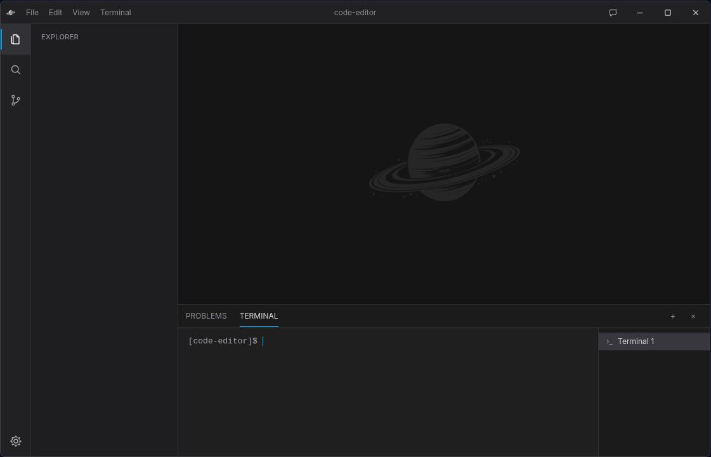

# Code Editor

A desktop Electron code editor with CodeMirror editing, persistent settings, local media viewers, a real integrated terminal, diagnostics, Markdown preview, and optional Ollama chat.



## Features

- Open folders as workspaces with a lazy, live-updating Explorer tree
- Create, rename, move, copy, reveal, and trash project files and folders
- Open, edit, save, and reopen source files with language-aware CodeMirror support
- Persistent editor settings, recent files, shortcuts, syntax color schemes, and unsaved-document shutdown handling
- Persistent shell sessions rendered with xterm.js and backed by `node-pty`
- Ruff, ESLint, TypeScript, Stylelint, HTML, JSON, YAML, Markdown, and parser-based diagnostics
- Problems panel, editor squiggles, gutter markers, and diagnostic hover messages
- Image, video, audio, PDF, and unsupported-binary viewer tabs
- Editable Markdown files with GitHub-flavored preview and highlighted code blocks
- Local Ollama chat with model selection, streaming responses, text/image attachments, and optional voice transcription

System utilities such as Python, Git, compilers, and interpreters are not bundled. Commands entered in the terminal use programs available through the user's normal `PATH`.

## Installation

`node-pty` is a native Electron dependency. A normal install runs `@electron/rebuild`; the machine therefore needs the usual native Node build toolchain. On Arch Linux, that generally means `base-devel` and Python for `node-gyp`.

```bash
npm install
npm run dev
```

Ollama is optional. When it is installed and running locally, the AI panel discovers models through `http://127.0.0.1:11434` by default.

## Verification

```bash
npm run format
npm run lint
npm run typecheck
npm test
npm run test:electron-runtime
npm run build
```

`npm run verify:full` runs the complete verification sequence. The development application can then be launched with `npm run dev`.

## Third-party notices

See [THIRD_PARTY_NOTICES.md](./THIRD_PARTY_NOTICES.md).
