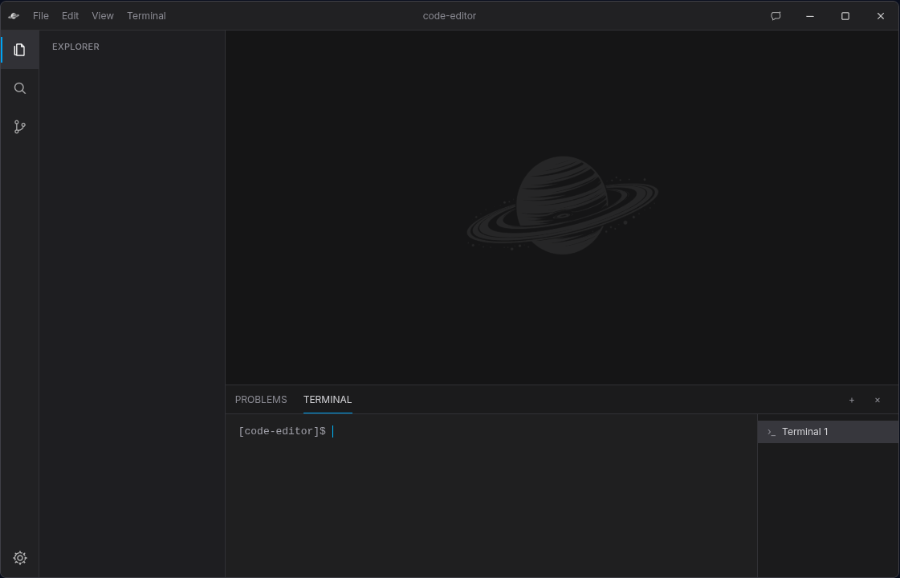

# Code Editor

A desktop Electron code editor with CodeMirror editing, persistent settings, local media viewers, a real integrated terminal, diagnostics, Markdown preview, and an integrated migrated IRIS agent/backend platform. The visible editor shell is intentionally still the Code Editor; agentic capabilities are being connected to its existing Chat, Search, Settings, Explorer, Browser, and Terminal surfaces in stages.



## Features

- Open folders as workspaces with a lazy, live-updating Explorer tree
- Create, rename, move, copy, reveal, and trash project files and folders
- Open, edit, save, and reopen source files with language-aware CodeMirror support
- Persistent editor settings, recent files, shortcuts, syntax color schemes, and unsaved-document shutdown handling
- Persistent shell sessions rendered with xterm.js and backed by `node-pty`
- Ruff, ESLint, TypeScript, Stylelint, HTML, JSON, YAML, Markdown, and parser-based diagnostics
- Problems panel, editor squiggles, gutter markers, and diagnostic hover messages
- Image, video, audio, PDF, and unsupported-binary viewer tabs
- Editable Markdown files with GitHub-flavored preview and highlighted code blocks
- IRIS Agent Chat with configured provider/model execution, encrypted history, durable project runs, editor-aware workspace file editing, text/image attachments, and optional voice transcription
- Migrated IRIS agent runtime, canonical tools/broker, provider layer, skills, multi-agent orchestration, model health/routing, semantic filesystem/RAG, web research, encrypted persistence, credentials, audio/vision/automation/launcher backends
- OS-protected credential storage and encrypted local SQLite platform persistence
- Authenticated loopback capability bridge with capability permissions and emergency-stop foundation

System utilities such as Python, Git, compilers, and interpreters are not bundled. Commands entered in the terminal use programs available through the user's normal `PATH`.

## IRIS backend migration

This repository contains a bulk migration of the reusable IRIS platform/backend. IRIS presentation code such as the Orb/planet launcher, old panel shell, duplicate editor/file-manager UI, and old multi-window presentation is intentionally omitted. Existing Code Editor UI components remain the product frontend.

The platform source is organized under `src/platform/`, `src/platform-features/`, `backend/`, and `electron/platform/`. Some migrated systems are intentionally present before their Code Editor UI integration is complete.

See:

- [`docs/migration/MIGRATION_PLAN.md`](./docs/migration/MIGRATION_PLAN.md) — migration architecture and SDLC plan
- [`IRIS_MIGRATION.md`](./IRIS_MIGRATION.md) — subsystem status and integration ledger
- [`docs/migration/MIGRATED_FILES.md`](./docs/migration/MIGRATED_FILES.md) — one-by-one source/destination file map
- [`docs/migration/UNWIRED_BACKEND.md`](./docs/migration/UNWIRED_BACKEND.md) — migrated functionality not yet surfaced by the editor UI
- [`docs/migration/VALIDATION_REPORT.md`](./docs/migration/VALIDATION_REPORT.md) — archive/hash/import/syntax validation and remaining dependency-aware checks

## Installation

`node-pty` is a native Electron dependency, and the migrated backend also uses SQLite and Sharp. A normal install runs `@electron/rebuild`; the machine therefore needs the usual native Node build toolchain. On Arch Linux, that generally means `base-devel` and Python for `node-gyp`.

```bash
npm install
npm run dev
```

Ollama is optional and remains available through the migrated local-provider backend. Cloud/local provider credentials, model discovery, role assignments, routing, autonomy limits, skills, and semantic-index settings are exposed through the Code Editor's AI Settings UI.

The secure IRIS platform initializes before the renderer. On Linux, Electron must have a real OS secret-storage backend; the application intentionally refuses the insecure `basic_text` fallback.

## Verification

```bash
npm run format
npm run lint
npm run typecheck
npm test
npm run test:electron-runtime
npm run build
```

`npm run verify:full` runs the complete verification sequence. The development application can then be launched with `npm run dev`.

## Third-party notices

See [THIRD_PARTY_NOTICES.md](./THIRD_PARTY_NOTICES.md).
