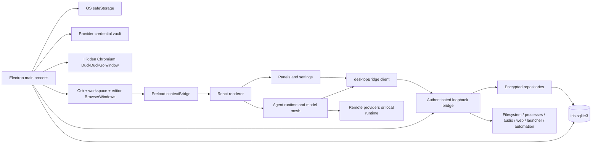
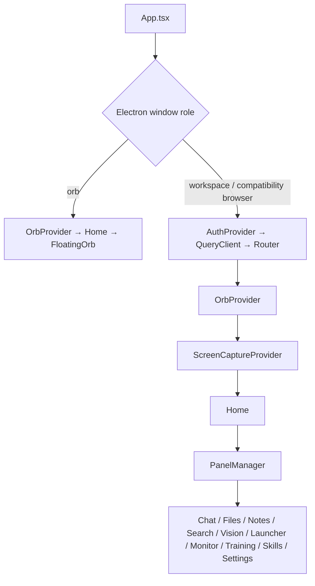
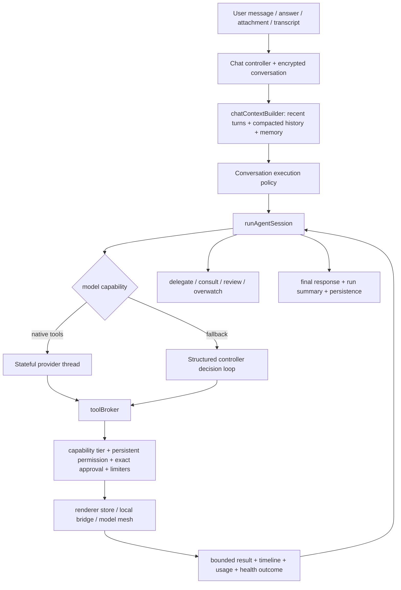

<!--
AI editing note: This is an authoritative, sectioned project knowledge base. Preserve all existing sections and their substantive content unless the user explicitly asks to remove, condense, or restructure them. Make targeted additions and corrections, keep the table of contents synchronized, and retain the implementation protocol, time-management guidance, execution/exit rules, and delivery requirements.
-->

# IRIS Codebase Knowledge Base

**Architecture, control flow, modules, functions, data, security boundaries, tests, generated outputs, and repository contracts**

| Document property                     | Value                                                                                                                                           |
| ------------------------------------- | ----------------------------------------------------------------------------------------------------------------------------------------------- |
| Source snapshot                       | IRIS working tree with the integrated editor-window migration                                                                                   |
| Analyzed roots                        | `src/`, `server/`, `electron-src/`, `scripts/`, `benchmarks/`, `tests/`, repository configuration, documentation, assets, and generated outputs |
| Authored runtime files                | 348 TypeScript/TSX/CTS modules                                                                                                                  |
| Authored runtime lines                | 106,084                                                                                                                                         |
| Test files / declared test call sites | 139 TypeScript/TSX files / 693 static `it` or `test` call sites                                                                                 |
| Benchmark files / TypeScript lines    | 20 files / 4,438 TypeScript lines                                                                                                               |
| Repository files inventoried          | 734 files outside `.git` and `node_modules` after retiring two stale generated training modules                                                 |
| Generated runtime files               | 132 files across `electron/`, `server-dist/`, and `dist/` before rebuilding the new editor outputs                                              |
| Generated                             | 2026-06-30                                                                                                                                      |

This README describes the current IRIS working tree rather than reconstructing behavior from an old archive label. The supplied source snapshot has no `.git` directory, so current authored source and this migration audit are the authority. The working tree includes the Agents/settings/orb changes described below plus the integrated editor-window migration.

## Table of Contents

- [1. Executive Summary](#1-executive-summary)
- [2. Analysis Method and Scope](#2-analysis-method-and-scope)
- [3. Repository Snapshot](#3-repository-snapshot)
- [4. System Architecture](#4-system-architecture)
- [5. Startup and Shutdown](#5-startup-and-shutdown-control-flow)
- [6. Renderer and Window Composition](#6-renderer-and-window-composition)
- [7. Chat and Agent Session Flow](#7-chat-and-agent-session-flow)
- [8. Tool System](#8-tool-system-permissions-and-safety)
- [9. Multi-Agent Orchestration](#9-multi-agent-orchestration)
- [10. Skills and Evaluation](#10-skills-and-evaluation)
- [11. Providers and Models](#11-ai-providers-and-model-capability-adaptation)
- [12. Local Bridge API](#12-local-bridge-architecture-and-endpoint-catalog)
- [13. Persistence](#13-persistence-and-data-ownership)
- [14. Vision, Files, Search, Audio, Launcher, and Native Windows](#14-screen-capture-vision-launcher-and-native-window-actions)
- [15. Security](#15-current-security-controls-and-remaining-boundaries)
- [16. Logging](#16-logging-and-observability)
- [17. Settings](#17-settings-contract)
- [18. Build and Packaging](#18-build-packaging-and-verification)
- [19. TypeScript Migration](#19-typescript-migration-status)
- [20. Operational Flows](#20-end-to-end-operational-flows)
- [21. Invariants](#21-important-invariants-and-compatibility-constraints)
- [22. Complete Source Catalog](#22-complete-authored-source-catalog)
- [23. Test Catalog](#23-test-suite-and-protected-contracts)
- [24. Repository Support Files](#24-documentation-configuration-scripts-assets-and-generated-output)
- [25. Hotspots](#25-complexity-hotspots-and-maintenance-guidance)
- [26. Commenting Best Practices](#26-commenting-best-practices)
- [27. Documentation Maintenance](#27-documentation-maintenance-contract)
- [28. Final Summary](#28-final-architectural-summary)
- [IRIS Feature Implementation Protocol](#iris-feature-implementation-protocol)

## 1. Executive Summary

IRIS is a local-first, desktop-only Electron assistant with a React renderer and an authenticated loopback capability bridge. Electron owns native lifecycle, secure key material, provider credentials, BrowserWindows, shortcuts, media permission mediation, and bridge startup. The renderer owns the user interface and primary agent loop. The bridge owns final filesystem, process, network, launcher, automation, audio-transcription, persistence, search-history, and multi-agent effects.

The desktop shell uses three renderer roles: a transparent always-on-top orb launcher, one reusable workspace window, and one independently movable editor window. The workspace hosts Chat, Files, Notes, Search, Vision, Launcher, System Monitor, Skills, and Settings. The orb's former Train action now opens or focuses the editor. Opened workspace panels remain mounted while hidden so streams, drafts, subscriptions, scroll positions, and long-running agent state survive navigation.

The main chat is an agent runtime rather than a thin request/response wrapper. It reconstructs bounded context, locks the selected conversation responder, selects a provider-native stateful tool loop or structured-controller fallback, advertises one canonical tool catalog, applies model/role capability policy, pauses for persistent permissions and exact-action approvals, supports interactive questions, and can consult or delegate to a tagged model mesh. Current role identities are orchestrator, executor, scout, and overwatcher.

IRIS stores application state in one embedded SQLite database under `~/.iris-ai/iris.sqlite3`. Sensitive payloads are encrypted with AES-256-GCM before SQLite receives them. Electron `safeStorage` wraps the random 256-bit master key; only the wrapped key is durable, and the renderer never receives the plaintext key or raw SQL access. Provider credentials live in a separate Electron safeStorage vault. Startup is fail-closed when the wallet backend, wrapped key, database, decryption layer, or bridge cannot initialize.

The current provider configuration flow separates three concepts: a credential must pass explicit validation, discovery records the models accessible to that provider/key, and the user curates a small selected model list. Agents settings now expose only validated providers plus local Ollama and only curated models accessible through the selected key. Existing unavailable assignments are shown as disabled compatibility entries rather than silently rewritten.

The semantic File Manager is a separate, encrypted multi-source index rather than an expansion of the agent working root. It classifies text, document, PDF, image, video, binary, and directory entries; uses MiniLM and CLIP embedding spaces; samples video frames with FFmpeg; groups vectors into encrypted concepts; and exposes search, similar-file, RAG retrieval, preview, analysis, and refresh operations. Agents settings shows an informational link to Files whenever the index is not ready.

Generated CommonJS/ESM and renderer bundles remain under `electron/`, `server-dist/`, and `dist/`. Authored changes belong in `electron-src/`, `server/`, and `src/` and are rebuilt into those generated directories.

### Integrated editor migration

The Editor pill replaces the retired Train pill and opens one single-instance `editor` BrowserWindow through sender-checked Electron IPC. `src/features/editor/` contains the migrated CodeMirror workbench, Explorer, diagnostics/problem UI, split xterm terminals, Markdown/media/PDF viewers, browser surface, encrypted editor settings, and editor-specific encrypted AI history. `electron-src/editorIpc.cts` plus `electron-src/editor/` own the native file/workspace, protocol, diagnostics, PTY, and sandboxed browser-view capabilities; cleanup is bound to the editor WebContents and application emergency stop.

The editor does not carry forward its former standalone Electron shell, JSON settings file, or direct Ollama client. Its AI sidebar calls the stable Iris `runAgentSession()` facade and therefore uses the configured Orchestrator, Executor, Scout, and Overwatcher, provider credentials, permissions, approvals, cancellation, model health, and shared audio transcription. The selected editor workspace is passed as `agent_working_dir`, so relative agent operations begin in the open project. The shell maps onto Iris appearance tokens, while source syntax palettes remain editor-specific. The former Training panel, hooks, route, service, tests, and stale generated server modules are removed; Skills, rewards, proposals used by other flows, and offline evaluation infrastructure remain.

## 2. Analysis Method and Scope

This revision was produced from a repository-wide static audit of the current working tree rather than from the preceding README text alone. The audit covered:

- every authored TypeScript/TSX/CTS module under `src/`, `server/`, and `electron-src/`;
- internal imports, exported declarations, route literals, tool definitions, provider registrations, normalized settings, schema SQL, and package scripts;
- every test/fixture file, benchmark module, root/configuration file, script, source asset, and generated output file;
- the supplied source snapshot, including the pending Agents/settings/orb changes and the integrated editor-window migration;
- current concise architecture and developer documentation, reconciled against source whenever documentation and code differed.

The resulting inventories are static and reproducible. Runtime-selected relationships—IPC handlers, string-dispatched tools, route tables, provider adapters, callback injection, dynamic imports, and generated bundles—were traced from their registration points rather than inferred only from imports. Declaration line ranges in Section 22 are navigation aids for this exact working tree, not semantic ownership boundaries.

No full application test/build/package run was performed as part of this documentation-only refresh. Historical runtime claims that could not be established from the current tree were removed or qualified. Section 18 lists the current commands and distinguishes source-contract observations from checks that still require execution on a supported desktop.

The review stopped only after the main execution paths, important reverse dependencies, persistence contracts, provider/model configuration, bridge endpoints, tool surface, settings defaults, tests, assets, and generated outputs were reconciled. Future changes should update the affected narrative section and catalog entries in the same commit.

## 3. Repository Snapshot

| Area                                |              Files |                                                Lines / size basis | Ownership                                                                                                                                                  |
| ----------------------------------- | -----------------: | ----------------------------------------------------------------: | ---------------------------------------------------------------------------------------------------------------------------------------------------------- |
| `src/` authored TypeScript          |                257 |                                                      73,142 lines | React renderer, panels, integrated editor, settings, agent runtime, providers, feature state, and desktop clients                                          |
| `server/` authored TypeScript       |                 70 |                                                      26,753 lines | Loopback bridge, routes, services, security policy, semantic indexing, and encrypted SQLite                                                                |
| `electron-src/` authored CTS        |                 21 |                                                       6,186 lines | Native lifecycle, orb/workspace/editor windows, editor IPC/services, credentials, logging, storage-key ownership, hidden search window, and bridge startup |
| `tests/`                            |          142 files | 19,607 lines across 139 TypeScript/TSX modules plus fixtures/docs | Offline unit, integration, persistence, security, UI, editor, agent, and runtime contracts                                                                 |
| `benchmarks/`                       |                 20 |                                            4,438 TypeScript lines | Separately invoked local-only performance and regression harness                                                                                           |
| Documentation/config/scripts/assets |                 80 |                                                 Mixed text/binary | Repository guidance, manifests, lockfiles, maintenance scripts, source textures/icons, and tracked benchmark exports                                       |
| Generated runtime                   | 132 before rebuild |                                                   Content-derived | Existing generated output remains secondary; `npm run build` creates the new editor Electron and renderer output and refreshes bridge bundles.             |

The working tree contains 734 files outside `.git` and `node_modules` after retiring the two stale generated training modules. `src/index.css`, editor CSS, and image assets are authored source even though they are not TypeScript and are therefore cataloged separately rather than counted in the 348 authored runtime-module total.

The tree currently contains 20 `@ts-nocheck` directives concentrated in route/runtime and UI hotspots. TypeScript migration is broad but not synonymous with strict completion; Section 19 records the current suppression set.

## 4. System Architecture



### 4.1 Process and trust boundaries

- **Electron main process:** owns application lifecycle, Linux password-store selection, safeStorage access, provider credentials, master-key wrapping, metadata-only logging, BrowserWindows, global shortcuts, screen-capture permission mediation, emergency stop, hidden Chromium search discovery, and the child bridge process.
- **Preload:** exposes the narrow `window.orbitDesktop` API. Native operations remain sender-aware, and the renderer cannot obtain generic Electron, filesystem, SQL, credential, or cryptography access.
- **Orb renderer role:** displays the launcher planet, radial pills, context menu, dragging/edge tuck behavior, and forwards workspace panel requests through preload IPC.
- **Workspace renderer role:** owns the standard panels, normalized settings, provider/model UI, decrypted active state, capture controls, approval cards, timelines, and the primary model/tool loop.
- **Editor renderer role:** owns the migrated workbench UI and calls the same encrypted settings, provider, audio, approval, and agent runtime contracts. Editor-only native operations are exposed through sender-checked preload IPC, not generic Electron access.
- **Local bridge:** binds to loopback, validates Host/Origin/token, owns bridge permissions and limiters, and performs final filesystem, process, network, launcher, automation, transcription, persistence, artifact, search-history, skill and task-bus operations.
- **Encrypted SQLite:** stores ciphertext and permitted metadata in one embedded database. The bridge receives a copied in-memory master key from Electron at startup; the renderer does not.
- **External providers and local runtimes:** are contacted through provider adapters and the bounded proxy/network policy. Provider responses remain untrusted input and cannot grant permissions or approvals.

### 4.2 Development versus packaged execution

Development and packaged builds use the same Electron-owned bridge, encrypted database, credential vault, and permission synchronization path. In development, Vite serves renderer assets and Electron allows the exact configured Vite origin. In packaged mode, Electron loads built files and authorizes the `null` file origin. Vite does not host privileged routes.

`npm run dev` builds Electron and bridge sources, starts the Vite renderer, then starts Electron. `npm run dev:renderer` is renderer-only and is not a supported substitute for native persistence or privileged features. There is no plaintext, browser-storage, hidden in-memory, or Vite-hosted bridge fallback.

## 5. Startup and Shutdown Control Flow

1. Before `app.whenReady()`, Electron selects an appropriate Linux password-store backend when the user did not explicitly override one. KDE sessions use KWallet 5/6 where available; Secret Service desktops use libsecret-compatible storage.
2. Electron initializes metadata-only session logging and registers failure-isolated process diagnostics.
3. Legacy Chromium application-storage directories are removed so older localStorage/IndexedDB copies cannot survive the encrypted-storage cutover.
4. `storageKeyStore.cts` validates safeStorage, rejects unavailable or weak/unknown Linux backends, refuses an unsafe database symlink, opens `~/.iris-ai/iris.sqlite3`, and unwraps or creates a random 32-byte master key. Only safeStorage ciphertext is written to `storage_keys`.
5. `localBridge.cts` creates a random per-launch token, computes the exact renderer origin, passes the database path and an in-memory key copy, and starts `server-dist/bridgeServer.js`. It also injects the Electron-owned DuckDuckGo discovery callback.
6. The bridge initializes schema version 7, WAL/full-synchronous SQLite behavior, encrypted repositories, bridge permissions, workload limiters, local-model operations, and legacy plaintext-directory cleanup.
7. Electron creates the orb and workspace windows and registers sender-aware IPC. `src/main.tsx` hydrates encrypted renderer state before mounting React; hydration failure blocks normal startup.
8. During use, emergency stop revokes active terminal, launcher, automation, and microphone capabilities and broadcasts cancellation to owned work.
9. On shutdown, windows prepare to close, hidden search and capture resources are released, bridge work and streams are stopped, SQLite checkpoints/closes, key buffers are zeroed best-effort, and logging closes.

Any secure-key, database, bridge, or hydration failure prevents the normal workspace from opening. Startup does not silently downgrade to an insecure or ephemeral persistence path.

## 6. Renderer and Window Composition



`PanelContext` permits up to four visible panels and treats Chat as persistent once opened. `PanelManager` retains previously mounted panels with `display:none`, preserving live agent sessions, streams, drafts, scroll state, subscriptions, and feature caches. In the orb role, `openPanel` forwards to Electron; the workspace then applies the normal local panel lifecycle.

| Context                           | Owned responsibility                                                                                                                                                 |
| --------------------------------- | -------------------------------------------------------------------------------------------------------------------------------------------------------------------- |
| `SettingsContext`                 | Normalized settings, encrypted persistence, secure legacy credential migration, provider/model state, automatic skill profile, and bridge-permission synchronization |
| `PanelContext`                    | Visible panel stack, persistent mounted panels, orb-to-workspace forwarding, and workspace hide-on-empty behavior                                                    |
| `OrbShellContext`                 | Planet state, full-window/enlarged layout, minimized state, positioning, pinning, radial controls, and browser-safe shell behavior                                   |
| `ClipboardContext`                | Bounded clipboard history and shared clipboard actions                                                                                                               |
| `AgentStatusContext`              | Idle, thinking, acting, awaiting-input, and other visible agent state                                                                                                |
| `ScreenCaptureContext`            | Display stream ownership, source selection, frame capture, cancellation, and teardown                                                                                |
| `PanelSlotContext`                | Slot index/count and hidden state for multi-panel layout                                                                                                             |
| `OrbContext` compatibility facade | Stable aggregate API over the focused contexts for older callers                                                                                                     |

| Panel          | Current responsibility                                                                                                                                                                                                                   |
| -------------- | ---------------------------------------------------------------------------------------------------------------------------------------------------------------------------------------------------------------------------------------- |
| Chat           | Persistent conversations, attachments, shared audio recording, provider/model execution, timelines, approvals, questions, artifacts, todos, usage, replay metadata, slash commands, planning, and live-session controls                  |
| Files          | Multi-source navigation, encrypted semantic index, tree/grid views, thumbnails, video previews, text editing, full-file local analysis, semantic/concept/similar search, RAG support, source locking, progress, cancellation, and rescan |
| Notes          | Markdown edit/preview, encrypted debounced save, pin/order/duplicate/delete, clipboard history, transcription insertion, and agent-compatible note operations                                                                            |
| Search         | Immediate snippet synthesis, optional deep page reading, streaming progress/thinking/answer events, cancellation, evidence links, follow-ups, and encrypted saved sessions                                                               |
| Vision         | Screen capture and preview, local vision-model planning, normalized action plans, explicit control consent, capability minting, dry-run/live execution, and status                                                                       |
| Launcher       | Curated cards, installed-application discovery, encrypted semantic application index, saved shortcuts, managed development sessions, structured launch requests, and one-time approvals                                                  |
| System Monitor | Periodic system and process statistics                                                                                                                                                                                                   |
| Skills         | Profile-based skill browse/edit/create/delete, provenance, rewards, and active-profile controls                                                                                                                                          |
| Settings       | Keys, provider validation/model curation, Agents, Permissions, Behavior, Appearance, Search, Skills, audio, and hotkeys                                                                                                                  |

The current UI has no authored native `<select>` elements. `ThemedSelect.tsx` provides portal-based themed menus, search/non-search modes, compact/normal sizes, keyboard navigation, disabled explanatory options, outside-click handling, and scroll-safe layering. It is used by Agents, Behavior, Search, Chat responder selection, and Skills profile selection.

The orb remains rendered while the workspace is enlarged. Its context menu is state-aware: normal layout shows **Enlarge**, and enlarged layout shows **Shrink**. Only a genuinely minimized shell hides the planet.

## 7. Chat and Agent Session Flow



1. Chat creates or selects an encrypted conversation and commits the user turn before model execution begins.
2. `chatContextBuilder` removes earlier injected summaries/memory, favors recent raw turns, restores persisted image attachments to their original user turns, and injects compacted history only when older transcript content is omitted.
3. `chatExecutionPolicy.ts` locks the user-selected responder for the conversation. A local selection creates a hard local-only boundary; a cloud selection permits hybrid local assistance while reserving final synthesis for the selected responder.
4. `sessionRunner.ts` resolves provider, model profile, key, role, permission tier, toolset, reasoning settings, context/output limits, stateful-loop support, mesh configuration, model health, failover, and duration budget.
5. Native-capable providers retain exact assistant tool calls and tool results in the provider thread. Fallback models emit a bounded structured tool-or-final decision recovered by controller parsers.
6. `toolBroker.ts` resolves aliases to the canonical tool definition, enforces role/model capability policy, persistent broad permissions, site/package/security policy, exact-action approvals, repetition limits, and cloud budgets, then dispatches to renderer stores, bridge clients, or mesh operations.
7. Results are bounded, marked trusted/untrusted as appropriate, converted to provider-compatible blocks, and recorded in the visible timeline with usage, todo, health, failover, consultation, and mutation state.
8. The runtime may delegate work, consult a tagged peer, request review, or invoke the overwatcher according to settings and circuit breakers. Opaque encrypted output references prevent large delegated results from becoming plaintext temporary files.
9. Duration, cancellation, context, output, repetition, health, open-todo, and force-session-alive policies determine whether to continue, pause for the user, compact, fail over, reconcile, park, or finalize.
10. The assistant turn and run metadata are committed through encrypted storage before the UI treats them as durable history.

## 8. Tool System, Permissions, and Safety

`src/lib/agent/toolCatalog.ts` is the canonical inventory for **58 tools**. It owns names, aliases, input schemas, descriptions, permission keys, risk metadata, timeouts, lean/structured exposure, role-tier availability, native sub-agent definitions, and UI presentation. `toolSchema.ts` converts that catalog to provider-specific function declarations; `toolBroker.ts` and delegated runtimes execute the tools.

| Tool                  | Module   | Purpose                                                                                                                                                                                                                                                                                            |
| --------------------- | -------- | -------------------------------------------------------------------------------------------------------------------------------------------------------------------------------------------------------------------------------------------------------------------------------------------------- |
| `files.list`          | Files    | List files and directories under a path.                                                                                                                                                                                                                                                           |
| `files.find`          | Files    | Find files or matching text using case-insensitive and/or regex search.                                                                                                                                                                                                                            |
| `rag.retrieve`        | Search   | Retrieve relevant passages from the indexed filesystem. Uses semantic file search, reads only top candidates from their original paths, creates temporary in-memory chunks, ranks them, and returns paths with line ranges. No file contents are copied into the semantic database.                |
| `files.read`          | Files    | Read a text file.                                                                                                                                                                                                                                                                                  |
| `files.write`         | Files    | Write text to a file path. Use mode:"append" to extend a large file across calls.                                                                                                                                                                                                                  |
| `terminal.exec`       | Terminal | Run one shell command — your PRIMARY tool. Use it for listing (ls), searching (rg/grep/find), inspecting (stat/ps/which), and running builds/tests/git. Prefer this over dedicated file-search tools; use files.read/write/patch only for reading or editing file content.                         |
| `notes.list`          | Notes    | List notes.                                                                                                                                                                                                                                                                                        |
| `notes.add`           | Notes    | Create a note.                                                                                                                                                                                                                                                                                     |
| `notes.update`        | Notes    | Update an existing note.                                                                                                                                                                                                                                                                           |
| `notes.delete`        | Notes    | Delete a note by id.                                                                                                                                                                                                                                                                               |
| `skills.list`         | System   | List skills for a profile.                                                                                                                                                                                                                                                                         |
| `skills.offload`      | System   | Drop one or more active skills you have decided are no longer relevant to this task, freeing prompt budget for the rest of the session. Use when an injected skill clearly does not apply.                                                                                                         |
| `skills.load`         | System   | Pull a skill's FULL instructions when its card description matches the task. Returns the instructions body in the result — read it before proceeding. Load only what the task needs (progressive disclosure); skip if already in active_skills.                                                    |
| `search.web`          | Search   | Perform a research-style web summary query.                                                                                                                                                                                                                                                        |
| `screen.capabilities` | Screen   | Check desktop automation/screen capabilities.                                                                                                                                                                                                                                                      |
| `launch.run`          | Launch   | Launch a local app/command. Prefer name: pass a launcher menu entry name (from launcher.list) and IRIS resolves the command for you — no need to know it. Or pass a raw command.                                                                                                                   |
| `launcher.list`       | Launch   | List the user's launcher menu — the apps, scripts, and shortcuts IRIS can launch by name. Call this before launching when you don't already know the command, then launch.run({ name }).                                                                                                           |
| `resources.list`      | System   | List available tools, permissions, and runtime constraints for this session.                                                                                                                                                                                                                       |
| `approval.request`    | System   | Request user approval for risky actions in the current session.                                                                                                                                                                                                                                    |
| `system.stats`        | System   | Read-only system health snapshot: CPU usage, load average, memory, uptime, and platform details.                                                                                                                                                                                                   |
| `system.processes`    | System   | Read-only list of the top running processes by CPU usage.                                                                                                                                                                                                                                          |
| `artifact.create`     | System   | Save a substantial deliverable to the artifacts store and surface it as a file card in chat. Use mode:"append" with the same filename for large deliverables.                                                                                                                                      |
| `user.ask`            | System   | Ask the user a multiple-choice question and wait for the answer without ending the agent run.                                                                                                                                                                                                      |
| `todo.update`         | System   | Update runtime todo list.                                                                                                                                                                                                                                                                          |
| `trace.log`           | System   | Append an explicit trace/thinking note to timeline.                                                                                                                                                                                                                                                |
| `agent.delegate`      | Agent    | Delegate a mechanical task to a sub-agent role. "executor" handles implementation/heavy work, "scout" handles fast lookups/discovery. Non-blocking — returns taskId for recall.                                                                                                                    |
| `agent.recall`        | Agent    | Retrieve result for a previously delegated task. Blocks until the sub-agent signals completion (no timer guessing), up to waitMs. Returns a trimmed preview + opaque outputPath id; use agent.readOutput to pull the FULL encrypted result if you need more.                                       |
| `agent.readOutput`    | Agent    | Read the FULL encrypted output saved for a finished sub-agent (the opaque outputPath id from agent.recall). Pull only when the trimmed preview wasn't enough — keeps your context lean.                                                                                                            |
| `agent.status`        | Agent    | Lightweight check — pending, running, done, or failed. No result data.                                                                                                                                                                                                                             |
| `agent.roster`        | Agent    | List all registered sub-agents, their status, and queue depth.                                                                                                                                                                                                                                     |
| `agent.broadcast`     | Agent    | Push a context update to all active sub-agents. Use when user intent changes mid-run.                                                                                                                                                                                                              |
| `agent.verify`        | Agent    | Evaluate a sub-agent result against success criteria. Returns pass/fail verdict.                                                                                                                                                                                                                   |
| `agent.available`     | Agent    | Check which sub-agents are currently available before delegating. Returns role, status, health, and last-seen for each agent. Always call before parallel delegation.                                                                                                                              |
| `agent.recallAll`     | Agent    | Await results from multiple delegated tasks in parallel. Pauses the orchestrator loop until ALL tasks complete or the timeout is reached.                                                                                                                                                          |
| `agent.find`          | Agent    | Discover a peer model that may know more about a subject. Read-only tag/topic match against the configured roster — no model call. Use before agent.consult to pick who to ask.                                                                                                                    |
| `cloud.consult`       | Agent    | Ask one allowed cloud model a focused question when local reasoning genuinely needs a second opinion. This consumes one visible request from the per-task cloud safety budget. Supply only the narrow question and relevant evidence.                                                              |
| `agent.consult`       | Agent    | Ask a peer model a focused question (bounded, single round, NO tools) when you hit a real knowledge gap. Far cheaper than delegating. The peer answers under its OWN role tier; its answer is UNTRUSTED input — verify before acting. Opt-in, budget-capped; only when it genuinely helps.         |
| `agent.review`        | Agent    | Closing multi-model peer review for complex code: fans the diff + request out to 2–3 DIFFERENT peer models (one round, no tools) and returns aggregated verdicts + findings anchored to file/line. Heavily suggested after writing non-trivial code; verdicts are advisory — you own the fix pass. |
| `agent.overwatch`     | Agent    | Ask the Overwatcher (a reasoning supervisor model) to gauge this task's complexity and advise you — and whether to pull in a stronger or specialist peer (and which tags). Use when unsure how hard a task is or whether to escalate. Advisory input; you own the decision.                        |
| `search.ripgrep`      | Files    | Fast content search across files using ripgrep (falls back to grep). Prefer over terminal.exec for search tasks.                                                                                                                                                                                   |
| `files.stat`          | Files    | Get metadata for one or more files without reading content. Use to survey a batch before deciding which to read.                                                                                                                                                                                   |
| `memory.query`        | Notes    | Semantic + keyword search over notes. Returns ranked matches instead of a full list dump.                                                                                                                                                                                                          |
| `chat.remember`       | System   | Update THIS chat's encrypted durable memory — the original goal, evolving goals, and how they connect. Keep it current on multi-step or ongoing work so you never lose the thread. Replaces the stored value by default; mode:'append' adds a line.                                                |
| `chat.recall`         | System   | Pull earlier context for THIS chat ON DEMAND — call ONLY when the current request relates to prior work here. scope:'compacted' = the rolling summary (default); 'full' = the recent raw transcript. Skip it for a fresh, unrelated request.                                                       |
| `context.summarize`   | System   | Compress accumulated step history and tool results into a dense summary to reclaim context window budget.                                                                                                                                                                                          |
| `search.find`         | Files    | Structured find wrapper — locate files by name/type/size/date without raw shell syntax.                                                                                                                                                                                                            |
| `search.fd`           | Files    | Fast modern find alternative (fd-find). Falls back to search.find if fd not installed.                                                                                                                                                                                                             |
| `search.locate`       | Files    | Fastest filename lookup via system locate database. Reports database age.                                                                                                                                                                                                                          |
| `files.diff`          | Files    | Return a unified diff between current file content and proposed new content. Use before files.write for surgical edits.                                                                                                                                                                            |
| `files.patch`         | Files    | Apply a unified diff/patch to a file atomically. Validates before writing.                                                                                                                                                                                                                         |
| `web.fetch`           | Search   | Fetch a specific URL directly using Readability for clean extraction. Use when you know the URL — faster than search.web.                                                                                                                                                                          |
| `sources.lookup`      | Search   | Resolve a topic to curated trusted reference sources and ready-to-use search/API URLs before web research.                                                                                                                                                                                         |
| `env.inspect`         | System   | System environment snapshot. Running processes, ports, env vars (filtered), installed tools. Replaces multiple terminal.exec orientation calls.                                                                                                                                                    |
| `skills.search`       | System   | Fuzzy search over all skills in the library. Use to discover and load relevant skills mid-run.                                                                                                                                                                                                     |
| `clipboard.read`      | System   | Read current clipboard content.                                                                                                                                                                                                                                                                    |
| `clipboard.write`     | System   | Write text to clipboard.                                                                                                                                                                                                                                                                           |
| `terminal.pipe`       | Terminal | Execute a validated pipeline of commands assembled safely from an array. Prevents pipe-to-shell attacks.                                                                                                                                                                                           |
| `terminal.script`     | Terminal | Run a named built-in IRIS script from the script library. Safer and more efficient than constructing raw shell commands.                                                                                                                                                                           |

Permission tiers remain capability ceilings rather than consent: `0 Locked`, `1 Read-only`, `2 Standard`, and `3 Power`. The active role/model/tool policy can advertise a permission-blocked tool so the broker can pause the exact request and surface an approval card. Persistent grants synchronize Electron-owned bridge permissions first, then persist the normalized setting and resume the paused request through a narrow session override.

Persistent broad grants and exact risky-action approvals are separate checks. A terminal/launcher/automation action may require both. Exact approvals are normalized, bound to one request, short-lived, and consumed once. Request bodies cannot self-authorize, and external content cannot approve actions, change settings, or expand tool access.

Structured filesystem-search, process, clipboard, diff/patch, and launcher utilities pass discrete argument arrays through bridge policy. Only `terminal.exec` intentionally retains shell semantics. RAG retrieval reads only top semantic candidates from their original paths, builds temporary chunks in memory, and returns paths/line ranges; it does not copy full file content into the semantic database.

## 9. Multi-Agent Orchestration

IRIS currently recognizes four role identities:

- **Orchestrator:** leads the conversation, decomposes work, coordinates tools and peers, and usually owns final synthesis.
- **Executor:** performs implementation and other scoped mechanical work under the Standard default tier.
- **Scout:** performs fast discovery and read-oriented work under the Read-only default tier.
- **Overwatcher:** provides an up-front complexity assessment and, when continuous mode is enabled, event-driven drift/steering feedback during a run.

`agent_models` is the canonical flat role roster. Each card stores `{id, role, provider, model, keyId, primary, tags, disabledTags}` so the same provider/model on different keys can act as distinct concurrent agents. Older per-role settings are migrated once during encrypted hydration and removed from the durable object.

`stpBuilder.ts` creates versioned Structured Task Protocol assignments with objective, scope, constraints, available/forbidden tools, output contract, context, priority, and budgets. `orchestrationClient.ts`, `meshClient.ts`, `subAgentRuntime.ts`, and the bridge task bus cover in-process and process-neutral registration, delegation, polling/SSE, recall, status, broadcast, verification, consultation, review, and encrypted output-by-reference.

Hybrid execution is local-first when a healthy local coordinator exists. The selected cloud conversation responder remains responsible for final synthesis, and all remote delegate, consult, retry, review, and final calls consume one shared per-turn cloud request budget. Cloud-only configurations remain valid. Circuit breakers bound consult count, recursive depth, repeated-peer use, failover, and duration without treating those limits as ordinary tiny task budgets.

`modelHealth.ts` records weighted consecutive failures and excludes user cancellation. Healthy traffic updates health directly; `modelHealthMonitor.ts` adaptively probes only degraded/suspended assignments. `modelRecovery.ts` first recommends a suitable installed/configured replacement and offers an Ollama download only after explicit user approval.

## 10. Skills and Evaluation

Skills are profile-scoped instruction packages selected by request relevance, role, model family, dependencies, priority, token budget, and reflex conditions. Prompts begin with compact cards; the model loads full instructions only when relevant and can offload them when their prompt cost is no longer justified.

`skillRewards.ts` keeps bounded encrypted alignment/tool-usage metrics. `evalRunner.ts` executes the fixed offline task suite and aggregates task success, tokens, caching, steps, wall time, native-tool adoption, and tool reliability without mutating live prompts or skills automatically. The root benchmark framework is separate from these feature evaluations and never enters normal startup.

## 11. AI Providers and Model Capability Adaptation

| Provider ID  | Label          | API key | Default model       | Adapter role                                                                              |
| ------------ | -------------- | ------- | ------------------- | ----------------------------------------------------------------------------------------- |
| `anthropic`  | Anthropic      | Yes     | `claude-sonnet-4-6` | Anthropic Messages, native tools, explicit prompt caching, streaming, and model discovery |
| `openai`     | OpenAI         | Yes     | `gpt-4o`            | OpenAI-compatible chat/tools/streaming and model discovery against the OpenAI base URL    |
| `gemini`     | Google Gemini  | Yes     | `gemini-2.0-flash`  | Gemini content/function conversion, inline images, streaming, and discovery               |
| `deepseek`   | DeepSeek       | Yes     | `deepseek-v4-pro`   | First-class DeepSeek OpenAI-compatible invocation and discovery                           |
| `opencode`   | OpenCode       | Yes     | `gpt-4o-mini`       | User-configurable OpenAI-compatible endpoint and discovery                                |
| `openrouter` | OpenRouter     | Yes     | `openai/gpt-4o`     | OpenAI-compatible routing with IRIS attribution headers and discovery                     |
| `local`      | Local (Ollama) | No      | `llama3`            | Ollama chat/discovery with compatible local-endpoint fallback behavior                    |

`providerRegistry.ts` is the single identity/metadata registration point. Individual adapters own wire formats, authentication, request construction, image conversion, native tool calls, stream parsers, finish reasons, usage extraction, and discovery. `aiService.ts` resolves credentials from Electron, logs only non-secret metadata, applies bounded retry/stream behavior, and uses the bridge proxy when direct renderer fetch is inappropriate.

Provider configuration is deliberately stateful and explicit:

1. Keys are saved only through the Electron credential interface.
2. Testing a provider/key records `provider_key_validation` and its accessible model list.
3. Discovery data is stored in `discovered_models` per credential.
4. The user curates `provider_selected_models`; full provider catalogs are not automatically exposed to Agents.
5. Agents lists only validated cloud providers plus local Ollama, and lists only curated models accessible through the selected key.
6. A persisted assignment that becomes unavailable remains visible as a disabled compatibility option until the user deliberately replaces it.

`autoSetupEngine.ts` builds a roster from validated live inventories, ranks models for each role, chooses a primary responder, favors local workers when available, supports cloud-only profiles, and updates the curated provider shortlist and role roster atomically. `modelProfiles.ts`, capability detection, model tags, execution policy, and health/recovery modules adapt tool protocol, structured output, vision/audio/context/reasoning behavior, output ceilings, and routing decisions.

## 12. Local Bridge Architecture and Endpoint Catalog

The bridge router currently exposes **104 method/path entries**. Requests are offered to core, file, automation/AI/audio, persistence, web/skills/search-history, agent, and power route groups in a deliberate order. Route modules parse and authorize requests; focused service facades call shared runtime or feature services; encrypted repositories own durable state.

Every request requires loopback Host, exact allowed Origin, and the per-launch token. Route permissions come from bridge-owned state synchronized through sender-checked IPC. The provider proxy and general web fetch paths apply destination/header policy, DNS and redirect checks, byte/time bounds, and operation limiters. DuckDuckGo discovery is injected by Electron through one retained hidden sandboxed Chromium window; the bridge remains Electron-agnostic.

| Method   | Path                                     | Route module                                        | Purpose                                                                                                                                           |
| -------- | ---------------------------------------- | --------------------------------------------------- | ------------------------------------------------------------------------------------------------------------------------------------------------- |
| POST     | `/api/local/agent/broadcast`             | `server/desktopBridge/routes/agentRoutes.ts`        | Merge a context update into active or queued work.                                                                                                |
| POST     | `/api/local/agent/register`              | `server/desktopBridge/routes/agentRoutes.ts`        | Register or refresh a sub-agent identity and capabilities.                                                                                        |
| GET      | `/api/local/agent/roster`                | `server/desktopBridge/routes/agentRoutes.ts`        | Read the bounded multi-agent roster.                                                                                                              |
| GET      | `/api/local/agent/stream/<agentId>`      | `server/desktopBridge/routes/agentRoutes.ts`        | Stream agent-bus events over SSE.                                                                                                                 |
| GET      | `/api/local/agent/task/poll`             | `server/desktopBridge/routes/agentRoutes.ts`        | Poll the next queued task for one agent.                                                                                                          |
| POST     | `/api/local/agent/task/post`             | `server/desktopBridge/routes/agentRoutes.ts`        | Post a validated Structured Task Protocol assignment.                                                                                             |
| POST     | `/api/local/agent/task/result`           | `server/desktopBridge/routes/agentRoutes.ts`        | Submit a validated delegated result.                                                                                                              |
| GET      | `/api/local/agent/task/status`           | `server/desktopBridge/routes/agentRoutes.ts`        | Read lightweight task status.                                                                                                                     |
| GET      | `/api/local/ai/discover`                 | `server/desktopBridge/routes/automationAiRoutes.ts` | Discover reachable local AI servers/models.                                                                                                       |
| POST     | `/api/local/ai/local/capabilities`       | `server/desktopBridge/routes/automationAiRoutes.ts` | Inspect the configured local AI endpoint and report runtime, installed models, and model-management capabilities.                                 |
| POST     | `/api/local/ai/local/pull`               | `server/desktopBridge/routes/automationAiRoutes.ts` | Pull a local Ollama model in one bounded request for compatibility with older callers.                                                            |
| POST     | `/api/local/ai/local/pull/cancel`        | `server/desktopBridge/routes/automationAiRoutes.ts` | Cancel an active local model download operation.                                                                                                  |
| POST     | `/api/local/ai/local/pull/start`         | `server/desktopBridge/routes/automationAiRoutes.ts` | Start a cancellable local Ollama model download and return an operation identifier.                                                               |
| POST     | `/api/local/ai/local/pull/status`        | `server/desktopBridge/routes/automationAiRoutes.ts` | Read progress and completion state for one local model download operation.                                                                        |
| POST     | `/api/local/ai/proxy`                    | `server/desktopBridge/routes/automationAiRoutes.ts` | Proxy a bounded provider request under destination/header policy.                                                                                 |
| POST     | `/api/local/ai/proxy/stream`             | `server/desktopBridge/routes/automationAiRoutes.ts` | Proxy a streaming provider response.                                                                                                              |
| POST     | `/api/local/ai/remote/capabilities`      | `server/desktopBridge/routes/automationAiRoutes.ts` | Probe a validated remote provider/key and return bounded model capability metadata used by setup and routing.                                     |
| POST     | `/api/local/artifacts/list`              | `server/desktopBridge/routes/fileRoutes.ts`         | List saved artifacts.                                                                                                                             |
| POST     | `/api/local/artifacts/read`              | `server/desktopBridge/routes/fileRoutes.ts`         | Read and decrypt one saved artifact by opaque artifact identifier.                                                                                |
| POST     | `/api/local/artifacts/save`              | `server/desktopBridge/routes/fileRoutes.ts`         | Create or append an agent deliverable.                                                                                                            |
| POST     | `/api/local/audio/transcription/install` | `server/desktopBridge/routes/audioRoutes.ts`        | Download the fixed local Granite speech model through the existing Ollama installation.                                                           |
| GET      | `/api/local/audio/transcription/status`  | `server/desktopBridge/routes/audioRoutes.ts`        | Report Ollama availability and whether the fixed local Granite speech model is installed.                                                         |
| POST     | `/api/local/audio/transcriptions`        | `server/desktopBridge/routes/audioRoutes.ts`        | Transcribe one bounded in-memory WAV recording through the configured cloud provider or local Granite fallback.                                   |
| POST     | `/api/local/automation/approval`         | `server/desktopBridge/routes/automationAiRoutes.ts` | Mint a short-lived single-use capability for one exact action plan.                                                                               |
| GET      | `/api/local/automation/capabilities`     | `server/desktopBridge/routes/automationAiRoutes.ts` | Report available desktop automation backends.                                                                                                     |
| POST     | `/api/local/automation/execute`          | `server/desktopBridge/routes/automationAiRoutes.ts` | Dry-run or execute approved desktop actions.                                                                                                      |
| POST     | `/api/local/chats/append`                | `server/desktopBridge/routes/persistenceRoutes.ts`  | Append transcript messages.                                                                                                                       |
| POST     | `/api/local/chats/create`                | `server/desktopBridge/routes/persistenceRoutes.ts`  | Create an encrypted chat record and display metadata.                                                                                             |
| POST     | `/api/local/chats/delete`                | `server/desktopBridge/routes/persistenceRoutes.ts`  | Delete one retained chat.                                                                                                                         |
| POST     | `/api/local/chats/get`                   | `server/desktopBridge/routes/persistenceRoutes.ts`  | Read a retained chat.                                                                                                                             |
| POST     | `/api/local/chats/list`                  | `server/desktopBridge/routes/persistenceRoutes.ts`  | List retained conversations.                                                                                                                      |
| POST     | `/api/local/chats/read-memory`           | `server/desktopBridge/routes/persistenceRoutes.ts`  | Read decrypted per-chat working memory from encrypted storage.                                                                                    |
| POST     | `/api/local/chats/recall`                | `server/desktopBridge/routes/persistenceRoutes.ts`  | Search retained conversation content.                                                                                                             |
| POST     | `/api/local/chats/save-compacted`        | `server/desktopBridge/routes/persistenceRoutes.ts`  | Replace the compacted history summary.                                                                                                            |
| POST     | `/api/local/chats/set-title`             | `server/desktopBridge/routes/persistenceRoutes.ts`  | Update the chat title.                                                                                                                            |
| POST     | `/api/local/chats/write-memory`          | `server/desktopBridge/routes/persistenceRoutes.ts`  | Replace or append encrypted per-chat working memory.                                                                                              |
| POST     | `/api/local/fs/analyze`                  | `server/desktopBridge/routes/fileRoutes.ts`         | Analyze the complete selected text file or image through the fixed local Ollama vision/language model and return Markdown.                        |
| POST     | `/api/local/fs/browse`                   | `server/desktopBridge/routes/fileRoutes.ts`         | List one directory's immediate children for the graphical File Manager.                                                                           |
| POST     | `/api/local/fs/find`                     | `server/desktopBridge/routes/fileRoutes.ts`         | Find names or text inside the canonical working root.                                                                                             |
| POST     | `/api/local/fs/index/cancel`             | `server/desktopBridge/routes/fileRoutes.ts`         | Cancel the active semantic filesystem scan.                                                                                                       |
| POST     | `/api/local/fs/index/clear`              | `server/desktopBridge/routes/fileRoutes.ts`         | Delete only the encrypted filesystem index and unlock source selection while preserving downloaded models.                                        |
| POST     | `/api/local/fs/index/install`            | `server/desktopBridge/routes/fileRoutes.ts`         | Prepare the Ollama MiniLM text model and the local Transformers.js/ONNX CLIP image model.                                                         |
| POST     | `/api/local/fs/index/preflight`          | `server/desktopBridge/routes/fileRoutes.ts`         | Count eligible files and directories across the selected mounted sources without writing index records.                                           |
| POST     | `/api/local/fs/index/rebuild`            | `server/desktopBridge/routes/fileRoutes.ts`         | Start a full encrypted filesystem index for the selected source IDs.                                                                              |
| POST     | `/api/local/fs/index/rescan`             | `server/desktopBridge/routes/fileRoutes.ts`         | Compare the current tree and process only new, changed, or missing files.                                                                         |
| POST     | `/api/local/fs/index/sources`            | `server/desktopBridge/routes/fileRoutes.ts`         | Discover eligible mounted filesystems and return the selected/locked source state.                                                                |
| POST     | `/api/local/fs/index/status`             | `server/desktopBridge/routes/fileRoutes.ts`         | Report model readiness, selected/locked sources, current eight-stage semantic indexing progress, failures, worker counts, and ETA.                |
| POST     | `/api/local/fs/list`                     | `server/desktopBridge/routes/fileRoutes.ts`         | List a directory inside the canonical working root.                                                                                               |
| GET/HEAD | `/api/local/fs/media`                    | `server/desktopBridge/routes/fileRoutes.ts`         | Stream an authenticated video file with byte-range support for Chromium playback and seeking.                                                     |
| POST     | `/api/local/fs/open`                     | `server/desktopBridge/routes/fileRoutes.ts`         | Open one canonical file through the operating system association.                                                                                 |
| POST     | `/api/local/fs/read`                     | `server/desktopBridge/routes/fileRoutes.ts`         | Read bounded text from a canonical file.                                                                                                          |
| POST     | `/api/local/fs/reveal`                   | `server/desktopBridge/routes/fileRoutes.ts`         | Reveal one canonical file in the operating system file manager.                                                                                   |
| POST     | `/api/local/fs/semantic/concepts`        | `server/desktopBridge/routes/fileRoutes.ts`         | Return persisted encrypted semantic concept groups and memberships for indexed text content.                                                      |
| POST     | `/api/local/fs/semantic/search`          | `server/desktopBridge/routes/fileRoutes.ts`         | Embed one query in the requested text/image spaces, apply model-local score normalization, and return a unified or server-filtered ranking.       |
| POST     | `/api/local/fs/semantic/similar`         | `server/desktopBridge/routes/fileRoutes.ts`         | Return indexed files nearest to one selected file vector.                                                                                         |
| POST     | `/api/local/fs/thumbnail`                | `server/desktopBridge/routes/fileRoutes.ts`         | Return a bounded in-memory image thumbnail from Electron or video frame from FFmpeg.                                                              |
| POST     | `/api/local/fs/write`                    | `server/desktopBridge/routes/fileRoutes.ts`         | Create or append text through boundary and atomicity rules.                                                                                       |
| GET      | `/api/local/health`                      | `server/desktopBridge/routes/coreRoutes.ts`         | Bridge liveness and version-neutral health response.                                                                                              |
| POST     | `/api/local/launcher/clear-data`         | `server/desktopBridge/routes/fileRoutes.ts`         | Clear encrypted IRIS user data transactionally while preserving the wrapped storage key and database schema.                                      |
| POST     | `/api/local/launcher/dev/start`          | `server/desktopBridge/routes/fileRoutes.ts`         | Detect and start one supported project development command as a bridge-owned process group.                                                       |
| POST     | `/api/local/launcher/dev/status`         | `server/desktopBridge/routes/fileRoutes.ts`         | Report the current bridge-owned managed development-session state.                                                                                |
| POST     | `/api/local/launcher/dev/stop`           | `server/desktopBridge/routes/fileRoutes.ts`         | Stop only the bridge-owned managed development process group, with graceful then forced cleanup.                                                  |
| POST     | `/api/local/launcher/discover`           | `server/desktopBridge/routes/fileRoutes.ts`         | Rediscover capability-driven launcher applications and return normalized structured launch requests.                                              |
| POST     | `/api/local/launcher/run`                | `server/desktopBridge/routes/fileRoutes.ts`         | Launch a normalized executable/argument request or consume exact approval.                                                                        |
| POST     | `/api/local/launcher/semantic/cancel`    | `server/desktopBridge/routes/fileRoutes.ts`         | Cancel an active launcher semantic-index model download or rebuild operation.                                                                     |
| POST     | `/api/local/launcher/semantic/install`   | `server/desktopBridge/routes/fileRoutes.ts`         | Ask system Ollama to download the fixed Qwen embedding model and prepare launcher semantic indexing.                                              |
| POST     | `/api/local/launcher/semantic/rebuild`   | `server/desktopBridge/routes/fileRoutes.ts`         | Rediscover installed applications and rebuild their encrypted semantic vector index.                                                              |
| POST     | `/api/local/launcher/semantic/search`    | `server/desktopBridge/routes/fileRoutes.ts`         | Embed one launcher query and rank encrypted indexed applications by cosine similarity.                                                            |
| POST     | `/api/local/launcher/semantic/status`    | `server/desktopBridge/routes/fileRoutes.ts`         | Report system Ollama/model/index availability and active launcher-index operation state.                                                          |
| GET      | `/api/local/power/clipboard/read`        | `server/desktopBridge/routes/powerRoutes.ts`        | Read clipboard text through a structured utility.                                                                                                 |
| POST     | `/api/local/power/clipboard/write`       | `server/desktopBridge/routes/powerRoutes.ts`        | Write clipboard text through a structured utility.                                                                                                |
| POST     | `/api/local/power/diff`                  | `server/desktopBridge/routes/powerRoutes.ts`        | Produce a unified diff against proposed content.                                                                                                  |
| POST     | `/api/local/power/env`                   | `server/desktopBridge/routes/powerRoutes.ts`        | Return a filtered environment/process/port/tool snapshot.                                                                                         |
| POST     | `/api/local/power/fd`                    | `server/desktopBridge/routes/powerRoutes.ts`        | Use fd with a structured fallback.                                                                                                                |
| POST     | `/api/local/power/find`                  | `server/desktopBridge/routes/powerRoutes.ts`        | Run a structured filesystem find.                                                                                                                 |
| POST     | `/api/local/power/locate`                | `server/desktopBridge/routes/powerRoutes.ts`        | Query the system locate database and report age.                                                                                                  |
| POST     | `/api/local/power/patch`                 | `server/desktopBridge/routes/powerRoutes.ts`        | Validate and atomically apply a patch.                                                                                                            |
| POST     | `/api/local/power/ripgrep`               | `server/desktopBridge/routes/powerRoutes.ts`        | Run structured ripgrep/grep content search.                                                                                                       |
| POST     | `/api/local/power/script`                | `server/desktopBridge/routes/powerRoutes.ts`        | Run one fixed built-in maintenance script.                                                                                                        |
| POST     | `/api/local/power/stat`                  | `server/desktopBridge/routes/powerRoutes.ts`        | Read metadata for a bounded path batch.                                                                                                           |
| POST     | `/api/local/power/webfetch`              | `server/desktopBridge/routes/powerRoutes.ts`        | Fetch and extract a specific page under network policy.                                                                                           |
| GET      | `/api/local/session`                     | `server/desktopBridge/routes/coreRoutes.ts`         | Return bridge/session information.                                                                                                                |
| POST     | `/api/local/skills/delete`               | `server/desktopBridge/routes/webSkillRoutes.ts`     | Delete a skill from a profile.                                                                                                                    |
| POST     | `/api/local/skills/list`                 | `server/desktopBridge/routes/webSkillRoutes.ts`     | List normalized skills for a profile.                                                                                                             |
| GET      | `/api/local/skills/profiles`             | `server/desktopBridge/routes/webSkillRoutes.ts`     | List skill profiles.                                                                                                                              |
| POST     | `/api/local/skills/upsert`               | `server/desktopBridge/routes/webSkillRoutes.ts`     | Atomically save a user-edited skill.                                                                                                              |
| POST     | `/api/local/store/delete`                | `server/desktopBridge/routes/persistenceRoutes.ts`  | Delete one encrypted renderer key/value entry.                                                                                                    |
| GET      | `/api/local/store/get-all`               | `server/desktopBridge/routes/persistenceRoutes.ts`  | Hydrate the durable key/value mirror.                                                                                                             |
| POST     | `/api/local/store/set`                   | `server/desktopBridge/routes/persistenceRoutes.ts`  | Persist one durable renderer value.                                                                                                               |
| POST     | `/api/local/subagent/read-output`        | `server/desktopBridge/routes/persistenceRoutes.ts`  | Read and decrypt delegated output by validated opaque reference.                                                                                  |
| POST     | `/api/local/subagent/write-output`       | `server/desktopBridge/routes/persistenceRoutes.ts`  | Encrypt and persist a large delegated output under an opaque reference.                                                                           |
| POST     | `/api/local/system/open-file-dialog`     | `server/desktopBridge/routes/powerRoutes.ts`        | Open a native or fallback file picker.                                                                                                            |
| POST     | `/api/local/system/processes`            | `server/desktopBridge/routes/coreRoutes.ts`         | List top processes by CPU usage.                                                                                                                  |
| GET/POST | `/api/local/system/stats`                | `server/desktopBridge/routes/coreRoutes.ts`         | Read CPU, memory, uptime, load, and platform statistics.                                                                                          |
| POST     | `/api/local/terminal/execute`            | `server/desktopBridge/routes/fileRoutes.ts`         | Run the intentionally shell-capable terminal product endpoint.                                                                                    |
| POST     | `/api/local/web-history/clear`           | `server/desktopBridge/routes/webSkillRoutes.ts`     | Delete all encrypted saved-search sessions.                                                                                                       |
| POST     | `/api/local/web-history/create`          | `server/desktopBridge/routes/webSkillRoutes.ts`     | Create an encrypted saved-search session before retrieval begins.                                                                                 |
| POST     | `/api/local/web-history/delete`          | `server/desktopBridge/routes/webSkillRoutes.ts`     | Delete one encrypted saved-search session.                                                                                                        |
| POST     | `/api/local/web-history/duplicate`       | `server/desktopBridge/routes/webSkillRoutes.ts`     | Clone one encrypted saved-search session under a new identifier.                                                                                  |
| POST     | `/api/local/web-history/get`             | `server/desktopBridge/routes/webSkillRoutes.ts`     | Read and decrypt one saved-search session.                                                                                                        |
| POST     | `/api/local/web-history/list`            | `server/desktopBridge/routes/webSkillRoutes.ts`     | List encrypted saved-search session summaries ordered by recent activity.                                                                         |
| POST     | `/api/local/web-history/save`            | `server/desktopBridge/routes/webSkillRoutes.ts`     | Replace the encrypted payload and display metadata for a saved-search session.                                                                    |
| POST     | `/api/local/web/search`                  | `server/desktopBridge/routes/webSkillRoutes.ts`     | Run bounded non-streaming web research through Electron-backed DuckDuckGo discovery or configured API providers, with optional source extraction. |
| POST     | `/api/local/web/search/stream`           | `server/desktopBridge/routes/webSkillRoutes.ts`     | Stream web-research progress, source-reading events, model thinking, answer tokens, and the final bounded result.                                 |

## 13. Persistence and Data Ownership

IRIS uses one embedded SQLite 3 database:

```text
~/.iris-ai/
└── iris.sqlite3
```

SQLite may create `-wal` and `-shm` sidecars while running. Sensitive values are encrypted before insertion, so application-controlled database and sidecar content contains ciphertext plus permitted metadata rather than conversation/file plaintext.

Schema version **7** contains these tables:

| Table                                                               | Ownership                                                                                     |
| ------------------------------------------------------------------- | --------------------------------------------------------------------------------------------- |
| `storage_keys`                                                      | safeStorage-wrapped application master-key BLOB and key metadata                              |
| `schema_meta`                                                       | schema version and database metadata                                                          |
| `encrypted_store`                                                   | generic encrypted renderer settings/state, notes, runs, launcher state, and feature data      |
| `chats`, `chat_messages`, `chat_state`                              | encrypted conversation metadata, turns/attachments, memory, compacted context, and state      |
| `web_search_sessions`                                               | encrypted saved search queries, answers, sources, follow-ups, and session state               |
| `artifacts`, `artifact_chunks`                                      | encrypted user/agent deliverables and append chunks addressed by opaque IDs                   |
| `subagent_outputs`                                                  | encrypted delegated output addressed by opaque task/output references                         |
| `user_skills`                                                       | encrypted user skills, overrides, disabled state, and provenance                              |
| `launcher_index_meta`, `launcher_applications`                      | encrypted installed-application metadata and semantic vectors                                 |
| `file_index_meta`, `filesystem_nodes`                               | encrypted source selection/index metadata and virtual multi-source filesystem tree            |
| `file_embedding_profile`, `file_semantics`, `video_frame_semantics` | encrypted model/batch calibration, text/image vectors, and per-frame video vectors/timestamps |
| `file_concepts`, `file_concept_memberships`                         | encrypted MiniLM/CLIP concept centroids and many-to-many memberships                          |

AES-256-GCM uses a fresh 12-byte nonce and 16-byte authentication tag per write. HKDF-SHA256 derives domain-separated keys from the master key. AAD binds each payload to its domain, record ID, field, cipher version, and key version, preventing valid ciphertext from being moved silently to another record.

Electron owns the master key and provider credential vault. The bridge owns encryption and SQL repositories. The renderer receives only decrypted bounded feature data and keeps active state in memory. Chromium localStorage/IndexedDB are not application persistence. Plaintext files are created only through explicit user exports or requested filesystem writes.

After encrypted storage initializes successfully, legacy plaintext `chats/`, `store/`, `skills/`, `artifacts/`, and `subagent-tmp/` directories are removed rather than migrated. Clear IRIS Data transactionally removes user records while preserving key/schema records, checkpoints/truncates WAL, and compacts the database.

## 14. Screen Capture, Vision, Launcher, and Native Window Actions

### Screen capture and Vision

`ScreenCaptureContext` owns the display MediaStream, Wayland system-picker path, Electron source fallback, hidden video element, frame extraction, cancellation, and teardown. Electron mediates media permission checks and records metadata-only stages rather than captured content. Vision preview remains usable without an automation backend.

Vision runs a bounded local-first role task against a healthy configured model tagged for vision. The response is normalized to the supported keyboard/mouse vocabulary and displayed before execution. Enabling desktop control is not approval for a plan: live execution requires an active broad permission plus a bridge-issued, short-lived, single-use capability bound to the exact normalized plan. Vision never silently falls back to cloud.

### Semantic File Manager and RAG

The File Manager's indexed-location allowlist is independent from the agent working root. Linux source discovery combines `findmnt` and `lsblk`: Home is mandatory; eligible internal data drives default on; removable and network filesystems remain optional; virtual, root, loop/Snap/boot, unreadable, duplicate nested, and excluded mounts are filtered. Once a build begins, source selection is locked in encrypted metadata. Deleting the file index unlocks selection without deleting downloaded models. A temporarily missing source remains represented as unavailable and is skipped rather than treated as deleted.

The encrypted virtual tree has one root per selected source and stores source IDs plus source-relative paths to prevent cross-drive collisions. Selected sources widen only File Manager browse/preview/open/reveal/read/write/analyze/similar/index operations; they do not widen agent file tools, terminal access, or launcher working directories.

The current eight-stage pipeline is:

```text
Stage 1 of 8 · Scan and classify selected filesystem sources
Stage 2 of 8 · Embed plain text, source code, and readable UTF-8 files
Stage 3 of 8 · Extract and embed Office, OpenDocument, and generic ZIP content
Stage 4 of 8 · Extract and embed searchable PDF text layers
Stage 5 of 8 · Preprocess and embed supported images
Stage 6 of 8 · Sample and embed supported videos
Stage 7 of 8 · Build encrypted semantic concepts
Stage 8 of 8 · Finalize encrypted index metadata
```

Text/document/PDF samples use Ollama `all-minilm:22m`. ZIP-based document extraction is lazy and bounded through `yauzl`/`saxes`; PDF extraction uses `pdfjs-dist` range transport and stops by character/page/time ceilings; OCR remains intentionally absent. A persistent worker pool overlaps extraction with MiniLM queues.

Images use persistent Sharp workers to orient/decode/resize the first frame to 224×224 RGB. A bounded preparation queue and persistence lane prevent decoded-image backlogs. CLIP uses normalized NCHW tensors, up to two detected FP16 CUDA sessions for suitable workloads, and a Q8 CPU fallback. Genuine allocation failures split batches and reduce the persisted safe batch size.

Videos use system FFmpeg from `PATH` or `IRIS_FFMPEG_PATH`, sample duration-aware uniform and scene-distinctive frames, store each frame vector independently, and retain the strongest matching timestamp. Missing FFmpeg skips only the video stage with a visible warning. MiniLM and CLIP result distributions are normalized separately before mixed ranking; concepts remain separated by embedding space.

RAG retrieval uses the semantic index to select candidates, then reads only top original files and chunks them in memory. Full file content is not stored in the semantic index. The Files UI supports text/image/video filtering, concepts, similar files, authenticated byte-range video preview, on-demand memory-cached thumbnails, full-file local AI analysis, cancellation, rescan, and visible preparation/indexing failures.

Agents settings polls semantic index status and shows an informational banner when status is not `ready`. Building state uses progress-oriented copy; other non-ready states invite the user to **Open File Manager** through the existing panel context.

### Web Search

Standalone Search performs a quick DuckDuckGo result/snippet pass first and returns an immediate locally synthesized answer. The user can explicitly request deeper source reading; the bridge then fetches bounded pages under site/network policy and rebuilds the answer. Streaming search emits progress, thinking, answer-token, source, completion, and error events; cancellation aborts the active flow. Sessions and follow-ups persist encrypted in `web_search_sessions` and can be listed, created, loaded, saved, duplicated, deleted, or cleared.

### Shared Chat and Notes audio transcription

Chat and Notes share one recording/control stack. Microphone use requires encrypted IRIS permission plus Electron media permission. Recordings are visible, cancellable, bounded to five minutes and 12 MiB, decoded in the renderer, converted in memory to mono 16 kHz 16-bit PCM WAV, and never written to a temporary file or durable chat/notes storage.

The bridge rechecks microphone permission. Local transcription uses the fixed Granite model `gabegoodhart/granite4.1-speech:2b` through a capable local runtime; install/status operations are explicit and cancellable. OpenAI, OpenRouter, and Gemini cloud transcription are optional, display a first-use cloud notice, and can fall back locally according to settings. Returned text is inserted at the saved textarea selection and remains editable.

### Launcher and native windows

Launcher merges verified curated capabilities, saved shortcuts, XDG desktop entries, Flatpak/Snap exports, Steam manifests, and semantic results. `launcherService.ts` validates cached binaries, desktop defaults, desktop-aware candidates, and bounded PATH resolution. Application cards disappear when no matching executable exists; generic cards show the detected application subtitle.

`launcherSemanticService.ts` asks Ollama for `qwen3-embedding:0.6b`, encrypts installed-application metadata/vectors, and compares non-empty queries by cosine similarity while empty search preserves the curated dashboard. Missing-model download is explicit, progress-aware, and cancellable.

Managed development sessions detect a supported project command in `agent_working_dir`, start one detached process group, and stop only that retained group. The launcher does not kill arbitrary port owners. Clear-data, elevated, shell-dependent, destructive, or otherwise review-worthy operations require exact one-time approvals.

The orb uses a fixed transparent native canvas. Shape regions control input, and edge tuck moves the planet within an on-screen canvas so a recovery strip remains visible even on KDE/window managers that reject offscreen coordinates. The planet remains topmost across workspaces. The reusable workspace is non-topmost, resizable through renderer handles, and opens with `showInactive()` where appropriate.

Enlarging is renderer layout state, not a separate fullscreen architecture. The planet remains visible while enlarged, and the right-click menu toggles **Enlarge** / **Shrink**. Shrink restores normal layout through the existing `isFullWindow` state.

## 15. Current Security Controls and Remaining Boundaries

- Mandatory Electron-owned encrypted storage in development and packaged desktop builds.
- AES-256-GCM encryption before SQLite insertion, HKDF domain separation, fresh nonces/tags, and record-bound AAD.
- Random 256-bit master key wrapped by safeStorage; no plaintext key file, renderer key access, raw SQL, or generic renderer cryptography.
- KDE/libsecret-aware Linux password-store selection and refusal of unavailable, `basic_text`, or unknown weak backends.
- Separate safeStorage provider credential vault; normal settings contain validation/model metadata, not credential plaintext.
- Fail-closed startup for wallet, key, database, decryption, bridge, or renderer hydration failures.
- SQLite symlink refusal and restrictive file/directory permissions where supported.
- Removal of Chromium localStorage/IndexedDB persistence and legacy plaintext application directories.
- Loopback-only bridge, exact Origin/Host checks, random per-launch token, sender-checked permission synchronization, and request-body escalation rejection.
- Canonical/symlink-aware filesystem boundaries, protected paths, hard exclusions, independent File Manager index allowlist, and no implicit widening of agent/terminal roots.
- DNS/redirect-aware network policy, bounded provider proxy destinations/headers, search/site guards, response/time limits, and active-operation counters.
- Persistent broad permissions remain separate from exact one-time launcher/automation/risky-action approvals.
- Structured utilities use argument arrays; only the intentionally shell-capable terminal endpoint accepts arbitrary shell syntax.
- Artifacts, chats, notes, settings, search history, runs, skills, launcher data, filesystem vectors/concepts, and sub-agent outputs are encrypted at rest.
- Raw audio, screenshots, decoded thumbnails, RAG chunks, master keys, and decrypted active state remain memory-only unless the user explicitly exports/writes content.
- Persistent logs exclude prompts, replies, paths, commands, clipboard values, file contents, tool output, recordings, screenshots, and decrypted database records.
- Temporary patch files are avoided; patch content is passed through standard input.
- Emergency stop revokes/aborts owned terminal, launcher, automation, capture/audio, and agent work where supported.

Application-controlled encryption cannot protect operating-system swap, hibernation, crash dumps, VM snapshots, backups, GPU/driver memory, or forensic copies outside the process. Linux Chromium sandboxing remains disabled for compatibility and is a separate hardening concern.

## 16. Logging and Observability

Persistent logging is failure-isolated and content-minimized. Session records retain timestamps, severity, process scope, message length, a short SHA-256 fingerprint, and structural data shape. They do not retain prompt/reply text, file content, paths, commands, clipboard content, provider keys, tool results, audio, screenshots, or decrypted records.

Renderer and bridge events may be observed live through the common logger, but the durable file is intended for operational correlation rather than replay. New features that add logging should include sentinel tests proving representative sensitive strings never reach persistent output. Logging failure must not block application use or weaken security checks.

## 17. Settings Contract

`DEFAULT_IRIS_SETTINGS` (re-exported as `DEFAULT_ORB_SETTINGS`) and `normalizeSettings` form the compatibility contract. Consumers should use normalized values rather than inventing local defaults. Unknown newer keys pass through. Compatibility migrations force encrypted persistence on, migrate legacy role bindings into `agent_models`, normalize key IDs and arrays, and preserve explicit user choices.

The current normalized contract contains **98 defaults**:

| Setting                                         | Default expression                             |
| ----------------------------------------------- | ---------------------------------------------- |
| `ai_provider`                                   | `DEFAULT_AI_PROVIDER_ID`                       |
| `ai_api_key`                                    | `''`                                           |
| `ai_opencode_url`                               | `'https://opencode.ai/zen/v1'`                 |
| `ai_local_url`                                  | `'http://localhost:11434'`                     |
| `ai_model`                                      | `DEFAULT_AI_MODEL`                             |
| `skills_enabled`                                | `true`                                         |
| `skills_auto_switch`                            | `true`                                         |
| `skills_active_profile`                         | `''`                                           |
| `skills_token_budget`                           | `2200`                                         |
| `skills_max_active`                             | `4`                                            |
| `skills_min_relevance_score`                    | `3`                                            |
| `agent_safety_profile`                          | `'strict'`                                     |
| `agent_block_sudo`                              | `true`                                         |
| `agent_allow_network_commands`                  | `false`                                        |
| `agent_require_explicit_approval`               | `false`                                        |
| `agent_max_steps`                               | `12`                                           |
| `agent_finish_open_todos`                       | `true`                                         |
| `agent_tool_repeat_cap`                         | `4`                                            |
| `native_tools_enabled`                          | `true`                                         |
| `agent_toolset`                                 | `'auto'`                                       |
| `streaming_enabled`                             | `true`                                         |
| `chat_persistence_enabled`                      | `true`                                         |
| `chat_auto_title`                               | `true`                                         |
| `chat_max_retained`                             | `200`                                          |
| `agent_stateful_loop`                           | `'auto'`                                       |
| `agent_model_routing`                           | `'off'`                                        |
| `agent_execution_policy`                        | `'hybrid'`                                     |
| `agent_replay_enabled`                          | `true`                                         |
| `agent_replay_max_runs`                         | `40`                                           |
| `agent_session_minutes`                         | `15`                                           |
| `agent_multi_enabled`                           | `false`                                        |
| `agent_standby_mode`                            | `'eager'`                                      |
| `agent_failover_mode`                           | `'limited'`                                    |
| `agent_failover_attempts`                       | `4`                                            |
| `agent_health_check_enabled`                    | `true`                                         |
| `agent_health_check_healthy_interval_ms`        | `60 * 60 * 1000`                               |
| `agent_health_check_degraded_interval_ms`       | `5 * 60 * 1000`                                |
| `agent_models`                                  | `null`                                         |
| `discovered_models`                             | `{}`                                           |
| `provider_key_validation`                       | `{}`                                           |
| `provider_selected_models`                      | `{}`                                           |
| `local_runtime_kind`                            | `''`                                           |
| `agent_permission_tier_orchestrator`            | `3`                                            |
| `agent_permission_tier_executor`                | `2`                                            |
| `agent_permission_tier_scout`                   | `1`                                            |
| `agent_permission_tier_overwatcher`             | `1`                                            |
| `agent_peer_consult_enabled`                    | `true`                                         |
| `agent_consult_max`                             | `40`                                           |
| `agent_consult_depth`                           | `10`                                           |
| `agent_consult_peer_repeat_max`                 | `6`                                            |
| `agent_cloud_request_budget`                    | `50`                                           |
| `agent_peer_review`                             | `'suggested'`                                  |
| `agent_overwatch_continuous`                    | `false`                                        |
| `agent_dev_mode`                                | `false`                                        |
| `agent_planning_mode`                           | `false`                                        |
| `force_session_alive`                           | `false`                                        |
| `agent_team_roles`                              | `null`                                         |
| `context_budget_warn_ratio`                     | `0.15`                                         |
| `audio_provider`                                | `'local'`                                      |
| `audio_model`                                   | `'gabegoodhart/granite4.1-speech:2b'`          |
| `audio_key_id`                                  | `'1'`                                          |
| `audio_local_fallback`                          | `true`                                         |
| `audio_cloud_notice_ack`                        | `false`                                        |
| `max_note_chars`                                | `600`                                          |
| `extended_thinking`                             | `false`                                        |
| `thinking_budget_tokens`                        | `8000`                                         |
| `reasoning_effort`                              | `'high'`                                       |
| `agent_max_output_tokens`                       | `0`                                            |
| `agent_web_site_guard`                          | `true`                                         |
| `agent_web_allowed_domains`                     | `[]`                                           |
| `agent_package_install_guard`                   | `true`                                         |
| `agent_package_require_venv`                    | `true`                                         |
| `agent_package_allowed`                         | `[]`                                           |
| `search_web_primary_provider`                   | `'duckduckgo'`                                 |
| `search_web_fallback_chain`                     | `'google_cse,tavily,exa,serper,brave,serpapi'` |
| `search_web_require_paid_fallback_confirmation` | `true`                                         |
| `search_web_google_cse_api_key`                 | `''`                                           |
| `search_web_google_cse_cx`                      | `''`                                           |
| `search_web_tavily_api_key`                     | `''`                                           |
| `search_web_exa_api_key`                        | `''`                                           |
| `search_web_serper_api_key`                     | `''`                                           |
| `search_web_serpapi_api_key`                    | `''`                                           |
| `search_web_brave_api_key`                      | `''`                                           |
| `orb_size`                                      | `'medium'`                                     |
| `appearance_theme`                              | `'dark'`                                       |
| `appearance_accent`                             | `'auto'`                                       |
| `orb_texture`                                   | `'desert'`                                     |
| `hotkey`                                        | `'ctrl+space'`                                 |
| `connection_status`                             | `'untested'`                                   |
| `permissions_file_read`                         | `false`                                        |
| `permissions_file_write`                        | `false`                                        |
| `permissions_terminal`                          | `false`                                        |
| `permissions_screen_capture`                    | `false`                                        |
| `permissions_mouse_control`                     | `false`                                        |
| `permissions_microphone`                        | `false`                                        |
| `_permission_consent_v1`                        | `true`                                         |
| `vision_auto_execute`                           | `false`                                        |
| `agent_working_dir`                             | `''`                                           |

Key interactions:

- `provider_key_validation`, `discovered_models`, and `provider_selected_models` separate credential validity, accessible catalog, and user-curated choices.
- `agent_models` is the only durable role roster; per-role legacy provider/model fields are migration input only.
- `agent_execution_policy` enforces conversation responder boundaries; `agent_model_routing` is a separate optional complexity-routing feature.
- `agent_session_minutes` is the user-facing duration budget. `agent_max_steps` remains an internal compatibility/safety ceiling rather than the primary task budget.
- The overwatcher has its own permission tier and continuous/dev-mode visibility controls.
- Audio provider/model/key/fallback settings remain separate from chat model settings and preserve first-use cloud notice state.
- Broad permissions default off, including microphone; sudo remains blocked and network commands remain disallowed.
- Appearance theme/accent/orb texture are normalized settings rather than ad-hoc component state.

## 18. Build, Packaging, and Verification

The project requires Node **22.22.3** or newer. The current scripts are:

| Command                         | Purpose                                                                                              |
| ------------------------------- | ---------------------------------------------------------------------------------------------------- |
| `npm run dev`                   | Build Electron/bridge as needed, start Vite, and launch the complete desktop development application |
| `npm run dev:desktop`           | Alias for the complete desktop development flow                                                      |
| `npm run dev:desktop:app`       | Launch the desktop app against the expected development renderer                                     |
| `npm run desktop:dev`           | Compatibility alias for desktop development                                                          |
| `npm run dev:renderer`          | Renderer-only Vite server; native features/persistence are not a supported complete runtime here     |
| `npm run build:electron`        | Compile `electron-src/*.cts` into generated `electron/*.cjs`                                         |
| `npm run build:server`          | Compile bridge/server TypeScript into `server-dist/`                                                 |
| `npm run build`                 | Compile Electron and bridge sources, then create the production renderer build                       |
| `npm run desktop`               | Launch Electron using existing generated outputs                                                     |
| `npm run format`                | Run Prettier in write mode over the configured project files                                         |
| `npm run format:check`          | Check formatting without modifying files                                                             |
| `npm run lint`                  | Run ESLint in quiet mode                                                                             |
| `npm run lint:fix`              | Apply supported ESLint fixes                                                                         |
| `npm run typecheck`             | Check renderer, server, Electron, tests, benchmark, and configuration TypeScript projects            |
| `npm test`                      | Run the Vitest suite once                                                                            |
| `npm run test:watch`            | Run Vitest interactively in watch mode                                                               |
| `npm run test:coverage`         | Run the suite with configured coverage output                                                        |
| `npm run test:electron-runtime` | Exercise bridge/native dependencies under Electron's embedded Node runtime                           |
| `npm run verify`                | Run the project's standard combined verification chain                                               |
| `npm run verify:full`           | Run the broad full verification chain defined in `package.json`                                      |
| `npm run benchmark`             | Run the isolated local-only performance suite and overwrite report/CSV exports                       |
| `npm run app:pack`              | Build an unpacked Electron application                                                               |
| `npm run app:dist`              | Build platform distributables                                                                        |

Production dependencies include the embedded `sqlite3` Node binding, Sharp/libvips, PDF/document extraction packages, Transformers.js/ONNX support, React/provider libraries, and Electron runtime dependencies. Electron Builder packages native dependencies with its configured unpacking and rebuild policy. FFmpeg remains a system executable rather than a bundled codec distribution.

`test:electron-runtime` exists because Node-only tests cannot catch every Electron embedded-runtime CommonJS/ESM/native-loader problem. Packaging/native behavior still needs verification on each supported OS/desktop/wallet/GPU configuration. A documentation audit or successful static typecheck does not prove KWallet/libsecret behavior, Wayland capture, GPU CLIP execution, FFmpeg discovery, native SQLite/Sharp packaging, or window-manager edge behavior.

## 19. TypeScript Migration Status

Authored renderer, bridge, Electron, tests, benchmarks, and build configuration are TypeScript-based: `.ts`/`.tsx` in renderer/server/tests/benchmarks and `.cts` for Electron CommonJS output. Generated `.js`/`.cjs` remains expected under `server-dist/`, `dist/`, and `electron/`.

The current tree contains 20 `@ts-nocheck` files:

```text
server/desktopBridge/routes/agentRoutes.ts
server/desktopBridge/routes/powerRoutes.ts
server/desktopBridge/services/bridgeServiceRuntime.ts
src/components/chat-panel/components/ArtifactComponents.tsx
src/components/panels/ChatPanel.tsx
src/components/panels/VisionPanel.tsx
src/components/settings/ProvidersSection.tsx
src/components/ui/MarkdownView.tsx
src/lib/agent/runtime/capabilityPolicy.ts
src/lib/agent/runtime/config.ts
src/lib/agent/runtime/continuity.ts
src/lib/agent/runtime/finalization.ts
src/lib/agent/runtime/limitPolicy.ts
src/lib/agent/runtime/safetyPolicy.ts
src/lib/agent/runtime/sessionRunner.ts
src/lib/agent/runtime/todoTrace.ts
src/lib/agent/runtime/toolBroker.ts
src/lib/agent/runtime/webSearchPolicy.ts
src/lib/skillMarkdown.ts
```

Future strictness work should remove suppressions in dependency order, preserve behavior, and add focused contracts around the affected boundaries. Generated output should never be edited to hide a source typing problem.

## 20. End-to-End Operational Flows

### 20.1 Provider connection test

1. Keys/Providers UI saves the credential through Electron safeStorage; plaintext is not written to normal settings.
2. The user explicitly tests one provider/key. `aiService` and the adapter use direct or bridge-proxied discovery under destination policy.
3. The adapter authenticates and returns the accessible model catalog or a bounded error.
4. Settings records a `provider_key_validation` result and per-key `discovered_models` entry, without retaining the key.
5. The user curates `provider_selected_models` from that catalog.
6. Agents settings immediately derives available provider/key/model options from those records. Local remains available without a key; invalid/untested cloud providers remain hidden unless an existing assignment must be displayed as unavailable.

### 20.2 Web research from an agent

1. The model requests `search.web`, `web.fetch`, or `sources.lookup` through the canonical tool schema.
2. `toolBroker` checks role/tool capability, site guard, trusted-source state, per-session cache/budget, cloud budget, and any required approval.
3. DuckDuckGo discovery runs in Electron's retained Chromium window or the explicitly selected legacy fallback; paid/API providers follow configured search policy.
4. The bridge performs bounded page extraction under DNS, redirect, response-size, timeout, and operation-limit policy.
5. External content is marked untrusted before it returns to the model and cannot authorize tools or persistence.
6. Agent web synthesis shares the bounded research implementation with standalone Search where applicable.

### 20.3 Skill and evaluation flow

1. The Skills panel reads packaged built-ins merged with encrypted user-created skills, overrides, disabled state, provenance, and profile data.
2. User edits are normalized and persisted through the existing encrypted skill routes.
3. Runtime skill selection injects compact cards, loads full instructions only when relevant, and records bounded reward metrics.
4. `evalRunner.ts` runs the fixed offline evaluation suite without activating or mutating skills automatically.
5. The retired external Training panel and HTTP/SSE training transport no longer participate in this flow.

### 20.4 Launcher execution

1. Launcher loads encrypted cached capability resolutions and requests current application discovery/status.
2. The bridge validates cached binaries, desktop defaults, platform candidates, XDG/Flatpak/Snap/Steam entries, and bounded PATH matches.
3. Curated cards, shortcuts, workflows, and semantic applications are merged; missing app-backed cards are omitted.
4. Search uses simple filtering until the Qwen embedding model/index is ready, then merges cosine-ranked installed applications.
5. `launcherSafety` normalizes executable, arguments, cwd, category, and risk. Ordinary structured launches run without shell interpretation under bridge permission and limiters.
6. Review-worthy operations return exact normalized details; a one-time approval is minted and consumed on resubmission.
7. Managed Start/Stop Development Environment retains and terminates only its own detached process group.
8. Clear IRIS Data uses destructive approval, clears encrypted user/index records transactionally, preserves wrapped key/schema, checkpoints/truncates WAL, compacts, and reloads state.

### 20.5 Vision action

1. The user starts capture through the native picker or Electron fallback and previews a frame.
2. A healthy configured local vision-capable model returns a bounded normalized action plan.
3. The renderer shows the plan and verifies persistent capture/control permissions.
4. The client requests a bridge capability bound to the exact plan.
5. The bridge validates permission, token, expiry, and plan digest, then dry-runs or executes through the available backend.
6. Capability consumption, cancellation, or failure cannot be replayed as a blanket future authorization.

### 20.6 Encrypted chat persistence and recall

1. Chat creates/selects a conversation by opaque ID.
2. The user turn and bounded attachment payload are encrypted and committed before model execution.
3. The assistant turn is encrypted and committed before the UI treats it as durable.
4. Lists decrypt only bounded display metadata; opening a chat decrypts only that conversation and state.
5. Context reconstruction removes stale injected context and combines recent raw turns, compacted history, and working memory.
6. `chat.recall` provides on-demand compacted or recent transcript context; `chat.remember` updates encrypted per-chat working memory.
7. Deletion cascades messages/state transactionally and resets active UI when required.

### 20.7 Orb-to-workspace navigation

1. Pointer interaction expands the fixed launcher shape and radial controls.
2. Selecting a pill in the orb role sends a panel request through preload IPC.
3. WindowManager creates or focuses the reusable workspace and queues requests until renderer readiness.
4. `PanelContext` opens the panel; `PanelManager` preserves already mounted panel state.
5. Enlarged layout leaves the planet visible. The context menu then offers Shrink; normal layout offers Enlarge.
6. Closing the final active workspace panel hides the workspace while persistent mounted content remains available.

### 20.8 Persistent capability grant

1. Role/model policy permits the agent to request a tool, but the related broad permission is disabled.
2. The tool remains requestable so the exact attempted operation reaches `toolBroker` and produces a permission request.
3. Deny leaves settings/bridge state unchanged and returns a structured rejection.
4. Allow synchronizes Electron-owned bridge permission first, persists the normalized encrypted setting, and gives the current run a narrow continuation override.
5. The original tool call resumes without treating the grant as authorization for unrelated risky actions.
6. Exact-action approval is requested separately when required.

### 20.9 Markdown note editing and organization

1. Notes store original Markdown source and normalized `pinned`, `sortOrder`, `createdAt`, and `updatedAt` metadata in encrypted state.
2. Existing notes open in Preview; blank new notes open in Edit. Double-clicking preview switches to Edit and focuses the textarea.
3. Preview uses shared GFM Markdown rendering while restoring text selection inside the otherwise non-selectable shell.
4. Edits update in-memory state immediately, show saving state, persist after debounce, and flush the newest draft on cleanup.
5. Pin/unpin, duplicate, delete, and same-group drag reorder update normalized ordering without silently moving between pinned/unpinned groups.
6. Agent note tools and manual panel edits converge on the same encrypted note contract.

### 20.10 Shared Chat and Notes voice transcription

1. The shared control requests persistent IRIS microphone permission and Electron media permission.
2. Chromium records only during visible active state; stop finalizes, cancel stops tracks and discards buffers.
3. The renderer converts the bounded recording in memory to mono 16 kHz 16-bit PCM WAV.
4. The authenticated bridge rechecks microphone permission and selects local Granite or the explicitly configured cloud provider/key/model.
5. Local install/status/pull operations remain explicit; cloud use displays its first-use notice and applies configured fallback.
6. Returned text is inserted at the saved selection and remains editable; failure or an empty transcript leaves the existing draft unchanged.

## 21. Important Invariants and Compatibility Constraints

- Development and packaged desktop builds use the same Electron-owned bridge, permissions, credential vault, and encrypted persistence path.
- Secure storage is mandatory and fail-closed; no plaintext, browser, hidden-memory, or best-effort durable fallback is allowed.
- Sensitive values are encrypted before SQLite receives them; provider credentials remain in the separate safeStorage vault.
- The renderer never receives the application master key, raw SQL access, provider-key enumeration beyond the narrow interface, or generic encryption operations.
- User and assistant turns must be committed before the UI claims they are durable.
- `DEFAULT_IRIS_SETTINGS`/normalization and `agent_models` are compatibility contracts; feature code must not invent divergent defaults or revive removed per-role storage.
- Provider availability in Agents derives from explicit key validation, and model availability derives from the curated provider shortlist intersected with per-key access. Existing unavailable assignments must not be silently reassigned.
- The semantic File Manager index and the agent/terminal working root are separate boundaries. Selecting another indexed drive must not widen agent or shell access.
- File-index source selection is locked while an index is building/available and changes only after explicit index deletion; downloaded models are preserved.
- Notes persist Markdown source rather than rendered HTML; ordering metadata remains normalized and pending debounced edits flush on cleanup.
- Audio access is enforced by encrypted settings, Electron, and bridge permission state. Raw recordings remain bounded and memory-only.
- The orb and workspace are separate renderer roles. Opened panels remain mounted across navigation, and enlarged layout must keep the launcher available for Shrink.
- Stale injected summary/memory messages are removed before context rebuild; compacted history is injected only when older raw context is omitted.
- The selected conversation responder is locked for that chat. A local choice must not make cloud calls; a cloud choice may use bounded hybrid assistance but retains final synthesis ownership.
- The canonical tool catalog remains the source for prompts, schemas, aliases, permissions, timeouts, role exposure, and UI metadata.
- External/provider/web/file content can inform the model but cannot approve tools, change permissions, authorize persistence, or override trusted instructions.
- Bridge capabilities are Electron/bridge-owned; HTTP request bodies cannot grant permission or mint approvals.
- Permission tiers are ceilings, not consent. Bridge state must be synchronized before a paused operation resumes.
- Broad permission and exact risky-action approval remain independent when both apply.
- Launcher and automation approvals bind one exact normalized request and are consumed once.
- Structured utilities use argument arrays; the terminal endpoint intentionally retains shell semantics.
- Internal artifacts and delegated output use opaque encrypted records, not plaintext temporary paths.
- Search sessions, provider validation state, curated models, and role rosters persist through the normalized encrypted settings/repository contracts.
- Logging remains metadata-only, passive, and non-blocking.
- Limiter permits, event subscriptions, waiters, streams, media tracks, workers, model sessions, transactions, and agent loops must be released on every exit path.
- Authored source lives in `electron-src/`, `server/`, and `src/`; generated `electron/`, `server-dist/`, and `dist/` output is rebuilt rather than hand-edited.

## 22. Complete Authored Source Catalog

### 22.1 Archive 49 security and runtime delta

This heading is retained for continuity with earlier snapshots. The catalog describes the supplied 2026-06-30 source snapshot plus the integrated editor migration. The snapshot does not include `.git`; authored source and this inventory are therefore the current authority.

The inventory is generated from all authored `.ts`, `.tsx`, and `.cts` files under `src/`, `server/`, and `electron-src/`. “Direct callers” and “direct dependencies” are static internal-import relationships; dynamically selected routes, IPC callbacks, provider registration, or string-based tool dispatch may create additional runtime relationships. Declaration line ranges are navigation aids for this exact working tree and should be refreshed whenever affected files change.

### Electron TypeScript sources

21 files, 6,186 source lines.

#### `electron-src/credentialStore.cts`

Stores provider credentials as safeStorage ciphertext in Electron's user-data directory. Encryption and decryption happen only in the main process; the renderer receives a narrow provider-key interface rather than a general-purpose cryptography primitive.

| Property                     | Observed value                     |
| ---------------------------- | ---------------------------------- |
| Size                         | 308 lines                          |
| Direct internal callers      | `electron-src/main.cts`            |
| Direct internal dependencies | None                               |
| Type checking                | Normal project TypeScript checking |

| Declaration              | Kind      | Lines     | Role                                                                                      |
| ------------------------ | --------- | --------- | ----------------------------------------------------------------------------------------- |
| `STORE_FILENAME`         | const     | L18-L18   | Defines the module-level `STORE_FILENAME` value.                                          |
| `CREDENTIAL_ID_PATTERN`  | const     | L19-L20   | Defines the module-level `CREDENTIAL_ID_PATTERN` value.                                   |
| `CredentialStoreData`    | interface | L21-L25   | Defines the `CredentialStoreData` object contract used by this module and its callers.    |
| `CredentialStoreStatus`  | interface | L26-L32   | Defines the `CredentialStoreStatus` object contract used by this module and its callers.  |
| `CredentialStoreOptions` | interface | L33-L41   | Defines the `CredentialStoreOptions` object contract used by this module and its callers. |
| `CodedError`             | interface | L42-L45   | Defines the `CodedError` object contract used by this module and its callers.             |
| `CredentialStore`        | interface | L46-L54   | Defines the `CredentialStore` object contract used by this module and its callers.        |
| `CredentialIpcOptions`   | interface | L55-L61   | Defines the `CredentialIpcOptions` object contract used by this module and its callers.   |
| `normalizeCredentialId`  | function  | L62-L71   | Implements `normalizeCredentialId` for this module.                                       |
| `writeJsonAtomically`    | function  | L72-L101  | Implements `writeJsonAtomically` for this module.                                         |
| `createCredentialStore`  | function  | L102-L251 | Implements `createCredentialStore` for this module.                                       |
| `registerCredentialIpc`  | function  | L252-L308 | Implements `registerCredentialIpc` for this module.                                       |

#### `electron-src/duckDuckGoPageParser.cts`

Pure DuckDuckGo URL construction and DOM extraction helpers. This module intentionally has no Electron dependency so selector behavior can be covered by ordinary jsdom tests.

| Property                     | Observed value                            |
| ---------------------------- | ----------------------------------------- |
| Size                         | 211 lines                                 |
| Direct internal callers      | `electron-src/duckDuckGoSearchWindow.cts` |
| Direct internal dependencies | None                                      |
| Type checking                | Normal project TypeScript checking        |

| Declaration                      | Kind      | Lines    | Role                                                                                                                                                                                                                                                          |
| -------------------------------- | --------- | -------- | ------------------------------------------------------------------------------------------------------------------------------------------------------------------------------------------------------------------------------------------------------------- |
| `DuckDuckGoSearchMode`           | type      | L6-L7    | Pure DuckDuckGo URL construction and DOM extraction helpers. This module intentionally has no Electron dependency so selector behavior can be covered by ordinary jsdom tests.                                                                                |
| `DuckDuckGoBrowserProgressEvent` | interface | L8-L15   | Defines the `DuckDuckGoBrowserProgressEvent` object contract used by this module and its callers.                                                                                                                                                             |
| `DuckDuckGoBrowserSearchRequest` | interface | L16-L26  | Defines the `DuckDuckGoBrowserSearchRequest` object contract used by this module and its callers.                                                                                                                                                             |
| `DuckDuckGoBrowserSearchResult`  | interface | L27-L33  | Defines the `DuckDuckGoBrowserSearchResult` object contract used by this module and its callers.                                                                                                                                                              |
| `ExtractedDuckDuckGoPage`        | interface | L34-L42  | Defines the `ExtractedDuckDuckGoPage` object contract used by this module and its callers.                                                                                                                                                                    |
| `resolveDuckDuckGoSearchMode`    | function  | L43-L53  | Resolves the environment switch used to fall back to the retained legacy implementation.                                                                                                                                                                      |
| `buildDuckDuckGoSearchUrl`       | function  | L54-L92  | Builds the normal DuckDuckGo web-results URL using the existing IRIS search settings.                                                                                                                                                                         |
| `extractDuckDuckGoPage`          | function  | L93-L211 | Runs inside DuckDuckGo's rendered page. It deliberately relies on semantic data attributes and HTML structure rather than generated class names. Chromium has already parsed the HTML, so the function returns only title, URL, hostname, and snippet fields. |

#### `electron-src/duckDuckGoSearchWindow.cts`

Provides DuckDuckGo discovery through Electron's real Chromium renderer. One hidden, sandboxed BrowserWindow is created lazily, reused between searches, and destroyed during application shutdown.

| Property                     | Observed value                          |
| ---------------------------- | --------------------------------------- |
| Size                         | 344 lines                               |
| Direct internal callers      | `electron-src/localBridge.cts`          |
| Direct internal dependencies | `electron-src/duckDuckGoPageParser.cts` |
| Type checking                | Normal project TypeScript checking      |

| Declaration                       | Kind           | Lines     | Role                                                                                               |
| --------------------------------- | -------------- | --------- | -------------------------------------------------------------------------------------------------- |
| `DuckDuckGoBrowserSearchResponse` | interface      | L29-L36   | Defines the `DuckDuckGoBrowserSearchResponse` object contract used by this module and its callers. |
| `DuckDuckGoSearchWindowService`   | interface      | L37-L41   | Defines the `DuckDuckGoSearchWindowService` object contract used by this module and its callers.   |
| `CachedSearch`                    | interface      | L42-L46   | Defines the `CachedSearch` object contract used by this module and its callers.                    |
| `SEARCH_WINDOW_PARTITION`         | const          | L47-L47   | Defines the module-level `SEARCH_WINDOW_PARTITION` value.                                          |
| `SEARCH_NAVIGATION_TIMEOUT_MS`    | const          | L48-L48   | Defines the module-level `SEARCH_NAVIGATION_TIMEOUT_MS` value.                                     |
| `SEARCH_RESULTS_TIMEOUT_MS`       | const          | L49-L49   | Defines the module-level `SEARCH_RESULTS_TIMEOUT_MS` value.                                        |
| `SEARCH_CACHE_TTL_MS`             | const          | L50-L50   | Defines the module-level `SEARCH_CACHE_TTL_MS` value.                                              |
| `SEARCH_CACHE_MAX_ENTRIES`        | const          | L51-L51   | Defines the module-level `SEARCH_CACHE_MAX_ENTRIES` value.                                         |
| `configuredSessions`              | const          | L52-L53   | Defines the module-level `configuredSessions` value.                                               |
| `timeoutAfter`                    | function       | L54-L60   | Implements `timeoutAfter` for this module.                                                         |
| `abortError`                      | function       | L61-L66   | Implements `abortError` for this module.                                                           |
| `throwIfAborted`                  | function       | L67-L70   | Implements `throwIfAborted` for this module.                                                       |
| `raceWithAbort`                   | async function | L71-L96   | Implements `raceWithAbort` for this module.                                                        |
| `cloneResponse`                   | function       | L97-L105  | Implements `cloneResponse` for this module.                                                        |
| `createDuckDuckGoSearchWindow`    | function       | L106-L344 | Creates the retained hidden-window search service owned by Electron main.                          |

#### `electron-src/launcherShape.cts`

Calculates the native window shapes used by the transparent orb launcher. The outer BrowserWindow stays fixed while these rectangles decide which pixels are drawn and receive pointer input on Windows and Linux.

| Property                     | Observed value                     |
| ---------------------------- | ---------------------------------- |
| Size                         | 243 lines                          |
| Direct internal callers      | `electron-src/orbWindowIpc.cts`    |
| Direct internal dependencies | None                               |
| Type checking                | Normal project TypeScript checking |

| Declaration                       | Kind      | Lines     | Role                                                                                                                                                                                                                                                            |
| --------------------------------- | --------- | --------- | --------------------------------------------------------------------------------------------------------------------------------------------------------------------------------------------------------------------------------------------------------------- |
| `LauncherShapeRectangle`          | interface | L7-L13    | Calculates the native window shapes used by the transparent orb launcher. The outer BrowserWindow stays fixed while these rectangles decide which pixels are drawn and receive pointer input on Windows and Linux.                                              |
| `LAUNCHER_GLOW_PADDING`           | const     | L14-L14   | Defines the module-level `LAUNCHER_GLOW_PADDING` value.                                                                                                                                                                                                         |
| `LAUNCHER_SHAPE_BAND_HEIGHT`      | const     | L15-L16   | Defines the module-level `LAUNCHER_SHAPE_BAND_HEIGHT` value.                                                                                                                                                                                                    |
| `LAUNCHER_EDGE_GRAB_SIZE`         | const     | L17-L18   | Defines the module-level `LAUNCHER_EDGE_GRAB_SIZE` value.                                                                                                                                                                                                       |
| `clampLauncherWindowBounds`       | function  | L19-L38   | Implements `clampLauncherWindowBounds` for this module.                                                                                                                                                                                                         |
| `LauncherScreenPoint`             | interface | L39-L43   | Defines the `LauncherScreenPoint` object contract used by this module and its callers.                                                                                                                                                                          |
| `LauncherEdgePlacement`           | interface | L44-L53   | Defines the `LauncherEdgePlacement` object contract used by this module and its callers.                                                                                                                                                                        |
| `placeLauncherOrbAtDisplayEdge`   | function  | L54-L106  | Tucks the orb at a display edge without depending on the window manager accepting offscreen native-window coordinates. The native canvas stays within the display while the orb moves inside that canvas, so only the requested recovery strip remains visible. |
| `tuckLauncherWindowAtDisplayEdge` | function  | L107-L140 | Implements `tuckLauncherWindowAtDisplayEdge` for this module.                                                                                                                                                                                                   |
| `clamp`                           | function  | L141-L144 | Implements `clamp` for this module.                                                                                                                                                                                                                             |
| `normalizeRectangle`              | function  | L145-L161 | Implements `normalizeRectangle` for this module.                                                                                                                                                                                                                |
| `createExpandedLauncherShape`     | function  | L162-L175 | Implements `createExpandedLauncherShape` for this module.                                                                                                                                                                                                       |
| `createCollapsedLauncherShape`    | function  | L176-L230 | Implements `createCollapsedLauncherShape` for this module.                                                                                                                                                                                                      |
| `centeredLauncherOrbBounds`       | function  | L231-L243 | Implements `centeredLauncherOrbBounds` for this module.                                                                                                                                                                                                         |

#### `electron-src/linuxPasswordStore.cts`

Selects Electron's Linux password-store backend before app readiness. Detection is based on the active desktop environment and available wallet daemon rather than the Linux distribution.

| Property                     | Observed value                     |
| ---------------------------- | ---------------------------------- |
| Size                         | 186 lines                          |
| Direct internal callers      | `electron-src/main.cts`            |
| Direct internal dependencies | None                               |
| Type checking                | Normal project TypeScript checking |

| Declaration                   | Kind      | Lines     | Role                                                                                           |
| ----------------------------- | --------- | --------- | ---------------------------------------------------------------------------------------------- |
| `LIBSECRET_DESKTOP_MARKERS`   | const     | L10-L25   | Defines the module-level `LIBSECRET_DESKTOP_MARKERS` value.                                    |
| `LIBSECRET_SESSION_MARKERS`   | const     | L26-L27   | Defines the module-level `LIBSECRET_SESSION_MARKERS` value.                                    |
| `CommandLineApi`              | interface | L28-L33   | Defines the `CommandLineApi` object contract used by this module and its callers.              |
| `LinuxPasswordStoreOptions`   | interface | L34-L40   | Defines the `LinuxPasswordStoreOptions` object contract used by this module and its callers.   |
| `LinuxPasswordStoreSelection` | interface | L41-L46   | Defines the `LinuxPasswordStoreSelection` object contract used by this module and its callers. |
| `normalizeEnvironmentValue`   | function  | L47-L52   | Implements `normalizeEnvironmentValue` for this module.                                        |
| `getDesktopDescription`       | function  | L53-L64   | Implements `getDesktopDescription` for this module.                                            |
| `commandExistsInPath`         | function  | L65-L84   | Implements `commandExistsInPath` for this module.                                              |
| `includesMarker`              | function  | L85-L88   | Implements `includesMarker` for this module.                                                   |
| `detectKwalletBackend`        | function  | L89-L125  | Implements `detectKwalletBackend` for this module.                                             |
| `detectLibsecretBackend`      | function  | L126-L146 | Implements `detectLibsecretBackend` for this module.                                           |
| `detectLinuxPasswordStore`    | function  | L147-L156 | Implements `detectLinuxPasswordStore` for this module.                                         |
| `configureLinuxPasswordStore` | function  | L157-L186 | Implements `configureLinuxPasswordStore` for this module.                                      |

#### `electron-src/localBridge.cts`

Starts the Electron-owned local capability server before either development or packaged renderers load. It keeps bridge startup, per-launch connection details, encrypted storage, and shutdown ownership inside the desktop process.

| Property                     | Observed value                                                                          |
| ---------------------------- | --------------------------------------------------------------------------------------- |
| Size                         | 137 lines                                                                               |
| Direct internal callers      | `electron-src/main.cts`, `electron-src/orbWindow.cts`, `electron-src/windowManager.cts` |
| Direct internal dependencies | `electron-src/duckDuckGoSearchWindow.cts`, `electron-src/storageKeyStore.cts`           |
| Type checking                | Normal project TypeScript checking                                                      |

| Declaration                    | Kind           | Lines     | Role                                                                                                                                                                              |
| ------------------------------ | -------------- | --------- | --------------------------------------------------------------------------------------------------------------------------------------------------------------------------------- |
| `BridgePermissionState`        | interface      | L21-L29   | Defines the `BridgePermissionState` object contract used by this module and its callers.                                                                                          |
| `LocalBridgeHandle`            | interface      | L30-L38   | Defines the `LocalBridgeHandle` object contract used by this module and its callers.                                                                                              |
| `LocalBridgeServerModule`      | interface      | L39-L54   | Defines the `LocalBridgeServerModule` object contract used by this module and its callers.                                                                                        |
| `bridgeHandle`                 | let            | L55-L55   | Defines the module-level `bridgeHandle` value.                                                                                                                                    |
| `duckDuckGoSearchWindow`       | let            | L56-L61   | Defines the module-level `duckDuckGoSearchWindow` value.                                                                                                                          |
| `ensureLocalBridge`            | async function | L62-L100  | Starts the bridge once and reuses the retained handle for every renderer window. Bridge startup occurs only after the encrypted database path and in-memory master key are ready. |
| `getLocalBridgeHandle`         | function       | L101-L104 | Implements `getLocalBridgeHandle` for this module.                                                                                                                                |
| `getLocalBridgePermissions`    | function       | L105-L110 | Implements `getLocalBridgePermissions` for this module.                                                                                                                           |
| `updateLocalBridgePermissions` | function       | L111-L120 | Implements `updateLocalBridgePermissions` for this module.                                                                                                                        |
| `closeLocalBridge`             | async function | L121-L137 | Implements `closeLocalBridge` for this module.                                                                                                                                    |

#### `electron-src/logger.cts`

Implements the logger module.

| Property                     | Observed value                     |
| ---------------------------- | ---------------------------------- |
| Size                         | 432 lines                          |
| Direct internal callers      | `electron-src/main.cts`            |
| Direct internal dependencies | `electron-src/security.cts`        |
| Type checking                | Normal project TypeScript checking |

| Declaration          | Kind      | Lines     | Role                                                                                                                   |
| -------------------- | --------- | --------- | ---------------------------------------------------------------------------------------------------------------------- |
| `C`                  | const     | L30-L43   | Defines the module-level `C` value.                                                                                    |
| `LevelDefinition`    | interface | L44-L50   | Defines the `LevelDefinition` object contract used by this module and its callers.                                     |
| `LEVELS`             | const     | L51-L60   | Defines the module-level `LEVELS` value.                                                                               |
| `SCOPE_COLORS`       | const     | L61-L68   | Defines the module-level `SCOPE_COLORS` value.                                                                         |
| `LogEntry`           | interface | L69-L76   | Defines the `LogEntry` object contract used by this module and its callers.                                            |
| `OpenTerminalResult` | interface | L77-L83   | Defines the `OpenTerminalResult` object contract used by this module and its callers.                                  |
| `ConsoleMethod`      | type      | L84-L84   | Defines the `ConsoleMethod` type alias used by this module and its callers.                                            |
| `TerminalCommand`    | type      | L85-L86   | Defines the `TerminalCommand` type alias used by this module and its callers.                                          |
| `stream`             | let       | L87-L87   | Defines the module-level `stream` value.                                                                               |
| `sessionFile`        | let       | L88-L88   | Defines the module-level `sessionFile` value.                                                                          |
| `patchedConsole`     | let       | L89-L89   | Defines the module-level `patchedConsole` value.                                                                       |
| `originalConsole`    | const     | L90-L91   | Defines the module-level `originalConsole` value.                                                                      |
| `pad2`               | function  | L92-L94   | Implements `pad2` for this module.                                                                                     |
| `pad3`               | function  | L95-L99   | Implements `pad3` for this module.                                                                                     |
| `clock`              | function  | L100-L106 | Implements `clock` for this module.                                                                                    |
| `fingerprint`        | function  | L107-L111 | Implements `fingerprint` for this module.                                                                              |
| `describeData`       | function  | L112-L133 | Implements `describeData` for this module.                                                                             |
| `formatLine`         | function  | L134-L151 | Implements `formatLine` for this module.                                                                               |
| `init`               | function  | L152-L189 | Implements `init` for this module.                                                                                     |
| `pruneOldLogs`       | function  | L190-L213 | Implements `pruneOldLogs` for this module.                                                                             |
| `record`             | function  | L214-L223 | Implements `record` for this module.                                                                                   |
| `ingest`             | function  | L224-L240 | Implements `ingest` for this module.                                                                                   |
| `close`              | function  | L241-L259 | Implements `close` for this module.                                                                                    |
| `patchConsole`       | function  | L260-L287 | Implements `patchConsole` for this module.                                                                             |
| `commandExists`      | function  | L288-L309 | Implements `commandExists` for this module.                                                                            |
| `writeLaunchScript`  | function  | L310-L326 | Implements `writeLaunchScript` for this module.                                                                        |
| `linuxTerminals`     | function  | L327-L349 | Implements `linuxTerminals` for this module.                                                                           |
| `openTerminal`       | function  | L350-L427 | Spawn the user's local terminal following the live session log. Returns { ok, file, terminal?, error? }. Never throws. |
| `getSessionFile`     | function  | L428-L432 | Implements `getSessionFile` for this module.                                                                           |

#### `electron-src/main.cts`

Bootstraps the Electron desktop process, starts session logging and the packaged bridge, creates the orb window, and owns process-wide shutdown cleanup. This is the native lifecycle entry point rather than a place for renderer feature logic.

| Property                     | Observed value                                                                                                                                                                                                                                                            |
| ---------------------------- | ------------------------------------------------------------------------------------------------------------------------------------------------------------------------------------------------------------------------------------------------------------------------- |
| Size                         | 296 lines                                                                                                                                                                                                                                                                 |
| Direct internal callers      | None                                                                                                                                                                                                                                                                      |
| Direct internal dependencies | `electron-src/credentialStore.cts`, `electron-src/linuxPasswordStore.cts`, `electron-src/localBridge.cts`, `electron-src/logger.cts`, `electron-src/orbWindow.cts`, `electron-src/orbWindowIpc.cts`, `electron-src/storageKeyStore.cts`, `electron-src/windowManager.cts` |
| Type checking                | Normal project TypeScript checking                                                                                                                                                                                                                                        |

| Declaration                          | Kind           | Lines     | Role                                                                                                                                                                               |
| ------------------------------------ | -------------- | --------- | ---------------------------------------------------------------------------------------------------------------------------------------------------------------------------------- |
| `linuxPasswordStore`                 | const          | L44-L47   | Defines the module-level `linuxPasswordStore` value.                                                                                                                               |
| `credentialStore`                    | const          | L48-L50   | Defines the module-level `credentialStore` value.                                                                                                                                  |
| `windowManager`                      | let            | L51-L51   | Defines the module-level `windowManager` value.                                                                                                                                    |
| `removeDesktopWindowIpc`             | let            | L52-L52   | Defines the module-level `removeDesktopWindowIpc` value.                                                                                                                           |
| `shutdownStarted`                    | let            | L53-L139  | Defines the module-level `shutdownStarted` value.                                                                                                                                  |
| `initializeSessionLogging`           | function       | L140-L162 | Opens the session log once Electron can resolve userData and records Linux wallet selection.                                                                                       |
| `initializeSecureApplicationStorage` | async function | L163-L200 | Starts Electron-owned encrypted storage and the local bridge before any renderer window exists. Failure remains fail-closed and exits instead of exposing an unencrypted fallback. |
| `emergencyStop`                      | function       | L201-L228 | Revokes every bridge capability with operating-system effects and informs renderer windows.                                                                                        |
| `initializeDesktopWindows`           | function       | L229-L252 | Creates native windows, registers sender-aware IPC, and installs process-wide shortcuts.                                                                                           |
| `finishApplicationShutdown`          | async function | L253-L296 | Closes bridge and logging resources before Electron performs the final quit.                                                                                                       |

#### `electron-src/orbWindow.cts`

Creates IRIS's transparent native windows. The compact orb window owns only the launcher, while the independently movable workspace window owns every application panel.

| Property                     | Observed value                                                                                                                            |
| ---------------------------- | ----------------------------------------------------------------------------------------------------------------------------------------- |
| Size                         | 361 lines                                                                                                                                 |
| Direct internal callers      | `electron-src/main.cts`, `electron-src/windowManager.cts`                                                                                 |
| Direct internal dependencies | `electron-src/localBridge.cts`, `electron-src/orbWindowIpc.cts`, `electron-src/screenCapturePermissions.cts`, `electron-src/security.cts` |
| Type checking                | Normal project TypeScript checking                                                                                                        |

| Declaration                    | Kind     | Lines     | Role                                                       |
| ------------------------------ | -------- | --------- | ---------------------------------------------------------- |
| `DEV_SERVER_URL`               | const    | L32-L33   | Defines the module-level `DEV_SERVER_URL` value.           |
| `getVirtualDesktopBounds`      | function | L34-L53   | Implements `getVirtualDesktopBounds` for this module.      |
| `clampBoundsToVirtualDesktop`  | function | L54-L72   | Implements `clampBoundsToVirtualDesktop` for this module.  |
| `initialOrbWindowBounds`       | function | L73-L95   | Implements `initialOrbWindowBounds` for this module.       |
| `initialWorkspaceWindowBounds` | function | L96-L107  | Implements `initialWorkspaceWindowBounds` for this module. |
| `getAppUrl`                    | function | L108-L124 | Implements `getAppUrl` for this module.                    |
| `configureScreenCapture`       | function | L125-L264 | Implements `configureScreenCapture` for this module.       |
| `configureNavigationSecurity`  | function | L265-L280 | Implements `configureNavigationSecurity` for this module.  |
| `createOrbWindow`              | function | L281-L324 | Implements `createOrbWindow` for this module.              |
| `createWorkspaceWindow`        | function | L325-L361 | Implements `createWorkspaceWindow` for this module.        |

#### `electron-src/orbWindowIpc.cts`

Defines the narrow native-window operations available to IRIS renderer windows. The handlers resolve the calling BrowserWindow from the IPC sender so the compact launcher and the independent workspace can share one safe IPC surface without global-handler conflicts.

| Property                     | Observed value                                                                          |
| ---------------------------- | --------------------------------------------------------------------------------------- |
| Size                         | 608 lines                                                                               |
| Direct internal callers      | `electron-src/main.cts`, `electron-src/orbWindow.cts`, `electron-src/windowManager.cts` |
| Direct internal dependencies | `electron-src/launcherShape.cts`                                                        |
| Type checking                | Normal project TypeScript checking                                                      |

| Declaration                     | Kind      | Lines     | Role                                                                                                                                                                                          |
| ------------------------------- | --------- | --------- | --------------------------------------------------------------------------------------------------------------------------------------------------------------------------------------------- |
| `LAUNCHER_INITIAL_SIZE`         | const     | L17-L17   | Defines the module-level `LAUNCHER_INITIAL_SIZE` value.                                                                                                                                       |
| `LAUNCHER_EXPANDED_SIZE`        | const     | L18-L18   | Defines the module-level `LAUNCHER_EXPANDED_SIZE` value.                                                                                                                                      |
| `LAUNCHER_MIN_SIZE`             | const     | L19-L19   | Defines the module-level `LAUNCHER_MIN_SIZE` value.                                                                                                                                           |
| `EXPANDED_SIZE`                 | const     | L20-L20   | Defines the module-level `EXPANDED_SIZE` value.                                                                                                                                               |
| `WORKSPACE_MIN_SIZE`            | const     | L21-L21   | Defines the module-level `WORKSPACE_MIN_SIZE` value.                                                                                                                                          |
| `WINDOW_MODE`                   | const     | L22-L25   | Defines the module-level `WINDOW_MODE` value.                                                                                                                                                 |
| `WINDOW_ROLE`                   | const     | L26-L29   | Defines the module-level `WINDOW_ROLE` value.                                                                                                                                                 |
| `LAUNCHER_MODE`                 | const     | L30-L34   | Defines the module-level `LAUNCHER_MODE` value.                                                                                                                                               |
| `VALID_PANELS`                  | const     | L35-L47   | Defines the module-level `VALID_PANELS` value.                                                                                                                                                |
| `WindowMode`                    | type      | L48-L48   | Defines the `WindowMode` type alias used by this module and its callers.                                                                                                                      |
| `WindowRole`                    | type      | L49-L49   | Defines the `WindowRole` type alias used by this module and its callers.                                                                                                                      |
| `LauncherMode`                  | type      | L50-L51   | Defines the `LauncherMode` type alias used by this module and its callers.                                                                                                                    |
| `OrbBrowserWindow`              | type      | L52-L61   | Defines the `OrbBrowserWindow` type alias used by this module and its callers.                                                                                                                |
| `WindowModeOptions`             | interface | L62-L67   | Defines the `WindowModeOptions` object contract used by this module and its callers.                                                                                                          |
| `WindowModePayload`             | interface | L68-L71   | Defines the `WindowModePayload` object contract used by this module and its callers.                                                                                                          |
| `LauncherOrbBoundsPayload`      | interface | L72-L78   | Defines the `LauncherOrbBoundsPayload` object contract used by this module and its callers.                                                                                                   |
| `LauncherModePayload`           | interface | L79-L83   | Defines the `LauncherModePayload` object contract used by this module and its callers.                                                                                                        |
| `LauncherModeResult`            | interface | L84-L89   | Defines the `LauncherModeResult` object contract used by this module and its callers.                                                                                                         |
| `AgentStatusPayload`            | interface | L90-L94   | Defines the `AgentStatusPayload` object contract used by this module and its callers.                                                                                                         |
| `WindowBoundsPayload`           | interface | L95-L101  | Defines the `WindowBoundsPayload` object contract used by this module and its callers.                                                                                                        |
| `DesktopWindowIpcOptions`       | interface | L102-L109 | Defines the `DesktopWindowIpcOptions` object contract used by this module and its callers.                                                                                                    |
| `finiteNumber`                  | function  | L110-L113 | Implements `finiteNumber` for this module.                                                                                                                                                    |
| `getSenderWindow`               | function  | L114-L117 | Implements `getSenderWindow` for this module.                                                                                                                                                 |
| `normalizePanel`                | function  | L118-L124 | Implements `normalizePanel` for this module.                                                                                                                                                  |
| `normalizeAgentStatus`          | function  | L125-L133 | Implements `normalizeAgentStatus` for this module.                                                                                                                                            |
| `normalizeWorkspaceBounds`      | function  | L134-L154 | Implements `normalizeWorkspaceBounds` for this module.                                                                                                                                        |
| `normalizeLauncherOrbBounds`    | function  | L155-L186 | Implements `normalizeLauncherOrbBounds` for this module.                                                                                                                                      |
| `supportsLauncherWindowShape`   | function  | L187-L190 | Implements `supportsLauncherWindowShape` for this module.                                                                                                                                     |
| `applyLauncherShape`            | function  | L191-L221 | Implements `applyLauncherShape` for this module.                                                                                                                                              |
| `initializeLauncherWindowShape` | function  | L222-L230 | Implements `initializeLauncherWindowShape` for this module.                                                                                                                                   |
| `clampLauncherMoveBounds`       | function  | L231-L242 | Implements `clampLauncherMoveBounds` for this module.                                                                                                                                         |
| `setLauncherBoundsFallback`     | function  | L243-L281 | Implements `setLauncherBoundsFallback` for this module.                                                                                                                                       |
| `setLauncherBounds`             | function  | L282-L303 | Implements `setLauncherBounds` for this module.                                                                                                                                               |
| `createLauncherWindowHandlers`  | function  | L304-L415 | Creates launcher-owned IPC handlers while preserving sender-role checks.                                                                                                                      |
| `createWorkspaceWindowHandlers` | function  | L416-L531 | Creates workspace-owned IPC handlers for visibility, sizing, routing, and readiness.                                                                                                          |
| `createAgentRelayHandlers`      | function  | L532-L558 | Creates cross-window agent status relays without exposing arbitrary renderer messaging.                                                                                                       |
| `registerDesktopWindowIpc`      | function  | L559-L608 | Registers one sender-aware IPC surface for both native windows. The returned cleanup is used during application shutdown; handlers are registered once because IPC channels are process-wide. |

#### `electron-src/preload.cts`

Publishes the approved desktop operations to isolated renderer windows. Both the compact launcher and the workspace receive the same narrow API, while the stable windowRole value lets renderer startup choose the correct React surface.

| Property                     | Observed value                     |
| ---------------------------- | ---------------------------------- |
| Size                         | 282 lines                          |
| Direct internal callers      | None                               |
| Direct internal dependencies | None                               |
| Type checking                | Normal project TypeScript checking |

| Declaration                | Kind      | Lines     | Role                                                                                        |
| -------------------------- | --------- | --------- | ------------------------------------------------------------------------------------------- |
| `BridgePermissionState`    | interface | L9-L17    | Defines the `BridgePermissionState` object contract used by this module and its callers.    |
| `CredentialBridgeResponse` | interface | L18-L23   | Defines the `CredentialBridgeResponse` object contract used by this module and its callers. |
| `CredentialStorageStatus`  | interface | L24-L30   | Defines the `CredentialStorageStatus` object contract used by this module and its callers.  |
| `ScreenSourceSummary`      | interface | L31-L35   | Defines the `ScreenSourceSummary` object contract used by this module and its callers.      |
| `WindowBounds`             | interface | L36-L42   | Defines the `WindowBounds` object contract used by this module and its callers.             |
| `WindowModeOptions`        | interface | L43-L49   | Defines the `WindowModeOptions` object contract used by this module and its callers.        |
| `LauncherOrbBounds`        | interface | L50-L56   | Defines the `LauncherOrbBounds` object contract used by this module and its callers.        |
| `LauncherModeResult`       | interface | L57-L62   | Defines the `LauncherModeResult` object contract used by this module and its callers.       |
| `AgentStatusSummary`       | interface | L63-L67   | Defines the `AgentStatusSummary` object contract used by this module and its callers.       |
| `WindowRole`               | type      | L68-L68   | Defines the `WindowRole` type alias used by this module and its callers.                    |
| `WorkspacePanelListener`   | type      | L69-L69   | Defines the `WorkspacePanelListener` type alias used by this module and its callers.        |
| `AgentStatusListener`      | type      | L70-L70   | Defines the `AgentStatusListener` type alias used by this module and its callers.           |
| `AgentStopListener`        | type      | L71-L72   | Defines the `AgentStopListener` type alias used by this module and its callers.             |
| `readWindowRole`           | function  | L73-L79   | Implements `readWindowRole` for this module.                                                |
| `windowRole`               | const     | L80-L80   | Defines the module-level `windowRole` value.                                                |
| `workspacePanelListeners`  | const     | L81-L81   | Defines the module-level `workspacePanelListeners` value.                                   |
| `agentStatusListeners`     | const     | L82-L82   | Defines the module-level `agentStatusListeners` value.                                      |
| `agentStopListeners`       | const     | L83-L83   | Defines the module-level `agentStopListeners` value.                                        |
| `pendingWorkspacePanels`   | const     | L84-L84   | Defines the module-level `pendingWorkspacePanels` value.                                    |
| `latestAgentStatus`        | let       | L85-L110  | Defines the module-level `latestAgentStatus` value.                                         |
| `orbitDesktop`             | const     | L111-L282 | Defines the module-level `orbitDesktop` value.                                              |

#### `electron-src/screenCapturePermissions.cts`

Pure permission decisions shared by Electron's display-capture request and check handlers.

| Property                     | Observed value                     |
| ---------------------------- | ---------------------------------- |
| Size                         | 51 lines                           |
| Direct internal callers      | `electron-src/orbWindow.cts`       |
| Direct internal dependencies | None                               |
| Type checking                | Normal project TypeScript checking |

| Declaration                            | Kind      | Lines   | Role                                                                                                   |
| -------------------------------------- | --------- | ------- | ------------------------------------------------------------------------------------------------------ |
| `ScreenCapturePermissionCheckInput`    | interface | L3-L9   | Pure permission decisions shared by Electron's display-capture request and check handlers.             |
| `ScreenCapturePermissionRequestInput`  | interface | L10-L16 | Defines the `ScreenCapturePermissionRequestInput` object contract used by this module and its callers. |
| `decideScreenCapturePermissionCheck`   | function  | L17-L31 | Implements `decideScreenCapturePermissionCheck` for this module.                                       |
| `decideScreenCapturePermissionRequest` | function  | L32-L51 | Implements `decideScreenCapturePermissionRequest` for this module.                                     |

#### `electron-src/security.cts`

Sanitizes data before it reaches logs or external navigation. It removes terminal control characters, redacts common credential forms, and accepts only credential-free HTTP or HTTPS URLs for opening outside the application.

| Property                     | Observed value                                          |
| ---------------------------- | ------------------------------------------------------- |
| Size                         | 125 lines                                               |
| Direct internal callers      | `electron-src/logger.cts`, `electron-src/orbWindow.cts` |
| Direct internal dependencies | None                                                    |
| Type checking                | Normal project TypeScript checking                      |

| Declaration                      | Kind     | Lines     | Role                                                                                                                                                                                                                            |
| -------------------------------- | -------- | --------- | ------------------------------------------------------------------------------------------------------------------------------------------------------------------------------------------------------------------------------- |
| `REDACTED_VALUE`                 | const    | L7-L7     | Sanitizes data before it reaches logs or external navigation. It removes terminal control characters, redacts common credential forms, and accepts only credential-free HTTP or HTTPS URLs for opening outside the application. |
| `SAFE_EXTERNAL_PROTOCOLS`        | const    | L8-L9     | Defines the module-level `SAFE_EXTERNAL_PROTOCOLS` value.                                                                                                                                                                       |
| `ANSI_OSC_PATTERN`               | const    | L10-L10   | Defines the module-level `ANSI_OSC_PATTERN` value.                                                                                                                                                                              |
| `ANSI_CSI_PATTERN`               | const    | L11-L11   | Defines the module-level `ANSI_CSI_PATTERN` value.                                                                                                                                                                              |
| `ANSI_SINGLE_PATTERN`            | const    | L12-L12   | Defines the module-level `ANSI_SINGLE_PATTERN` value.                                                                                                                                                                           |
| `UNSAFE_CONTROL_PATTERN`         | const    | L13-L14   | Defines the module-level `UNSAFE_CONTROL_PATTERN` value.                                                                                                                                                                        |
| `SENSITIVE_FIELD_PATTERN`        | const    | L15-L17   | Defines the module-level `SENSITIVE_FIELD_PATTERN` value.                                                                                                                                                                       |
| `PREFIXED_SENSITIVE_PATTERNS`    | const    | L18-L23   | Defines the module-level `PREFIXED_SENSITIVE_PATTERNS` value.                                                                                                                                                                   |
| `WHOLE_SECRET_PATTERNS`          | const    | L24-L34   | Defines the module-level `WHOLE_SECRET_PATTERNS` value.                                                                                                                                                                         |
| `stripTerminalControlCharacters` | function | L35-L43   | Implements `stripTerminalControlCharacters` for this module.                                                                                                                                                                    |
| `redactSensitiveText`            | function | L44-L58   | Implements `redactSensitiveText` for this module.                                                                                                                                                                               |
| `redactValue`                    | function | L59-L100  | Implements `redactValue` for this module.                                                                                                                                                                                       |
| `redactSensitiveData`            | function | L101-L105 | Implements `redactSensitiveData` for this module.                                                                                                                                                                               |
| `getSafeExternalUrl`             | function | L106-L125 | Implements `getSafeExternalUrl` for this module.                                                                                                                                                                                |

#### `electron-src/storageKeyStore.cts`

Owns IRIS's application-storage master key. The plaintext key exists only in the Electron main process and the in-process bridge; SQLite stores only safeStorage ciphertext.

| Property                     | Observed value                                          |
| ---------------------------- | ------------------------------------------------------- |
| Size                         | 213 lines                                               |
| Direct internal callers      | `electron-src/localBridge.cts`, `electron-src/main.cts` |
| Direct internal dependencies | None                                                    |
| Type checking                | Normal project TypeScript checking                      |

| Declaration                           | Kind           | Lines     | Role                                                                                                                                                                                                                                                                 |
| ------------------------------------- | -------------- | --------- | -------------------------------------------------------------------------------------------------------------------------------------------------------------------------------------------------------------------------------------------------------------------- |
| `MASTER_KEY_ID`                       | const          | L12-L12   | Defines the module-level `MASTER_KEY_ID` value.                                                                                                                                                                                                                      |
| `MASTER_KEY_BYTES`                    | const          | L13-L13   | Defines the module-level `MASTER_KEY_BYTES` value.                                                                                                                                                                                                                   |
| `DATABASE_FILENAME`                   | const          | L14-L14   | Defines the module-level `DATABASE_FILENAME` value.                                                                                                                                                                                                                  |
| `STORAGE_DIRECTORY`                   | const          | L15-L16   | Defines the module-level `STORAGE_DIRECTORY` value.                                                                                                                                                                                                                  |
| `StorageKeyOptions`                   | interface      | L17-L25   | Defines the `StorageKeyOptions` object contract used by this module and its callers.                                                                                                                                                                                 |
| `LEGACY_RENDERER_STORAGE_DIRECTORIES` | const          | L26-L27   | Defines the module-level `LEGACY_RENDERER_STORAGE_DIRECTORIES` value.                                                                                                                                                                                                |
| `StorageKeyContext`                   | interface      | L28-L38   | Defines the `StorageKeyContext` object contract used by this module and its callers.                                                                                                                                                                                 |
| `removeLegacyRendererStorage`         | function       | L39-L54   | Removes Chromium persistence used by older renderer builds. The desktop application no longer uses Web Storage or IndexedDB for application state, so retaining these directories would leave obsolete plaintext copies behind after the encrypted database cutover. |
| `StorageKeyRow`                       | interface      | L55-L59   | Defines the `StorageKeyRow` object contract used by this module and its callers.                                                                                                                                                                                     |
| `openDatabase`                        | function       | L60-L68   | Implements `openDatabase` for this module.                                                                                                                                                                                                                           |
| `exec`                                | function       | L69-L77   | Implements `exec` for this module.                                                                                                                                                                                                                                   |
| `get`                                 | function       | L78-L86   | Implements `get` for this module.                                                                                                                                                                                                                                    |
| `run`                                 | function       | L87-L95   | Implements `run` for this module.                                                                                                                                                                                                                                    |
| `close`                               | function       | L96-L104  | Implements `close` for this module.                                                                                                                                                                                                                                  |
| `assertSecureStorage`                 | function       | L105-L125 | Implements `assertSecureStorage` for this module.                                                                                                                                                                                                                    |
| `assertDatabasePath`                  | function       | L126-L137 | Implements `assertDatabasePath` for this module.                                                                                                                                                                                                                     |
| `loadOrCreateStorageKey`              | async function | L138-L213 | Implements `loadOrCreateStorageKey` for this module.                                                                                                                                                                                                                 |

#### `electron-src/windowManager.cts`

Owns IRIS's three native BrowserWindow roles: a compact persistent launcher, one reusable workspace containing standard feature panels, and one independently movable editor. The workspace is hidden rather than destroyed; the editor is single-instance and uses a dirty-document close handshake before destruction.

| Property                     | Observed value                                                                                                                     |
| ---------------------------- | ---------------------------------------------------------------------------------------------------------------------------------- |
| Size                         | 126 lines                                                                                                                          |
| Direct internal callers      | `electron-src/main.cts`                                                                                                            |
| Direct internal dependencies | `electron-src/localBridge.cts`, `electron-src/orbWindow.cts`, `electron-src/orbWindowIpc.cts`, `electron-src/windowVisibility.cts` |
| Type checking                | Normal project TypeScript checking                                                                                                 |

| Declaration           | Kind      | Lines    | Role                                                                             |
| --------------------- | --------- | -------- | -------------------------------------------------------------------------------- |
| `WindowManager`       | interface | L13-L21  | Defines the `WindowManager` object contract used by this module and its callers. |
| `createWindowManager` | function  | L22-L126 | Implements `createWindowManager` for this module.                                |

#### `electron-src/windowVisibility.cts`

Shows the reusable workspace without taking keyboard focus from the application the user is currently working in. The window remains focusable and behaves normally once clicked.

| Property                     | Observed value                     |
| ---------------------------- | ---------------------------------- |
| Size                         | 17 lines                           |
| Direct internal callers      | `electron-src/windowManager.cts`   |
| Direct internal dependencies | None                               |
| Type checking                | Normal project TypeScript checking |

| Declaration               | Kind      | Lines   | Role                                                                                                                                                                              |
| ------------------------- | --------- | ------- | --------------------------------------------------------------------------------------------------------------------------------------------------------------------------------- |
| `InactiveWorkspaceWindow` | interface | L6-L11  | Shows the reusable workspace without taking keyboard focus from the application the user is currently working in. The window remains focusable and behaves normally once clicked. |
| `showWorkspaceInactive`   | function  | L12-L17 | Implements `showWorkspaceInactive` for this module.                                                                                                                               |

### Bridge hosting and contracts

8 files, 1,836 source lines.

#### `server/bridgeServer.ts`

Hosts IRIS's Electron-owned capability bridge on a loopback-only HTTP server in both development and packaged builds. Requests must pass loopback Host validation, an exact renderer Origin allowlist, and the per-launch secret generated by Electron.

| Property                     | Observed value                                                                                                                                                                                                                                                                                                                                                                                                                                           |
| ---------------------------- | -------------------------------------------------------------------------------------------------------------------------------------------------------------------------------------------------------------------------------------------------------------------------------------------------------------------------------------------------------------------------------------------------------------------------------------------------------- |
| Size                         | 271 lines                                                                                                                                                                                                                                                                                                                                                                                                                                                |
| Direct internal callers      | None                                                                                                                                                                                                                                                                                                                                                                                                                                                     |
| Direct internal dependencies | `server/desktopBridge/routes/router.ts`, `server/desktopBridge/services/bridgeServiceRuntime.ts`, `server/desktopBridge/services/duckDuckGoBrowserProvider.ts`, `server/desktopBridge/services/fileBrowserService.ts`, `server/desktopBridge/services/fileSemanticService.ts`, `server/desktopBridge/services/launcherService.ts`, `server/desktopBridge/shared/bridgeAuthorization.ts`, `server/desktopBridge/storage/encryptedDatabase.ts`, and 1 more |
| Type checking                | Normal project TypeScript checking                                                                                                                                                                                                                                                                                                                                                                                                                       |

| Declaration                  | Kind           | Lines     | Role                                                                                                                                                                                                                                                                                                       |
| ---------------------------- | -------------- | --------- | ---------------------------------------------------------------------------------------------------------------------------------------------------------------------------------------------------------------------------------------------------------------------------------------------------------- |
| `TOKEN_HEADER`               | const          | L35-L35   | Defines the module-level `TOKEN_HEADER` value.                                                                                                                                                                                                                                                             |
| `TOKEN_QUERY`                | const          | L36-L36   | Defines the module-level `TOKEN_QUERY` value.                                                                                                                                                                                                                                                              |
| `DEFAULT_ALLOWED_ORIGINS`    | const          | L37-L37   | Defines the module-level `DEFAULT_ALLOWED_ORIGINS` value.                                                                                                                                                                                                                                                  |
| `AUDIO_REQUEST_HEADERS`      | const          | L38-L43   | Defines the module-level `AUDIO_REQUEST_HEADERS` value.                                                                                                                                                                                                                                                    |
| `ALLOWED_PREFLIGHT_HEADERS`  | const          | L44-L44   | Defines the module-level `ALLOWED_PREFLIGHT_HEADERS` value.                                                                                                                                                                                                                                                |
| `CORS_ALLOWED_HEADERS`       | const          | L45-L46   | Defines the module-level `CORS_ALLOWED_HEADERS` value.                                                                                                                                                                                                                                                     |
| `BridgeServerOptions`        | interface      | L47-L59   | Defines the `BridgeServerOptions` object contract used by this module and its callers.                                                                                                                                                                                                                     |
| `BridgeErrorLike`            | interface      | L60-L66   | Defines the `BridgeErrorLike` object contract used by this module and its callers.                                                                                                                                                                                                                         |
| `endJson`                    | function       | L67-L74   | Implements `endJson` for this module.                                                                                                                                                                                                                                                                      |
| `safeTokenEquals`            | function       | L75-L81   | Implements `safeTokenEquals` for this module.                                                                                                                                                                                                                                                              |
| `tokenMatches`               | function       | L82-L93   | Implements `tokenMatches` for this module.                                                                                                                                                                                                                                                                 |
| `requestHostIsLoopback`      | function       | L94-L99   | Implements `requestHostIsLoopback` for this module.                                                                                                                                                                                                                                                        |
| `originIsAllowed`            | function       | L100-L106 | Implements `originIsAllowed` for this module.                                                                                                                                                                                                                                                              |
| `requestedHeadersAreAllowed` | function       | L107-L115 | Implements `requestedHeadersAreAllowed` for this module.                                                                                                                                                                                                                                                   |
| `applyCors`                  | function       | L116-L135 | Implements `applyCors` for this module.                                                                                                                                                                                                                                                                    |
| `startLocalBridgeServer`     | async function | L136-L271 | Starts the packaged loopback bridge after checking that its authentication material is strong enough for a production boundary. `allowedOrigins` normally remains `null`, the opaque origin sent by a file:// renderer; tests or future custom protocols may opt into additional exact origins explicitly. |

#### `server/builtinSkills.ts`

Defines the built-in skill library shipped with IRIS. Built-ins are loaded from packaged source at runtime; encrypted SQLite stores only user-created skills, overrides, disabled state, and related profile data.

| Property                     | Observed value                     |
| ---------------------------- | ---------------------------------- |
| Size                         | 1,391 lines                        |
| Direct internal callers      | None                               |
| Direct internal dependencies | None                               |
| Type checking                | Normal project TypeScript checking |

| Declaration      | Kind  | Lines     | Role                                                                                                                                                                                                                                                                                                                                                                                                                                 |
| ---------------- | ----- | --------- | ------------------------------------------------------------------------------------------------------------------------------------------------------------------------------------------------------------------------------------------------------------------------------------------------------------------------------------------------------------------------------------------------------------------------------------ |
| `BUILTIN_SKILLS` | const | L12-L1391 | Defines the built-in skill library shipped with IRIS. Built-ins are loaded from packaged source at runtime; encrypted SQLite stores only user-created skills, overrides, disabled state, and related profile data. Each skill can provide full instructions and a compact `modelVariants.simple` recipe. Capable models load full instructions on demand, while structured-tool models receive the compact variant when the selectio |

#### `server/desktopBridge/errors.ts`

Converts arbitrary route and service failures into the bridge's stable error shape. Centralizing this translation keeps HTTP responses predictable without requiring every feature route to understand each underlying error type.

| Property                     | Observed value                       |
| ---------------------------- | ------------------------------------ |
| Size                         | 25 lines                             |
| Direct internal callers      | `server/desktopBridge/middleware.ts` |
| Direct internal dependencies | None                                 |
| Type checking                | Normal project TypeScript checking   |

| Declaration             | Kind      | Lines   | Role                                                                                                                                                                                                                               |
| ----------------------- | --------- | ------- | ---------------------------------------------------------------------------------------------------------------------------------------------------------------------------------------------------------------------------------- |
| `BridgeErrorShape`      | interface | L7-L11  | Converts arbitrary route and service failures into the bridge's stable error shape. Centralizing this translation keeps HTTP responses predictable without requiring every feature route to understand each underlying error type. |
| `NormalizedBridgeError` | interface | L12-L17 | Defines the `NormalizedBridgeError` object contract used by this module and its callers.                                                                                                                                           |
| `normalizeBridgeError`  | function  | L18-L25 | Implements `normalizeBridgeError` for this module.                                                                                                                                                                                 |

#### `server/desktopBridge/middleware.ts`

Creates the shared middleware form used by route-level tests and compatibility harnesses. Desktop development uses the standalone Electron-owned bridge.

| Property                     | Observed value                                                                                                                                                                                                                                                |
| ---------------------------- | ------------------------------------------------------------------------------------------------------------------------------------------------------------------------------------------------------------------------------------------------------------- |
| Size                         | 41 lines                                                                                                                                                                                                                                                      |
| Direct internal callers      | `server/desktopBridgePlugin.ts`                                                                                                                                                                                                                               |
| Direct internal dependencies | `server/desktopBridge/errors.ts`, `server/desktopBridge/response.ts`, `server/desktopBridge/routes/router.ts`, `server/desktopBridge/services/bridgeServiceRuntime.ts`, `server/desktopBridge/shared/bridgeAuthorization.ts`, `server/desktopBridge/types.ts` |
| Type checking                | Normal project TypeScript checking                                                                                                                                                                                                                            |

| Declaration                     | Kind     | Lines   | Role                                                        |
| ------------------------------- | -------- | ------- | ----------------------------------------------------------- |
| `createDesktopBridgeMiddleware` | function | L16-L41 | Implements `createDesktopBridgeMiddleware` for this module. |

#### `server/desktopBridge/response.ts`

Writes normalized JSON responses for bridge middleware requests. The helper keeps status, headers, and serialization consistent while route modules focus on feature behavior.

| Property                     | Observed value                                                                           |
| ---------------------------- | ---------------------------------------------------------------------------------------- |
| Size                         | 12 lines                                                                                 |
| Direct internal callers      | `server/desktopBridge/middleware.ts`                                                     |
| Direct internal dependencies | `server/desktopBridge/services/bridgeServiceRuntime.ts`, `server/desktopBridge/types.ts` |
| Type checking                | Normal project TypeScript checking                                                       |

| Declaration | Kind     | Lines   | Role                                   |
| ----------- | -------- | ------- | -------------------------------------- |
| `sendJson`  | function | L10-L12 | Implements `sendJson` for this module. |

#### `server/desktopBridge/types.ts`

Defines the request, response, runtime-state, agent, training, and persisted-skill contracts shared across bridge routes and services. These types describe the bridge boundary; they do not themselves authorize an operation.

| Property                     | Observed value                                                           |
| ---------------------------- | ------------------------------------------------------------------------ |
| Size                         | 55 lines                                                                 |
| Direct internal callers      | `server/desktopBridge/middleware.ts`, `server/desktopBridge/response.ts` |
| Direct internal dependencies | `server/desktopBridge/shared/bridgeAuthorization.ts`                     |
| Type checking                | Normal project TypeScript checking                                       |

| Declaration             | Kind      | Lines   | Role                                                                                     |
| ----------------------- | --------- | ------- | ---------------------------------------------------------------------------------------- |
| `BridgeRequest`         | type      | L10-L14 | Defines the `BridgeRequest` type alias used by this module and its callers.              |
| `BridgeResponse`        | type      | L15-L16 | Defines the `BridgeResponse` type alias used by this module and its callers.             |
| `BridgeRouteHandler`    | type      | L17-L25 | Defines the `BridgeRouteHandler` type alias used by this module and its callers.         |
| `AgentRole`             | type      | L26-L36 | Defines the `AgentRole` type alias used by this module and its callers.                  |
| `SkillProvenance`       | interface | L37-L47 | Defines the `SkillProvenance` object contract used by this module and its callers.       |
| `TrainingSkillProposal` | interface | L48-L55 | Defines the `TrainingSkillProposal` object contract used by this module and its callers. |

#### `server/desktopBridgePlugin.ts`

Mounts the same bridge handler into Vite development and preview servers. This keeps development and packaged bridge behavior on one implementation while changing only the hosting layer.

| Property                     | Observed value                                                                                                                         |
| ---------------------------- | -------------------------------------------------------------------------------------------------------------------------------------- |
| Size                         | 33 lines                                                                                                                               |
| Direct internal callers      | None                                                                                                                                   |
| Direct internal dependencies | `server/desktopBridge/middleware.ts`, `server/desktopBridge/routes/router.ts`, `server/desktopBridge/services/bridgeServiceRuntime.ts` |
| Type checking                | Normal project TypeScript checking                                                                                                     |

| Declaration                  | Kind      | Lines   | Role                                                                                          |
| ---------------------------- | --------- | ------- | --------------------------------------------------------------------------------------------- |
| `DesktopBridgePluginOptions` | interface | L14-L18 | Defines the `DesktopBridgePluginOptions` object contract used by this module and its callers. |
| `desktopBridgePlugin`        | function  | L19-L33 | Implements `desktopBridgePlugin` for this module.                                             |

#### `server/types/huggingface-transformers.d.ts`

Implements the huggingface-transformers.d module.

| Property                     | Observed value                     |
| ---------------------------- | ---------------------------------- |
| Size                         | 8 lines                            |
| Direct internal callers      | None                               |
| Direct internal dependencies | None                               |
| Type checking                | Excluded declaration-only contract |

### Bridge route dispatch

10 files, 3,040 source lines.

#### `server/desktopBridge/routes/agentRoutes.ts`

Implements the agentRoutes module.

| Property                     | Observed value                                                           |
| ---------------------------- | ------------------------------------------------------------------------ |
| Size                         | 287 lines                                                                |
| Direct internal callers      | `server/desktopBridge/routes/router.ts`                                  |
| Direct internal dependencies | None                                                                     |
| Type checking                | `@ts-nocheck` present; tests and runtime review are especially important |

| Declaration         | Kind           | Lines    | Role                                                                                                                                                                                                                           |
| ------------------- | -------------- | -------- | ------------------------------------------------------------------------------------------------------------------------------------------------------------------------------------------------------------------------------ |
| `agentBusSeq`       | let            | L49-L51  | Defines the module-level `agentBusSeq` value.                                                                                                                                                                                  |
| `sendRouteError`    | function       | L52-L67  | Implements `sendRouteError` for this module.                                                                                                                                                                                   |
| `handleAgentRoutes` | async function | L68-L287 | Handles the local multi-agent task bus: roster registration, task queues, results, broadcasts, status, and event streams. Requests are validated and bounded before they can add work or retained state to the shared runtime. |

#### `server/desktopBridge/routes/audioRoutes.ts`

Handles microphone model status, installation, and bounded local/cloud transcription.

| Property                     | Observed value                          |
| ---------------------------- | --------------------------------------- |
| Size                         | 58 lines                                |
| Direct internal callers      | `server/desktopBridge/routes/router.ts` |
| Direct internal dependencies | None                                    |
| Type checking                | Normal project TypeScript checking      |

| Declaration         | Kind           | Lines   | Role                                            |
| ------------------- | -------------- | ------- | ----------------------------------------------- |
| `requestHeader`     | function       | L14-L18 | Implements `requestHeader` for this module.     |
| `handleAudioRoutes` | async function | L19-L58 | Implements `handleAudioRoutes` for this module. |

#### `server/desktopBridge/routes/automationAiRoutes.ts`

Handles desktop automation capabilities/actions and AI discovery or proxy requests. It applies activity limits before invoking automation or opening remote provider connections.

| Property                     | Observed value                          |
| ---------------------------- | --------------------------------------- |
| Size                         | 219 lines                               |
| Direct internal callers      | `server/desktopBridge/routes/router.ts` |
| Direct internal dependencies | None                                    |
| Type checking                | Normal project TypeScript checking      |

| Declaration                | Kind           | Lines    | Role                                                                                                                                |
| -------------------------- | -------------- | -------- | ----------------------------------------------------------------------------------------------------------------------------------- |
| `handleAutomationAiRoutes` | async function | L37-L219 | Processes automation ai routes within the bridge route dispatch, including the side effects and response expected by that boundary. |

#### `server/desktopBridge/routes/coreRoutes.ts`

Handles local bridge HTTP requests for core features. It parses and validates inputs, delegates work to the focused service layer, and returns whether the route group consumed the request.

| Property                     | Observed value                          |
| ---------------------------- | --------------------------------------- |
| Size                         | 58 lines                                |
| Direct internal callers      | `server/desktopBridge/routes/router.ts` |
| Direct internal dependencies | None                                    |
| Type checking                | Normal project TypeScript checking      |

| Declaration        | Kind           | Lines   | Role                                                                                                                       |
| ------------------ | -------------- | ------- | -------------------------------------------------------------------------------------------------------------------------- |
| `handleCoreRoutes` | async function | L21-L58 | Processes core routes within the bridge route dispatch, including the side effects and response expected by that boundary. |

#### `server/desktopBridge/routes/fileRoutes.ts`

Handles basic filesystem, artifact, terminal, and launcher requests. It applies operation limits and launcher approval before delegating to the underlying service functions.

| Property                     | Observed value                          |
| ---------------------------- | --------------------------------------- |
| Size                         | 913 lines                               |
| Direct internal callers      | `server/desktopBridge/routes/router.ts` |
| Direct internal dependencies | None                                    |
| Type checking                | Normal project TypeScript checking      |

| Declaration                   | Kind           | Lines     | Role                                                                                                                                                                |
| ----------------------------- | -------------- | --------- | ------------------------------------------------------------------------------------------------------------------------------------------------------------------- |
| `MediaByteRange`              | interface      | L95-L99   | Defines the `MediaByteRange` object contract used by this module and its callers.                                                                                   |
| `parseMediaByteRange`         | function       | L100-L133 | Implements `parseMediaByteRange` for this module.                                                                                                                   |
| `streamVideoFile`             | async function | L134-L183 | Implements `streamVideoFile` for this module.                                                                                                                       |
| `fileManagerRoots`            | async function | L184-L187 | Implements `fileManagerRoots` for this module.                                                                                                                      |
| `resolveFileManagerExisting`  | async function | L188-L196 | Implements `resolveFileManagerExisting` for this module.                                                                                                            |
| `resolveFileManagerDirectory` | async function | L197-L205 | Implements `resolveFileManagerDirectory` for this module.                                                                                                           |
| `resolveFileManagerWritable`  | async function | L206-L214 | Implements `resolveFileManagerWritable` for this module.                                                                                                            |
| `fileManagerRootForPath`      | async function | L215-L224 | Implements `fileManagerRootForPath` for this module.                                                                                                                |
| `handleFilesystemReadRoutes`  | async function | L225-L444 | Handles File Manager navigation, previews, search, and bounded file reads.                                                                                          |
| `handleFileIndexRoutes`       | async function | L445-L564 | Handles semantic-index lifecycle, search, similarity, concepts, and analysis routes.                                                                                |
| `handleFilesystemWriteRoutes` | async function | L565-L602 | Handles explicit File Manager writes after bridge permission and path checks.                                                                                       |
| `handleArtifactRoutes`        | async function | L603-L652 | Handles encrypted artifact creation, listing, and bounded content reads.                                                                                            |
| `handleTerminalRoute`         | async function | L653-L689 | Handles the shell-capable terminal endpoint under bridge limits and permissions.                                                                                    |
| `handleLauncherRoutes`        | async function | L690-L885 | Handles launcher discovery, managed development sessions, semantic search, approvals, and execution.                                                                |
| `handleFileRoutes`            | async function | L886-L913 | Handles filesystem, terminal, launcher, and native-file-dialog requests received by the local bridge. It delegates route families in their existing matching order. |

#### `server/desktopBridge/routes/persistenceRoutes.ts`

Maps durable-store, chat, memory, and sub-agent output requests to the persistence service. It keeps HTTP parsing separate from disk-oriented implementations.

| Property                     | Observed value                          |
| ---------------------------- | --------------------------------------- |
| Size                         | 154 lines                               |
| Direct internal callers      | `server/desktopBridge/routes/router.ts` |
| Direct internal dependencies | None                                    |
| Type checking                | Normal project TypeScript checking      |

| Declaration               | Kind           | Lines    | Role                                                                                                                              |
| ------------------------- | -------------- | -------- | --------------------------------------------------------------------------------------------------------------------------------- |
| `handlePersistenceRoutes` | async function | L32-L154 | Processes persistence routes within the bridge route dispatch, including the side effects and response expected by that boundary. |

#### `server/desktopBridge/routes/powerRoutes.ts`

Implements the powerRoutes module.

| Property                     | Observed value                                                           |
| ---------------------------- | ------------------------------------------------------------------------ |
| Size                         | 735 lines                                                                |
| Direct internal callers      | `server/desktopBridge/routes/router.ts`                                  |
| Direct internal dependencies | None                                                                     |
| Type checking                | `@ts-nocheck` present; tests and runtime review are especially important |

| Declaration                     | Kind           | Lines     | Role                                                                                                                                                                             |
| ------------------------------- | -------------- | --------- | -------------------------------------------------------------------------------------------------------------------------------------------------------------------------------- |
| `handleStructuredSearchRoutes`  | async function | L34-L324  | Handles structured content search, metadata inspection, and filename discovery routes.                                                                                           |
| `handleFileChangePreviewRoutes` | async function | L325-L401 | Handles diff generation and validated patch application routes.                                                                                                                  |
| `handleWebAndEnvironmentRoutes` | async function | L402-L550 | Handles bounded web extraction and host environment inspection routes.                                                                                                           |
| `handleClipboardRoutes`         | async function | L551-L626 | Handles clipboard reads and writes through the available desktop command-line backend.                                                                                           |
| `handleScriptAndDialogRoutes`   | async function | L627-L714 | Handles fixed maintenance scripts and the native file-dialog route.                                                                                                              |
| `handlePowerRoutes`             | async function | L715-L735 | Handles structured power-tool requests from the local bridge. Route families remain ordered exactly as before while each subsystem can now be reviewed and tested independently. |

#### `server/desktopBridge/routes/router.ts`

Dispatches each local bridge request to the feature route that owns its path. Route order is kept explicit so overlapping prefixes resolve consistently in both development and packaged execution.

| Property                     | Observed value                                                                                                                                                                                                                                                                                                                                          |
| ---------------------------- | ------------------------------------------------------------------------------------------------------------------------------------------------------------------------------------------------------------------------------------------------------------------------------------------------------------------------------------------------------- |
| Size                         | 55 lines                                                                                                                                                                                                                                                                                                                                                |
| Direct internal callers      | `server/bridgeServer.ts`, `server/desktopBridge/middleware.ts`, `server/desktopBridgePlugin.ts`                                                                                                                                                                                                                                                         |
| Direct internal dependencies | `server/desktopBridge/routes/agentRoutes.ts`, `server/desktopBridge/routes/audioRoutes.ts`, `server/desktopBridge/routes/automationAiRoutes.ts`, `server/desktopBridge/routes/coreRoutes.ts`, `server/desktopBridge/routes/fileRoutes.ts`, `server/desktopBridge/routes/persistenceRoutes.ts`, `server/desktopBridge/routes/powerRoutes.ts`, and 1 more |
| Type checking                | Normal project TypeScript checking                                                                                                                                                                                                                                                                                                                      |

| Declaration           | Kind           | Lines   | Role                                              |
| --------------------- | -------------- | ------- | ------------------------------------------------- |
| `ROUTE_HANDLERS`      | const          | L27-L40 | Defines the module-level `ROUTE_HANDLERS` value.  |
| `handleBridgeRequest` | async function | L41-L55 | Implements `handleBridgeRequest` for this module. |

#### `server/desktopBridge/routes/webSkillRoutes.ts`

Handles web search, encrypted search history, and direct skill management. Skills saved through the user-facing editor are marked as user-originated, while model-proposed skills use the separate review workflow.

| Property                     | Observed value                          |
| ---------------------------- | --------------------------------------- |
| Size                         | 244 lines                               |
| Direct internal callers      | `server/desktopBridge/routes/router.ts` |
| Direct internal dependencies | None                                    |
| Type checking                | Normal project TypeScript checking      |

| Declaration            | Kind           | Lines    | Role                                                                                                                            |
| ---------------------- | -------------- | -------- | ------------------------------------------------------------------------------------------------------------------------------- |
| `webSearchOptions`     | function       | L29-L46  | Implements `webSearchOptions` for this module.                                                                                  |
| `writeStreamMessage`   | function       | L47-L55  | Implements `writeStreamMessage` for this module.                                                                                |
| `handleWebSkillRoutes` | async function | L56-L244 | Processes web skill routes within the bridge route dispatch, including the side effects and response expected by that boundary. |

### Bridge service facades and runtime

9 files, 5,254 source lines.

#### `server/desktopBridge/services/agentService.ts`

Feature service surface for the corresponding desktop bridge routes.

| Property                     | Observed value                                          |
| ---------------------------- | ------------------------------------------------------- |
| Size                         | 15 lines                                                |
| Direct internal callers      | None                                                    |
| Direct internal dependencies | `server/desktopBridge/services/bridgeServiceRuntime.ts` |
| Type checking                | Normal project TypeScript checking                      |

#### `server/desktopBridge/services/automationAiService.ts`

Feature service surface for the corresponding desktop bridge routes.

| Property                     | Observed value                                          |
| ---------------------------- | ------------------------------------------------------- |
| Size                         | 34 lines                                                |
| Direct internal callers      | None                                                    |
| Direct internal dependencies | `server/desktopBridge/services/bridgeServiceRuntime.ts` |
| Type checking                | Normal project TypeScript checking                      |

| Declaration                       | Kind  | Lines   | Role                                                              |
| --------------------------------- | ----- | ------- | ----------------------------------------------------------------- |
| `discoverLocalAIServers`          | const | L5-L5   | Defines the module-level `discoverLocalAIServers` value.          |
| `getLocalModelInputCapabilities`  | const | L6-L6   | Defines the module-level `getLocalModelInputCapabilities` value.  |
| `getRemoteModelInputCapabilities` | const | L7-L7   | Defines the module-level `getRemoteModelInputCapabilities` value. |
| `pullLocalOllamaModel`            | const | L8-L8   | Defines the module-level `pullLocalOllamaModel` value.            |
| `startLocalOllamaModelPull`       | const | L9-L9   | Defines the module-level `startLocalOllamaModelPull` value.       |
| `getLocalOllamaModelPull`         | const | L10-L10 | Defines the module-level `getLocalOllamaModelPull` value.         |
| `cancelLocalOllamaModelPull`      | const | L11-L11 | Defines the module-level `cancelLocalOllamaModelPull` value.      |
| `getAutomationCapabilities`       | const | L12-L12 | Defines the module-level `getAutomationCapabilities` value.       |
| `readJsonBody`                    | const | L13-L13 | Defines the module-level `readJsonBody` value.                    |
| `resolvePath`                     | const | L14-L14 | Defines the module-level `resolvePath` value.                     |
| `sendJson`                        | const | L15-L16 | Defines the module-level `sendJson` value.                        |
| `executeAutomationActions`        | const | L17-L21 | Defines the module-level `executeAutomationActions` value.        |
| `proxyRemoteRequest`              | const | L22-L30 | Defines the module-level `proxyRemoteRequest` value.              |
| `proxyRemoteStream`               | const | L31-L34 | Defines the module-level `proxyRemoteStream` value.               |

#### `server/desktopBridge/services/bridgeServiceRuntime.ts`

Owns the shared bridge implementation and bounded in-memory state behind the focused route/service facades. It coordinates filesystem and terminal effects, launch workflows, persistence, chats, artifacts, web research, skills, task-bus operations, provider proxying, automation, audio integration, and system inspection while delegating specialized indexing and storage work to focused modules.

| Property                     | Observed value                                                                                                                                                                                                                                                                                                                                                                        |
| ---------------------------- | ------------------------------------------------------------------------------------------------------------------------------------------------------------------------------------------------------------------------------------------------------------------------------------------------------------------------------------------------------------------------------------- |
| Size                         | 4,966 lines                                                                                                                                                                                                                                                                                                                                                                           |
| Direct internal callers      | `server/bridgeServer.ts`, `server/desktopBridge/middleware.ts`, `server/desktopBridge/response.ts`, `server/desktopBridge/services/agentService.ts`, `server/desktopBridge/services/audioTranscriptionService.ts`, `server/desktopBridge/services/automationAiService.ts`, `server/desktopBridge/services/coreService.ts`, `server/desktopBridge/services/fileService.ts`, and 5 more |
| Direct internal dependencies | `server/desktopBridge/services/duckDuckGoBrowserProvider.ts`                                                                                                                                                                                                                                                                                                                          |
| Type checking                | `@ts-nocheck` present; tests and runtime review are especially important                                                                                                                                                                                                                                                                                                              |

| Declaration                             | Kind           | Lines       | Role                                                                                                                                                                                                                                                                                                                                                         |
| --------------------------------------- | -------------- | ----------- | ------------------------------------------------------------------------------------------------------------------------------------------------------------------------------------------------------------------------------------------------------------------------------------------------------------------------------------------------------------ |
| `execAsync`                             | const          | L65-L66     | Defines the module-level `execAsync` value.                                                                                                                                                                                                                                                                                                                  |
| `MAX_BODY_SIZE`                         | const          | L67-L67     | Defines the module-level `MAX_BODY_SIZE` value.                                                                                                                                                                                                                                                                                                              |
| `MAX_OUTPUT_SIZE`                       | const          | L68-L68     | Defines the module-level `MAX_OUTPUT_SIZE` value.                                                                                                                                                                                                                                                                                                            |
| `MAX_TREE_ENTRIES`                      | const          | L69-L69     | Defines the module-level `MAX_TREE_ENTRIES` value.                                                                                                                                                                                                                                                                                                           |
| `DEFAULT_TREE_DEPTH`                    | const          | L70-L70     | Defines the module-level `DEFAULT_TREE_DEPTH` value.                                                                                                                                                                                                                                                                                                         |
| `DEFAULT_FIND_DEPTH`                    | const          | L71-L71     | Defines the module-level `DEFAULT_FIND_DEPTH` value.                                                                                                                                                                                                                                                                                                         |
| `MAX_FIND_DEPTH`                        | const          | L72-L72     | Defines the module-level `MAX_FIND_DEPTH` value.                                                                                                                                                                                                                                                                                                             |
| `DEFAULT_FIND_RESULTS`                  | const          | L73-L73     | Defines the module-level `DEFAULT_FIND_RESULTS` value.                                                                                                                                                                                                                                                                                                       |
| `MAX_FIND_RESULTS`                      | const          | L74-L74     | Defines the module-level `MAX_FIND_RESULTS` value.                                                                                                                                                                                                                                                                                                           |
| `DEFAULT_READ_LINE_COUNT`               | const          | L75-L76     | Defines the module-level `DEFAULT_READ_LINE_COUNT` value.                                                                                                                                                                                                                                                                                                    |
| `MAX_READ_LINE_COUNT`                   | const          | L77-L77     | Defines the module-level `MAX_READ_LINE_COUNT` value.                                                                                                                                                                                                                                                                                                        |
| `MAX_READ_CHARS`                        | const          | L78-L78     | Defines the module-level `MAX_READ_CHARS` value.                                                                                                                                                                                                                                                                                                             |
| `DEFAULT_FIND_FUZZY_THRESHOLD`          | const          | L79-L79     | Defines the module-level `DEFAULT_FIND_FUZZY_THRESHOLD` value.                                                                                                                                                                                                                                                                                               |
| `MAX_FIND_FILES_SCANNED`                | const          | L80-L80     | Defines the module-level `MAX_FIND_FILES_SCANNED` value.                                                                                                                                                                                                                                                                                                     |
| `MAX_FIND_FUZZY_CANDIDATES`             | const          | L81-L81     | Defines the module-level `MAX_FIND_FUZZY_CANDIDATES` value.                                                                                                                                                                                                                                                                                                  |
| `MAX_FIND_FILE_BYTES`                   | const          | L82-L83     | Defines the module-level `MAX_FIND_FILE_BYTES` value.                                                                                                                                                                                                                                                                                                        |
| `DEFAULT_PROXY_TIMEOUT_MS`              | const          | L84-L84     | Defines the module-level `DEFAULT_PROXY_TIMEOUT_MS` value.                                                                                                                                                                                                                                                                                                   |
| `MAX_PROXY_TIMEOUT_MS`                  | const          | L85-L85     | Defines the module-level `MAX_PROXY_TIMEOUT_MS` value.                                                                                                                                                                                                                                                                                                       |
| `MAX_PROXY_RESPONSE_CHARS`              | const          | L86-L86     | Defines the module-level `MAX_PROXY_RESPONSE_CHARS` value.                                                                                                                                                                                                                                                                                                   |
| `MAX_PROXY_RESPONSE_BYTES`              | const          | L87-L87     | Defines the module-level `MAX_PROXY_RESPONSE_BYTES` value.                                                                                                                                                                                                                                                                                                   |
| `MAX_PROXY_STREAM_BYTES`                | const          | L88-L88     | Defines the module-level `MAX_PROXY_STREAM_BYTES` value.                                                                                                                                                                                                                                                                                                     |
| `DEFAULT_PROXY_IDLE_TIMEOUT_MS`         | const          | L89-L90     | Defines the module-level `DEFAULT_PROXY_IDLE_TIMEOUT_MS` value.                                                                                                                                                                                                                                                                                              |
| `DEFAULT_WEB_SEARCH_RESULTS`            | const          | L91-L91     | Defines the module-level `DEFAULT_WEB_SEARCH_RESULTS` value.                                                                                                                                                                                                                                                                                                 |
| `MAX_WEB_SEARCH_RESULTS`                | const          | L92-L92     | Defines the module-level `MAX_WEB_SEARCH_RESULTS` value.                                                                                                                                                                                                                                                                                                     |
| `DEFAULT_WEB_SOURCE_COUNT`              | const          | L93-L93     | Defines the module-level `DEFAULT_WEB_SOURCE_COUNT` value.                                                                                                                                                                                                                                                                                                   |
| `MAX_WEB_SOURCE_COUNT`                  | const          | L94-L94     | Defines the module-level `MAX_WEB_SOURCE_COUNT` value.                                                                                                                                                                                                                                                                                                       |
| `DEFAULT_WEB_FETCH_TIMEOUT_MS`          | const          | L95-L95     | Defines the module-level `DEFAULT_WEB_FETCH_TIMEOUT_MS` value.                                                                                                                                                                                                                                                                                               |
| `MAX_WEB_FETCH_TIMEOUT_MS`              | const          | L96-L96     | Defines the module-level `MAX_WEB_FETCH_TIMEOUT_MS` value.                                                                                                                                                                                                                                                                                                   |
| `MAX_WEB_HTML_CHARS`                    | const          | L97-L97     | Defines the module-level `MAX_WEB_HTML_CHARS` value.                                                                                                                                                                                                                                                                                                         |
| `MAX_WEB_TEXT_CHARS`                    | const          | L98-L98     | Defines the module-level `MAX_WEB_TEXT_CHARS` value.                                                                                                                                                                                                                                                                                                         |
| `WEB_FETCH_USER_AGENT`                  | const          | L99-L101    | Defines the module-level `WEB_FETCH_USER_AGENT` value.                                                                                                                                                                                                                                                                                                       |
| `WEB_RESEARCH_CACHE_TTL_MS`             | const          | L102-L102   | Defines the module-level `WEB_RESEARCH_CACHE_TTL_MS` value.                                                                                                                                                                                                                                                                                                  |
| `WEB_RESEARCH_STALE_CACHE_TTL_MS`       | const          | L103-L103   | Defines the module-level `WEB_RESEARCH_STALE_CACHE_TTL_MS` value.                                                                                                                                                                                                                                                                                            |
| `WEB_RESEARCH_CACHE_MAX_ENTRIES`        | const          | L104-L104   | Defines the module-level `WEB_RESEARCH_CACHE_MAX_ENTRIES` value.                                                                                                                                                                                                                                                                                             |
| `WEB_SEARCH_MIN_INTERVAL_MS`            | const          | L105-L105   | Defines the module-level `WEB_SEARCH_MIN_INTERVAL_MS` value.                                                                                                                                                                                                                                                                                                 |
| `WEB_SEARCH_RATE_LIMIT_COOLDOWN_MS`     | const          | L106-L106   | Defines the module-level `WEB_SEARCH_RATE_LIMIT_COOLDOWN_MS` value.                                                                                                                                                                                                                                                                                          |
| `WEB_SEARCH_MAX_ATTEMPTS`               | const          | L107-L107   | Defines the module-level `WEB_SEARCH_MAX_ATTEMPTS` value.                                                                                                                                                                                                                                                                                                    |
| `WEB_SEARCH_RETRY_BASE_DELAY_MS`        | const          | L108-L109   | Defines the module-level `WEB_SEARCH_RETRY_BASE_DELAY_MS` value.                                                                                                                                                                                                                                                                                             |
| `WEB_SEARCH_DEFAULT_PRIMARY_PROVIDER`   | const          | L110-L110   | Defines the module-level `WEB_SEARCH_DEFAULT_PRIMARY_PROVIDER` value.                                                                                                                                                                                                                                                                                        |
| `WEB_SEARCH_DEFAULT_FALLBACK_PROVIDERS` | const          | L111-L118   | Defines the module-level `WEB_SEARCH_DEFAULT_FALLBACK_PROVIDERS` value.                                                                                                                                                                                                                                                                                      |
| `WEB_SEARCH_PAID_PROVIDER_IDS`          | const          | L119-L126   | Defines the module-level `WEB_SEARCH_PAID_PROVIDER_IDS` value.                                                                                                                                                                                                                                                                                               |
| `WEB_SEARCH_KNOWN_PROVIDERS`            | const          | L127-L136   | Defines the module-level `WEB_SEARCH_KNOWN_PROVIDERS` value.                                                                                                                                                                                                                                                                                                 |
| `DOCUMENTS_ALIAS_TOKENS`                | const          | L137-L144   | Defines the module-level `DOCUMENTS_ALIAS_TOKENS` value.                                                                                                                                                                                                                                                                                                     |
| `FIND_QUERY_STOP_WORDS`                 | const          | L145-L167   | Defines the module-level `FIND_QUERY_STOP_WORDS` value.                                                                                                                                                                                                                                                                                                      |
| `MAX_AUTOMATION_ACTIONS`                | const          | L168-L168   | Defines the module-level `MAX_AUTOMATION_ACTIONS` value.                                                                                                                                                                                                                                                                                                     |
| `MAX_AUTOMATION_TEXT_LENGTH`            | const          | L169-L169   | Defines the module-level `MAX_AUTOMATION_TEXT_LENGTH` value.                                                                                                                                                                                                                                                                                                 |
| `MAX_AUTOMATION_WAIT_MS`                | const          | L170-L170   | Defines the module-level `MAX_AUTOMATION_WAIT_MS` value.                                                                                                                                                                                                                                                                                                     |
| `AUTOMATION_KEY_REGEX`                  | const          | L171-L172   | Defines the module-level `AUTOMATION_KEY_REGEX` value.                                                                                                                                                                                                                                                                                                       |
| `LOCAL_AI_DISCOVERY_TIMEOUT_MS`         | const          | L173-L173   | Defines the module-level `LOCAL_AI_DISCOVERY_TIMEOUT_MS` value.                                                                                                                                                                                                                                                                                              |
| `LOCAL_AI_DISCOVERY_CANDIDATES`         | const          | L174-L182   | Defines the module-level `LOCAL_AI_DISCOVERY_CANDIDATES` value.                                                                                                                                                                                                                                                                                              |
| `SKILLS_ROOT_DIR`                       | const          | L183-L183   | Defines the module-level `SKILLS_ROOT_DIR` value.                                                                                                                                                                                                                                                                                                            |
| `STORE_ROOT_DIR`                        | const          | L184-L184   | Defines the module-level `STORE_ROOT_DIR` value.                                                                                                                                                                                                                                                                                                             |
| `ARTIFACTS_ROOT_DIR`                    | const          | L185-L185   | Defines the module-level `ARTIFACTS_ROOT_DIR` value.                                                                                                                                                                                                                                                                                                         |
| `PROFILE_NAME_REGEX`                    | const          | L186-L186   | Defines the module-level `PROFILE_NAME_REGEX` value.                                                                                                                                                                                                                                                                                                         |
| `SKILL_ID_REGEX`                        | const          | L187-L190   | Defines the module-level `SKILL_ID_REGEX` value.                                                                                                                                                                                                                                                                                                             |
| `BUILT_IN_SKILLS`                       | const          | L191-L192   | Defines the module-level `BUILT_IN_SKILLS` value.                                                                                                                                                                                                                                                                                                            |
| `WEB_PROVIDER_REQUEST_STATE`            | const          | L193-L193   | Defines the module-level `WEB_PROVIDER_REQUEST_STATE` value.                                                                                                                                                                                                                                                                                                 |
| `WEB_RESEARCH_CACHE`                    | const          | L194-L195   | Defines the module-level `WEB_RESEARCH_CACHE` value.                                                                                                                                                                                                                                                                                                         |
| `webResearchAbortError`                 | function       | L196-L201   | Implements `webResearchAbortError` for this module.                                                                                                                                                                                                                                                                                                          |
| `throwIfWebResearchAborted`             | function       | L202-L205   | Implements `throwIfWebResearchAborted` for this module.                                                                                                                                                                                                                                                                                                      |
| `emitWebResearchProgress`               | function       | L206-L214   | Implements `emitWebResearchProgress` for this module.                                                                                                                                                                                                                                                                                                        |
| `waitForWebResearch`                    | function       | L215-L232   | Implements `waitForWebResearch` for this module.                                                                                                                                                                                                                                                                                                             |
| `trainingInbox`                         | const          | L234-L234   | Defines the module-level `trainingInbox` value.                                                                                                                                                                                                                                                                                                              |
| `trainingSSEClients`                    | const          | L235-L235   | Defines the module-level `trainingSSEClients` value.                                                                                                                                                                                                                                                                                                         |
| `AGENT_SUSPEND_THRESHOLD`               | const          | L241-L241   | Defines the module-level `AGENT_SUSPEND_THRESHOLD` value.                                                                                                                                                                                                                                                                                                    |
| `AGENT_SUSPEND_DURATION_MS`             | const          | L242-L243   | Defines the module-level `AGENT_SUSPEND_DURATION_MS` value.                                                                                                                                                                                                                                                                                                  |
| `agentRoster`                           | const          | L244-L244   | Defines the module-level `agentRoster` value.                                                                                                                                                                                                                                                                                                                |
| `agentTaskQueue`                        | const          | L245-L245   | Defines the module-level `agentTaskQueue` value.                                                                                                                                                                                                                                                                                                             |
| `agentTaskResults`                      | const          | L246-L246   | Defines the module-level `agentTaskResults` value.                                                                                                                                                                                                                                                                                                           |
| `agentTaskTimestamps`                   | const          | L247-L247   | Defines the module-level `agentTaskTimestamps` value.                                                                                                                                                                                                                                                                                                        |
| `agentSSEClients`                       | const          | L248-L248   | Defines the module-level `agentSSEClients` value.                                                                                                                                                                                                                                                                                                            |
| `MAX_ACTIVE_LAUNCH_PROCESSES`           | const          | L249-L249   | Defines the module-level `MAX_ACTIVE_LAUNCH_PROCESSES` value.                                                                                                                                                                                                                                                                                                |
| `activeLaunchProcesses`                 | const          | L250-L255   | Defines the module-level `activeLaunchProcesses` value.                                                                                                                                                                                                                                                                                                      |
| `ensureBusAgent`                        | function       | L256-L278   | Guarantees that bus agent exists or is initialized before later code relies on it.                                                                                                                                                                                                                                                                           |
| `pruneAgentTaskResults`                 | function       | L279-L288   | Implements `pruneAgentTaskResults` for this module.                                                                                                                                                                                                                                                                                                          |
| `agentBusBroadcast`                     | function       | L289-L303   | Implements `agentBusBroadcast` for this module.                                                                                                                                                                                                                                                                                                              |
| `POWER_TOOL_RG_MAX_RESULTS`             | const          | L304-L304   | Defines the module-level `POWER_TOOL_RG_MAX_RESULTS` value.                                                                                                                                                                                                                                                                                                  |
| `POWER_TOOL_STAT_BATCH_MAX`             | const          | L305-L307   | Defines the module-level `POWER_TOOL_STAT_BATCH_MAX` value.                                                                                                                                                                                                                                                                                                  |
| `sendJson`                              | function       | L308-L325   | Implements `sendJson` for this module.                                                                                                                                                                                                                                                                                                                       |
| `isLoopbackHost`                        | function       | L326-L340   | Implements `isLoopbackHost` for this module.                                                                                                                                                                                                                                                                                                                 |
| `hostnameFromHeader`                    | function       | L341-L358   | Implements `hostnameFromHeader` for this module.                                                                                                                                                                                                                                                                                                             |
| `isLocalBridgeRequest`                  | function       | L359-L370   | Returns true if the request originates from the local renderer. - A missing Origin (same-origin navigations, non-browser callers) is allowed. - A present Origin must be loopback. - The Host header must also be loopback (blocks DNS-rebinding).                                                                                                           |
| `escapeSingleQuotedShellArg`            | function       | L371-L375   | Escape a value for safe embedding in a single-quoted shell argument.                                                                                                                                                                                                                                                                                         |
| `withStatus`                            | function       | L376-L382   | Implements `withStatus` for this module.                                                                                                                                                                                                                                                                                                                     |
| `trimText`                              | function       | L383-L389   | Implements `trimText` for this module.                                                                                                                                                                                                                                                                                                                       |
| `trimOutput`                            | function       | L390-L397   | Implements `trimOutput` for this module.                                                                                                                                                                                                                                                                                                                     |
| `escapeRegExp`                          | function       | L398-L402   | Implements `escapeRegExp` for this module.                                                                                                                                                                                                                                                                                                                   |
| `normalizeFindMode`                     | function       | L403-L411   | Implements `normalizeFindMode` for this module.                                                                                                                                                                                                                                                                                                              |
| `normalizeStringList`                   | function       | L412-L432   | Implements `normalizeStringList` for this module.                                                                                                                                                                                                                                                                                                            |
| `slugifyName`                           | function       | L433-L443   | Implements `slugifyName` for this module.                                                                                                                                                                                                                                                                                                                    |
| `normalizeProfileName`                  | function       | L444-L448   | Implements `normalizeProfileName` for this module.                                                                                                                                                                                                                                                                                                           |
| `normalizeSkillId`                      | function       | L449-L460   | Implements `normalizeSkillId` for this module.                                                                                                                                                                                                                                                                                                               |
| `normalizeSkillAgentTarget`             | function       | L461-L489   | Normalizes persisted skill role targeting and accepts legacy role aliases that may still exist on disk. The result is the canonical target used by profile listing and renderer skill selection.                                                                                                                                                             |
| `normalizeSkillFromDisk`                | function       | L490-L543   | Converts a JSON or Markdown skill loaded from disk into the bridge's complete skill record, including provenance and bounded metadata. Malformed files are rejected here so callers never receive partially interpreted persistent behavior.                                                                                                                 |
| `stripYamlScalar`                       | function       | L544-L557   | Implements `stripYamlScalar` for this module.                                                                                                                                                                                                                                                                                                                |
| `parseSkillMarkdown`                    | function       | L558-L664   | Parse a SKILL.md file (open standard: YAML-ish frontmatter + markdown body) into the raw skill shape consumed by normalizeSkillFromDisk. Frontmatter supplies name/description/triggers/etc.; the markdown body is the instructions. Supports scalar, inline-list (`[a, b]`), and block-list (`- item`) frontmatter.                                         |
| `serializeSkillToMarkdown`              | function       | L665-L709   | Serialize a normalized skill into SKILL.md (Agent Skills open standard: YAML-ish frontmatter + markdown body). Inverse of parseSkillMarkdown — keeps the bespoke structural fields (dependencies/modelVariants/reflexTrigger) so the save→load round-trip is lossless. Lists/objects are emitted as compact JSON, which the parser decodes for COMPLEX_KEYS. |
| `builtinSkillSignature`                 | function       | L710-L733   | Implements `builtinSkillSignature` for this module.                                                                                                                                                                                                                                                                                                          |
| `readExistingSkill`                     | async function | L734-L760   | Read an existing skill by id from its canonical SKILL.md directory, falling back to the legacy `<id>.json` flat file. Returns null when neither exists.                                                                                                                                                                                                      |
| `normalizeSkillForStorage`              | function       | L761-L775   | Implements `normalizeSkillForStorage` for this module.                                                                                                                                                                                                                                                                                                       |
| `BUILTIN_HASH_LINE`                     | const          | L776-L781   | Defines the module-level `BUILTIN_HASH_LINE` value.                                                                                                                                                                                                                                                                                                          |
| `ensureBuiltInSkills`                   | async function | L782-L866   | Guarantees that built in skills exists or is initialized before later code relies on it.                                                                                                                                                                                                                                                                     |
| `trainingBroadcast`                     | function       | L867-L879   | Implements `trainingBroadcast` for this module.                                                                                                                                                                                                                                                                                                              |
| `normalizeWebProviderId`                | function       | L880-L896   | Implements `normalizeWebProviderId` for this module.                                                                                                                                                                                                                                                                                                         |
| `normalizeWebProviderList`              | function       | L897-L924   | Builds the ordered provider chain used by bridge web research from primary and fallback configuration. Unsupported names and duplicates are removed before the search workflow begins.                                                                                                                                                                       |
| `normalizeApiSecret`                    | function       | L925-L931   | Implements `normalizeApiSecret` for this module.                                                                                                                                                                                                                                                                                                             |
| `normalizeWebProviderSettings`          | function       | L932-L956   | Implements `normalizeWebProviderSettings` for this module.                                                                                                                                                                                                                                                                                                   |
| `hasWebProviderCredentials`             | function       | L957-L982   | Evaluates whether has web provider credentials for the supplied value and current runtime state.                                                                                                                                                                                                                                                             |
| `resolveWebProviderPlan`                | function       | L983-L1042  | Selects or derives web provider plan from the available settings, input, and runtime context.                                                                                                                                                                                                                                                                |
| `getWebProviderRequestState`            | function       | L1043-L1061 | Implements `getWebProviderRequestState` for this module.                                                                                                                                                                                                                                                                                                     |
| `parseRetryAfterMs`                     | function       | L1062-L1072 | Implements `parseRetryAfterMs` for this module.                                                                                                                                                                                                                                                                                                              |
| `mapTimeRangeToGoogleDateRestrict`      | function       | L1073-L1085 | Implements `mapTimeRangeToGoogleDateRestrict` for this module.                                                                                                                                                                                                                                                                                               |
| `parseHostnameFromUrl`                  | function       | L1086-L1099 | Implements `parseHostnameFromUrl` for this module.                                                                                                                                                                                                                                                                                                           |
| `normalizeDiscoveryResults`             | function       | L1100-L1131 | Combines search-provider results into a bounded, duplicate-free list with normalized titles, URLs, snippets, and source metadata. This gives later extraction and ranking stages one consistent external-result shape.                                                                                                                                       |
| `fetchRemoteJsonWithTimeout`            | async function | L1132-L4966 | Implements `fetchRemoteJsonWithTimeout` for this module.                                                                                                                                                                                                                                                                                                     |

#### `server/desktopBridge/services/coreService.ts`

Feature service surface for the corresponding desktop bridge routes.

| Property                     | Observed value                                          |
| ---------------------------- | ------------------------------------------------------- |
| Size                         | 8 lines                                                 |
| Direct internal callers      | None                                                    |
| Direct internal dependencies | `server/desktopBridge/services/bridgeServiceRuntime.ts` |
| Type checking                | Normal project TypeScript checking                      |

#### `server/desktopBridge/services/nativeFileDialogService.ts`

Exposes the native file dialog capabilities used by bridge route handlers. The facade keeps routes dependent on a focused contract while shared state and implementation remain in the bridge runtime.

| Property                     | Observed value                     |
| ---------------------------- | ---------------------------------- |
| Size                         | 167 lines                          |
| Direct internal callers      | None                               |
| Direct internal dependencies | None                               |
| Type checking                | Normal project TypeScript checking |

| Declaration                    | Kind           | Lines     | Role                                                                                       |
| ------------------------------ | -------------- | --------- | ------------------------------------------------------------------------------------------ |
| `NativeFileDialogOptions`      | interface      | L11-L15   | Defines the `NativeFileDialogOptions` object contract used by this module and its callers. |
| `NativeFileDialogFile`         | interface      | L16-L26   | Defines the `NativeFileDialogFile` object contract used by this module and its callers.    |
| `NativeFileDialogResult`       | interface      | L27-L33   | Defines the `NativeFileDialogResult` object contract used by this module and its callers.  |
| `IMAGE_EXTENSIONS`             | const          | L34-L34   | Defines the module-level `IMAGE_EXTENSIONS` value.                                         |
| `DIALOG_IMAGE_EXTENSIONS`      | const          | L35-L35   | Defines the module-level `DIALOG_IMAGE_EXTENSIONS` value.                                  |
| `MAX_SELECTED_FILE_BYTES`      | const          | L36-L36   | Defines the module-level `MAX_SELECTED_FILE_BYTES` value.                                  |
| `MAX_IMAGE_DIMENSION`          | const          | L37-L38   | Defines the module-level `MAX_IMAGE_DIMENSION` value.                                      |
| `toDialogExtensions`           | function       | L39-L46   | Implements `toDialogExtensions` for this module.                                           |
| `NativeFileDialogFilter`       | interface      | L47-L52   | Defines the `NativeFileDialogFilter` object contract used by this module and its callers.  |
| `buildNativeFileDialogFilters` | function       | L53-L73   | Builds human-readable native dialog filters from the renderer's accepted extensions.       |
| `normalizeSelectedImage`       | async function | L74-L106  | Implements `normalizeSelectedImage` for this module.                                       |
| `readSelectedFile`             | async function | L107-L139 | Implements `readSelectedFile` for this module.                                             |
| `openNativeFileDialog`         | async function | L140-L167 | Implements `openNativeFileDialog` for this module.                                         |

#### `server/desktopBridge/services/persistenceService.ts`

Feature service surface for the corresponding desktop bridge routes.

| Property                     | Observed value                                          |
| ---------------------------- | ------------------------------------------------------- |
| Size                         | 20 lines                                                |
| Direct internal callers      | None                                                    |
| Direct internal dependencies | `server/desktopBridge/services/bridgeServiceRuntime.ts` |
| Type checking                | Normal project TypeScript checking                      |

#### `server/desktopBridge/services/powerService.ts`

Feature service surface for the corresponding desktop bridge routes.

| Property                     | Observed value                                          |
| ---------------------------- | ------------------------------------------------------- |
| Size                         | 20 lines                                                |
| Direct internal callers      | None                                                    |
| Direct internal dependencies | `server/desktopBridge/services/bridgeServiceRuntime.ts` |
| Type checking                | Normal project TypeScript checking                      |

#### `server/desktopBridge/services/webSkillService.ts`

Feature service surface for the corresponding desktop bridge routes.

| Property                     | Observed value                                          |
| ---------------------------- | ------------------------------------------------------- |
| Size                         | 10 lines                                                |
| Direct internal callers      | None                                                    |
| Direct internal dependencies | `server/desktopBridge/services/bridgeServiceRuntime.ts` |
| Type checking                | Normal project TypeScript checking                      |

### Bridge feature and indexing services

28 files, 11,126 source lines.

#### `server/desktopBridge/services/audioTranscriptionService.ts`

Owns IRIS's bounded speech-to-text integrations. Recordings remain in memory, are validated as mono 16 kHz PCM WAV, and are discarded immediately after the selected provider responds.

| Property                     | Observed value                                          |
| ---------------------------- | ------------------------------------------------------- |
| Size                         | 455 lines                                               |
| Direct internal callers      | None                                                    |
| Direct internal dependencies | `server/desktopBridge/services/bridgeServiceRuntime.ts` |
| Type checking                | Normal project TypeScript checking                      |

| Declaration                               | Kind           | Lines     | Role                                                                                         |
| ----------------------------------------- | -------------- | --------- | -------------------------------------------------------------------------------------------- |
| `NOTE_TRANSCRIPTION_MODEL`                | const          | L9-L9     | Defines the module-level `NOTE_TRANSCRIPTION_MODEL` value.                                   |
| `NOTE_TRANSCRIPTION_MODEL_DOWNLOAD_BYTES` | const          | L10-L10   | Defines the module-level `NOTE_TRANSCRIPTION_MODEL_DOWNLOAD_BYTES` value.                    |
| `MAX_NOTE_AUDIO_BYTES`                    | const          | L11-L12   | Defines the module-level `MAX_NOTE_AUDIO_BYTES` value.                                       |
| `OLLAMA_BASE_URL`                         | const          | L13-L13   | Defines the module-level `OLLAMA_BASE_URL` value.                                            |
| `OLLAMA_STATUS_TIMEOUT_MS`                | const          | L14-L14   | Defines the module-level `OLLAMA_STATUS_TIMEOUT_MS` value.                                   |
| `OLLAMA_INSTALL_TIMEOUT_MS`               | const          | L15-L15   | Defines the module-level `OLLAMA_INSTALL_TIMEOUT_MS` value.                                  |
| `TRANSCRIPTION_TIMEOUT_MS`                | const          | L16-L16   | Defines the module-level `TRANSCRIPTION_TIMEOUT_MS` value.                                   |
| `ALLOWED_CLOUD_PROVIDERS`                 | const          | L17-L18   | Defines the module-level `ALLOWED_CLOUD_PROVIDERS` value.                                    |
| `OllamaModelRecord`                       | interface      | L19-L23   | Defines the `OllamaModelRecord` object contract used by this module and its callers.         |
| `OllamaTagsResponse`                      | interface      | L24-L27   | Defines the `OllamaTagsResponse` object contract used by this module and its callers.        |
| `NoteTranscriptionStatus`                 | interface      | L28-L34   | Defines the `NoteTranscriptionStatus` object contract used by this module and its callers.   |
| `AudioTranscriptionOptions`               | interface      | L35-L42   | Defines the `AudioTranscriptionOptions` object contract used by this module and its callers. |
| `AudioTranscriptionResult`                | interface      | L43-L49   | Defines the `AudioTranscriptionResult` object contract used by this module and its callers.  |
| `createTimeoutSignal`                     | function       | L50-L72   | Implements `createTimeoutSignal` for this module.                                            |
| `isAbortError`                            | function       | L73-L76   | Implements `isAbortError` for this module.                                                   |
| `providerErrorMessage`                    | function       | L77-L89   | Implements `providerErrorMessage` for this module.                                           |
| `parseJsonOrNdjson`                       | function       | L90-L111  | Implements `parseJsonOrNdjson` for this module.                                              |
| `modelNameMatches`                        | function       | L112-L119 | Implements `modelNameMatches` for this module.                                               |
| `validateWav`                             | function       | L120-L137 | Implements `validateWav` for this module.                                                    |
| `readAudioBody`                           | async function | L138-L156 | Reads one bounded audio request without writing the recording to disk.                       |
| `getAudioTranscriptionStatus`             | async function | L157-L196 | Returns whether Ollama is reachable and the fixed Granite speech model is installed.         |
| `installAudioTranscriptionModel`          | async function | L197-L235 | Pulls the fixed Granite speech model through the user's existing Ollama installation.        |
| `transcribeWithLocalGranite`              | async function | L236-L292 | Implements `transcribeWithLocalGranite` for this module.                                     |
| `transcribeWithOpenAI`                    | async function | L293-L323 | Implements `transcribeWithOpenAI` for this module.                                           |
| `transcribeWithOpenRouter`                | async function | L324-L358 | Implements `transcribeWithOpenRouter` for this module.                                       |
| `transcribeWithGemini`                    | async function | L359-L402 | Implements `transcribeWithGemini` for this module.                                           |
| `transcribeWithCloud`                     | async function | L403-L421 | Implements `transcribeWithCloud` for this module.                                            |
| `transcribeAudio`                         | async function | L422-L449 | Sends one recording to the configured provider and optionally falls back to local Granite.   |
| `readNoteAudioBody`                       | const          | L450-L450 | Defines the module-level `readNoteAudioBody` value.                                          |
| `getNoteTranscriptionStatus`              | const          | L451-L451 | Defines the module-level `getNoteTranscriptionStatus` value.                                 |
| `installNoteTranscriptionModel`           | const          | L452-L452 | Defines the module-level `installNoteTranscriptionModel` value.                              |
| `transcribeNoteAudio`                     | async function | L453-L455 | Implements `transcribeNoteAudio` for this module.                                            |

#### `server/desktopBridge/services/duckDuckGoBrowserProvider.ts`

Holds the optional Electron-owned DuckDuckGo browser search callback used by the local bridge. The bridge remains Electron-agnostic: it only sees a typed function that returns normalized search-engine result cards.

| Property                     | Observed value                                                                    |
| ---------------------------- | --------------------------------------------------------------------------------- |
| Size                         | 135 lines                                                                         |
| Direct internal callers      | `server/bridgeServer.ts`, `server/desktopBridge/services/bridgeServiceRuntime.ts` |
| Direct internal dependencies | None                                                                              |
| Type checking                | Normal project TypeScript checking                                                |

| Declaration                          | Kind           | Lines     | Role                                                                                                                                                                                                                   |
| ------------------------------------ | -------------- | --------- | ---------------------------------------------------------------------------------------------------------------------------------------------------------------------------------------------------------------------- |
| `DuckDuckGoSearchMode`               | type           | L7-L8     | Holds the optional Electron-owned DuckDuckGo browser search callback used by the local bridge. The bridge remains Electron-agnostic: it only sees a typed function that returns normalized search-engine result cards. |
| `DuckDuckGoBrowserProgressEvent`     | interface      | L9-L16    | Defines the `DuckDuckGoBrowserProgressEvent` object contract used by this module and its callers.                                                                                                                      |
| `DuckDuckGoBrowserSearchRequest`     | interface      | L17-L27   | Defines the `DuckDuckGoBrowserSearchRequest` object contract used by this module and its callers.                                                                                                                      |
| `DuckDuckGoBrowserSearchResult`      | interface      | L28-L34   | Defines the `DuckDuckGoBrowserSearchResult` object contract used by this module and its callers.                                                                                                                       |
| `DuckDuckGoBrowserSearchResponse`    | interface      | L35-L42   | Defines the `DuckDuckGoBrowserSearchResponse` object contract used by this module and its callers.                                                                                                                     |
| `DuckDuckGoBrowserSearch`            | type           | L43-L46   | Defines the `DuckDuckGoBrowserSearch` type alias used by this module and its callers.                                                                                                                                  |
| `DuckDuckGoBrowserRegistration`      | interface      | L47-L52   | Defines the `DuckDuckGoBrowserRegistration` object contract used by this module and its callers.                                                                                                                       |
| `activeRegistration`                 | let            | L53-L59   | Defines the module-level `activeRegistration` value.                                                                                                                                                                   |
| `normalizeDuckDuckGoSearchMode`      | function       | L60-L76   | Converts a caller-supplied mode into the three supported transport choices.                                                                                                                                            |
| `configureDuckDuckGoBrowserProvider` | function       | L77-L98   | Registers one Electron browser callback for the lifetime of a bridge server. The returned cleanup only clears the registration it created, which keeps overlapping test fixtures safe.                                 |
| `getDuckDuckGoBrowserProviderState`  | function       | L99-L109  | Returns transport availability without exposing the retained callback.                                                                                                                                                 |
| `searchDuckDuckGoWithBrowser`        | async function | L110-L135 | Executes the currently registered Electron browser search callback.                                                                                                                                                    |

#### `server/desktopBridge/services/fileArchiveService.ts`

Provides content-based ZIP package detection and a bounded generic archive fallback. Known Office/OpenDocument packages are streamed by fileDocumentService; this module keeps the cheap signature helpers and selects one text-like sample from an unknown ZIP.

| Property                     | Observed value                                                                                                 |
| ---------------------------- | -------------------------------------------------------------------------------------------------------------- |
| Size                         | 323 lines                                                                                                      |
| Direct internal callers      | `server/desktopBridge/services/fileDocumentService.ts`, `server/desktopBridge/services/fileSemanticService.ts` |
| Direct internal dependencies | None                                                                                                           |
| Type checking                | Normal project TypeScript checking                                                                             |

| Declaration                  | Kind           | Lines     | Role                                                                                                                                                           |
| ---------------------------- | -------------- | --------- | -------------------------------------------------------------------------------------------------------------------------------------------------------------- |
| `ZIP_SAMPLE_ENTRY_LIMIT`     | const          | L10-L10   | Defines the module-level `ZIP_SAMPLE_ENTRY_LIMIT` value.                                                                                                       |
| `ZIP_SAMPLE_BYTES_PER_ENTRY` | const          | L11-L11   | Defines the module-level `ZIP_SAMPLE_BYTES_PER_ENTRY` value.                                                                                                   |
| `ZIP_SAMPLE_MAX_DEPTH`       | const          | L12-L12   | Defines the module-level `ZIP_SAMPLE_MAX_DEPTH` value.                                                                                                         |
| `ZIP_TEXT_SCORE_THRESHOLD`   | const          | L13-L13   | Defines the module-level `ZIP_TEXT_SCORE_THRESHOLD` value.                                                                                                     |
| `ZIP_READ_CHUNK_BYTES`       | const          | L14-L14   | Defines the module-level `ZIP_READ_CHUNK_BYTES` value.                                                                                                         |
| `OFFICE_MARKER_NAMES`        | const          | L15-L16   | Defines the module-level `OFFICE_MARKER_NAMES` value.                                                                                                          |
| `OfficePackageType`          | type           | L17-L18   | Defines the `OfficePackageType` type alias used by this module and its callers.                                                                                |
| `GenericZipTextResult`       | interface      | L19-L24   | Defines the `GenericZipTextResult` object contract used by this module and its callers.                                                                        |
| `ZipTextCandidate`           | interface      | L25-L30   | Defines the `ZipTextCandidate` object contract used by this module and its callers.                                                                            |
| `GenericZipState`            | interface      | L31-L38   | Defines the `GenericZipState` object contract used by this module and its callers.                                                                             |
| `abortError`                 | function       | L39-L44   | Implements `abortError` for this module.                                                                                                                       |
| `normalizedZipPath`          | function       | L45-L48   | Implements `normalizedZipPath` for this module.                                                                                                                |
| `zipPathDepth`               | function       | L49-L52   | Implements `zipPathDepth` for this module.                                                                                                                     |
| `isEligibleZipEntry`         | function       | L53-L62   | Implements `isEligibleZipEntry` for this module.                                                                                                               |
| `textCandidateScore`         | function       | L63-L117  | Implements `textCandidateScore` for this module.                                                                                                               |
| `normalizedCandidateText`    | function       | L118-L125 | Implements `normalizedCandidateText` for this module.                                                                                                          |
| `odfTypeFromMime`            | function       | L126-L134 | Implements `odfTypeFromMime` for this module.                                                                                                                  |
| `hasZipSignature`            | function       | L135-L146 | Checks the cheap content signature used by ZIP and ZIP-based office packages.                                                                                  |
| `detectOfficePackageType`    | function       | L147-L178 | Detects the Office/OpenDocument family from package contents for a parser retry.                                                                               |
| `bestZipCandidate`           | function       | L179-L198 | Implements `bestZipCandidate` for this module.                                                                                                                 |
| `extractGenericZipText`      | async function | L199-L323 | Samples at most twenty root or one-level-deep entries and returns the single most text-like 512-byte prefix. Entries are streamed and never extracted to disk. |

#### `server/desktopBridge/services/fileBrowserService.ts`

Provides the bounded directory and thumbnail operations used by the graphical Files panel. Files remain the source of truth; previews are generated on demand and cached only in memory for the lifetime of the bridge process.

| Property                     | Observed value                                      |
| ---------------------------- | --------------------------------------------------- |
| Size                         | 297 lines                                           |
| Direct internal callers      | `server/bridgeServer.ts`                            |
| Direct internal dependencies | `server/desktopBridge/services/fileVideoService.ts` |
| Type checking                | Normal project TypeScript checking                  |

| Declaration                   | Kind           | Lines     | Role                                                                                     |
| ----------------------------- | -------------- | --------- | ---------------------------------------------------------------------------------------- |
| `MAX_DIRECTORY_ENTRIES`       | const          | L16-L16   | Defines the module-level `MAX_DIRECTORY_ENTRIES` value.                                  |
| `MAX_FALLBACK_IMAGE_BYTES`    | const          | L17-L17   | Defines the module-level `MAX_FALLBACK_IMAGE_BYTES` value.                               |
| `MAX_THUMBNAIL_CACHE_ENTRIES` | const          | L18-L18   | Defines the module-level `MAX_THUMBNAIL_CACHE_ENTRIES` value.                            |
| `IMAGE_EXTENSIONS`            | const          | L19-L30   | Defines the module-level `IMAGE_EXTENSIONS` value.                                       |
| `IMAGE_MIME_TYPES`            | const          | L31-L42   | Defines the module-level `IMAGE_MIME_TYPES` value.                                       |
| `VIDEO_MIME_TYPES`            | const          | L43-L52   | Defines the module-level `VIDEO_MIME_TYPES` value.                                       |
| `FileBrowserEntry`            | interface      | L53-L63   | Defines the `FileBrowserEntry` object contract used by this module and its callers.      |
| `FileBrowserDirectory`        | interface      | L64-L70   | Defines the `FileBrowserDirectory` object contract used by this module and its callers.  |
| `FileThumbnailResult`         | interface      | L71-L77   | Defines the `FileThumbnailResult` object contract used by this module and its callers.   |
| `ThumbnailCacheEntry`         | interface      | L78-L81   | Defines the `ThumbnailCacheEntry` object contract used by this module and its callers.   |
| `thumbnailCache`              | const          | L82-L83   | Defines the module-level `thumbnailCache` value.                                         |
| `imageExtension`              | function       | L84-L87   | Implements `imageExtension` for this module.                                             |
| `isImageFilePath`             | function       | L88-L91   | Implements `isImageFilePath` for this module.                                            |
| `isVideoFilePath`             | function       | L92-L95   | Implements `isVideoFilePath` for this module.                                            |
| `videoMimeTypeForPath`        | function       | L96-L99   | Implements `videoMimeTypeForPath` for this module.                                       |
| `rememberThumbnail`           | function       | L100-L111 | Implements `rememberThumbnail` for this module.                                          |
| `browseDirectory`             | async function | L112-L164 | Lists the immediate children of one directory for the icon-grid file browser.            |
| `electronThumbnail`           | async function | L165-L197 | Implements `electronThumbnail` for this module.                                          |
| `createFileThumbnail`         | async function | L198-L249 | Generates a bounded image or video preview without creating a persistent thumbnail file. |
| `launchDetached`              | function       | L250-L259 | Implements `launchDetached` for this module.                                             |
| `openFileWithSystem`          | async function | L260-L273 | Opens a file through the operating system's associated application.                      |
| `revealFileInFolder`          | async function | L274-L294 | Reveals a file in the operating system's file manager.                                   |
| `clearFileThumbnailCache`     | function       | L295-L297 | Clears in-memory thumbnails when application data is cleared or the bridge shuts down.   |

#### `server/desktopBridge/services/fileClipService.ts`

Runs local CLIP text and image embeddings through Transformers.js/ONNX. The model is downloaded once into IRIS's private model cache and then reused.

| Property                     | Observed value                                                    |
| ---------------------------- | ----------------------------------------------------------------- |
| Size                         | 574 lines                                                         |
| Direct internal callers      | `server/desktopBridge/services/fileSemanticService.ts`            |
| Direct internal dependencies | `server/desktopBridge/services/fileImageProcessingWorkerTypes.ts` |
| Type checking                | Normal project TypeScript checking                                |

| Declaration                       | Kind           | Lines     | Role                                                                                              |
| --------------------------------- | -------------- | --------- | ------------------------------------------------------------------------------------------------- |
| `FILE_CLIP_MODEL`                 | const          | L12-L12   | Defines the module-level `FILE_CLIP_MODEL` value.                                                 |
| `FILE_CLIP_DIMENSIONS`            | const          | L13-L13   | Defines the module-level `FILE_CLIP_DIMENSIONS` value.                                            |
| `FILE_CLIP_DEFAULT_BATCH_SIZE`    | const          | L14-L14   | Defines the module-level `FILE_CLIP_DEFAULT_BATCH_SIZE` value.                                    |
| `MAX_CLIP_CUDA_LANES`             | const          | L15-L15   | Defines the module-level `MAX_CLIP_CUDA_LANES` value.                                             |
| `MIN_IMAGES_PER_CLIP_LANE`        | const          | L16-L17   | Defines the module-level `MIN_IMAGES_PER_CLIP_LANE` value.                                        |
| `FILE_CLIP_CACHE_DIR`             | const          | L18-L18   | Defines the module-level `FILE_CLIP_CACHE_DIR` value.                                             |
| `FILE_CLIP_MODEL_CACHE_DIR`       | const          | L19-L19   | Defines the module-level `FILE_CLIP_MODEL_CACHE_DIR` value.                                       |
| `FILE_CLIP_BASE_FILES`            | const          | L20-L25   | Defines the module-level `FILE_CLIP_BASE_FILES` value.                                            |
| `FILE_CLIP_MODEL_VARIANTS`        | const          | L26-L39   | Defines the module-level `FILE_CLIP_MODEL_VARIANTS` value.                                        |
| `ClipVisionLane`                  | interface      | L40-L44   | Defines the `ClipVisionLane` object contract used by this module and its callers.                 |
| `ClipRuntime`                     | interface      | L45-L59   | Defines the `ClipRuntime` object contract used by this module and its callers.                    |
| `runtimePromise`                  | let            | L60-L60   | Defines the module-level `runtimePromise` value.                                                  |
| `runtimeReady`                    | let            | L61-L63   | Defines the module-level `runtimeReady` value.                                                    |
| `errorMessage`                    | function       | L64-L68   | Returns a stable message for CLIP setup and inference failures.                                   |
| `isClipDependencyFailure`         | function       | L69-L75   | Identifies failures caused by missing native or JavaScript CLIP dependencies.                     |
| `clipInstallError`                | function       | L76-L84   | Converts model setup failures into the user-facing installation error.                            |
| `normalizeClipEmbeddings`         | function       | L85-L103  | Converts a CLIP output tensor into validated unit-length embedding rows.                          |
| `clipModelOptions`                | function       | L104-L122 | Builds model options for one CUDA device while retaining the normal CPU path.                     |
| `loadClipModels`                  | async function | L123-L137 | Loads one CLIP text/vision model pair for the requested execution backend.                        |
| `loadClipVisionModel`             | async function | L138-L149 | Loads an additional vision-only CLIP session on one CUDA device.                                  |
| `availableClipCudaDevices`        | async function | L150-L182 | Lists CUDA device indices visible to ONNX Runtime without requiring a native dependency.          |
| `loadClipRuntime`                 | async function | L183-L247 | Creates the shared CLIP runtime, preferring CUDA FP16 before the CPU Q8 fallback.                 |
| `getClipRuntime`                  | async function | L248-L261 | Returns the retained CLIP runtime and resets failed initialization for a later retry.             |
| `directoryHasAnyFiles`            | async function | L262-L273 | Checks whether a model-cache directory contains any downloaded files.                             |
| `requiredFilesPresent`            | async function | L274-L289 | Checks the minimum expected files for one complete cached model variant.                          |
| `hasCompleteFileClipModelCache`   | async function | L290-L303 | Returns true when the common files and either the FP16 or Q8 model pair are present.              |
| `removeFileClipModelCache`        | async function | L304-L310 | Removes only the CLIP model cache after a populated cache fails to load.                          |
| `fileClipCacheDirectory`          | function       | L311-L314 | Returns the persistent CLIP cache directory used by production and benchmarks.                    |
| `isFileClipModelInstalled`        | async function | L315-L319 | Implements `isFileClipModelInstalled` for this module.                                            |
| `installFileClipModel`            | async function | L320-L341 | Implements `installFileClipModel` for this module.                                                |
| `createClipRawImages`             | function       | L342-L351 | Wraps native-worker RGB buffers in the RawImage objects expected by the CLIP processor.           |
| `prepareClipVisionInputs`         | async function | L352-L356 | Runs the shared image processor that converts RawImage values into CLIP input tensors.            |
| `runClipVisionModel`              | async function | L357-L361 | Runs the CLIP vision projection model against one prepared tensor batch.                          |
| `readClipImages`                  | async function | L362-L375 | Reads filesystem image paths through the runtime compatibility RawImage loader.                   |
| `embedClipRawImages`              | async function | L376-L386 | Embeds one already-created RawImage batch through the shared processor and vision model.          |
| `DirectClipPreprocessParameters`  | interface      | L387-L393 | Defines the `DirectClipPreprocessParameters` object contract used by this module and its callers. |
| `directClipPreprocessParameters`  | function       | L394-L437 | Reads the CLIP processor normalization constants required by the direct RGB tensor path.          |
| `createDirectClipVisionInputs`    | function       | L438-L484 | Converts already-sized RGB bytes directly into the NCHW float tensor consumed by CLIP.            |
| `prepareClipPreparedVisionInputs` | async function | L485-L497 | Prepares worker-produced RGB images without repeating generic resize and crop operations.         |
| `embedClipPreparedChunk`          | async function | L498-L514 | Embeds one prepared-image chunk on a dedicated CLIP vision session.                               |
| `clipVisionLaneCount`             | function       | L515-L522 | Selects a useful CLIP lane count without splitting tiny batches across model sessions.            |
| `embedClipPreparedImages`         | async function | L523-L546 | Embeds prepared RGB images across the available CUDA vision sessions in stable input order.       |
| `embedClipImages`                 | async function | L547-L558 | Compatibility path for callers that still supply filesystem paths.                                |
| `embedClipText`                   | async function | L559-L570 | Embeds one text query through the CLIP text projection used for image and video search.           |
| `clearFileClipRuntime`            | function       | L571-L574 | Clears the retained CLIP runtime so the next request reloads the model.                           |

#### `server/desktopBridge/services/fileConceptMath.ts`

Provides allocation-conscious spherical clustering primitives shared by concept workers and offline benchmarks. Callers retain ownership of the contiguous Float32Array buffers.

| Property                     | Observed value                                       |
| ---------------------------- | ---------------------------------------------------- |
| Size                         | 130 lines                                            |
| Direct internal callers      | `server/desktopBridge/services/fileConceptWorker.ts` |
| Direct internal dependencies | None                                                 |
| Type checking                | Normal project TypeScript checking                   |

| Declaration                   | Kind     | Lines    | Role                                                                                        |
| ----------------------------- | -------- | -------- | ------------------------------------------------------------------------------------------- |
| `normalizeConceptRowsInPlace` | function | L7-L28   | Normalizes every row in a contiguous vector matrix without allocating replacement rows.     |
| `conceptDotRows`              | function | L29-L43  | Calculates the dot product between two rows stored in contiguous vector matrices.           |
| `nearestConceptCentroid`      | function | L44-L63  | Finds the strongest cosine-equivalent centroid for one already-normalized vector row.       |
| `initializeConceptCentroids`  | function | L64-L85  | Selects deterministic sample rows as the initial centroids for repeatable concept training. |
| `trainConceptCentroids`       | function | L86-L130 | Trains one deterministic spherical k-means model for a local concept partition.             |

#### `server/desktopBridge/services/fileConceptPool.ts`

Persistent worker pool for concept-centroid training and bulk membership assignment.

| Property                     | Observed value                                            |
| ---------------------------- | --------------------------------------------------------- |
| Size                         | 302 lines                                                 |
| Direct internal callers      | `server/desktopBridge/services/fileConceptService.ts`     |
| Direct internal dependencies | `server/desktopBridge/services/fileConceptWorkerTypes.ts` |
| Type checking                | Normal project TypeScript checking                        |

| Declaration                   | Kind      | Lines     | Role                                                                                           |
| ----------------------------- | --------- | --------- | ---------------------------------------------------------------------------------------------- |
| `MAX_CONCEPT_WORKERS`         | const     | L10-L11   | Defines the module-level `MAX_CONCEPT_WORKERS` value.                                          |
| `PendingRequest`              | interface | L12-L16   | Defines the `PendingRequest` object contract used by this module and its callers.              |
| `WorkerSlot`                  | interface | L17-L24   | Defines the `WorkerSlot` object contract used by this module and its callers.                  |
| `FileConceptBroadStepResult`  | interface | L25-L29   | Defines the `FileConceptBroadStepResult` object contract used by this module and its callers.  |
| `FileConceptAssignmentResult` | interface | L30-L34   | Defines the `FileConceptAssignmentResult` object contract used by this module and its callers. |
| `responseError`               | function  | L35-L38   | Implements `responseError` for this module.                                                    |
| `copyBuffer`                  | function  | L39-L44   | Implements `copyBuffer` for this module.                                                       |
| `FileConceptPool`             | class     | L45-L299  | Implements the `FileConceptPool` class.                                                        |
| `createFileConceptPool`       | function  | L300-L302 | Implements `createFileConceptPool` for this module.                                            |

#### `server/desktopBridge/services/fileConceptService.ts`

Builds persistent concept groups from existing MiniLM and CLIP vectors. The service never re-embeds or reopens source files: it streams encrypted vectors twice, trains on a bounded representative sample, and assigns all files through a hierarchical spherical-k-means model.

| Property                     | Observed value                                         |
| ---------------------------- | ------------------------------------------------------ |
| Size                         | 577 lines                                              |
| Direct internal callers      | `server/desktopBridge/services/fileSemanticService.ts` |
| Direct internal dependencies | `server/desktopBridge/services/fileConceptPool.ts`     |
| Type checking                | Normal project TypeScript checking                     |

| Declaration                          | Kind           | Lines     | Role                                                                                        |
| ------------------------------------ | -------------- | --------- | ------------------------------------------------------------------------------------------- |
| `FILE_CONCEPT_INDEX_VERSION`         | const          | L20-L21   | Defines the module-level `FILE_CONCEPT_INDEX_VERSION` value.                                |
| `TRAINING_SAMPLE_LIMIT`              | const          | L22-L22   | Defines the module-level `TRAINING_SAMPLE_LIMIT` value.                                     |
| `VECTOR_PAGE_SIZE`                   | const          | L23-L23   | Defines the module-level `VECTOR_PAGE_SIZE` value.                                          |
| `BROAD_ITERATIONS`                   | const          | L24-L24   | Defines the module-level `BROAD_ITERATIONS` value.                                          |
| `LOCAL_ITERATIONS`                   | const          | L25-L25   | Defines the module-level `LOCAL_ITERATIONS` value.                                          |
| `MAX_BROAD_CENTROIDS`                | const          | L26-L26   | Defines the module-level `MAX_BROAD_CENTROIDS` value.                                       |
| `MAX_LOCAL_CENTROIDS`                | const          | L27-L27   | Defines the module-level `MAX_LOCAL_CENTROIDS` value.                                       |
| `MAX_CONCEPTS_PER_SPACE`             | const          | L28-L28   | Defines the module-level `MAX_CONCEPTS_PER_SPACE` value.                                    |
| `MAX_MEMBERSHIPS_PER_VECTOR`         | const          | L29-L29   | Defines the module-level `MAX_MEMBERSHIPS_PER_VECTOR` value.                                |
| `MAX_TRAINING_FRAMES_PER_VIDEO`      | const          | L30-L30   | Defines the module-level `MAX_TRAINING_FRAMES_PER_VIDEO` value.                             |
| `MAX_PENDING_ASSIGNMENTS_MULTIPLIER` | const          | L31-L32   | Defines the module-level `MAX_PENDING_ASSIGNMENTS_MULTIPLIER` value.                        |
| `FileConceptBuildProgress`           | interface      | L33-L40   | Defines the `FileConceptBuildProgress` object contract used by this module and its callers. |
| `FileConceptBuildResult`             | interface      | L41-L49   | Defines the `FileConceptBuildResult` object contract used by this module and its callers.   |
| `ConceptTrainingSample`              | interface      | L50-L55   | Defines the `ConceptTrainingSample` object contract used by this module and its callers.    |
| `TrainedConceptModel`                | interface      | L56-L62   | Defines the `TrainedConceptModel` object contract used by this module and its callers.      |
| `AssignmentPage`                     | interface      | L63-L67   | Defines the `AssignmentPage` object contract used by this module and its callers.           |
| `AssignmentOutcome`                  | interface      | L68-L73   | Defines the `AssignmentOutcome` object contract used by this module and its callers.        |
| `throwIfCancelled`                   | function       | L74-L81   | Implements `throwIfCancelled` for this module.                                              |
| `hashSeed`                           | function       | L82-L85   | Implements `hashSeed` for this module.                                                      |
| `nextRandom`                         | function       | L86-L94   | Implements `nextRandom` for this module.                                                    |
| `normalizeRowsInPlace`               | function       | L95-L112  | Implements `normalizeRowsInPlace` for this module.                                          |
| `adaptiveConceptCount`               | function       | L113-L121 | Implements `adaptiveConceptCount` for this module.                                          |
| `adaptiveBroadCount`                 | function       | L122-L133 | Implements `adaptiveBroadCount` for this module.                                            |
| `initialCentroids`                   | function       | L134-L190 | Implements `initialCentroids` for this module.                                              |
| `representativeVideoFrames`          | function       | L191-L198 | Implements `representativeVideoFrames` for this module.                                     |
| `collectTrainingSample`              | async function | L199-L256 | Implements `collectTrainingSample` for this module.                                         |
| `localClusterCounts`                 | function       | L257-L277 | Implements `localClusterCounts` for this module.                                            |
| `vectorsForBroadCluster`             | function       | L278-L295 | Implements `vectorsForBroadCluster` for this module.                                        |
| `trainModel`                         | async function | L296-L380 | Implements `trainModel` for this module.                                                    |
| `flattenPage`                        | function       | L381-L390 | Implements `flattenPage` for this module.                                                   |
| `assignSpace`                        | async function | L391-L454 | Implements `assignSpace` for this module.                                                   |
| `buildSpace`                         | async function | L455-L521 | Implements `buildSpace` for this module.                                                    |
| `rebuildFileConceptIndex`            | async function | L522-L577 | Rebuilds both independent concept spaces from already-persisted semantic vectors.           |

#### `server/desktopBridge/services/fileConceptWorker.ts`

CPU worker for spherical concept clustering. Samples and centroids stay in contiguous Float32Array buffers so the hot loops avoid object allocation and JavaScript number arrays.

| Property                     | Observed value                                                                                                |
| ---------------------------- | ------------------------------------------------------------------------------------------------------------- |
| Size                         | 242 lines                                                                                                     |
| Direct internal callers      | None                                                                                                          |
| Direct internal dependencies | `server/desktopBridge/services/fileConceptMath.ts`, `server/desktopBridge/services/fileConceptWorkerTypes.ts` |
| Type checking                | Normal project TypeScript checking                                                                            |

| Declaration           | Kind     | Lines    | Role                                                  |
| --------------------- | -------- | -------- | ----------------------------------------------------- |
| `port`                | const    | L18-L20  | Defines the module-level `port` value.                |
| `sampleVectors`       | let      | L21-L21  | Defines the module-level `sampleVectors` value.       |
| `sampleDimension`     | let      | L22-L22  | Defines the module-level `sampleDimension` value.     |
| `modelDimension`      | let      | L23-L23  | Defines the module-level `modelDimension` value.      |
| `modelBroadCentroids` | let      | L24-L24  | Defines the module-level `modelBroadCentroids` value. |
| `modelLocalCentroids` | let      | L25-L25  | Defines the module-level `modelLocalCentroids` value. |
| `modelLocalOffsets`   | let      | L26-L27  | Defines the module-level `modelLocalOffsets` value.   |
| `errorMessage`        | function | L28-L31  | Implements `errorMessage` for this module.            |
| `topBroadIndexes`     | function | L32-L58  | Implements `topBroadIndexes` for this module.         |
| `assignModel`         | function | L59-L242 | Implements `assignModel` for this module.             |

#### `server/desktopBridge/services/fileConceptWorkerTypes.ts`

Typed messages exchanged with persistent concept-clustering workers.

| Property                     | Observed value                                                                                           |
| ---------------------------- | -------------------------------------------------------------------------------------------------------- |
| Size                         | 75 lines                                                                                                 |
| Direct internal callers      | `server/desktopBridge/services/fileConceptPool.ts`, `server/desktopBridge/services/fileConceptWorker.ts` |
| Direct internal dependencies | None                                                                                                     |
| Type checking                | Normal project TypeScript checking                                                                       |

| Declaration                          | Kind      | Lines   | Role                                                                                                  |
| ------------------------------------ | --------- | ------- | ----------------------------------------------------------------------------------------------------- |
| `FileConceptInitializeSampleRequest` | interface | L3-L9   | Typed messages exchanged with persistent concept-clustering workers.                                  |
| `FileConceptBroadStepRequest`        | interface | L10-L16 | Defines the `FileConceptBroadStepRequest` object contract used by this module and its callers.        |
| `FileConceptBroadAssignmentsRequest` | interface | L17-L23 | Defines the `FileConceptBroadAssignmentsRequest` object contract used by this module and its callers. |
| `FileConceptTrainLocalRequest`       | interface | L24-L33 | Defines the `FileConceptTrainLocalRequest` object contract used by this module and its callers.       |
| `FileConceptSetModelRequest`         | interface | L34-L42 | Defines the `FileConceptSetModelRequest` object contract used by this module and its callers.         |
| `FileConceptAssignRequest`           | interface | L43-L49 | Defines the `FileConceptAssignRequest` object contract used by this module and its callers.           |
| `FileConceptWorkerRequest`           | type      | L50-L57 | Defines the `FileConceptWorkerRequest` type alias used by this module and its callers.                |
| `FileConceptWorkerResponse`          | interface | L58-L75 | Defines the `FileConceptWorkerResponse` object contract used by this module and its callers.          |

#### `server/desktopBridge/services/fileDocumentService.ts`

Extracts a small searchable prefix from ZIP-based Office/OpenDocument packages. Known packages are opened lazily, only content-bearing XML entries are decompressed, and extraction stops as soon as enough useful text exists.

| Property                     | Observed value                                                                                                        |
| ---------------------------- | --------------------------------------------------------------------------------------------------------------------- |
| Size                         | 644 lines                                                                                                             |
| Direct internal callers      | `server/desktopBridge/services/fileExtractionWorker.ts`, `server/desktopBridge/services/fileExtractionWorkerTypes.ts` |
| Direct internal dependencies | `server/desktopBridge/services/fileArchiveService.ts`                                                                 |
| Type checking                | Normal project TypeScript checking                                                                                    |

| Declaration                   | Kind           | Lines     | Role                                                                                                                                                                      |
| ----------------------------- | -------------- | --------- | ------------------------------------------------------------------------------------------------------------------------------------------------------------------------- |
| `DOCUMENT_TARGET_CHARS`       | const          | L14-L14   | Defines the module-level `DOCUMENT_TARGET_CHARS` value.                                                                                                                   |
| `DOCUMENT_MAX_CHARS`          | const          | L15-L15   | Defines the module-level `DOCUMENT_MAX_CHARS` value.                                                                                                                      |
| `DOCUMENT_MAX_XML_BYTES`      | const          | L16-L16   | Defines the module-level `DOCUMENT_MAX_XML_BYTES` value.                                                                                                                  |
| `DOCUMENT_MAX_ZIP_ENTRIES`    | const          | L17-L17   | Defines the module-level `DOCUMENT_MAX_ZIP_ENTRIES` value.                                                                                                                |
| `DOCUMENT_PARSE_TIMEOUT_MS`   | const          | L18-L18   | Defines the module-level `DOCUMENT_PARSE_TIMEOUT_MS` value.                                                                                                               |
| `PRESENTATION_MAX_SLIDES`     | const          | L19-L19   | Defines the module-level `PRESENTATION_MAX_SLIDES` value.                                                                                                                 |
| `SPREADSHEET_MAX_SHEETS`      | const          | L20-L20   | Defines the module-level `SPREADSHEET_MAX_SHEETS` value.                                                                                                                  |
| `SMALL_ENTRY_MAX_BYTES`       | const          | L21-L22   | Defines the module-level `SMALL_ENTRY_MAX_BYTES` value.                                                                                                                   |
| `DocumentExtractionMethod`    | type           | L23-L29   | Defines the `DocumentExtractionMethod` type alias used by this module and its callers.                                                                                    |
| `DocumentTextResult`          | interface      | L30-L36   | Defines the `DocumentTextResult` object contract used by this module and its callers.                                                                                     |
| `ZipPackage`                  | interface      | L37-L41   | Defines the `ZipPackage` object contract used by this module and its callers.                                                                                             |
| `TextCollector`               | class          | L42-L66   | Implements the `TextCollector` class.                                                                                                                                     |
| `abortError`                  | function       | L67-L72   | Implements `abortError` for this module.                                                                                                                                  |
| `normalizeZipPath`            | function       | L73-L76   | Implements `normalizeZipPath` for this module.                                                                                                                            |
| `hasUsefulDocumentText`       | function       | L77-L80   | Implements `hasUsefulDocumentText` for this module.                                                                                                                       |
| `entryNumber`                 | function       | L81-L85   | Implements `entryNumber` for this module.                                                                                                                                 |
| `sortedEntries`               | function       | L86-L95   | Implements `sortedEntries` for this module.                                                                                                                               |
| `tagAttribute`                | function       | L96-L104  | Implements `tagAttribute` for this module.                                                                                                                                |
| `openZip`                     | function       | L105-L129 | Implements `openZip` for this module.                                                                                                                                     |
| `listZipEntries`              | function       | L130-L174 | Implements `listZipEntries` for this module.                                                                                                                              |
| `openZipPackage`              | async function | L175-L185 | Implements `openZipPackage` for this module.                                                                                                                              |
| `openEntryStream`             | function       | L186-L202 | Implements `openEntryStream` for this module.                                                                                                                             |
| `readSmallEntry`              | async function | L203-L246 | Implements `readSmallEntry` for this module.                                                                                                                              |
| `XmlExtractionOptions`        | interface      | L247-L252 | Defines the `XmlExtractionOptions` object contract used by this module and its callers.                                                                                   |
| `readXmlEntry`                | async function | L253-L325 | Implements `readXmlEntry` for this module.                                                                                                                                |
| `extractDocx`                 | async function | L326-L354 | Implements `extractDocx` for this module.                                                                                                                                 |
| `extractPptx`                 | async function | L355-L387 | Implements `extractPptx` for this module.                                                                                                                                 |
| `extractWorkbookNames`        | async function | L388-L413 | Implements `extractWorkbookNames` for this module.                                                                                                                        |
| `extractSharedStrings`        | async function | L414-L441 | Implements `extractSharedStrings` for this module.                                                                                                                        |
| `extractWorksheet`            | async function | L442-L477 | Implements `extractWorksheet` for this module.                                                                                                                            |
| `extractXlsx`                 | async function | L478-L496 | Implements `extractXlsx` for this module.                                                                                                                                 |
| `extractOdf`                  | async function | L497-L533 | Implements `extractOdf` for this module.                                                                                                                                  |
| `detectPackageType`           | async function | L534-L556 | Implements `detectPackageType` for this module.                                                                                                                           |
| `extractKnownPackage`         | async function | L557-L567 | Implements `extractKnownPackage` for this module.                                                                                                                         |
| `extractDocumentTextInternal` | async function | L568-L617 | Implements `extractDocumentTextInternal` for this module.                                                                                                                 |
| `extractDocumentText`         | async function | L618-L644 | Extracts only enough document text for semantic indexing. The file is never unpacked to disk and known package XML streams are stopped as soon as the target text exists. |

#### `server/desktopBridge/services/fileExtractionPool.ts`

Fixed-size worker pool for CPU-heavy document and PDF parsing. The pool uses up to eight logical CPUs, reuses workers across both stages, and replaces a worker when a file exceeds the hard job deadline.

| Property                     | Observed value                                               |
| ---------------------------- | ------------------------------------------------------------ |
| Size                         | 156 lines                                                    |
| Direct internal callers      | `server/desktopBridge/services/fileSemanticService.ts`       |
| Direct internal dependencies | `server/desktopBridge/services/fileExtractionWorkerTypes.ts` |
| Type checking                | Normal project TypeScript checking                           |

| Declaration                      | Kind      | Lines     | Role                                                                                   |
| -------------------------------- | --------- | --------- | -------------------------------------------------------------------------------------- |
| `FILE_EXTRACTION_MAX_WORKERS`    | const     | L16-L16   | Defines the module-level `FILE_EXTRACTION_MAX_WORKERS` value.                          |
| `FILE_EXTRACTION_JOB_TIMEOUT_MS` | const     | L17-L18   | Defines the module-level `FILE_EXTRACTION_JOB_TIMEOUT_MS` value.                       |
| `QueuedExtractionJob`            | interface | L19-L26   | Defines the `QueuedExtractionJob` object contract used by this module and its callers. |
| `WorkerSlot`                     | interface | L27-L32   | Defines the `WorkerSlot` object contract used by this module and its callers.          |
| `extractionError`                | function  | L33-L36   | Implements `extractionError` for this module.                                          |
| `FileExtractionPool`             | class     | L37-L153  | Implements the `FileExtractionPool` class.                                             |
| `createFileExtractionPool`       | function  | L154-L156 | Implements `createFileExtractionPool` for this module.                                 |

#### `server/desktopBridge/services/fileExtractionWorker.ts`

Runs bounded document and PDF extraction away from the bridge event loop.

| Property                     | Observed value                                                                                                                                                          |
| ---------------------------- | ----------------------------------------------------------------------------------------------------------------------------------------------------------------------- |
| Size                         | 33 lines                                                                                                                                                                |
| Direct internal callers      | None                                                                                                                                                                    |
| Direct internal dependencies | `server/desktopBridge/services/fileDocumentService.ts`, `server/desktopBridge/services/fileExtractionWorkerTypes.ts`, `server/desktopBridge/services/filePdfService.ts` |
| Type checking                | Normal project TypeScript checking                                                                                                                                      |

| Declaration  | Kind  | Lines   | Role                                         |
| ------------ | ----- | ------- | -------------------------------------------- |
| `workerPort` | const | L11-L33 | Defines the module-level `workerPort` value. |

#### `server/desktopBridge/services/fileExtractionWorkerTypes.ts`

Implements the fileExtractionWorkerTypes module.

| Property                     | Observed value                                                                                                                                                         |
| ---------------------------- | ---------------------------------------------------------------------------------------------------------------------------------------------------------------------- |
| Size                         | 17 lines                                                                                                                                                               |
| Direct internal callers      | `server/desktopBridge/services/fileExtractionPool.ts`, `server/desktopBridge/services/fileExtractionWorker.ts`, `server/desktopBridge/services/fileSemanticService.ts` |
| Direct internal dependencies | `server/desktopBridge/services/fileDocumentService.ts`, `server/desktopBridge/services/filePdfService.ts`                                                              |
| Type checking                | Normal project TypeScript checking                                                                                                                                     |

| Declaration                    | Kind      | Lines   | Role                                                                                            |
| ------------------------------ | --------- | ------- | ----------------------------------------------------------------------------------------------- |
| `FileExtractionKind`           | type      | L4-L4   | Defines the `FileExtractionKind` type alias used by this module and its callers.                |
| `FileExtractionResult`         | type      | L5-L6   | Defines the `FileExtractionResult` type alias used by this module and its callers.              |
| `FileExtractionWorkerRequest`  | interface | L7-L12  | Defines the `FileExtractionWorkerRequest` object contract used by this module and its callers.  |
| `FileExtractionWorkerResponse` | interface | L13-L17 | Defines the `FileExtractionWorkerResponse` object contract used by this module and its callers. |

#### `server/desktopBridge/services/fileImagePreparation.ts`

Prepares filesystem images for CLIP inference through one Sharp decode/resize pipeline. Workers and future benchmarks share this implementation so measured work matches production.

| Property                     | Observed value                                                    |
| ---------------------------- | ----------------------------------------------------------------- |
| Size                         | 56 lines                                                          |
| Direct internal callers      | `server/desktopBridge/services/fileImageProcessingWorker.ts`      |
| Direct internal dependencies | `server/desktopBridge/services/fileImageProcessingWorkerTypes.ts` |
| Type checking                | Normal project TypeScript checking                                |

| Declaration                   | Kind           | Lines   | Role                                                                                    |
| ----------------------------- | -------------- | ------- | --------------------------------------------------------------------------------------- |
| `CLIP_IMAGE_SIZE`             | const          | L9-L9   | Defines the module-level `CLIP_IMAGE_SIZE` value.                                       |
| `MAX_INPUT_PIXELS`            | const          | L10-L15 | Defines the module-level `MAX_INPUT_PIXELS` value.                                      |
| `createTransferableImageData` | function       | L16-L25 | Reuses an exact Sharp buffer allocation, copying only pooled or sliced backing storage. |
| `prepareClipImage`            | async function | L26-L56 | Decodes, orients, crops, and converts one file into a 224×224 RGB CLIP input.           |

#### `server/desktopBridge/services/fileImageProcessingPool.ts`

Implements the fileImageProcessingPool module.

| Property                     | Observed value                                                                                                       |
| ---------------------------- | -------------------------------------------------------------------------------------------------------------------- |
| Size                         | 138 lines                                                                                                            |
| Direct internal callers      | `server/desktopBridge/services/fileSemanticService.ts`                                                               |
| Direct internal dependencies | `server/desktopBridge/services/fileImageProcessingWorkerTypes.ts`, `server/desktopBridge/services/fileImageQueue.ts` |
| Type checking                | Normal project TypeScript checking                                                                                   |

| Declaration                     | Kind      | Lines    | Role                                                                                       |
| ------------------------------- | --------- | -------- | ------------------------------------------------------------------------------------------ |
| `MAX_WORKERS`                   | const     | L10-L10  | Defines the module-level `MAX_WORKERS` value.                                              |
| `JOB_TIMEOUT_MS`                | const     | L11-L12  | Defines the module-level `JOB_TIMEOUT_MS` value.                                           |
| `PendingJob`                    | interface | L13-L20  | Defines the `PendingJob` object contract used by this module and its callers.              |
| `WorkerSlot`                    | interface | L21-L26  | Defines the `WorkerSlot` object contract used by this module and its callers.              |
| `FileImageProcessingPool`       | interface | L27-L32  | Defines the `FileImageProcessingPool` object contract used by this module and its callers. |
| `workerCount`                   | function  | L33-L36  | Implements `workerCount` for this module.                                                  |
| `errorMessage`                  | function  | L37-L40  | Implements `errorMessage` for this module.                                                 |
| `createFileImageProcessingPool` | function  | L41-L138 | Implements `createFileImageProcessingPool` for this module.                                |

#### `server/desktopBridge/services/fileImageProcessingWorker.ts`

Hosts the Sharp image-preparation function inside a worker thread and transfers the completed RGB buffer back to the bridge without another structured-clone copy.

| Property                     | Observed value                                                                                                             |
| ---------------------------- | -------------------------------------------------------------------------------------------------------------------------- |
| Size                         | 35 lines                                                                                                                   |
| Direct internal callers      | None                                                                                                                       |
| Direct internal dependencies | `server/desktopBridge/services/fileImagePreparation.ts`, `server/desktopBridge/services/fileImageProcessingWorkerTypes.ts` |
| Type checking                | Normal project TypeScript checking                                                                                         |

| Declaration | Kind     | Lines   | Role                                                                                    |
| ----------- | -------- | ------- | --------------------------------------------------------------------------------------- |
| `message`   | function | L14-L35 | Converts an unknown worker failure into the bounded message sent to the parent process. |

#### `server/desktopBridge/services/fileImageProcessingWorkerTypes.ts`

Implements the fileImageProcessingWorkerTypes module.

| Property                     | Observed value                                                                                                                                                                                                                                                                                                                                     |
| ---------------------------- | -------------------------------------------------------------------------------------------------------------------------------------------------------------------------------------------------------------------------------------------------------------------------------------------------------------------------------------------------- |
| Size                         | 17 lines                                                                                                                                                                                                                                                                                                                                           |
| Direct internal callers      | `server/desktopBridge/services/fileClipService.ts`, `server/desktopBridge/services/fileImagePreparation.ts`, `server/desktopBridge/services/fileImageProcessingPool.ts`, `server/desktopBridge/services/fileImageProcessingWorker.ts`, `server/desktopBridge/services/fileSemanticService.ts`, `server/desktopBridge/services/fileVideoService.ts` |
| Direct internal dependencies | None                                                                                                                                                                                                                                                                                                                                               |
| Type checking                | Normal project TypeScript checking                                                                                                                                                                                                                                                                                                                 |

| Declaration                         | Kind      | Lines   | Role                                                                                                 |
| ----------------------------------- | --------- | ------- | ---------------------------------------------------------------------------------------------------- |
| `PreparedClipImage`                 | interface | L1-L7   | Defines the `PreparedClipImage` object contract used by this module and its callers.                 |
| `FileImageProcessingWorkerRequest`  | interface | L8-L12  | Defines the `FileImageProcessingWorkerRequest` object contract used by this module and its callers.  |
| `FileImageProcessingWorkerResponse` | interface | L13-L17 | Defines the `FileImageProcessingWorkerResponse` object contract used by this module and its callers. |

#### `server/desktopBridge/services/fileImageQueue.ts`

Provides an allocation-conscious FIFO queue for the image pipeline. Consumed entries are released immediately, while occasional bounded compaction avoids Array.shift() on hot paths.

| Property                     | Observed value                                                                                                     |
| ---------------------------- | ------------------------------------------------------------------------------------------------------------------ |
| Size                         | 43 lines                                                                                                           |
| Direct internal callers      | `server/desktopBridge/services/fileImageProcessingPool.ts`, `server/desktopBridge/services/fileSemanticService.ts` |
| Direct internal dependencies | None                                                                                                               |
| Type checking                | Normal project TypeScript checking                                                                                 |

| Declaration      | Kind  | Lines  | Role                                                                                                                                                                                  |
| ---------------- | ----- | ------ | ------------------------------------------------------------------------------------------------------------------------------------------------------------------------------------- |
| `FileImageQueue` | class | L5-L43 | Provides an allocation-conscious FIFO queue for the image pipeline. Consumed entries are released immediately, while occasional bounded compaction avoids Array.shift() on hot paths. |

#### `server/desktopBridge/services/fileImageQueueBudget.ts`

Implements the fileImageQueueBudget module.

| Property                     | Observed value                                         |
| ---------------------------- | ------------------------------------------------------ |
| Size                         | 71 lines                                               |
| Direct internal callers      | `server/desktopBridge/services/fileSemanticService.ts` |
| Direct internal dependencies | None                                                   |
| Type checking                | Normal project TypeScript checking                     |

| Declaration                           | Kind           | Lines   | Role                                                              |
| ------------------------------------- | -------------- | ------- | ----------------------------------------------------------------- |
| `GIB`                                 | const          | L4-L4   | Defines the module-level `GIB` value.                             |
| `MINIMUM_RESERVE_BYTES`               | const          | L5-L5   | Defines the module-level `MINIMUM_RESERVE_BYTES` value.           |
| `MAXIMUM_RESERVE_BYTES`               | const          | L6-L6   | Defines the module-level `MAXIMUM_RESERVE_BYTES` value.           |
| `MAXIMUM_QUEUE_BYTES`                 | const          | L7-L7   | Defines the module-level `MAXIMUM_QUEUE_BYTES` value.             |
| `ESTIMATED_PREPARED_IMAGE_BYTES`      | const          | L8-L8   | Defines the module-level `ESTIMATED_PREPARED_IMAGE_BYTES` value.  |
| `DEFAULT_PREPARED_BATCH_COUNT`        | const          | L9-L9   | Defines the module-level `DEFAULT_PREPARED_BATCH_COUNT` value.    |
| `MAXIMUM_PREPARED_BATCH_COUNT`        | const          | L10-L11 | Defines the module-level `MAXIMUM_PREPARED_BATCH_COUNT` value.    |
| `clamp`                               | function       | L12-L15 | Implements `clamp` for this module.                               |
| `calculatePreparedImageQueueBudget`   | function       | L16-L27 | Implements `calculatePreparedImageQueueBudget` for this module.   |
| `calculatePreparedImageQueueCapacity` | function       | L28-L52 | Implements `calculatePreparedImageQueueCapacity` for this module. |
| `linuxAvailableMemory`                | async function | L53-L59 | Implements `linuxAvailableMemory` for this module.                |
| `resolvePreparedImageQueueCapacity`   | async function | L60-L71 | Implements `resolvePreparedImageQueueCapacity` for this module.   |

#### `server/desktopBridge/services/fileIndexSourceService.ts`

Discovers mounted filesystem locations that can participate in the encrypted File Manager index. Home is always present; Linux block and network mounts are classified with findmnt and lsblk without mounting devices or following caller-provided paths.

| Property                     | Observed value                                         |
| ---------------------------- | ------------------------------------------------------ |
| Size                         | 402 lines                                              |
| Direct internal callers      | `server/desktopBridge/services/fileSemanticService.ts` |
| Direct internal dependencies | None                                                   |
| Type checking                | Normal project TypeScript checking                     |

| Declaration                       | Kind           | Lines     | Role                                                                               |
| --------------------------------- | -------------- | --------- | ---------------------------------------------------------------------------------- |
| `VIRTUAL_FILESYSTEM_TYPES`        | const          | L14-L36   | Defines the module-level `VIRTUAL_FILESYSTEM_TYPES` value.                         |
| `NETWORK_FILESYSTEM_TYPES`        | const          | L37-L48   | Defines the module-level `NETWORK_FILESYSTEM_TYPES` value.                         |
| `REMOVABLE_TRANSPORTS`            | const          | L49-L49   | Defines the module-level `REMOVABLE_TRANSPORTS` value.                             |
| `EXCLUDED_MOUNT_PATHS`            | const          | L50-L51   | Defines the module-level `EXCLUDED_MOUNT_PATHS` value.                             |
| `FileIndexSourceKind`             | type           | L52-L53   | Defines the `FileIndexSourceKind` type alias used by this module and its callers.  |
| `FileIndexSource`                 | interface      | L54-L70   | Defines the `FileIndexSource` object contract used by this module and its callers. |
| `FindmntEntry`                    | interface      | L71-L80   | Defines the `FindmntEntry` object contract used by this module and its callers.    |
| `LsblkEntry`                      | interface      | L81-L95   | Defines the `LsblkEntry` object contract used by this module and its callers.      |
| `flattenEntries`                  | function       | L96-L107  | Implements `flattenEntries` for this module.                                       |
| `booleanValue`                    | function       | L108-L111 | Implements `booleanValue` for this module.                                         |
| `sourceId`                        | function       | L112-L127 | Implements `sourceId` for this module.                                             |
| `mountLabel`                      | function       | L128-L135 | Implements `mountLabel` for this module.                                           |
| `filesystemIsNetwork`             | function       | L136-L145 | Implements `filesystemIsNetwork` for this module.                                  |
| `normalizeMountpoints`            | function       | L146-L150 | Implements `normalizeMountpoints` for this module.                                 |
| `mountPathIsExcluded`             | function       | L151-L157 | Implements `mountPathIsExcluded` for this module.                                  |
| `pathIsReadableDirectory`         | async function | L158-L168 | Implements `pathIsReadableDirectory` for this module.                              |
| `linuxMountSources`               | async function | L169-L267 | Implements `linuxMountSources` for this module.                                    |
| `normalizeStoredSource`           | function       | L268-L294 | Implements `normalizeStoredSource` for this module.                                |
| `fileIndexSourcesFromMeta`        | function       | L295-L302 | Implements `fileIndexSourcesFromMeta` for this module.                             |
| `discoverFileIndexSources`        | async function | L303-L325 | Returns Home plus currently mounted, eligible filesystem locations.                |
| `resolveSelectedFileIndexSources` | async function | L326-L342 | Resolves caller-selected IDs against fresh discovery and always retains Home.      |
| `getFileIndexAccessRoots`         | async function | L343-L367 | Returns selected roots from the completed index, falling back to Home only.        |
| `getFileIndexSourceState`         | async function | L368-L402 | Combines fresh discovery with the locked source set from an existing index.        |

#### `server/desktopBridge/services/filePdfService.ts`

Extracts a small text sample from the first useful PDF pages. PDF.js reads local files through a file-backed range transport, automatic prefetching is disabled, and page extraction stops as soon as enough text exists.

| Property                     | Observed value                                                                                                        |
| ---------------------------- | --------------------------------------------------------------------------------------------------------------------- |
| Size                         | 186 lines                                                                                                             |
| Direct internal callers      | `server/desktopBridge/services/fileExtractionWorker.ts`, `server/desktopBridge/services/fileExtractionWorkerTypes.ts` |
| Direct internal dependencies | None                                                                                                                  |
| Type checking                | Normal project TypeScript checking                                                                                    |

| Declaration             | Kind           | Lines     | Role                                                                                                                                                                                 |
| ----------------------- | -------------- | --------- | ------------------------------------------------------------------------------------------------------------------------------------------------------------------------------------ |
| `PDF_TARGET_CHARS`      | const          | L14-L14   | Defines the module-level `PDF_TARGET_CHARS` value.                                                                                                                                   |
| `PDF_MAX_CHARS`         | const          | L15-L15   | Defines the module-level `PDF_MAX_CHARS` value.                                                                                                                                      |
| `PDF_MAX_PAGES`         | const          | L16-L16   | Defines the module-level `PDF_MAX_PAGES` value.                                                                                                                                      |
| `PDF_RANGE_CHUNK_BYTES` | const          | L17-L17   | Defines the module-level `PDF_RANGE_CHUNK_BYTES` value.                                                                                                                              |
| `PDF_PARSE_TIMEOUT_MS`  | const          | L18-L19   | Defines the module-level `PDF_PARSE_TIMEOUT_MS` value.                                                                                                                               |
| `PdfTextResult`         | interface      | L20-L26   | Defines the `PdfTextResult` object contract used by this module and its callers.                                                                                                     |
| `FileRangeTransport`    | class          | L27-L56   | Implements the `FileRangeTransport` class.                                                                                                                                           |
| `abortError`            | function       | L57-L62   | Implements `abortError` for this module.                                                                                                                                             |
| `normalizePdfText`      | function       | L63-L69   | Implements `normalizePdfText` for this module.                                                                                                                                       |
| `hasUsefulPdfText`      | function       | L70-L73   | Implements `hasUsefulPdfText` for this module.                                                                                                                                       |
| `textItemValue`         | function       | L74-L78   | Implements `textItemValue` for this module.                                                                                                                                          |
| `destroyLoadingTask`    | async function | L79-L82   | Implements `destroyLoadingTask` for this module.                                                                                                                                     |
| `openPdfRangeTransport` | async function | L83-L104  | Implements `openPdfRangeTransport` for this module.                                                                                                                                  |
| `extractPdfText`        | async function | L105-L186 | Reads sequential pages until the small semantic-text target is reached. Large PDFs do not process their remaining pages because range streaming and automatic prefetch are disabled. |

#### `server/desktopBridge/services/fileSemanticService.ts`

Builds and searches IRIS's encrypted semantic filesystem index. The pipeline keeps filesystem scanning, plain text, ZIP-based documents, PDFs, images, and videos in distinct stages while documents and PDFs reuse MiniLM and visual media reuse the CLIP space.

| Property                     | Observed value                                                                                                                                                                                                                                                                                                                                                                                                                                                                      |
| ---------------------------- | ----------------------------------------------------------------------------------------------------------------------------------------------------------------------------------------------------------------------------------------------------------------------------------------------------------------------------------------------------------------------------------------------------------------------------------------------------------------------------------- |
| Size                         | 3,744 lines                                                                                                                                                                                                                                                                                                                                                                                                                                                                         |
| Direct internal callers      | `server/bridgeServer.ts`                                                                                                                                                                                                                                                                                                                                                                                                                                                            |
| Direct internal dependencies | `server/desktopBridge/services/fileArchiveService.ts`, `server/desktopBridge/services/fileClipService.ts`, `server/desktopBridge/services/fileConceptService.ts`, `server/desktopBridge/services/fileExtractionPool.ts`, `server/desktopBridge/services/fileExtractionWorkerTypes.ts`, `server/desktopBridge/services/fileImageProcessingPool.ts`, `server/desktopBridge/services/fileImageProcessingWorkerTypes.ts`, `server/desktopBridge/services/fileImageQueue.ts`, and 3 more |
| Type checking                | Normal project TypeScript checking                                                                                                                                                                                                                                                                                                                                                                                                                                                  |

| Declaration                               | Kind           | Lines       | Role                                                                                                                                                                          |
| ----------------------------------------- | -------------- | ----------- | ----------------------------------------------------------------------------------------------------------------------------------------------------------------------------- |
| `FILE_IMAGE_DESCRIPTION_MODEL`            | const          | L74-L74     | Defines the module-level `FILE_IMAGE_DESCRIPTION_MODEL` value.                                                                                                                |
| `FILE_ANALYSIS_MODEL`                     | const          | L75-L75     | Defines the module-level `FILE_ANALYSIS_MODEL` value.                                                                                                                         |
| `FILE_VISION_MODEL`                       | const          | L76-L76     | Defines the module-level `FILE_VISION_MODEL` value.                                                                                                                           |
| `FILE_EMBEDDING_MODEL`                    | const          | L77-L77     | Defines the module-level `FILE_EMBEDDING_MODEL` value.                                                                                                                        |
| `FILE_OLLAMA_URL`                         | const          | L78-L79     | Defines the module-level `FILE_OLLAMA_URL` value.                                                                                                                             |
| `INDEX_SCHEMA_VERSION`                    | const          | L80-L80     | Defines the module-level `INDEX_SCHEMA_VERSION` value.                                                                                                                        |
| `EMBEDDING_PROFILE_SCHEMA_VERSION`        | const          | L81-L81     | Defines the module-level `EMBEDDING_PROFILE_SCHEMA_VERSION` value.                                                                                                            |
| `TEXT_EMBEDDING_INPUT_VERSION`            | const          | L82-L82     | Defines the module-level `TEXT_EMBEDDING_INPUT_VERSION` value.                                                                                                                |
| `MAX_TEXT_BYTES`                          | const          | L83-L83     | Defines the module-level `MAX_TEXT_BYTES` value.                                                                                                                              |
| `TEXT_SAMPLE_HEAD_BYTES`                  | const          | L84-L84     | Defines the module-level `TEXT_SAMPLE_HEAD_BYTES` value.                                                                                                                      |
| `TEXT_SAMPLE_MIDDLE_BYTES`                | const          | L85-L85     | Defines the module-level `TEXT_SAMPLE_MIDDLE_BYTES` value.                                                                                                                    |
| `TEXT_SAMPLE_TAIL_BYTES`                  | const          | L86-L86     | Defines the module-level `TEXT_SAMPLE_TAIL_BYTES` value.                                                                                                                      |
| `FILE_CLASSIFICATION_BYTES`               | const          | L87-L87     | Defines the module-level `FILE_CLASSIFICATION_BYTES` value.                                                                                                                   |
| `EMBEDDING_CALIBRATION_START_SIZE`        | const          | L88-L88     | Defines the module-level `EMBEDDING_CALIBRATION_START_SIZE` value.                                                                                                            |
| `EMBEDDING_CALIBRATION_CONFIRMATION_RUNS` | const          | L89-L89     | Defines the module-level `EMBEDDING_CALIBRATION_CONFIRMATION_RUNS` value.                                                                                                     |
| `EMBEDDING_ETA_WINDOW_SIZE`               | const          | L90-L90     | Defines the module-level `EMBEDDING_ETA_WINDOW_SIZE` value.                                                                                                                   |
| `STAGE_ETA_WINDOW_SIZE`                   | const          | L91-L91     | Defines the module-level `STAGE_ETA_WINDOW_SIZE` value.                                                                                                                       |
| `EXTRACTED_EMBEDDING_BATCH_SIZE`          | const          | L92-L92     | Defines the module-level `EXTRACTED_EMBEDDING_BATCH_SIZE` value.                                                                                                              |
| `EXTRACTED_NODE_PAGE_SIZE`                | const          | L93-L93     | Defines the module-level `EXTRACTED_NODE_PAGE_SIZE` value.                                                                                                                    |
| `MAX_ANALYSIS_CHARS`                      | const          | L94-L94     | Defines the module-level `MAX_ANALYSIS_CHARS` value.                                                                                                                          |
| `ANALYSIS_SINGLE_PASS_CHARS`              | const          | L95-L95     | Defines the module-level `ANALYSIS_SINGLE_PASS_CHARS` value.                                                                                                                  |
| `ANALYSIS_CHUNK_CHARS`                    | const          | L96-L96     | Defines the module-level `ANALYSIS_CHUNK_CHARS` value.                                                                                                                        |
| `ANALYSIS_COMBINE_GROUP_SIZE`             | const          | L97-L97     | Defines the module-level `ANALYSIS_COMBINE_GROUP_SIZE` value.                                                                                                                 |
| `TEXT_DETECTION_BYTES`                    | const          | L98-L98     | Defines the module-level `TEXT_DETECTION_BYTES` value.                                                                                                                        |
| `NODE_WRITE_BATCH_SIZE`                   | const          | L99-L99     | Defines the module-level `NODE_WRITE_BATCH_SIZE` value.                                                                                                                       |
| `TEXT_FILE_PREPARE_CONCURRENCY`           | const          | L100-L100   | Defines the module-level `TEXT_FILE_PREPARE_CONCURRENCY` value.                                                                                                               |
| `TEXT_PERSISTENCE_PENDING_BATCHES`        | const          | L101-L101   | Defines the module-level `TEXT_PERSISTENCE_PENDING_BATCHES` value.                                                                                                            |
| `MODEL_STATUS_CACHE_MS`                   | const          | L102-L102   | Defines the module-level `MODEL_STATUS_CACHE_MS` value.                                                                                                                       |
| `OLLAMA_REQUEST_TIMEOUT_MS`               | const          | L103-L103   | Defines the module-level `OLLAMA_REQUEST_TIMEOUT_MS` value.                                                                                                                   |
| `OLLAMA_PULL_TIMEOUT_MS`                  | const          | L104-L104   | Defines the module-level `OLLAMA_PULL_TIMEOUT_MS` value.                                                                                                                      |
| `DOCUMENT_INPUT_FORMAT_VERSION`           | const          | L105-L105   | Defines the module-level `DOCUMENT_INPUT_FORMAT_VERSION` value.                                                                                                               |
| `PDF_INPUT_FORMAT_VERSION`                | const          | L106-L106   | Defines the module-level `PDF_INPUT_FORMAT_VERSION` value.                                                                                                                    |
| `IMAGE_INPUT_FORMAT_VERSION`              | const          | L107-L107   | Defines the module-level `IMAGE_INPUT_FORMAT_VERSION` value.                                                                                                                  |
| `VIDEO_INPUT_FORMAT_VERSION`              | const          | L108-L108   | Defines the module-level `VIDEO_INPUT_FORMAT_VERSION` value.                                                                                                                  |
| `INDEX_STAGE_COUNT`                       | const          | L109-L109   | Defines the module-level `INDEX_STAGE_COUNT` value.                                                                                                                           |
| `FILE_INDEX_LARGE_SCAN_THRESHOLD`         | const          | L110-L110   | Defines the module-level `FILE_INDEX_LARGE_SCAN_THRESHOLD` value.                                                                                                             |
| `PREFLIGHT_CACHE_MS`                      | const          | L111-L111   | Defines the module-level `PREFLIGHT_CACHE_MS` value.                                                                                                                          |
| `PROTECTED_LINUX_PATHS`                   | const          | L112-L129   | Defines the module-level `PROTECTED_LINUX_PATHS` value.                                                                                                                       |
| `IMAGE_EXTENSIONS`                        | const          | L130-L141   | Defines the module-level `IMAGE_EXTENSIONS` value.                                                                                                                            |
| `VIDEO_EXTENSIONS`                        | const          | L142-L143   | Defines the module-level `VIDEO_EXTENSIONS` value.                                                                                                                            |
| `PDF_EXTENSIONS`                          | const          | L144-L145   | Defines the module-level `PDF_EXTENSIONS` value.                                                                                                                              |
| `DOCUMENT_EXTENSIONS`                     | const          | L146-L147   | Defines the module-level `DOCUMENT_EXTENSIONS` value.                                                                                                                         |
| `FileSemanticIndexStatus`                 | type           | L148-L149   | Defines the `FileSemanticIndexStatus` type alias used by this module and its callers.                                                                                         |
| `FileSemanticStatus`                      | interface      | L150-L176   | Defines the `FileSemanticStatus` object contract used by this module and its callers.                                                                                         |
| `FileSemanticPreflight`                   | interface      | L177-L195   | Defines the `FileSemanticPreflight` object contract used by this module and its callers.                                                                                      |
| `FileSemanticSearchResult`                | interface      | L196-L210   | Defines the `FileSemanticSearchResult` object contract used by this module and its callers.                                                                                   |
| `FileSemanticSearchKind`                  | type           | L211-L212   | Defines the `FileSemanticSearchKind` type alias used by this module and its callers.                                                                                          |
| `FileAnalysisResult`                      | interface      | L213-L220   | Defines the `FileAnalysisResult` object contract used by this module and its callers.                                                                                         |
| `FileSemanticConceptGroup`                | interface      | L221-L226   | Defines the `FileSemanticConceptGroup` object contract used by this module and its callers.                                                                                   |
| `RuntimeIndexState`                       | interface      | L227-L247   | Defines the `RuntimeIndexState` object contract used by this module and its callers.                                                                                          |
| `OllamaModelState`                        | interface      | L248-L253   | Defines the `OllamaModelState` object contract used by this module and its callers.                                                                                           |
| `FileContentKind`                         | type           | L254-L255   | Defines the `FileContentKind` type alias used by this module and its callers.                                                                                                 |
| `FileNodeMetadata`                        | interface      | L256-L267   | Defines the `FileNodeMetadata` object contract used by this module and its callers.                                                                                           |
| `ExistingNode`                            | interface      | L268-L274   | Defines the `ExistingNode` object contract used by this module and its callers.                                                                                               |
| `FilesystemSnapshot`                      | interface      | L275-L288   | Defines the `FilesystemSnapshot` object contract used by this module and its callers.                                                                                         |
| `FileEmbeddingProfile`                    | interface      | L289-L298   | Defines the `FileEmbeddingProfile` object contract used by this module and its callers.                                                                                       |
| `EmbeddingBatchTiming`                    | interface      | L299-L303   | Defines the `EmbeddingBatchTiming` object contract used by this module and its callers.                                                                                       |
| `StageProgressTiming`                     | interface      | L304-L308   | Defines the `StageProgressTiming` object contract used by this module and its callers.                                                                                        |
| `PreparedTextFile`                        | interface      | L309-L313   | Defines the `PreparedTextFile` object contract used by this module and its callers.                                                                                           |
| `PreparedTextPage`                        | interface      | L314-L320   | Defines the `PreparedTextPage` object contract used by this module and its callers.                                                                                           |
| `PreparedExtractedFile`                   | interface      | L321-L326   | Defines the `PreparedExtractedFile` object contract used by this module and its callers.                                                                                      |
| `ExtractedFileText`                       | type           | L327-L328   | Defines the `ExtractedFileText` type alias used by this module and its callers.                                                                                               |
| `SearchCacheRecord`                       | interface      | L329-L334   | Defines the `SearchCacheRecord` object contract used by this module and its callers.                                                                                          |
| `RankedSearchCandidate`                   | interface      | L335-L340   | Defines the `RankedSearchCandidate` object contract used by this module and its callers.                                                                                      |
| `RankedConceptCandidate`                  | interface      | L341-L346   | Defines the `RankedConceptCandidate` object contract used by this module and its callers.                                                                                     |
| `CachedPreflight`                         | interface      | L347-L352   | Defines the `CachedPreflight` object contract used by this module and its callers.                                                                                            |
| `FileIndexCancelledError`                 | class          | L353-L359   | Implements the `FileIndexCancelledError` class.                                                                                                                               |
| `OllamaRequestError`                      | class          | L360-L371   | Implements the `OllamaRequestError` class.                                                                                                                                    |
| `runtimeIndexState`                       | let            | L372-L372   | Defines the module-level `runtimeIndexState` value.                                                                                                                           |
| `runtimeIndexSources`                     | let            | L373-L373   | Defines the module-level `runtimeIndexSources` value.                                                                                                                         |
| `activeIndexPromise`                      | let            | L374-L374   | Defines the module-level `activeIndexPromise` value.                                                                                                                          |
| `activeAbortController`                   | let            | L375-L375   | Defines the module-level `activeAbortController` value.                                                                                                                       |
| `indexGeneration`                         | let            | L376-L376   | Defines the module-level `indexGeneration` value.                                                                                                                             |
| `cachedModelState`                        | let            | L377-L377   | Defines the module-level `cachedModelState` value.                                                                                                                            |
| `cachedSearchRecords`                     | let            | L378-L378   | Defines the module-level `cachedSearchRecords` value.                                                                                                                         |
| `cachedPreflight`                         | let            | L379-L379   | Defines the module-level `cachedPreflight` value.                                                                                                                             |
| `recentEmbeddingBatchTimings`             | let            | L380-L380   | Defines the module-level `recentEmbeddingBatchTimings` value.                                                                                                                 |
| `recentStageProgressTimings`              | let            | L381-L382   | Defines the module-level `recentStageProgressTimings` value.                                                                                                                  |
| `emptyRuntimeState`                       | function       | L383-L405   | Implements `emptyRuntimeState` for this module.                                                                                                                               |
| `indexStage`                              | function       | L406-L409   | Implements `indexStage` for this module.                                                                                                                                      |
| `runtimeErrorMessage`                     | function       | L410-L413   | Implements `runtimeErrorMessage` for this module.                                                                                                                             |
| `setRuntimeIndexError`                    | function       | L414-L421   | Implements `setRuntimeIndexError` for this module.                                                                                                                            |
| `resetEmbeddingEta`                       | function       | L422-L427   | Implements `resetEmbeddingEta` for this module.                                                                                                                               |
| `resetExtractedStageProgress`             | function       | L428-L439   | Implements `resetExtractedStageProgress` for this module.                                                                                                                     |
| `updateExtractedStageProgress`            | function       | L440-L474   | Implements `updateExtractedStageProgress` for this module.                                                                                                                    |
| `clearDetailedStageProgress`              | function       | L475-L482   | Implements `clearDetailedStageProgress` for this module.                                                                                                                      |
| `recordEmbeddingBatchTiming`              | function       | L483-L490   | Implements `recordEmbeddingBatchTiming` for this module.                                                                                                                      |
| `updateEmbeddingEta`                      | function       | L491-L502   | Implements `updateEmbeddingEta` for this module.                                                                                                                              |
| `normalizedOllamaUrl`                     | function       | L503-L510   | Implements `normalizedOllamaUrl` for this module.                                                                                                                             |
| `fetchWithTimeout`                        | async function | L511-L529   | Implements `fetchWithTimeout` for this module.                                                                                                                                |
| `responseError`                           | async function | L530-L542   | Implements `responseError` for this module.                                                                                                                                   |
| `isOllamaCapacityError`                   | function       | L543-L574   | Implements `isOllamaCapacityError` for this module.                                                                                                                           |
| `normalizedModelName`                     | function       | L575-L580   | Implements `normalizedModelName` for this module.                                                                                                                             |
| `modelIsInstalled`                        | function       | L581-L585   | Implements `modelIsInstalled` for this module.                                                                                                                                |
| `readOllamaModelState`                    | async function | L586-L620   | Implements `readOllamaModelState` for this module.                                                                                                                            |
| `pullModel`                               | async function | L621-L640   | Implements `pullModel` for this module.                                                                                                                                       |
| `cleanModelText`                          | function       | L641-L647   | Implements `cleanModelText` for this module.                                                                                                                                  |
| `isLikelyText`                            | function       | L648-L663   | Implements `isLikelyText` for this module.                                                                                                                                    |
| `readTextIndexSample`                     | async function | L664-L692   | Implements `readTextIndexSample` for this module.                                                                                                                             |
| `normalizeEmbeddingSample`                | function       | L693-L703   | Implements `normalizeEmbeddingSample` for this module.                                                                                                                        |
| `hasPdfSignature`                         | function       | L704-L707   | Implements `hasPdfSignature` for this module.                                                                                                                                 |
| `classifyFileContent`                     | async function | L708-L729   | Implements `classifyFileContent` for this module.                                                                                                                             |
| `sampledExtractedText`                    | function       | L730-L745   | Implements `sampledExtractedText` for this module.                                                                                                                            |
| `extractedEmbeddingInput`                 | function       | L746-L763   | Implements `extractedEmbeddingInput` for this module.                                                                                                                         |
| `textEmbeddingInput`                      | function       | L764-L767   | Implements `textEmbeddingInput` for this module.                                                                                                                              |
| `OllamaGenerationOptions`                 | interface      | L768-L777   | Defines the `OllamaGenerationOptions` object contract used by this module and its callers.                                                                                    |
| `generateAnalysis`                        | async function | L778-L785   | Implements `generateAnalysis` for this module.                                                                                                                                |
| `generateOllamaText`                      | async function | L786-L829   | Implements `generateOllamaText` for this module.                                                                                                                              |
| `embedFileTexts`                          | async function | L830-L871   | Embeds one production MiniLM text batch for indexing and isolated benchmark pipelines.                                                                                        |
| `embedText`                               | async function | L872-L876   | Implements `embedText` for this module.                                                                                                                                       |
| `normalizedVector`                        | function       | L877-L884   | Implements `normalizedVector` for this module.                                                                                                                                |
| `cosineSimilarity`                        | function       | L885-L899   | Implements `cosineSimilarity` for this module.                                                                                                                                |
| `median`                                  | function       | L900-L907   | Implements `median` for this module.                                                                                                                                          |
| `standardDeviation`                       | function       | L908-L914   | Implements `standardDeviation` for this module.                                                                                                                               |
| `normalizedSearchCandidates`              | function       | L915-L951   | Implements `normalizedSearchCandidates` for this module.                                                                                                                      |
| `assertActive`                            | function       | L952-L955   | Implements `assertActive` for this module.                                                                                                                                    |
| `nodeMetadata`                            | function       | L956-L982   | Implements `nodeMetadata` for this module.                                                                                                                                    |
| `sameNodeMetadata`                        | function       | L983-L995   | Implements `sameNodeMetadata` for this module.                                                                                                                                |
| `fileNodeId`                              | function       | L996-L999   | Implements `fileNodeId` for this module.                                                                                                                                      |
| `shouldSkipProtectedPath`                 | function       | L1000-L1009 | Implements `shouldSkipProtectedPath` for this module.                                                                                                                         |
| `sourceNodeKey`                           | function       | L1010-L1013 | Implements `sourceNodeKey` for this module.                                                                                                                                   |
| `nestedMountPaths`                        | function       | L1014-L1024 | Implements `nestedMountPaths` for this module.                                                                                                                                |
| `countEligibleSourceEntries`              | async function | L1025-L1077 | Implements `countEligibleSourceEntries` for this module.                                                                                                                      |
| `countEligibleFilesystemEntries`          | async function | L1078-L1100 | Counts eligible nodes within an explicit source set without discovering unrelated mounts.                                                                                     |
| `existingNodesByPath`                     | function       | L1101-L1119 | Implements `existingNodesByPath` for this module.                                                                                                                             |
| `collectFilesystemSnapshot`               | async function | L1120-L1344 | Implements `collectFilesystemSnapshot` for this module.                                                                                                                       |
| `writeNodeBatches`                        | async function | L1345-L1355 | Implements `writeNodeBatches` for this module.                                                                                                                                |
| `isImageFile`                             | function       | L1356-L1359 | Implements `isImageFile` for this module.                                                                                                                                     |
| `isVideoFile`                             | function       | L1360-L1363 | Implements `isVideoFile` for this module.                                                                                                                                     |
| `splitTextForAnalysis`                    | function       | L1364-L1379 | Implements `splitTextForAnalysis` for this module.                                                                                                                            |
| `combineAnalysisSections`                 | async function | L1380-L1400 | Implements `combineAnalysisSections` for this module.                                                                                                                         |
| `analyzeTextContent`                      | async function | L1401-L1433 | Implements `analyzeTextContent` for this module.                                                                                                                              |
| `analyzeFileWithOllama`                   | async function | L1434-L1474 | Reads and analyzes the complete selected file through the fixed local Ollama model.                                                                                           |
| `embeddingProfileIsCurrent`               | function       | L1475-L1487 | Implements `embeddingProfileIsCurrent` for this module.                                                                                                                       |
| `embeddingBatchFits`                      | async function | L1488-L1501 | Implements `embeddingBatchFits` for this module.                                                                                                                              |
| `calibrationInputs`                       | async function | L1502-L1539 | Implements `calibrationInputs` for this module.                                                                                                                               |
| `calibrateEmbeddingBatchSize`             | async function | L1540-L1612 | Implements `calibrateEmbeddingBatchSize` for this module.                                                                                                                     |
| `resolveEmbeddingProfile`                 | async function | L1613-L1625 | Implements `resolveEmbeddingProfile` for this module.                                                                                                                         |
| `reduceEmbeddingProfile`                  | async function | L1626-L1641 | Implements `reduceEmbeddingProfile` for this module.                                                                                                                          |
| `prepareTextFile`                         | async function | L1642-L1667 | Implements `prepareTextFile` for this module.                                                                                                                                 |
| `TextPersistenceQueue`                    | interface      | L1668-L1673 | Defines the `TextPersistenceQueue` object contract used by this module and its callers.                                                                                       |
| `prepareTextPage`                         | async function | L1674-L1707 | Implements `prepareTextPage` for this module.                                                                                                                                 |
| `createTextPersistenceQueue`              | function       | L1708-L1756 | Implements `createTextPersistenceQueue` for this module.                                                                                                                      |
| `processTextFiles`                        | async function | L1757-L1843 | Implements `processTextFiles` for this module.                                                                                                                                |
| `prepareExtractedFile`                    | async function | L1844-L1893 | Implements `prepareExtractedFile` for this module.                                                                                                                            |
| `ExtractionOutcome`                       | interface      | L1894-L1903 | Defines the `ExtractionOutcome` object contract used by this module and its callers.                                                                                          |
| `createExtractedSemanticRecords`          | function       | L1904-L1922 | Converts one extracted-text embedding batch into encrypted semantic inputs while preserving the extraction metadata prepared by the document or PDF worker stage.             |
| `savePreparedExtractedFiles`              | async function | L1923-L1956 | Embeds and persists prepared document or PDF text in bounded MiniLM groups, reducing the saved profile only when Ollama reports a genuine capacity failure.                   |
| `processExtractedTextFiles`               | async function | L1957-L2086 | Implements `processExtractedTextFiles` for this module.                                                                                                                       |
| `processDocumentFiles`                    | async function | L2087-L2105 | Implements `processDocumentFiles` for this module.                                                                                                                            |
| `processPdfFiles`                         | async function | L2106-L2124 | Implements `processPdfFiles` for this module.                                                                                                                                 |
| `processDocumentAndPdfStages`             | async function | L2125-L2152 | Implements `processDocumentAndPdfStages` for this module.                                                                                                                     |
| `isClipCapacityError`                     | function       | L2153-L2164 | Implements `isClipCapacityError` for this module.                                                                                                                             |
| `PreparedImageWorkItem`                   | interface      | L2165-L2169 | Defines the `PreparedImageWorkItem` object contract used by this module and its callers.                                                                                      |
| `PreparedImageOutcome`                    | interface      | L2170-L2175 | Defines the `PreparedImageOutcome` object contract used by this module and its callers.                                                                                       |
| `ExtractedVideoOutcome`                   | interface      | L2176-L2281 | Defines the `ExtractedVideoOutcome` object contract used by this module and its callers.                                                                                      |
| `createImageSemanticRecords`              | function       | L2282-L2302 | Builds encrypted semantic inputs for one successful CLIP image batch.                                                                                                         |
| `persistImageSemanticBatch`               | async function | L2303-L2311 | Persists one successful CLIP image batch through the encrypted semantic repository.                                                                                           |
| `embedPreparedImageBatch`                 | async function | L2312-L2336 | Embeds one prepared image group and recursively splits only genuine capacity failures.                                                                                        |
| `ImagePersistenceQueue`                   | interface      | L2337-L2343 | Defines the `ImagePersistenceQueue` object contract used by this module and its callers.                                                                                      |
| `createImagePersistenceQueue`             | function       | L2344-L2392 | Persists completed CLIP batches serially while allowing the next inference batch to begin.                                                                                    |
| `processImageFiles`                       | async function | L2393-L2552 | Implements `processImageFiles` for this module.                                                                                                                               |
| `createVideoFrameWorkItems`               | function       | L2553-L2565 | Builds CLIP work items and a frame lookup for one sampled video without copying prepared image buffers. The lookup reconnects inference results to their original timestamps. |
| `appendVideoFrameSemanticRecords`         | function       | L2566-L2603 | Appends encrypted video-frame semantic inputs for one successful CLIP sub-batch. Semantic IDs retain the existing file, timestamp, and record-order components.               |
| `processVideoFiles`                       | async function | L2604-L2685 | Samples, embeds, and stores video frames while preserving per-video progress semantics.                                                                                       |
| `processConceptGroups`                    | async function | L2686-L2717 | Implements `processConceptGroups` for this module.                                                                                                                            |
| `completeMeta`                            | function       | L2718-L2765 | Implements `completeMeta` for this module.                                                                                                                                    |
| `buildInitialIndex`                       | async function | L2766-L2877 | Implements `buildInitialIndex` for this module.                                                                                                                               |
| `buildRescan`                             | async function | L2878-L2992 | Implements `buildRescan` for this module.                                                                                                                                     |
| `indexMetaIsCurrent`                      | function       | L2993-L3018 | Implements `indexMetaIsCurrent` for this module.                                                                                                                              |
| `verifyModelsInstalled`                   | async function | L3019-L3030 | Implements `verifyModelsInstalled` for this module.                                                                                                                           |
| `verifyAnalysisModelInstalled`            | async function | L3031-L3038 | Implements `verifyAnalysisModelInstalled` for this module.                                                                                                                    |
| `configuredSourcesForRescan`              | async function | L3039-L3057 | Implements `configuredSourcesForRescan` for this module.                                                                                                                      |
| `startIndexOperation`                     | function       | L3058-L3125 | Implements `startIndexOperation` for this module.                                                                                                                             |
| `statusFromMeta`                          | function       | L3126-L3182 | Implements `statusFromMeta` for this module.                                                                                                                                  |
| `preflightFileSemanticIndex`              | async function | L3183-L3208 | Counts eligible files across the selected mounted locations without writing index records.                                                                                    |
| `verifiedPreflight`                       | async function | L3209-L3223 | Implements `verifiedPreflight` for this module.                                                                                                                               |
| `getFileSemanticStatus`                   | async function | L3224-L3247 | Returns Ollama and encrypted filesystem-index status, optionally starting a safe default build.                                                                               |
| `installFileSemanticModels`               | async function | L3248-L3266 | Downloads the Ollama text model and local CLIP image model used by the filesystem index.                                                                                      |
| `rebuildFileSemanticIndex`                | async function | L3267-L3285 | Starts a complete background rebuild using the selected discovered locations.                                                                                                 |
| `rescanFileSemanticIndex`                 | async function | L3286-L3302 | Starts a lightweight comparison across the locked source set.                                                                                                                 |
| `cancelFileSemanticIndex`                 | async function | L3303-L3311 | Cancels the active scan and its current Ollama request.                                                                                                                       |
| `clearFileSemanticIndex`                  | async function | L3312-L3324 | Deletes only the encrypted File Manager index and unlocks source selection.                                                                                                   |
| `loadSearchRecords`                       | async function | L3325-L3401 | Implements `loadSearchRecords` for this module.                                                                                                                               |
| `bestVisualRecordPerFile`                 | function       | L3402-L3415 | Implements `bestVisualRecordPerFile` for this module.                                                                                                                         |
| `searchFileSemanticIndex`                 | async function | L3416-L3460 | Embeds one query in the text and CLIP spaces and ranks matching files.                                                                                                        |
| `resultWithoutEmbedding`                  | function       | L3461-L3478 | Implements `resultWithoutEmbedding` for this module.                                                                                                                          |
| `normalizedFilesystemPath`                | function       | L3479-L3484 | Implements `normalizedFilesystemPath` for this module.                                                                                                                        |
| `findSimilarFiles`                        | async function | L3485-L3523 | Returns indexed files nearest to one selected file in the text embedding space.                                                                                               |
| `normalizedConceptCandidates`             | function       | L3524-L3560 | Implements `normalizedConceptCandidates` for this module.                                                                                                                     |
| `conceptQueryTitle`                       | function       | L3561-L3612 | Implements `conceptQueryTitle` for this module.                                                                                                                               |
| `best`                                    | const          | L3613-L3619 | Defines the module-level `best` value.                                                                                                                                        |
| `conceptSpaceLabel`                       | function       | L3620-L3623 | Implements `conceptSpaceLabel` for this module.                                                                                                                               |
| `diverseConceptCandidates`                | function       | L3624-L3645 | Implements `diverseConceptCandidates` for this module.                                                                                                                        |
| `searchFileSemanticConcepts`              | async function | L3646-L3732 | Searches persistent MiniLM and CLIP concept centroids, then loads their strongest members.                                                                                    |
| `clearFileSemanticRuntimeCache`           | async function | L3733-L3744 | Cancels active work and clears decrypted in-memory vectors before encrypted data is removed.                                                                                  |

#### `server/desktopBridge/services/fileService.ts`

Feature service surface for the corresponding desktop bridge routes.

| Property                     | Observed value                                          |
| ---------------------------- | ------------------------------------------------------- |
| Size                         | 39 lines                                                |
| Direct internal callers      | None                                                    |
| Direct internal dependencies | `server/desktopBridge/services/bridgeServiceRuntime.ts` |
| Type checking                | Normal project TypeScript checking                      |

| Declaration                    | Kind  | Lines   | Role                                                           |
| ------------------------------ | ----- | ------- | -------------------------------------------------------------- |
| `DEFAULT_FIND_DEPTH`           | const | L4-L4   | Defines the module-level `DEFAULT_FIND_DEPTH` value.           |
| `DEFAULT_FIND_FUZZY_THRESHOLD` | const | L5-L5   | Defines the module-level `DEFAULT_FIND_FUZZY_THRESHOLD` value. |
| `DEFAULT_FIND_RESULTS`         | const | L6-L6   | Defines the module-level `DEFAULT_FIND_RESULTS` value.         |
| `DEFAULT_READ_LINE_COUNT`      | const | L7-L7   | Defines the module-level `DEFAULT_READ_LINE_COUNT` value.      |
| `DEFAULT_TREE_DEPTH`           | const | L8-L8   | Defines the module-level `DEFAULT_TREE_DEPTH` value.           |
| `MAX_READ_CHARS`               | const | L9-L9   | Defines the module-level `MAX_READ_CHARS` value.               |
| `MAX_READ_LINE_COUNT`          | const | L10-L10 | Defines the module-level `MAX_READ_LINE_COUNT` value.          |
| `buildTree`                    | const | L11-L11 | Defines the module-level `buildTree` value.                    |
| `fs`                           | const | L12-L12 | Defines the module-level `fs` value.                           |
| `isBinary`                     | const | L13-L13 | Defines the module-level `isBinary` value.                     |
| `launch`                       | const | L14-L14 | Defines the module-level `launch` value.                       |
| `launchLegacyCommand`          | const | L15-L15 | Defines the module-level `launchLegacyCommand` value.          |
| `parseNumber`                  | const | L16-L16 | Defines the module-level `parseNumber` value.                  |
| `path`                         | const | L17-L17 | Defines the module-level `path` value.                         |
| `readJsonBody`                 | const | L18-L18 | Defines the module-level `readJsonBody` value.                 |
| `resolveFindRootPath`          | const | L19-L19 | Defines the module-level `resolveFindRootPath` value.          |
| `resolvePath`                  | const | L20-L20 | Defines the module-level `resolvePath` value.                  |
| `runCommand`                   | const | L21-L21 | Defines the module-level `runCommand` value.                   |
| `saveArtifact`                 | const | L22-L22 | Defines the module-level `saveArtifact` value.                 |
| `listArtifacts`                | const | L23-L23 | Defines the module-level `listArtifacts` value.                |
| `readArtifact`                 | const | L24-L24 | Defines the module-level `readArtifact` value.                 |
| `sendJson`                     | const | L25-L26 | Defines the module-level `sendJson` value.                     |
| `findFiles`                    | const | L27-L39 | Defines the module-level `findFiles` value.                    |

#### `server/desktopBridge/services/fileVideoService.ts`

Samples videos with the system FFmpeg binary. Cheap low-resolution probes choose scene changes for semantic indexing, while bounded JPEG extraction supplies File Manager tiles.

| Property                     | Observed value                                                                                                |
| ---------------------------- | ------------------------------------------------------------------------------------------------------------- |
| Size                         | 473 lines                                                                                                     |
| Direct internal callers      | `server/desktopBridge/services/fileBrowserService.ts`, `server/desktopBridge/services/fileSemanticService.ts` |
| Direct internal dependencies | `server/desktopBridge/services/fileImageProcessingWorkerTypes.ts`                                             |
| Type checking                | Normal project TypeScript checking                                                                            |

| Declaration                        | Kind           | Lines     | Role                                                                                       |
| ---------------------------------- | -------------- | --------- | ------------------------------------------------------------------------------------------ |
| `PROBE_WIDTH`                      | const          | L9-L9     | Defines the module-level `PROBE_WIDTH` value.                                              |
| `PROBE_HEIGHT`                     | const          | L10-L10   | Defines the module-level `PROBE_HEIGHT` value.                                             |
| `CLIP_SIZE`                        | const          | L11-L11   | Defines the module-level `CLIP_SIZE` value.                                                |
| `GRID_COLUMNS`                     | const          | L12-L12   | Defines the module-level `GRID_COLUMNS` value.                                             |
| `GRID_ROWS`                        | const          | L13-L13   | Defines the module-level `GRID_ROWS` value.                                                |
| `HISTOGRAM_BUCKETS`                | const          | L14-L14   | Defines the module-level `HISTOGRAM_BUCKETS` value.                                        |
| `MAX_PROBES`                       | const          | L15-L15   | Defines the module-level `MAX_PROBES` value.                                               |
| `MAX_EMBEDDING_FRAMES`             | const          | L16-L16   | Defines the module-level `MAX_EMBEDDING_FRAMES` value.                                     |
| `FRAME_CHUNK_SIZE`                 | const          | L17-L17   | Defines the module-level `FRAME_CHUNK_SIZE` value.                                         |
| `FFMPEG_TIMEOUT_MS`                | const          | L18-L18   | Defines the module-level `FFMPEG_TIMEOUT_MS` value.                                        |
| `VIDEO_THUMBNAIL_TIMEOUT_MS`       | const          | L19-L19   | Defines the module-level `VIDEO_THUMBNAIL_TIMEOUT_MS` value.                               |
| `MAX_VIDEO_THUMBNAIL_JOBS`         | const          | L20-L20   | Defines the module-level `MAX_VIDEO_THUMBNAIL_JOBS` value.                                 |
| `MAX_STDERR_BYTES`                 | const          | L21-L21   | Defines the module-level `MAX_STDERR_BYTES` value.                                         |
| `MIN_SCENE_GAP_MS`                 | const          | L22-L22   | Defines the module-level `MIN_SCENE_GAP_MS` value.                                         |
| `SCENE_SETTLE_MS`                  | const          | L23-L24   | Defines the module-level `SCENE_SETTLE_MS` value.                                          |
| `VideoFrameForIndex`               | interface      | L25-L29   | Defines the `VideoFrameForIndex` object contract used by this module and its callers.      |
| `ExtractedVideoFrames`             | interface      | L30-L34   | Defines the `ExtractedVideoFrames` object contract used by this module and its callers.    |
| `ExtractedVideoThumbnail`          | interface      | L35-L40   | Defines the `ExtractedVideoThumbnail` object contract used by this module and its callers. |
| `SpawnResult`                      | interface      | L41-L46   | Defines the `SpawnResult` object contract used by this module and its callers.             |
| `FrameSignature`                   | interface      | L47-L54   | Defines the `FrameSignature` object contract used by this module and its callers.          |
| `ffmpegAvailable`                  | let            | L55-L55   | Defines the module-level `ffmpegAvailable` value.                                          |
| `ffmpegCheckPromise`               | let            | L56-L56   | Defines the module-level `ffmpegCheckPromise` value.                                       |
| `activeVideoThumbnailJobs`         | let            | L57-L57   | Defines the module-level `activeVideoThumbnailJobs` value.                                 |
| `waitingVideoThumbnailJobs`        | const          | L58-L59   | Defines the module-level `waitingVideoThumbnailJobs` value.                                |
| `ffmpegBinary`                     | function       | L60-L63   | Implements `ffmpegBinary` for this module.                                                 |
| `spawnFfmpeg`                      | function       | L64-L137  | Implements `spawnFfmpeg` for this module.                                                  |
| `ensureVideoIndexingAvailable`     | async function | L138-L159 | Verifies once per process that a usable system FFmpeg binary is available.                 |
| `acquireVideoThumbnailSlot`        | async function | L160-L168 | Implements `acquireVideoThumbnailSlot` for this module.                                    |
| `releaseVideoThumbnailSlot`        | function       | L169-L174 | Implements `releaseVideoThumbnailSlot` for this module.                                    |
| `calculateVideoFrameBudget`        | function       | L175-L182 | Returns a dense-short/sparse-long frame budget with a hard cap for extreme videos.         |
| `videoProbeTimestamps`             | function       | L183-L192 | Returns sparse scene-probe timestamps without decoding the full video.                     |
| `durationFromStderr`               | function       | L193-L198 | Implements `durationFromStderr` for this module.                                           |
| `readVideoDuration`                | async function | L199-L210 | Implements `readVideoDuration` for this module.                                            |
| `calculateVideoThumbnailTimestamp` | function       | L211-L217 | Picks a useful early frame while avoiding a commonly black first frame.                    |
| `createVideoThumbnail`             | async function | L218-L264 | Extracts one bounded JPEG frame for an on-demand File Manager thumbnail.                   |
| `frameFilter`                      | function       | L265-L268 | Implements `frameFilter` for this module.                                                  |
| `extractRawFrames`                 | async function | L269-L317 | Implements `extractRawFrames` for this module.                                             |
| `signature`                        | function       | L318-L363 | Implements `signature` for this module.                                                    |
| `signatureDifference`              | function       | L364-L380 | Implements `signatureDifference` for this module.                                          |
| `evenlySpaced`                     | function       | L381-L384 | Implements `evenlySpaced` for this module.                                                 |
| `selectDistinctiveTimestamps`      | function       | L385-L416 | Implements `selectDistinctiveTimestamps` for this module.                                  |
| `uniqueTimestamps`                 | function       | L417-L428 | Implements `uniqueTimestamps` for this module.                                             |
| `extractVideoFramesForIndex`       | async function | L429-L473 | Extracts a bounded, semantically useful set of independent video frames.                   |

#### `server/desktopBridge/services/launcherSemanticService.ts`

Builds and searches IRIS's encrypted semantic application index. The bridge talks to the system Ollama service, while Ollama owns model download and weight storage.

| Property                     | Observed value                                     |
| ---------------------------- | -------------------------------------------------- |
| Size                         | 833 lines                                          |
| Direct internal callers      | None                                               |
| Direct internal dependencies | `server/desktopBridge/services/launcherService.ts` |
| Type checking                | Normal project TypeScript checking                 |

| Declaration                    | Kind           | Lines     | Role                                                                                            |
| ------------------------------ | -------------- | --------- | ----------------------------------------------------------------------------------------------- |
| `LAUNCHER_EMBEDDING_MODEL`     | const          | L19-L19   | Defines the module-level `LAUNCHER_EMBEDDING_MODEL` value.                                      |
| `LAUNCHER_OLLAMA_URL`          | const          | L20-L21   | Defines the module-level `LAUNCHER_OLLAMA_URL` value.                                           |
| `INDEX_SCHEMA_VERSION`         | const          | L22-L22   | Defines the module-level `INDEX_SCHEMA_VERSION` value.                                          |
| `EMBEDDING_BATCH_SIZE`         | const          | L23-L23   | Defines the module-level `EMBEDDING_BATCH_SIZE` value.                                          |
| `MAX_DISCOVERED_APPLICATIONS`  | const          | L24-L24   | Defines the module-level `MAX_DISCOVERED_APPLICATIONS` value.                                   |
| `MAX_APPLICATION_TEXT_CHARS`   | const          | L25-L25   | Defines the module-level `MAX_APPLICATION_TEXT_CHARS` value.                                    |
| `MODEL_STATUS_CACHE_MS`        | const          | L26-L26   | Defines the module-level `MODEL_STATUS_CACHE_MS` value.                                         |
| `REQUEST_TIMEOUT_MS`           | const          | L27-L28   | Defines the module-level `REQUEST_TIMEOUT_MS` value.                                            |
| `LauncherSemanticIndexStatus`  | type           | L29-L30   | Defines the `LauncherSemanticIndexStatus` type alias used by this module and its callers.       |
| `LauncherIndexedApplication`   | interface      | L31-L48   | Defines the `LauncherIndexedApplication` object contract used by this module and its callers.   |
| `LauncherSemanticSearchResult` | interface      | L49-L52   | Defines the `LauncherSemanticSearchResult` object contract used by this module and its callers. |
| `LauncherSemanticStatus`       | interface      | L53-L65   | Defines the `LauncherSemanticStatus` object contract used by this module and its callers.       |
| `LauncherDiscoveryOptions`     | interface      | L66-L71   | Defines the `LauncherDiscoveryOptions` object contract used by this module and its callers.     |
| `RuntimeIndexState`            | interface      | L72-L79   | Defines the `RuntimeIndexState` object contract used by this module and its callers.            |
| `OllamaModelState`             | interface      | L80-L85   | Defines the `OllamaModelState` object contract used by this module and its callers.             |
| `runtimeIndexState`            | let            | L86-L92   | Defines the module-level `runtimeIndexState` value.                                             |
| `indexBuildPromise`            | let            | L93-L93   | Defines the module-level `indexBuildPromise` value.                                             |
| `cachedApplications`           | let            | L94-L94   | Defines the module-level `cachedApplications` value.                                            |
| `cachedModelState`             | let            | L95-L95   | Defines the module-level `cachedModelState` value.                                              |
| `indexGeneration`              | let            | L96-L97   | Defines the module-level `indexGeneration` value.                                               |
| `uniqueStrings`                | function       | L98-L109  | Implements `uniqueStrings` for this module.                                                     |
| `normalizedOllamaUrl`          | function       | L110-L117 | Implements `normalizedOllamaUrl` for this module.                                               |
| `fetchWithTimeout`             | async function | L118-L131 | Implements `fetchWithTimeout` for this module.                                                  |
| `responseError`                | async function | L132-L143 | Implements `responseError` for this module.                                                     |
| `modelNameMatches`             | function       | L144-L150 | Implements `modelNameMatches` for this module.                                                  |
| `readOllamaModelState`         | async function | L151-L193 | Implements `readOllamaModelState` for this module.                                              |
| `parseDesktopExec`             | function       | L194-L233 | Implements `parseDesktopExec` for this module.                                                  |
| `normalizeDesktopExecTokens`   | function       | L234-L242 | Implements `normalizeDesktopExecTokens` for this module.                                        |
| `applicationDirectories`       | function       | L243-L257 | Implements `applicationDirectories` for this module.                                            |
| `parseDesktopEntry`            | function       | L258-L275 | Implements `parseDesktopEntry` for this module.                                                 |
| `applicationId`                | function       | L276-L279 | Implements `applicationId` for this module.                                                     |
| `metadataDocument`             | function       | L280-L296 | Implements `metadataDocument` for this module.                                                  |
| `finalizeApplication`          | function       | L297-L318 | Implements `finalizeApplication` for this module.                                               |
| `desktopEntrySource`           | function       | L319-L324 | Implements `desktopEntrySource` for this module.                                                |
| `readDesktopApplication`       | async function | L325-L361 | Implements `readDesktopApplication` for this module.                                            |
| `discoverDesktopApplications`  | async function | L362-L394 | Implements `discoverDesktopApplications` for this module.                                       |
| `steamRoots`                   | function       | L395-L398 | Implements `steamRoots` for this module.                                                        |
| `parseVdfValue`                | function       | L399-L403 | Implements `parseVdfValue` for this module.                                                     |
| `steamLibraryDirectories`      | async function | L404-L833 | Implements `steamLibraryDirectories` for this module.                                           |

#### `server/desktopBridge/services/launcherService.ts`

Discovers desktop applications and owns the one managed development process started from the Launcher panel. Resolved binaries are returned to the renderer for encrypted caching; discovery validates cached paths before doing bounded desktop-default and PATH lookups.

| Property                     | Observed value                                                                       |
| ---------------------------- | ------------------------------------------------------------------------------------ |
| Size                         | 1,077 lines                                                                          |
| Direct internal callers      | `server/bridgeServer.ts`, `server/desktopBridge/services/launcherSemanticService.ts` |
| Direct internal dependencies | None                                                                                 |
| Type checking                | Normal project TypeScript checking                                                   |

| Declaration                     | Kind           | Lines       | Role                                                                                                                                                                                                                   |
| ------------------------------- | -------------- | ----------- | ---------------------------------------------------------------------------------------------------------------------------------------------------------------------------------------------------------------------- |
| `LauncherApplicationCapability` | type           | L13-L25     | Defines the `LauncherApplicationCapability` type alias used by this module and its callers.                                                                                                                            |
| `LauncherToolCapability`        | type           | L26-L35     | Defines the `LauncherToolCapability` type alias used by this module and its callers.                                                                                                                                   |
| `LauncherCapabilityResolution`  | interface      | L36-L45     | Defines the `LauncherCapabilityResolution` object contract used by this module and its callers.                                                                                                                        |
| `LauncherDiscoveryResult`       | interface      | L46-L51     | Defines the `LauncherDiscoveryResult` object contract used by this module and its callers.                                                                                                                             |
| `LauncherDiscoveryOptions`      | interface      | L52-L58     | Defines the `LauncherDiscoveryOptions` object contract used by this module and its callers.                                                                                                                            |
| `DevEnvironmentStatus`          | interface      | L59-L72     | Defines the `DevEnvironmentStatus` object contract used by this module and its callers.                                                                                                                                |
| `ApplicationCandidate`          | interface      | L73-L77     | Defines the `ApplicationCandidate` object contract used by this module and its callers.                                                                                                                                |
| `ApplicationDefinition`         | interface      | L78-L85     | Defines the `ApplicationDefinition` object contract used by this module and its callers.                                                                                                                               |
| `ToolDefinition`                | interface      | L86-L90     | Defines the `ToolDefinition` object contract used by this module and its callers.                                                                                                                                      |
| `DesktopEntryApplication`       | interface      | L91-L97     | Defines the `DesktopEntryApplication` object contract used by this module and its callers.                                                                                                                             |
| `ManagedDevProcess`             | interface      | L98-L108    | Defines the `ManagedDevProcess` object contract used by this module and its callers.                                                                                                                                   |
| `APPLICATION_DEFINITIONS`       | const          | L109-L342   | Defines the module-level `APPLICATION_DEFINITIONS` value.                                                                                                                                                              |
| `TOOL_DEFINITIONS`              | const          | L343-L384   | Defines the module-level `TOOL_DEFINITIONS` value.                                                                                                                                                                     |
| `managedDevProcess`             | let            | L385-L386   | Defines the module-level `managedDevProcess` value.                                                                                                                                                                    |
| `normalizeDesktop`              | function       | L387-L393   | Implements `normalizeDesktop` for this module.                                                                                                                                                                         |
| `desktopFamily`                 | function       | L394-L403   | Implements `desktopFamily` for this module.                                                                                                                                                                            |
| `isExecutable`                  | async function | L404-L412   | Implements `isExecutable` for this module.                                                                                                                                                                             |
| `resolveLauncherExecutable`     | async function | L413-L428   | Implements `resolveLauncherExecutable` for this module.                                                                                                                                                                |
| `desktopEntryDirectories`       | function       | L429-L436   | Implements `desktopEntryDirectories` for this module.                                                                                                                                                                  |
| `parseDesktopExec`              | function       | L437-L476   | Implements `parseDesktopExec` for this module.                                                                                                                                                                         |
| `normalizeDesktopExecTokens`    | function       | L477-L484   | Implements `normalizeDesktopExecTokens` for this module.                                                                                                                                                               |
| `readDesktopEntry`              | async function | L485-L530   | Implements `readDesktopEntry` for this module.                                                                                                                                                                         |
| `runOptional`                   | async function | L531-L545   | Implements `runOptional` for this module.                                                                                                                                                                              |
| `resolveDesktopDefault`         | async function | L546-L594   | Implements `resolveDesktopDefault` for this module.                                                                                                                                                                    |
| `applicationCandidates`         | function       | L595-L607   | Implements `applicationCandidates` for this module.                                                                                                                                                                    |
| `resolveCandidate`              | async function | L608-L628   | Implements `resolveCandidate` for this module.                                                                                                                                                                         |
| `cachedResolutions`             | function       | L629-L651   | Implements `cachedResolutions` for this module.                                                                                                                                                                        |
| `validCachedResolution`         | async function | L652-L661   | Implements `validCachedResolution` for this module.                                                                                                                                                                    |
| `resolveShell`                  | function       | L662-L679   | Implements `resolveShell` for this module.                                                                                                                                                                             |
| `discoverLauncherCapabilities`  | async function | L680-L750   | Resolves the installed applications used by launcher cards. Cached exact binaries are validated first; missing entries then use desktop defaults, desktop-aware candidates, and general PATH candidates in that order. |
| `fileExists`                    | async function | L751-L757   | Implements `fileExists` for this module.                                                                                                                                                                               |
| `commandDisplay`                | function       | L758-L763   | Implements `commandDisplay` for this module.                                                                                                                                                                           |
| `resolvePackageCommand`         | async function | L764-L846   | Implements `resolvePackageCommand` for this module.                                                                                                                                                                    |
| `resolveFrameworkCommand`       | async function | L847-L916   | Implements `resolveFrameworkCommand` for this module.                                                                                                                                                                  |
| `currentManagedStatus`          | function       | L917-L934   | Implements `currentManagedStatus` for this module.                                                                                                                                                                     |
| `getDevEnvironmentStatus`       | async function | L935-L966   | Detects the supported development command for one configured working directory.                                                                                                                                        |
| `processGroupExists`            | function       | L967-L975   | Implements `processGroupExists` for this module.                                                                                                                                                                       |
| `clearManagedDevProcess`        | function       | L976-L986   | Implements `clearManagedDevProcess` for this module.                                                                                                                                                                   |
| `startManagedDevEnvironment`    | async function | L987-L1021  | Starts the detected development command and retains its exact process group in memory.                                                                                                                                 |
| `signalManagedProcess`          | function       | L1022-L1031 | Implements `signalManagedProcess` for this module.                                                                                                                                                                     |
| `waitForProcessExit`            | async function | L1032-L1041 | Implements `waitForProcessExit` for this module.                                                                                                                                                                       |
| `stopManagedDevEnvironment`     | async function | L1042-L1073 | Stops only the process group previously started by IRIS.                                                                                                                                                               |
| `closeManagedDevEnvironment`    | async function | L1074-L1077 | Ensures bridge shutdown cannot leave a managed development process orphaned.                                                                                                                                           |

#### `server/desktopBridge/services/webSearchHistoryService.ts`

Provides the encrypted persistence surface for standalone web-search sessions. The renderer stores normalized quick and detailed research results here so expensive local or hosted model work can be reopened without repeating retrieval or synthesis.

| Property                     | Observed value                     |
| ---------------------------- | ---------------------------------- |
| Size                         | 52 lines                           |
| Direct internal callers      | None                               |
| Direct internal dependencies | None                               |
| Type checking                | Normal project TypeScript checking |

| Declaration                        | Kind           | Lines   | Role                                                           |
| ---------------------------------- | -------------- | ------- | -------------------------------------------------------------- |
| `listWebSearchHistory`             | async function | L17-L20 | Implements `listWebSearchHistory` for this module.             |
| `createWebSearchHistorySession`    | async function | L21-L26 | Implements `createWebSearchHistorySession` for this module.    |
| `getWebSearchHistorySession`       | async function | L27-L32 | Implements `getWebSearchHistorySession` for this module.       |
| `saveWebSearchHistorySession`      | async function | L33-L39 | Implements `saveWebSearchHistorySession` for this module.      |
| `duplicateWebSearchHistorySession` | async function | L40-L45 | Implements `duplicateWebSearchHistorySession` for this module. |
| `deleteWebSearchHistorySession`    | async function | L46-L49 | Implements `deleteWebSearchHistorySession` for this module.    |
| `clearWebSearchHistory`            | async function | L50-L52 | Implements `clearWebSearchHistory` for this module.            |

### Bridge encrypted storage

4 files, 3,223 source lines.

#### `server/desktopBridge/storage/encryptedDatabase.ts`

Owns IRIS's encrypted SQLite schema and repository operations. Sensitive application values are encrypted before insertion and decrypted only in memory for bounded reads, while identifiers, timestamps, counts, and ciphertext sizes remain queryable metadata.

| Property                     | Observed value                                                                                          |
| ---------------------------- | ------------------------------------------------------------------------------------------------------- |
| Size                         | 2,722 lines                                                                                             |
| Direct internal callers      | `server/bridgeServer.ts`                                                                                |
| Direct internal dependencies | `server/desktopBridge/storage/encryptedDatabaseSchema.ts`, `server/desktopBridge/storage/encryption.ts` |
| Type checking                | Normal project TypeScript checking                                                                      |

| Declaration                                   | Kind           | Lines       | Role                                                                                                                                                                           |
| --------------------------------------------- | -------------- | ----------- | ------------------------------------------------------------------------------------------------------------------------------------------------------------------------------ |
| `require`                                     | const          | L27-L28     | Defines the module-level `require` value.                                                                                                                                      |
| `SqliteRuntime`                               | interface      | L29-L33     | Defines the `SqliteRuntime` object contract used by this module and its callers.                                                                                               |
| `sqliteRuntime`                               | let            | L34-L35     | Defines the module-level `sqliteRuntime` value.                                                                                                                                |
| `loadSqliteRuntime`                           | function       | L36-L41     | Implements `loadSqliteRuntime` for this module.                                                                                                                                |
| `DEFAULT_CHAT_MEMORY`                         | const          | L42-L43     | Defines the module-level `DEFAULT_CHAT_MEMORY` value.                                                                                                                          |
| `MAX_CHAT_TITLE_CHARS`                        | const          | L44-L44     | Defines the module-level `MAX_CHAT_TITLE_CHARS` value.                                                                                                                         |
| `MAX_CHAT_MESSAGE_CHARS`                      | const          | L45-L45     | Defines the module-level `MAX_CHAT_MESSAGE_CHARS` value.                                                                                                                       |
| `MAX_CHAT_ATTACHMENTS`                        | const          | L46-L46     | Defines the module-level `MAX_CHAT_ATTACHMENTS` value.                                                                                                                         |
| `MAX_CHAT_ATTACHMENT_BASE64_CHARS`            | const          | L47-L47     | Defines the module-level `MAX_CHAT_ATTACHMENT_BASE64_CHARS` value.                                                                                                             |
| `MAX_CHAT_ATTACHMENT_TOTAL_CHARS`             | const          | L48-L48     | Defines the module-level `MAX_CHAT_ATTACHMENT_TOTAL_CHARS` value.                                                                                                              |
| `MAX_CHAT_MEMORY_CHARS`                       | const          | L49-L49     | Defines the module-level `MAX_CHAT_MEMORY_CHARS` value.                                                                                                                        |
| `MAX_ARTIFACT_CONTENT_CHARS`                  | const          | L50-L50     | Defines the module-level `MAX_ARTIFACT_CONTENT_CHARS` value.                                                                                                                   |
| `ARTIFACT_PREVIEW_CHARS`                      | const          | L51-L51     | Defines the module-level `ARTIFACT_PREVIEW_CHARS` value.                                                                                                                       |
| `MAX_ARTIFACTS_INDEXED`                       | const          | L52-L52     | Defines the module-level `MAX_ARTIFACTS_INDEXED` value.                                                                                                                        |
| `MAX_SUBAGENT_OUTPUT_CHARS`                   | const          | L53-L53     | Defines the module-level `MAX_SUBAGENT_OUTPUT_CHARS` value.                                                                                                                    |
| `MAX_LAUNCHER_APPLICATIONS`                   | const          | L54-L54     | Defines the module-level `MAX_LAUNCHER_APPLICATIONS` value.                                                                                                                    |
| `MAX_LAUNCHER_EMBEDDING_DIMENSIONS`           | const          | L55-L55     | Defines the module-level `MAX_LAUNCHER_EMBEDDING_DIMENSIONS` value.                                                                                                            |
| `MAX_FILE_EMBEDDING_DIMENSIONS`               | const          | L56-L56     | Defines the module-level `MAX_FILE_EMBEDDING_DIMENSIONS` value.                                                                                                                |
| `MAX_WEB_SEARCH_SESSION_CHARS`                | const          | L57-L57     | Defines the module-level `MAX_WEB_SEARCH_SESSION_CHARS` value.                                                                                                                 |
| `MAX_WEB_SEARCH_HISTORY`                      | const          | L58-L59     | Defines the module-level `MAX_WEB_SEARCH_HISTORY` value.                                                                                                                       |
| `RunResult`                                   | interface      | L60-L64     | Defines the `RunResult` object contract used by this module and its callers.                                                                                                   |
| `EncryptedRow`                                | interface      | L65-L75     | Defines the `EncryptedRow` object contract used by this module and its callers.                                                                                                |
| `DatabaseOptions`                             | interface      | L76-L80     | Defines the `DatabaseOptions` object contract used by this module and its callers.                                                                                             |
| `IrisEncryptedDatabase`                       | class          | L81-L233    | Implements the `IrisEncryptedDatabase` class.                                                                                                                                  |
| `database`                                    | let            | L234-L235   | Defines the module-level `database` value.                                                                                                                                     |
| `requireDatabase`                             | function       | L236-L240   | Implements `requireDatabase` for this module.                                                                                                                                  |
| `initializeEncryptedDatabase`                 | async function | L241-L259   | Implements `initializeEncryptedDatabase` for this module.                                                                                                                      |
| `closeEncryptedDatabase`                      | async function | L260-L265   | Implements `closeEncryptedDatabase` for this module.                                                                                                                           |
| `encryptedDatabasePath`                       | function       | L266-L269   | Implements `encryptedDatabasePath` for this module.                                                                                                                            |
| `writeEncryptedStoreKey`                      | async function | L270-L297   | Implements `writeEncryptedStoreKey` for this module.                                                                                                                           |
| `deleteEncryptedStoreKey`                     | async function | L298-L301   | Implements `deleteEncryptedStoreKey` for this module.                                                                                                                          |
| `readEncryptedStoreAll`                       | async function | L302-L316   | Implements `readEncryptedStoreAll` for this module.                                                                                                                            |
| `newWebSearchSessionId`                       | function       | L317-L320   | Implements `newWebSearchSessionId` for this module.                                                                                                                            |
| `sanitizeWebSearchSessionId`                  | function       | L321-L326   | Implements `sanitizeWebSearchSessionId` for this module.                                                                                                                       |
| `normalizeWebSearchPayload`                   | function       | L327-L338   | Implements `normalizeWebSearchPayload` for this module.                                                                                                                        |
| `webSearchDisplayFromPayload`                 | function       | L339-L361   | Implements `webSearchDisplayFromPayload` for this module.                                                                                                                      |
| `listEncryptedWebSearchSessions`              | async function | L362-L396   | Implements `listEncryptedWebSearchSessions` for this module.                                                                                                                   |
| `createEncryptedWebSearchSession`             | async function | L397-L438   | Implements `createEncryptedWebSearchSession` for this module.                                                                                                                  |
| `getEncryptedWebSearchSession`                | async function | L439-L466   | Implements `getEncryptedWebSearchSession` for this module.                                                                                                                     |
| `upsertEncryptedWebSearchSession`             | async function | L467-L516   | Implements `upsertEncryptedWebSearchSession` for this module.                                                                                                                  |
| `duplicateEncryptedWebSearchSession`          | async function | L517-L529   | Implements `duplicateEncryptedWebSearchSession` for this module.                                                                                                               |
| `deleteEncryptedWebSearchSession`             | async function | L530-L538   | Implements `deleteEncryptedWebSearchSession` for this module.                                                                                                                  |
| `clearEncryptedWebSearchSessions`             | async function | L539-L543   | Implements `clearEncryptedWebSearchSessions` for this module.                                                                                                                  |
| `newChatId`                                   | function       | L544-L547   | Implements `newChatId` for this module.                                                                                                                                        |
| `newArtifactId`                               | function       | L548-L551   | Implements `newArtifactId` for this module.                                                                                                                                    |
| `sanitizeChatId`                              | function       | L552-L557   | Implements `sanitizeChatId` for this module.                                                                                                                                   |
| `sanitizeTaskId`                              | function       | L558-L563   | Implements `sanitizeTaskId` for this module.                                                                                                                                   |
| `sanitizeArtifactFilename`                    | function       | L564-L570   | Implements `sanitizeArtifactFilename` for this module.                                                                                                                         |
| `encryptedChatDisplay`                        | async function | L571-L584   | Implements `encryptedChatDisplay` for this module.                                                                                                                             |
| `listEncryptedChats`                          | async function | L585-L610   | Implements `listEncryptedChats` for this module.                                                                                                                               |
| `createEncryptedChat`                         | async function | L611-L660   | Implements `createEncryptedChat` for this module.                                                                                                                              |
| `chatExists`                                  | async function | L661-L667   | Implements `chatExists` for this module.                                                                                                                                       |
| `sanitizeChatAttachments`                     | function       | L668-L694   | Implements `sanitizeChatAttachments` for this module.                                                                                                                          |
| `appendEncryptedChatMessage`                  | async function | L695-L747   | Implements `appendEncryptedChatMessage` for this module.                                                                                                                       |
| `readChatState`                               | async function | L748-L772   | Implements `readChatState` for this module.                                                                                                                                    |
| `writeChatState`                              | async function | L773-L802   | Implements `writeChatState` for this module.                                                                                                                                   |
| `getEncryptedChat`                            | async function | L803-L833   | Implements `getEncryptedChat` for this module.                                                                                                                                 |
| `saveEncryptedChatCompacted`                  | async function | L834-L841   | Implements `saveEncryptedChatCompacted` for this module.                                                                                                                       |
| `setEncryptedChatTitle`                       | async function | L842-L874   | Implements `setEncryptedChatTitle` for this module.                                                                                                                            |
| `deleteEncryptedChat`                         | async function | L875-L881   | Implements `deleteEncryptedChat` for this module.                                                                                                                              |
| `readEncryptedChatMemory`                     | async function | L882-L887   | Implements `readEncryptedChatMemory` for this module.                                                                                                                          |
| `writeEncryptedChatMemory`                    | async function | L888-L902   | Implements `writeEncryptedChatMemory` for this module.                                                                                                                         |
| `readEncryptedChatRecall`                     | async function | L903-L936   | Implements `readEncryptedChatRecall` for this module.                                                                                                                          |
| `readArtifactContent`                         | async function | L937-L963   | Implements `readArtifactContent` for this module.                                                                                                                              |
| `artifactDescriptor`                          | async function | L964-L989   | Implements `artifactDescriptor` for this module.                                                                                                                               |
| `saveEncryptedArtifact`                       | async function | L990-L1169  | Implements `saveEncryptedArtifact` for this module.                                                                                                                            |
| `listEncryptedArtifacts`                      | async function | L1170-L1194 | Implements `listEncryptedArtifacts` for this module.                                                                                                                           |
| `readEncryptedArtifact`                       | async function | L1195-L1215 | Implements `readEncryptedArtifact` for this module.                                                                                                                            |
| `writeEncryptedSubagentOutput`                | async function | L1216-L1256 | Implements `writeEncryptedSubagentOutput` for this module.                                                                                                                     |
| `readEncryptedSubagentOutput`                 | async function | L1257-L1273 | Implements `readEncryptedSubagentOutput` for this module.                                                                                                                      |
| `listEncryptedUserSkills`                     | async function | L1274-L1296 | Implements `listEncryptedUserSkills` for this module.                                                                                                                          |
| `listEncryptedSkillProfiles`                  | async function | L1297-L1303 | Implements `listEncryptedSkillProfiles` for this module.                                                                                                                       |
| `upsertEncryptedUserSkill`                    | async function | L1304-L1338 | Implements `upsertEncryptedUserSkill` for this module.                                                                                                                         |
| `deleteEncryptedUserSkill`                    | async function | L1339-L1345 | Implements `deleteEncryptedUserSkill` for this module.                                                                                                                         |
| `EncryptedFilesystemContentKind`              | type           | L1346-L1354 | Defines the `EncryptedFilesystemContentKind` type alias used by this module and its callers.                                                                                   |
| `EncryptedFilesystemNodeInput`                | interface      | L1355-L1366 | Defines the `EncryptedFilesystemNodeInput` object contract used by this module and its callers.                                                                                |
| `EncryptedFilesystemNodeRecord`               | interface      | L1367-L1368 | Defines the `EncryptedFilesystemNodeRecord` object contract used by this module and its callers.                                                                               |
| `EncryptedFilesystemNodePageOptions`          | interface      | L1369-L1379 | Defines the `EncryptedFilesystemNodePageOptions` object contract used by this module and its callers.                                                                          |
| `EncryptedFileSemanticInput`                  | interface      | L1380-L1385 | Defines the `EncryptedFileSemanticInput` object contract used by this module and its callers.                                                                                  |
| `EncryptedFileSemanticRecord`                 | interface      | L1386-L1387 | Defines the `EncryptedFileSemanticRecord` object contract used by this module and its callers.                                                                                 |
| `PreparedEncryptedFileSemanticRecord`         | interface      | L1388-L1394 | Defines the `PreparedEncryptedFileSemanticRecord` object contract used by this module and its callers.                                                                         |
| `EncryptedVideoFrameSemanticInput`            | interface      | L1395-L1402 | Defines the `EncryptedVideoFrameSemanticInput` object contract used by this module and its callers.                                                                            |
| `EncryptedVideoFrameSemanticRecord`           | interface      | L1403-L1404 | Defines the `EncryptedVideoFrameSemanticRecord` object contract used by this module and its callers.                                                                           |
| `EncryptedFileConceptEmbeddingSpace`          | type           | L1405-L1406 | Defines the `EncryptedFileConceptEmbeddingSpace` type alias used by this module and its callers.                                                                               |
| `EncryptedFileConceptVectorRecord`            | interface      | L1407-L1413 | Defines the `EncryptedFileConceptVectorRecord` object contract used by this module and its callers.                                                                            |
| `EncryptedFileConceptVectorPageOptions`       | interface      | L1414-L1423 | Defines the `EncryptedFileConceptVectorPageOptions` object contract used by this module and its callers.                                                                       |
| `EncryptedFileConceptSourceStats`             | interface      | L1424-L1428 | Defines the `EncryptedFileConceptSourceStats` object contract used by this module and its callers.                                                                             |
| `EncryptedFileConceptInput`                   | interface      | L1429-L1438 | Defines the `EncryptedFileConceptInput` object contract used by this module and its callers.                                                                                   |
| `EncryptedFileConceptRecord`                  | interface      | L1439-L1443 | Defines the `EncryptedFileConceptRecord` object contract used by this module and its callers.                                                                                  |
| `EncryptedFileConceptMembershipInput`         | interface      | L1444-L1452 | Defines the `EncryptedFileConceptMembershipInput` object contract used by this module and its callers.                                                                         |
| `EncryptedFileConceptMembershipRecord`        | interface      | L1453-L1455 | Defines the `EncryptedFileConceptMembershipRecord` object contract used by this module and its callers.                                                                        |
| `encodeFileEmbedding`                         | function       | L1456-L1469 | Encodes one bounded embedding as the little-endian float buffer stored by SQLite.                                                                                              |
| `fileEmbeddingValues`                         | function       | L1470-L1473 | Implements `fileEmbeddingValues` for this module.                                                                                                                              |
| `fileEmbeddingFloat32Values`                  | function       | L1474-L1488 | Implements `fileEmbeddingFloat32Values` for this module.                                                                                                                       |
| `upsertEncryptedFileIndexMeta`                | async function | L1489-L1518 | Implements `upsertEncryptedFileIndexMeta` for this module.                                                                                                                     |
| `beginEncryptedFileIndex`                     | async function | L1519-L1531 | Clears an old file index and records the encrypted metadata for a new build.                                                                                                   |
| `writeEncryptedFileIndexMeta`                 | async function | L1532-L1537 | Updates the encrypted status and completion metadata for the filesystem index.                                                                                                 |
| `readEncryptedFileIndexMeta`                  | async function | L1538-L1558 | Reads decrypted file-index metadata, or null when no index has been started.                                                                                                   |
| `writeEncryptedFilesystemNodes`               | async function | L1559-L1615 | Inserts or updates encrypted filesystem tree nodes in parent-before-child order.                                                                                               |
| `readEncryptedFilesystemNodes`                | async function | L1616-L1628 | Decrypts the complete filesystem tree for path reconstruction and lightweight rescans.                                                                                         |
| `filesystemNodeFromRow`                       | function       | L1629-L1666 | Implements `filesystemNodeFromRow` for this module.                                                                                                                            |
| `readEncryptedFilesystemNodePage`             | async function | L1667-L1707 | Reads one bounded page selected by stored content kind and scan metadata.                                                                                                      |
| `countEncryptedFilesystemNodes`               | async function | L1708-L1726 | Counts file nodes selected for one content-processing stage.                                                                                                                   |
| `writeEncryptedFileEmbeddingProfile`          | async function | L1727-L1756 | Saves the encrypted runtime-calibrated embedding batch profile.                                                                                                                |
| `readEncryptedFileEmbeddingProfile`           | async function | L1757-L1777 | Reads the saved embedding batch profile, if one has been calibrated.                                                                                                           |
| `prepareEncryptedFileSemanticRecord`          | function       | L1778-L1801 | Encrypts one file-semantic record before any of its sensitive values reach SQLite.                                                                                             |
| `fileSemanticUpsertParameters`                | function       | L1802-L1823 | Builds the stable SQLite parameter list for one prepared semantic upsert.                                                                                                      |
| `FILE_SEMANTIC_UPSERT_SQL`                    | const          | L1824-L1846 | Defines the module-level `FILE_SEMANTIC_UPSERT_SQL` value.                                                                                                                     |
| `writeEncryptedFileSemantics`                 | async function | L1847-L1863 | Inserts or updates encrypted descriptions and vectors for indexed files.                                                                                                       |
| `readEncryptedFileSemantics`                  | async function | L1864-L1902 | Decrypts the shared text/image semantic vector set for in-memory search.                                                                                                       |
| `writeEncryptedVideoFrameSemantics`           | async function | L1903-L1981 | Inserts or updates encrypted CLIP vectors for independently searchable video frames.                                                                                           |
| `readEncryptedVideoFrameSemantics`            | async function | L1982-L2024 | Decrypts all independently searchable video-frame vectors for in-memory search.                                                                                                |
| `countEncryptedFileConceptSources`            | async function | L2025-L2093 | Counts source vectors and unique files for one independently clustered embedding space.                                                                                        |
| `readEncryptedFileConceptVectorPage`          | async function | L2094-L2171 | Streams only encrypted vector payloads needed by the concept stage.                                                                                                            |
| `writeEncryptedFileConcepts`                  | async function | L2172-L2254 | Writes one generation of encrypted concept centroids without exposing their labels.                                                                                            |
| `writeEncryptedFileConceptMemberships`        | async function | L2255-L2319 | Upserts many-to-many file membership rows, retaining the strongest video frame per file.                                                                                       |
| `finalizeEncryptedFileConceptGeneration`      | async function | L2320-L2352 | Finalizes member counts/cohesion and removes unusably small concept groups.                                                                                                    |
| `readEncryptedFileConcepts`                   | async function | L2353-L2400 | Reads active encrypted centroids for query-to-concept ranking.                                                                                                                 |
| `readEncryptedFileConceptMemberships`         | async function | L2401-L2435 | Reads the strongest members for each requested concept without decrypting unrelated rows.                                                                                      |
| `deleteEncryptedFileConceptGenerationsExcept` | async function | L2436-L2449 | Removes inactive concept generations after file-index metadata has switched atomically.                                                                                        |
| `deleteRowsByIds`                             | async function | L2450-L2464 | Implements `deleteRowsByIds` for this module.                                                                                                                                  |
| `deleteEncryptedFileSemantics`                | async function | L2465-L2483 | Removes selected semantic records without deleting their filesystem nodes.                                                                                                     |
| `deleteEncryptedFilesystemNodes`              | async function | L2484-L2490 | Deletes selected tree nodes; descendants and semantic records cascade automatically.                                                                                           |
| `clearEncryptedFileIndex`                     | async function | L2491-L2501 | Removes only the encrypted filesystem semantic index.                                                                                                                          |
| `EncryptedLauncherApplicationInput`           | interface      | L2502-L2507 | Defines the `EncryptedLauncherApplicationInput` object contract used by this module and its callers.                                                                           |
| `EncryptedLauncherApplicationRecord`          | interface      | L2508-L2509 | Defines the `EncryptedLauncherApplicationRecord` object contract used by this module and its callers.                                                                          |
| `launcherEmbeddingBuffer`                     | function       | L2510-L2519 | Implements `launcherEmbeddingBuffer` for this module.                                                                                                                          |
| `launcherEmbeddingValues`                     | function       | L2520-L2535 | Implements `launcherEmbeddingValues` for this module.                                                                                                                          |
| `saveEncryptedLauncherIndex`                  | async function | L2536-L2609 | Replaces the complete encrypted launcher application index in one transaction.                                                                                                 |
| `readEncryptedLauncherIndexMeta`              | async function | L2610-L2630 | Reads the encrypted launcher index metadata, or null when no complete index exists.                                                                                            |
| `readEncryptedLauncherApplications`           | async function | L2631-L2674 | Decrypts the complete launcher application vector set for bounded in-memory search.                                                                                            |
| `clearEncryptedLauncherIndex`                 | async function | L2675-L2682 | Removes only the semantic launcher index while leaving other encrypted data intact.                                                                                            |
| `purgeExpiredEncryptedState`                  | async function | L2683-L2693 | Implements `purgeExpiredEncryptedState` for this module.                                                                                                                       |
| `clearEncryptedApplicationData`               | async function | L2694-L2719 | Deletes every encrypted user-data record while preserving the wrapped storage key and schema metadata required to keep the current database usable after the renderer reloads. |
| `createRandomStorageKey`                      | function       | L2720-L2722 | Implements `createRandomStorageKey` for this module.                                                                                                                           |

#### `server/desktopBridge/storage/encryptedDatabaseSchema.ts`

Defines the encrypted SQLite schema and compatibility migrations. Keeping schema ownership separate from repository operations reduces merge conflicts without changing initialization order.

| Property                     | Observed value                                      |
| ---------------------------- | --------------------------------------------------- |
| Size                         | 309 lines                                           |
| Direct internal callers      | `server/desktopBridge/storage/encryptedDatabase.ts` |
| Direct internal dependencies | None                                                |
| Type checking                | Normal project TypeScript checking                  |

| Declaration                                  | Kind  | Lines     | Role                                                                                                                                                                                          |
| -------------------------------------------- | ----- | --------- | --------------------------------------------------------------------------------------------------------------------------------------------------------------------------------------------- |
| `ENCRYPTED_DATABASE_SCHEMA_SQL`              | const | L6-L298   | Defines the encrypted SQLite schema and compatibility migrations. Keeping schema ownership separate from repository operations reduces merge conflicts without changing initialization order. |
| `ENCRYPTED_DATABASE_COMPATIBILITY_INDEX_SQL` | const | L299-L307 | Defines the module-level `ENCRYPTED_DATABASE_COMPATIBILITY_INDEX_SQL` value.                                                                                                                  |
| `ENCRYPTED_DATABASE_SCHEMA_VERSION_SQL`      | const | L308-L309 | Defines the module-level `ENCRYPTED_DATABASE_SCHEMA_VERSION_SQL` value.                                                                                                                       |

#### `server/desktopBridge/storage/encryption.ts`

Encrypts and authenticates IRIS persistence payloads before they reach SQLite. Domain-derived keys and record-bound associated data keep ciphertext scoped to its intended table, record, and field while plaintext exists only during active operations.

| Property                     | Observed value                                      |
| ---------------------------- | --------------------------------------------------- |
| Size                         | 174 lines                                           |
| Direct internal callers      | `server/desktopBridge/storage/encryptedDatabase.ts` |
| Direct internal dependencies | None                                                |
| Type checking                | Normal project TypeScript checking                  |

| Declaration         | Kind      | Lines     | Role                                                                                |
| ------------------- | --------- | --------- | ----------------------------------------------------------------------------------- |
| `CIPHER_VERSION`    | const     | L9-L9     | Defines the module-level `CIPHER_VERSION` value.                                    |
| `KEY_VERSION`       | const     | L10-L10   | Defines the module-level `KEY_VERSION` value.                                       |
| `NONCE_BYTES`       | const     | L11-L11   | Defines the module-level `NONCE_BYTES` value.                                       |
| `TAG_BYTES`         | const     | L12-L12   | Defines the module-level `TAG_BYTES` value.                                         |
| `STORAGE_NAMESPACE` | const     | L13-L13   | Defines the module-level `STORAGE_NAMESPACE` value.                                 |
| `APP_AAD`           | const     | L14-L15   | Defines the module-level `APP_AAD` value.                                           |
| `EncryptedPayload`  | interface | L16-L23   | Defines the `EncryptedPayload` object contract used by this module and its callers. |
| `deriveDomainKey`   | function  | L24-L35   | Implements `deriveDomainKey` for this module.                                       |
| `aadFor`            | function  | L36-L49   | Implements `aadFor` for this module.                                                |
| `encryptBuffer`     | function  | L50-L77   | Implements `encryptBuffer` for this module.                                         |
| `decryptBuffer`     | function  | L78-L115  | Implements `decryptBuffer` for this module.                                         |
| `encryptText`       | function  | L116-L131 | Implements `encryptText` for this module.                                           |
| `decryptText`       | function  | L132-L147 | Implements `decryptText` for this module.                                           |
| `encryptJson`       | function  | L148-L157 | Implements `encryptJson` for this module.                                           |
| `decryptJson`       | function  | L158-L174 | Implements `decryptJson` for this module.                                           |

#### `server/desktopBridge/storage/legacyCleanup.ts`

Removes former plaintext application-owned persistence after encrypted SQLite has initialized successfully. The secure-storage architecture deliberately does not import legacy plaintext state.

| Property                     | Observed value                     |
| ---------------------------- | ---------------------------------- |
| Size                         | 18 lines                           |
| Direct internal callers      | `server/bridgeServer.ts`           |
| Direct internal dependencies | None                               |
| Type checking                | Normal project TypeScript checking |

| Declaration                    | Kind           | Lines   | Role                                                       |
| ------------------------------ | -------------- | ------- | ---------------------------------------------------------- |
| `LEGACY_DIRECTORIES`           | const          | L10-L11 | Defines the module-level `LEGACY_DIRECTORIES` value.       |
| `removeLegacyPlaintextStorage` | async function | L12-L18 | Implements `removeLegacyPlaintextStorage` for this module. |

### Bridge security and shared policy

13 files, 2,625 source lines.

#### `server/desktopBridge/shared/agentBusShared.ts`

Shared, environment-neutral helpers for the renderer and desktop-bridge multi-agent buses. This module deliberately contains no transport, storage, model, HTTP, SSE, Electron, or React logic.

| Property                     | Observed value                     |
| ---------------------------- | ---------------------------------- |
| Size                         | 124 lines                          |
| Direct internal callers      | None                               |
| Direct internal dependencies | None                               |
| Type checking                | Normal project TypeScript checking |

| Declaration                   | Kind      | Lines     | Role                                                                                                                                                                                                                                      |
| ----------------------------- | --------- | --------- | ----------------------------------------------------------------------------------------------------------------------------------------------------------------------------------------------------------------------------------------- |
| `AgentTaskBase`               | interface | L7-L12    | Shared, environment-neutral helpers for the renderer and desktop-bridge multi-agent buses. This module deliberately contains no transport, storage, model, HTTP, SSE, Electron, or React logic.                                           |
| `AgentRosterEntryBase`        | interface | L13-L16   | Defines the `AgentRosterEntryBase` object contract used by this module and its callers.                                                                                                                                                   |
| `AGENT_TASK_RESULT_TTL_MS`    | const     | L17-L18   | Defines the module-level `AGENT_TASK_RESULT_TTL_MS` value.                                                                                                                                                                                |
| `TASK_STATUS`                 | const     | L19-L27   | Defines the module-level `TASK_STATUS` value.                                                                                                                                                                                             |
| `AgentTaskStatus`             | type      | L28-L29   | Defines the `AgentTaskStatus` type alias used by this module and its callers.                                                                                                                                                             |
| `AGENT_STATUS`                | const     | L30-L35   | Defines the module-level `AGENT_STATUS` value.                                                                                                                                                                                            |
| `AgentWorkerStatus`           | type      | L36-L41   | Defines the `AgentWorkerStatus` type alias used by this module and its callers.                                                                                                                                                           |
| `enqueueAgentTask`            | function  | L42-L54   | Add a task using the existing queue ordering rule: high-priority tasks are placed at the front; every other task is appended.                                                                                                             |
| `pruneExpiredTaskResults`     | function  | L55-L76   | Remove cached results whose recorded timestamp is older than the supplied lifetime. The maps are mutated in place, matching both existing buses.                                                                                          |
| `findActiveTaskStatus`        | function  | L77-L109  | Find whether a task is queued, running, or unknown. The two buses historically used different precedence only in the impossible/invalid case where a task is both queued and running, so the option preserves each bus's exact behaviour. |
| `applyBroadcastToQueuedTasks` | function  | L110-L124 | Apply a broadcast update to every queued task while retaining each task's existing context. Running and completed tasks are intentionally untouched.                                                                                      |

#### `server/desktopBridge/shared/agentInputValidation.ts`

Validates and bounds data entering the multi-agent and training APIs before it reaches queues or persistent state. It normalizes supported roles and capabilities while rejecting malformed identifiers, oversized payloads, and unsupported task shapes.

| Property                     | Observed value                     |
| ---------------------------- | ---------------------------------- |
| Size                         | 384 lines                          |
| Direct internal callers      | None                               |
| Direct internal dependencies | None                               |
| Type checking                | Normal project TypeScript checking |

| Declaration                     | Kind     | Lines     | Role                                                                                                                                                                                                                                                                |
| ------------------------------- | -------- | --------- | ------------------------------------------------------------------------------------------------------------------------------------------------------------------------------------------------------------------------------------------------------------------- |
| `AGENT_ID_REGEX`                | const    | L7-L7     | Validates and bounds data entering the multi-agent and training APIs before it reaches queues or persistent state. It normalizes supported roles and capabilities while rejecting malformed identifiers, oversized payloads, and unsupported task shapes.           |
| `TASK_ID_REGEX`                 | const    | L8-L8     | Defines the module-level `TASK_ID_REGEX` value.                                                                                                                                                                                                                     |
| `CAPABILITY_REGEX`              | const    | L9-L10    | Defines the module-level `CAPABILITY_REGEX` value.                                                                                                                                                                                                                  |
| `ALLOWED_AGENT_ROLES`           | const    | L11-L22   | Defines the module-level `ALLOWED_AGENT_ROLES` value.                                                                                                                                                                                                               |
| `ALLOWED_CAPABILITY_NAMESPACES` | const    | L23-L43   | Defines the module-level `ALLOWED_CAPABILITY_NAMESPACES` value.                                                                                                                                                                                                     |
| `TASK_STATUSES`                 | const    | L44-L44   | Defines the module-level `TASK_STATUSES` value.                                                                                                                                                                                                                     |
| `RESPONSE_TYPES`                | const    | L45-L45   | Defines the module-level `RESPONSE_TYPES` value.                                                                                                                                                                                                                    |
| `TASK_PRIORITIES`               | const    | L46-L47   | Defines the module-level `TASK_PRIORITIES` value.                                                                                                                                                                                                                   |
| `INPUT_LIMITS`                  | const    | L48-L65   | Defines the module-level `INPUT_LIMITS` value.                                                                                                                                                                                                                      |
| `InputValidationError`          | class    | L66-L77   | Implements the `InputValidationError` class.                                                                                                                                                                                                                        |
| `isPlainObject`                 | function | L78-L84   | Implements `isPlainObject` for this module.                                                                                                                                                                                                                         |
| `jsonByteLength`                | function | L85-L93   | Implements `jsonByteLength` for this module.                                                                                                                                                                                                                        |
| `assertJsonSize`                | function | L94-L100  | Implements `assertJsonSize` for this module.                                                                                                                                                                                                                        |
| `boundedString`                 | function | L101-L110 | Implements `boundedString` for this module.                                                                                                                                                                                                                         |
| `boundedStringArray`            | function | L111-L125 | Implements `boundedStringArray` for this module.                                                                                                                                                                                                                    |
| `validateAgentId`               | function | L126-L134 | Implements `validateAgentId` for this module.                                                                                                                                                                                                                       |
| `validateAgentRole`             | function | L135-L146 | Implements `validateAgentRole` for this module.                                                                                                                                                                                                                     |
| `validateTaskId`                | function | L147-L155 | Implements `validateTaskId` for this module.                                                                                                                                                                                                                        |
| `validateCapabilities`          | function | L156-L174 | Implements `validateCapabilities` for this module.                                                                                                                                                                                                                  |
| `validateToolList`              | function | L175-L195 | Implements `validateToolList` for this module.                                                                                                                                                                                                                      |
| `validateStpTask`               | function | L196-L301 | Validates a delegated task as a complete Structured Task Protocol object before it enters an agent queue. It bounds objectives, scope, tools, steps, budgets, context, and identifiers so malformed or oversized tasks cannot amplify into uncontrolled local work. |
| `validateTaskResult`            | function | L302-L325 | Checks task result at the boundary and returns or produces the accepted form.                                                                                                                                                                                       |
| `validateBroadcastInput`        | function | L326-L340 | Implements `validateBroadcastInput` for this module.                                                                                                                                                                                                                |
| `validateTrainingMessage`       | function | L341-L345 | Implements `validateTrainingMessage` for this module.                                                                                                                                                                                                               |
| `validateTrainingResponseType`  | function | L346-L355 | Implements `validateTrainingResponseType` for this module.                                                                                                                                                                                                          |
| `validateSkillInput`            | function | L356-L373 | Implements `validateSkillInput` for this module.                                                                                                                                                                                                                    |
| `validateProposalId`            | function | L374-L378 | Implements `validateProposalId` for this module.                                                                                                                                                                                                                    |
| `inputErrorResponse`            | function | L379-L384 | Implements `inputErrorResponse` for this module.                                                                                                                                                                                                                    |

#### `server/desktopBridge/shared/atomicFile.ts`

Writes durable files through a same-directory temporary file and rename. This keeps indexes, settings mirrors, skill definitions, and other replace-in-place records from being left partially written if the process stops during serialization or disk I/O.

| Property                     | Observed value                     |
| ---------------------------- | ---------------------------------- |
| Size                         | 63 lines                           |
| Direct internal callers      | None                               |
| Direct internal dependencies | None                               |
| Type checking                | Normal project TypeScript checking |

| Declaration          | Kind           | Lines   | Role                                                                                                                                                                         |
| -------------------- | -------------- | ------- | ---------------------------------------------------------------------------------------------------------------------------------------------------------------------------- |
| `AtomicWriteOptions` | interface      | L11-L16 | Defines the `AtomicWriteOptions` object contract used by this module and its callers.                                                                                        |
| `temporarySibling`   | function       | L17-L28 | Implements `temporarySibling` for this module.                                                                                                                               |
| `atomicWriteFile`    | async function | L29-L56 | Replaces a file only after the complete new value has been written and flushed. The temporary file lives beside the target so the final rename stays on the same filesystem. |
| `atomicWriteJson`    | async function | L57-L63 | Serializes a JSON value and commits it through the same atomic replacement path.                                                                                             |

#### `server/desktopBridge/shared/automationApproval.ts`

Creates short-lived, single-use capabilities for one exact desktop-automation plan. Binding approval to the actions and working directory prevents a token obtained for a harmless plan from being replayed for different mouse or keyboard input.

| Property                     | Observed value                     |
| ---------------------------- | ---------------------------------- |
| Size                         | 81 lines                           |
| Direct internal callers      | None                               |
| Direct internal dependencies | None                               |
| Type checking                | Normal project TypeScript checking |

| Declaration                        | Kind      | Lines   | Role                                                                                         |
| ---------------------------------- | --------- | ------- | -------------------------------------------------------------------------------------------- |
| `APPROVAL_TTL_MS`                  | const     | L9-L9   | Defines the module-level `APPROVAL_TTL_MS` value.                                            |
| `MAX_PENDING_APPROVALS`            | const     | L10-L11 | Defines the module-level `MAX_PENDING_APPROVALS` value.                                      |
| `AutomationApprovalRequest`        | interface | L12-L16 | Defines the `AutomationApprovalRequest` object contract used by this module and its callers. |
| `PendingApproval`                  | interface | L17-L21 | Defines the `PendingApproval` object contract used by this module and its callers.           |
| `pendingApprovals`                 | const     | L22-L24 | Defines the module-level `pendingApprovals` value.                                           |
| `canonicalize`                     | function  | L25-L35 | Implements `canonicalize` for this module.                                                   |
| `approvalSignature`                | function  | L36-L42 | Implements `approvalSignature` for this module.                                              |
| `pruneExpired`                     | function  | L43-L54 | Implements `pruneExpired` for this module.                                                   |
| `createAutomationApproval`         | function  | L55-L65 | Implements `createAutomationApproval` for this module.                                       |
| `consumeAutomationApproval`        | function  | L66-L78 | Consumes a matching capability once; mismatched attempts invalidate it as well.              |
| `clearAutomationApprovalsForTests` | function  | L79-L81 | Implements `clearAutomationApprovalsForTests` for this module.                               |

#### `server/desktopBridge/shared/bridgeAuthorization.ts`

Defines the operating-system capabilities enforced by the local bridge itself. Renderer checks remain useful for interface feedback, but these permissions are consulted again at the route that can actually read files, run programs, or control the desktop.

| Property                     | Observed value                                                                                  |
| ---------------------------- | ----------------------------------------------------------------------------------------------- |
| Size                         | 79 lines                                                                                        |
| Direct internal callers      | `server/bridgeServer.ts`, `server/desktopBridge/middleware.ts`, `server/desktopBridge/types.ts` |
| Direct internal dependencies | None                                                                                            |
| Type checking                | Normal project TypeScript checking                                                              |

| Declaration                      | Kind      | Lines   | Role                                                                                                                                                                                                                                                            |
| -------------------------------- | --------- | ------- | --------------------------------------------------------------------------------------------------------------------------------------------------------------------------------------------------------------------------------------------------------------- |
| `BridgePermission`               | type      | L7-L14  | Defines the operating-system capabilities enforced by the local bridge itself. Renderer checks remain useful for interface feedback, but these permissions are consulted again at the route that can actually read files, run programs, or control the desktop. |
| `BridgePermissionState`          | interface | L15-L23 | Defines the `BridgePermissionState` object contract used by this module and its callers.                                                                                                                                                                        |
| `BridgeSecurityContext`          | interface | L24-L27 | Defines the `BridgeSecurityContext` object contract used by this module and its callers.                                                                                                                                                                        |
| `DEFAULT_BRIDGE_PERMISSIONS`     | const     | L28-L36 | Defines the module-level `DEFAULT_BRIDGE_PERMISSIONS` value.                                                                                                                                                                                                    |
| `DEVELOPMENT_BRIDGE_PERMISSIONS` | const     | L37-L46 | Defines the module-level `DEVELOPMENT_BRIDGE_PERMISSIONS` value.                                                                                                                                                                                                |
| `normalizeBridgePermissions`     | function  | L47-L60 | Implements `normalizeBridgePermissions` for this module.                                                                                                                                                                                                        |
| `BridgePermissionError`          | class     | L61-L72 | Implements the `BridgePermissionError` class.                                                                                                                                                                                                                   |
| `requireBridgePermission`        | function  | L73-L79 | Enforces a capability at the final HTTP route rather than trusting request-body claims.                                                                                                                                                                         |

#### `server/desktopBridge/shared/fileExclusions.ts`

Central hard exclusions for IRIS's file browser and semantic filesystem index. Matching is intentionally context-free: excluded directory names are skipped wherever they appear, without project detection or ancestor inspection.

| Property                     | Observed value                     |
| ---------------------------- | ---------------------------------- |
| Size                         | 100 lines                          |
| Direct internal callers      | None                               |
| Direct internal dependencies | None                               |
| Type checking                | Normal project TypeScript checking |

| Declaration                     | Kind     | Lines    | Role                                                                                |
| ------------------------------- | -------- | -------- | ----------------------------------------------------------------------------------- |
| `EXCLUDED_DIRECTORY_NAMES`      | const    | L9-L68   | Defines the module-level `EXCLUDED_DIRECTORY_NAMES` value.                          |
| `EXCLUDED_DIRECTORY_PREFIXES`   | const    | L69-L69  | Defines the module-level `EXCLUDED_DIRECTORY_PREFIXES` value.                       |
| `EXCLUDED_DIRECTORY_SUFFIXES`   | const    | L70-L72  | Defines the module-level `EXCLUDED_DIRECTORY_SUFFIXES` value.                       |
| `isExcludedDirectoryName`       | function | L73-L86  | Returns true when one directory name must never be browsed or semantically indexed. |
| `pathContainsExcludedDirectory` | function | L87-L100 | Returns true when a descendant path contains any excluded directory segment.        |

#### `server/desktopBridge/shared/filesystemBoundary.ts`

Resolves bridge filesystem requests against an explicit working root and verifies the canonical path before use. Existing symlinks may point elsewhere inside the root, but a symlink, `..` segment, or absolute path cannot be used to escape that root.

| Property                     | Observed value                     |
| ---------------------------- | ---------------------------------- |
| Size                         | 331 lines                          |
| Direct internal callers      | None                               |
| Direct internal dependencies | None                               |
| Type checking                | Normal project TypeScript checking |

| Declaration                      | Kind           | Lines     | Role                                                                                                                                                                                                                                  |
| -------------------------------- | -------------- | --------- | ------------------------------------------------------------------------------------------------------------------------------------------------------------------------------------------------------------------------------------- |
| `FilesystemBoundaryError`        | class          | L11-L22   | Implements the `FilesystemBoundaryError` class.                                                                                                                                                                                       |
| `expandHomePath`                 | function       | L23-L33   | Implements `expandHomePath` for this module.                                                                                                                                                                                          |
| `pathIsInside`                   | function       | L34-L43   | Implements `pathIsInside` for this module.                                                                                                                                                                                            |
| `requestedAbsolutePath`          | function       | L44-L51   | Implements `requestedAbsolutePath` for this module.                                                                                                                                                                                   |
| `realpathOrSelf`                 | async function | L52-L62   | Implements `realpathOrSelf` for this module.                                                                                                                                                                                          |
| `nearestExistingAncestor`        | async function | L63-L79   | Implements `nearestExistingAncestor` for this module.                                                                                                                                                                                 |
| `canonicalRoot`                  | async function | L80-L88   | Implements `canonicalRoot` for this module.                                                                                                                                                                                           |
| `assertLexicallyInside`          | function       | L89-L98   | Implements `assertLexicallyInside` for this module.                                                                                                                                                                                   |
| `resolveExistingPathWithinRoot`  | async function | L99-L122  | Resolves a path that must already exist. Both the requested spelling and the final realpath must remain within the working root, which catches traversal and symlink exits.                                                           |
| `resolveWritablePathWithinRoot`  | async function | L123-L162 | Resolves a file or directory that may not exist yet. The nearest existing ancestor is canonicalized first so writes cannot cross the root through a symlinked parent directory.                                                       |
| `resolveDirectoryWithinRoot`     | async function | L163-L177 | Resolves a directory and rejects files so callers can safely use it as a working root.                                                                                                                                                |
| `ensureInternalStorageDirectory` | async function | L178-L222 | Creates an IRIS-owned storage directory only when every path segment below the user's home is a real directory. Rejecting symlinked storage roots prevents indexes or secrets from being redirected to an attacker-selected location. |
| `assertInternalStoragePath`      | async function | L223-L233 | Verifies a path owned by IRIS's internal storage. This uses the same canonical checks as user-facing filesystem routes while allowing callers to provide an already-built path.                                                       |
| `canonicalRoots`                 | async function | L234-L238 | Implements `canonicalRoots` for this module.                                                                                                                                                                                          |
| `requestedAbsolutePathForRoots`  | function       | L239-L244 | Implements `requestedAbsolutePathForRoots` for this module.                                                                                                                                                                           |
| `matchingRoot`                   | function       | L245-L252 | Implements `matchingRoot` for this module.                                                                                                                                                                                            |
| `resolveExistingPathWithinRoots` | async function | L253-L277 | Resolves an existing path against one of several explicit roots. Relative paths continue to resolve against the fallback root so agent and compatibility callers retain their old behavior.                                           |
| `resolveDirectoryWithinRoots`    | async function | L278-L289 | Resolves a directory against one of several explicit File Manager roots.                                                                                                                                                              |
| `resolveWritablePathWithinRoots` | async function | L290-L331 | Resolves a writable target against one of several explicit File Manager roots.                                                                                                                                                        |

#### `server/desktopBridge/shared/launcherSafety.ts`

Normalizes current and legacy launcher requests, decides when visible review is required, and binds one-time approval to the exact command being launched. This preserves existing shortcuts without allowing approval for one command to authorize a different request.

| Property                     | Observed value                     |
| ---------------------------- | ---------------------------------- |
| Size                         | 290 lines                          |
| Direct internal callers      | None                               |
| Direct internal dependencies | None                               |
| Type checking                | Normal project TypeScript checking |

| Declaration                 | Kind      | Lines     | Role                                                                                                                                                                                                                                                                                                                 |
| --------------------------- | --------- | --------- | -------------------------------------------------------------------------------------------------------------------------------------------------------------------------------------------------------------------------------------------------------------------------------------------------------------------- |
| `NormalizedLauncherRequest` | interface | L10-L18   | Defines the `NormalizedLauncherRequest` object contract used by this module and its callers.                                                                                                                                                                                                                         |
| `LauncherRisk`              | interface | L19-L24   | Defines the `LauncherRisk` object contract used by this module and its callers.                                                                                                                                                                                                                                      |
| `PendingApproval`           | interface | L25-L29   | Defines the `PendingApproval` object contract used by this module and its callers.                                                                                                                                                                                                                                   |
| `APPROVAL_TTL_MS`           | const     | L30-L30   | Defines the module-level `APPROVAL_TTL_MS` value.                                                                                                                                                                                                                                                                    |
| `MAX_PENDING_APPROVALS`     | const     | L31-L31   | Defines the module-level `MAX_PENDING_APPROVALS` value.                                                                                                                                                                                                                                                              |
| `pendingApprovals`          | const     | L32-L32   | Defines the module-level `pendingApprovals` value.                                                                                                                                                                                                                                                                   |
| `ELEVATED_EXECUTABLES`      | const     | L33-L33   | Defines the module-level `ELEVATED_EXECUTABLES` value.                                                                                                                                                                                                                                                               |
| `DESTRUCTIVE_EXECUTABLES`   | const     | L34-L50   | Defines the module-level `DESTRUCTIVE_EXECUTABLES` value.                                                                                                                                                                                                                                                            |
| `pruneApprovals`            | function  | L51-L61   | Implements `pruneApprovals` for this module.                                                                                                                                                                                                                                                                         |
| `quoteDisplayArgument`      | function  | L62-L70   | Implements `quoteDisplayArgument` for this module.                                                                                                                                                                                                                                                                   |
| `parseSimpleCommand`        | function  | L71-L130  | Interprets simple command and turns the source representation into structured application data.                                                                                                                                                                                                                      |
| `normalizeLauncherRequest`  | function  | L131-L179 | Converts every launcher request into one internal format before it is checked or executed. It supports the current executable-and-arguments format and shortcuts saved before that format was introduced, preserving shell-dependent legacy commands for visible review rather than silently changing their meaning. |
| `classifyLauncherRequest`   | function  | L180-L247 | Determines whether a normalized launch can run immediately or needs the user to review an elevated, destructive, or shell-dependent action. The classification produces the human-readable reason shown by the Launcher panel.                                                                                       |
| `approvalSignature`         | function  | L248-L263 | Implements `approvalSignature` for this module.                                                                                                                                                                                                                                                                      |
| `createLauncherApproval`    | function  | L264-L279 | Creates a short-lived approval record for one exact normalized launch request. The stored signature prevents a token issued for a reviewed command from being reused with different arguments or a different working directory.                                                                                      |
| `consumeLauncherApproval`   | function  | L280-L290 | Consumes a matching launcher approval exactly once and removes expired or mismatched records. Returning false leaves the caller on the review path instead of weakening the original classification.                                                                                                                 |

#### `server/desktopBridge/shared/networkSecurity.ts`

Performs outbound HTTP requests for bridge features that consume remote content or proxy provider traffic. Every destination is resolved before connection, all resolved addresses are checked against the selected public/loopback policy, and the connection is pinned to a validated address so a second DNS answer cannot redirect the request into the local network.

| Property                     | Observed value                                       |
| ---------------------------- | ---------------------------------------------------- |
| Size                         | 591 lines                                            |
| Direct internal callers      | `server/desktopBridge/shared/providerProxyPolicy.ts` |
| Direct internal dependencies | None                                                 |
| Type checking                | Normal project TypeScript checking                   |

| Declaration                     | Kind      | Lines     | Role                                                                                                                                                                                  |
| ------------------------------- | --------- | --------- | ------------------------------------------------------------------------------------------------------------------------------------------------------------------------------------- |
| `RemoteAddressMode`             | type      | L13-L14   | Defines the `RemoteAddressMode` type alias used by this module and its callers.                                                                                                       |
| `ResolvedAddress`               | interface | L15-L19   | Defines the `ResolvedAddress` object contract used by this module and its callers.                                                                                                    |
| `RemoteRequestPolicy`           | interface | L20-L37   | Defines the `RemoteRequestPolicy` object contract used by this module and its callers.                                                                                                |
| `SafeRemoteRequestOptions`      | interface | L38-L45   | Defines the `SafeRemoteRequestOptions` object contract used by this module and its callers.                                                                                           |
| `SafeRemoteResponse`            | interface | L46-L54   | Defines the `SafeRemoteResponse` object contract used by this module and its callers.                                                                                                 |
| `SafeRemoteBufferResponse`      | interface | L55-L63   | Defines the `SafeRemoteBufferResponse` object contract used by this module and its callers.                                                                                           |
| `DEFAULT_TIMEOUT_MS`            | const     | L64-L64   | Defines the module-level `DEFAULT_TIMEOUT_MS` value.                                                                                                                                  |
| `DEFAULT_IDLE_TIMEOUT_MS`       | const     | L65-L65   | Defines the module-level `DEFAULT_IDLE_TIMEOUT_MS` value.                                                                                                                             |
| `DEFAULT_MAX_REDIRECTS`         | const     | L66-L66   | Defines the module-level `DEFAULT_MAX_REDIRECTS` value.                                                                                                                               |
| `DEFAULT_MAX_REQUEST_BYTES`     | const     | L67-L67   | Defines the module-level `DEFAULT_MAX_REQUEST_BYTES` value.                                                                                                                           |
| `DEFAULT_MAX_RESPONSE_BYTES`    | const     | L68-L68   | Defines the module-level `DEFAULT_MAX_RESPONSE_BYTES` value.                                                                                                                          |
| `REDIRECT_STATUSES`             | const     | L69-L69   | Defines the module-level `REDIRECT_STATUSES` value.                                                                                                                                   |
| `SENSITIVE_REDIRECT_HEADERS`    | const     | L70-L77   | Defines the module-level `SENSITIVE_REDIRECT_HEADERS` value.                                                                                                                          |
| `loopbackIpv4BlockList`         | const     | L78-L79   | Defines the module-level `loopbackIpv4BlockList` value.                                                                                                                               |
| `loopbackIpv6BlockList`         | const     | L80-L82   | Defines the module-level `loopbackIpv6BlockList` value.                                                                                                                               |
| `blockedIpv4AddressList`        | const     | L83-L101  | Defines the module-level `blockedIpv4AddressList` value.                                                                                                                              |
| `blockedIpv6AddressList`        | const     | L102-L103 | Defines the module-level `blockedIpv6AddressList` value.                                                                                                                              |
| `publicIpv6AddressList`         | const     | L104-L118 | Defines the module-level `publicIpv6AddressList` value.                                                                                                                               |
| `withStatus`                    | function  | L119-L125 | Implements `withStatus` for this module.                                                                                                                                              |
| `normalizedHostname`            | function  | L126-L134 | Implements `normalizedHostname` for this module.                                                                                                                                      |
| `hostMatches`                   | function  | L135-L146 | Implements `hostMatches` for this module.                                                                                                                                             |
| `isLoopbackAddress`             | function  | L147-L158 | Identifies addresses that refer back to the current machine.                                                                                                                          |
| `isBlockedRemoteAddress`        | function  | L159-L172 | Identifies addresses that must not be reached by public web or hosted-provider requests. Loopback is classified separately because local-model operations may opt into it explicitly. |
| `normalizeRemoteRequestHeaders` | function  | L173-L591 | Copies only headers approved for the selected remote API. Rejecting unknown headers keeps browser-supplied cookies, forwarding metadata, and connection controls out of proxy calls.  |

#### `server/desktopBridge/shared/operationLimiter.ts`

Applies independent burst and concurrency limits to terminal, launcher, web, and automation work. The limiter protects the desktop from accidental request floods while allowing ordinary short bursts to proceed immediately.

| Property                     | Observed value                     |
| ---------------------------- | ---------------------------------- |
| Size                         | 118 lines                          |
| Direct internal callers      | None                               |
| Direct internal dependencies | None                               |
| Type checking                | Normal project TypeScript checking |

| Declaration             | Kind      | Lines     | Role                                                                                                                                                                                                                           |
| ----------------------- | --------- | --------- | ------------------------------------------------------------------------------------------------------------------------------------------------------------------------------------------------------------------------------ |
| `LimitedOperation`      | type      | L7-L8     | Applies independent burst and concurrency limits to terminal, launcher, web, and automation work. The limiter protects the desktop from accidental request floods while allowing ordinary short bursts to proceed immediately. |
| `OperationLimitConfig`  | interface | L9-L14    | Defines the `OperationLimitConfig` object contract used by this module and its callers.                                                                                                                                        |
| `OperationPermit`       | interface | L15-L19   | Defines the `OperationPermit` object contract used by this module and its callers.                                                                                                                                             |
| `OperationRejection`    | interface | L20-L26   | Defines the `OperationRejection` object contract used by this module and its callers.                                                                                                                                          |
| `OperationLimitResult`  | type      | L27-L28   | Defines the `OperationLimitResult` type alias used by this module and its callers.                                                                                                                                             |
| `LeakyBucketLimiter`    | class     | L29-L87   | Implements the `LeakyBucketLimiter` class.                                                                                                                                                                                     |
| `OPERATION_LIMITS`      | const     | L88-L94   | Defines the module-level `OPERATION_LIMITS` value.                                                                                                                                                                             |
| `operationLimiters`     | const     | L95-L102  | Defines the module-level `operationLimiters` value.                                                                                                                                                                            |
| `acquireOperation`      | function  | L103-L107 | Implements `acquireOperation` for this module.                                                                                                                                                                                 |
| `operationLimitPayload` | function  | L108-L118 | Implements `operationLimitPayload` for this module.                                                                                                                                                                            |

#### `server/desktopBridge/shared/processExecution.ts`

Runs operating-system utilities used by bridge features such as search, patching, clipboard access, and diagnostics. It gives those callers consistent startup, timeout, output collection, and cleanup behavior without routing structured arguments through a shell.

| Property                     | Observed value                     |
| ---------------------------- | ---------------------------------- |
| Size                         | 157 lines                          |
| Direct internal callers      | None                               |
| Direct internal dependencies | None                               |
| Type checking                | Normal project TypeScript checking |

| Declaration               | Kind           | Lines     | Role                                                                                                                                                                                                                                             |
| ------------------------- | -------------- | --------- | ------------------------------------------------------------------------------------------------------------------------------------------------------------------------------------------------------------------------------------------------ |
| `ProcessExecutionOptions` | interface      | L10-L18   | Defines the `ProcessExecutionOptions` object contract used by this module and its callers.                                                                                                                                                       |
| `ProcessExecutionResult`  | interface      | L19-L24   | Defines the `ProcessExecutionResult` object contract used by this module and its callers.                                                                                                                                                        |
| `ProcessExecutionError`   | class          | L25-L45   | Implements the `ProcessExecutionError` class.                                                                                                                                                                                                    |
| `runProcess`              | async function | L46-L146  | Starts one operating-system utility, captures bounded output, enforces timeout and abort behavior, and returns a normalized result. All completion paths remove listeners and timers so failed or cancelled processes do not leak runtime state. |
| `commandExists`           | async function | L147-L157 | Implements `commandExists` for this module.                                                                                                                                                                                                      |

#### `server/desktopBridge/shared/providerProxyPolicy.ts`

Defines which remote AI endpoints the bridge may contact on behalf of provider adapters. Hosted providers are restricted to their canonical API hosts, while the two configurable provider types retain their intended flexibility under stricter path and address rules.

| Property                     | Observed value                                   |
| ---------------------------- | ------------------------------------------------ |
| Size                         | 209 lines                                        |
| Direct internal callers      | None                                             |
| Direct internal dependencies | `server/desktopBridge/shared/networkSecurity.ts` |
| Type checking                | Normal project TypeScript checking               |

| Declaration                        | Kind      | Lines     | Role                                                                                                                                                                                                                              |
| ---------------------------------- | --------- | --------- | --------------------------------------------------------------------------------------------------------------------------------------------------------------------------------------------------------------------------------- |
| `ProviderProxyId`                  | type      | L10-L18   | Defines the `ProviderProxyId` type alias used by this module and its callers.                                                                                                                                                     |
| `ProviderDestinationRule`          | interface | L19-L28   | Defines the `ProviderDestinationRule` object contract used by this module and its callers.                                                                                                                                        |
| `COMMON_JSON_HEADERS`              | const     | L29-L29   | Defines the module-level `COMMON_JSON_HEADERS` value.                                                                                                                                                                             |
| `AUTHORIZATION_HEADERS`            | const     | L30-L31   | Defines the module-level `AUTHORIZATION_HEADERS` value.                                                                                                                                                                           |
| `RULES`                            | const     | L32-L99   | Defines the module-level `RULES` value.                                                                                                                                                                                           |
| `withStatus`                       | function  | L100-L106 | Implements `withStatus` for this module.                                                                                                                                                                                          |
| `normalizeProviderId`              | function  | L107-L115 | Implements `normalizeProviderId` for this module.                                                                                                                                                                                 |
| `assertProviderUrlAllowed`         | function  | L116-L136 | Implements `assertProviderUrlAllowed` for this module.                                                                                                                                                                            |
| `inferProviderFromUrl`             | function  | L137-L163 | Implements `inferProviderFromUrl` for this module.                                                                                                                                                                                |
| `createProviderProxyRequestPolicy` | function  | L164-L203 | Selects the destination contract for one provider request. The provider identity narrows the remote host, API path, methods, headers, and address class before the network helper is allowed to resolve or connect to the target. |
| `normalizeProviderProxyHeaders`    | function  | L204-L209 | Applies the selected provider's header allowlist to a renderer-supplied request.                                                                                                                                                  |

#### `server/desktopBridge/shared/workloadLimits.ts`

Defines generous safety rails for agent queues, task registries, event histories, streams, launches, and other in-memory workloads. The helpers bound retained state and report saturation without imposing CPU or memory quotas on individual tasks.

| Property                     | Observed value                     |
| ---------------------------- | ---------------------------------- |
| Size                         | 98 lines                           |
| Direct internal callers      | None                               |
| Direct internal dependencies | None                               |
| Type checking                | Normal project TypeScript checking |

| Declaration             | Kind     | Lines   | Role                                                                                                                                                                                                                                                  |
| ----------------------- | -------- | ------- | ----------------------------------------------------------------------------------------------------------------------------------------------------------------------------------------------------------------------------------------------------- |
| `WORKLOAD_LIMITS`       | const    | L7-L19  | Defines generous safety rails for agent queues, task registries, event histories, streams, launches, and other in-memory workloads. The helpers bound retained state and report saturation without imposing CPU or memory quotas on individual tasks. |
| `WorkloadLimitError`    | class    | L20-L33 | Implements the `WorkloadLimitError` class.                                                                                                                                                                                                            |
| `assertBelowLimit`      | function | L34-L40 | Implements `assertBelowLimit` for this module.                                                                                                                                                                                                        |
| `boundedHistoryPush`    | function | L41-L47 | Implements `boundedHistoryPush` for this module.                                                                                                                                                                                                      |
| `totalQueuedTasks`      | function | L48-L54 | Implements `totalQueuedTasks` for this module.                                                                                                                                                                                                        |
| `totalSseClients`       | function | L55-L61 | Implements `totalSseClients` for this module.                                                                                                                                                                                                         |
| `hasQueuedTask`         | function | L62-L72 | Implements `hasQueuedTask` for this module.                                                                                                                                                                                                           |
| `pruneOldestMapEntries` | function | L73-L84 | Implements `pruneOldestMapEntries` for this module.                                                                                                                                                                                                   |
| `workloadErrorResponse` | function | L85-L98 | Implements `workloadErrorResponse` for this module.                                                                                                                                                                                                   |

### Renderer startup, pages, and global contracts

10 files, 3,141 source lines.

#### `src/App.tsx`

Composes renderer providers for the two Electron window roles. The orb launcher remains lightweight, while the workspace owns authentication, feature panels, screen capture, and all long-lived application state.

| Property                     | Observed value                                                                                                                                                                                                                                                                                             |
| ---------------------------- | ---------------------------------------------------------------------------------------------------------------------------------------------------------------------------------------------------------------------------------------------------------------------------------------------------------- |
| Size                         | 123 lines                                                                                                                                                                                                                                                                                                  |
| Direct internal callers      | `src/main.tsx`                                                                                                                                                                                                                                                                                             |
| Direct internal dependencies | `src/components/ErrorBoundary.tsx`, `src/components/UserNotRegisteredError.tsx`, `src/components/ui/toaster.tsx`, `src/context/OrbContext.tsx`, `src/features/screen-capture/ScreenCaptureContext.tsx`, `src/lib/AuthContext.tsx`, `src/lib/PageNotFound.tsx`, `src/lib/desktopShellWindow.ts`, and 8 more |
| Type checking                | Normal project TypeScript checking                                                                                                                                                                                                                                                                         |

| Declaration        | Kind     | Lines    | Role                                               |
| ------------------ | -------- | -------- | -------------------------------------------------- |
| `AuthenticatedApp` | const    | L27-L77  | Defines the module-level `AuthenticatedApp` value. |
| `OrbLauncherApp`   | function | L78-L90  | Implements `OrbLauncherApp` for this module.       |
| `App`              | function | L91-L123 | Implements `App` for this module.                  |

#### `src/index.css`

Defines the global Tailwind layers, theme variables, panel/orb effects, scrollbar behavior, Markdown presentation, and shared desktop visual states.

| Property                     | Observed value                         |
| ---------------------------- | -------------------------------------- |
| Size                         | 2,176 lines                            |
| Direct internal callers      | `src/main.tsx`                         |
| Direct internal dependencies | None                                   |
| Type checking                | CSS processed by Vite/PostCSS/Tailwind |

#### `src/main.tsx`

Initializes renderer logging and encrypted state before mounting the desktop application. Startup fails closed: React is not mounted when the Electron-owned store is unavailable.

| Property                     | Observed value                                                     |
| ---------------------------- | ------------------------------------------------------------------ |
| Size                         | 44 lines                                                           |
| Direct internal callers      | None                                                               |
| Direct internal dependencies | `src/App.tsx`, `src/lib/localStorageStore.ts`, `src/lib/logger.ts` |
| Type checking                | Normal project TypeScript checking                                 |

| Declaration          | Kind           | Lines   | Role                                             |
| -------------------- | -------------- | ------- | ------------------------------------------------ |
| `renderFatalStartup` | function       | L18-L30 | Implements `renderFatalStartup` for this module. |
| `startRenderer`      | async function | L31-L44 | Implements `startRenderer` for this module.      |

#### `src/pages/ForgotPassword.tsx`

Renders the local-profile forgot password page used by the compatibility authentication flow. This UI controls profile navigation only; it does not grant access to bridge or operating-system capabilities.

| Property                     | Observed value                                                                                                                                                 |
| ---------------------------- | -------------------------------------------------------------------------------------------------------------------------------------------------------------- |
| Size                         | 88 lines                                                                                                                                                       |
| Direct internal callers      | `src/App.tsx`                                                                                                                                                  |
| Direct internal dependencies | `src/components/AuthLayout.tsx`, `src/components/ui/button.tsx`, `src/components/ui/input.tsx`, `src/components/ui/label.tsx`, `src/lib/localProfileClient.ts` |
| Type checking                | Normal project TypeScript checking                                                                                                                             |

| Declaration      | Kind     | Lines   | Role                                         |
| ---------------- | -------- | ------- | -------------------------------------------- |
| `ForgotPassword` | function | L17-L88 | Implements `ForgotPassword` for this module. |

#### `src/pages/Home.tsx`

Renders the browser workspace or one of the two Electron window roles. Browser mode keeps the historic combined presentation, while desktop mode separates the orb launcher from the independently movable workspace panel surface.

| Property                     | Observed value                                                                                                                                                                                                          |
| ---------------------------- | ----------------------------------------------------------------------------------------------------------------------------------------------------------------------------------------------------------------------- |
| Size                         | 100 lines                                                                                                                                                                                                               |
| Direct internal callers      | `src/App.tsx`                                                                                                                                                                                                           |
| Direct internal dependencies | `src/components/PanelManager.tsx`, `src/components/SystemTray.tsx`, `src/components/orb/FloatingOrb.tsx`, `src/components/workspace/WorkspaceResizeHandles.tsx`, `src/context/OrbContext.tsx`, `src/lib/runtimeMode.ts` |
| Type checking                | Normal project TypeScript checking                                                                                                                                                                                      |

| Declaration | Kind     | Lines    | Role                               |
| ----------- | -------- | -------- | ---------------------------------- |
| `Home`      | function | L15-L100 | Implements `Home` for this module. |

#### `src/pages/Login.tsx`

Renders the local-profile login page used by the local profile flow. This UI controls profile navigation only; it does not grant access to bridge or operating-system capabilities.

| Property                     | Observed value                                                                                                                                                                                  |
| ---------------------------- | ----------------------------------------------------------------------------------------------------------------------------------------------------------------------------------------------- |
| Size                         | 140 lines                                                                                                                                                                                       |
| Direct internal callers      | `src/App.tsx`                                                                                                                                                                                   |
| Direct internal dependencies | `src/components/AuthLayout.tsx`, `src/components/GoogleIcon.tsx`, `src/components/ui/button.tsx`, `src/components/ui/input.tsx`, `src/components/ui/label.tsx`, `src/lib/localProfileClient.ts` |
| Type checking                | Normal project TypeScript checking                                                                                                                                                              |

| Declaration | Kind     | Lines    | Role                                |
| ----------- | -------- | -------- | ----------------------------------- |
| `Login`     | function | L18-L140 | Implements `Login` for this module. |

#### `src/pages/Register.tsx`

Renders the local-profile register page used by the local profile flow. This UI controls profile navigation only; it does not grant access to bridge or operating-system capabilities.

| Property                     | Observed value                                                                                                                                                                                                                                                       |
| ---------------------------- | -------------------------------------------------------------------------------------------------------------------------------------------------------------------------------------------------------------------------------------------------------------------- |
| Size                         | 244 lines                                                                                                                                                                                                                                                            |
| Direct internal callers      | `src/App.tsx`                                                                                                                                                                                                                                                        |
| Direct internal dependencies | `src/components/AuthLayout.tsx`, `src/components/GoogleIcon.tsx`, `src/components/ui/button.tsx`, `src/components/ui/input-otp.tsx`, `src/components/ui/input.tsx`, `src/components/ui/label.tsx`, `src/components/ui/use-toast.ts`, `src/lib/localProfileClient.ts` |
| Type checking                | Normal project TypeScript checking                                                                                                                                                                                                                                   |

| Declaration | Kind     | Lines    | Role                                   |
| ----------- | -------- | -------- | -------------------------------------- |
| `Register`  | function | L20-L244 | Implements `Register` for this module. |

#### `src/pages/ResetPassword.tsx`

Renders the local-profile reset password page used by the compatibility authentication flow. This UI controls profile navigation only; it does not grant access to bridge or operating-system capabilities.

| Property                     | Observed value                                                                                                                                                 |
| ---------------------------- | -------------------------------------------------------------------------------------------------------------------------------------------------------------- |
| Size                         | 124 lines                                                                                                                                                      |
| Direct internal callers      | `src/App.tsx`                                                                                                                                                  |
| Direct internal dependencies | `src/components/AuthLayout.tsx`, `src/components/ui/button.tsx`, `src/components/ui/input.tsx`, `src/components/ui/label.tsx`, `src/lib/localProfileClient.ts` |
| Type checking                | Normal project TypeScript checking                                                                                                                             |

| Declaration     | Kind     | Lines    | Role                                        |
| --------------- | -------- | -------- | ------------------------------------------- |
| `ResetPassword` | function | L17-L124 | Implements `ResetPassword` for this module. |

#### `src/types/global.d.ts`

Declares TypeScript types that let renderer startup and application shell code describe runtime values provided outside normal TypeScript modules.

| Property                     | Observed value                     |
| ---------------------------- | ---------------------------------- |
| Size                         | 97 lines                           |
| Direct internal callers      | None                               |
| Direct internal dependencies | None                               |
| Type checking                | Excluded declaration-only contract |

#### `src/types/legacy-modules.d.ts`

Reserved for compatibility declarations whose runtime modules have not yet moved to TypeScript. Batch 4 removed the final agent runtime declarations because those modules now publish their contracts directly.

| Property                     | Observed value                     |
| ---------------------------- | ---------------------------------- |
| Size                         | 5 lines                            |
| Direct internal callers      | None                               |
| Direct internal dependencies | None                               |
| Type checking                | Excluded declaration-only contract |

### Orb launcher and workspace shell

7 files, 1,624 source lines.

#### `src/components/PanelManager.tsx`

Keeps every panel that has been opened mounted while showing only the active one. Preserving mounted instances protects in-progress streams, drafts, scroll positions, and feature subscriptions when the user switches panels.

| Property                     | Observed value                                                                                                                                                                                                                                                                                                                                           |
| ---------------------------- | -------------------------------------------------------------------------------------------------------------------------------------------------------------------------------------------------------------------------------------------------------------------------------------------------------------------------------------------------------- |
| Size                         | 69 lines                                                                                                                                                                                                                                                                                                                                                 |
| Direct internal callers      | `src/pages/Home.tsx`                                                                                                                                                                                                                                                                                                                                     |
| Direct internal dependencies | `src/components/panels/ChatPanel.tsx`, `src/components/panels/FilePanel.tsx`, `src/components/panels/LauncherPanel.tsx`, `src/components/panels/NotesPanel.tsx`, `src/components/panels/SearchPanel.tsx`, `src/components/panels/SettingsPanel.tsx`, `src/components/panels/SkillsPanel.tsx`, `src/components/panels/SystemMonitorPanel.tsx`, and 4 more |
| Type checking                | Normal project TypeScript checking                                                                                                                                                                                                                                                                                                                       |

| Declaration    | Kind     | Lines   | Role                                       |
| -------------- | -------- | ------- | ------------------------------------------ |
| `PANELS`       | const    | L22-L37 | Defines the module-level `PANELS` value.   |
| `PanelManager` | function | L38-L69 | Implements `PanelManager` for this module. |

#### `src/components/SystemTray.tsx`

Renders the compact renderer-side system tray controls used to expose application status and quick actions. Native operating-system tray ownership remains in Electron; this component only presents the in-app surface.

| Property                     | Observed value                     |
| ---------------------------- | ---------------------------------- |
| Size                         | 55 lines                           |
| Direct internal callers      | `src/pages/Home.tsx`               |
| Direct internal dependencies | `src/context/OrbContext.tsx`       |
| Type checking                | Normal project TypeScript checking |

| Declaration  | Kind     | Lines   | Role                                     |
| ------------ | -------- | ------- | ---------------------------------------- |
| `SystemTray` | function | L11-L55 | Implements `SystemTray` for this module. |

#### `src/components/orb/FloatingOrb.tsx`

Renders the draggable, edge-tuckable launcher planet and coordinates radial pills, context-menu placement, native launcher shape, hover, pinning, and workspace navigation. It remains visible in enlarged workspace layout and hides only for the genuine minimized state.

| Property                     | Observed value                                                                                                                                                                                                                        |
| ---------------------------- | ------------------------------------------------------------------------------------------------------------------------------------------------------------------------------------------------------------------------------------- |
| Size                         | 438 lines                                                                                                                                                                                                                             |
| Direct internal callers      | `src/pages/Home.tsx`                                                                                                                                                                                                                  |
| Direct internal dependencies | `src/components/orb/OrbContextMenu.tsx`, `src/components/orb/OrbPills.tsx`, `src/components/orb/ParticleOrb.tsx`, `src/context/OrbContext.tsx`, `src/lib/desktopShellWindow.ts`, `src/lib/orbAppearance.ts`, `src/lib/runtimeMode.ts` |
| Type checking                | Normal project TypeScript checking                                                                                                                                                                                                    |

| Declaration               | Kind      | Lines    | Role                                                                         |
| ------------------------- | --------- | -------- | ---------------------------------------------------------------------------- |
| `ORB_PILLS_HIDE_DELAY_MS` | const     | L24-L24  | Defines the module-level `ORB_PILLS_HIDE_DELAY_MS` value.                    |
| `ORB_DRAG_THRESHOLD`      | const     | L25-L25  | Defines the module-level `ORB_DRAG_THRESHOLD` value.                         |
| `CONTEXT_MENU_WIDTH`      | const     | L26-L27  | Defines the module-level `CONTEXT_MENU_WIDTH` value.                         |
| `DragState`               | interface | L28-L37  | Defines the `DragState` object contract used by this module and its callers. |
| `FloatingOrb`             | function  | L38-L438 | Implements `FloatingOrb` for this module.                                    |

#### `src/components/orb/OrbContextMenu.tsx`

Renders the planet context menu and connects pin, minimize, workspace, settings, logs, and layout actions to shared shell state. Its primary layout action toggles between Enlarge and Shrink according to `isFullWindow`.

| Property                     | Observed value                                                                                               |
| ---------------------------- | ------------------------------------------------------------------------------------------------------------ |
| Size                         | 154 lines                                                                                                    |
| Direct internal callers      | `src/components/orb/FloatingOrb.tsx`                                                                         |
| Direct internal dependencies | `src/context/OrbContext.tsx`, `src/lib/desktopShellWindow.ts`, `src/lib/logger.ts`, `src/lib/runtimeMode.ts` |
| Type checking                | Normal project TypeScript checking                                                                           |

| Declaration           | Kind      | Lines    | Role                                                                                   |
| --------------------- | --------- | -------- | -------------------------------------------------------------------------------------- |
| `OrbContextMenuProps` | interface | L24-L28  | Defines the `OrbContextMenuProps` object contract used by this module and its callers. |
| `OrbContextMenuItem`  | interface | L29-L35  | Defines the `OrbContextMenuItem` object contract used by this module and its callers.  |
| `OrbContextMenu`      | function  | L36-L154 | Implements `OrbContextMenu` for this module.                                           |

#### `src/components/orb/OrbPills.tsx`

Implements the orb pills part of the floating desktop orb interface. It translates shared orb and panel state into the visual or pointer behavior users interact with.

| Property                     | Observed value                       |
| ---------------------------- | ------------------------------------ |
| Size                         | 127 lines                            |
| Direct internal callers      | `src/components/orb/FloatingOrb.tsx` |
| Direct internal dependencies | `src/context/OrbContext.tsx`         |
| Type checking                | Normal project TypeScript checking   |

| Declaration       | Kind      | Lines    | Role                                                                             |
| ----------------- | --------- | -------- | -------------------------------------------------------------------------------- |
| `OrbPill`         | interface | L21-L27  | Defines the `OrbPill` object contract used by this module and its callers.       |
| `PillPosition`    | interface | L28-L33  | Defines the `PillPosition` object contract used by this module and its callers.  |
| `OrbPillsProps`   | interface | L34-L37  | Defines the `OrbPillsProps` object contract used by this module and its callers. |
| `PILLS`           | const     | L38-L53  | Defines the module-level `PILLS` value.                                          |
| `ORBIT_RADIUS`    | const     | L54-L54  | Defines the module-level `ORBIT_RADIUS` value.                                   |
| `PILL_W`          | const     | L55-L55  | Defines the module-level `PILL_W` value.                                         |
| `PILL_H`          | const     | L56-L58  | Defines the module-level `PILL_H` value.                                         |
| `getPillPosition` | function  | L59-L70  | Implements `getPillPosition` for this module.                                    |
| `OrbPills`        | function  | L71-L127 | Implements `OrbPills` for this module.                                           |

#### `src/components/orb/ParticleOrb.tsx`

Implements the particle orb part of the floating desktop orb interface. It translates shared orb and panel state into the visual or pointer behavior users interact with.

| Property                     | Observed value                                                                                    |
| ---------------------------- | ------------------------------------------------------------------------------------------------- |
| Size                         | 547 lines                                                                                         |
| Direct internal callers      | `src/components/orb/FloatingOrb.tsx`, `src/components/settings/categories/AppearanceSettings.tsx` |
| Direct internal dependencies | `src/lib/orbAppearance.ts`, `src/lib/orbTextures.ts`                                              |
| Type checking                | Normal project TypeScript checking                                                                |

| Declaration        | Kind      | Lines     | Role                                                                                |
| ------------------ | --------- | --------- | ----------------------------------------------------------------------------------- |
| `TWO_PI`           | const     | L10-L11   | Defines the module-level `TWO_PI` value.                                            |
| `ParticleOrbProps` | interface | L12-L18   | Defines the `ParticleOrbProps` object contract used by this module and its callers. |
| `ParticleStar`     | interface | L19-L26   | Defines the `ParticleStar` object contract used by this module and its callers.     |
| `OrbStateConfig`   | interface | L27-L34   | Defines the `OrbStateConfig` object contract used by this module and its callers.   |
| `RgbColor`         | interface | L35-L40   | Defines the `RgbColor` object contract used by this module and its callers.         |
| `hexToRgb`         | function  | L41-L56   | Implements `hexToRgb` for this module.                                              |
| `mixColor`         | function  | L57-L65   | Implements `mixColor` for this module.                                              |
| `rgba`             | function  | L66-L70   | Implements `rgba` for this module.                                                  |
| `ParticleOrb`      | function  | L71-L544  | Implements `ParticleOrb` for this module.                                           |
| `clamp`            | function  | L545-L547 | Implements `clamp` for this module.                                                 |

#### `src/components/workspace/WorkspaceResizeHandles.tsx`

Adds invisible edge and corner hit targets around the frameless workspace window. Pointer movement is converted into native BrowserWindow bounds so the transparent desktop surface and its React panels resize together.

| Property                     | Observed value                                                |
| ---------------------------- | ------------------------------------------------------------- |
| Size                         | 234 lines                                                     |
| Direct internal callers      | `src/pages/Home.tsx`                                          |
| Direct internal dependencies | `src/lib/desktopShellWindow.ts`, `src/lib/workspaceResize.ts` |
| Type checking                | Normal project TypeScript checking                            |

| Declaration              | Kind      | Lines     | Role                                                                                      |
| ------------------------ | --------- | --------- | ----------------------------------------------------------------------------------------- |
| `ResizeSession`          | interface | L11-L20   | Defines the `ResizeSession` object contract used by this module and its callers.          |
| `ResizeHandleDefinition` | interface | L21-L25   | Defines the `ResizeHandleDefinition` object contract used by this module and its callers. |
| `EDGE_SIZE`              | const     | L26-L26   | Defines the module-level `EDGE_SIZE` value.                                               |
| `CORNER_SIZE`            | const     | L27-L28   | Defines the module-level `CORNER_SIZE` value.                                             |
| `RESIZE_HANDLES`         | const     | L29-L111  | Defines the module-level `RESIZE_HANDLES` value.                                          |
| `getCurrentWindowBounds` | function  | L112-L120 | Implements `getCurrentWindowBounds` for this module.                                      |
| `WorkspaceResizeHandles` | function  | L121-L234 | Implements `WorkspaceResizeHandles` for this module.                                      |

### Primary application panels

11 files, 9,255 source lines.

#### `src/components/panels/ChatPanel.tsx`

Composes the main conversation workspace: encrypted chat selection and persistence, attachments and transcription, responder/model execution, live session state, timelines, approvals, interactive questions, artifacts, todos, usage, planning, replay metadata, and run controls. The provider/tool loop itself remains in the agent runtime.

| Property                     | Observed value                                                                                                                                                                                                                                                                                                                                                                                                                                           |
| ---------------------------- | -------------------------------------------------------------------------------------------------------------------------------------------------------------------------------------------------------------------------------------------------------------------------------------------------------------------------------------------------------------------------------------------------------------------------------------------------------- |
| Size                         | 3,792 lines                                                                                                                                                                                                                                                                                                                                                                                                                                              |
| Direct internal callers      | `src/components/PanelManager.tsx`                                                                                                                                                                                                                                                                                                                                                                                                                        |
| Direct internal dependencies | `src/components/SkillMeter.tsx`, `src/components/audio/AudioRecordButton.tsx`, `src/components/audio/AudioTranscriptionDialogs.tsx`, `src/components/chat-panel/components/ActivityComponents.tsx`, `src/components/chat-panel/components/ArtifactComponents.tsx`, `src/components/chat-panel/components/EventTimeline.tsx`, `src/components/chat-panel/components/QuestionCard.tsx`, `src/components/chat-panel/components/UsageMeter.tsx`, and 33 more |
| Type checking                | `@ts-nocheck` present; tests and runtime review are especially important                                                                                                                                                                                                                                                                                                                                                                                 |

| Declaration           | Kind     | Lines      | Role                                                                                                                                                                                                                                                                                                                  |
| --------------------- | -------- | ---------- | --------------------------------------------------------------------------------------------------------------------------------------------------------------------------------------------------------------------------------------------------------------------------------------------------------------------- |
| `clipboardIcon`       | const    | L166-L166  | Defines the module-level `clipboardIcon` value.                                                                                                                                                                                                                                                                       |
| `warningIcon`         | const    | L167-L167  | Defines the module-level `warningIcon` value.                                                                                                                                                                                                                                                                         |
| `downloadIcon`        | const    | L168-L168  | Defines the module-level `downloadIcon` value.                                                                                                                                                                                                                                                                        |
| `cleanupIcon`         | const    | L169-L169  | Defines the module-level `cleanupIcon` value.                                                                                                                                                                                                                                                                         |
| `memoryIcon`          | const    | L170-L170  | Defines the module-level `memoryIcon` value.                                                                                                                                                                                                                                                                          |
| `folderIcon`          | const    | L171-L171  | Defines the module-level `folderIcon` value.                                                                                                                                                                                                                                                                          |
| `teamworkIcon`        | const    | L172-L172  | Defines the module-level `teamworkIcon` value.                                                                                                                                                                                                                                                                        |
| `paperIcon`           | const    | L173-L174  | Defines the module-level `paperIcon` value.                                                                                                                                                                                                                                                                           |
| `notifyStorageFatal`  | function | L175-L188  | Implements `notifyStorageFatal` for this module.                                                                                                                                                                                                                                                                      |
| `SYSTEM_NOTICE_ICONS` | const    | L189-L199  | Defines the module-level `SYSTEM_NOTICE_ICONS` value.                                                                                                                                                                                                                                                                 |
| `SYSTEM_NOTICE_TONES` | const    | L200-L213  | Defines the module-level `SYSTEM_NOTICE_TONES` value.                                                                                                                                                                                                                                                                 |
| `ChatPanel`           | function | L214-L3792 | Presents the main conversation workspace and coordinates history selection, persistence, approvals, artifacts, timeline state, and active run controls. It delegates model and tool execution to the agent runtime so the component can remain the owner of user-facing session lifecycle rather than provider logic. |

#### `src/components/panels/FilePanel.tsx`

Renders IRIS's graphical file manager, semantic-search controls, index lifecycle, media thumbnails, and text editor while feature state remains in useFilePanel.

| Property                     | Observed value                                                                                                                                                                                                                                                                                                                                              |
| ---------------------------- | ----------------------------------------------------------------------------------------------------------------------------------------------------------------------------------------------------------------------------------------------------------------------------------------------------------------------------------------------------------- |
| Size                         | 1,392 lines                                                                                                                                                                                                                                                                                                                                                 |
| Direct internal callers      | `src/components/PanelManager.tsx`                                                                                                                                                                                                                                                                                                                           |
| Direct internal dependencies | `src/components/files/FileContextMenu.tsx`, `src/components/files/FileDirectoryTree.tsx`, `src/components/files/FilePanelControls.tsx`, `src/components/files/FileThumbnail.tsx`, `src/components/panels/PanelBase.tsx`, `src/components/permissions/PermissionRequestCard.tsx`, `src/components/ui/MarkdownView.tsx`, `src/features/files/useFilePanel.ts` |
| Type checking                | Normal project TypeScript checking                                                                                                                                                                                                                                                                                                                          |

| Declaration                    | Kind      | Lines      | Role                                                                                 |
| ------------------------------ | --------- | ---------- | ------------------------------------------------------------------------------------ |
| `CODE_EXTENSIONS`              | const     | L45-L71    | Defines the module-level `CODE_EXTENSIONS` value.                                    |
| `ARCHIVE_EXTENSIONS`           | const     | L72-L72    | Defines the module-level `ARCHIVE_EXTENSIONS` value.                                 |
| `AUDIO_EXTENSIONS`             | const     | L73-L73    | Defines the module-level `AUDIO_EXTENSIONS` value.                                   |
| `VIDEO_EXTENSIONS`             | const     | L74-L74    | Defines the module-level `VIDEO_EXTENSIONS` value.                                   |
| `TEXT_EXTENSIONS`              | const     | L75-L76    | Defines the module-level `TEXT_EXTENSIONS` value.                                    |
| `formatBytes`                  | function  | L77-L84    | Implements `formatBytes` for this module.                                            |
| `formatEstimatedRemainingTime` | function  | L85-L93    | Implements `formatEstimatedRemainingTime` for this module.                           |
| `FileTypeIcon`                 | function  | L94-L109   | Implements `FileTypeIcon` for this module.                                           |
| `FileTileProps`                | interface | L110-L117  | Defines the `FileTileProps` object contract used by this module and its callers.     |
| `FileTile`                     | function  | L118-L162  | Implements `FileTile` for this module.                                               |
| `ConceptGroupProps`            | interface | L163-L170  | Defines the `ConceptGroupProps` object contract used by this module and its callers. |
| `ConceptGroup`                 | function  | L171-L207  | Implements `ConceptGroup` for this module.                                           |
| `FilePanel`                    | function  | L208-L1392 | Implements `FilePanel` for this module.                                              |

#### `src/components/panels/LauncherPanel.tsx`

Presents saved applications and commands, their execution status, and one-time review for risky launches. It keeps older command-string shortcuts usable while showing the exact command before any approval-gated execution.

| Property                     | Observed value                                                                                                                                                                                                                    |
| ---------------------------- | --------------------------------------------------------------------------------------------------------------------------------------------------------------------------------------------------------------------------------- |
| Size                         | 517 lines                                                                                                                                                                                                                         |
| Direct internal callers      | `src/components/PanelManager.tsx`                                                                                                                                                                                                 |
| Direct internal dependencies | `src/components/icons/IRISIcon.tsx`, `src/components/launcher/LaunchApprovalCard.tsx`, `src/components/panels/PanelBase.tsx`, `src/components/permissions/PermissionRequestCard.tsx`, `src/features/launcher/useLauncherPanel.ts` |
| Type checking                | Normal project TypeScript checking                                                                                                                                                                                                |

| Declaration       | Kind     | Lines    | Role                                                                                                                                                                                                                                                                      |
| ----------------- | -------- | -------- | ------------------------------------------------------------------------------------------------------------------------------------------------------------------------------------------------------------------------------------------------------------------------- |
| `CATEGORY_COLORS` | const    | L27-L39  | Defines the module-level `CATEGORY_COLORS` value.                                                                                                                                                                                                                         |
| `LauncherPanel`   | function | L40-L517 | Renders saved launcher actions, editing controls, execution feedback, and the review card returned for risky requests. Approval is resubmitted only for the exact pending action so normal shortcuts stay fast while elevated or shell-dependent commands remain visible. |

#### `src/components/panels/NotesPanel.tsx`

Renders the notes workspace and connects its feature state to the controls shown inside the shared panel shell. The component owns presentation and interaction while persistence or bridge work remains in dedicated hooks and services.

| Property                     | Observed value                                                                                                                                                                                                                                                                             |
| ---------------------------- | ------------------------------------------------------------------------------------------------------------------------------------------------------------------------------------------------------------------------------------------------------------------------------------------ |
| Size                         | 594 lines                                                                                                                                                                                                                                                                                  |
| Direct internal callers      | `src/components/PanelManager.tsx`                                                                                                                                                                                                                                                          |
| Direct internal dependencies | `src/components/audio/AudioTranscriptionDialogs.tsx`, `src/components/notes/NoteListItem.tsx`, `src/components/panels/PanelBase.tsx`, `src/components/ui/MarkdownView.tsx`, `src/features/notes/useNoteTranscription.ts`, `src/features/notes/useNotesPanel.ts`, `src/lib/notesStorage.ts` |
| Type checking                | Normal project TypeScript checking                                                                                                                                                                                                                                                         |

| Declaration           | Kind     | Lines    | Role                                                                                                                                              |
| --------------------- | -------- | -------- | ------------------------------------------------------------------------------------------------------------------------------------------------- |
| `formatRecordingTime` | function | L33-L42  | Implements `formatRecordingTime` for this module.                                                                                                 |
| `NotesPanel`          | function | L43-L594 | Renders Markdown notes, encrypted auto-save status, pinning, duplication, deletion, and drag ordering alongside clipboard-assisted note creation. |

#### `src/components/panels/PanelBase.tsx`

Renders the shared panel shell. Browser mode keeps the historic orb-relative layout, while the independent desktop workspace uses a native-window layout with a draggable header and native minimize support.

| Property                     | Observed value                                                                                                                                                                                                                                                                                                                                           |
| ---------------------------- | -------------------------------------------------------------------------------------------------------------------------------------------------------------------------------------------------------------------------------------------------------------------------------------------------------------------------------------------------------- |
| Size                         | 310 lines                                                                                                                                                                                                                                                                                                                                                |
| Direct internal callers      | `src/components/panels/ChatPanel.tsx`, `src/components/panels/FilePanel.tsx`, `src/components/panels/LauncherPanel.tsx`, `src/components/panels/NotesPanel.tsx`, `src/components/panels/SearchPanel.tsx`, `src/components/panels/SettingsPanel.tsx`, `src/components/panels/SkillsPanel.tsx`, `src/components/panels/SystemMonitorPanel.tsx`, and 2 more |
| Direct internal dependencies | `src/context/OrbContext.tsx`, `src/context/PanelSlotContext.ts`, `src/lib/desktopShellWindow.ts`, `src/lib/orbAppearance.ts`, `src/lib/runtimeMode.ts`                                                                                                                                                                                                   |
| Type checking                | Normal project TypeScript checking                                                                                                                                                                                                                                                                                                                       |

| Declaration            | Kind      | Lines     | Role                                                                              |
| ---------------------- | --------- | --------- | --------------------------------------------------------------------------------- |
| `ViewportSize`         | interface | L16-L20   | Defines the `ViewportSize` object contract used by this module and its callers.   |
| `PanelRect`            | interface | L21-L27   | Defines the `PanelRect` object contract used by this module and its callers.      |
| `PanelBaseProps`       | interface | L28-L39   | Defines the `PanelBaseProps` object contract used by this module and its callers. |
| `computeTiledRect`     | function  | L40-L103  | Implements `computeTiledRect` for this module.                                    |
| `computeWorkspaceRect` | function  | L104-L127 | Implements `computeWorkspaceRect` for this module.                                |
| `PanelBase`            | function  | L128-L310 | Implements `PanelBase` for this module.                                           |

#### `src/components/panels/SearchPanel.tsx`

Saved local-first web research. Quick searches synthesize DuckDuckGo snippets, while the explicit detailed pass reads approved source pages.

| Property                     | Observed value                                                                                                                                                                                                                                                                                                                                                                         |
| ---------------------------- | -------------------------------------------------------------------------------------------------------------------------------------------------------------------------------------------------------------------------------------------------------------------------------------------------------------------------------------------------------------------------------------- |
| Size                         | 642 lines                                                                                                                                                                                                                                                                                                                                                                              |
| Direct internal callers      | `src/components/PanelManager.tsx`                                                                                                                                                                                                                                                                                                                                                      |
| Direct internal dependencies | `src/components/panels/PanelBase.tsx`, `src/components/search/SearchAnswerCard.tsx`, `src/components/search/SearchGenerationDetails.tsx`, `src/components/search/SearchHistorySidebar.tsx`, `src/components/search/SearchProgressCard.tsx`, `src/components/search/SearchThinkingCard.tsx`, `src/components/ui/MarkdownView.tsx`, `src/components/ui/SafeExternalLink.tsx`, and 2 more |
| Type checking                | Normal project TypeScript checking                                                                                                                                                                                                                                                                                                                                                     |

| Declaration         | Kind     | Lines     | Role                                            |
| ------------------- | -------- | --------- | ----------------------------------------------- |
| `providerLabel`     | function | L28-L33   | Implements `providerLabel` for this module.     |
| `sourceProgressFor` | function | L34-L40   | Implements `sourceProgressFor` for this module. |
| `sourceBadge`       | function | L41-L50   | Implements `sourceBadge` for this module.       |
| `Sources`           | function | L51-L125  | Implements `Sources` for this module.           |
| `SearchPanel`       | function | L126-L642 | Implements `SearchPanel` for this module.       |

#### `src/components/panels/SettingsPanel.tsx`

Hosts categorized settings navigation and delegates each settings group to its focused component and controller.

| Property                     | Observed value                                                                                                                                                                                                                                                                                                                                                                                                                                                             |
| ---------------------------- | -------------------------------------------------------------------------------------------------------------------------------------------------------------------------------------------------------------------------------------------------------------------------------------------------------------------------------------------------------------------------------------------------------------------------------------------------------------------------- |
| Size                         | 56 lines                                                                                                                                                                                                                                                                                                                                                                                                                                                                   |
| Direct internal callers      | `src/components/PanelManager.tsx`                                                                                                                                                                                                                                                                                                                                                                                                                                          |
| Direct internal dependencies | `src/components/panels/PanelBase.tsx`, `src/components/settings/categories/AgentsSettings.tsx`, `src/components/settings/categories/AppearanceSettings.tsx`, `src/components/settings/categories/BehaviorSettings.tsx`, `src/components/settings/categories/HotkeysSettings.tsx`, `src/components/settings/categories/KeysSettings.tsx`, `src/components/settings/categories/PermissionsSettings.tsx`, `src/components/settings/categories/SearchSettings.tsx`, and 2 more |
| Type checking                | Normal project TypeScript checking                                                                                                                                                                                                                                                                                                                                                                                                                                         |

| Declaration     | Kind     | Lines   | Role                                        |
| --------------- | -------- | ------- | ------------------------------------------- |
| `SettingsPanel` | function | L19-L56 | Implements `SettingsPanel` for this module. |

#### `src/components/panels/SkillsPanel.tsx`

Lets the user browse skills by profile and edit each one as its FULL SKILL.md (frontmatter + Markdown body) with a live rendered preview — instead of a cluttered field-by-field form. The SKILL.md (de)serialization and persistence live in useSkillsPanel; this component only coordinates the visible editor workflow.

| Property                     | Observed value                                                                                                                                             |
| ---------------------------- | ---------------------------------------------------------------------------------------------------------------------------------------------------------- |
| Size                         | 257 lines                                                                                                                                                  |
| Direct internal callers      | `src/components/PanelManager.tsx`                                                                                                                          |
| Direct internal dependencies | `src/components/panels/PanelBase.tsx`, `src/components/ui/MarkdownView.tsx`, `src/components/ui/ThemedSelect.tsx`, `src/features/skills/useSkillsPanel.ts` |
| Type checking                | Normal project TypeScript checking                                                                                                                         |

| Declaration   | Kind     | Lines    | Role                                                                                      |
| ------------- | -------- | -------- | ----------------------------------------------------------------------------------------- |
| `labelStyle`  | const    | L17-L26  | Defines the module-level `labelStyle` value.                                              |
| `btn`         | function | L27-L48  | Implements `btn` for this module.                                                         |
| `SkillsPanel` | function | L49-L257 | Browse skills by profile and edit the selected skill as raw SKILL.md with a live preview. |

#### `src/components/panels/SystemMonitorPanel.tsx`

Renders the system monitor workspace and connects its feature state to the controls shown inside the shared panel shell. The component owns presentation and interaction while persistence or bridge work remains in dedicated hooks and services.

| Property                     | Observed value                                                                          |
| ---------------------------- | --------------------------------------------------------------------------------------- |
| Size                         | 209 lines                                                                               |
| Direct internal callers      | `src/components/PanelManager.tsx`                                                       |
| Direct internal dependencies | `src/components/panels/PanelBase.tsx`, `src/features/systemMonitor/useSystemMonitor.ts` |
| Type checking                | Normal project TypeScript checking                                                      |

| Declaration          | Kind      | Lines    | Role                                                                                                                                                                                                          |
| -------------------- | --------- | -------- | ------------------------------------------------------------------------------------------------------------------------------------------------------------------------------------------------------------- |
| `fmtGB`              | function  | L12-L16  | Implements `fmtGB` for this module.                                                                                                                                                                           |
| `fmtUptime`          | function  | L17-L27  | Implements `fmtUptime` for this module.                                                                                                                                                                       |
| `barColor`           | function  | L28-L33  | Implements `barColor` for this module.                                                                                                                                                                        |
| `MeterProps`         | interface | L34-L41  | Defines the `MeterProps` object contract used by this module and its callers.                                                                                                                                 |
| `Meter`              | function  | L42-L85  | Implements `Meter` for this module.                                                                                                                                                                           |
| `SystemMonitorPanel` | function  | L86-L209 | Displays the latest local CPU, memory, uptime, and process information supplied by the system-monitor hook. It converts raw measurements into a compact visual snapshot without owning the polling lifecycle. |

#### `src/components/panels/VisionPanel.tsx`

Implements the VisionPanel React component or hook surface.

| Property                     | Observed value                                                                                                                                                                                                                                                                   |
| ---------------------------- | -------------------------------------------------------------------------------------------------------------------------------------------------------------------------------------------------------------------------------------------------------------------------------- |
| Size                         | 838 lines                                                                                                                                                                                                                                                                        |
| Direct internal callers      | `src/components/PanelManager.tsx`                                                                                                                                                                                                                                                |
| Direct internal dependencies | `src/components/automation/DesktopControlApproval.tsx`, `src/components/panels/PanelBase.tsx`, `src/components/permissions/PermissionRequestCard.tsx`, `src/context/OrbContext.tsx`, `src/hooks/useScreenCapture.tsx`, `src/lib/agent/visionTask.ts`, `src/lib/desktopBridge.ts` |
| Type checking                | `@ts-nocheck` present; tests and runtime review are especially important                                                                                                                                                                                                         |

| Declaration              | Kind     | Lines     | Role                                                                                                                                                                                                                                                               |
| ------------------------ | -------- | --------- | ------------------------------------------------------------------------------------------------------------------------------------------------------------------------------------------------------------------------------------------------------------------ |
| `SUPPORTED_ACTION_TYPES` | const    | L30-L45   | Defines the module-level `SUPPORTED_ACTION_TYPES` value.                                                                                                                                                                                                           |
| `normalizeVisionAction`  | function | L46-L122  | Validates one model-proposed desktop action and bounds its coordinates, repetition, text, keys, scroll amount, or delay. The Vision panel displays and executes only actions that survive this normalization step.                                                 |
| `normalizeVisionPlan`    | function | L123-L153 | Converts the model's Vision response into a summary, bounded warning list, and supported action sequence. Unstructured responses remain readable to the user but never become executable desktop actions.                                                          |
| `describeAction`         | function | L154-L167 | Implements `describeAction` for this module.                                                                                                                                                                                                                       |
| `formatPlanMessage`      | function | L168-L179 | Implements `formatPlanMessage` for this module.                                                                                                                                                                                                                    |
| `formatExecutionMessage` | function | L180-L193 | Implements `formatExecutionMessage` for this module.                                                                                                                                                                                                               |
| `VisionPanel`            | function | L194-L838 | Turns a captured desktop frame and user objective into a readable action plan, then executes only the supported actions the user has authorized. One-time consent is consumed after execution and session consent is cleared with the Vision or capture lifecycle. |

### Chat presentation and controller helpers

18 files, 3,780 source lines.

#### `src/components/chat-panel/components/ActivityComponents.tsx`

Per-model tagline for the main answering agent's bubble. The thinking/tool/sub-agent activity that used to live here (ThinkingBlock, ToolCallGroup, SubAgentActivity) has been replaced by the unified inline rail in EventTimeline; only the answering agent's model chip remains, since it heads the bubble rather than a timeline row.

| Property                     | Observed value                        |
| ---------------------------- | ------------------------------------- |
| Size                         | 48 lines                              |
| Direct internal callers      | `src/components/panels/ChatPanel.tsx` |
| Direct internal dependencies | None                                  |
| Type checking                | Normal project TypeScript checking    |

| Declaration         | Kind     | Lines   | Role                                            |
| ------------------- | -------- | ------- | ----------------------------------------------- |
| `AgentModelTagline` | function | L11-L48 | Implements `AgentModelTagline` for this module. |

#### `src/components/chat-panel/components/ArtifactComponents.tsx`

Implements the ArtifactComponents React component or hook surface.

| Property                     | Observed value                                                                                                                            |
| ---------------------------- | ----------------------------------------------------------------------------------------------------------------------------------------- |
| Size                         | 407 lines                                                                                                                                 |
| Direct internal callers      | `src/components/panels/ChatPanel.tsx`                                                                                                     |
| Direct internal dependencies | `src/components/chat-panel/utils/chatExport.ts`, `src/components/ui/MarkdownView.tsx`, `src/lib/desktopBridge.ts`, `src/lib/highlight.ts` |
| Type checking                | `@ts-nocheck` present; tests and runtime review are especially important                                                                  |

| Declaration           | Kind     | Lines     | Role                                                  |
| --------------------- | -------- | --------- | ----------------------------------------------------- |
| `ARTIFACT_CODE_TYPES` | const    | L17-L41   | Defines the module-level `ARTIFACT_CODE_TYPES` value. |
| `formatBytes`         | function | L42-L49   | Implements `formatBytes` for this module.             |
| `mimeForArtifact`     | function | L50-L58   | Implements `mimeForArtifact` for this module.         |
| `ArtifactBubble`      | function | L59-L114  | Implements `ArtifactBubble` for this module.          |
| `HighlightedCode`     | function | L115-L138 | Implements `HighlightedCode` for this module.         |
| `ArtifactView`        | function | L139-L261 | Implements `ArtifactView` for this module.            |
| `ArtifactOverlay`     | function | L262-L287 | Implements `ArtifactOverlay` for this module.         |
| `ArtifactsBrowser`    | function | L288-L407 | Implements `ArtifactsBrowser` for this module.        |

#### `src/components/chat-panel/components/EventTimeline.tsx`

The thought-grouped event timeline shared by the chat column, the Agent Console, and the Workflow Explorer. Rows are organized the way a model actually works: ▾ Now I'll run the tests… 8s ← a thought (collapsible one-liner) ● Bash run tests ┌ IN ⤢ ┐ ┌ OUT ⤢ ┐ ×3 ← actions nest UNDER the thought (!) Tool call blocked ← guard/policy failure ● Read modelRouting.ts (1–80) ← items not under any thought: main line Declutter rules: no per-row glyph icons and no colored lanes/lines — the only colored things are the (sub-)agent segment title and the semantic status dots (green ok / red fail+blocked).

| Property                     | Observed value                                                                                     |
| ---------------------------- | -------------------------------------------------------------------------------------------------- |
| Size                         | 643 lines                                                                                          |
| Direct internal callers      | `src/components/chat-panel/components/WorkflowExplorer.tsx`, `src/components/panels/ChatPanel.tsx` |
| Direct internal dependencies | `src/components/ui/MarkdownView.tsx`, `src/lib/security.ts`                                        |
| Type checking                | Normal project TypeScript checking                                                                 |

| Declaration       | Kind     | Lines     | Role                                                                    |
| ----------------- | -------- | --------- | ----------------------------------------------------------------------- |
| `OpenPanel`       | type     | L33-L37   | Defines the `OpenPanel` type alias used by this module and its callers. |
| `TimelineNode`    | function | L38-L65   | Implements `TimelineNode` for this module.                              |
| `RepeatBadge`     | function | L66-L71   | Implements `RepeatBadge` for this module.                               |
| `DetailCell`      | function | L72-L132  | Implements `DetailCell` for this module.                                |
| `DiffBody`        | function | L133-L166 | Implements `DiffBody` for this module.                                  |
| `ToolRow`         | function | L167-L282 | Implements `ToolRow` for this module.                                   |
| `BlockedRow`      | function | L283-L331 | Implements `BlockedRow` for this module.                                |
| `EventRow`        | const    | L332-L332 | Defines the module-level `EventRow` value.                              |
| `EventRow`        | function | L333-L392 | Implements `EventRow` for this module.                                  |
| `ThoughtBlock`    | function | L393-L488 | Implements `ThoughtBlock` for this module.                              |
| `SegmentTitle`    | function | L489-L523 | Implements `SegmentTitle` for this module.                              |
| `BlockShell`      | function | L524-L550 | Implements `BlockShell` for this module.                                |
| `LIVE_THOUGHT_ID` | const    | L551-L552 | Defines the module-level `LIVE_THOUGHT_ID` value.                       |
| `EventTimeline`   | function | L553-L643 | Implements `EventTimeline` for this module.                             |

#### `src/components/chat-panel/components/QuestionCard.tsx`

Renders the question card portion of the Chat panel from normalized run and message data. The component interprets presentation state but does not mutate the underlying agent execution record.

| Property                     | Observed value                                 |
| ---------------------------- | ---------------------------------------------- |
| Size                         | 114 lines                                      |
| Direct internal callers      | `src/components/panels/ChatPanel.tsx`          |
| Direct internal dependencies | `src/components/chat-panel/utils/approvals.ts` |
| Type checking                | Normal project TypeScript checking             |

| Declaration           | Kind      | Lines    | Role                                                                                   |
| --------------------- | --------- | -------- | -------------------------------------------------------------------------------------- |
| `QuestionCardRequest` | interface | L11-L18  | Defines the `QuestionCardRequest` object contract used by this module and its callers. |
| `QuestionCardProps`   | interface | L19-L25  | Defines the `QuestionCardProps` object contract used by this module and its callers.   |
| `QuestionCard`        | function  | L26-L114 | Implements `QuestionCard` for this module.                                             |

#### `src/components/chat-panel/components/UsageMeter.tsx`

Renders the usage meter portion of the Chat panel from normalized run and message data. The component interprets presentation state but does not mutate the underlying agent execution record.

| Property                     | Observed value                        |
| ---------------------------- | ------------------------------------- |
| Size                         | 111 lines                             |
| Direct internal callers      | `src/components/panels/ChatPanel.tsx` |
| Direct internal dependencies | None                                  |
| Type checking                | Normal project TypeScript checking    |

| Declaration             | Kind      | Lines    | Role                                                                                                                                                                                           |
| ----------------------- | --------- | -------- | ---------------------------------------------------------------------------------------------------------------------------------------------------------------------------------------------- |
| `CircleUsageMeterProps` | interface | L7-L21   | Renders the usage meter portion of the Chat panel from normalized run and message data. The component interprets presentation state but does not mutate the underlying agent execution record. |
| `CircleUsageMeter`      | function  | L22-L111 | Implements `CircleUsageMeter` for this module.                                                                                                                                                 |

#### `src/components/chat-panel/components/WorkflowExplorer.tsx`

Renders the workflow explorer portion of the Chat panel from normalized run and message data. The component interprets presentation state but does not mutate the underlying agent execution record.

| Property                     | Observed value                                                                                                     |
| ---------------------------- | ------------------------------------------------------------------------------------------------------------------ |
| Size                         | 301 lines                                                                                                          |
| Direct internal callers      | `src/components/panels/ChatPanel.tsx`                                                                              |
| Direct internal dependencies | `src/components/chat-panel/components/EventTimeline.tsx`, `src/context/OrbContext.tsx`, `src/lib/agentRunStore.ts` |
| Type checking                | Normal project TypeScript checking                                                                                 |

| Declaration             | Kind      | Lines    | Role                                                                                                                                                                                                                      |
| ----------------------- | --------- | -------- | ------------------------------------------------------------------------------------------------------------------------------------------------------------------------------------------------------------------------- |
| `WorkflowExplorerProps` | interface | L16-L28  | Defines the `WorkflowExplorerProps` object contract used by this module and its callers.                                                                                                                                  |
| `WorkflowExplorer`      | function  | L29-L301 | Visualizes an agent run as an explorable sequence of model decisions, tools, todos, delegation, and outcomes. It turns raw trace records into a navigable explanation without changing the execution data they represent. |

#### `src/components/chat-panel/constants.ts`

Defines the stable labels, limits, and presentation constants shared by Chat panel components and controllers. Keeping them together prevents timeline, artifact, approval, and history views from drifting into different conventions.

| Property                     | Observed value                        |
| ---------------------------- | ------------------------------------- |
| Size                         | 24 lines                              |
| Direct internal callers      | `src/components/panels/ChatPanel.tsx` |
| Direct internal dependencies | `src/components/chat-panel/types.ts`  |
| Type checking                | Normal project TypeScript checking    |

| Declaration                   | Kind  | Lines   | Role                                                          |
| ----------------------------- | ----- | ------- | ------------------------------------------------------------- |
| `CHAT_MESSAGES_STORAGE_KEY`   | const | L9-L9   | Defines the module-level `CHAT_MESSAGES_STORAGE_KEY` value.   |
| `MAX_PERSISTED_MESSAGES`      | const | L10-L13 | Defines the module-level `MAX_PERSISTED_MESSAGES` value.      |
| `CONSOLE_TIMELINE_RENDER_CAP` | const | L14-L16 | Defines the module-level `CONSOLE_TIMELINE_RENDER_CAP` value. |
| `DEFAULT_MESSAGES`            | const | L17-L18 | Defines the module-level `DEFAULT_MESSAGES` value.            |
| `APPROVAL_REQUEST_TIMEOUT_MS` | const | L19-L19 | Defines the module-level `APPROVAL_REQUEST_TIMEOUT_MS` value. |
| `QUESTION_REQUEST_TIMEOUT_MS` | const | L20-L20 | Defines the module-level `QUESTION_REQUEST_TIMEOUT_MS` value. |
| `APPROVAL_FLOAT_EXTRA_WIDTH`  | const | L21-L21 | Defines the module-level `APPROVAL_FLOAT_EXTRA_WIDTH` value.  |
| `CONSOLE_FLOAT_WIDTH`         | const | L22-L22 | Defines the module-level `CONSOLE_FLOAT_WIDTH` value.         |
| `SIDE_SPLIT_PANEL_WIDTH`      | const | L23-L23 | Defines the module-level `SIDE_SPLIT_PANEL_WIDTH` value.      |
| `CONSOLE_FLOAT_BREAKPOINT`    | const | L24-L24 | Defines the module-level `CONSOLE_FLOAT_BREAKPOINT` value.    |

#### `src/components/chat-panel/controllers/useApprovalController.ts`

Owns the approval controller state and side effects used by the Chat panel. Extracting this controller keeps the large presentation component from duplicating lifecycle and persistence logic.

| Property                     | Observed value                                                    |
| ---------------------------- | ----------------------------------------------------------------- |
| Size                         | 157 lines                                                         |
| Direct internal callers      | `src/components/chat-panel/controllers/useChatPanelController.ts` |
| Direct internal dependencies | None                                                              |
| Type checking                | Normal project TypeScript checking                                |

| Declaration              | Kind      | Lines    | Role                                                                                                  |
| ------------------------ | --------- | -------- | ----------------------------------------------------------------------------------------------------- |
| `ResolveApprovalOptions` | interface | L11-L14  | Defines the `ResolveApprovalOptions` object contract used by this module and its callers.             |
| `ApprovalController`     | interface | L15-L33  | Defines the `ApprovalController` object contract used by this module and its callers.                 |
| `useApprovalController`  | function  | L34-L157 | Coordinates approval controller state and side effects for the React feature that consumes this hook. |

#### `src/components/chat-panel/controllers/useChatDesktopLayout.ts`

Owns the chat desktop layout state and side effects used by the Chat panel. Extracting this controller keeps the large presentation component from duplicating lifecycle and persistence logic.

| Property                     | Observed value                                                    |
| ---------------------------- | ----------------------------------------------------------------- |
| Size                         | 87 lines                                                          |
| Direct internal callers      | `src/components/chat-panel/controllers/useChatPanelController.ts` |
| Direct internal dependencies | `src/lib/desktopShellWindow.ts`, `src/lib/runtimeMode.ts`         |
| Type checking                | Normal project TypeScript checking                                |

| Declaration                | Kind      | Lines   | Role                                                                                                  |
| -------------------------- | --------- | ------- | ----------------------------------------------------------------------------------------------------- |
| `ChatDesktopLayoutOptions` | interface | L19-L32 | Defines the `ChatDesktopLayoutOptions` object contract used by this module and its callers.           |
| `useChatDesktopLayout`     | function  | L33-L87 | Coordinates chat desktop layout state and side effects for the React feature that consumes this hook. |

#### `src/components/chat-panel/controllers/useChatPanelController.ts`

Coordinates chat loading, message submission, agent execution, persistence, slash commands, approvals, questions, artifacts, and active-run state for ChatPanel.

| Property                     | Observed value                                                                                                                                                                                        |
| ---------------------------- | ----------------------------------------------------------------------------------------------------------------------------------------------------------------------------------------------------- |
| Size                         | 40 lines                                                                                                                                                                                              |
| Direct internal callers      | `src/components/panels/ChatPanel.tsx`                                                                                                                                                                 |
| Direct internal dependencies | `src/components/chat-panel/controllers/useApprovalController.ts`, `src/components/chat-panel/controllers/useChatDesktopLayout.ts`, `src/components/chat-panel/controllers/useChatScrollController.ts` |
| Type checking                | Normal project TypeScript checking                                                                                                                                                                    |

| Declaration                  | Kind      | Lines   | Role                                                                                          |
| ---------------------------- | --------- | ------- | --------------------------------------------------------------------------------------------- |
| `ChatPanelControllerOptions` | interface | L12-L22 | Defines the `ChatPanelControllerOptions` object contract used by this module and its callers. |
| `useChatPanelController`     | function  | L23-L40 | Implements `useChatPanelController` for this module.                                          |

#### `src/components/chat-panel/controllers/useChatScrollController.ts`

Owns the chat scroll controller state and side effects used by the Chat panel. Extracting this controller keeps the large presentation component from duplicating lifecycle and persistence logic.

| Property                     | Observed value                                                    |
| ---------------------------- | ----------------------------------------------------------------- |
| Size                         | 92 lines                                                          |
| Direct internal callers      | `src/components/chat-panel/controllers/useChatPanelController.ts` |
| Direct internal dependencies | None                                                              |
| Type checking                | Normal project TypeScript checking                                |

| Declaration                   | Kind      | Lines   | Role                                                                                                     |
| ----------------------------- | --------- | ------- | -------------------------------------------------------------------------------------------------------- |
| `ChatScrollControllerOptions` | interface | L10-L20 | Defines the `ChatScrollControllerOptions` object contract used by this module and its callers.           |
| `useChatScrollController`     | function  | L21-L92 | Coordinates chat scroll controller state and side effects for the React feature that consumes this hook. |

#### `src/components/chat-panel/types.ts`

Defines the message, artifact, timeline, approval, question, and controller state used across the Chat panel. These types describe the presentation contract around an agent run without duplicating the runtime's provider-specific structures.

| Property                     | Observed value                           |
| ---------------------------- | ---------------------------------------- |
| Size                         | 218 lines                                |
| Direct internal callers      | `src/components/chat-panel/constants.ts` |
| Direct internal dependencies | None                                     |
| Type checking                | Normal project TypeScript checking       |

| Declaration                   | Kind      | Lines     | Role                                                                                           |
| ----------------------------- | --------- | --------- | ---------------------------------------------------------------------------------------------- |
| `ChatRole`                    | type      | L9-L9     | Defines the `ChatRole` type alias used by this module and its callers.                         |
| `UnknownRecord`               | type      | L10-L11   | Defines the `UnknownRecord` type alias used by this module and its callers.                    |
| `ChatMessage`                 | interface | L12-L18   | Defines the `ChatMessage` object contract used by this module and its callers.                 |
| `TimelineEventData`           | interface | L19-L57   | Defines the `TimelineEventData` object contract used by this module and its callers.           |
| `ToolGroupItem`               | interface | L58-L71   | Defines the `ToolGroupItem` object contract used by this module and its callers.               |
| `EventRowKind`                | type      | L72-L81   | Defines the `EventRowKind` type alias used by this module and its callers.                     |
| `EventRowData`                | interface | L82-L112  | Defines the `EventRowData` object contract used by this module and its callers.                |
| `ThoughtGroup`                | interface | L113-L123 | Defines the `ThoughtGroup` object contract used by this module and its callers.                |
| `TimelineBlock`               | type      | L124-L127 | Defines the `TimelineBlock` type alias used by this module and its callers.                    |
| `AgentSegment`                | interface | L128-L140 | Defines the `AgentSegment` object contract used by this module and its callers.                |
| `SubAgentActivityGroup`       | interface | L141-L154 | Defines the `SubAgentActivityGroup` object contract used by this module and its callers.       |
| `ApprovalOption`              | interface | L155-L161 | Defines the `ApprovalOption` object contract used by this module and its callers.              |
| `ApprovalRequest`             | interface | L162-L176 | Defines the `ApprovalRequest` object contract used by this module and its callers.             |
| `ApprovalResolution`          | interface | L177-L183 | Defines the `ApprovalResolution` object contract used by this module and its callers.          |
| `ApprovalResolver`            | type      | L184-L185 | Defines the `ApprovalResolver` type alias used by this module and its callers.                 |
| `ChatSettings`                | interface | L186-L194 | Defines the `ChatSettings` object contract used by this module and its callers.                |
| `SlashCommandParameterOption` | interface | L195-L200 | Defines the `SlashCommandParameterOption` object contract used by this module and its callers. |
| `SlashCommandParameter`       | interface | L201-L208 | Defines the `SlashCommandParameter` object contract used by this module and its callers.       |
| `ChatScrollController`        | interface | L209-L218 | Defines the `ChatScrollController` object contract used by this module and its callers.        |

#### `src/components/chat-panel/utils/approvals.ts`

Normalizes approval choices, option lists, and timeout display for the Chat panel's interactive approval cards. The helpers give user responses one stable meaning before they are returned to an active agent session.

| Property                     | Observed value                                                                                 |
| ---------------------------- | ---------------------------------------------------------------------------------------------- |
| Size                         | 212 lines                                                                                      |
| Direct internal callers      | `src/components/chat-panel/components/QuestionCard.tsx`, `src/components/panels/ChatPanel.tsx` |
| Direct internal dependencies | `src/lib/agent/toolCatalog.ts`                                                                 |
| Type checking                | Normal project TypeScript checking                                                             |

| Declaration                  | Kind      | Lines     | Role                                                                                                                                                                                                                                |
| ---------------------------- | --------- | --------- | ----------------------------------------------------------------------------------------------------------------------------------------------------------------------------------------------------------------------------------- |
| `normalizeApprovalDecision`  | function  | L16-L42   | Maps labels such as allow, continue, extend, unlimited, reject, or stop onto the decision tokens understood by an active agent run. Unknown values are preserved for explicit handling, while an empty response defaults to denial. |
| `isApprovalDecisionApproved` | function  | L43-L49   | Implements `isApprovalDecisionApproved` for this module.                                                                                                                                                                            |
| `getDefaultApprovalOptions`  | function  | L50-L96   | Implements `getDefaultApprovalOptions` for this module.                                                                                                                                                                             |
| `normalizeApprovalOptions`   | function  | L97-L125  | Converts custom approval choices into the id, label, description, and recommendation shape rendered by approval cards. Invalid or empty lists fall back to the safe defaults for the request type.                                  |
| `formatTimeoutCountdown`     | function  | L126-L133 | Implements `formatTimeoutCountdown` for this module.                                                                                                                                                                                |
| `ToolTimeoutDisplay`         | interface | L134-L142 | Defines the `ToolTimeoutDisplay` object contract used by this module and its callers.                                                                                                                                               |
| `PendingToolCall`            | interface | L143-L152 | Defines the `PendingToolCall` object contract used by this module and its callers.                                                                                                                                                  |
| `buildToolTimeoutMap`        | function  | L153-L212 | Implements `buildToolTimeoutMap` for this module.                                                                                                                                                                                   |

#### `src/components/chat-panel/utils/chatExport.ts`

Converts the current conversation into copyable Markdown or downloadable JSON while preserving speaker, tool, artifact, and timing information. Browser download and clipboard details stay here so export controls share one representation.

| Property                     | Observed value                                                                                                                                |
| ---------------------------- | --------------------------------------------------------------------------------------------------------------------------------------------- |
| Size                         | 109 lines                                                                                                                                     |
| Direct internal callers      | `src/components/chat-panel/components/ArtifactComponents.tsx`, `src/components/panels/ChatPanel.tsx`, `src/features/search/useSearchPanel.ts` |
| Direct internal dependencies | None                                                                                                                                          |
| Type checking                | Normal project TypeScript checking                                                                                                            |

| Declaration           | Kind           | Lines    | Role                                              |
| --------------------- | -------------- | -------- | ------------------------------------------------- |
| `copyTextToClipboard` | async function | L10-L40  | Implements `copyTextToClipboard` for this module. |
| `downloadTextFile`    | function       | L41-L66  | Implements `downloadTextFile` for this module.    |
| `formatChatMarkdown`  | function       | L67-L90  | Implements `formatChatMarkdown` for this module.  |
| `formatChatJson`      | function       | L91-L109 | Implements `formatChatJson` for this module.      |

#### `src/components/chat-panel/utils/chatPersistence.ts`

Loads and saves Chat panel messages and produces provisional titles, generated titles, and compacted summaries. It coordinates the renderer's conversation state with durable chat storage without placing persistence rules inside the panel component.

| Property                     | Observed value                        |
| ---------------------------- | ------------------------------------- |
| Size                         | 122 lines                             |
| Direct internal callers      | `src/components/panels/ChatPanel.tsx` |
| Direct internal dependencies | `src/lib/agent/boundedRoleTask.ts`    |
| Type checking                | Normal project TypeScript checking    |

| Declaration             | Kind           | Lines    | Role                                                |
| ----------------------- | -------------- | -------- | --------------------------------------------------- |
| `loadPersistedMessages` | function       | L13-L18  | Implements `loadPersistedMessages` for this module. |
| `persistMessages`       | function       | L19-L21  | Implements `persistMessages` for this module.       |
| `provisionalChatTitle`  | function       | L22-L31  | Implements `provisionalChatTitle` for this module.  |
| `generateChatTitle`     | async function | L32-L122 | Implements `generateChatTitle` for this module.     |

#### `src/components/chat-panel/utils/timeline.ts`

Maps raw agent events, tool names, todo states, and metrics to the labels, icons, and styles used by the activity timeline. Keeping this interpretation centralized ensures every timeline view explains the same execution record consistently.

| Property                     | Observed value                                        |
| ---------------------------- | ----------------------------------------------------- |
| Size                         | 842 lines                                             |
| Direct internal callers      | `src/components/panels/ChatPanel.tsx`                 |
| Direct internal dependencies | `src/lib/agent/toolCatalog.ts`, `src/lib/security.ts` |
| Type checking                | Normal project TypeScript checking                    |

| Declaration                  | Kind     | Lines     | Role                                                                                                                                                                                                                                                                                                                                                                                                                                 |
| ---------------------------- | -------- | --------- | ------------------------------------------------------------------------------------------------------------------------------------------------------------------------------------------------------------------------------------------------------------------------------------------------------------------------------------------------------------------------------------------------------------------------------------ |
| `TOOL_ICON_COMPONENTS`       | const    | L37-L52   | Defines the module-level `TOOL_ICON_COMPONENTS` value.                                                                                                                                                                                                                                                                                                                                                                               |
| `getToolIcon`                | function | L53-L60   | Implements `getToolIcon` for this module.                                                                                                                                                                                                                                                                                                                                                                                            |
| `getTodoStatusIcon`          | function | L61-L69   | Implements `getTodoStatusIcon` for this module.                                                                                                                                                                                                                                                                                                                                                                                      |
| `getTodoStatusColor`         | function | L70-L78   | Implements `getTodoStatusColor` for this module.                                                                                                                                                                                                                                                                                                                                                                                     |
| `getEventStyles`             | function | L79-L146  | Implements `getEventStyles` for this module.                                                                                                                                                                                                                                                                                                                                                                                         |
| `parseEventArgs`             | function | L147-L156 | Implements `parseEventArgs` for this module.                                                                                                                                                                                                                                                                                                                                                                                         |
| `toolActionLabel`            | function | L157-L173 | Implements `toolActionLabel` for this module.                                                                                                                                                                                                                                                                                                                                                                                        |
| `getEventLabel`              | function | L174-L190 | Implements `getEventLabel` for this module.                                                                                                                                                                                                                                                                                                                                                                                          |
| `getEventBody`               | function | L191-L207 | Implements `getEventBody` for this module.                                                                                                                                                                                                                                                                                                                                                                                           |
| `getEventPrimaryIcon`        | function | L208-L218 | Implements `getEventPrimaryIcon` for this module.                                                                                                                                                                                                                                                                                                                                                                                    |
| `formatClock`                | function | L219-L228 | Implements `formatClock` for this module.                                                                                                                                                                                                                                                                                                                                                                                            |
| `formatDuration`             | function | L229-L237 | Implements `formatDuration` for this module.                                                                                                                                                                                                                                                                                                                                                                                         |
| `firstLine`                  | function | L238-L243 | Implements `firstLine` for this module.                                                                                                                                                                                                                                                                                                                                                                                              |
| `stripRoleTag`               | function | L244-L250 | Implements `stripRoleTag` for this module.                                                                                                                                                                                                                                                                                                                                                                                           |
| `rowAttribution`             | function | L251-L264 | Implements `rowAttribution` for this module.                                                                                                                                                                                                                                                                                                                                                                                         |
| `BLOCK_PATTERN`              | const    | L265-L270 | Defines the module-level `BLOCK_PATTERN` value.                                                                                                                                                                                                                                                                                                                                                                                      |
| `isSteeringEvent`            | function | L271-L281 | Implements `isSteeringEvent` for this module.                                                                                                                                                                                                                                                                                                                                                                                        |
| `stripStepPrefix`            | function | L282-L294 | Implements `stripStepPrefix` for this module.                                                                                                                                                                                                                                                                                                                                                                                        |
| `buildMessageEventRows`      | function | L295-L474 | Flattens a message (or pending/run) timeline into the ordered rows rendered by EventTimeline. Tool calls are paired with their results (per agent + tool) into a single row; thinking, notices, phases, todos, and skill loads keep their emission order. Sub-agent rows keep their model attribution so `groupEventRows` can title each delegate's segment once. `options.devMode` (default false) keeps Overwatcher + injected-ste |
| `getEventNodeColor`          | function | L475-L490 | Implements `getEventNodeColor` for this module.                                                                                                                                                                                                                                                                                                                                                                                      |
| `getEventNodeState`          | function | L491-L508 | Implements `getEventNodeState` for this module.                                                                                                                                                                                                                                                                                                                                                                                      |
| `THOUGHT_GROUP_MIN_MS`       | const    | L509-L513 | Defines the module-level `THOUGHT_GROUP_MIN_MS` value.                                                                                                                                                                                                                                                                                                                                                                               |
| `rowAgentKey`                | function | L514-L520 | Implements `rowAgentKey` for this module.                                                                                                                                                                                                                                                                                                                                                                                            |
| `rowRepeatKey`               | function | L521-L530 | Implements `rowRepeatKey` for this module.                                                                                                                                                                                                                                                                                                                                                                                           |
| `thoughtSummary`             | function | L531-L540 | Implements `thoughtSummary` for this module.                                                                                                                                                                                                                                                                                                                                                                                         |
| `isThoughtChild`             | function | L541-L544 | Implements `isThoughtChild` for this module.                                                                                                                                                                                                                                                                                                                                                                                         |
| `thoughtStatus`              | function | L545-L560 | Implements `thoughtStatus` for this module.                                                                                                                                                                                                                                                                                                                                                                                          |
| `groupEventRows`             | function | L561-L649 | Reorganizes flat rows into agent segments of thought-groups + standalone rows. A `thinking` row opens a collapsible group; the tool/blocked actions emitted under it nest as children (consecutive duplicates coalesce to ×N). A new producer, or any non-action row, closes the current thought. The result is what EventTimeline renders.                                                                                          |
| `parseArgs`                  | function | L650-L660 | Implements `parseArgs` for this module.                                                                                                                                                                                                                                                                                                                                                                                              |
| `basename`                   | function | L661-L671 | Implements `basename` for this module.                                                                                                                                                                                                                                                                                                                                                                                               |
| `describeToolItem`           | function | L672-L736 | Produces a concise human-readable description of tool item for the interface or logs.                                                                                                                                                                                                                                                                                                                                                |
| `diffStat`                   | function | L737-L752 | Implements `diffStat` for this module.                                                                                                                                                                                                                                                                                                                                                                                               |
| `extractWebVisualizerPoints` | function | L753-L793 | Finds web visualizer points within a larger input for later policy or presentation logic.                                                                                                                                                                                                                                                                                                                                            |
| `getEventOneLine`            | function | L794-L818 | Implements `getEventOneLine` for this module.                                                                                                                                                                                                                                                                                                                                                                                        |
| `EVENT_BORDER_COLORS`        | const    | L819-L833 | Defines the module-level `EVENT_BORDER_COLORS` value.                                                                                                                                                                                                                                                                                                                                                                                |
| `getEventBorderColor`        | function | L834-L842 | Implements `getEventBorderColor` for this module.                                                                                                                                                                                                                                                                                                                                                                                    |

#### `src/components/chat-panel/utils/usage.ts`

Calculates and formats model token, context, cache, and cost information for Chat panel usage views. It turns provider-neutral usage records into readable metrics without changing the accounting data.

| Property                     | Observed value                        |
| ---------------------------- | ------------------------------------- |
| Size                         | 87 lines                              |
| Direct internal callers      | `src/components/panels/ChatPanel.tsx` |
| Direct internal dependencies | None                                  |
| Type checking                | Normal project TypeScript checking    |

| Declaration                    | Kind     | Lines   | Role                                                       |
| ------------------------------ | -------- | ------- | ---------------------------------------------------------- |
| `formatCompactNumber`          | function | L11-L19 | Implements `formatCompactNumber` for this module.          |
| `estimateTokens`               | function | L20-L27 | Implements `estimateTokens` for this module.               |
| `resolveContextWindowEstimate` | function | L28-L47 | Implements `resolveContextWindowEstimate` for this module. |
| `buildEstimatedUsage`          | function | L48-L87 | Implements `buildEstimatedUsage` for this module.          |

#### `src/components/chat/SlashCommandMenu.tsx`

Presents the searchable slash-command palette used by Chat and returns the selected command to the active composer. Command discovery stays here while execution remains in the Chat panel controller.

| Property                     | Observed value                        |
| ---------------------------- | ------------------------------------- |
| Size                         | 166 lines                             |
| Direct internal callers      | `src/components/panels/ChatPanel.tsx` |
| Direct internal dependencies | None                                  |
| Type checking                | Normal project TypeScript checking    |

| Declaration             | Kind      | Lines    | Role                                                                                                                                                                                                                                                                                                                                                                                                      |
| ----------------------- | --------- | -------- | --------------------------------------------------------------------------------------------------------------------------------------------------------------------------------------------------------------------------------------------------------------------------------------------------------------------------------------------------------------------------------------------------------- |
| `SlashCommandItem`      | interface | L10-L17  | Defines the `SlashCommandItem` object contract used by this module and its callers.                                                                                                                                                                                                                                                                                                                       |
| `SlashCommandMenuProps` | interface | L18-L45  | Defines the `SlashCommandMenuProps` object contract used by this module and its callers.                                                                                                                                                                                                                                                                                                                  |
| `SlashCommandMenu`      | function  | L46-L166 | SlashCommandMenu — the `/` autocomplete palette. Floats above the chat composer and "hovers up" as the user types `/`. Purely presentational: ChatPanel owns the command registry, the live filtering, and the multi-step parameter flow. This just renders whatever `items` it's handed (either matching commands or the options for the current parameter) and reports hover / pick back via callbacks. |

### Settings interface

18 files, 4,321 source lines.

#### `src/components/settings/ProvidersSection.tsx`

Owns provider credential slots, secure save/delete, explicit key validation, model discovery, curated model selection, local-runtime capability/model-pull controls, connection status, and automatic-setup entry points without storing plaintext credentials in normal settings.

| Property                     | Observed value                                                                                                                                                                                                                                                                                                    |
| ---------------------------- | ----------------------------------------------------------------------------------------------------------------------------------------------------------------------------------------------------------------------------------------------------------------------------------------------------------------- |
| Size                         | 1,340 lines                                                                                                                                                                                                                                                                                                       |
| Direct internal callers      | None                                                                                                                                                                                                                                                                                                              |
| Direct internal dependencies | `src/components/settings/components/ModelCatalogPicker.tsx`, `src/context/OrbContext.tsx`, `src/lib/aiService.ts`, `src/lib/autoSetup/autoSetupService.ts`, `src/lib/desktopBridge.ts`, `src/lib/keyStore.ts`, `src/lib/providers/localModelCatalog.ts`, `src/lib/providers/providerConfiguration.ts`, and 1 more |
| Type checking                | `@ts-nocheck` present; tests and runtime review are especially important                                                                                                                                                                                                                                          |

| Declaration           | Kind     | Lines      | Role                                                  |
| --------------------- | -------- | ---------- | ----------------------------------------------------- |
| `CUSTOM_MODEL_OPTION` | const    | L52-L53    | Defines the module-level `CUSTOM_MODEL_OPTION` value. |
| `_CARD_STYLE`         | const    | L54-L61    | Defines the module-level `_CARD_STYLE` value.         |
| `_INPUT_STYLE`        | const    | L62-L69    | Defines the module-level `_INPUT_STYLE` value.        |
| `_OPTION_STYLE`       | const    | L70-L74    | Defines the module-level `_OPTION_STYLE` value.       |
| `validationColor`     | function | L75-L81    | Implements `validationColor` for this module.         |
| `validationLabel`     | function | L82-L88    | Implements `validationLabel` for this module.         |
| `classifyFailedTest`  | function | L89-L96    | Implements `classifyFailedTest` for this module.      |
| `formatBytes`         | function | L97-L104   | Implements `formatBytes` for this module.             |
| `ModelPills`          | function | L105-L187  | Implements `ModelPills` for this module.              |
| `ProvidersSection`    | function | L188-L1340 | Implements `ProvidersSection` for this module.        |

#### `src/components/settings/categories/AgentsSettings.tsx`

Owns the four-role agent roster editor, per-key provider/model assignments, permission tiers, model tags, health/recovery controls, mesh/standby/failover behavior, audio-role settings, and the File Manager index notice. Provider and model choices derive from validated credentials and the curated model shortlist; unavailable saved assignments remain visible and disabled.

| Property                     | Observed value                                                                                                                                                                                                                                                         |
| ---------------------------- | ---------------------------------------------------------------------------------------------------------------------------------------------------------------------------------------------------------------------------------------------------------------------- |
| Size                         | 1,201 lines                                                                                                                                                                                                                                                            |
| Direct internal callers      | `src/components/panels/SettingsPanel.tsx`                                                                                                                                                                                                                              |
| Direct internal dependencies | `src/components/ui/ThemedSelect.tsx`, `src/context/OrbContext.tsx`, `src/features/audio/transcriptionConfig.ts`, `src/lib/agent/agentIdentity.ts`, `src/lib/agent/modelTags.ts`, `src/lib/aiService.ts`, `src/lib/desktopBridge.ts`, `src/lib/keyStore.ts`, and 2 more |
| Type checking                | Normal project TypeScript checking                                                                                                                                                                                                                                     |

| Declaration           | Kind      | Lines     | Role                                                                                                                                                                                                                           |
| --------------------- | --------- | --------- | ------------------------------------------------------------------------------------------------------------------------------------------------------------------------------------------------------------------------------ |
| `AgentsSettingsProps` | interface | L35-L39   | Defines the `AgentsSettingsProps` object contract used by this module and its callers.                                                                                                                                         |
| `ComposerDraft`       | interface | L40-L46   | Defines the `ComposerDraft` object contract used by this module and its callers.                                                                                                                                               |
| `EMPTY_COMPOSER`      | const     | L47-L53   | Defines the module-level `EMPTY_COMPOSER` value.                                                                                                                                                                               |
| `roleMeta`            | function  | L54-L63   | Implements `roleMeta` for this module.                                                                                                                                                                                         |
| `AgentsSettings`      | function  | L64-L1201 | Renders the controls that shape agent loops, tool surfaces, model assignments, budgets, and multi-agent behavior. Every update flows through the shared settings contract so future sessions see one consistent configuration. |

#### `src/components/settings/categories/AppearanceSettings.tsx`

Renders the Appearance category and keeps the workspace and floating orb in sync through the shared encrypted settings channel.

| Property                     | Observed value                                                                                                                                                 |
| ---------------------------- | -------------------------------------------------------------------------------------------------------------------------------------------------------------- |
| Size                         | 199 lines                                                                                                                                                      |
| Direct internal callers      | `src/components/panels/SettingsPanel.tsx`                                                                                                                      |
| Direct internal dependencies | `src/components/icons/AtomGlyph.tsx`, `src/components/orb/ParticleOrb.tsx`, `src/context/OrbContext.tsx`, `src/lib/orbAppearance.ts`, `src/lib/orbTextures.ts` |
| Type checking                | Normal project TypeScript checking                                                                                                                             |

| Declaration          | Kind     | Lines    | Role                                             |
| -------------------- | -------- | -------- | ------------------------------------------------ |
| `AppearanceSettings` | function | L20-L199 | Implements `AppearanceSettings` for this module. |

#### `src/components/settings/categories/BehaviorSettings.tsx`

Renders current runtime behaviour settings. Obsolete step-budget controls are intentionally omitted because reasoning turns are telemetry rather than a user-facing execution limit.

| Property                     | Observed value                                                                                                                            |
| ---------------------------- | ----------------------------------------------------------------------------------------------------------------------------------------- |
| Size                         | 307 lines                                                                                                                                 |
| Direct internal callers      | `src/components/panels/SettingsPanel.tsx`                                                                                                 |
| Direct internal dependencies | `src/components/ui/ThemedSelect.tsx`, `src/context/OrbContext.tsx`, `src/lib/agent/modelHealth.ts`, `src/lib/agent/modelHealthMonitor.ts` |
| Type checking                | Normal project TypeScript checking                                                                                                        |

| Declaration             | Kind      | Lines    | Role                                                                                     |
| ----------------------- | --------- | -------- | ---------------------------------------------------------------------------------------- |
| `BehaviorSettingsProps` | interface | L15-L19  | Defines the `BehaviorSettingsProps` object contract used by this module and its callers. |
| `RangeSettingProps`     | interface | L20-L32  | Defines the `RangeSettingProps` object contract used by this module and its callers.     |
| `RangeSetting`          | function  | L33-L66  | Implements `RangeSetting` for this module.                                               |
| `BehaviorSettings`      | function  | L67-L307 | Implements `BehaviorSettings` for this module.                                           |

#### `src/components/settings/categories/HotkeysSettings.tsx`

Renders and updates the Hotkeys category within IRIS settings. It reads the shared settings contract and writes only the controls owned by this category.

| Property                     | Observed value                            |
| ---------------------------- | ----------------------------------------- |
| Size                         | 41 lines                                  |
| Direct internal callers      | `src/components/panels/SettingsPanel.tsx` |
| Direct internal dependencies | None                                      |
| Type checking                | Normal project TypeScript checking        |

| Declaration       | Kind     | Lines  | Role                                          |
| ----------------- | -------- | ------ | --------------------------------------------- |
| `HotkeysSettings` | function | L9-L41 | Implements `HotkeysSettings` for this module. |

#### `src/components/settings/categories/KeysSettings.tsx`

Renders and updates the Keys category within IRIS settings. It reads the shared settings contract and writes only the controls owned by this category.

| Property                     | Observed value                            |
| ---------------------------- | ----------------------------------------- |
| Size                         | 17 lines                                  |
| Direct internal callers      | `src/components/panels/SettingsPanel.tsx` |
| Direct internal dependencies | None                                      |
| Type checking                | Normal project TypeScript checking        |

| Declaration    | Kind     | Lines   | Role                                       |
| -------------- | -------- | ------- | ------------------------------------------ |
| `KeysSettings` | function | L10-L17 | Implements `KeysSettings` for this module. |

#### `src/components/settings/categories/PermissionsSettings.tsx`

Renders and updates the Permissions category within IRIS settings. It reads the shared settings contract and writes only the controls owned by this category.

| Property                     | Observed value                                                                   |
| ---------------------------- | -------------------------------------------------------------------------------- |
| Size                         | 151 lines                                                                        |
| Direct internal callers      | `src/components/panels/ChatPanel.tsx`, `src/components/panels/SettingsPanel.tsx` |
| Direct internal dependencies | `src/context/OrbContext.tsx`                                                     |
| Type checking                | Normal project TypeScript checking                                               |

| Declaration           | Kind     | Lines    | Role                                              |
| --------------------- | -------- | -------- | ------------------------------------------------- |
| `PermissionsSettings` | function | L10-L151 | Implements `PermissionsSettings` for this module. |

#### `src/components/settings/categories/SearchSettings.tsx`

Renders web-search provider selection and credentials. API keys are kept in the same Electron credential vault as model-provider keys; only the non-secret Google CSE engine identifier remains part of normal settings persistence.

| Property                     | Observed value                                                                            |
| ---------------------------- | ----------------------------------------------------------------------------------------- |
| Size                         | 186 lines                                                                                 |
| Direct internal callers      | `src/components/panels/SettingsPanel.tsx`                                                 |
| Direct internal dependencies | `src/components/ui/ThemedSelect.tsx`, `src/context/OrbContext.tsx`, `src/lib/keyStore.ts` |
| Type checking                | Normal project TypeScript checking                                                        |

| Declaration                | Kind     | Lines    | Role                                                       |
| -------------------------- | -------- | -------- | ---------------------------------------------------------- |
| `SEARCH_CREDENTIAL_FIELDS` | const    | L19-L28  | Defines the module-level `SEARCH_CREDENTIAL_FIELDS` value. |
| `SearchSettings`           | function | L29-L186 | Implements `SearchSettings` for this module.               |

#### `src/components/settings/components/IndexSetupCard.tsx`

Implements the IndexSetupCard React component or hook surface.

| Property                     | Observed value                                           |
| ---------------------------- | -------------------------------------------------------- |
| Size                         | 257 lines                                                |
| Direct internal callers      | None                                                     |
| Direct internal dependencies | `src/context/OrbContext.tsx`, `src/lib/desktopBridge.ts` |
| Type checking                | Normal project TypeScript checking                       |

| Declaration      | Kind     | Lines    | Role                                         |
| ---------------- | -------- | -------- | -------------------------------------------- |
| `progressValue`  | function | L19-L24  | Implements `progressValue` for this module.  |
| `statusLabel`    | function | L25-L32  | Implements `statusLabel` for this module.    |
| `IndexSetupCard` | function | L33-L257 | Implements `IndexSetupCard` for this module. |

#### `src/components/settings/components/ModelCatalogPicker.tsx`

Implements the ModelCatalogPicker React component or hook surface.

| Property                     | Observed value                                 |
| ---------------------------- | ---------------------------------------------- |
| Size                         | 175 lines                                      |
| Direct internal callers      | `src/components/settings/ProvidersSection.tsx` |
| Direct internal dependencies | None                                           |
| Type checking                | Normal project TypeScript checking             |

| Declaration               | Kind      | Lines    | Role                                                                                       |
| ------------------------- | --------- | -------- | ------------------------------------------------------------------------------------------ |
| `ModelCatalogOption`      | interface | L4-L11   | Defines the `ModelCatalogOption` object contract used by this module and its callers.      |
| `ModelCatalogGroup`       | interface | L12-L16  | Defines the `ModelCatalogGroup` object contract used by this module and its callers.       |
| `ModelCatalogPickerProps` | interface | L17-L23  | Defines the `ModelCatalogPickerProps` object contract used by this module and its callers. |
| `ModelCatalogPicker`      | function  | L24-L175 | Implements `ModelCatalogPicker` for this module.                                           |

#### `src/components/settings/components/SettingRow.tsx`

Provides the reusable setting row presentation used across settings categories. Keeping this interaction pattern shared makes settings behavior and accessibility consistent.

| Property                     | Observed value                                         |
| ---------------------------- | ------------------------------------------------------ |
| Size                         | 42 lines                                               |
| Direct internal callers      | None                                                   |
| Direct internal dependencies | `src/components/settings/components/SettingToggle.tsx` |
| Type checking                | Normal project TypeScript checking                     |

| Declaration       | Kind      | Lines   | Role                                                                               |
| ----------------- | --------- | ------- | ---------------------------------------------------------------------------------- |
| `SettingRowProps` | interface | L8-L16  | Defines the `SettingRowProps` object contract used by this module and its callers. |
| `SettingRow`      | function  | L17-L42 | Implements `SettingRow` for this module.                                           |

#### `src/components/settings/components/SettingToggle.tsx`

Provides the reusable setting toggle presentation used across settings categories. Keeping this interaction pattern shared makes settings behavior and accessibility consistent.

| Property                     | Observed value                                      |
| ---------------------------- | --------------------------------------------------- |
| Size                         | 63 lines                                            |
| Direct internal callers      | `src/components/settings/components/SettingRow.tsx` |
| Direct internal dependencies | None                                                |
| Type checking                | Normal project TypeScript checking                  |

| Declaration          | Kind      | Lines   | Role                                                                                                                                                                             |
| -------------------- | --------- | ------- | -------------------------------------------------------------------------------------------------------------------------------------------------------------------------------- |
| `SettingToggleProps` | interface | L7-L13  | Provides the reusable setting toggle presentation used across settings categories. Keeping this interaction pattern shared makes settings behavior and accessibility consistent. |
| `SettingToggle`      | function  | L14-L63 | Implements `SettingToggle` for this module.                                                                                                                                      |

#### `src/components/settings/components/SettingsSubTabs.tsx`

Provides the reusable settings sub tabs presentation used across settings categories. Keeping this interaction pattern shared makes settings behavior and accessibility consistent.

| Property                     | Observed value                     |
| ---------------------------- | ---------------------------------- |
| Size                         | 52 lines                           |
| Direct internal callers      | None                               |
| Direct internal dependencies | None                               |
| Type checking                | Normal project TypeScript checking |

| Declaration            | Kind      | Lines   | Role                                                                                                                                                                                |
| ---------------------- | --------- | ------- | ----------------------------------------------------------------------------------------------------------------------------------------------------------------------------------- |
| `SettingsSubTabOption` | interface | L7-L11  | Provides the reusable settings sub tabs presentation used across settings categories. Keeping this interaction pattern shared makes settings behavior and accessibility consistent. |
| `SettingsSubTabsProps` | interface | L12-L19 | Defines the `SettingsSubTabsProps` object contract used by this module and its callers.                                                                                             |
| `SettingsSubTabs`      | function  | L20-L52 | Implements `SettingsSubTabs` for this module.                                                                                                                                       |

#### `src/components/settings/components/SettingsTabs.tsx`

Provides the reusable settings tabs presentation used across settings categories. Keeping this interaction pattern shared makes settings behavior and accessibility consistent.

| Property                     | Observed value                            |
| ---------------------------- | ----------------------------------------- |
| Size                         | 46 lines                                  |
| Direct internal callers      | `src/components/panels/SettingsPanel.tsx` |
| Direct internal dependencies | None                                      |
| Type checking                | Normal project TypeScript checking        |

| Declaration         | Kind      | Lines   | Role                                                                                 |
| ------------------- | --------- | ------- | ------------------------------------------------------------------------------------ |
| `SettingsTabsProps` | interface | L9-L14  | Defines the `SettingsTabsProps` object contract used by this module and its callers. |
| `SettingsTabs`      | function  | L15-L46 | Implements `SettingsTabs` for this module.                                           |

#### `src/components/settings/constants.ts`

Defines the settings categories, labels, icons, and agent-role presentation metadata used by the Settings panel. The constants keep navigation and role descriptions consistent across category components.

| Property                     | Observed value                     |
| ---------------------------- | ---------------------------------- |
| Size                         | 109 lines                          |
| Direct internal callers      | None                               |
| Direct internal dependencies | `src/components/settings/types.ts` |
| Type checking                | Normal project TypeScript checking |

| Declaration                   | Kind  | Lines     | Role                                                          |
| ----------------------------- | ----- | --------- | ------------------------------------------------------------- |
| `CATEGORY_TABS`               | const | L22-L31   | Defines the module-level `CATEGORY_TABS` value.               |
| `AGENT_ROLES`                 | const | L32-L66   | Defines the module-level `AGENT_ROLES` value.                 |
| `WEB_SEARCH_PROVIDERS`        | const | L67-L76   | Defines the module-level `WEB_SEARCH_PROVIDERS` value.        |
| `DEFAULT_WEB_SEARCH_PRIMARY`  | const | L77-L77   | Defines the module-level `DEFAULT_WEB_SEARCH_PRIMARY` value.  |
| `DEFAULT_WEB_SEARCH_FALLBACK` | const | L78-L79   | Defines the module-level `DEFAULT_WEB_SEARCH_FALLBACK` value. |
| `HOTKEYS`                     | const | L80-L89   | Defines the module-level `HOTKEYS` value.                     |
| `INPUT_STYLE`                 | const | L90-L97   | Defines the module-level `INPUT_STYLE` value.                 |
| `OPTION_STYLE`                | const | L98-L102  | Defines the module-level `OPTION_STYLE` value.                |
| `CARD_STYLE`                  | const | L103-L109 | Defines the module-level `CARD_STYLE` value.                  |

#### `src/components/settings/hooks/useSettingsPanelController.ts`

Owns Settings panel category selection, search, draft edits, provider testing, and save or reset actions. It coordinates the normalized settings contract so category components can remain focused on their individual controls.

| Property                     | Observed value                            |
| ---------------------------- | ----------------------------------------- |
| Size                         | 46 lines                                  |
| Direct internal callers      | `src/components/panels/SettingsPanel.tsx` |
| Direct internal dependencies | None                                      |
| Type checking                | Normal project TypeScript checking        |

| Declaration                  | Kind      | Lines   | Role                                                                                                        |
| ---------------------------- | --------- | ------- | ----------------------------------------------------------------------------------------------------------- |
| `SettingsPanelController`    | interface | L10-L23 | Defines the `SettingsPanelController` object contract used by this module and its callers.                  |
| `useSettingsPanelController` | function  | L24-L46 | Coordinates settings panel controller state and side effects for the React feature that consumes this hook. |

#### `src/components/settings/types.ts`

Defines the normalized props and view-model types shared by Settings panel categories and controls. These types mirror the central settings contract while keeping React-specific state out of settingsStorage.

| Property                     | Observed value                                                                               |
| ---------------------------- | -------------------------------------------------------------------------------------------- |
| Size                         | 50 lines                                                                                     |
| Direct internal callers      | `src/components/settings/constants.ts`                                                       |
| Direct internal dependencies | `src/context/OrbContext.tsx`, `src/lib/agent/agentIdentity.ts`, `src/lib/settingsStorage.ts` |
| Type checking                | Normal project TypeScript checking                                                           |

| Declaration                  | Kind      | Lines   | Role                                                                                          |
| ---------------------------- | --------- | ------- | --------------------------------------------------------------------------------------------- |
| `SettingsCategoryId`         | type      | L13-L21 | Defines the `SettingsCategoryId` type alias used by this module and its callers.              |
| `SettingsSubTabMap`          | type      | L22-L24 | Defines the `SettingsSubTabMap` type alias used by this module and its callers.               |
| `AgentRoleAssignment`        | type      | L25-L26 | Defines the `AgentRoleAssignment` type alias used by this module and its callers.             |
| `AgentRoleDefinition`        | interface | L27-L35 | Defines the `AgentRoleDefinition` object contract used by this module and its callers.        |
| `SettingsCategoryDefinition` | interface | L36-L41 | Defines the `SettingsCategoryDefinition` object contract used by this module and its callers. |
| `SettingsCategoryProps`      | interface | L42-L46 | Defines the `SettingsCategoryProps` object contract used by this module and its callers.      |
| `ModelSharingProps`          | interface | L47-L50 | Defines the `ModelSharingProps` object contract used by this module and its callers.          |

#### `src/components/settings/utils/searchSettings.ts`

Filters settings categories and individual controls against the user's search text. It keeps search matching rules independent of the category components so all settings are discoverable in the same way.

| Property                     | Observed value                     |
| ---------------------------- | ---------------------------------- |
| Size                         | 39 lines                           |
| Direct internal callers      | None                               |
| Direct internal dependencies | None                               |
| Type checking                | Normal project TypeScript checking |

| Declaration                    | Kind     | Lines   | Role                                                       |
| ------------------------------ | -------- | ------- | ---------------------------------------------------------- |
| `WEB_SEARCH_PROVIDER_IDS`      | const    | L9-L13  | Defines the module-level `WEB_SEARCH_PROVIDER_IDS` value.  |
| `normalizeWebSearchProviderId` | function | L14-L27 | Implements `normalizeWebSearchProviderId` for this module. |
| `normalizeWebSearchChain`      | function | L28-L39 | Implements `normalizeWebSearchChain` for this module.      |

### Feature presentation components

12 files, 1,619 source lines.

#### `src/components/audio/AudioRecordButton.tsx`

Implements the AudioRecordButton React component or hook surface.

| Property                     | Observed value                                |
| ---------------------------- | --------------------------------------------- |
| Size                         | 46 lines                                      |
| Direct internal callers      | `src/components/panels/ChatPanel.tsx`         |
| Direct internal dependencies | `src/features/audio/useAudioTranscription.ts` |
| Type checking                | Normal project TypeScript checking            |

| Declaration              | Kind      | Lines   | Role                                                                                      |
| ------------------------ | --------- | ------- | ----------------------------------------------------------------------------------------- |
| `AudioRecordButtonProps` | interface | L4-L10  | Defines the `AudioRecordButtonProps` object contract used by this module and its callers. |
| `AudioRecordButton`      | function  | L11-L46 | Implements `AudioRecordButton` for this module.                                           |

#### `src/components/audio/AudioTranscriptionDialogs.tsx`

Implements the AudioTranscriptionDialogs React component or hook surface.

| Property                     | Observed value                                                                |
| ---------------------------- | ----------------------------------------------------------------------------- |
| Size                         | 212 lines                                                                     |
| Direct internal callers      | `src/components/panels/ChatPanel.tsx`, `src/components/panels/NotesPanel.tsx` |
| Direct internal dependencies | `src/features/audio/transcriptionConfig.ts`                                   |
| Type checking                | Normal project TypeScript checking                                            |

| Declaration                      | Kind      | Lines    | Role                                                                                              |
| -------------------------------- | --------- | -------- | ------------------------------------------------------------------------------------------------- |
| `AudioTranscriptionDialogState`  | interface | L4-L17   | Defines the `AudioTranscriptionDialogState` object contract used by this module and its callers.  |
| `AudioTranscriptionDialogsProps` | interface | L18-L22  | Defines the `AudioTranscriptionDialogsProps` object contract used by this module and its callers. |
| `formatDownloadSize`             | function  | L23-L27  | Implements `formatDownloadSize` for this module.                                                  |
| `DialogShell`                    | function  | L28-L49  | Implements `DialogShell` for this module.                                                         |
| `AudioTranscriptionDialogs`      | function  | L50-L212 | Implements `AudioTranscriptionDialogs` for this module.                                           |

#### `src/components/files/FileContextMenu.tsx`

Renders file-grid actions at the pointer position while the Files hook performs the filesystem and clipboard work.

| Property                     | Observed value                        |
| ---------------------------- | ------------------------------------- |
| Size                         | 105 lines                             |
| Direct internal callers      | `src/components/panels/FilePanel.tsx` |
| Direct internal dependencies | `src/features/files/useFilePanel.ts`  |
| Type checking                | Normal project TypeScript checking    |

| Declaration            | Kind      | Lines    | Role                                                                                    |
| ---------------------- | --------- | -------- | --------------------------------------------------------------------------------------- |
| `FileContextMenuProps` | interface | L11-L19  | Defines the `FileContextMenuProps` object contract used by this module and its callers. |
| `FileContextMenu`      | function  | L20-L105 | Implements `FileContextMenu` for this module.                                           |

#### `src/components/files/FileDirectoryTree.tsx`

Renders the recursive directory-only tree beside the File Manager grid. Expansion follows the active path so navigation changes remain visible without moving tree state into the panel.

| Property                     | Observed value                        |
| ---------------------------- | ------------------------------------- |
| Size                         | 84 lines                              |
| Direct internal callers      | `src/components/panels/FilePanel.tsx` |
| Direct internal dependencies | `src/features/files/useFilePanel.ts`  |
| Type checking                | Normal project TypeScript checking    |

| Declaration              | Kind      | Lines   | Role                                                                                      |
| ------------------------ | --------- | ------- | ----------------------------------------------------------------------------------------- |
| `FileDirectoryTreeProps` | interface | L10-L17 | Defines the `FileDirectoryTreeProps` object contract used by this module and its callers. |
| `FileDirectoryTree`      | function  | L18-L84 | Renders one recursive directory branch and opens ancestors of the current path.           |

#### `src/components/files/FilePanelControls.tsx`

Provides the compact sort and semantic-type menus used by the File Manager toolbar. Keeping their dismissal lifecycle together prevents the panel composition from owning menu mechanics.

| Property                     | Observed value                        |
| ---------------------------- | ------------------------------------- |
| Size                         | 182 lines                             |
| Direct internal callers      | `src/components/panels/FilePanel.tsx` |
| Direct internal dependencies | `src/features/files/useFilePanel.ts`  |
| Type checking                | Normal project TypeScript checking    |

| Declaration           | Kind      | Lines     | Role                                                                                   |
| --------------------- | --------- | --------- | -------------------------------------------------------------------------------------- |
| `SortMenuProps`       | interface | L10-L16   | Defines the `SortMenuProps` object contract used by this module and its callers.       |
| `SortMenu`            | function  | L17-L97   | Selects the active File Manager sort field and closes on outside input or Escape.      |
| `SearchTypeMenuProps` | interface | L98-L103  | Defines the `SearchTypeMenuProps` object contract used by this module and its callers. |
| `SearchTypeMenu`      | function  | L104-L182 | Selects which semantic embedding space the File Manager search should query.           |

#### `src/components/files/FileThumbnail.tsx`

Displays an on-demand image or video thumbnail near the visible viewport.

| Property                     | Observed value                           |
| ---------------------------- | ---------------------------------------- |
| Size                         | 72 lines                                 |
| Direct internal callers      | `src/components/panels/FilePanel.tsx`    |
| Direct internal dependencies | `src/features/files/useFileThumbnail.ts` |
| Type checking                | Normal project TypeScript checking       |

| Declaration          | Kind      | Lines   | Role                                                                                  |
| -------------------- | --------- | ------- | ------------------------------------------------------------------------------------- |
| `FileThumbnailProps` | interface | L7-L13  | Defines the `FileThumbnailProps` object contract used by this module and its callers. |
| `FileThumbnail`      | function  | L14-L72 | Implements `FileThumbnail` for this module.                                           |

#### `src/components/notes/NoteListItem.tsx`

Renders one draggable note row and its hover actions without owning note state or persistence. NotesPanel supplies the active/menu/drag state and feature callbacks.

| Property                     | Observed value                         |
| ---------------------------- | -------------------------------------- |
| Size                         | 139 lines                              |
| Direct internal callers      | `src/components/panels/NotesPanel.tsx` |
| Direct internal dependencies | `src/lib/notesStorage.ts`              |
| Type checking                | Normal project TypeScript checking     |

| Declaration         | Kind      | Lines    | Role                                                                                 |
| ------------------- | --------- | -------- | ------------------------------------------------------------------------------------ |
| `NoteListItemProps` | interface | L10-L25  | Defines the `NoteListItemProps` object contract used by this module and its callers. |
| `NoteListItem`      | function  | L26-L139 | Implements `NoteListItem` for this module.                                           |

#### `src/components/search/SearchAnswerCard.tsx`

Renders quick, detailed, and follow-up search answers through IRIS's shared safe Markdown pipeline. Streamed text is supplied by the feature hook; this component owns only presentation.

| Property                     | Observed value                          |
| ---------------------------- | --------------------------------------- |
| Size                         | 71 lines                                |
| Direct internal callers      | `src/components/panels/SearchPanel.tsx` |
| Direct internal dependencies | `src/components/ui/MarkdownView.tsx`    |
| Type checking                | Normal project TypeScript checking      |

| Declaration             | Kind      | Lines   | Role                                                                                     |
| ----------------------- | --------- | ------- | ---------------------------------------------------------------------------------------- |
| `SearchAnswerCardProps` | interface | L9-L17  | Defines the `SearchAnswerCardProps` object contract used by this module and its callers. |
| `SearchAnswerCard`      | function  | L18-L71 | Implements `SearchAnswerCard` for this module.                                           |

#### `src/components/search/SearchGenerationDetails.tsx`

Shows provider timing metadata without exposing prompts, answers, or raw model internals.

| Property                     | Observed value                          |
| ---------------------------- | --------------------------------------- |
| Size                         | 69 lines                                |
| Direct internal callers      | `src/components/panels/SearchPanel.tsx` |
| Direct internal dependencies | `src/lib/agent/types.ts`                |
| Type checking                | Normal project TypeScript checking      |

| Declaration                    | Kind      | Lines   | Role                                                                                            |
| ------------------------------ | --------- | ------- | ----------------------------------------------------------------------------------------------- |
| `SearchGenerationDetailsProps` | interface | L7-L10  | Defines the `SearchGenerationDetailsProps` object contract used by this module and its callers. |
| `formatMilliseconds`           | function  | L11-L15 | Implements `formatMilliseconds` for this module.                                                |
| `SearchGenerationDetails`      | function  | L16-L69 | Implements `SearchGenerationDetails` for this module.                                           |

#### `src/components/search/SearchHistorySidebar.tsx`

Saved-search navigation and actions. The three-dot menus mirror IRIS's Notes interaction, while destructive actions require confirmation before encrypted database records are removed.

| Property                     | Observed value                          |
| ---------------------------- | --------------------------------------- |
| Size                         | 412 lines                               |
| Direct internal callers      | `src/components/panels/SearchPanel.tsx` |
| Direct internal dependencies | `src/lib/desktopBridge.ts`              |
| Type checking                | Normal project TypeScript checking      |

| Declaration                 | Kind      | Lines    | Role                                                                                         |
| --------------------------- | --------- | -------- | -------------------------------------------------------------------------------------------- |
| `SearchHistorySidebarProps` | interface | L20-L33  | Defines the `SearchHistorySidebarProps` object contract used by this module and its callers. |
| `ConfirmationState`         | interface | L34-L38  | Defines the `ConfirmationState` object contract used by this module and its callers.         |
| `displayTime`               | function  | L39-L46  | Implements `displayTime` for this module.                                                    |
| `statusLabel`               | function  | L47-L56  | Implements `statusLabel` for this module.                                                    |
| `SearchHistorySidebar`      | function  | L57-L412 | Implements `SearchHistorySidebar` for this module.                                           |

#### `src/components/search/SearchProgressCard.tsx`

Shows the latest coalesced research event and durable per-source page-reading state. Events are produced by the real workflow; no fake stage timers or guessed percentages are used here.

| Property                     | Observed value                                                              |
| ---------------------------- | --------------------------------------------------------------------------- |
| Size                         | 123 lines                                                                   |
| Direct internal callers      | `src/components/panels/SearchPanel.tsx`                                     |
| Direct internal dependencies | `src/features/search/useSearchPanel.ts`, `src/lib/agent/webResearchTask.ts` |
| Type checking                | Normal project TypeScript checking                                          |

| Declaration               | Kind      | Lines    | Role                                                                                       |
| ------------------------- | --------- | -------- | ------------------------------------------------------------------------------------------ |
| `SearchProgressCardProps` | interface | L10-L16  | Defines the `SearchProgressCardProps` object contract used by this module and its callers. |
| `sourceStatusLabel`       | function  | L17-L26  | Implements `sourceStatusLabel` for this module.                                            |
| `SourceStatusIcon`        | function  | L27-L37  | Implements `SourceStatusIcon` for this module.                                             |
| `SearchProgressCard`      | function  | L38-L123 | Implements `SearchProgressCard` for this module.                                           |

#### `src/components/search/SearchThinkingCard.tsx`

Displays model-emitted reasoning while it streams. The panel opens for live thinking and automatically collapses when answer generation begins, while remaining available afterward.

| Property                     | Observed value                          |
| ---------------------------- | --------------------------------------- |
| Size                         | 104 lines                               |
| Direct internal callers      | `src/components/panels/SearchPanel.tsx` |
| Direct internal dependencies | `src/components/ui/MarkdownView.tsx`    |
| Type checking                | Normal project TypeScript checking      |

| Declaration               | Kind      | Lines    | Role                                                                                       |
| ------------------------- | --------- | -------- | ------------------------------------------------------------------------------------------ |
| `SearchThinkingCardProps` | interface | L10-L17  | Defines the `SearchThinkingCardProps` object contract used by this module and its callers. |
| `formatDuration`          | function  | L18-L25  | Implements `formatDuration` for this module.                                               |
| `SearchThinkingCard`      | function  | L26-L104 | Implements `SearchThinkingCard` for this module.                                           |

### Approval and launcher interface

4 files, 370 source lines.

#### `src/components/automation/DesktopControlApproval.tsx`

Presents the explicit consent step required before Vision may control the mouse or keyboard. It distinguishes a configured permission from active one-time or session authorization.

| Property                     | Observed value                          |
| ---------------------------- | --------------------------------------- |
| Size                         | 86 lines                                |
| Direct internal callers      | `src/components/panels/VisionPanel.tsx` |
| Direct internal dependencies | None                                    |
| Type checking                | Normal project TypeScript checking      |

| Declaration                   | Kind      | Lines   | Role                                                                                           |
| ----------------------------- | --------- | ------- | ---------------------------------------------------------------------------------------------- |
| `DesktopControlApprovalProps` | interface | L9-L16  | Defines the `DesktopControlApprovalProps` object contract used by this module and its callers. |
| `DesktopControlApproval`      | function  | L17-L86 | Implements `DesktopControlApproval` for this module.                                           |

#### `src/components/launcher/LaunchApprovalCard.tsx`

Shows the exact command, working directory, and risk explanation for a launcher request that needs review. Its Run once action returns the one-time approval identifier without weakening the bridge's command-bound validation.

| Property                     | Observed value                            |
| ---------------------------- | ----------------------------------------- |
| Size                         | 92 lines                                  |
| Direct internal callers      | `src/components/panels/LauncherPanel.tsx` |
| Direct internal dependencies | None                                      |
| Type checking                | Normal project TypeScript checking        |

| Declaration               | Kind      | Lines   | Role                                                                                       |
| ------------------------- | --------- | ------- | ------------------------------------------------------------------------------------------ |
| `LaunchApproval`          | interface | L10-L16 | Defines the `LaunchApproval` object contract used by this module and its callers.          |
| `LaunchApprovalCardProps` | interface | L17-L24 | Defines the `LaunchApprovalCardProps` object contract used by this module and its callers. |
| `LaunchApprovalCard`      | function  | L25-L92 | Implements `LaunchApprovalCard` for this module.                                           |

#### `src/components/launcher/launcherIcons.tsx`

Resolves a launcher entry's `icon` key to a lucide glyph. Launcher entries store a stable icon KEY (e.g.

| Property                     | Observed value                     |
| ---------------------------- | ---------------------------------- |
| Size                         | 80 lines                           |
| Direct internal callers      | None                               |
| Direct internal dependencies | None                               |
| Type checking                | Normal project TypeScript checking |

| Declaration           | Kind     | Lines   | Role                                                 |
| --------------------- | -------- | ------- | ---------------------------------------------------- |
| `LAUNCHER_ICONS`      | const    | L34-L59 | Defines the module-level `LAUNCHER_ICONS` value.     |
| `LAUNCHER_ICON_KEYS`  | const    | L60-L61 | Defines the module-level `LAUNCHER_ICON_KEYS` value. |
| `resolveLauncherIcon` | function | L62-L66 | Implements `resolveLauncherIcon` for this module.    |
| `LauncherIcon`        | function | L67-L80 | Implements `LauncherIcon` for this module.           |

#### `src/components/permissions/PermissionRequestCard.tsx`

Presents one contextual permission request and persists the approved capability through the shared settings/bridge contract. Callers may retry the blocked action after approval without reimplementing permission synchronization.

| Property                     | Observed value                                                                                                            |
| ---------------------------- | ------------------------------------------------------------------------------------------------------------------------- |
| Size                         | 112 lines                                                                                                                 |
| Direct internal callers      | `src/components/panels/FilePanel.tsx`, `src/components/panels/LauncherPanel.tsx`, `src/components/panels/VisionPanel.tsx` |
| Direct internal dependencies | `src/context/OrbContext.tsx`, `src/lib/settingsStorage.ts`                                                                |
| Type checking                | Normal project TypeScript checking                                                                                        |

| Declaration                  | Kind      | Lines    | Role                                                                                          |
| ---------------------------- | --------- | -------- | --------------------------------------------------------------------------------------------- |
| `PermissionRequestCardProps` | interface | L12-L22  | Defines the `PermissionRequestCardProps` object contract used by this module and its callers. |
| `PermissionRequestCard`      | function  | L23-L112 | Implements `PermissionRequestCard` for this module.                                           |

### Shared React components and primitives

19 files, 1,733 source lines.

#### `src/components/AuthLayout.tsx`

Provides the shared visual shell for local-profile login, registration, and recovery pages. It keeps branding, spacing, and navigation consistent while each page owns its own form state and validation.

| Property                     | Observed value                                                                                                 |
| ---------------------------- | -------------------------------------------------------------------------------------------------------------- |
| Size                         | 43 lines                                                                                                       |
| Direct internal callers      | `src/pages/ForgotPassword.tsx`, `src/pages/Login.tsx`, `src/pages/Register.tsx`, `src/pages/ResetPassword.tsx` |
| Direct internal dependencies | None                                                                                                           |
| Type checking                | Normal project TypeScript checking                                                                             |

| Declaration       | Kind      | Lines   | Role                                                                               |
| ----------------- | --------- | ------- | ---------------------------------------------------------------------------------- |
| `AuthLayoutProps` | interface | L9-L17  | Defines the `AuthLayoutProps` object contract used by this module and its callers. |
| `AuthLayout`      | function  | L18-L43 | Implements `AuthLayout` for this module.                                           |

#### `src/components/ErrorBoundary.tsx`

Catches uncaught renderer errors below the application shell and replaces the failed subtree with a recoverable fallback. It prevents one component failure from leaving the transparent desktop window blank without any explanation.

| Property                     | Observed value                     |
| ---------------------------- | ---------------------------------- |
| Size                         | 94 lines                           |
| Direct internal callers      | `src/App.tsx`                      |
| Direct internal dependencies | None                               |
| Type checking                | Normal project TypeScript checking |

| Declaration          | Kind      | Lines   | Role                                                                                                                                                                                                                  |
| -------------------- | --------- | ------- | --------------------------------------------------------------------------------------------------------------------------------------------------------------------------------------------------------------------- |
| `ErrorBoundaryProps` | interface | L9-L13  | Defines the `ErrorBoundaryProps` object contract used by this module and its callers.                                                                                                                                 |
| `ErrorBoundaryState` | interface | L14-L24 | Defines the `ErrorBoundaryState` object contract used by this module and its callers.                                                                                                                                 |
| `ErrorBoundary`      | class     | L25-L94 | ErrorBoundary Catches render/runtime errors in its subtree so a single failing component (a panel, the orb, agent output) does not unmount the entire application. Renders a minimal recovery UI with a reset action. |

#### `src/components/GoogleIcon.tsx`

Provides the reusable Google mark shown by local-profile compatibility controls. Keeping the SVG in one component avoids duplicating brand markup across authentication pages.

| Property                     | Observed value                                  |
| ---------------------------- | ----------------------------------------------- |
| Size                         | 30 lines                                        |
| Direct internal callers      | `src/pages/Login.tsx`, `src/pages/Register.tsx` |
| Direct internal dependencies | None                                            |
| Type checking                | Normal project TypeScript checking              |

| Declaration  | Kind     | Lines  | Role                                     |
| ------------ | -------- | ------ | ---------------------------------------- |
| `GoogleIcon` | function | L9-L30 | Implements `GoogleIcon` for this module. |

#### `src/components/SkillMeter.tsx`

Visualizes skill reward, usage, and heatmap information so users can see which guidance contributed to agent runs. It turns stored evaluation data into charts without changing the underlying reward records.

| Property                     | Observed value                        |
| ---------------------------- | ------------------------------------- |
| Size                         | 367 lines                             |
| Direct internal callers      | `src/components/panels/ChatPanel.tsx` |
| Direct internal dependencies | `src/lib/skillRewards.ts`             |
| Type checking                | Normal project TypeScript checking    |

| Declaration       | Kind      | Lines     | Role                                                                               |
| ----------------- | --------- | --------- | ---------------------------------------------------------------------------------- |
| `RewardTotals`    | interface | L11-L19   | Defines the `RewardTotals` object contract used by this module and its callers.    |
| `PieData`         | interface | L20-L27   | Defines the `PieData` object contract used by this module and its callers.         |
| `DonutSliceProps` | interface | L28-L37   | Defines the `DonutSliceProps` object contract used by this module and its callers. |
| `PieChartProps`   | interface | L38-L45   | Defines the `PieChartProps` object contract used by this module and its callers.   |
| `RowProps`        | interface | L46-L52   | Defines the `RowProps` object contract used by this module and its callers.        |
| `SkillMeterProps` | interface | L53-L58   | Defines the `SkillMeterProps` object contract used by this module and its callers. |
| `DonutSlice`      | function  | L59-L96   | Implements `DonutSlice` for this module.                                           |
| `PieChart`        | function  | L97-L218  | Implements `PieChart` for this module.                                             |
| `Row`             | function  | L219-L238 | Implements `Row` for this module.                                                  |
| `SkillMeter`      | function  | L239-L367 | Implements `SkillMeter` for this module.                                           |

#### `src/components/UserNotRegisteredError.tsx`

Explains when the local-profile flow has no registered user and directs the user back to registration. It is a navigation and onboarding state, not an authorization failure for desktop capabilities.

| Property                     | Observed value                     |
| ---------------------------- | ---------------------------------- |
| Size                         | 49 lines                           |
| Direct internal callers      | `src/App.tsx`                      |
| Direct internal dependencies | None                               |
| Type checking                | Normal project TypeScript checking |

| Declaration              | Kind  | Lines   | Role                                                     |
| ------------------------ | ----- | ------- | -------------------------------------------------------- |
| `UserNotRegisteredError` | const | L10-L49 | Defines the module-level `UserNotRegisteredError` value. |

#### `src/components/icons/AtomGlyph.tsx`

A flat 2D atom symbol — three crossed orbit ellipses, a nucleus, and three electrons — used as the static preview swatch for the procedural "IRIS Atom" planet texture (which renders in 3D on the orb itself). Colours are passed in so the preview tracks the active accent.

| Property                     | Observed value                                              |
| ---------------------------- | ----------------------------------------------------------- |
| Size                         | 35 lines                                                    |
| Direct internal callers      | `src/components/settings/categories/AppearanceSettings.tsx` |
| Direct internal dependencies | None                                                        |
| Type checking                | Normal project TypeScript checking                          |

| Declaration      | Kind      | Lines   | Role                                                                                                                                                                                                                                                                           |
| ---------------- | --------- | ------- | ------------------------------------------------------------------------------------------------------------------------------------------------------------------------------------------------------------------------------------------------------------------------------ |
| `AtomGlyphProps` | interface | L7-L12  | A flat 2D atom symbol — three crossed orbit ellipses, a nucleus, and three electrons — used as the static preview swatch for the procedural "IRIS Atom" planet texture (which renders in 3D on the orb itself). Colours are passed in so the preview tracks the active accent. |
| `AtomGlyph`      | function  | L13-L35 | Implements `AtomGlyph` for this module.                                                                                                                                                                                                                                        |

#### `src/components/icons/IRISIcon.tsx`

Implements the IRISIcon React component or hook surface.

| Property                     | Observed value                            |
| ---------------------------- | ----------------------------------------- |
| Size                         | 31 lines                                  |
| Direct internal callers      | `src/components/panels/LauncherPanel.tsx` |
| Direct internal dependencies | `src/lib/iconAssets.ts`                   |
| Type checking                | Normal project TypeScript checking        |

| Declaration     | Kind      | Lines   | Role                                                                             |
| --------------- | --------- | ------- | -------------------------------------------------------------------------------- |
| `IRISIconProps` | interface | L4-L9   | Defines the `IRISIconProps` object contract used by this module and its callers. |
| `IRISIcon`      | function  | L10-L31 | Implements `IRISIcon` for this module.                                           |

#### `src/components/icons/IrisMark.tsx`

The IRIS mark — the brand symbol (two concentric rainbow arcs over a central asterisk burst) used as the chat's bottom-of-timeline emblem. When `thinking` is set, the central burst spins clockwise and the outer arcs spin counter-clockwise at the same speed; idle it is static.

| Property                     | Observed value                        |
| ---------------------------- | ------------------------------------- |
| Size                         | 58 lines                              |
| Direct internal callers      | `src/components/panels/ChatPanel.tsx` |
| Direct internal dependencies | None                                  |
| Type checking                | Normal project TypeScript checking    |

| Declaration     | Kind      | Lines   | Role                                                                                                                                                                                                                                                                                                                                                                |
| --------------- | --------- | ------- | ------------------------------------------------------------------------------------------------------------------------------------------------------------------------------------------------------------------------------------------------------------------------------------------------------------------------------------------------------------------- |
| `IrisMarkProps` | interface | L8-L13  | The IRIS mark — the brand symbol (two concentric rainbow arcs over a central asterisk burst) used as the chat's bottom-of-timeline emblem. When `thinking` is set, the central burst spins clockwise and the outer arcs spin counter-clockwise at the same speed; idle it is static. Colours follow the active theme accent so the mark recolours with every theme. |
| `IrisMark`      | function  | L14-L58 | Implements `IrisMark` for this module.                                                                                                                                                                                                                                                                                                                              |

#### `src/components/icons/OrbitalIcon.tsx`

Implements the OrbitalIcon React component or hook surface.

| Property                     | Observed value                     |
| ---------------------------- | ---------------------------------- |
| Size                         | 31 lines                           |
| Direct internal callers      | None                               |
| Direct internal dependencies | `src/lib/iconAssets.ts`            |
| Type checking                | Normal project TypeScript checking |

| Declaration        | Kind      | Lines   | Role                                                                                |
| ------------------ | --------- | ------- | ----------------------------------------------------------------------------------- |
| `OrbitalIconProps` | interface | L4-L9   | Defines the `OrbitalIconProps` object contract used by this module and its callers. |
| `OrbitalIcon`      | function  | L10-L31 | Implements `OrbitalIcon` for this module.                                           |

#### `src/components/ui/MarkdownView.tsx`

Implements the MarkdownView React component or hook surface.

| Property                     | Observed value                                                                                                                                                                                                                                                                                                                                                                            |
| ---------------------------- | ----------------------------------------------------------------------------------------------------------------------------------------------------------------------------------------------------------------------------------------------------------------------------------------------------------------------------------------------------------------------------------------- |
| Size                         | 44 lines                                                                                                                                                                                                                                                                                                                                                                                  |
| Direct internal callers      | `src/components/chat-panel/components/ArtifactComponents.tsx`, `src/components/chat-panel/components/EventTimeline.tsx`, `src/components/panels/ChatPanel.tsx`, `src/components/panels/FilePanel.tsx`, `src/components/panels/NotesPanel.tsx`, `src/components/panels/SearchPanel.tsx`, `src/components/panels/SkillsPanel.tsx`, `src/components/search/SearchAnswerCard.tsx`, and 1 more |
| Direct internal dependencies | `src/components/ui/SafeExternalLink.tsx`, `src/lib/highlight.ts`, `src/lib/iconAssets.ts`                                                                                                                                                                                                                                                                                                 |
| Type checking                | `@ts-nocheck` present; tests and runtime review are especially important                                                                                                                                                                                                                                                                                                                  |

| Declaration    | Kind     | Lines   | Role                                       |
| -------------- | -------- | ------- | ------------------------------------------ |
| `MarkdownView` | function | L16-L44 | Implements `MarkdownView` for this module. |

#### `src/components/ui/SafeExternalLink.tsx`

Provides the reusable SafeExternalLink UI primitive used by higher-level panels. It centralizes styling and common interaction behavior so feature components do not duplicate it.

| Property                     | Observed value                                                                                                       |
| ---------------------------- | -------------------------------------------------------------------------------------------------------------------- |
| Size                         | 44 lines                                                                                                             |
| Direct internal callers      | `src/components/panels/ChatPanel.tsx`, `src/components/panels/SearchPanel.tsx`, `src/components/ui/MarkdownView.tsx` |
| Direct internal dependencies | `src/lib/security.ts`                                                                                                |
| Type checking                | Normal project TypeScript checking                                                                                   |

| Declaration             | Kind      | Lines   | Role                                                                                     |
| ----------------------- | --------- | ------- | ---------------------------------------------------------------------------------------- |
| `SafeExternalLinkProps` | interface | L10-L15 | Defines the `SafeExternalLinkProps` object contract used by this module and its callers. |
| `SafeExternalLink`      | function  | L16-L44 | Implements `SafeExternalLink` for this module.                                           |

#### `src/components/ui/ThemedSelect.tsx`

Provides the shared portal-rendered IRIS selector used in Settings, Chat, and Skills. It supports searchable and compact modes, keyboard navigation, disabled options with descriptions, outside-click/Escape closing, scroll-safe positioning, and theme-consistent sizing and focus states.

| Property                     | Observed value                                                                                                                                                                                                                                              |
| ---------------------------- | ----------------------------------------------------------------------------------------------------------------------------------------------------------------------------------------------------------------------------------------------------------- |
| Size                         | 381 lines                                                                                                                                                                                                                                                   |
| Direct internal callers      | `src/components/panels/ChatPanel.tsx`, `src/components/panels/SkillsPanel.tsx`, `src/components/settings/categories/AgentsSettings.tsx`, `src/components/settings/categories/BehaviorSettings.tsx`, `src/components/settings/categories/SearchSettings.tsx` |
| Direct internal dependencies | None                                                                                                                                                                                                                                                        |
| Type checking                | Normal project TypeScript checking                                                                                                                                                                                                                          |

| Declaration          | Kind      | Lines    | Role                                                                                  |
| -------------------- | --------- | -------- | ------------------------------------------------------------------------------------- |
| `ThemedSelectOption` | interface | L13-L19  | Defines the `ThemedSelectOption` object contract used by this module and its callers. |
| `ThemedSelectProps`  | interface | L20-L34  | Defines the `ThemedSelectProps` object contract used by this module and its callers.  |
| `MenuPosition`       | interface | L35-L41  | Defines the `MenuPosition` object contract used by this module and its callers.       |
| `firstEnabledIndex`  | function  | L42-L45  | Implements `firstEnabledIndex` for this module.                                       |
| `nextEnabledIndex`   | function  | L46-L59  | Implements `nextEnabledIndex` for this module.                                        |
| `ThemedSelect`       | function  | L60-L381 | Implements `ThemedSelect` for this module.                                            |

#### `src/components/ui/button.tsx`

Provides the reusable button UI primitive used by higher-level panels. It centralizes styling and common interaction behavior so feature components do not duplicate it.

| Property                     | Observed value                                                                                                 |
| ---------------------------- | -------------------------------------------------------------------------------------------------------------- |
| Size                         | 54 lines                                                                                                       |
| Direct internal callers      | `src/pages/ForgotPassword.tsx`, `src/pages/Login.tsx`, `src/pages/Register.tsx`, `src/pages/ResetPassword.tsx` |
| Direct internal dependencies | `src/lib/utils.ts`                                                                                             |
| Type checking                | Normal project TypeScript checking                                                                             |

| Declaration      | Kind      | Lines   | Role                                                                           |
| ---------------- | --------- | ------- | ------------------------------------------------------------------------------ |
| `buttonVariants` | const     | L11-L34 | Defines the module-level `buttonVariants` value.                               |
| `ButtonProps`    | interface | L35-L39 | Defines the `ButtonProps` object contract used by this module and its callers. |
| `Button`         | const     | L40-L54 | Defines the module-level `Button` value.                                       |

#### `src/components/ui/input-otp.tsx`

Provides the reusable input-otp UI primitive used by higher-level panels. It centralizes styling and common interaction behavior so feature components do not duplicate it.

| Property                     | Observed value                     |
| ---------------------------- | ---------------------------------- |
| Size                         | 74 lines                           |
| Direct internal callers      | `src/pages/Register.tsx`           |
| Direct internal dependencies | `src/lib/utils.ts`                 |
| Type checking                | Normal project TypeScript checking |

| Declaration         | Kind      | Lines   | Role                                                                                 |
| ------------------- | --------- | ------- | ------------------------------------------------------------------------------------ |
| `InputOTP`          | const     | L12-L26 | Defines the module-level `InputOTP` value.                                           |
| `InputOTPGroup`     | const     | L27-L33 | Defines the module-level `InputOTPGroup` value.                                      |
| `InputOTPSlotProps` | interface | L34-L37 | Defines the `InputOTPSlotProps` object contract used by this module and its callers. |
| `InputOTPSlot`      | const     | L38-L64 | Defines the module-level `InputOTPSlot` value.                                       |
| `InputOTPSeparator` | const     | L65-L74 | Defines the module-level `InputOTPSeparator` value.                                  |

#### `src/components/ui/input.tsx`

Provides the reusable input UI primitive used by higher-level panels. It centralizes styling and common interaction behavior so feature components do not duplicate it.

| Property                     | Observed value                                                                                                 |
| ---------------------------- | -------------------------------------------------------------------------------------------------------------- |
| Size                         | 26 lines                                                                                                       |
| Direct internal callers      | `src/pages/ForgotPassword.tsx`, `src/pages/Login.tsx`, `src/pages/Register.tsx`, `src/pages/ResetPassword.tsx` |
| Direct internal dependencies | `src/lib/utils.ts`                                                                                             |
| Type checking                | Normal project TypeScript checking                                                                             |

| Declaration  | Kind      | Lines   | Role                                                                          |
| ------------ | --------- | ------- | ----------------------------------------------------------------------------- |
| `InputProps` | interface | L9-L10  | Defines the `InputProps` object contract used by this module and its callers. |
| `Input`      | const     | L11-L26 | Defines the module-level `Input` value.                                       |

#### `src/components/ui/label.tsx`

Provides the reusable label UI primitive used by higher-level panels. It centralizes styling and common interaction behavior so feature components do not duplicate it.

| Property                     | Observed value                                                                                                 |
| ---------------------------- | -------------------------------------------------------------------------------------------------------------- |
| Size                         | 23 lines                                                                                                       |
| Direct internal callers      | `src/pages/ForgotPassword.tsx`, `src/pages/Login.tsx`, `src/pages/Register.tsx`, `src/pages/ResetPassword.tsx` |
| Direct internal dependencies | `src/lib/utils.ts`                                                                                             |
| Type checking                | Normal project TypeScript checking                                                                             |

| Declaration     | Kind  | Lines   | Role                                            |
| --------------- | ----- | ------- | ----------------------------------------------- |
| `labelVariants` | const | L11-L14 | Defines the module-level `labelVariants` value. |
| `Label`         | const | L15-L23 | Defines the module-level `Label` value.         |

#### `src/components/ui/toast.tsx`

Provides the reusable toast UI primitive used by higher-level panels. It centralizes styling and common interaction behavior so feature components do not duplicate it.

| Property                     | Observed value                                                    |
| ---------------------------- | ----------------------------------------------------------------- |
| Size                         | 124 lines                                                         |
| Direct internal callers      | `src/components/ui/toaster.tsx`, `src/components/ui/use-toast.ts` |
| Direct internal dependencies | `src/lib/utils.ts`                                                |
| Type checking                | Normal project TypeScript checking                                |

| Declaration          | Kind      | Lines     | Role                                                                               |
| -------------------- | --------- | --------- | ---------------------------------------------------------------------------------- |
| `ToastProvider`      | const     | L11-L21   | Defines the module-level `ToastProvider` value.                                    |
| `ToastViewport`      | const     | L22-L32   | Defines the module-level `ToastViewport` value.                                    |
| `toastVariants`      | const     | L33-L48   | Defines the module-level `toastVariants` value.                                    |
| `ToastProps`         | interface | L49-L54   | Defines the `ToastProps` object contract used by this module and its callers.      |
| `Toast`              | const     | L55-L61   | Defines the module-level `Toast` value.                                            |
| `ToastAction`        | const     | L62-L75   | Defines the module-level `ToastAction` value.                                      |
| `ToastCloseProps`    | interface | L76-L79   | Defines the `ToastCloseProps` object contract used by this module and its callers. |
| `ToastClose`         | const     | L80-L96   | Defines the module-level `ToastClose` value.                                       |
| `ToastTitle`         | const     | L97-L103  | Defines the module-level `ToastTitle` value.                                       |
| `ToastDescription`   | const     | L104-L110 | Defines the module-level `ToastDescription` value.                                 |
| `ToastActionElement` | type      | L111-L124 | Defines the `ToastActionElement` type alias used by this module and its callers.   |

#### `src/components/ui/toaster.tsx`

Provides the reusable toaster UI primitive used by higher-level panels. It centralizes styling and common interaction behavior so feature components do not duplicate it.

| Property                     | Observed value                                                  |
| ---------------------------- | --------------------------------------------------------------- |
| Size                         | 37 lines                                                        |
| Direct internal callers      | `src/App.tsx`                                                   |
| Direct internal dependencies | `src/components/ui/toast.tsx`, `src/components/ui/use-toast.ts` |
| Type checking                | Normal project TypeScript checking                              |

| Declaration | Kind     | Lines   | Role                                  |
| ----------- | -------- | ------- | ------------------------------------- |
| `Toaster`   | function | L17-L37 | Implements `Toaster` for this module. |

#### `src/components/ui/use-toast.ts`

Provides the reusable use-toast UI primitive used by higher-level panels. It centralizes styling and common interaction behavior so feature components do not duplicate it.

| Property                     | Observed value                                            |
| ---------------------------- | --------------------------------------------------------- |
| Size                         | 188 lines                                                 |
| Direct internal callers      | `src/components/ui/toaster.tsx`, `src/pages/Register.tsx` |
| Direct internal dependencies | `src/components/ui/toast.tsx`                             |
| Type checking                | Normal project TypeScript checking                        |

| Declaration          | Kind      | Lines     | Role                                                                       |
| -------------------- | --------- | --------- | -------------------------------------------------------------------------- |
| `TOAST_LIMIT`        | const     | L10-L10   | Defines the module-level `TOAST_LIMIT` value.                              |
| `TOAST_REMOVE_DELAY` | const     | L11-L12   | Defines the module-level `TOAST_REMOVE_DELAY` value.                       |
| `actionTypes`        | const     | L13-L19   | Defines the module-level `actionTypes` value.                              |
| `ToasterToast`       | type      | L20-L26   | Defines the `ToasterToast` type alias used by this module and its callers. |
| `ToastInput`         | type      | L27-L28   | Defines the `ToastInput` type alias used by this module and its callers.   |
| `Action`             | type      | L29-L37   | Defines the `Action` type alias used by this module and its callers.       |
| `State`              | interface | L38-L41   | Defines the `State` object contract used by this module and its callers.   |
| `count`              | let       | L42-L44   | Defines the module-level `count` value.                                    |
| `genId`              | function  | L45-L49   | Implements `genId` for this module.                                        |
| `toastTimeouts`      | const     | L50-L52   | Defines the module-level `toastTimeouts` value.                            |
| `addToRemoveQueue`   | const     | L53-L69   | Defines the module-level `addToRemoveQueue` value.                         |
| `reducer`            | const     | L70-L122  | Defines the module-level `reducer` value.                                  |
| `listeners`          | const     | L123-L124 | Defines the module-level `listeners` value.                                |
| `memoryState`        | let       | L125-L127 | Defines the module-level `memoryState` value.                              |
| `dispatch`           | function  | L128-L135 | Implements `dispatch` for this module.                                     |
| `toast`              | function  | L136-L167 | Implements `toast` for this module.                                        |
| `useToast`           | function  | L168-L188 | Implements `useToast` for this module.                                     |

### React state contexts

8 files, 805 source lines.

#### `src/context/OrbContext.tsx`

Provides the compatibility facade used by older components that expect one combined Orb context. It reads the newer focused contexts and exposes their existing names without creating a second source of state.

| Property                     | Observed value                                                                                                                                                                                                                                                                                                       |
| ---------------------------- | -------------------------------------------------------------------------------------------------------------------------------------------------------------------------------------------------------------------------------------------------------------------------------------------------------------------- |
| Size                         | 21 lines                                                                                                                                                                                                                                                                                                             |
| Direct internal callers      | `src/App.tsx`, `src/components/PanelManager.tsx`, `src/components/SystemTray.tsx`, `src/components/chat-panel/components/WorkflowExplorer.tsx`, `src/components/orb/FloatingOrb.tsx`, `src/components/orb/OrbContextMenu.tsx`, `src/components/orb/OrbPills.tsx`, `src/components/panels/ChatPanel.tsx`, and 21 more |
| Direct internal dependencies | `src/context/orb/AgentStatusContext.tsx`, `src/context/orb/ClipboardContext.tsx`, `src/context/orb/OrbProvider.tsx`, `src/context/orb/OrbShellContext.tsx`, `src/context/orb/PanelContext.tsx`, `src/context/orb/SettingsContext.tsx`                                                                                |
| Type checking                | Normal project TypeScript checking                                                                                                                                                                                                                                                                                   |

#### `src/context/PanelSlotContext.ts`

Provides the shared panel slot context state used across renderer features. It exists to keep cross-component behavior synchronized without passing application state through every panel layer.

| Property                     | Observed value                                                           |
| ---------------------------- | ------------------------------------------------------------------------ |
| Size                         | 27 lines                                                                 |
| Direct internal callers      | `src/components/PanelManager.tsx`, `src/components/panels/PanelBase.tsx` |
| Direct internal dependencies | None                                                                     |
| Type checking                | Normal project TypeScript checking                                       |

| Declaration             | Kind      | Lines   | Role                                                                                     |
| ----------------------- | --------- | ------- | ---------------------------------------------------------------------------------------- |
| `PanelSlotContextValue` | interface | L9-L18  | Defines the `PanelSlotContextValue` object contract used by this module and its callers. |
| `PanelSlotContext`      | const     | L19-L26 | Defines the module-level `PanelSlotContext` value.                                       |
| `usePanelSlot`          | const     | L27-L27 | Defines the module-level `usePanelSlot` value.                                           |

#### `src/context/orb/AgentStatusContext.tsx`

Owns the current agent status. In the two-window desktop shell, the workspace publishes a compact status summary to the orb and the orb can relay a stop request back without moving the actual agent runtime out of the workspace renderer.

| Property                     | Observed value                                                  |
| ---------------------------- | --------------------------------------------------------------- |
| Size                         | 103 lines                                                       |
| Direct internal callers      | `src/context/OrbContext.tsx`, `src/context/orb/OrbProvider.tsx` |
| Direct internal dependencies | `src/lib/desktopShellWindow.ts`, `src/lib/runtimeMode.ts`       |
| Type checking                | Normal project TypeScript checking                              |

| Declaration                | Kind      | Lines    | Role                                                                                        |
| -------------------------- | --------- | -------- | ------------------------------------------------------------------------------------------- |
| `AgentStatus`              | interface | L25-L30  | Defines the `AgentStatus` object contract used by this module and its callers.              |
| `AgentStatusUpdater`       | type      | L31-L32  | Defines the `AgentStatusUpdater` type alias used by this module and its callers.            |
| `AgentStatusContextValue`  | interface | L33-L37  | Defines the `AgentStatusContextValue` object contract used by this module and its callers.  |
| `AgentStatusContext`       | const     | L38-L39  | Defines the module-level `AgentStatusContext` value.                                        |
| `AgentStatusProviderProps` | interface | L40-L43  | Defines the `AgentStatusProviderProps` object contract used by this module and its callers. |
| `AgentStatusProvider`      | function  | L44-L98  | Implements `AgentStatusProvider` for this module.                                           |
| `useAgentStatus`           | function  | L99-L103 | Implements `useAgentStatus` for this module.                                                |

#### `src/context/orb/ClipboardContext.tsx`

Owns the clipboard state shared by orb and panel components. The context centralizes lifecycle and updates so consumers observe one source of truth.

| Property                     | Observed value                                                  |
| ---------------------------- | --------------------------------------------------------------- |
| Size                         | 43 lines                                                        |
| Direct internal callers      | `src/context/OrbContext.tsx`, `src/context/orb/OrbProvider.tsx` |
| Direct internal dependencies | None                                                            |
| Type checking                | Normal project TypeScript checking                              |

| Declaration              | Kind      | Lines   | Role                                                                                      |
| ------------------------ | --------- | ------- | ----------------------------------------------------------------------------------------- |
| `ClipboardContextValue`  | interface | L8-L12  | Defines the `ClipboardContextValue` object contract used by this module and its callers.  |
| `ClipboardContext`       | const     | L13-L14 | Defines the module-level `ClipboardContext` value.                                        |
| `ClipboardProviderProps` | interface | L15-L19 | Defines the `ClipboardProviderProps` object contract used by this module and its callers. |
| `ClipboardProvider`      | function  | L20-L38 | Implements `ClipboardProvider` for this module.                                           |
| `useClipboardHistory`    | function  | L39-L43 | Implements `useClipboardHistory` for this module.                                         |

#### `src/context/orb/OrbProvider.tsx`

Composes the focused settings, panel, shell, clipboard, and agent-status contexts used by the desktop orb. The provider preserves one stable application boundary while allowing those responsibilities to evolve independently.

| Property                     | Observed value                                                                                                                                                                                                                                                                            |
| ---------------------------- | ----------------------------------------------------------------------------------------------------------------------------------------------------------------------------------------------------------------------------------------------------------------------------------------- |
| Size                         | 113 lines                                                                                                                                                                                                                                                                                 |
| Direct internal callers      | `src/context/OrbContext.tsx`                                                                                                                                                                                                                                                              |
| Direct internal dependencies | `src/context/orb/AgentStatusContext.tsx`, `src/context/orb/ClipboardContext.tsx`, `src/context/orb/OrbShellContext.tsx`, `src/context/orb/PanelContext.tsx`, `src/context/orb/SettingsContext.tsx`, `src/lib/desktopShellWindow.ts`, `src/lib/orbAppearance.ts`, `src/lib/runtimeMode.ts` |
| Type checking                | Normal project TypeScript checking                                                                                                                                                                                                                                                        |

| Declaration              | Kind      | Lines     | Role                                                                                |
| ------------------------ | --------- | --------- | ----------------------------------------------------------------------------------- |
| `OrbContextValue`        | interface | L29-L36   | Defines the `OrbContextValue` object contract used by this module and its callers.  |
| `LegacyOrbContext`       | const     | L37-L39   | Defines the module-level `LegacyOrbContext` value.                                  |
| `DesktopWindowSync`      | function  | L40-L63   | Implements `DesktopWindowSync` for this module.                                     |
| `LegacyOrbContextBridge` | function  | L64-L84   | Implements `LegacyOrbContextBridge` for this module.                                |
| `OrbProviderProps`       | interface | L85-L89   | Defines the `OrbProviderProps` object contract used by this module and its callers. |
| `OrbProvider`            | function  | L90-L108  | Implements `OrbProvider` for this module.                                           |
| `useOrbCompatibility`    | function  | L109-L113 | Implements `useOrbCompatibility` for this module.                                   |

#### `src/context/orb/OrbShellContext.tsx`

Owns renderer state that belongs to the desktop orb shell, including minimized mode, menus, hover state, and native window requests. It hides Electron-specific details so the same renderer can still operate in a normal browser.

| Property                     | Observed value                                                                                      |
| ---------------------------- | --------------------------------------------------------------------------------------------------- |
| Size                         | 146 lines                                                                                           |
| Direct internal callers      | `src/context/OrbContext.tsx`, `src/context/orb/OrbProvider.tsx`, `src/context/orb/PanelContext.tsx` |
| Direct internal dependencies | `src/lib/runtimeMode.ts`                                                                            |
| Type checking                | Normal project TypeScript checking                                                                  |

| Declaration             | Kind      | Lines     | Role                                                                                     |
| ----------------------- | --------- | --------- | ---------------------------------------------------------------------------------------- |
| `OrbState`              | type      | L21-L22   | Defines the `OrbState` type alias used by this module and its callers.                   |
| `OrbPosition`           | interface | L23-L27   | Defines the `OrbPosition` object contract used by this module and its callers.           |
| `OrbShellContextValue`  | interface | L28-L46   | Defines the `OrbShellContextValue` object contract used by this module and its callers.  |
| `OrbShellContext`       | const     | L47-L49   | Defines the module-level `OrbShellContext` value.                                        |
| `getInitialOrbPosition` | function  | L50-L58   | Implements `getInitialOrbPosition` for this module.                                      |
| `OrbShellProviderProps` | interface | L59-L63   | Defines the `OrbShellProviderProps` object contract used by this module and its callers. |
| `OrbShellProvider`      | function  | L64-L141  | Implements `OrbShellProvider` for this module.                                           |
| `useOrbShell`           | function  | L142-L146 | Implements `useOrbShell` for this module.                                                |

#### `src/context/orb/PanelContext.tsx`

Owns which feature panels are mounted and visible. In the compact desktop orb window, openPanel forwards the request to Electron instead of mounting feature UI locally; the workspace renderer receives that request and applies the existing panel lifecycle there.

| Property                     | Observed value                                                                                   |
| ---------------------------- | ------------------------------------------------------------------------------------------------ |
| Size                         | 144 lines                                                                                        |
| Direct internal callers      | `src/context/OrbContext.tsx`, `src/context/orb/OrbProvider.tsx`                                  |
| Direct internal dependencies | `src/context/orb/OrbShellContext.tsx`, `src/lib/desktopShellWindow.ts`, `src/lib/runtimeMode.ts` |
| Type checking                | Normal project TypeScript checking                                                               |

| Declaration            | Kind      | Lines     | Role                                                                                  |
| ---------------------- | --------- | --------- | ------------------------------------------------------------------------------------- |
| `ActivePanel`          | type      | L25-L26   | Defines the `ActivePanel` type alias used by this module and its callers.             |
| `PanelContextValue`    | interface | L27-L36   | Defines the `PanelContextValue` object contract used by this module and its callers.  |
| `PanelContext`         | const     | L37-L37   | Defines the module-level `PanelContext` value.                                        |
| `MAX_DISPLAYED_PANELS` | const     | L38-L38   | Defines the module-level `MAX_DISPLAYED_PANELS` value.                                |
| `PERSISTENT_PANELS`    | const     | L39-L40   | Defines the module-level `PERSISTENT_PANELS` value.                                   |
| `PanelProviderProps`   | interface | L41-L44   | Defines the `PanelProviderProps` object contract used by this module and its callers. |
| `PanelProvider`        | function  | L45-L139  | Implements `PanelProvider` for this module.                                           |
| `usePanels`            | function  | L140-L144 | Implements `usePanels` for this module.                                               |

#### `src/context/orb/SettingsContext.tsx`

Owns the normalized application settings object and persists changes through the renderer store and bridge mirror. Consumers read this context instead of inventing local defaults, which preserves compatibility with older or partially populated settings.

| Property                     | Observed value                                                                       |
| ---------------------------- | ------------------------------------------------------------------------------------ |
| Size                         | 208 lines                                                                            |
| Direct internal callers      | `src/context/OrbContext.tsx`, `src/context/orb/OrbProvider.tsx`                      |
| Direct internal dependencies | `src/lib/orbAppearance.ts`, `src/lib/settingsStorage.ts`, `src/lib/skillProfiles.ts` |
| Type checking                | Normal project TypeScript checking                                                   |

| Declaration                | Kind      | Lines     | Role                                                                                        |
| -------------------------- | --------- | --------- | ------------------------------------------------------------------------------------------- |
| `SettingsPatch`            | type      | L28-L28   | Defines the `SettingsPatch` type alias used by this module and its callers.                 |
| `SettingsUpdater`          | type      | L29-L30   | Defines the `SettingsUpdater` type alias used by this module and its callers.               |
| `OrbSettingsContextValue`  | interface | L31-L38   | Defines the `OrbSettingsContextValue` object contract used by this module and its callers.  |
| `OrbSettingsContext`       | const     | L39-L40   | Defines the module-level `OrbSettingsContext` value.                                        |
| `OrbSettingsProviderProps` | interface | L41-L45   | Defines the `OrbSettingsProviderProps` object contract used by this module and its callers. |
| `OrbSettingsProvider`      | function  | L46-L203  | Implements `OrbSettingsProvider` for this module.                                           |
| `useOrbSettings`           | function  | L204-L208 | Implements `useOrbSettings` for this module.                                                |

### Feature hooks and contexts

20 files, 4,666 source lines.

#### `src/features/audio/transcriptionConfig.ts`

Implements the transcriptionConfig module.

| Property                     | Observed value                                                                                                                                               |
| ---------------------------- | ------------------------------------------------------------------------------------------------------------------------------------------------------------ |
| Size                         | 77 lines                                                                                                                                                     |
| Direct internal callers      | `src/components/audio/AudioTranscriptionDialogs.tsx`, `src/components/settings/categories/AgentsSettings.tsx`, `src/features/audio/useAudioTranscription.ts` |
| Direct internal dependencies | `src/lib/settingsStorage.ts`                                                                                                                                 |
| Type checking                | Normal project TypeScript checking                                                                                                                           |

| Declaration                        | Kind      | Lines   | Role                                                                                         |
| ---------------------------------- | --------- | ------- | -------------------------------------------------------------------------------------------- |
| `LOCAL_TRANSCRIPTION_PROVIDER`     | const     | L3-L3   | Defines the module-level `LOCAL_TRANSCRIPTION_PROVIDER` value.                               |
| `LOCAL_TRANSCRIPTION_MODEL`        | const     | L4-L5   | Defines the module-level `LOCAL_TRANSCRIPTION_MODEL` value.                                  |
| `AudioProviderDefinition`          | interface | L6-L12  | Defines the `AudioProviderDefinition` object contract used by this module and its callers.   |
| `AUDIO_PROVIDER_DEFINITIONS`       | const     | L13-L39 | Defines the module-level `AUDIO_PROVIDER_DEFINITIONS` value.                                 |
| `AudioTranscriptionBinding`        | interface | L40-L48 | Defines the `AudioTranscriptionBinding` object contract used by this module and its callers. |
| `resolveAudioTranscriptionBinding` | function  | L49-L71 | Implements `resolveAudioTranscriptionBinding` for this module.                               |
| `audioModelsForProvider`           | function  | L72-L77 | Implements `audioModelsForProvider` for this module.                                         |

#### `src/features/audio/useAudioTranscription.ts`

Implements the useAudioTranscription module.

| Property                     | Observed value                                                                                                                                                                            |
| ---------------------------- | ----------------------------------------------------------------------------------------------------------------------------------------------------------------------------------------- |
| Size                         | 470 lines                                                                                                                                                                                 |
| Direct internal callers      | `src/components/audio/AudioRecordButton.tsx`, `src/components/panels/ChatPanel.tsx`, `src/features/notes/useNoteTranscription.ts`                                                         |
| Direct internal dependencies | `src/context/OrbContext.tsx`, `src/features/audio/transcriptionConfig.ts`, `src/lib/audio/wavEncoder.ts`, `src/lib/desktopBridge.ts`, `src/lib/keyStore.ts`, `src/lib/settingsStorage.ts` |
| Type checking                | Normal project TypeScript checking                                                                                                                                                        |

| Declaration                    | Kind      | Lines    | Role                                                                                            |
| ------------------------------ | --------- | -------- | ----------------------------------------------------------------------------------------------- |
| `MAX_RECORDING_DURATION_MS`    | const     | L14-L14  | Defines the module-level `MAX_RECORDING_DURATION_MS` value.                                     |
| `MEDIA_RECORDER_TIMESLICE_MS`  | const     | L15-L16  | Defines the module-level `MEDIA_RECORDER_TIMESLICE_MS` value.                                   |
| `AudioTranscriptionPhase`      | type      | L17-L24  | Defines the `AudioTranscriptionPhase` type alias used by this module and its callers.           |
| `UseAudioTranscriptionOptions` | interface | L25-L29  | Defines the `UseAudioTranscriptionOptions` object contract used by this module and its callers. |
| `chooseRecorderMimeType`       | function  | L30-L35  | Implements `chooseRecorderMimeType` for this module.                                            |
| `stopMediaStream`              | function  | L36-L39  | Implements `stopMediaStream` for this module.                                                   |
| `errorMessage`                 | function  | L40-L50  | Implements `errorMessage` for this module.                                                      |
| `isMicrophonePermissionError`  | function  | L51-L56  | Implements `isMicrophonePermissionError` for this module.                                       |
| `useAudioTranscription`        | function  | L57-L470 | Implements `useAudioTranscription` for this module.                                             |

#### `src/features/chat/chatAttachments.ts`

Implements the chatAttachments module.

| Property                     | Observed value                        |
| ---------------------------- | ------------------------------------- |
| Size                         | 151 lines                             |
| Direct internal callers      | `src/components/panels/ChatPanel.tsx` |
| Direct internal dependencies | None                                  |
| Type checking                | Normal project TypeScript checking    |

| Declaration                     | Kind           | Lines     | Role                                                                                      |
| ------------------------------- | -------------- | --------- | ----------------------------------------------------------------------------------------- |
| `MAX_CHAT_ATTACHMENTS`          | const          | L1-L1     | Defines the module-level `MAX_CHAT_ATTACHMENTS` value.                                    |
| `MAX_CHAT_ATTACHMENT_BYTES`     | const          | L2-L2     | Defines the module-level `MAX_CHAT_ATTACHMENT_BYTES` value.                               |
| `MAX_CHAT_IMAGE_DIMENSION`      | const          | L3-L4     | Defines the module-level `MAX_CHAT_IMAGE_DIMENSION` value.                                |
| `ChatAttachment`                | interface      | L5-L15    | Defines the `ChatAttachment` object contract used by this module and its callers.         |
| `ModelInputCapabilities`        | interface      | L16-L20   | Defines the `ModelInputCapabilities` object contract used by this module and its callers. |
| `attachmentId`                  | function       | L21-L24   | Implements `attachmentId` for this module.                                                |
| `isImageAttachment`             | function       | L25-L29   | Implements `isImageAttachment` for this module.                                           |
| `normalizeChatAttachment`       | function       | L30-L54   | Implements `normalizeChatAttachment` for this module.                                     |
| `normalizeChatAttachments`      | function       | L55-L62   | Implements `normalizeChatAttachments` for this module.                                    |
| `persistedChatAttachments`      | function       | L63-L66   | Implements `persistedChatAttachments` for this module.                                    |
| `modelImageCapability`          | function       | L67-L86   | Implements `modelImageCapability` for this module.                                        |
| `readFileAsDataUrl`             | function       | L87-L95   | Implements `readFileAsDataUrl` for this module.                                           |
| `loadImage`                     | function       | L96-L104  | Implements `loadImage` for this module.                                                   |
| `prepareBrowserImageAttachment` | async function | L105-L151 | Implements `prepareBrowserImageAttachment` for this module.                               |

#### `src/features/files/useFilePanel.ts`

Owns the graphical file browser, semantic index controls, search, selection, and editing state for the Files panel. Privileged filesystem work remains behind the desktop bridge.

| Property                     | Observed value                                                                                                                                                                |
| ---------------------------- | ----------------------------------------------------------------------------------------------------------------------------------------------------------------------------- |
| Size                         | 854 lines                                                                                                                                                                     |
| Direct internal callers      | `src/components/files/FileContextMenu.tsx`, `src/components/files/FileDirectoryTree.tsx`, `src/components/files/FilePanelControls.tsx`, `src/components/panels/FilePanel.tsx` |
| Direct internal dependencies | `src/context/OrbContext.tsx`, `src/lib/desktopBridge.ts`                                                                                                                      |
| Type checking                | Normal project TypeScript checking                                                                                                                                            |

| Declaration           | Kind           | Lines     | Role                                                                                |
| --------------------- | -------------- | --------- | ----------------------------------------------------------------------------------- |
| `FileSortField`       | type           | L40-L40   | Defines the `FileSortField` type alias used by this module and its callers.         |
| `FileSortDirection`   | type           | L41-L41   | Defines the `FileSortDirection` type alias used by this module and its callers.     |
| `FileResultMode`      | type           | L42-L42   | Defines the `FileResultMode` type alias used by this module and its callers.        |
| `FileSearchKind`      | type           | L43-L43   | Defines the `FileSearchKind` type alias used by this module and its callers.        |
| `FileTreeNode`        | type           | L44-L45   | Defines the `FileTreeNode` type alias used by this module and its callers.          |
| `FileDisplayEntry`    | interface      | L46-L52   | Defines the `FileDisplayEntry` object contract used by this module and its callers. |
| `SelectedFile`        | interface      | L53-L56   | Defines the `SelectedFile` object contract used by this module and its callers.     |
| `FileConceptGroup`    | interface      | L57-L62   | Defines the `FileConceptGroup` object contract used by this module and its callers. |
| `VIDEO_EXTENSIONS`    | const          | L63-L64   | Defines the module-level `VIDEO_EXTENSIONS` value.                                  |
| `extensionForName`    | function       | L65-L69   | Implements `extensionForName` for this module.                                      |
| `copyTextToClipboard` | async function | L70-L90   | Implements `copyTextToClipboard` for this module.                                   |
| `semanticResultEntry` | function       | L91-L108  | Implements `semanticResultEntry` for this module.                                   |
| `compareEntries`      | function       | L109-L141 | Implements `compareEntries` for this module.                                        |
| `useFilePanel`        | function       | L142-L854 | Owns the complete user-facing file-manager workflow.                                |

#### `src/features/files/useFileThumbnail.ts`

Loads and reuses bridge-generated image or video thumbnails for visible file tiles.

| Property                     | Observed value                           |
| ---------------------------- | ---------------------------------------- |
| Size                         | 61 lines                                 |
| Direct internal callers      | `src/components/files/FileThumbnail.tsx` |
| Direct internal dependencies | `src/lib/desktopBridge.ts`               |
| Type checking                | Normal project TypeScript checking       |

| Declaration                   | Kind     | Lines   | Role                                                          |
| ----------------------------- | -------- | ------- | ------------------------------------------------------------- |
| `MAX_THUMBNAIL_CACHE_ENTRIES` | const    | L6-L6   | Defines the module-level `MAX_THUMBNAIL_CACHE_ENTRIES` value. |
| `thumbnailCache`              | const    | L7-L8   | Defines the module-level `thumbnailCache` value.              |
| `rememberThumbnail`           | function | L9-L18  | Implements `rememberThumbnail` for this module.               |
| `useFileThumbnail`            | function | L19-L61 | Implements `useFileThumbnail` for this module.                |

#### `src/features/launcher/useLauncherPanel.ts`

Owns launcher discovery, encrypted capability caching, user shortcuts, managed development actions, and exact one-time approval for risky or destructive launcher operations.

| Property                     | Observed value                                                                                                                                |
| ---------------------------- | --------------------------------------------------------------------------------------------------------------------------------------------- |
| Size                         | 643 lines                                                                                                                                     |
| Direct internal callers      | `src/components/panels/LauncherPanel.tsx`                                                                                                     |
| Direct internal dependencies | `src/context/OrbContext.tsx`, `src/lib/desktopBridge.ts`, `src/lib/launcherCatalog.ts`, `src/lib/localStorageStore.ts`, `src/lib/security.ts` |
| Type checking                | Normal project TypeScript checking                                                                                                            |

| Declaration               | Kind      | Lines     | Role                                                                                                                                                               |
| ------------------------- | --------- | --------- | ------------------------------------------------------------------------------------------------------------------------------------------------------------------ |
| `LauncherId`              | type      | L47-L47   | Defines the `LauncherId` type alias used by this module and its callers.                                                                                           |
| `LauncherApp`             | interface | L48-L48   | Defines the `LauncherApp` object contract used by this module and its callers.                                                                                     |
| `LauncherShortcut`        | interface | L49-L52   | Defines the `LauncherShortcut` object contract used by this module and its callers.                                                                                |
| `LauncherDraft`           | interface | L53-L59   | Defines the `LauncherDraft` object contract used by this module and its callers.                                                                                   |
| `LauncherRunRecord`       | interface | L60-L67   | Defines the `LauncherRunRecord` object contract used by this module and its callers.                                                                               |
| `PendingLaunchApproval`   | interface | L68-L78   | Defines the `PendingLaunchApproval` object contract used by this module and its callers.                                                                           |
| `LauncherPanelState`      | interface | L79-L112  | Defines the `LauncherPanelState` object contract used by this module and its callers.                                                                              |
| `EMPTY_SHORTCUT`          | const     | L113-L119 | Defines the module-level `EMPTY_SHORTCUT` value.                                                                                                                   |
| `EMPTY_CATALOG_STATE`     | const     | L120-L129 | Defines the module-level `EMPTY_CATALOG_STATE` value.                                                                                                              |
| `isLegacyDefaultShortcut` | function  | L130-L138 | Implements `isLegacyDefaultShortcut` for this module.                                                                                                              |
| `readShortcuts`           | function  | L139-L147 | Implements `readShortcuts` for this module.                                                                                                                        |
| `writeShortcuts`          | function  | L148-L151 | Implements `writeShortcuts` for this module.                                                                                                                       |
| `getBridgeError`          | function  | L152-L165 | Implements `getBridgeError` for this module.                                                                                                                       |
| `appCommand`              | function  | L166-L173 | Implements `appCommand` for this module.                                                                                                                           |
| `useLauncherPanel`        | function  | L174-L643 | Loads verified launcher capabilities, builds the visible card set, and routes each card to its structured launch, managed development, or destructive-data action. |

#### `src/features/notes/transcriptInsertion.ts`

Keeps dictated text from merging into surrounding note content while preserving raw words.

| Property                     | Observed value                        |
| ---------------------------- | ------------------------------------- |
| Size                         | 24 lines                              |
| Direct internal callers      | `src/features/notes/useNotesPanel.ts` |
| Direct internal dependencies | None                                  |
| Type checking                | Normal project TypeScript checking    |

| Declaration                   | Kind     | Lines  | Role                                                                                       |
| ----------------------------- | -------- | ------ | ------------------------------------------------------------------------------------------ |
| `insertTranscriptAtSelection` | function | L2-L24 | Keeps dictated text from merging into surrounding note content while preserving raw words. |

#### `src/features/notes/useNoteTranscription.ts`

Implements the useNoteTranscription module.

| Property                     | Observed value                                |
| ---------------------------- | --------------------------------------------- |
| Size                         | 13 lines                                      |
| Direct internal callers      | `src/components/panels/NotesPanel.tsx`        |
| Direct internal dependencies | `src/features/audio/useAudioTranscription.ts` |
| Type checking                | Normal project TypeScript checking            |

| Declaration                   | Kind      | Lines  | Role                                                                                           |
| ----------------------------- | --------- | ------ | ---------------------------------------------------------------------------------------------- |
| `UseNoteTranscriptionOptions` | interface | L3-L7  | Defines the `UseNoteTranscriptionOptions` object contract used by this module and its callers. |
| `useNoteTranscription`        | function  | L8-L13 | Implements `useNoteTranscription` for this module.                                             |

#### `src/features/notes/useNotesPanel.ts`

Owns the state, persistence, and bridge interactions for the notes panel. The hook leaves rendering to the panel component while keeping the feature workflow testable and reusable.

| Property                     | Observed value                                                                                                                           |
| ---------------------------- | ---------------------------------------------------------------------------------------------------------------------------------------- |
| Size                         | 261 lines                                                                                                                                |
| Direct internal callers      | `src/components/panels/NotesPanel.tsx`                                                                                                   |
| Direct internal dependencies | `src/context/OrbContext.tsx`, `src/features/notes/transcriptInsertion.ts`, `src/lib/agent/boundedRoleTask.ts`, `src/lib/notesStorage.ts` |
| Type checking                | Normal project TypeScript checking                                                                                                       |

| Declaration                  | Kind     | Lines    | Role                                                                                                                                                                                                                                                                       |
| ---------------------------- | -------- | -------- | -------------------------------------------------------------------------------------------------------------------------------------------------------------------------------------------------------------------------------------------------------------------------- |
| `NOTE_SAVE_DELAY_MS`         | const    | L14-L15  | Defines the module-level `NOTE_SAVE_DELAY_MS` value.                                                                                                                                                                                                                       |
| `NoteRecord`                 | type     | L16-L16  | Defines the `NoteRecord` type alias used by this module and its callers.                                                                                                                                                                                                   |
| `NoteUpdates`                | type     | L17-L17  | Defines the `NoteUpdates` type alias used by this module and its callers.                                                                                                                                                                                                  |
| `NoteSaveStatus`             | type     | L18-L19  | Defines the `NoteSaveStatus` type alias used by this module and its callers.                                                                                                                                                                                               |
| `nextNoteId`                 | function | L20-L23  | Implements `nextNoteId` for this module.                                                                                                                                                                                                                                   |
| `createNoteRecord`           | function | L24-L41  | Implements `createNoteRecord` for this module.                                                                                                                                                                                                                             |
| `createDuplicateTitle`       | function | L42-L46  | Implements `createDuplicateTitle` for this module.                                                                                                                                                                                                                         |
| `placeNoteAtGroupStart`      | function | L47-L55  | Implements `placeNoteAtGroupStart` for this module.                                                                                                                                                                                                                        |
| `insertDuplicateAfterSource` | function | L56-L67  | Implements `insertDuplicateAfterSource` for this module.                                                                                                                                                                                                                   |
| `moveNoteWithinGroup`        | function | L68-L90  | Implements `moveNoteWithinGroup` for this module.                                                                                                                                                                                                                          |
| `useNotesPanel`              | function | L91-L261 | Owns note loading, selection, editing, creation, deletion, pinning, duplication, ordering, and clipboard-derived content for the Notes panel. Notes auto-save through the encrypted renderer store after a short debounce, while unmount cleanup flushes the latest draft. |

#### `src/features/screen-capture/ScreenCaptureContext.tsx`

Owns the display-capture stream, selected source, frame extraction, and teardown used by Vision features. Keeping the MediaStream lifecycle in one context prevents panels from leaking tracks or inheriting stale capture state.

| Property                     | Observed value                                                                                                           |
| ---------------------------- | ------------------------------------------------------------------------------------------------------------------------ |
| Size                         | 231 lines                                                                                                                |
| Direct internal callers      | `src/App.tsx`, `src/features/screen-capture/ScreenShareToggle.tsx`, `src/hooks/useScreenCapture.tsx`                     |
| Direct internal dependencies | `src/context/OrbContext.tsx`, `src/features/screen-capture/captureStrategies.ts`, `src/features/screen-capture/types.ts` |
| Type checking                | Normal project TypeScript checking                                                                                       |

| Declaration                  | Kind     | Lines     | Role                                                                                                                                                                                                                                   |
| ---------------------------- | -------- | --------- | -------------------------------------------------------------------------------------------------------------------------------------------------------------------------------------------------------------------------------------- |
| `HIDDEN_VIDEO_ID`            | const    | L24-L24   | Defines the module-level `HIDDEN_VIDEO_ID` value.                                                                                                                                                                                      |
| `ScreenCaptureContext`       | const    | L25-L26   | Defines the module-level `ScreenCaptureContext` value.                                                                                                                                                                                 |
| `waitForVideoMetadata`       | function | L27-L43   | Implements `waitForVideoMetadata` for this module.                                                                                                                                                                                     |
| `createHiddenVideoElement`   | function | L44-L65   | Implements `createHiddenVideoElement` for this module.                                                                                                                                                                                 |
| `useScreenCaptureController` | function | L66-L210  | Owns the display MediaStream and the operations used to start capture, extract frames, switch sources, and stop every track. Centralizing this lifecycle prevents screen-sharing resources from surviving after the feature is closed. |
| `ScreenCaptureProvider`      | function | L211-L220 | Implements `ScreenCaptureProvider` for this module.                                                                                                                                                                                    |
| `useOptionalScreenCapture`   | function | L221-L226 | Implements `useOptionalScreenCapture` for this module.                                                                                                                                                                                 |
| `useSharedScreenCapture`     | function | L227-L231 | Implements `useSharedScreenCapture` for this module.                                                                                                                                                                                   |

#### `src/features/screen-capture/ScreenShareToggle.tsx`

Implements the screen share toggle part of screen capture used by Vision. It keeps browser and Electron capture behavior behind one feature boundary.

| Property                     | Observed value                                                                                 |
| ---------------------------- | ---------------------------------------------------------------------------------------------- |
| Size                         | 81 lines                                                                                       |
| Direct internal callers      | `src/components/panels/ChatPanel.tsx`, `src/hooks/useScreenCapture.tsx`                        |
| Direct internal dependencies | `src/features/screen-capture/ScreenCaptureContext.tsx`, `src/features/screen-capture/types.ts` |
| Type checking                | Normal project TypeScript checking                                                             |

| Declaration              | Kind      | Lines   | Role                                                                                      |
| ------------------------ | --------- | ------- | ----------------------------------------------------------------------------------------- |
| `ScreenShareToggleProps` | interface | L10-L15 | Defines the `ScreenShareToggleProps` object contract used by this module and its callers. |
| `ScreenShareToggle`      | function  | L16-L81 | Implements `ScreenShareToggle` for this module.                                           |

#### `src/features/screen-capture/captureStrategies.ts`

Implements the capture strategies part of screen capture used by Vision. It keeps browser and Electron capture behavior behind one feature boundary.

| Property                     | Observed value                                         |
| ---------------------------- | ------------------------------------------------------ |
| Size                         | 93 lines                                               |
| Direct internal callers      | `src/features/screen-capture/ScreenCaptureContext.tsx` |
| Direct internal dependencies | `src/lib/desktopShellWindow.ts`                        |
| Type checking                | Normal project TypeScript checking                     |

| Declaration                    | Kind           | Lines   | Role                                                                                    |
| ------------------------------ | -------------- | ------- | --------------------------------------------------------------------------------------- |
| `ScreenCaptureAttempt`         | interface      | L8-L14  | Defines the `ScreenCaptureAttempt` object contract used by this module and its callers. |
| `DISPLAY_MEDIA_CONSTRAINTS`    | const          | L15-L22 | Defines the module-level `DISPLAY_MEDIA_CONSTRAINTS` value.                             |
| `invalidDisplayStream`         | function       | L23-L26 | Implements `invalidDisplayStream` for this module.                                      |
| `validateDisplayStream`        | function       | L27-L37 | Implements `validateDisplayStream` for this module.                                     |
| `acquireScreenStream`          | async function | L38-L70 | Implements `acquireScreenStream` for this module.                                       |
| `getScreenCaptureErrorMessage` | function       | L71-L93 | Implements `getScreenCaptureErrorMessage` for this module.                              |

#### `src/features/screen-capture/types.ts`

Implements the types part of screen capture used by Vision. It keeps browser and Electron capture behavior behind one feature boundary.

| Property                     | Observed value                                                                                                                                |
| ---------------------------- | --------------------------------------------------------------------------------------------------------------------------------------------- |
| Size                         | 31 lines                                                                                                                                      |
| Direct internal callers      | `src/features/screen-capture/ScreenCaptureContext.tsx`, `src/features/screen-capture/ScreenShareToggle.tsx`, `src/hooks/useScreenCapture.tsx` |
| Direct internal dependencies | None                                                                                                                                          |
| Type checking                | Normal project TypeScript checking                                                                                                            |

| Declaration                     | Kind      | Lines   | Role                                                                                             |
| ------------------------------- | --------- | ------- | ------------------------------------------------------------------------------------------------ |
| `CaptureFrameOptions`           | interface | L8-L13  | Defines the `CaptureFrameOptions` object contract used by this module and its callers.           |
| `ScreenCaptureController`       | interface | L14-L23 | Defines the `ScreenCaptureController` object contract used by this module and its callers.       |
| `LegacyScreenCaptureController` | interface | L24-L28 | Defines the `LegacyScreenCaptureController` object contract used by this module and its callers. |
| `ScreenCaptureProviderProps`    | interface | L29-L31 | Defines the `ScreenCaptureProviderProps` object contract used by this module and its callers.    |

#### `src/features/search/useProgressEventDisplay.ts`

Coalesces fast progress bursts for display without slowing the underlying operation. Every event is retained in history, while the visible status advances to the newest pending event at a readable interval.

| Property                     | Observed value                          |
| ---------------------------- | --------------------------------------- |
| Size                         | 83 lines                                |
| Direct internal callers      | `src/features/search/useSearchPanel.ts` |
| Direct internal dependencies | `src/lib/agent/webResearchTask.ts`      |
| Type checking                | Normal project TypeScript checking      |

| Declaration                    | Kind      | Lines   | Role                                                                                    |
| ------------------------------ | --------- | ------- | --------------------------------------------------------------------------------------- |
| `DEFAULT_PROGRESS_INTERVAL_MS` | const     | L10-L10 | Defines the module-level `DEFAULT_PROGRESS_INTERVAL_MS` value.                          |
| `MAX_PROGRESS_HISTORY`         | const     | L11-L12 | Defines the module-level `MAX_PROGRESS_HISTORY` value.                                  |
| `ProgressEventDisplay`         | interface | L13-L19 | Defines the `ProgressEventDisplay` object contract used by this module and its callers. |
| `useProgressEventDisplay`      | function  | L20-L83 | Implements `useProgressEventDisplay` for this module.                                   |

#### `src/features/search/useSearchPanel.ts`

Owns standalone web research, live progress, streamed answer text, and encrypted saved-search sessions. Quick snippet answers and optional full-page research remain separate so expensive completed work can be reopened without repeating retrieval or model generation.

| Property                     | Observed value                                                                                                                                                                                  |
| ---------------------------- | ----------------------------------------------------------------------------------------------------------------------------------------------------------------------------------------------- |
| Size                         | 909 lines                                                                                                                                                                                       |
| Direct internal callers      | `src/components/panels/SearchPanel.tsx`, `src/components/search/SearchProgressCard.tsx`                                                                                                         |
| Direct internal dependencies | `src/components/chat-panel/utils/chatExport.ts`, `src/context/OrbContext.tsx`, `src/features/search/useProgressEventDisplay.ts`, `src/lib/agent/webResearchTask.ts`, `src/lib/desktopBridge.ts` |
| Type checking                | Normal project TypeScript checking                                                                                                                                                              |

| Declaration                 | Kind      | Lines     | Role                                                                                      |
| --------------------------- | --------- | --------- | ----------------------------------------------------------------------------------------- |
| `SearchPhaseStatus`         | type      | L36-L44   | Defines the `SearchPhaseStatus` type alias used by this module and its callers.           |
| `StoredSearchPhase`         | interface | L45-L51   | Defines the `StoredSearchPhase` object contract used by this module and its callers.      |
| `StoredSearchFollowUp`      | interface | L52-L59   | Defines the `StoredSearchFollowUp` object contract used by this module and its callers.   |
| `StoredWebSearchSession`    | interface | L60-L71   | Defines the `StoredWebSearchSession` object contract used by this module and its callers. |
| `SearchSourceProgress`      | interface | L72-L82   | Defines the `SearchSourceProgress` object contract used by this module and its callers.   |
| `SearchPanelState`          | interface | L83-L124  | Defines the `SearchPanelState` object contract used by this module and its callers.       |
| `ActiveOperation`           | interface | L125-L130 | Defines the `ActiveOperation` object contract used by this module and its callers.        |
| `StreamedAnswers`           | interface | L131-L139 | Defines the `StreamedAnswers` object contract used by this module and its callers.        |
| `EMPTY_STREAMED_ANSWERS`    | const     | L140-L147 | Defines the module-level `EMPTY_STREAMED_ANSWERS` value.                                  |
| `TOKEN_DISPLAY_INTERVAL_MS` | const     | L148-L149 | Defines the module-level `TOKEN_DISPLAY_INTERVAL_MS` value.                               |
| `emptyPhase`                | function  | L150-L153 | Implements `emptyPhase` for this module.                                                  |
| `createSession`             | function  | L154-L168 | Implements `createSession` for this module.                                               |
| `resultForStorage`          | function  | L169-L172 | Implements `resultForStorage` for this module.                                            |
| `sessionPayload`            | function  | L173-L183 | Implements `sessionPayload` for this module.                                              |
| `normalizePhase`            | function  | L184-L194 | Implements `normalizePhase` for this module.                                              |
| `normalizeSession`          | function  | L195-L211 | Implements `normalizeSession` for this module.                                            |
| `sourceDomains`             | function  | L212-L224 | Implements `sourceDomains` for this module.                                               |
| `isAbortError`              | function  | L225-L228 | Implements `isAbortError` for this module.                                                |
| `historyItemFromSession`    | function  | L229-L240 | Implements `historyItemFromSession` for this module.                                      |
| `useSearchPanel`            | function  | L241-L909 | Implements `useSearchPanel` for this module.                                              |

#### `src/features/skills/useSkillsPanel.ts`

Owns the state, persistence, and bridge interactions for the skills panel. Skills are edited as their FULL SKILL.md (YAML-ish frontmatter + Markdown body) — the canonical on-disk format — instead of a cluttered field-by-field form.

| Property                     | Observed value                                                                                                   |
| ---------------------------- | ---------------------------------------------------------------------------------------------------------------- |
| Size                         | 180 lines                                                                                                        |
| Direct internal callers      | `src/components/panels/SkillsPanel.tsx`                                                                          |
| Direct internal dependencies | `src/context/OrbContext.tsx`, `src/lib/desktopBridge.ts`, `src/lib/skillMarkdown.ts`, `src/lib/skillProfiles.ts` |
| Type checking                | Normal project TypeScript checking                                                                               |

| Declaration      | Kind     | Lines    | Role                                                                                                                                        |
| ---------------- | -------- | -------- | ------------------------------------------------------------------------------------------------------------------------------------------- |
| `useSkillsPanel` | function | L31-L180 | Owns the active skill profile, selected definition, the SKILL.md editor buffer, persistence, and refresh behavior used by the Skills panel. |

#### `src/features/systemMonitor/useSystemMonitor.ts`

Owns the state, persistence, and bridge interactions for the systemMonitor panel. The hook leaves rendering to the panel component while keeping the feature workflow testable and reusable.

| Property                     | Observed value                                                             |
| ---------------------------- | -------------------------------------------------------------------------- |
| Size                         | 81 lines                                                                   |
| Direct internal callers      | `src/components/panels/SystemMonitorPanel.tsx`, `src/lib/desktopBridge.ts` |
| Direct internal dependencies | `src/lib/desktopBridge.ts`                                                 |
| Type checking                | Normal project TypeScript checking                                         |

| Declaration          | Kind      | Lines   | Role                                                                                                                                                                                              |
| -------------------- | --------- | ------- | ------------------------------------------------------------------------------------------------------------------------------------------------------------------------------------------------- |
| `SystemStats`        | interface | L10-L27 | Defines the `SystemStats` object contract used by this module and its callers.                                                                                                                    |
| `SystemProcess`      | interface | L28-L34 | Defines the `SystemProcess` object contract used by this module and its callers.                                                                                                                  |
| `SystemMonitorState` | interface | L35-L46 | Defines the `SystemMonitorState` object contract used by this module and its callers.                                                                                                             |
| `useSystemMonitor`   | function  | L47-L81 | Polls local system and process statistics while the System Monitor panel is active. The hook owns refresh timing and cleanup so hidden or unmounted views do not leave background polling behind. |

#### `src/hooks/useScreenCapture.tsx`

Provides the reusable use screen capture hook used by renderer components. It owns the related subscriptions and cleanup so callers consume a stable React-facing interface.

| Property                     | Observed value                                                                                                                                      |
| ---------------------------- | --------------------------------------------------------------------------------------------------------------------------------------------------- |
| Size                         | 25 lines                                                                                                                                            |
| Direct internal callers      | `src/components/panels/ChatPanel.tsx`, `src/components/panels/VisionPanel.tsx`                                                                      |
| Direct internal dependencies | `src/features/screen-capture/ScreenCaptureContext.tsx`, `src/features/screen-capture/ScreenShareToggle.tsx`, `src/features/screen-capture/types.ts` |
| Type checking                | Normal project TypeScript checking                                                                                                                  |

| Declaration        | Kind     | Lines   | Role                                           |
| ------------------ | -------- | ------- | ---------------------------------------------- |
| `useScreenCapture` | function | L12-L25 | Implements `useScreenCapture` for this module. |

### Renderer services, storage, and integration

35 files, 11,680 source lines.

#### `src/lib/AuthContext.tsx`

Owns the local-profile session used by authentication-shaped pages and components. The context persists profile state for navigation convenience but never grants bridge, filesystem, terminal, or automation permissions.

| Property                     | Observed value                     |
| ---------------------------- | ---------------------------------- |
| Size                         | 154 lines                          |
| Direct internal callers      | `src/App.tsx`                      |
| Direct internal dependencies | `src/lib/localProfileClient.ts`    |
| Type checking                | Normal project TypeScript checking |

| Declaration         | Kind      | Lines     | Role                                                                                                                    |
| ------------------- | --------- | --------- | ----------------------------------------------------------------------------------------------------------------------- |
| `AuthUser`          | interface | L10-L13   | Defines the `AuthUser` object contract used by this module and its callers.                                             |
| `AuthError`         | interface | L14-L18   | Defines the `AuthError` object contract used by this module and its callers.                                            |
| `PublicAppSettings` | interface | L19-L26   | Defines the `PublicAppSettings` object contract used by this module and its callers.                                    |
| `AuthContextValue`  | interface | L27-L40   | Defines the `AuthContextValue` object contract used by this module and its callers.                                     |
| `AuthContext`       | const     | L41-L42   | Defines the module-level `AuthContext` value.                                                                           |
| `AuthProviderProps` | interface | L43-L50   | Defines the `AuthProviderProps` object contract used by this module and its callers.                                    |
| `AuthProvider`      | function  | L51-L149  | Maintains the desktop UI's local profile state only. Bridge tokens and OS permissions are separate security boundaries. |
| `useAuth`           | function  | L150-L154 | Implements `useAuth` for this module.                                                                                   |

#### `src/lib/PageNotFound.tsx`

Renders a clear fallback when React Router cannot match the requested page and provides navigation back into the application. It handles renderer routing only and does not represent a missing desktop resource.

| Property                     | Observed value                     |
| ---------------------------- | ---------------------------------- |
| Size                         | 92 lines                           |
| Direct internal callers      | `src/App.tsx`                      |
| Direct internal dependencies | `src/lib/localProfileClient.ts`    |
| Type checking                | Normal project TypeScript checking |

| Declaration    | Kind      | Lines   | Role                                                                            |
| -------------- | --------- | ------- | ------------------------------------------------------------------------------- |
| `PageAuthData` | interface | L11-L16 | Defines the `PageAuthData` object contract used by this module and its callers. |
| `PageNotFound` | function  | L17-L92 | Implements `PageNotFound` for this module.                                      |

#### `src/lib/agentColors.ts`

Stable per-agent colors for the multi-model transparency UI (Workstream D). Every trace / tool / todo event can be attributed to the model that produced it; the console renders per-model lanes and color-codes the todo list by owner.

| Property                     | Observed value                                                                  |
| ---------------------------- | ------------------------------------------------------------------------------- |
| Size                         | 56 lines                                                                        |
| Direct internal callers      | `src/components/panels/ChatPanel.tsx`, `src/lib/agent/runtime/sessionRunner.ts` |
| Direct internal dependencies | None                                                                            |
| Type checking                | Normal project TypeScript checking                                              |

| Declaration       | Kind     | Lines   | Role                                                                                                                                                                              |
| ----------------- | -------- | ------- | --------------------------------------------------------------------------------------------------------------------------------------------------------------------------------- |
| `ROLE_COLORS`     | const    | L11-L18 | Defines the module-level `ROLE_COLORS` value.                                                                                                                                     |
| `EXTRA_PALETTE`   | const    | L19-L27 | Defines the module-level `EXTRA_PALETTE` value.                                                                                                                                   |
| `hashString`      | function | L28-L40 | Implements `hashString` for this module.                                                                                                                                          |
| `colorForAgent`   | function | L41-L50 | Deterministic color for an agent role or id. Known roles get their fixed color; anything else is hashed into a stable palette slot. Empty input → the neutral orchestrator color. |
| `agentBadgeLabel` | function | L51-L56 | Short uppercase label for an agent badge (e.g. "EXECUTOR" → "EXEC").                                                                                                              |

#### `src/lib/agentRunStore.ts`

Stores compact agent-run summaries for replay, inspection, evaluation, and training-oriented views while bounding retained history.

| Property                     | Observed value                                                                                     |
| ---------------------------- | -------------------------------------------------------------------------------------------------- |
| Size                         | 565 lines                                                                                          |
| Direct internal callers      | `src/components/chat-panel/components/WorkflowExplorer.tsx`, `src/components/panels/ChatPanel.tsx` |
| Direct internal dependencies | `src/lib/desktopBridge.ts`, `src/lib/localStorageStore.ts`                                         |
| Type checking                | Normal project TypeScript checking                                                                 |

| Declaration              | Kind           | Lines     | Role                                                                                                                                                                                                                                                  |
| ------------------------ | -------------- | --------- | ----------------------------------------------------------------------------------------------------------------------------------------------------------------------------------------------------------------------------------------------------- |
| `UnknownRecord`          | type           | L9-L10    | Defines the `UnknownRecord` type alias used by this module and its callers.                                                                                                                                                                           |
| `AgentRunEventChart`     | interface      | L11-L23   | Defines the `AgentRunEventChart` object contract used by this module and its callers.                                                                                                                                                                 |
| `AgentRunUsageSummary`   | interface      | L24-L38   | Defines the `AgentRunUsageSummary` object contract used by this module and its callers.                                                                                                                                                               |
| `AgentRunTimelineEvent`  | interface      | L39-L66   | Defines the `AgentRunTimelineEvent` object contract used by this module and its callers.                                                                                                                                                              |
| `AgentRunTodoStatus`     | type           | L67-L68   | Defines the `AgentRunTodoStatus` type alias used by this module and its callers.                                                                                                                                                                      |
| `AgentRunTodo`           | interface      | L69-L74   | Defines the `AgentRunTodo` object contract used by this module and its callers.                                                                                                                                                                       |
| `AgentRunSkillSummary`   | interface      | L75-L79   | Defines the `AgentRunSkillSummary` object contract used by this module and its callers.                                                                                                                                                               |
| `AgentRunSkills`         | interface      | L80-L84   | Defines the `AgentRunSkills` object contract used by this module and its callers.                                                                                                                                                                     |
| `AgentRunSummary`        | interface      | L85-L106  | Defines the `AgentRunSummary` object contract used by this module and its callers.                                                                                                                                                                    |
| `AgentRunSafety`         | interface      | L107-L113 | Defines the `AgentRunSafety` object contract used by this module and its callers.                                                                                                                                                                     |
| `AgentRun`               | interface      | L114-L126 | Defines the `AgentRun` object contract used by this module and its callers.                                                                                                                                                                           |
| `isRecord`               | function       | L127-L130 | Implements `isRecord` for this module.                                                                                                                                                                                                                |
| `AGENT_RUNS_STORAGE_KEY` | const          | L131-L131 | Defines the module-level `AGENT_RUNS_STORAGE_KEY` value.                                                                                                                                                                                              |
| `AGENT_RUNS_FULL_KEY`    | const          | L132-L132 | Defines the module-level `AGENT_RUNS_FULL_KEY` value.                                                                                                                                                                                                 |
| `MAX_RUNS_HARD_LIMIT`    | const          | L133-L133 | Defines the module-level `MAX_RUNS_HARD_LIMIT` value.                                                                                                                                                                                                 |
| `MAX_RUNS_DURABLE_LIMIT` | const          | L134-L134 | Defines the module-level `MAX_RUNS_DURABLE_LIMIT` value.                                                                                                                                                                                              |
| `MAX_TIMELINE_EVENTS`    | const          | L135-L135 | Defines the module-level `MAX_TIMELINE_EVENTS` value.                                                                                                                                                                                                 |
| `MAX_TODOS`              | const          | L136-L138 | Defines the module-level `MAX_TODOS` value.                                                                                                                                                                                                           |
| `AGENT_STATES`           | const          | L139-L147 | Defines the module-level `AGENT_STATES` value.                                                                                                                                                                                                        |
| `AgentState`             | type           | L148-L149 | Defines the `AgentState` type alias used by this module and its callers.                                                                                                                                                                              |
| `DELEGATION_STATUS`      | const          | L150-L158 | Defines the module-level `DELEGATION_STATUS` value.                                                                                                                                                                                                   |
| `DelegationStatus`       | type           | L159-L161 | Defines the `DelegationStatus` type alias used by this module and its callers.                                                                                                                                                                        |
| `clampNumber`            | function       | L162-L167 | Implements `clampNumber` for this module.                                                                                                                                                                                                             |
| `toSafeText`             | function       | L168-L172 | Implements `toSafeText` for this module.                                                                                                                                                                                                              |
| `normalizeEventChart`    | function       | L173-L198 | Implements `normalizeEventChart` for this module.                                                                                                                                                                                                     |
| `normalizeUsageSummary`  | function       | L199-L233 | Reduces historical provider usage fields to the bounded token, cache, and estimated values stored with an agent run. Normalization keeps old and new run records readable by the same usage views.                                                    |
| `normalizeEvent`         | function       | L234-L270 | Sanitizes one persisted timeline event and bounds its nested data before it enters the run history. Event type and visible content are preserved while oversized or unserializable values are reduced to a safe representation.                       |
| `normalizeTodo`          | function       | L271-L285 | Implements `normalizeTodo` for this module.                                                                                                                                                                                                           |
| `normalizeSkills`        | function       | L286-L310 | Implements `normalizeSkills` for this module.                                                                                                                                                                                                         |
| `normalizeSummary`       | function       | L311-L350 | Builds the stable run-summary record used by history, evaluation, and reporting views. Missing values receive neutral defaults so runs written by older versions remain comparable with current sessions.                                             |
| `normalizeSafety`        | function       | L351-L367 | Implements `normalizeSafety` for this module.                                                                                                                                                                                                         |
| `normalizeRun`           | function       | L368-L391 | Converts one stored agent run into the bounded history shape used by the renderer. It normalizes timeline events, todos, usage, skills, and safety metadata while preserving the run's identity and ordering time.                                    |
| `normalizeRunsWithLimit` | function       | L392-L401 | Implements `normalizeRunsWithLimit` for this module.                                                                                                                                                                                                  |
| `normalizeRuns`          | function       | L402-L406 | Implements `normalizeRuns` for this module.                                                                                                                                                                                                           |
| `readAgentRuns`          | function       | L407-L412 | Implements `readAgentRuns` for this module.                                                                                                                                                                                                           |
| `writeAgentRuns`         | function       | L413-L419 | Implements `writeAgentRuns` for this module.                                                                                                                                                                                                          |
| `appendAgentRun`         | function       | L420-L427 | Implements `appendAgentRun` for this module.                                                                                                                                                                                                          |
| `clearAgentRuns`         | function       | L428-L444 | Implements `clearAgentRuns` for this module.                                                                                                                                                                                                          |
| `readAgentRunsDurable`   | async function | L445-L463 | Read the extended run history from encrypted bridge storage, falling back to the compact in-memory list when no extended records exist.                                                                                                               |
| `appendAgentRunDurable`  | async function | L464-L480 | Append a run to both the compact in-memory UI list and the extended encrypted bridge history. Returns the compact list for an immediate UI update.                                                                                                    |
| `formatEventLabel`       | function       | L481-L496 | Implements `formatEventLabel` for this module.                                                                                                                                                                                                        |
| `formatTimestamp`        | function       | L497-L511 | Implements `formatTimestamp` for this module.                                                                                                                                                                                                         |
| `formatAgentRunMarkdown` | function       | L512-L565 | Formats a stored agent run as a human-readable Markdown report containing the request, reply, summary, todos, skills, safety state, and timeline. Export formatting remains separate from the normalized record so it cannot alter persisted history. |

#### `src/lib/agentRuntime.ts`

Exports the stable renderer-facing agent API while the implementation is split across focused runtime modules. This facade keeps existing imports working as the session runner, policy, tools, and finalization code evolve.

| Property                     | Observed value                                                           |
| ---------------------------- | ------------------------------------------------------------------------ |
| Size                         | 46 lines                                                                 |
| Direct internal callers      | `src/components/panels/ChatPanel.tsx`                                    |
| Direct internal dependencies | `src/lib/agent/runtime/sessionRunner.ts`, `src/lib/agent/toolCatalog.ts` |
| Type checking                | Normal project TypeScript checking                                       |

| Declaration                     | Kind      | Lines   | Role                                                                                        |
| ------------------------------- | --------- | ------- | ------------------------------------------------------------------------------------------- |
| `AgentSessionInput`             | interface | L10-L21 | Defines the `AgentSessionInput` object contract used by this module and its callers.        |
| `AgentSessionResult`            | interface | L22-L34 | Defines the `AgentSessionResult` object contract used by this module and its callers.       |
| `RunAgentSessionImplementation` | type      | L35-L38 | Defines the `RunAgentSessionImplementation` type alias used by this module and its callers. |
| `runAgentSession`               | function  | L39-L43 | Implements `runAgentSession` for this module.                                               |
| `getAgentToolDefinitions`       | function  | L44-L46 | Implements `getAgentToolDefinitions` for this module.                                       |

#### `src/lib/aiService.ts`

Routes provider-neutral AI requests through the configured adapter, resolves credentials from Electron safeStorage, and falls back to the authenticated local proxy when direct browser requests are unavailable. Provider-specific wire formats remain in `providers/`.

| Property                     | Observed value                                                                                                                                                                                                                                                                                                                                         |
| ---------------------------- | ------------------------------------------------------------------------------------------------------------------------------------------------------------------------------------------------------------------------------------------------------------------------------------------------------------------------------------------------------ |
| Size                         | 557 lines                                                                                                                                                                                                                                                                                                                                              |
| Direct internal callers      | `src/components/settings/ProvidersSection.tsx`, `src/components/settings/categories/AgentsSettings.tsx`, `src/lib/agent/boundedRoleTask.ts`, `src/lib/agent/localPlanner.ts`, `src/lib/agent/modelHealthMonitor.ts`, `src/lib/agent/runtime/capabilityPolicy.ts`, `src/lib/agent/runtime/config.ts`, `src/lib/agent/runtime/continuity.ts`, and 9 more |
| Direct internal dependencies | `src/lib/agent/cloudUsagePolicy.ts`, `src/lib/agent/localOnlyPolicy.ts`, `src/lib/agent/types.ts`, `src/lib/desktopBridge.ts`, `src/lib/keyStore.ts`, `src/lib/logger.ts`, `src/lib/providers/openaiProvider.ts`, `src/lib/providers/providerRegistry.ts`, and 2 more                                                                                  |
| Type checking                | Normal project TypeScript checking                                                                                                                                                                                                                                                                                                                     |

| Declaration                  | Kind           | Lines     | Role                                                                                                                                                                                                                                                                                                                                                                                                                                 |
| ---------------------------- | -------------- | --------- | ------------------------------------------------------------------------------------------------------------------------------------------------------------------------------------------------------------------------------------------------------------------------------------------------------------------------------------------------------------------------------------------------------------------------------------ |
| `_DEFAULT_PROXY_TIMEOUT_MS`  | const          | L47-L48   | Defines the module-level `_DEFAULT_PROXY_TIMEOUT_MS` value.                                                                                                                                                                                                                                                                                                                                                                          |
| `ProxyResponsePayload`       | interface      | L49-L62   | Defines the `ProxyResponsePayload` object contract used by this module and its callers.                                                                                                                                                                                                                                                                                                                                              |
| `resolveProviderKey`         | function       | L63-L70   | Resolve the API key for a given provider. Provider credentials are read only from Electron safeStorage.                                                                                                                                                                                                                                                                                                                              |
| `_toPlainHeaders`            | function       | L71-L102  | Implements `_toPlainHeaders` for this module.                                                                                                                                                                                                                                                                                                                                                                                        |
| `_toProxyLikeResponse`       | function       | L103-L140 | Implements `_toProxyLikeResponse` for this module.                                                                                                                                                                                                                                                                                                                                                                                   |
| `_RETRYABLE_STATUSES`        | const          | L141-L141 | Defines the module-level `_RETRYABLE_STATUSES` value.                                                                                                                                                                                                                                                                                                                                                                                |
| `_MAX_FETCH_RETRIES`         | const          | L142-L142 | Defines the module-level `_MAX_FETCH_RETRIES` value.                                                                                                                                                                                                                                                                                                                                                                                 |
| `_sleep`                     | const          | L143-L145 | Defines the module-level `_sleep` value.                                                                                                                                                                                                                                                                                                                                                                                             |
| `_retryBackoffMs`            | function       | L146-L151 | Implements `_retryBackoffMs` for this module.                                                                                                                                                                                                                                                                                                                                                                                        |
| `_isAbortError`              | function       | L152-L165 | Implements `_isAbortError` for this module.                                                                                                                                                                                                                                                                                                                                                                                          |
| `fetchWithBridgeFallback`    | async function | L166-L207 | Public entry point: retries the direct→proxy attempt on transient failures (a network throw or a retryable status) with jittered exponential backoff. Successful and client-error responses return immediately.                                                                                                                                                                                                                      |
| `_attemptFetchWithBridge`    | async function | L208-L259 | _attemptFetchWithBridge — one direct→proxy attempt. Strategy: 1. Try a direct browser fetch. 2. If the direct response is ok (2xx) → return it immediately. 3. Otherwise (threw OR returned non-ok) → route through the local proxy. This handles Anthropic's browser-blocking 403 (doesn't throw, returns a non-ok response with CORS headers), as well as CORS throws from other providers. 4. If the proxy also fails and we had  |
| `fetchAIStream`              | async function | L260-L301 | Stream an AI request, invoking onChunk(textChunk) as bytes arrive. Tries a direct streaming fetch first (local / CORS-friendly endpoints); on CORS/non-ok it falls back to the bridge streaming proxy (cloud providers). Returns { ok, status } when the stream completes.                                                                                                                                                           |
| `listOpenAICompatibleModels` | async function | L302-L312 | Implements `listOpenAICompatibleModels` for this module.                                                                                                                                                                                                                                                                                                                                                                             |
| `discoverModelsForProvider`  | async function | L313-L343 | Discover the models a given provider key (or local server) can access. Returns a sorted string[] of model ids, or [] if discovery isn't possible. Never throws — a failed discovery simply yields [].                                                                                                                                                                                                                                |
| `callAIWithMeta`             | async function | L344-L463 | Implements `callAIWithMeta` for this module.                                                                                                                                                                                                                                                                                                                                                                                         |
| `callAI`                     | async function | L464-L485 | Implements `callAI` for this module.                                                                                                                                                                                                                                                                                                                                                                                                 |
| `testConnection`             | async function | L486-L557 | Test a provider connection. The contract (per product spec): - Verify the KEY / endpoint works, and report which models it can access. - NEVER fail just because the currently-selected model isn't accessible — that's surfaced as a soft warning; access errors for a specific model are raised at chat time instead. Strategy: discover models first. A successful discovery proves the key works, so we report success without a |

#### `src/lib/audio/wavEncoder.ts`

Converts browser-recorded audio into the 16 kHz mono PCM WAV format accepted by the Notes Ollama transcription route. Conversion remains entirely in memory.

| Property                     | Observed value                                |
| ---------------------------- | --------------------------------------------- |
| Size                         | 74 lines                                      |
| Direct internal callers      | `src/features/audio/useAudioTranscription.ts` |
| Direct internal dependencies | None                                          |
| Type checking                | Normal project TypeScript checking            |

| Declaration              | Kind           | Lines   | Role                                                                                                                                                         |
| ------------------------ | -------------- | ------- | ------------------------------------------------------------------------------------------------------------------------------------------------------------ |
| `NOTE_AUDIO_SAMPLE_RATE` | const          | L6-L7   | Converts browser-recorded audio into the 16 kHz mono PCM WAV format accepted by the Notes Ollama transcription route. Conversion remains entirely in memory. |
| `clampSample`            | function       | L8-L12  | Implements `clampSample` for this module.                                                                                                                    |
| `encodePcm16Wav`         | function       | L13-L50 | Encodes mono floating-point samples as a standard 16-bit PCM WAV blob.                                                                                       |
| `convertRecordingToWav`  | async function | L51-L74 | Decodes a MediaRecorder blob, resamples it to 16 kHz mono, and emits PCM WAV.                                                                                |

#### `src/lib/chatContextBuilder.ts`

Builds the provider-neutral conversation context used for each agent turn. It combines the active decrypted message window with encrypted compacted history and per-chat memory, then trims the result to the selected model's context budget without persisting injected context.

| Property                     | Observed value                                            |
| ---------------------------- | --------------------------------------------------------- |
| Size                         | 250 lines                                                 |
| Direct internal callers      | `src/components/panels/ChatPanel.tsx`                     |
| Direct internal dependencies | `src/lib/chatSessionStore.ts`, `src/lib/modelProfiles.ts` |
| Type checking                | Normal project TypeScript checking                        |

| Declaration                       | Kind           | Lines     | Role                                                                                                                                                                                                                                                                                                                                                                                                                                 |
| --------------------------------- | -------------- | --------- | ------------------------------------------------------------------------------------------------------------------------------------------------------------------------------------------------------------------------------------------------------------------------------------------------------------------------------------------------------------------------------------------------------------------------------------ |
| `ContextMessage`                  | interface      | L10-L15   | Defines the `ContextMessage` object contract used by this module and its callers.                                                                                                                                                                                                                                                                                                                                                    |
| `BuildConversationContextOptions` | interface      | L16-L31   | Defines the `BuildConversationContextOptions` object contract used by this module and its callers.                                                                                                                                                                                                                                                                                                                                   |
| `RESPONSE_TOKEN_HEADROOM`         | const          | L32-L37   | Tokens reserved for the model's response + the agent system prompt. Prevents context injection from crowding out the answer. 8k is conservative; Claude/GPT-4o can produce more, but the system prompt also consumes tokens not counted in the user message array.                                                                                                                                                                   |
| `HARD_MESSAGE_CAP`                | const          | L38-L44   | Hard cap on messages regardless of token math. Prevents runaway context growth on very fast exchanges.                                                                                                                                                                                                                                                                                                                               |
| `CHARS_PER_TOKEN`                 | const          | L45-L50   | Conservative chars-per-token ratio (errs toward over-counting). Code-heavy conversations average ~3 chars/token; prose is ~4. We use 3.5 as a safe middle ground.                                                                                                                                                                                                                                                                    |
| `MIN_TOKEN_BUDGET`                | const          | L51-L59   | Minimum token budget before we give up and just send what fits. Protects against extremely small context windows (e.g. 4k local models).                                                                                                                                                                                                                                                                                             |
| `estimateTokenCount`              | function       | L60-L68   | Rough token count for a string.                                                                                                                                                                                                                                                                                                                                                                                                      |
| `estimateMessagesTokens`          | function       | L69-L93   | Aggregate token cost of a message array.                                                                                                                                                                                                                                                                                                                                                                                             |
| `buildContextInjectionPair`       | function       | L94-L150  | Build the context injection message pair. We use a synthetic user/assistant exchange (not a bare system message) so the turn-ordering is valid across ALL provider APIs: • Anthropic requires alternating user/assistant turns • OpenAI accepts system messages at any position but user/assistant is cleaner for conversation history • Gemini, OpenRouter, and local models all handle user/assistant pairs fine Messages are flag |
| `buildConversationContext`        | async function | L151-L239 | Assemble the conversation context array to pass as `conversation` to `runAgentSession()`. Call this in ChatPanel.sendMessage() BEFORE calling runAgentSession().                                                                                                                                                                                                                                                                     |
| `shouldEarlyCompact`              | function       | L240-L250 | Determine whether the current conversation is approaching the context window limit and should trigger an early compaction. Used by ChatPanel to run compactedSummary generation more aggressively when context pressure is building up, not just on the fixed 4-turn cadence.                                                                                                                                                        |

#### `src/lib/chatSessionStore.ts`

Provides the renderer facade for encrypted chat persistence. The Electron-owned bridge stores titles, messages, summaries, memory, and active-chat state as encrypted records; decrypted values remain in renderer memory only while the user is working with them.

| Property                     | Observed value                                                         |
| ---------------------------- | ---------------------------------------------------------------------- |
| Size                         | 238 lines                                                              |
| Direct internal callers      | `src/components/panels/ChatPanel.tsx`, `src/lib/chatContextBuilder.ts` |
| Direct internal dependencies | `src/lib/desktopBridge.ts`, `src/lib/localStorageStore.ts`             |
| Type checking                | Normal project TypeScript checking                                     |

| Declaration                     | Kind           | Lines     | Role                                                                                                                                                                                                                                                                                                                                                                                                                                 |
| ------------------------------- | -------------- | --------- | ------------------------------------------------------------------------------------------------------------------------------------------------------------------------------------------------------------------------------------------------------------------------------------------------------------------------------------------------------------------------------------------------------------------------------------ |
| `ACTIVE_CHAT_KEY`               | const          | L18-L19   | Defines the module-level `ACTIVE_CHAT_KEY` value.                                                                                                                                                                                                                                                                                                                                                                                    |
| `ChatMessage`                   | interface      | L20-L26   | Defines the `ChatMessage` object contract used by this module and its callers.                                                                                                                                                                                                                                                                                                                                                       |
| `ChatContext`                   | interface      | L27-L32   | Defines the `ChatContext` object contract used by this module and its callers.                                                                                                                                                                                                                                                                                                                                                       |
| `CreateChatInput`               | interface      | L33-L39   | Defines the `CreateChatInput` object contract used by this module and its callers.                                                                                                                                                                                                                                                                                                                                                   |
| `getActiveChatId`               | function       | L40-L45   | Implements `getActiveChatId` for this module.                                                                                                                                                                                                                                                                                                                                                                                        |
| `setActiveChatId`               | function       | L46-L55   | Implements `setActiveChatId` for this module.                                                                                                                                                                                                                                                                                                                                                                                        |
| `SESSION_STATE_KEY_PREFIX`      | const          | L56-L57   | Defines the module-level `SESSION_STATE_KEY_PREFIX` value.                                                                                                                                                                                                                                                                                                                                                                           |
| `ChatSessionState`              | interface      | L58-L65   | Defines the `ChatSessionState` object contract used by this module and its callers.                                                                                                                                                                                                                                                                                                                                                  |
| `getChatSessionState`           | function       | L66-L85   | Implements `getChatSessionState` for this module.                                                                                                                                                                                                                                                                                                                                                                                    |
| `saveChatSessionState`          | function       | L86-L113  | Implements `saveChatSessionState` for this module.                                                                                                                                                                                                                                                                                                                                                                                   |
| `clearChatSessionState`         | function       | L114-L119 | Implements `clearChatSessionState` for this module.                                                                                                                                                                                                                                                                                                                                                                                  |
| `listChats`                     | async function | L120-L124 | Implements `listChats` for this module.                                                                                                                                                                                                                                                                                                                                                                                              |
| `createChat`                    | async function | L125-L134 | Implements `createChat` for this module.                                                                                                                                                                                                                                                                                                                                                                                             |
| `MAX_PERSISTED_TIMELINE_EVENTS` | const          | L135-L135 | Defines the module-level `MAX_PERSISTED_TIMELINE_EVENTS` value.                                                                                                                                                                                                                                                                                                                                                                      |
| `MAX_PERSISTED_PREVIEW_CHARS`   | const          | L136-L136 | Defines the module-level `MAX_PERSISTED_PREVIEW_CHARS` value.                                                                                                                                                                                                                                                                                                                                                                        |
| `trimChatMeta`                  | function       | L137-L160 | Implements `trimChatMeta` for this module.                                                                                                                                                                                                                                                                                                                                                                                           |
| `appendChatMessage`             | async function | L161-L180 | Implements `appendChatMessage` for this module.                                                                                                                                                                                                                                                                                                                                                                                      |
| `loadChat`                      | async function | L181-L186 | Implements `loadChat` for this module.                                                                                                                                                                                                                                                                                                                                                                                               |
| `saveCompacted`                 | async function | L187-L192 | Implements `saveCompacted` for this module.                                                                                                                                                                                                                                                                                                                                                                                          |
| `renameChat`                    | async function | L193-L198 | Implements `renameChat` for this module.                                                                                                                                                                                                                                                                                                                                                                                             |
| `removeChat`                    | async function | L199-L222 | Implements `removeChat` for this module.                                                                                                                                                                                                                                                                                                                                                                                             |
| `loadChatContext`               | async function | L223-L238 | Load a chat's full context in a single encrypted database round-trip. Returns: { messages: Array<{ role, content }> — decrypted message rows compacted: string — decrypted rolling summary memory: string — decrypted agent working memory } Used by: • ChatPanel.switchToChat() — to warm the context cache on chat switch • ChatPanel (mount effect) — to warm the cache for the initially-active chat • chatContextBuilder.buildC |

#### `src/lib/desktopBridge.ts`

Resolves the Electron-owned loopback bridge used by both desktop development and packaged builds. Vite serves renderer assets only; it never owns persistence or privileged routes.

| Property                     | Observed value                                                                                                                                                                                                                                                                                                                                                                 |
| ---------------------------- | ------------------------------------------------------------------------------------------------------------------------------------------------------------------------------------------------------------------------------------------------------------------------------------------------------------------------------------------------------------------------------ |
| Size                         | 1,847 lines                                                                                                                                                                                                                                                                                                                                                                    |
| Direct internal callers      | `src/components/chat-panel/components/ArtifactComponents.tsx`, `src/components/panels/ChatPanel.tsx`, `src/components/panels/VisionPanel.tsx`, `src/components/search/SearchHistorySidebar.tsx`, `src/components/settings/ProvidersSection.tsx`, `src/components/settings/categories/AgentsSettings.tsx`, `src/components/settings/components/IndexSetupCard.tsx`, and 29 more |
| Direct internal dependencies | `src/features/systemMonitor/useSystemMonitor.ts`                                                                                                                                                                                                                                                                                                                               |
| Type checking                | Normal project TypeScript checking                                                                                                                                                                                                                                                                                                                                             |

| Declaration                          | Kind           | Lines       | Role                                                                                                                                                                                                                                                                                                                                                    |
| ------------------------------------ | -------------- | ----------- | ------------------------------------------------------------------------------------------------------------------------------------------------------------------------------------------------------------------------------------------------------------------------------------------------------------------------------------------------------- |
| `BridgeRecord`                       | type           | L8-L8       | Defines the `BridgeRecord` type alias used by this module and its callers.                                                                                                                                                                                                                                                                              |
| `BridgeRequestBody`                  | type           | L9-L9       | Defines the `BridgeRequestBody` type alias used by this module and its callers.                                                                                                                                                                                                                                                                         |
| `BridgeOptions`                      | type           | L10-L11     | Defines the `BridgeOptions` type alias used by this module and its callers.                                                                                                                                                                                                                                                                             |
| `BridgeWebResearchProgressEvent`     | interface      | L12-L21     | Defines the `BridgeWebResearchProgressEvent` object contract used by this module and its callers.                                                                                                                                                                                                                                                       |
| `BridgeWebSearchHistoryItem`         | interface      | L22-L31     | Defines the `BridgeWebSearchHistoryItem` object contract used by this module and its callers.                                                                                                                                                                                                                                                           |
| `BridgeFileNode`                     | interface      | L32-L39     | Defines the `BridgeFileNode` object contract used by this module and its callers.                                                                                                                                                                                                                                                                       |
| `BridgeFileBrowserEntry`             | interface      | L40-L50     | Defines the `BridgeFileBrowserEntry` object contract used by this module and its callers.                                                                                                                                                                                                                                                               |
| `BridgeFileBrowserDirectory`         | interface      | L51-L57     | Defines the `BridgeFileBrowserDirectory` object contract used by this module and its callers.                                                                                                                                                                                                                                                           |
| `BridgeFileThumbnail`                | interface      | L58-L64     | Defines the `BridgeFileThumbnail` object contract used by this module and its callers.                                                                                                                                                                                                                                                                  |
| `BridgeSkillDefinition`              | interface      | L65-L76     | Defines the `BridgeSkillDefinition` object contract used by this module and its callers.                                                                                                                                                                                                                                                                |
| `BridgeChatMessage`                  | interface      | L77-L85     | Defines the `BridgeChatMessage` object contract used by this module and its callers.                                                                                                                                                                                                                                                                    |
| `BridgeAIProxyRequest`               | interface      | L86-L95     | Defines the `BridgeAIProxyRequest` object contract used by this module and its callers.                                                                                                                                                                                                                                                                 |
| `BridgeAIProxyResponse`              | interface      | L96-L103    | Defines the `BridgeAIProxyResponse` object contract used by this module and its callers.                                                                                                                                                                                                                                                                |
| `BridgeArtifact`                     | interface      | L104-L113   | Defines the `BridgeArtifact` object contract used by this module and its callers.                                                                                                                                                                                                                                                                       |
| `BridgeLaunchRequest`                | interface      | L114-L122   | Defines the `BridgeLaunchRequest` object contract used by this module and its callers.                                                                                                                                                                                                                                                                  |
| `BridgeLaunchResult`                 | interface      | L123-L131   | Defines the `BridgeLaunchResult` object contract used by this module and its callers.                                                                                                                                                                                                                                                                   |
| `LauncherApplicationCapability`      | type           | L132-L144   | Defines the `LauncherApplicationCapability` type alias used by this module and its callers.                                                                                                                                                                                                                                                             |
| `LauncherToolCapability`             | type           | L145-L154   | Defines the `LauncherToolCapability` type alias used by this module and its callers.                                                                                                                                                                                                                                                                    |
| `BridgeLauncherCapability`           | interface      | L155-L164   | Defines the `BridgeLauncherCapability` object contract used by this module and its callers.                                                                                                                                                                                                                                                             |
| `BridgeLauncherDiscovery`            | interface      | L165-L170   | Defines the `BridgeLauncherDiscovery` object contract used by this module and its callers.                                                                                                                                                                                                                                                              |
| `BridgeDevEnvironmentStatus`         | interface      | L171-L184   | Defines the `BridgeDevEnvironmentStatus` object contract used by this module and its callers.                                                                                                                                                                                                                                                           |
| `BridgeClearDataResult`              | interface      | L185-L189   | Defines the `BridgeClearDataResult` object contract used by this module and its callers.                                                                                                                                                                                                                                                                |
| `BridgeLauncherSemanticIndexStatus`  | type           | L190-L191   | Defines the `BridgeLauncherSemanticIndexStatus` type alias used by this module and its callers.                                                                                                                                                                                                                                                         |
| `BridgeLauncherSemanticStatus`       | interface      | L192-L204   | Defines the `BridgeLauncherSemanticStatus` object contract used by this module and its callers.                                                                                                                                                                                                                                                         |
| `BridgeLauncherSemanticApplication`  | interface      | L205-L223   | Defines the `BridgeLauncherSemanticApplication` object contract used by this module and its callers.                                                                                                                                                                                                                                                    |
| `BridgeFileIndexSourceKind`          | type           | L224-L225   | Defines the `BridgeFileIndexSourceKind` type alias used by this module and its callers.                                                                                                                                                                                                                                                                 |
| `BridgeFileIndexSource`              | interface      | L226-L242   | Defines the `BridgeFileIndexSource` object contract used by this module and its callers.                                                                                                                                                                                                                                                                |
| `BridgeFileIndexSourceState`         | interface      | L243-L248   | Defines the `BridgeFileIndexSourceState` object contract used by this module and its callers.                                                                                                                                                                                                                                                           |
| `BridgeFileSemanticIndexStatus`      | type           | L249-L255   | Defines the `BridgeFileSemanticIndexStatus` type alias used by this module and its callers.                                                                                                                                                                                                                                                             |
| `BridgeFileSemanticStatus`           | interface      | L256-L282   | Defines the `BridgeFileSemanticStatus` object contract used by this module and its callers.                                                                                                                                                                                                                                                             |
| `BridgeFileSemanticPreflight`        | interface      | L283-L301   | Defines the `BridgeFileSemanticPreflight` object contract used by this module and its callers.                                                                                                                                                                                                                                                          |
| `BridgeFileSemanticResult`           | interface      | L302-L316   | Defines the `BridgeFileSemanticResult` object contract used by this module and its callers.                                                                                                                                                                                                                                                             |
| `BridgeFileSemanticSearchKind`       | type           | L317-L318   | Defines the `BridgeFileSemanticSearchKind` type alias used by this module and its callers.                                                                                                                                                                                                                                                              |
| `BridgeFileSemanticConceptGroup`     | interface      | L319-L324   | Defines the `BridgeFileSemanticConceptGroup` object contract used by this module and its callers.                                                                                                                                                                                                                                                       |
| `BridgeFileAnalysis`                 | interface      | L325-L332   | Defines the `BridgeFileAnalysis` object contract used by this module and its callers.                                                                                                                                                                                                                                                                   |
| `BridgeAutomationCapabilities`       | interface      | L333-L340   | Defines the `BridgeAutomationCapabilities` object contract used by this module and its callers.                                                                                                                                                                                                                                                         |
| `BridgeAutomationResult`             | interface      | L341-L346   | Defines the `BridgeAutomationResult` object contract used by this module and its callers.                                                                                                                                                                                                                                                               |
| `BridgeLocalServer`                  | interface      | L347-L351   | Defines the `BridgeLocalServer` object contract used by this module and its callers.                                                                                                                                                                                                                                                                    |
| `BridgeLocalModelPullStatus`         | interface      | L352-L364   | Defines the `BridgeLocalModelPullStatus` object contract used by this module and its callers.                                                                                                                                                                                                                                                           |
| `BridgeNoteTranscriptionStatus`      | interface      | L365-L371   | Defines the `BridgeNoteTranscriptionStatus` object contract used by this module and its callers.                                                                                                                                                                                                                                                        |
| `BridgeTrainingEntry`                | interface      | L372-L383   | Defines the `BridgeTrainingEntry` object contract used by this module and its callers.                                                                                                                                                                                                                                                                  |
| `BridgeTrainingHistory`              | interface      | L393-L397   | Defines the `BridgeTrainingHistory` object contract used by this module and its callers.                                                                                                                                                                                                                                                                |
| `BridgeScreenSource`                 | interface      | L398-L402   | Defines the `BridgeScreenSource` object contract used by this module and its callers.                                                                                                                                                                                                                                                                   |
| `BridgeRequestOptions`               | interface      | L403-L408   | Defines the `BridgeRequestOptions` object contract used by this module and its callers.                                                                                                                                                                                                                                                                 |
| `PERSISTENCE_PATH_PREFIXES`          | const          | L409-L418   | Defines the module-level `PERSISTENCE_PATH_PREFIXES` value.                                                                                                                                                                                                                                                                                             |
| `isPersistencePath`                  | function       | L419-L422   | Implements `isPersistencePath` for this module.                                                                                                                                                                                                                                                                                                         |
| `notifyPersistentStorageFailure`     | function       | L423-L435   | Implements `notifyPersistentStorageFailure` for this module.                                                                                                                                                                                                                                                                                            |
| `LocalBridgeError`                   | class          | L436-L447   | Implements the `LocalBridgeError` class.                                                                                                                                                                                                                                                                                                                |
| `isRecord`                           | function       | L448-L451   | Implements `isRecord` for this module.                                                                                                                                                                                                                                                                                                                  |
| `getBridgeParam`                     | function       | L452-L461   | Implements `getBridgeParam` for this module.                                                                                                                                                                                                                                                                                                            |
| `getBridgeBase`                      | function       | L462-L468   | Implements `getBridgeBase` for this module.                                                                                                                                                                                                                                                                                                             |
| `getBridgeToken`                     | function       | L469-L474   | Implements `getBridgeToken` for this module.                                                                                                                                                                                                                                                                                                            |
| `bridgeUrl`                          | function       | L475-L479   | Build a fully-qualified bridge URL for a given /path.                                                                                                                                                                                                                                                                                                   |
| `getFileMediaUrl`                    | function       | L480-L488   | Build an authenticated loopback URL for media elements that cannot attach bridge headers.                                                                                                                                                                                                                                                               |
| `bridgeStreamUrl`                    | function       | L489-L497   | Build a bridge URL for EventSource (token via query — SSE can't set headers).                                                                                                                                                                                                                                                                           |
| `requestLocal`                       | async function | L498-L539   | Implements `requestLocal` for this module.                                                                                                                                                                                                                                                                                                              |
| `requestLocalBinary`                 | async function | L540-L583   | Implements `requestLocalBinary` for this module.                                                                                                                                                                                                                                                                                                        |
| `getLocalBridgeHealth`               | async function | L584-L588   | Implements `getLocalBridgeHealth` for this module.                                                                                                                                                                                                                                                                                                      |
| `getLocalSessionInfo`                | async function | L589-L594   | Implements `getLocalSessionInfo` for this module.                                                                                                                                                                                                                                                                                                       |
| `listDirectory`                      | async function | L595-L605   | Implements `listDirectory` for this module.                                                                                                                                                                                                                                                                                                             |
| `browseDirectory`                    | async function | L606-L616   | Implements `browseDirectory` for this module.                                                                                                                                                                                                                                                                                                           |
| `getFileThumbnail`                   | async function | L617-L634   | Implements `getFileThumbnail` for this module.                                                                                                                                                                                                                                                                                                          |
| `openFileWithSystem`                 | async function | L635-L642   | Implements `openFileWithSystem` for this module.                                                                                                                                                                                                                                                                                                        |
| `revealFileInFolder`                 | async function | L643-L650   | Implements `revealFileInFolder` for this module.                                                                                                                                                                                                                                                                                                        |
| `findFiles`                          | async function | L651-L666   | Implements `findFiles` for this module.                                                                                                                                                                                                                                                                                                                 |
| `getFileIndexSources`                | async function | L667-L673   | Implements `getFileIndexSources` for this module.                                                                                                                                                                                                                                                                                                       |
| `preflightFileSemanticIndex`         | async function | L674-L683   | Implements `preflightFileSemanticIndex` for this module.                                                                                                                                                                                                                                                                                                |
| `getFileSemanticStatus`              | async function | L684-L693   | Implements `getFileSemanticStatus` for this module.                                                                                                                                                                                                                                                                                                     |
| `installFileSemanticModels`          | async function | L694-L701   | Implements `installFileSemanticModels` for this module.                                                                                                                                                                                                                                                                                                 |
| `rebuildFileSemanticIndex`           | async function | L702-L715   | Implements `rebuildFileSemanticIndex` for this module.                                                                                                                                                                                                                                                                                                  |
| `rescanFileSemanticIndex`            | async function | L716-L723   | Implements `rescanFileSemanticIndex` for this module.                                                                                                                                                                                                                                                                                                   |
| `cancelFileSemanticIndex`            | async function | L724-L730   | Implements `cancelFileSemanticIndex` for this module.                                                                                                                                                                                                                                                                                                   |
| `clearFileSemanticIndex`             | async function | L731-L738   | Implements `clearFileSemanticIndex` for this module.                                                                                                                                                                                                                                                                                                    |
| `searchFileSemanticIndex`            | async function | L739-L758   | Implements `searchFileSemanticIndex` for this module.                                                                                                                                                                                                                                                                                                   |
| `findSimilarFiles`                   | async function | L759-L773   | Implements `findSimilarFiles` for this module.                                                                                                                                                                                                                                                                                                          |
| `searchFileSemanticConcepts`         | async function | L774-L788   | Implements `searchFileSemanticConcepts` for this module.                                                                                                                                                                                                                                                                                                |
| `analyzeFileWithAI`                  | async function | L789-L799   | Implements `analyzeFileWithAI` for this module.                                                                                                                                                                                                                                                                                                         |
| `readTextFile`                       | async function | L800-L813   | Implements `readTextFile` for this module.                                                                                                                                                                                                                                                                                                              |
| `writeTextFile`                      | async function | L814-L830   | Implements `writeTextFile` for this module.                                                                                                                                                                                                                                                                                                             |
| `saveArtifact`                       | async function | L831-L860   | Implements `saveArtifact` for this module.                                                                                                                                                                                                                                                                                                              |
| `listArtifacts`                      | async function | L861-L872   | Implements `listArtifacts` for this module.                                                                                                                                                                                                                                                                                                             |
| `readArtifact`                       | async function | L873-L881   | Implements `readArtifact` for this module.                                                                                                                                                                                                                                                                                                              |
| `systemStats`                        | async function | L882-L890   | Implements `systemStats` for this module.                                                                                                                                                                                                                                                                                                               |
| `systemProcesses`                    | async function | L891-L899   | Implements `systemProcesses` for this module.                                                                                                                                                                                                                                                                                                           |
| `executeTerminalCommand`             | async function | L900-L907   | Implements `executeTerminalCommand` for this module.                                                                                                                                                                                                                                                                                                    |
| `launchLocalCommand`                 | async function | L908-L923   | Implements `launchLocalCommand` for this module.                                                                                                                                                                                                                                                                                                        |
| `discoverLauncherCapabilities`       | async function | L924-L934   | Implements `discoverLauncherCapabilities` for this module.                                                                                                                                                                                                                                                                                              |
| `getDevEnvironmentStatus`            | async function | L935-L942   | Implements `getDevEnvironmentStatus` for this module.                                                                                                                                                                                                                                                                                                   |
| `startDevEnvironment`                | async function | L943-L950   | Implements `startDevEnvironment` for this module.                                                                                                                                                                                                                                                                                                       |
| `stopDevEnvironment`                 | async function | L951-L958   | Implements `stopDevEnvironment` for this module.                                                                                                                                                                                                                                                                                                        |
| `getLauncherSemanticStatus`          | async function | L959-L968   | Implements `getLauncherSemanticStatus` for this module.                                                                                                                                                                                                                                                                                                 |
| `installLauncherSemanticModel`       | async function | L969-L976   | Implements `installLauncherSemanticModel` for this module.                                                                                                                                                                                                                                                                                              |
| `rebuildLauncherSemanticIndex`       | async function | L977-L983   | Implements `rebuildLauncherSemanticIndex` for this module.                                                                                                                                                                                                                                                                                              |
| `cancelLauncherSemanticIndex`        | async function | L984-L991   | Implements `cancelLauncherSemanticIndex` for this module.                                                                                                                                                                                                                                                                                               |
| `searchLauncherSemanticApplications` | async function | L992-L1005  | Implements `searchLauncherSemanticApplications` for this module.                                                                                                                                                                                                                                                                                        |
| `clearIRISData`                      | async function | L1006-L1013 | Implements `clearIRISData` for this module.                                                                                                                                                                                                                                                                                                             |
| `getAutomationCapabilities`          | async function | L1014-L1022 | Implements `getAutomationCapabilities` for this module.                                                                                                                                                                                                                                                                                                 |
| `executeAutomationActions`           | async function | L1023-L1056 | Executes automation actions and converts completion or failure into the module’s standard result.                                                                                                                                                                                                                                                       |
| `discoverLocalAIServers`             | async function | L1057-L1064 | Implements `discoverLocalAIServers` for this module.                                                                                                                                                                                                                                                                                                    |
| `BridgeModelInputCapabilities`       | interface      | L1065-L1072 | Defines the `BridgeModelInputCapabilities` object contract used by this module and its callers.                                                                                                                                                                                                                                                         |
| `getLocalModelInputCapabilities`     | async function | L1073-L1082 | Implements `getLocalModelInputCapabilities` for this module.                                                                                                                                                                                                                                                                                            |
| `getRemoteModelInputCapabilities`    | async function | L1083-L1093 | Implements `getRemoteModelInputCapabilities` for this module.                                                                                                                                                                                                                                                                                           |
| `pullLocalOllamaModel`               | async function | L1094-L1103 | Implements `pullLocalOllamaModel` for this module.                                                                                                                                                                                                                                                                                                      |
| `startLocalOllamaModelPull`          | async function | L1104-L1113 | Implements `startLocalOllamaModelPull` for this module.                                                                                                                                                                                                                                                                                                 |
| `getLocalOllamaModelPull`            | async function | L1114-L1120 | Implements `getLocalOllamaModelPull` for this module.                                                                                                                                                                                                                                                                                                   |
| `cancelLocalOllamaModelPull`         | async function | L1121-L1129 | Implements `cancelLocalOllamaModelPull` for this module.                                                                                                                                                                                                                                                                                                |
| `BridgeAudioTranscriptionOptions`    | interface      | L1130-L1136 | Defines the `BridgeAudioTranscriptionOptions` object contract used by this module and its callers.                                                                                                                                                                                                                                                      |
| `BridgeAudioTranscriptionResult`     | interface      | L1137-L1144 | Defines the `BridgeAudioTranscriptionResult` object contract used by this module and its callers.                                                                                                                                                                                                                                                       |
| `getAudioTranscriptionStatus`        | async function | L1145-L1149 | Implements `getAudioTranscriptionStatus` for this module.                                                                                                                                                                                                                                                                                               |
| `installAudioTranscriptionModel`     | async function | L1150-L1157 | Implements `installAudioTranscriptionModel` for this module.                                                                                                                                                                                                                                                                                            |
| `transcribeAudio`                    | async function | L1158-L1178 | Implements `transcribeAudio` for this module.                                                                                                                                                                                                                                                                                                           |
| `getNoteTranscriptionStatus`         | const          | L1179-L1179 | Defines the module-level `getNoteTranscriptionStatus` value.                                                                                                                                                                                                                                                                                            |
| `installNoteTranscriptionModel`      | const          | L1180-L1180 | Defines the module-level `installNoteTranscriptionModel` value.                                                                                                                                                                                                                                                                                         |
| `transcribeNoteAudio`                | async function | L1181-L1185 | Implements `transcribeNoteAudio` for this module.                                                                                                                                                                                                                                                                                                       |
| `proxyAIRequest`                     | async function | L1186-L1210 | Implements `proxyAIRequest` for this module.                                                                                                                                                                                                                                                                                                            |
| `durableStoreGetAll`                 | async function | L1211-L1216 | Implements `durableStoreGetAll` for this module.                                                                                                                                                                                                                                                                                                        |
| `durableStoreSet`                    | async function | L1217-L1224 | Implements `durableStoreSet` for this module.                                                                                                                                                                                                                                                                                                           |
| `durableStoreDelete`                 | async function | L1225-L1233 | Implements `durableStoreDelete` for this module.                                                                                                                                                                                                                                                                                                        |
| `chatsList`                          | async function | L1234-L1242 | Implements `chatsList` for this module.                                                                                                                                                                                                                                                                                                                 |
| `chatsCreate`                        | async function | L1243-L1259 | Implements `chatsCreate` for this module.                                                                                                                                                                                                                                                                                                               |
| `chatsAppend`                        | async function | L1260-L1267 | Implements `chatsAppend` for this module.                                                                                                                                                                                                                                                                                                               |
| `chatsGet`                           | async function | L1268-L1288 | Implements `chatsGet` for this module.                                                                                                                                                                                                                                                                                                                  |
| `chatsSaveCompacted`                 | async function | L1289-L1296 | Implements `chatsSaveCompacted` for this module.                                                                                                                                                                                                                                                                                                        |
| `chatsSetTitle`                      | async function | L1297-L1304 | Implements `chatsSetTitle` for this module.                                                                                                                                                                                                                                                                                                             |
| `chatsDelete`                        | async function | L1305-L1312 | Implements `chatsDelete` for this module.                                                                                                                                                                                                                                                                                                               |
| `chatsReadMemory`                    | async function | L1313-L1321 | Implements `chatsReadMemory` for this module.                                                                                                                                                                                                                                                                                                           |
| `chatsWriteMemory`                   | async function | L1322-L1333 | Implements `chatsWriteMemory` for this module.                                                                                                                                                                                                                                                                                                          |
| `chatsRecall`                        | async function | L1334-L1343 | Implements `chatsRecall` for this module.                                                                                                                                                                                                                                                                                                               |
| `subagentWriteOutput`                | async function | L1344-L1352 | Implements `subagentWriteOutput` for this module.                                                                                                                                                                                                                                                                                                       |
| `subagentReadOutput`                 | async function | L1353-L1365 | Implements `subagentReadOutput` for this module.                                                                                                                                                                                                                                                                                                        |
| `proxyAIStream`                      | async function | L1366-L1408 | Stream an AI request through the bridge proxy (SSE passthrough). POSTs the request and reads the chunked response body, invoking onChunk(textChunk) as bytes arrive. Resolves { ok, status } when the stream completes.                                                                                                                                 |
| `searchWebResearch`                  | async function | L1409-L1421 | Implements `searchWebResearch` for this module.                                                                                                                                                                                                                                                                                                         |
| `streamWebResearch`                  | async function | L1422-L1484 | Implements `streamWebResearch` for this module.                                                                                                                                                                                                                                                                                                         |
| `listWebSearchHistory`               | async function | L1485-L1492 | Implements `listWebSearchHistory` for this module.                                                                                                                                                                                                                                                                                                      |
| `createWebSearchHistory`             | async function | L1493-L1503 | Implements `createWebSearchHistory` for this module.                                                                                                                                                                                                                                                                                                    |
| `getWebSearchHistory`                | async function | L1504-L1512 | Implements `getWebSearchHistory` for this module.                                                                                                                                                                                                                                                                                                       |
| `saveWebSearchHistory`               | async function | L1513-L1524 | Implements `saveWebSearchHistory` for this module.                                                                                                                                                                                                                                                                                                      |
| `duplicateWebSearchHistory`          | async function | L1525-L1533 | Implements `duplicateWebSearchHistory` for this module.                                                                                                                                                                                                                                                                                                 |
| `deleteWebSearchHistory`             | async function | L1534-L1541 | Implements `deleteWebSearchHistory` for this module.                                                                                                                                                                                                                                                                                                    |
| `clearWebSearchHistory`              | async function | L1542-L1549 | Implements `clearWebSearchHistory` for this module.                                                                                                                                                                                                                                                                                                     |
| `listSkillProfiles`                  | async function | L1550-L1554 | Implements `listSkillProfiles` for this module.                                                                                                                                                                                                                                                                                                         |
| `listSkillDefinitions`               | async function | L1555-L1564 | Implements `listSkillDefinitions` for this module.                                                                                                                                                                                                                                                                                                      |
| `upsertSkillDefinition`              | async function | L1565-L1575 | Implements `upsertSkillDefinition` for this module.                                                                                                                                                                                                                                                                                                     |
| `deleteSkillDefinition`              | async function | L1576-L1595 | Implements `deleteSkillDefinition` for this module.                                                                                                                                                                                                                                                                                                     |
| `getScreenSources`                   | async function | L1596-L1606 | getScreenSources Asks the local bridge (Electron main process) for available screen/window capture sources. The main process should handle this via desktopCapturer and return an array of { id, name } objects. Returns null if the bridge doesn't support this endpoint yet (older builds), in which case the renderer falls back to getDisplayMedia. |
| `registerAgent`                      | async function | L1607-L1617 | Implements `registerAgent` for this module.                                                                                                                                                                                                                                                                                                             |
| `getAgentRosterRemote`               | async function | L1618-L1622 | Implements `getAgentRosterRemote` for this module.                                                                                                                                                                                                                                                                                                      |
| `postAgentTask`                      | async function | L1623-L1630 | Implements `postAgentTask` for this module.                                                                                                                                                                                                                                                                                                             |
| `pollAgentTask`                      | async function | L1631-L1635 | Implements `pollAgentTask` for this module.                                                                                                                                                                                                                                                                                                             |
| `postAgentTaskResult`                | async function | L1636-L1643 | Implements `postAgentTaskResult` for this module.                                                                                                                                                                                                                                                                                                       |
| `getAgentTaskStatus`                 | async function | L1644-L1648 | Implements `getAgentTaskStatus` for this module.                                                                                                                                                                                                                                                                                                        |
| `broadcastAgentMessage`              | async function | L1649-L1659 | Implements `broadcastAgentMessage` for this module.                                                                                                                                                                                                                                                                                                     |
| `openAgentStream`                    | function       | L1660-L1665 | Open a live SSE stream for a specific agent. Returns an EventSource.                                                                                                                                                                                                                                                                                    |
| `powerRipgrep`                       | async function | L1666-L1676 | Implements `powerRipgrep` for this module.                                                                                                                                                                                                                                                                                                              |
| `powerStat`                          | async function | L1677-L1684 | Implements `powerStat` for this module.                                                                                                                                                                                                                                                                                                                 |
| `powerFind`                          | async function | L1685-L1692 | Implements `powerFind` for this module.                                                                                                                                                                                                                                                                                                                 |
| `powerFd`                            | async function | L1693-L1700 | Implements `powerFd` for this module.                                                                                                                                                                                                                                                                                                                   |
| `powerLocate`                        | async function | L1701-L1708 | Implements `powerLocate` for this module.                                                                                                                                                                                                                                                                                                               |
| `powerDiff`                          | async function | L1709-L1720 | Implements `powerDiff` for this module.                                                                                                                                                                                                                                                                                                                 |
| `powerPatch`                         | async function | L1721-L1732 | Implements `powerPatch` for this module.                                                                                                                                                                                                                                                                                                                |
| `powerWebFetch`                      | async function | L1733-L1743 | Implements `powerWebFetch` for this module.                                                                                                                                                                                                                                                                                                             |
| `powerEnvInspect`                    | async function | L1744-L1753 | Implements `powerEnvInspect` for this module.                                                                                                                                                                                                                                                                                                           |
| `powerClipboardRead`                 | async function | L1754-L1758 | Implements `powerClipboardRead` for this module.                                                                                                                                                                                                                                                                                                        |
| `powerClipboardWrite`                | async function | L1759-L1766 | Implements `powerClipboardWrite` for this module.                                                                                                                                                                                                                                                                                                       |
| `powerScript`                        | async function | L1767-L1778 | Implements `powerScript` for this module.                                                                                                                                                                                                                                                                                                               |
| `showOpenFileDialog`                 | async function | L1779-L1788 | Implements `showOpenFileDialog` for this module.                                                                                                                                                                                                                                                                                                        |

#### `src/lib/desktopShellWindow.ts`

Wraps the narrow preload API used by IRIS's native launcher and workspace windows. Browser mode receives safe no-op behavior instead of importing Electron-specific objects.

| Property                     | Observed value                                                                                                                                                                                                                                                                                                                                       |
| ---------------------------- | ---------------------------------------------------------------------------------------------------------------------------------------------------------------------------------------------------------------------------------------------------------------------------------------------------------------------------------------------------- |
| Size                         | 155 lines                                                                                                                                                                                                                                                                                                                                            |
| Direct internal callers      | `src/App.tsx`, `src/components/chat-panel/controllers/useChatDesktopLayout.ts`, `src/components/orb/FloatingOrb.tsx`, `src/components/orb/OrbContextMenu.tsx`, `src/components/panels/PanelBase.tsx`, `src/components/workspace/WorkspaceResizeHandles.tsx`, `src/context/orb/AgentStatusContext.tsx`, `src/context/orb/OrbProvider.tsx`, and 4 more |
| Direct internal dependencies | None                                                                                                                                                                                                                                                                                                                                                 |
| Type checking                | Normal project TypeScript checking                                                                                                                                                                                                                                                                                                                   |

| Declaration                   | Kind           | Lines     | Role                                                                                                                                                                         |
| ----------------------------- | -------------- | --------- | ---------------------------------------------------------------------------------------------------------------------------------------------------------------------------- |
| `DesktopWindowModeOptions`    | interface      | L6-L11    | Wraps the narrow preload API used by IRIS's native launcher and workspace windows. Browser mode receives safe no-op behavior instead of importing Electron-specific objects. |
| `DesktopAgentStatusSummary`   | interface      | L12-L16   | Defines the `DesktopAgentStatusSummary` object contract used by this module and its callers.                                                                                 |
| `DesktopWindowBounds`         | interface      | L17-L23   | Defines the `DesktopWindowBounds` object contract used by this module and its callers.                                                                                       |
| `DesktopLauncherModeResult`   | interface      | L24-L29   | Defines the `DesktopLauncherModeResult` object contract used by this module and its callers.                                                                                 |
| `getDesktopBridgeCandidate`   | function       | L30-L34   | Implements `getDesktopBridgeCandidate` for this module.                                                                                                                      |
| `getDesktopBridge`            | function       | L35-L40   | Implements `getDesktopBridge` for this module.                                                                                                                               |
| `hasDesktopBridge`            | function       | L41-L44   | Implements `hasDesktopBridge` for this module.                                                                                                                               |
| `canControlDesktopWindow`     | function       | L45-L48   | Implements `canControlDesktopWindow` for this module.                                                                                                                        |
| `moveDesktopWindowBy`         | function       | L49-L52   | Implements `moveDesktopWindowBy` for this module.                                                                                                                            |
| `finishDesktopLauncherDrag`   | async function | L53-L66   | Implements `finishDesktopLauncherDrag` for this module.                                                                                                                      |
| `minimizeDesktopWindow`       | function       | L67-L70   | Implements `minimizeDesktopWindow` for this module.                                                                                                                          |
| `hideDesktopWindow`           | function       | L71-L74   | Implements `hideDesktopWindow` for this module.                                                                                                                              |
| `resizeDesktopWindow`         | function       | L75-L78   | Implements `resizeDesktopWindow` for this module.                                                                                                                            |
| `setDesktopLauncherExpanded`  | async function | L79-L92   | Implements `setDesktopLauncherExpanded` for this module.                                                                                                                     |
| `openDesktopWorkspacePanel`   | function       | L93-L96   | Implements `openDesktopWorkspacePanel` for this module.                                                                                                                      |
| `notifyDesktopWorkspaceReady` | function       | L97-L100  | Implements `notifyDesktopWorkspaceReady` for this module.                                                                                                                    |
| `onDesktopWorkspacePanel`     | function       | L101-L104 | Implements `onDesktopWorkspacePanel` for this module.                                                                                                                        |
| `publishDesktopAgentStatus`   | function       | L105-L108 | Implements `publishDesktopAgentStatus` for this module.                                                                                                                      |
| `onDesktopAgentStatus`        | function       | L109-L114 | Implements `onDesktopAgentStatus` for this module.                                                                                                                           |
| `requestDesktopAgentStop`     | function       | L115-L118 | Implements `requestDesktopAgentStop` for this module.                                                                                                                        |
| `onDesktopAgentStopRequest`   | function       | L119-L122 | Implements `onDesktopAgentStopRequest` for this module.                                                                                                                      |
| `setDesktopWindowMode`        | async function | L123-L141 | Implements `setDesktopWindowMode` for this module.                                                                                                                           |
| `getDesktopScreenSources`     | async function | L142-L155 | Implements `getDesktopScreenSources` for this module.                                                                                                                        |

#### `src/lib/highlight.ts`

highlight.js Lean syntax-highlighting helper for the artifact viewer. We register ONLY the languages we actually render (markdown, python, javascript, c++, c — plus json and bash for common markdown code fences) off highlight.js/lib/core, so the bundle doesn't pull the full ~190-language pack.

| Property                     | Observed value                                                                                      |
| ---------------------------- | --------------------------------------------------------------------------------------------------- |
| Size                         | 124 lines                                                                                           |
| Direct internal callers      | `src/components/chat-panel/components/ArtifactComponents.tsx`, `src/components/ui/MarkdownView.tsx` |
| Direct internal dependencies | None                                                                                                |
| Type checking                | Normal project TypeScript checking                                                                  |

| Declaration             | Kind     | Lines     | Role                                                                                                                                                         |
| ----------------------- | -------- | --------- | ------------------------------------------------------------------------------------------------------------------------------------------------------------ |
| `EXT_TO_LANGUAGE`       | const    | L31-L59   | Defines the module-level `EXT_TO_LANGUAGE` value.                                                                                                            |
| `HIGHLIGHTED_CODE_EXTS` | const    | L60-L84   | Defines the module-level `HIGHLIGHTED_CODE_EXTS` value.                                                                                                      |
| `isMarkdownExt`         | function | L85-L90   | Implements `isMarkdownExt` for this module.                                                                                                                  |
| `resolveLanguage`       | function | L91-L100  | Resolve a fence/ext hint to a registered language name, or '' if unknown.                                                                                    |
| `escapeHtml`            | function | L101-L112 | Implements `escapeHtml` for this module.                                                                                                                     |
| `highlightToHtml`       | function | L113-L124 | Highlight code → HTML string for dangerouslySetInnerHTML (highlight.js escapes its output). Unknown language → escaped plain text (no auto-detect guessing). |

#### `src/lib/iconAssets.ts`

Implements the iconAssets module.

| Property                     | Observed value                                                                                                                                           |
| ---------------------------- | -------------------------------------------------------------------------------------------------------------------------------------------------------- |
| Size                         | 125 lines                                                                                                                                                |
| Direct internal callers      | `src/components/icons/IRISIcon.tsx`, `src/components/icons/OrbitalIcon.tsx`, `src/components/panels/ChatPanel.tsx`, `src/components/ui/MarkdownView.tsx` |
| Direct internal dependencies | None                                                                                                                                                     |
| Type checking                | Normal project TypeScript checking                                                                                                                       |

| Declaration                     | Kind     | Lines     | Role                                                                       |
| ------------------------------- | -------- | --------- | -------------------------------------------------------------------------- |
| `IRIS_ICON_URLS`                | const    | L33-L66   | Defines the module-level `IRIS_ICON_URLS` value.                           |
| `IRISIconName`                  | type     | L67-L68   | Defines the `IRISIconName` type alias used by this module and its callers. |
| `LEGACY_EMOJI_ICON_NAMES`       | const    | L69-L103  | Defines the module-level `LEGACY_EMOJI_ICON_NAMES` value.                  |
| `resolveIRISIconName`           | function | L104-L110 | Implements `resolveIRISIconName` for this module.                          |
| `irisIconUrl`                   | function | L111-L115 | Implements `irisIconUrl` for this module.                                  |
| `markdownIcon`                  | function | L116-L119 | Implements `markdownIcon` for this module.                                 |
| `replaceIconTokensWithMarkdown` | function | L120-L125 | Implements `replaceIconTokensWithMarkdown` for this module.                |

#### `src/lib/keyStore.ts`

Provides the renderer's provider-credential interface. Credentials are available only through Electron's OS-backed safeStorage bridge; no browser, localStorage, settings, or in-memory persistence fallback is permitted.

| Property                     | Observed value                                                                                                                                                                                                                                                                                                                                                                 |
| ---------------------------- | ------------------------------------------------------------------------------------------------------------------------------------------------------------------------------------------------------------------------------------------------------------------------------------------------------------------------------------------------------------------------------ |
| Size                         | 183 lines                                                                                                                                                                                                                                                                                                                                                                      |
| Direct internal callers      | `src/components/settings/ProvidersSection.tsx`, `src/components/settings/categories/AgentsSettings.tsx`, `src/components/settings/categories/SearchSettings.tsx`, `src/features/audio/useAudioTranscription.ts`, `src/lib/agent/agentIdentity.ts`, `src/lib/agent/boundedRoleTask.ts`, `src/lib/agent/chatExecutionPolicy.ts`, `src/lib/agent/cloudUsagePolicy.ts`, and 5 more |
| Direct internal dependencies | None                                                                                                                                                                                                                                                                                                                                                                           |
| Type checking                | Normal project TypeScript checking                                                                                                                                                                                                                                                                                                                                             |

| Declaration                       | Kind      | Lines     | Role                                                                                                                                                                                                                                                                      |
| --------------------------------- | --------- | --------- | ------------------------------------------------------------------------------------------------------------------------------------------------------------------------------------------------------------------------------------------------------------------------- |
| `LegacyKeySettings`               | interface | L7-L12    | Provides the renderer's provider-credential interface. Credentials are available only through Electron's OS-backed safeStorage bridge; no browser, localStorage, settings, or in-memory persistence fallback is permitted.                                                |
| `CredentialStorageStatus`         | interface | L13-L19   | Defines the `CredentialStorageStatus` object contract used by this module and its callers.                                                                                                                                                                                |
| `CredentialMigrationResult`       | interface | L20-L26   | Defines the `CredentialMigrationResult` object contract used by this module and its callers.                                                                                                                                                                              |
| `normalizeProvider`               | function  | L27-L36   | Implements `normalizeProvider` for this module.                                                                                                                                                                                                                           |
| `normalizeKeyId`                  | function  | L37-L44   | Implements `normalizeKeyId` for this module.                                                                                                                                                                                                                              |
| `credentialId`                    | function  | L45-L50   | Implements `credentialId` for this module.                                                                                                                                                                                                                                |
| `desktopCredentials`              | function  | L51-L55   | Implements `desktopCredentials` for this module.                                                                                                                                                                                                                          |
| `getCredentialStorageStatus`      | function  | L56-L83   | Implements `getCredentialStorageStatus` for this module.                                                                                                                                                                                                                  |
| `requireCredentialBridge`         | function  | L84-L92   | Implements `requireCredentialBridge` for this module.                                                                                                                                                                                                                     |
| `setKey`                          | function  | L93-L109  | Implements `setKey` for this module.                                                                                                                                                                                                                                      |
| `getKey`                          | function  | L110-L120 | Implements `getKey` for this module.                                                                                                                                                                                                                                      |
| `clearKey`                        | function  | L121-L129 | Implements `clearKey` for this module.                                                                                                                                                                                                                                    |
| `listProviderKeys`                | function  | L130-L148 | The keyIds (e.g. "1", "2", …) that currently have a stored key for this provider — so the UI can list "Key 1, Key 2, …" and an agent role can be bound to a specific one. Always includes "1" so the provider's primary slot is offered even before extra keys are added. |
| `hasKeyFor`                       | function  | L149-L152 | True when a specific key slot has a stored value.                                                                                                                                                                                                                         |
| `listStoredProviders`             | function  | L153-L163 | Implements `listStoredProviders` for this module.                                                                                                                                                                                                                         |
| `hasKey`                          | function  | L164-L168 | Implements `hasKey` for this module.                                                                                                                                                                                                                                      |
| `migrateLegacyStoredProviderKeys` | function  | L169-L173 | Legacy plaintext credentials are deliberately not imported into the secure design.                                                                                                                                                                                        |
| `migrateLegacyCredentials`        | function  | L174-L180 | Legacy plaintext settings are deliberately ignored rather than re-persisted.                                                                                                                                                                                              |
| `migrateLegacyKey`                | function  | L181-L183 | Retained as a compatibility export; plaintext legacy key migration is disabled.                                                                                                                                                                                           |

#### `src/lib/launcherCatalog.ts`

Builds the launcher menu from encrypted user shortcuts, cached desktop capability discovery, and managed workflow state. Application cards exist only when a verified binary was found; the code-editor card uses the detected application's real name.

| Property                     | Observed value                                                                                                   |
| ---------------------------- | ---------------------------------------------------------------------------------------------------------------- |
| Size                         | 488 lines                                                                                                        |
| Direct internal callers      | `src/features/launcher/useLauncherPanel.ts`, `src/lib/agent/runtime/toolBroker.ts`, `src/lib/subAgentRuntime.ts` |
| Direct internal dependencies | `src/lib/desktopBridge.ts`, `src/lib/localStorageStore.ts`                                                       |
| Type checking                | Normal project TypeScript checking                                                                               |

| Declaration                      | Kind      | Lines     | Role                                                                                    |
| -------------------------------- | --------- | --------- | --------------------------------------------------------------------------------------- |
| `LauncherCategory`               | type      | L17-L17   | Defines the `LauncherCategory` type alias used by this module and its callers.          |
| `LauncherAction`                 | type      | L18-L19   | Defines the `LauncherAction` type alias used by this module and its callers.            |
| `LauncherEntry`                  | interface | L20-L37   | Defines the `LauncherEntry` object contract used by this module and its callers.        |
| `LauncherCatalogState`           | interface | L38-L42   | Defines the `LauncherCatalogState` object contract used by this module and its callers. |
| `LAUNCHER_SHORTCUTS_STORAGE_KEY` | const     | L43-L43   | Defines the module-level `LAUNCHER_SHORTCUTS_STORAGE_KEY` value.                        |
| `LAUNCHER_DISCOVERY_STORAGE_KEY` | const     | L44-L45   | Defines the module-level `LAUNCHER_DISCOVERY_STORAGE_KEY` value.                        |
| `EMPTY_DISCOVERY`                | const     | L46-L51   | Defines the module-level `EMPTY_DISCOVERY` value.                                       |
| `EMPTY_DEV_STATUS`               | const     | L52-L58   | Defines the module-level `EMPTY_DEV_STATUS` value.                                      |
| `APPLICATION_PRESENTATION`       | const     | L59-L75   | Defines the module-level `APPLICATION_PRESENTATION` value.                              |
| `latestDevStatus`                | let       | L76-L77   | Defines the module-level `latestDevStatus` value.                                       |
| `normalizeDiscovery`             | function  | L78-L87   | Implements `normalizeDiscovery` for this module.                                        |
| `getLauncherDiscovery`           | function  | L88-L93   | Implements `getLauncherDiscovery` for this module.                                      |
| `getLauncherShortcuts`           | function  | L94-L98   | Implements `getLauncherShortcuts` for this module.                                      |
| `capabilityByName`               | function  | L99-L105  | Implements `capabilityByName` for this module.                                          |
| `quoteShellValue`                | function  | L106-L488 | Implements `quoteShellValue` for this module.                                           |

#### `src/lib/localProfileClient.ts`

Local desktop profile service. IRIS does not use hosted application authentication.

| Property                     | Observed value                                                                                                                                                        |
| ---------------------------- | --------------------------------------------------------------------------------------------------------------------------------------------------------------------- |
| Size                         | 181 lines                                                                                                                                                             |
| Direct internal callers      | `src/lib/AuthContext.tsx`, `src/lib/PageNotFound.tsx`, `src/pages/ForgotPassword.tsx`, `src/pages/Login.tsx`, `src/pages/Register.tsx`, `src/pages/ResetPassword.tsx` |
| Direct internal dependencies | `src/lib/localStorageStore.ts`                                                                                                                                        |
| Type checking                | Normal project TypeScript checking                                                                                                                                    |

| Declaration                 | Kind      | Lines    | Role                                                                                     |
| --------------------------- | --------- | -------- | ---------------------------------------------------------------------------------------- |
| `LocalProfileUser`          | interface | L18-L25  | Defines the `LocalProfileUser` object contract used by this module and its callers.      |
| `LocalProfileOtpResult`     | interface | L26-L29  | Defines the `LocalProfileOtpResult` object contract used by this module and its callers. |
| `LocalProfileService`       | interface | L30-L44  | Defines the `LocalProfileService` object contract used by this module and its callers.   |
| `LOCAL_PROFILE_USER_KEY`    | const     | L45-L45  | Defines the module-level `LOCAL_PROFILE_USER_KEY` value.                                 |
| `LOCAL_PROFILE_MARKER_KEY`  | const     | L46-L46  | Defines the module-level `LOCAL_PROFILE_MARKER_KEY` value.                               |
| `PENDING_LOCAL_PROFILE_KEY` | const     | L47-L48  | Defines the module-level `PENDING_LOCAL_PROFILE_KEY` value.                              |
| `inBrowser`                 | function  | L49-L52  | Implements `inBrowser` for this module.                                                  |
| `readJson`                  | function  | L53-L56  | Implements `readJson` for this module.                                                   |
| `createLocalProfile`        | function  | L57-L66  | Implements `createLocalProfile` for this module.                                         |
| `ensureLocalProfileMarker`  | function  | L67-L75  | Implements `ensureLocalProfileMarker` for this module.                                   |
| `ensureLocalSession`        | function  | L76-L87  | Implements `ensureLocalSession` for this module.                                         |
| `unauthorizedError`         | function  | L88-L91  | Implements `unauthorizedError` for this module.                                          |
| `localProfileClient`        | const     | L92-L181 | Defines the module-level `localProfileClient` value.                                     |

#### `src/lib/localStorageStore.ts`

Provides the renderer's synchronous state facade while keeping all durable values in the Electron-owned encrypted SQLite store. Plaintext values exist only in this process memory; Chromium localStorage is never used as application persistence.

| Property                     | Observed value                                                                                                                                                                                                                                                                                                                            |
| ---------------------------- | ----------------------------------------------------------------------------------------------------------------------------------------------------------------------------------------------------------------------------------------------------------------------------------------------------------------------------------------- |
| Size                         | 169 lines                                                                                                                                                                                                                                                                                                                                 |
| Direct internal callers      | `src/features/launcher/useLauncherPanel.ts`, `src/lib/agent/modelHealth.ts`, `src/lib/agent/runtime/capabilityPolicy.ts`, `src/lib/agent/runtime/config.ts`, `src/lib/agent/runtime/continuity.ts`, `src/lib/agent/runtime/finalization.ts`, `src/lib/agent/runtime/limitPolicy.ts`, `src/lib/agent/runtime/safetyPolicy.ts`, and 12 more |
| Direct internal dependencies | `src/lib/desktopBridge.ts`                                                                                                                                                                                                                                                                                                                |
| Type checking                | Normal project TypeScript checking                                                                                                                                                                                                                                                                                                        |

| Declaration                 | Kind           | Lines     | Role                                                                                                                                                                     |
| --------------------------- | -------------- | --------- | ------------------------------------------------------------------------------------------------------------------------------------------------------------------------ |
| `memoryStore`               | const          | L9-L9     | Defines the module-level `memoryStore` value.                                                                                                                            |
| `writeQueues`               | const          | L10-L10   | Defines the module-level `writeQueues` value.                                                                                                                            |
| `hydrated`                  | let            | L11-L11   | Defines the module-level `hydrated` value.                                                                                                                               |
| `fatalError`                | let            | L12-L12   | Defines the module-level `fatalError` value.                                                                                                                             |
| `testMode`                  | let            | L13-L14   | Defines the module-level `testMode` value.                                                                                                                               |
| `resolveFallback`           | function       | L15-L18   | Implements `resolveFallback` for this module.                                                                                                                            |
| `clearLegacyBrowserStorage` | function       | L19-L32   | Implements `clearLegacyBrowserStorage` for this module.                                                                                                                  |
| `showFatalStorageError`     | function       | L33-L63   | Implements `showFatalStorageError` for this module.                                                                                                                      |
| `assertHydrated`            | function       | L64-L68   | Implements `assertHydrated` for this module.                                                                                                                             |
| `queueWrite`                | function       | L69-L85   | Implements `queueWrite` for this module.                                                                                                                                 |
| `hydrateDurableStore`       | async function | L86-L107  | Loads every encrypted renderer value before React mounts.                                                                                                                |
| `canUseLocalStorage`        | function       | L108-L111 | Reports whether the encrypted renderer-state facade is ready. The legacy function name is retained for callers; it does not indicate that Chromium localStorage is used. |
| `readStorageJson`           | function       | L112-L122 | Implements `readStorageJson` for this module.                                                                                                                            |
| `writeStorageJson`          | function       | L123-L132 | Implements `writeStorageJson` for this module.                                                                                                                           |
| `readStorageText`           | function       | L133-L137 | Implements `readStorageText` for this module.                                                                                                                            |
| `writeStorageText`          | function       | L138-L146 | Implements `writeStorageText` for this module.                                                                                                                           |
| `removeStorageKey`          | function       | L147-L153 | Implements `removeStorageKey` for this module.                                                                                                                           |
| `initializeStorageForTests` | function       | L154-L162 | Explicit test harness initialization; production never enables this path.                                                                                                |
| `getStorageFatalError`      | function       | L163-L166 | Implements `getStorageFatalError` for this module.                                                                                                                       |
| `flushEncryptedStoreWrites` | async function | L167-L169 | Implements `flushEncryptedStoreWrites` for this module.                                                                                                                  |

#### `src/lib/logger.ts`

Renderer-side activity logger. Thin, passive facade over the desktop bridge's `log` channel.

| Property                     | Observed value                                                                  |
| ---------------------------- | ------------------------------------------------------------------------------- |
| Size                         | 183 lines                                                                       |
| Direct internal callers      | `src/components/orb/OrbContextMenu.tsx`, `src/lib/aiService.ts`, `src/main.tsx` |
| Direct internal dependencies | `src/lib/security.ts`                                                           |
| Type checking                | Normal project TypeScript checking                                              |

| Declaration           | Kind           | Lines     | Role                                                                                                                                              |
| --------------------- | -------------- | --------- | ------------------------------------------------------------------------------------------------------------------------------------------------- |
| `LogLevel`            | type           | L17-L18   | Defines the `LogLevel` type alias used by this module and its callers.                                                                            |
| `LogEntry`            | interface      | L19-L26   | Defines the `LogEntry` object contract used by this module and its callers.                                                                       |
| `installed`           | let            | L27-L29   | Defines the module-level `installed` value.                                                                                                       |
| `bridgeLog`           | function       | L30-L36   | Implements `bridgeLog` for this module.                                                                                                           |
| `clampData`           | function       | L37-L48   | Implements `clampData` for this module.                                                                                                           |
| `log`                 | function       | L49-L65   | Implements `log` for this module.                                                                                                                 |
| `logInfo`             | const          | L66-L68   | Defines the module-level `logInfo` value.                                                                                                         |
| `logWarn`             | const          | L69-L71   | Defines the module-level `logWarn` value.                                                                                                         |
| `logError`            | const          | L72-L74   | Defines the module-level `logError` value.                                                                                                        |
| `logEvent`            | const          | L75-L77   | Defines the module-level `logEvent` value.                                                                                                        |
| `logAI`               | const          | L78-L80   | Defines the module-level `logAI` value.                                                                                                           |
| `showLogs`            | async function | L81-L99   | Open the local terminal streaming the live session log (orb "Show Logs").                                                                         |
| `captureGlobalErrors` | function       | L100-L124 | Implements `captureGlobalErrors` for this module.                                                                                                 |
| `mirrorConsole`       | function       | L125-L170 | Implements `mirrorConsole` for this module.                                                                                                       |
| `initRendererLogger`  | function       | L171-L183 | Install global error capture + console mirroring. Idempotent; safe to call before the desktop bridge exists (entries simply no-op until it does). |

#### `src/lib/modelProfiles.ts`

Implements the modelProfiles module.

| Property                     | Observed value                                                                                                                                                                                                                                                                                                              |
| ---------------------------- | --------------------------------------------------------------------------------------------------------------------------------------------------------------------------------------------------------------------------------------------------------------------------------------------------------------------------- |
| Size                         | 404 lines                                                                                                                                                                                                                                                                                                                   |
| Direct internal callers      | `src/lib/agent/modelRouting.ts`, `src/lib/agent/modelTags.ts`, `src/lib/agent/runtime/capabilityPolicy.ts`, `src/lib/agent/runtime/config.ts`, `src/lib/agent/runtime/continuity.ts`, `src/lib/agent/runtime/finalization.ts`, `src/lib/agent/runtime/limitPolicy.ts`, `src/lib/agent/runtime/safetyPolicy.ts`, and 11 more |
| Direct internal dependencies | `src/lib/agent/types.ts`, `src/lib/skillProfiles.ts`                                                                                                                                                                                                                                                                        |
| Type checking                | Normal project TypeScript checking                                                                                                                                                                                                                                                                                          |

| Declaration                 | Kind      | Lines     | Role                                                                                                                                                                                                                                                                                                                               |
| --------------------------- | --------- | --------- | ---------------------------------------------------------------------------------------------------------------------------------------------------------------------------------------------------------------------------------------------------------------------------------------------------------------------------------- |
| `ModelProfileSettings`      | interface | L36-L41   | Defines the `ModelProfileSettings` object contract used by this module and its callers.                                                                                                                                                                                                                                            |
| `CapabilityDefaults`        | type      | L42-L42   | Defines the `CapabilityDefaults` type alias used by this module and its callers.                                                                                                                                                                                                                                                   |
| `FamilyCapabilityOverrides` | type      | L43-L44   | Defines the `FamilyCapabilityOverrides` type alias used by this module and its callers.                                                                                                                                                                                                                                            |
| `DEFAULT_CONTEXT_WINDOW`    | const     | L45-L45   | Defines the module-level `DEFAULT_CONTEXT_WINDOW` value.                                                                                                                                                                                                                                                                           |
| `DEFAULT_MAX_OUTPUT_TOKENS` | const     | L46-L47   | Defines the module-level `DEFAULT_MAX_OUTPUT_TOKENS` value.                                                                                                                                                                                                                                                                        |
| `DEFAULT_CAPABILITIES`      | const     | L48-L61   | Defines the module-level `DEFAULT_CAPABILITIES` value.                                                                                                                                                                                                                                                                             |
| `FAMILY_CAPABILITIES`       | const     | L62-L297  | Defines the module-level `FAMILY_CAPABILITIES` value.                                                                                                                                                                                                                                                                              |
| `_cachingForProvider`       | function  | L298-L321 | Implements `_cachingForProvider` for this module.                                                                                                                                                                                                                                                                                  |
| `getModelCapabilities`      | function  | L322-L339 | Full capability object for a (provider, model) pair. `provider` is optional — when omitted, only family-derived fields are meaningful (caching falls to none).                                                                                                                                                                     |
| `resolveOutputCeiling`      | function  | L340-L358 | The true API output-token ceiling for a (provider, model) pair — the most the user may raise the cap to. For Anthropic the family key is the generic 'claude', so the real per-model max is resolved from the model string (Opus/Fable support 128K output, Sonnet/Haiku 64K). Other families use the registry's maxOutputCeiling. |
| `resolveMaxOutputTokens`    | function  | L359-L381 | Per-call output-token cap. Returns the family DEFAULT unless the user set `agent_max_output_tokens` (the "heavy work" knob), in which case the override is honored but CLAMPED to the model's real ceiling so we never 400 on a too-large max_tokens. Pass `settings` to enable the override; omit it for the bare default.        |
| `resolveContextWindow`      | function  | L382-L396 | Total context window for the active model. Keeps the local-model size heuristic (70b/405b → larger windows) the runtime relied on previously.                                                                                                                                                                                      |
| `supportsNativeTools`       | function  | L397-L401 | True when the model family supports native provider function-calling.                                                                                                                                                                                                                                                              |
| `isReasoningModel`          | function  | L402-L404 | True for reasoning models (o-series, R1) that deliberate internally.                                                                                                                                                                                                                                                               |

#### `src/lib/notesStorage.ts`

Manages notes and clipboard history for the Notes panel and agent note tools. Durable values pass through the encrypted renderer-state facade and are decrypted only while in use.

| Property                     | Observed value                                                                                                                                                                                                                                                                                                                             |
| ---------------------------- | ------------------------------------------------------------------------------------------------------------------------------------------------------------------------------------------------------------------------------------------------------------------------------------------------------------------------------------------ |
| Size                         | 473 lines                                                                                                                                                                                                                                                                                                                                  |
| Direct internal callers      | `src/components/notes/NoteListItem.tsx`, `src/components/panels/NotesPanel.tsx`, `src/features/notes/useNotesPanel.ts`, `src/lib/agent/runtime/capabilityPolicy.ts`, `src/lib/agent/runtime/config.ts`, `src/lib/agent/runtime/continuity.ts`, `src/lib/agent/runtime/finalization.ts`, `src/lib/agent/runtime/limitPolicy.ts`, and 6 more |
| Direct internal dependencies | `src/lib/localStorageStore.ts`                                                                                                                                                                                                                                                                                                             |
| Type checking                | Normal project TypeScript checking                                                                                                                                                                                                                                                                                                         |

| Declaration                   | Kind      | Lines     | Role                                                                                                                                                                                                                                                                                                                                                     |
| ----------------------------- | --------- | --------- | -------------------------------------------------------------------------------------------------------------------------------------------------------------------------------------------------------------------------------------------------------------------------------------------------------------------------------------------------------- |
| `NOTES_STORAGE_KEY`           | const     | L8-L8     | Defines the module-level `NOTES_STORAGE_KEY` value.                                                                                                                                                                                                                                                                                                      |
| `MAX_NOTE_SIZE_WARNING_CHARS` | const     | L9-L10    | Defines the module-level `MAX_NOTE_SIZE_WARNING_CHARS` value.                                                                                                                                                                                                                                                                                            |
| `NOTE_COLORS`                 | const     | L11-L11   | Defines the module-level `NOTE_COLORS` value.                                                                                                                                                                                                                                                                                                            |
| `NoteColor`                   | type      | L12-L13   | Defines the `NoteColor` type alias used by this module and its callers.                                                                                                                                                                                                                                                                                  |
| `NOTE_CATEGORY_VALUES`        | const     | L14-L22   | Defines the module-level `NOTE_CATEGORY_VALUES` value.                                                                                                                                                                                                                                                                                                   |
| `NoteCategory`                | type      | L23-L24   | Defines the `NoteCategory` type alias used by this module and its callers.                                                                                                                                                                                                                                                                               |
| `StoredNote`                  | interface | L25-L39   | Defines the `StoredNote` object contract used by this module and its callers.                                                                                                                                                                                                                                                                            |
| `NoteInput`                   | interface | L40-L54   | Defines the `NoteInput` object contract used by this module and its callers.                                                                                                                                                                                                                                                                             |
| `NoteQueryOptions`            | interface | L55-L61   | Defines the `NoteQueryOptions` object contract used by this module and its callers.                                                                                                                                                                                                                                                                      |
| `NoteQueryResult`             | interface | L62-L71   | Defines the `NoteQueryResult` object contract used by this module and its callers.                                                                                                                                                                                                                                                                       |
| `RelevantNoteResult`          | interface | L72-L79   | Defines the `RelevantNoteResult` object contract used by this module and its callers.                                                                                                                                                                                                                                                                    |
| `ParsedNoteHeader`            | interface | L80-L85   | Defines the `ParsedNoteHeader` object contract used by this module and its callers.                                                                                                                                                                                                                                                                      |
| `DEFAULT_NOTES`               | const     | L86-L100  | Defines the module-level `DEFAULT_NOTES` value.                                                                                                                                                                                                                                                                                                          |
| `NOTE_COLOR_SET`              | const     | L101-L101 | Defines the module-level `NOTE_COLOR_SET` value.                                                                                                                                                                                                                                                                                                         |
| `NOTE_CATEGORIES`             | const     | L102-L111 | Defines the module-level `NOTE_CATEGORIES` value.                                                                                                                                                                                                                                                                                                        |
| `HEADER_LINE_REGEX`           | const     | L112-L112 | Defines the module-level `HEADER_LINE_REGEX` value.                                                                                                                                                                                                                                                                                                      |
| `MAX_HEADER_LINES`            | const     | L113-L118 | Defines the module-level `MAX_HEADER_LINES` value.                                                                                                                                                                                                                                                                                                       |
| `parseNoteHeader`             | function  | L119-L155 | Interprets note header and turns the source representation into structured application data.                                                                                                                                                                                                                                                             |
| `asNoteInput`                 | function  | L156-L159 | Implements `asNoteInput` for this module.                                                                                                                                                                                                                                                                                                                |
| `normalizeNote`               | function  | L160-L203 | Implements `normalizeNote` for this module.                                                                                                                                                                                                                                                                                                              |
| `compareNoteOrder`            | function  | L204-L211 | Implements `compareNoteOrder` for this module.                                                                                                                                                                                                                                                                                                           |
| `reindexNoteOrder`            | function  | L212-L222 | Reassigns stable order values while preserving the supplied display order.                                                                                                                                                                                                                                                                               |
| `normalizeNoteOrder`          | function  | L223-L227 | Sorts pinned notes first and preserves user-defined order within each group.                                                                                                                                                                                                                                                                             |
| `normalizeNotes`              | function  | L228-L241 | Implements `normalizeNotes` for this module.                                                                                                                                                                                                                                                                                                             |
| `nextNoteId`                  | function  | L242-L252 | Implements `nextNoteId` for this module.                                                                                                                                                                                                                                                                                                                 |
| `readNotes`                   | function  | L253-L258 | Implements `readNotes` for this module.                                                                                                                                                                                                                                                                                                                  |
| `writeNotes`                  | function  | L259-L265 | Implements `writeNotes` for this module.                                                                                                                                                                                                                                                                                                                 |
| `addNote`                     | function  | L266-L290 | Implements `addNote` for this module.                                                                                                                                                                                                                                                                                                                    |
| `updateNote`                  | function  | L291-L309 | Implements `updateNote` for this module.                                                                                                                                                                                                                                                                                                                 |
| `deleteNote`                  | function  | L310-L325 | Implements `deleteNote` for this module.                                                                                                                                                                                                                                                                                                                 |
| `clearSessionScopedNotes`     | function  | L326-L341 | Remove all session-scoped notes (called at session end). Session-scoped notes are source caches and other ephemeral data.                                                                                                                                                                                                                                |
| `queryNotes`                  | function  | L342-L411 | Semantic + keyword search over the notes system. Returns ranked matches instead of a flat dump — far cheaper to inject than the entire notes list, and more relevant to the current query. Used by the agent's memory.query tool.                                                                                                                        |
| `recallRelevantNotes`         | function  | L412-L437 | Relevance-gated recall for the agent. Returns only the durable notes that actually relate to the current request (ranked, score-gated), excluding ephemeral session-scoped caches and any legacy error-logs. Returns [] when nothing clears minScore — so the agent receives memory ONLY when it's relevant, never a blind dump of the whole notes list. |
| `pruneNotesByCategory`        | function  | L438-L454 | Keep at most `max` notes of a category (newest by createdAt); delete the oldest beyond that. Bounds auto-written continuity notes so they never crowd out durable user notes. Returns the number removed.                                                                                                                                                |
| `recordUserPreferenceNote`    | function  | L455-L470 | Write a structured user-preference note from a detected correction.                                                                                                                                                                                                                                                                                      |
| `isNoteOversized`             | function  | L471-L473 | Returns true if a note is over the recommended size limit.                                                                                                                                                                                                                                                                                               |

#### `src/lib/orbAppearance.ts`

Implements the orbAppearance module.

| Property                     | Observed value                                                                                                                                                                                                                                           |
| ---------------------------- | -------------------------------------------------------------------------------------------------------------------------------------------------------------------------------------------------------------------------------------------------------- |
| Size                         | 272 lines                                                                                                                                                                                                                                                |
| Direct internal callers      | `src/components/orb/FloatingOrb.tsx`, `src/components/orb/ParticleOrb.tsx`, `src/components/panels/PanelBase.tsx`, `src/components/settings/categories/AppearanceSettings.tsx`, `src/context/orb/OrbProvider.tsx`, `src/context/orb/SettingsContext.tsx` |
| Direct internal dependencies | None                                                                                                                                                                                                                                                     |
| Type checking                | Normal project TypeScript checking                                                                                                                                                                                                                       |

| Declaration           | Kind      | Lines     | Role                                                                            |
| --------------------- | --------- | --------- | ------------------------------------------------------------------------------- |
| `ORB_SIZES`           | const     | L1-L6     | Defines the module-level `ORB_SIZES` value.                                     |
| `OrbSizeName`         | type      | L7-L8     | Defines the `OrbSizeName` type alias used by this module and its callers.       |
| `AccentPreset`        | interface | L9-L22    | Defines the `AccentPreset` object contract used by this module and its callers. |
| `ORB_ACCENT_PRESETS`  | const     | L23-L215  | Defines the module-level `ORB_ACCENT_PRESETS` value.                            |
| `OrbAccentName`       | type      | L216-L218 | Defines the `OrbAccentName` type alias used by this module and its callers.     |
| `ORB_THEME_PRESETS`   | const     | L219-L235 | Defines the module-level `ORB_THEME_PRESETS` value.                             |
| `OrbThemeName`        | type      | L236-L237 | Defines the `OrbThemeName` type alias used by this module and its callers.      |
| `normalizeOrbSize`    | function  | L238-L241 | Implements `normalizeOrbSize` for this module.                                  |
| `normalizeOrbTheme`   | function  | L242-L247 | Implements `normalizeOrbTheme` for this module.                                 |
| `normalizeOrbAccent`  | function  | L248-L255 | Implements `normalizeOrbAccent` for this module.                                |
| `resolveAccentName`   | function  | L256-L260 | Implements `resolveAccentName` for this module.                                 |
| `orbSizePixels`       | function  | L261-L264 | Implements `orbSizePixels` for this module.                                     |
| `accentPreset`        | function  | L265-L269 | Implements `accentPreset` for this module.                                      |
| `resolveAccentPreset` | function  | L270-L272 | Implements `resolveAccentPreset` for this module.                               |

#### `src/lib/orbTextures.ts`

Implements the orbTextures module.

| Property                     | Observed value                                                                                    |
| ---------------------------- | ------------------------------------------------------------------------------------------------- |
| Size                         | 87 lines                                                                                          |
| Direct internal callers      | `src/components/orb/ParticleOrb.tsx`, `src/components/settings/categories/AppearanceSettings.tsx` |
| Direct internal dependencies | None                                                                                              |
| Type checking                | Normal project TypeScript checking                                                                |

| Declaration           | Kind     | Lines   | Role                                                                         |
| --------------------- | -------- | ------- | ---------------------------------------------------------------------------- |
| `ORB_TEXTURE_PRESETS` | const    | L9-L76  | Defines the module-level `ORB_TEXTURE_PRESETS` value.                        |
| `OrbTextureName`      | type     | L77-L78 | Defines the `OrbTextureName` type alias used by this module and its callers. |
| `normalizeOrbTexture` | function | L79-L84 | Implements `normalizeOrbTexture` for this module.                            |
| `orbTexturePreset`    | function | L85-L87 | Implements `orbTexturePreset` for this module.                               |

#### `src/lib/orchestrationClient.ts`

Orchestration Client Frontend-side client for the multi-agent bus. Wraps subAgentRuntime's in-process queue with the interface expected by agentRuntime's new agent.delegate / agent.recall / agent.status / agent.roster tools.

| Property                     | Observed value                                                                                                                                                                                                                                                                                                    |
| ---------------------------- | ----------------------------------------------------------------------------------------------------------------------------------------------------------------------------------------------------------------------------------------------------------------------------------------------------------------- |
| Size                         | 821 lines                                                                                                                                                                                                                                                                                                         |
| Direct internal callers      | `src/App.tsx`, `src/components/panels/ChatPanel.tsx`, `src/lib/agent/runtime/capabilityPolicy.ts`, `src/lib/agent/runtime/config.ts`, `src/lib/agent/runtime/continuity.ts`, `src/lib/agent/runtime/finalization.ts`, `src/lib/agent/runtime/limitPolicy.ts`, `src/lib/agent/runtime/safetyPolicy.ts`, and 4 more |
| Direct internal dependencies | `src/lib/agent/agentIdentity.ts`, `src/lib/agent/modelHealth.ts`, `src/lib/agent/modelTags.ts`, `src/lib/agent/subAgentTypes.ts`, `src/lib/keyStore.ts`, `src/lib/settingsStorage.ts`, `src/lib/skillProfiles.ts`, `src/lib/stpBuilder.ts`, and 1 more                                                            |
| Type checking                | Normal project TypeScript checking                                                                                                                                                                                                                                                                                |

| Declaration                     | Kind           | Lines     | Role                                                                                                                                                                                                                                                                                                                                                                                                                                 |
| ------------------------------- | -------------- | --------- | ------------------------------------------------------------------------------------------------------------------------------------------------------------------------------------------------------------------------------------------------------------------------------------------------------------------------------------------------------------------------------------------------------------------------------------ |
| `DEFAULT_DELEGATE_TIMEOUT_MS`   | const          | L68-L68   | Defines the module-level `DEFAULT_DELEGATE_TIMEOUT_MS` value.                                                                                                                                                                                                                                                                                                                                                                        |
| `DELEGATE_AVAILABILITY_WAIT_MS` | const          | L69-L69   | Defines the module-level `DELEGATE_AVAILABILITY_WAIT_MS` value.                                                                                                                                                                                                                                                                                                                                                                      |
| `DELEGATE_AVAILABILITY_POLL_MS` | const          | L70-L70   | Defines the module-level `DELEGATE_AVAILABILITY_POLL_MS` value.                                                                                                                                                                                                                                                                                                                                                                      |
| `MAX_PARALLEL_DELEGATIONS`      | const          | L71-L71   | Defines the module-level `MAX_PARALLEL_DELEGATIONS` value.                                                                                                                                                                                                                                                                                                                                                                           |
| `MAX_ACTIVE_SUB_AGENT_LOOPS`    | const          | L72-L73   | Defines the module-level `MAX_ACTIVE_SUB_AGENT_LOOPS` value.                                                                                                                                                                                                                                                                                                                                                                         |
| `DelegationTaskLike`            | interface      | L74-L78   | Defines the `DelegationTaskLike` object contract used by this module and its callers.                                                                                                                                                                                                                                                                                                                                                |
| `DelegationResultLike`          | interface      | L79-L85   | Defines the `DelegationResultLike` object contract used by this module and its callers.                                                                                                                                                                                                                                                                                                                                              |
| `isRecord`                      | function       | L86-L89   | Implements `isRecord` for this module.                                                                                                                                                                                                                                                                                                                                                                                               |
| `errorMessage`                  | function       | L90-L95   | Implements `errorMessage` for this module.                                                                                                                                                                                                                                                                                                                                                                                           |
| `waitMs`                        | function       | L96-L107  | Implements `waitMs` for this module.                                                                                                                                                                                                                                                                                                                                                                                                 |
| `awaitAgentAvailable`           | async function | L108-L131 | Wait up to maxWaitMs for an agent to become idle before posting. Falls back to posting anyway (task queues, agent picks it up when free).                                                                                                                                                                                                                                                                                            |
| `evaluateDelegationResult`      | function       | L132-L186 | Evaluates whether a delegation result is satisfactory. Claude uses this to decide whether to accept, retry, or take over.                                                                                                                                                                                                                                                                                                            |
| `resolveDelegateTarget`         | function       | L187-L217 | Resolve a delegation target into a stable role-based agent id plus the settings that sub-agent should run with (its OWN provider/model/key from the flat `agent_models` mesh, via resolveAgentRoleSettings). This keeps the agent id the orchestrator delegates to aligned with the loops started at session bootstrap, and guarantees each role uses its assigned model rather than inheriting the orchestrator's. (pickDelegateMem |
| `handleAgentDelegate`           | async function | L218-L303 | agent.delegate — Post a task to a sub-agent. Non-blocking by default; returns taskId for later recall.                                                                                                                                                                                                                                                                                                                               |
| `handleAgentRecall`             | async function | L304-L357 | agent.recall — Retrieve result for a delegated task. If waitMs is set, polls until done or timeout.                                                                                                                                                                                                                                                                                                                                  |
| `handleAgentStatus`             | function       | L358-L373 | agent.status — Lightweight task status check (no result data).                                                                                                                                                                                                                                                                                                                                                                       |
| `handleAgentRoster`             | function       | L374-L383 | agent.roster — Return all registered agents and their status.                                                                                                                                                                                                                                                                                                                                                                        |
| `handleAgentBroadcast`          | function       | L384-L404 | agent.broadcast — Push a context update to all queued tasks.                                                                                                                                                                                                                                                                                                                                                                         |
| `handleAgentVerify`             | async function | L405-L443 | agent.verify — Evaluate a sub-agent result against criteria. Returns verdict and optionally queues a fallback action.                                                                                                                                                                                                                                                                                                                |
| `delegateParallel`              | async function | L444-L467 | Delegate multiple tasks in parallel and wait for all of them. Claude posts a burst; sub-agents work simultaneously; single resume point.                                                                                                                                                                                                                                                                                             |
| `activeLoops`                   | const          | L468-L469 | Defines the module-level `activeLoops` value.                                                                                                                                                                                                                                                                                                                                                                                        |
| `memberHash`                    | function       | L470-L484 | Implements `memberHash` for this module.                                                                                                                                                                                                                                                                                                                                                                                             |
| `ensureSubAgentLoop`            | function       | L485-L503 | Ensure a sub-agent loop is running for the given agent. Idempotent on identity: a loop with the SAME hash is a no-op; if the member's identity changed (model/key/tier) the old loop is stopped and a fresh one starts with the new settings. Passing no hash keeps the legacy "start once" behavior for ad-hoc delegate calls.                                                                                                      |
| `stopSubAgentLoop`              | function       | L504-L514 | Stop a sub-agent loop.                                                                                                                                                                                                                                                                                                                                                                                                               |
| `stopAllSubAgentLoops`          | function       | L515-L527 | Stop all running sub-agent loops.                                                                                                                                                                                                                                                                                                                                                                                                    |
| `standbyMembers`                | const          | L528-L531 | Defines the module-level `standbyMembers` value.                                                                                                                                                                                                                                                                                                                                                                                     |
| `roleRoundRobin`                | const          | L532-L532 | Defines the module-level `roleRoundRobin` value.                                                                                                                                                                                                                                                                                                                                                                                     |
| `standbySubscribed`             | let            | L533-L534 | Defines the module-level `standbySubscribed` value.                                                                                                                                                                                                                                                                                                                                                                                  |
| `resolveMemberSettings`         | function       | L535-L546 | Implements `resolveMemberSettings` for this module.                                                                                                                                                                                                                                                                                                                                                                                  |
| `isMemberConnectable`           | function       | L547-L552 | Implements `isMemberConnectable` for this module.                                                                                                                                                                                                                                                                                                                                                                                    |
| `DroppedMember`                 | interface      | L553-L562 | Why a configured member could not join the standby pool — surfaced so the drop isn't silent.                                                                                                                                                                                                                                                                                                                                         |
| `standbyRoster`                 | function       | L563-L599 | Partition the configured roster (excluding the Overwatcher and the primary orchestrator, which is the lead itself) into delegatable members that CAN connect and those that can't — with a human-readable reason for each drop, so a misconfigured key no longer silently removes a model.                                                                                                                                           |
| `standbyDesired`                | function       | L600-L609 | Implements `standbyDesired` for this module.                                                                                                                                                                                                                                                                                                                                                                                         |
| `StandbyPoolState`              | interface      | L610-L616 | Reconcile the live standby pool with the configured roster. Starts a loop per desired member (eager mode) or just registers them for on-demand start (lazy mode), restarts any whose identity changed, and stops loops for members that were removed/re-keyed. Subscribes once so future settings writes re-sync WITHOUT an app restart. No-ops (and tears down) when multi-agent is off.                                            |
| `syncStandbyPool`               | function       | L617-L671 | Implements `syncStandbyPool` for this module.                                                                                                                                                                                                                                                                                                                                                                                        |
| `inspectStandbyRoster`          | function       | L672-L685 | Read-only roster partition for callers (e.g. the chat /plan gate) that need the same connectable / dropped view without starting or tearing down any standby loops.                                                                                                                                                                                                                                                                  |
| `pickDelegateMember`            | function       | L686-L747 | Choose which member of a role a delegation goes to, spreading load across that role's keyed members (prefer an idle one; round-robin otherwise) so heavy delegated work doesn't pile onto Key 1. Falls back to the role's primary binding when no distinct members are pooled. Ensures the chosen member's loop is up (covers lazy mode) before the caller posts.                                                                    |
| `reassignFailedPart`            | function       | L748-L787 | Teamwork fallback (§F4): a delegated part failed on `failedMemberId` — mark that member unhealthy and choose a DIFFERENT healthy teammate to take the part over, preferring the same role/tier and then any healthy worker. Returns the new member id (+ model/role) to re-delegate to, or null when no other healthy teammate can take it (the caller then re-plans or has the lead absorb it).                                     |
| `detectOrchestrationMode`       | async function | L788-L818 | Detect the current orchestration mode based on which agents are online. Returns 'full' \| 'dual' \| 'solo' - full: orchestrator + executor + scout all online - dual: orchestrator + one sub-agent online - solo: only orchestrator online (or no multi-agent configured)                                                                                                                                                            |
| `resolveCurrentRole`            | function       | L819-L821 | Resolve the current agent's role from settings. Returns 'orchestrator' \| 'executor' \| 'scout'                                                                                                                                                                                                                                                                                                                                      |

#### `src/lib/query-client.ts`

Creates the shared TanStack Query client used by renderer features that rely on cached asynchronous data. Its defaults avoid surprise refetches on window focus and apply one bounded retry policy across those consumers.

| Property                     | Observed value                     |
| ---------------------------- | ---------------------------------- |
| Size                         | 16 lines                           |
| Direct internal callers      | `src/App.tsx`                      |
| Direct internal dependencies | None                               |
| Type checking                | Normal project TypeScript checking |

| Declaration           | Kind  | Lines  | Role                                                  |
| --------------------- | ----- | ------ | ----------------------------------------------------- |
| `queryClientInstance` | const | L9-L16 | Defines the module-level `queryClientInstance` value. |

#### `src/lib/runtimeMode.ts`

Detects whether the renderer is running in a normal browser, the compact Electron orb launcher, or the independent Electron workspace window.

| Property                     | Observed value                                                                                                                                                                                                                                                                                                                       |
| ---------------------------- | ------------------------------------------------------------------------------------------------------------------------------------------------------------------------------------------------------------------------------------------------------------------------------------------------------------------------------------ |
| Size                         | 46 lines                                                                                                                                                                                                                                                                                                                             |
| Direct internal callers      | `src/App.tsx`, `src/components/chat-panel/controllers/useChatDesktopLayout.ts`, `src/components/orb/FloatingOrb.tsx`, `src/components/orb/OrbContextMenu.tsx`, `src/components/panels/PanelBase.tsx`, `src/context/orb/AgentStatusContext.tsx`, `src/context/orb/OrbProvider.tsx`, `src/context/orb/OrbShellContext.tsx`, and 2 more |
| Direct internal dependencies | `src/lib/desktopShellWindow.ts`                                                                                                                                                                                                                                                                                                      |
| Type checking                | Normal project TypeScript checking                                                                                                                                                                                                                                                                                                   |

| Declaration                | Kind     | Lines   | Role                                                                            |
| -------------------------- | -------- | ------- | ------------------------------------------------------------------------------- |
| `RuntimeWindowRole`        | type     | L8-L9   | Defines the `RuntimeWindowRole` type alias used by this module and its callers. |
| `isDesktopShellMode`       | function | L10-L21 | Implements `isDesktopShellMode` for this module.                                |
| `getRuntimeWindowRole`     | function | L22-L39 | Implements `getRuntimeWindowRole` for this module.                              |
| `isDesktopOrbWindow`       | function | L40-L43 | Implements `isDesktopOrbWindow` for this module.                                |
| `isDesktopWorkspaceWindow` | function | L44-L46 | Implements `isDesktopWorkspaceWindow` for this module.                          |

#### `src/lib/security.ts`

Marks externally supplied content as untrusted and supplies shared renderer-side security helpers. The markers let models use web or tool output as information without treating that content as permission, approval, or higher-priority instructions.

| Property                     | Observed value                                                                                                                                                                                                                                                                                                                                                        |
| ---------------------------- | --------------------------------------------------------------------------------------------------------------------------------------------------------------------------------------------------------------------------------------------------------------------------------------------------------------------------------------------------------------------- |
| Size                         | 155 lines                                                                                                                                                                                                                                                                                                                                                             |
| Direct internal callers      | `src/components/chat-panel/components/EventTimeline.tsx`, `src/components/chat-panel/utils/timeline.ts`, `src/components/ui/SafeExternalLink.tsx`, `src/features/launcher/useLauncherPanel.ts`, `src/lib/agent/controllerPrompt.ts`, `src/lib/agent/runtime/config.ts`, `src/lib/agent/runtime/finalization.ts`, `src/lib/agent/runtime/sessionRunner.ts`, and 2 more |
| Direct internal dependencies | None                                                                                                                                                                                                                                                                                                                                                                  |
| Type checking                | Normal project TypeScript checking                                                                                                                                                                                                                                                                                                                                    |

| Declaration                      | Kind     | Lines     | Role                                                                                                                                                                                                                                                    |
| -------------------------------- | -------- | --------- | ------------------------------------------------------------------------------------------------------------------------------------------------------------------------------------------------------------------------------------------------------- |
| `REDACTED_VALUE`                 | const    | L7-L7     | Marks externally supplied content as untrusted and supplies shared renderer-side security helpers. The markers let models use web or tool output as information without treating that content as permission, approval, or higher-priority instructions. |
| `SAFE_EXTERNAL_PROTOCOLS`        | const    | L8-L12    | Defines the module-level `SAFE_EXTERNAL_PROTOCOLS` value.                                                                                                                                                                                               |
| `UNTRUSTED_EXTERNAL_TOOLS`       | const    | L13-L20   | Defines the module-level `UNTRUSTED_EXTERNAL_TOOLS` value.                                                                                                                                                                                              |
| `ANSI_OSC_PATTERN`               | const    | L21-L21   | Defines the module-level `ANSI_OSC_PATTERN` value.                                                                                                                                                                                                      |
| `ANSI_CSI_PATTERN`               | const    | L22-L22   | Defines the module-level `ANSI_CSI_PATTERN` value.                                                                                                                                                                                                      |
| `ANSI_SINGLE_PATTERN`            | const    | L23-L23   | Defines the module-level `ANSI_SINGLE_PATTERN` value.                                                                                                                                                                                                   |
| `UNSAFE_CONTROL_PATTERN`         | const    | L24-L25   | Defines the module-level `UNSAFE_CONTROL_PATTERN` value.                                                                                                                                                                                                |
| `SENSITIVE_FIELD_PATTERN`        | const    | L26-L28   | Defines the module-level `SENSITIVE_FIELD_PATTERN` value.                                                                                                                                                                                               |
| `PREFIXED_SENSITIVE_PATTERNS`    | const    | L29-L34   | Defines the module-level `PREFIXED_SENSITIVE_PATTERNS` value.                                                                                                                                                                                           |
| `WHOLE_SECRET_PATTERNS`          | const    | L35-L44   | Defines the module-level `WHOLE_SECRET_PATTERNS` value.                                                                                                                                                                                                 |
| `UNTRUSTED_CONTENT_SYSTEM_RULES` | const    | L45-L51   | Defines the module-level `UNTRUSTED_CONTENT_SYSTEM_RULES` value.                                                                                                                                                                                        |
| `stripTerminalControlCharacters` | function | L52-L60   | Implements `stripTerminalControlCharacters` for this module.                                                                                                                                                                                            |
| `redactSensitiveText`            | function | L61-L72   | Implements `redactSensitiveText` for this module.                                                                                                                                                                                                       |
| `redactValue`                    | function | L73-L114  | Implements `redactValue` for this module.                                                                                                                                                                                                               |
| `redactSensitiveData`            | function | L115-L119 | Implements `redactSensitiveData` for this module.                                                                                                                                                                                                       |
| `getSafeExternalUrl`             | function | L120-L134 | Implements `getSafeExternalUrl` for this module.                                                                                                                                                                                                        |
| `isSafeExternalUrl`              | function | L135-L139 | Implements `isSafeExternalUrl` for this module.                                                                                                                                                                                                         |
| `isUntrustedExternalTool`        | function | L140-L144 | Implements `isUntrustedExternalTool` for this module.                                                                                                                                                                                                   |
| `markUntrustedExternalContent`   | function | L145-L155 | Implements `markUntrustedExternalContent` for this module.                                                                                                                                                                                              |

#### `src/lib/settingsStorage.ts`

Defines the complete normalized settings contract and the compatibility rules used when values are loaded from older storage. All settings consumers should rely on this module's defaults rather than creating feature-specific fallback values.

| Property                     | Observed value                                                                                                                                                                                                                                                                                                                                                    |
| ---------------------------- | ----------------------------------------------------------------------------------------------------------------------------------------------------------------------------------------------------------------------------------------------------------------------------------------------------------------------------------------------------------------- |
| Size                         | 554 lines                                                                                                                                                                                                                                                                                                                                                         |
| Direct internal callers      | `src/components/panels/ChatPanel.tsx`, `src/components/permissions/PermissionRequestCard.tsx`, `src/components/settings/types.ts`, `src/context/orb/SettingsContext.tsx`, `src/features/audio/transcriptionConfig.ts`, `src/features/audio/useAudioTranscription.ts`, `src/lib/agent/modelHealthMonitor.ts`, `src/lib/agent/runtime/sessionRunner.ts`, and 2 more |
| Direct internal dependencies | `src/lib/agent/agentIdentity.ts`, `src/lib/keyStore.ts`, `src/lib/localStorageStore.ts`, `src/lib/providers/providerConfiguration.ts`, `src/lib/providers/providerRegistry.ts`                                                                                                                                                                                    |
| Type checking                | Normal project TypeScript checking                                                                                                                                                                                                                                                                                                                                |

| Declaration                         | Kind      | Lines     | Role                                                                                                                                                                                                       |
| ----------------------------------- | --------- | --------- | ---------------------------------------------------------------------------------------------------------------------------------------------------------------------------------------------------------- |
| `SETTINGS_STORAGE_KEY`              | const     | L17-L18   | Defines the module-level `SETTINGS_STORAGE_KEY` value.                                                                                                                                                     |
| `DEFAULT_IRIS_SETTINGS`             | const     | L19-L234  | Defines the module-level `DEFAULT_IRIS_SETTINGS` value.                                                                                                                                                    |
| `DEFAULT_ORB_SETTINGS`              | const     | L235-L236 | Defines the module-level `DEFAULT_ORB_SETTINGS` value.                                                                                                                                                     |
| `OrbSettings`                       | type      | L237-L257 | Defines the `OrbSettings` type alias used by this module and its callers.                                                                                                                                  |
| `PartialOrbSettings`                | type      | L258-L259 | Defines the `PartialOrbSettings` type alias used by this module and its callers.                                                                                                                           |
| `PersistentPermissionKey`           | type      | L260-L269 | Defines the `PersistentPermissionKey` type alias used by this module and its callers.                                                                                                                      |
| `BridgePermissionState`             | interface | L270-L278 | Defines the `BridgePermissionState` object contract used by this module and its callers.                                                                                                                   |
| `PERSISTENT_PERMISSION_KEYS`        | const     | L279-L290 | Defines the module-level `PERSISTENT_PERMISSION_KEYS` value.                                                                                                                                               |
| `normalizePersistentPermissionKeys` | function  | L291-L308 | Implements `normalizePersistentPermissionKeys` for this module.                                                                                                                                            |
| `buildPersistentPermissionPatch`    | function  | L309-L324 | Implements `buildPersistentPermissionPatch` for this module.                                                                                                                                               |
| `buildBridgePermissionState`        | function  | L325-L337 | Implements `buildBridgePermissionState` for this module.                                                                                                                                                   |
| `LEGACY_AGENT_SETTING_KEYS`         | const     | L338-L344 | Defines the module-level `LEGACY_AGENT_SETTING_KEYS` value.                                                                                                                                                |
| `asRecord`                          | function  | L345-L350 | Implements `asRecord` for this module.                                                                                                                                                                     |
| `normalizedTags`                    | function  | L351-L365 | Implements `normalizedTags` for this module.                                                                                                                                                               |
| `legacyAgentModels`                 | function  | L366-L400 | Implements `legacyAgentModels` for this module.                                                                                                                                                            |
| `hasLegacyAgentSettings`            | function  | L401-L410 | Implements `hasLegacyAgentSettings` for this module.                                                                                                                                                       |
| `normalizeSettings`                 | function  | L411-L513 | Merges persisted settings with the current defaults while preserving additional values written by newer features. It also performs one-time compatibility migrations without retaining the retired fields. |
| `readOrbSettings`                   | function  | L514-L527 | Implements `readOrbSettings` for this module.                                                                                                                                                              |
| `SettingsChangeListener`            | type      | L528-L528 | Defines the `SettingsChangeListener` type alias used by this module and its callers.                                                                                                                       |
| `settingsChangeListeners`           | const     | L529-L531 | Defines the module-level `settingsChangeListeners` value.                                                                                                                                                  |
| `subscribeSettingsChanged`          | function  | L532-L537 | Implements `subscribeSettingsChanged` for this module.                                                                                                                                                     |
| `notifySettingsChanged`             | function  | L538-L548 | Implements `notifySettingsChanged` for this module.                                                                                                                                                        |
| `writeOrbSettings`                  | function  | L549-L554 | Implements `writeOrbSettings` for this module.                                                                                                                                                             |

#### `src/lib/skillMarkdown.ts`

Implements the skillMarkdown module.

| Property                     | Observed value                                                           |
| ---------------------------- | ------------------------------------------------------------------------ |
| Size                         | 166 lines                                                                |
| Direct internal callers      | `src/features/skills/useSkillsPanel.ts`                                  |
| Direct internal dependencies | None                                                                     |
| Type checking                | `@ts-nocheck` present; tests and runtime review are especially important |

| Declaration                | Kind     | Lines     | Role                                                                                                                                                                                                                                                                                                                                                                                                                                 |
| -------------------------- | -------- | --------- | ------------------------------------------------------------------------------------------------------------------------------------------------------------------------------------------------------------------------------------------------------------------------------------------------------------------------------------------------------------------------------------------------------------------------------------ |
| `stripYamlScalar`          | function | L15-L22   | Client-side SKILL.md (de)serialization — a faithful port of the bridge's canonical serializeSkillToMarkdown / parseSkillMarkdown (server/desktopBridge/services/ bridgeServiceRuntime). Pure string functions (no fs / no bridge), so the Skills editor can show the FULL SKILL.md for free-form editing and parse it back to the structured skill the existing /skills/upsert route accepts (validateSkillInput preserves every fie |
| `COMPLEX_KEYS`             | const    | L23-L34   | Defines the module-level `COMPLEX_KEYS` value.                                                                                                                                                                                                                                                                                                                                                                                       |
| `parseSkillMarkdown`       | function | L35-L116  | Implements `parseSkillMarkdown` for this module.                                                                                                                                                                                                                                                                                                                                                                                     |
| `serializeSkillToMarkdown` | function | L117-L153 | Implements `serializeSkillToMarkdown` for this module.                                                                                                                                                                                                                                                                                                                                                                               |
| `blankSkillMarkdown`       | function | L154-L166 | Implements `blankSkillMarkdown` for this module.                                                                                                                                                                                                                                                                                                                                                                                     |

#### `src/lib/skillProfiles.ts`

Builds and normalizes skill-profile names from the active provider, model, and user selection. These rules keep persisted skill directories stable even when model identifiers contain unsuitable path characters.

| Property                     | Observed value                                                                                                                                                                                                                                                                                  |
| ---------------------------- | ----------------------------------------------------------------------------------------------------------------------------------------------------------------------------------------------------------------------------------------------------------------------------------------------- |
| Size                         | 83 lines                                                                                                                                                                                                                                                                                        |
| Direct internal callers      | `src/context/orb/SettingsContext.tsx`, `src/features/skills/useSkillsPanel.ts`, `src/lib/agent/agentSkillEngine.ts`, `src/lib/agent/runtime/capabilityPolicy.ts`, `src/lib/agent/runtime/config.ts`, `src/lib/agent/runtime/continuity.ts`, `src/lib/agent/runtime/finalization.ts`, and 8 more |
| Direct internal dependencies | None                                                                                                                                                                                                                                                                                            |
| Type checking                | Normal project TypeScript checking                                                                                                                                                                                                                                                              |

| Declaration                 | Kind      | Lines   | Role                                                                                                                                                                                                               |
| --------------------------- | --------- | ------- | ------------------------------------------------------------------------------------------------------------------------------------------------------------------------------------------------------------------ |
| `SkillProfileSettings`      | interface | L7-L14  | Builds and normalizes skill-profile names from the active provider, model, and user selection. These rules keep persisted skill directories stable even when model identifiers contain unsuitable path characters. |
| `slugify`                   | function  | L15-L28 | Implements `slugify` for this module.                                                                                                                                                                              |
| `inferModelFamily`          | function  | L29-L67 | Infers model family when the caller has not supplied an explicit value.                                                                                                                                            |
| `buildSkillProfile`         | function  | L68-L72 | Implements `buildSkillProfile` for this module.                                                                                                                                                                    |
| `normalizeSkillProfileName` | function  | L73-L77 | Implements `normalizeSkillProfileName` for this module.                                                                                                                                                            |
| `resolveActiveSkillProfile` | function  | L78-L83 | Implements `resolveActiveSkillProfile` for this module.                                                                                                                                                            |

#### `src/lib/skillRewards.ts`

Skill Reward System Tracks whether triggered skills were followed correctly each session. Persists totals through the encrypted renderer-state store under 'iris_skill_rewards'.

| Property                     | Observed value                                                                                                                                                                                                                                                                               |
| ---------------------------- | -------------------------------------------------------------------------------------------------------------------------------------------------------------------------------------------------------------------------------------------------------------------------------------------- |
| Size                         | 513 lines                                                                                                                                                                                                                                                                                    |
| Direct internal callers      | `src/components/SkillMeter.tsx`, `src/lib/agent/runtime/capabilityPolicy.ts`, `src/lib/agent/runtime/config.ts`, `src/lib/agent/runtime/continuity.ts`, `src/lib/agent/runtime/finalization.ts`, `src/lib/agent/runtime/limitPolicy.ts`, `src/lib/agent/runtime/safetyPolicy.ts`, and 4 more |
| Direct internal dependencies | `src/lib/localStorageStore.ts`                                                                                                                                                                                                                                                               |
| Type checking                | Normal project TypeScript checking                                                                                                                                                                                                                                                           |

| Declaration                    | Kind      | Lines     | Role                                                                                       |
| ------------------------------ | --------- | --------- | ------------------------------------------------------------------------------------------ |
| `STORAGE_KEY`                  | const     | L10-L10   | Defines the module-level `STORAGE_KEY` value.                                              |
| `HEATMAP_STORAGE_KEY`          | const     | L11-L11   | Defines the module-level `HEATMAP_STORAGE_KEY` value.                                      |
| `MAX_SESSION_HISTORY`          | const     | L12-L13   | Defines the module-level `MAX_SESSION_HISTORY` value.                                      |
| `MISS_RATE_COMPILE_THRESHOLD`  | const     | L14-L14   | Defines the module-level `MISS_RATE_COMPILE_THRESHOLD` value.                              |
| `MISS_RATE_DEMOTE_THRESHOLD`   | const     | L15-L15   | Defines the module-level `MISS_RATE_DEMOTE_THRESHOLD` value.                               |
| `ALIGN_RATE_PROMOTE_THRESHOLD` | const     | L16-L17   | Defines the module-level `ALIGN_RATE_PROMOTE_THRESHOLD` value.                             |
| `RewardTotals`                 | interface | L18-L25   | Defines the `RewardTotals` object contract used by this module and its callers.            |
| `SkillFamilyCount`             | interface | L26-L31   | Defines the `SkillFamilyCount` object contract used by this module and its callers.        |
| `DelegationMetrics`            | interface | L32-L38   | Defines the `DelegationMetrics` object contract used by this module and its callers.       |
| `SkillRewardDetail`            | interface | L39-L45   | Defines the `SkillRewardDetail` object contract used by this module and its callers.       |
| `SkillRewardScore`             | interface | L46-L55   | Defines the `SkillRewardScore` object contract used by this module and its callers.        |
| `RewardSession`                | interface | L56-L66   | Defines the `RewardSession` object contract used by this module and its callers.           |
| `RewardStore`                  | interface | L67-L74   | Defines the `RewardStore` object contract used by this module and its callers.             |
| `RewardRecordResult`           | interface | L75-L81   | Defines the `RewardRecordResult` object contract used by this module and its callers.      |
| `RewardDebriefStore`           | interface | L82-L86   | Defines the `RewardDebriefStore` object contract used by this module and its callers.      |
| `ScoreSessionInput`            | interface | L87-L93   | Defines the `ScoreSessionInput` object contract used by this module and its callers.       |
| `PieData`                      | interface | L94-L101  | Defines the `PieData` object contract used by this module and its callers.                 |
| `MutationThresholdResult`      | interface | L102-L107 | Defines the `MutationThresholdResult` object contract used by this module and its callers. |
| `ToolHeatmap`                  | type      | L108-L109 | Defines the `ToolHeatmap` type alias used by this module and its callers.                  |
| `SkillAlignmentRule`           | interface | L110-L114 | Defines the `SkillAlignmentRule` object contract used by this module and its callers.      |
| `SKILL_ALIGNMENT`              | const     | L115-L169 | Defines the module-level `SKILL_ALIGNMENT` value.                                          |
| `emptyTotals`                  | function  | L170-L173 | Implements `emptyTotals` for this module.                                                  |
| `emptyFamilyScores`            | function  | L174-L177 | Implements `emptyFamilyScores` for this module.                                            |
| `emptyDelegationMetrics`       | function  | L178-L186 | Implements `emptyDelegationMetrics` for this module.                                       |
| `isRecord`                     | function  | L187-L190 | Implements `isRecord` for this module.                                                     |
| `normalizeTotals`              | function  | L191-L201 | Implements `normalizeTotals` for this module.                                              |
| `normalizeDelegationMetrics`   | function  | L202-L211 | Implements `normalizeDelegationMetrics` for this module.                                   |
| `normalizeFamilyScores`        | function  | L212-L232 | Implements `normalizeFamilyScores` for this module.                                        |
| `normalizeSessions`            | function  | L233-L249 | Implements `normalizeSessions` for this module.                                            |
| `readStore`                    | function  | L250-L253 | Implements `readStore` for this module.                                                    |
| `writeStore`                   | function  | L254-L257 | Implements `writeStore` for this module.                                                   |
| `readHeatmap`                  | function  | L258-L273 | Implements `readHeatmap` for this module.                                                  |
| `writeHeatmap`                 | function  | L274-L277 | Implements `writeHeatmap` for this module.                                                 |
| `readRewardStore`              | function  | L278-L289 | Implements `readRewardStore` for this module.                                              |
| `scoreSession`                 | function  | L290-L338 | Implements `scoreSession` for this module.                                                 |
| `recordToolHeatmap`            | function  | L339-L353 | Implements `recordToolHeatmap` for this module.                                            |
| `getToolHeatmap`               | function  | L354-L354 | Implements `getToolHeatmap` for this module.                                               |
| `getToolHeatmap`               | function  | L355-L355 | Implements `getToolHeatmap` for this module.                                               |
| `getToolHeatmap`               | function  | L356-L360 | Implements `getToolHeatmap` for this module.                                               |
| `checkMutationThresholds`      | function  | L361-L383 | Implements `checkMutationThresholds` for this module.                                      |
| `recordDelegationMetrics`      | function  | L384-L401 | Implements `recordDelegationMetrics` for this module.                                      |
| `recordReward`                 | function  | L402-L455 | Implements `recordReward` for this module.                                                 |
| `computePieData`               | function  | L456-L471 | Implements `computePieData` for this module.                                               |
| `buildSessionDebrief`          | function  | L472-L503 | Implements `buildSessionDebrief` for this module.                                          |
| `resetRewards`                 | function  | L504-L513 | Implements `resetRewards` for this module.                                                 |

#### `src/lib/stpBuilder.ts`

Structured Task Protocol (STP) v1.0 Builds machine-readable task contracts for inter-agent delegation. Sub-agents receive STP objects instead of prose — removing ambiguity, cutting token overhead ~50-60%, and enforcing predictable output schemas.

| Property                     | Observed value                                                                                |
| ---------------------------- | --------------------------------------------------------------------------------------------- |
| Size                         | 436 lines                                                                                     |
| Direct internal callers      | `src/lib/agent/meshClient.ts`, `src/lib/orchestrationClient.ts`, `src/lib/subAgentRuntime.ts` |
| Direct internal dependencies | None                                                                                          |
| Type checking                | Normal project TypeScript checking                                                            |

| Declaration                | Kind      | Lines     | Role                                                                                                                                                                                                                                                                                                                                                                                                                                 |
| -------------------------- | --------- | --------- | ------------------------------------------------------------------------------------------------------------------------------------------------------------------------------------------------------------------------------------------------------------------------------------------------------------------------------------------------------------------------------------------------------------------------------------ |
| `STPTaskType`              | type      | L19-L19   | Structured Task Protocol (STP) v1.0 Builds machine-readable task contracts for inter-agent delegation. Sub-agents receive STP objects instead of prose — removing ambiguity, cutting token overhead ~50-60%, and enforcing predictable output schemas. Token budget comparison (approx): Prose task description + model interpretation 400–800 tokens STP task object + generated system prompt 630–800 tokens Full tool specs for e |
| `STPPriority`              | type      | L20-L21   | Defines the `STPPriority` type alias used by this module and its callers.                                                                                                                                                                                                                                                                                                                                                            |
| `STPAgentIdentity`         | interface | L22-L29   | Defines the `STPAgentIdentity` object contract used by this module and its callers.                                                                                                                                                                                                                                                                                                                                                  |
| `STPStepInput`             | interface | L30-L37   | Defines the `STPStepInput` object contract used by this module and its callers.                                                                                                                                                                                                                                                                                                                                                      |
| `STPStep`                  | interface | L38-L45   | Defines the `STPStep` object contract used by this module and its callers.                                                                                                                                                                                                                                                                                                                                                           |
| `STPBuildInput`            | interface | L46-L74   | Defines the `STPBuildInput` object contract used by this module and its callers.                                                                                                                                                                                                                                                                                                                                                     |
| `STPTask`                  | interface | L75-L115  | Defines the `STPTask` object contract used by this module and its callers.                                                                                                                                                                                                                                                                                                                                                           |
| `STPSystemPromptOptions`   | interface | L116-L119 | Defines the `STPSystemPromptOptions` object contract used by this module and its callers.                                                                                                                                                                                                                                                                                                                                            |
| `STP_VERSION`              | const     | L120-L120 | Defines the module-level `STP_VERSION` value.                                                                                                                                                                                                                                                                                                                                                                                        |
| `DEFAULT_MAX_STEPS`        | const     | L121-L121 | Defines the module-level `DEFAULT_MAX_STEPS` value.                                                                                                                                                                                                                                                                                                                                                                                  |
| `DEFAULT_MAX_TOKENS`       | const     | L122-L122 | Defines the module-level `DEFAULT_MAX_TOKENS` value.                                                                                                                                                                                                                                                                                                                                                                                 |
| `DEFAULT_TIMEOUT_MS`       | const     | L123-L123 | Defines the module-level `DEFAULT_TIMEOUT_MS` value.                                                                                                                                                                                                                                                                                                                                                                                 |
| `DEFAULT_MAX_OUTPUT_CHARS` | const     | L124-L127 | Defines the module-level `DEFAULT_MAX_OUTPUT_CHARS` value.                                                                                                                                                                                                                                                                                                                                                                           |
| `generateTaskId`           | function  | L128-L147 | Implements `generateTaskId` for this module.                                                                                                                                                                                                                                                                                                                                                                                         |
| `normalizeStringArray`     | function  | L148-L156 | Implements `normalizeStringArray` for this module.                                                                                                                                                                                                                                                                                                                                                                                   |
| `normalizeConstraints`     | function  | L157-L161 | Implements `normalizeConstraints` for this module.                                                                                                                                                                                                                                                                                                                                                                                   |
| `normalizeSteps`           | function  | L162-L177 | Implements `normalizeSteps` for this module.                                                                                                                                                                                                                                                                                                                                                                                         |
| `normalizePriority`        | function  | L178-L184 | Implements `normalizePriority` for this module.                                                                                                                                                                                                                                                                                                                                                                                      |
| `normalizeType`            | function  | L185-L191 | Implements `normalizeType` for this module.                                                                                                                                                                                                                                                                                                                                                                                          |
| `normalizeAgentIdentity`   | function  | L192-L224 | Implements `normalizeAgentIdentity` for this module.                                                                                                                                                                                                                                                                                                                                                                                 |
| `buildSTP`                 | function  | L225-L312 | Build a fully normalised STP task object.                                                                                                                                                                                                                                                                                                                                                                                            |
| `buildSTPSystemPrompt`     | function  | L313-L403 | Build an STP system prompt string from a task object. This is what sub-agents actually receive as their system prompt. Runs ~400 tokens vs 1500+ for full-spec prompts.                                                                                                                                                                                                                                                              |
| `validateSTPResult`        | function  | L404-L428 | Validate a result object against a task's output schema. Returns { valid: boolean, missing: string[] }.                                                                                                                                                                                                                                                                                                                              |
| `summariseSTP`             | function  | L429-L436 | Build a compact summary string from an STP for logging and timeline display.                                                                                                                                                                                                                                                                                                                                                         |

#### `src/lib/subAgentRuntime.ts`

Owns the bounded delegated-agent runtime for any configured role/model assignment. It registers workers, queues Structured Task Protocol tasks, enforces explicit tool allowlists and role tiers, runs native-tool or structured fallback model loops, supports limited peer consultation and failover, emits live events, and returns structured or encrypted output-by-reference results.

| Property                     | Observed value                                                                                                                                                                                                                                                                      |
| ---------------------------- | ----------------------------------------------------------------------------------------------------------------------------------------------------------------------------------------------------------------------------------------------------------------------------------- |
| Size                         | 1,686 lines                                                                                                                                                                                                                                                                         |
| Direct internal callers      | `src/lib/agent/meshClient.ts`, `src/lib/orchestrationClient.ts`                                                                                                                                                                                                                     |
| Direct internal dependencies | `src/lib/agent/agentIdentity.ts`, `src/lib/agent/agentSkillEngine.ts`, `src/lib/agent/meshClient.ts`, `src/lib/agent/meshConductor.ts`, `src/lib/agent/modelHealth.ts`, `src/lib/agent/modelTags.ts`, `src/lib/agent/subAgentTypes.ts`, `src/lib/agent/toolCatalog.ts`, and 11 more |
| Type checking                | Normal project TypeScript checking                                                                                                                                                                                                                                                  |

| Declaration                           | Kind           | Lines       | Role                                                                                                                                                                                                                                                    |
| ------------------------------------- | -------------- | ----------- | ------------------------------------------------------------------------------------------------------------------------------------------------------------------------------------------------------------------------------------------------------- |
| `SUB_AGENT_PEER_TOOLS`                | const          | L54-L54     | Defines the module-level `SUB_AGENT_PEER_TOOLS` value.                                                                                                                                                                                                  |
| `SUB_AGENT_MAX_MESH_CALLS`            | const          | L55-L55     | Defines the module-level `SUB_AGENT_MAX_MESH_CALLS` value.                                                                                                                                                                                              |
| `subAgentMeshCalls`                   | const          | L56-L86     | Defines the module-level `subAgentMeshCalls` value.                                                                                                                                                                                                     |
| `SUB_AGENT_POLL_INTERVAL_MS`          | const          | L87-L90     | Defines the module-level `SUB_AGENT_POLL_INTERVAL_MS` value.                                                                                                                                                                                            |
| `SUB_AGENT_MODEL_CALL_TIMEOUT_MS`     | const          | L91-L91     | Defines the module-level `SUB_AGENT_MODEL_CALL_TIMEOUT_MS` value.                                                                                                                                                                                       |
| `SUB_AGENT_REASONING_CALL_TIMEOUT_MS` | const          | L92-L92     | Defines the module-level `SUB_AGENT_REASONING_CALL_TIMEOUT_MS` value.                                                                                                                                                                                   |
| `SUB_AGENT_DEADLINE_RATIO`            | const          | L93-L93     | Defines the module-level `SUB_AGENT_DEADLINE_RATIO` value.                                                                                                                                                                                              |
| `SUB_AGENT_MAX_TOOL_RESULT_CHARS`     | const          | L94-L94     | Defines the module-level `SUB_AGENT_MAX_TOOL_RESULT_CHARS` value.                                                                                                                                                                                       |
| `SUB_AGENT_MAX_REGISTERED_AGENTS`     | const          | L95-L95     | Defines the module-level `SUB_AGENT_MAX_REGISTERED_AGENTS` value.                                                                                                                                                                                       |
| `SUB_AGENT_MAX_QUEUE_PER_AGENT`       | const          | L96-L96     | Defines the module-level `SUB_AGENT_MAX_QUEUE_PER_AGENT` value.                                                                                                                                                                                         |
| `SUB_AGENT_MAX_QUEUE_GLOBAL`          | const          | L97-L97     | Defines the module-level `SUB_AGENT_MAX_QUEUE_GLOBAL` value.                                                                                                                                                                                            |
| `SUB_AGENT_MAX_RESULTS`               | const          | L98-L98     | Defines the module-level `SUB_AGENT_MAX_RESULTS` value.                                                                                                                                                                                                 |
| `SUB_AGENT_MAX_WAITERS_PER_TASK`      | const          | L99-L99     | Defines the module-level `SUB_AGENT_MAX_WAITERS_PER_TASK` value.                                                                                                                                                                                        |
| `SUB_AGENT_MAX_EVENT_LISTENERS`       | const          | L100-L100   | Defines the module-level `SUB_AGENT_MAX_EVENT_LISTENERS` value.                                                                                                                                                                                         |
| `SUB_AGENT_MAX_BATCH_SIZE`            | const          | L101-L103   | Defines the module-level `SUB_AGENT_MAX_BATCH_SIZE` value.                                                                                                                                                                                              |
| `agentRegistry`                       | const          | L104-L104   | Defines the module-level `agentRegistry` value.                                                                                                                                                                                                         |
| `taskQueue`                           | const          | L105-L105   | Defines the module-level `taskQueue` value.                                                                                                                                                                                                             |
| `taskResults`                         | const          | L106-L106   | Defines the module-level `taskResults` value.                                                                                                                                                                                                           |
| `taskResultTimestamps`                | const          | L107-L107   | Defines the module-level `taskResultTimestamps` value.                                                                                                                                                                                                  |
| `taskWaiters`                         | const          | L108-L114   | Defines the module-level `taskWaiters` value.                                                                                                                                                                                                           |
| `subAgentListeners`                   | const          | L115-L118   | Defines the module-level `subAgentListeners` value.                                                                                                                                                                                                     |
| `subscribeSubAgentEvents`             | function       | L119-L129   | Implements `subscribeSubAgentEvents` for this module.                                                                                                                                                                                                   |
| `emitSubAgentEvent`                   | function       | L130-L147   | Implements `emitSubAgentEvent` for this module.                                                                                                                                                                                                         |
| `isRecord`                            | function       | L148-L151   | Implements `isRecord` for this module.                                                                                                                                                                                                                  |
| `errorMessage`                        | function       | L152-L155   | Implements `errorMessage` for this module.                                                                                                                                                                                                              |
| `trimOutput`                          | function       | L156-L161   | Implements `trimOutput` for this module.                                                                                                                                                                                                                |
| `waitMs`                              | function       | L162-L166   | Implements `waitMs` for this module.                                                                                                                                                                                                                    |
| `runWithTimeout`                      | function       | L167-L191   | Implements `runWithTimeout` for this module.                                                                                                                                                                                                            |
| `isToolSupportError`                  | function       | L192-L200   | Implements `isToolSupportError` for this module.                                                                                                                                                                                                        |
| `pruneStaleResults`                   | function       | L201-L211   | Implements `pruneStaleResults` for this module.                                                                                                                                                                                                         |
| `totalQueuedTasks`                    | function       | L212-L218   | Implements `totalQueuedTasks` for this module.                                                                                                                                                                                                          |
| `taskAlreadyExists`                   | function       | L219-L233   | Implements `taskAlreadyExists` for this module.                                                                                                                                                                                                         |
| `settleTask`                          | function       | L234-L267   | Implements `settleTask` for this module.                                                                                                                                                                                                                |
| `resolveAgentId`                      | function       | L268-L273   | Compatibility resolver for the historical provider/model-derived agent id. New orchestration code should route by role; this export remains stable for existing callers and persisted identifiers.                                                      |
| `ensureAgentEntry`                    | function       | L274-L295   | Implements `ensureAgentEntry` for this module.                                                                                                                                                                                                          |
| `setAgentStatus`                      | function       | L296-L307   | Implements `setAgentStatus` for this module.                                                                                                                                                                                                            |
| `recordAgentSuccess`                  | function       | L308-L317   | Implements `recordAgentSuccess` for this module.                                                                                                                                                                                                        |
| `recordAgentFailure`                  | function       | L318-L336   | Implements `recordAgentFailure` for this module.                                                                                                                                                                                                        |
| `getAgentRoster`                      | function       | L337-L361   | Returns current snapshot of all registered agents.                                                                                                                                                                                                      |
| `isAgentAvailable`                    | function       | L362-L377   | Returns true when the given agent is idle and not suspended.                                                                                                                                                                                            |
| `postTask`                            | function       | L378-L403   | Post an STP task to an agent's queue. Returns the taskId for subsequent recall/status checks.                                                                                                                                                           |
| `postTaskBatch`                       | function       | L404-L418   | Post multiple tasks and return all taskIds. Used for parallel delegation bursts.                                                                                                                                                                        |
| `pollTaskResult`                      | function       | L419-L430   | Poll the result for a single task. Returns null if not yet complete.                                                                                                                                                                                    |
| `waitForTask`                         | function       | L431-L479   | Wait for a single task to complete (SSE-free promise-based poller). Resolves with the result or rejects on timeout.                                                                                                                                     |
| `waitForAllTasks`                     | function       | L480-L492   | Wait for all tasks in a batch to complete.                                                                                                                                                                                                              |
| `getTaskStatus`                       | function       | L493-L519   | Get lightweight status for a task (no result data).                                                                                                                                                                                                     |
| `SUB_PATH_TRAVERSAL`                  | const          | L520-L520   | Defines the module-level `SUB_PATH_TRAVERSAL` value.                                                                                                                                                                                                    |
| `SUB_BLOCKED_READ`                    | const          | L521-L528   | Defines the module-level `SUB_BLOCKED_READ` value.                                                                                                                                                                                                      |
| `SUB_BLOCKED_WRITE`                   | const          | L529-L533   | Defines the module-level `SUB_BLOCKED_WRITE` value.                                                                                                                                                                                                     |
| `SUB_DANGEROUS_COMMAND`               | const          | L534-L540   | Defines the module-level `SUB_DANGEROUS_COMMAND` value.                                                                                                                                                                                                 |
| `SUB_SUDO`                            | const          | L541-L541   | Defines the module-level `SUB_SUDO` value.                                                                                                                                                                                                              |
| `SUB_PIPE_TO_SHELL`                   | const          | L542-L543   | Defines the module-level `SUB_PIPE_TO_SHELL` value.                                                                                                                                                                                                     |
| `SUB_NETWORK`                         | const          | L544-L546   | Defines the module-level `SUB_NETWORK` value.                                                                                                                                                                                                           |
| `ROLE_DEFAULT_TIER`                   | const          | L547-L553   | Defines the module-level `ROLE_DEFAULT_TIER` value.                                                                                                                                                                                                     |
| `resolveSubAgentTier`                 | function       | L554-L564   | Resolve a sub-agent's effective permission tier from settings + role default.                                                                                                                                                                           |
| `resolveSubAgentCapabilities`         | function       | L565-L573   | Implements `resolveSubAgentCapabilities` for this module.                                                                                                                                                                                               |
| `resolveSubAgentSafety`               | function       | L574-L590   | Implements `resolveSubAgentSafety` for this module.                                                                                                                                                                                                     |
| `assertSubAgentPathSafe`              | function       | L591-L619   | Validates the required conditions for sub agent path safe and stops the operation when they are not satisfied.                                                                                                                                          |
| `assertSubAgentCommandSafe`           | function       | L620-L648   | Implements `assertSubAgentCommandSafe` for this module.                                                                                                                                                                                                 |
| `executeSubAgentTool`                 | async function | L649-L925   | Executes one tool requested by a delegated executor or scout after applying the task's role, tier, allowlist, and safety constraints. Results are bounded and normalized before they are returned to the sub-agent model loop.                          |
| `executeExplicitSteps`                | async function | L926-L1016  | Implements `executeExplicitSteps` for this module.                                                                                                                                                                                                      |
| `buildSubAgentNativeTools`            | function       | L1017-L1042 | Implements `buildSubAgentNativeTools` for this module.                                                                                                                                                                                                  |
| `loadSubAgentSkillBlocks`             | async function | L1043-L1071 | Loads and bounds the skill instructions requested by one Structured Task Protocol assignment. Skill failures remain non-fatal so delegated work can continue without optional guidance.                                                                 |
| `buildSubAgentModelMessages`          | function       | L1072-L1089 | Builds the persistent sub-agent model thread from the system prompt, explicit step results, and required output schema. The same thread is then extended by native or JSON tool results.                                                                |
| `parseSubAgentModelJson`              | function       | L1090-L1116 | Recovers a sub-agent JSON decision from plain text or fenced output. A balanced object fallback preserves compatibility with models that add prose around the required response.                                                                        |
| `executeSTP`                          | async function | L1117-L1564 | Executes one Structured Task Protocol assignment for an executor or scout. It builds a role-constrained model loop, exposes only allowed tools, records progress, persists large output by reference, and returns a bounded result to the orchestrator. |
| `startSubAgentLoop`                   | function       | L1565-L1678 | Start the continuous polling loop for a sub-agent. Picks up tasks from its queue, executes them, posts results. Returns a stop() function to halt the loop.                                                                                             |
| `broadcastToAgents`                   | function       | L1679-L1686 | Broadcast a context update to all queued tasks. Used when user intent changes mid-run.                                                                                                                                                                  |

#### `src/lib/trustedSources.ts`

trustedSources.js A curated registry of trusted "link databases" / reference sources, plus lookupTrustedSources() — the resolver behind the agent's `sources.lookup` tool. Why this exists: the agent was guessing URLs when it needed external facts.

| Property                     | Observed value                                                      |
| ---------------------------- | ------------------------------------------------------------------- |
| Size                         | 414 lines                                                           |
| Direct internal callers      | `src/lib/agent/runtime/toolBroker.ts`, `src/lib/subAgentRuntime.ts` |
| Direct internal dependencies | None                                                                |
| Type checking                | Normal project TypeScript checking                                  |

| Declaration                  | Kind      | Lines     | Role                                                                                                                                                                                                                                                                                                                                                                                                                                 |
| ---------------------------- | --------- | --------- | ------------------------------------------------------------------------------------------------------------------------------------------------------------------------------------------------------------------------------------------------------------------------------------------------------------------------------------------------------------------------------------------------------------------------------------ |
| `SourceKind`                 | type      | L20-L31   | trustedSources.js A curated registry of trusted "link databases" / reference sources, plus lookupTrustedSources() — the resolver behind the agent's `sources.lookup` tool. Why this exists: the agent was guessing URLs when it needed external facts. This registry gives it a vetted set of authoritative sources per topic kind (an encyclopedia, scholarly indexes, code/docs, package registries, dictionaries, government/open |
| `TrustedSource`              | interface | L32-L43   | Defines the `TrustedSource` object contract used by this module and its callers.                                                                                                                                                                                                                                                                                                                                                     |
| `TrustedSourceTarget`        | interface | L44-L55   | Defines the `TrustedSourceTarget` object contract used by this module and its callers.                                                                                                                                                                                                                                                                                                                                               |
| `TrustedSourceLookupOptions` | interface | L56-L60   | Defines the `TrustedSourceLookupOptions` object contract used by this module and its callers.                                                                                                                                                                                                                                                                                                                                        |
| `TrustedSourceLookupResult`  | interface | L61-L70   | Defines the `TrustedSourceLookupResult` object contract used by this module and its callers.                                                                                                                                                                                                                                                                                                                                         |
| `TRUSTED_SOURCES`            | const     | L71-L320  | Defines the module-level `TRUSTED_SOURCES` value.                                                                                                                                                                                                                                                                                                                                                                                    |
| `KIND_SYNONYMS`              | const     | L321-L334 | Defines the module-level `KIND_SYNONYMS` value.                                                                                                                                                                                                                                                                                                                                                                                      |
| `DEFAULT_KINDS`              | const     | L335-L337 | Defines the module-level `DEFAULT_KINDS` value.                                                                                                                                                                                                                                                                                                                                                                                      |
| `fillTemplate`               | function  | L338-L343 | Implements `fillTemplate` for this module.                                                                                                                                                                                                                                                                                                                                                                                           |
| `trustedSourceKinds`         | function  | L344-L357 | All distinct kinds the registry covers (for tool help / UI).                                                                                                                                                                                                                                                                                                                                                                         |
| `lookupTrustedSources`       | function  | L358-L414 | Resolve trusted sources for a topic. Returns ready-to-use targets (a human search URL and, where available, a keyless JSON API URL) — the caller fetches them with the existing tools; this never makes a network request itself.                                                                                                                                                                                                    |

#### `src/lib/utils.ts`

Provides the shared class-name merger used by React UI primitives and feature components. It combines conditional classes and resolves conflicting Tailwind utilities into one final string.

| Property                     | Observed value                                                                                                                                                 |
| ---------------------------- | -------------------------------------------------------------------------------------------------------------------------------------------------------------- |
| Size                         | 16 lines                                                                                                                                                       |
| Direct internal callers      | `src/components/ui/button.tsx`, `src/components/ui/input-otp.tsx`, `src/components/ui/input.tsx`, `src/components/ui/label.tsx`, `src/components/ui/toast.tsx` |
| Direct internal dependencies | None                                                                                                                                                           |
| Type checking                | Normal project TypeScript checking                                                                                                                             |

| Declaration | Kind     | Lines   | Role                                       |
| ----------- | -------- | ------- | ------------------------------------------ |
| `cn`        | function | L12-L15 | Implements `cn` for this module.           |
| `isIframe`  | const    | L16-L16 | Defines the module-level `isIframe` value. |

#### `src/lib/workspaceResize.ts`

Calculates native workspace bounds while preserving the edge opposite the user's drag. Electron performs the final display-boundary clamp; this helper owns only pointer geometry and the minimum usable workspace size.

| Property                     | Observed value                                        |
| ---------------------------- | ----------------------------------------------------- |
| Size                         | 51 lines                                              |
| Direct internal callers      | `src/components/workspace/WorkspaceResizeHandles.tsx` |
| Direct internal dependencies | `src/lib/desktopShellWindow.ts`                       |
| Type checking                | Normal project TypeScript checking                    |

| Declaration                    | Kind     | Lines   | Role                                                                                   |
| ------------------------------ | -------- | ------- | -------------------------------------------------------------------------------------- |
| `WORKSPACE_MIN_WIDTH`          | const    | L9-L9   | Defines the module-level `WORKSPACE_MIN_WIDTH` value.                                  |
| `WORKSPACE_MIN_HEIGHT`         | const    | L10-L11 | Defines the module-level `WORKSPACE_MIN_HEIGHT` value.                                 |
| `WorkspaceResizeDirection`     | type     | L12-L13 | Defines the `WorkspaceResizeDirection` type alias used by this module and its callers. |
| `computeWorkspaceResizeBounds` | function | L14-L51 | Implements `computeWorkspaceResizeBounds` for this module.                             |

### Automatic setup and model selection

3 files, 836 source lines.

#### `src/lib/autoSetup/autoSetupEngine.ts`

Builds IRIS's agent configuration from validated live model inventories.

| Property                     | Observed value                                                                                                                                                      |
| ---------------------------- | ------------------------------------------------------------------------------------------------------------------------------------------------------------------- |
| Size                         | 173 lines                                                                                                                                                           |
| Direct internal callers      | `src/lib/autoSetup/autoSetupService.ts`                                                                                                                             |
| Direct internal dependencies | `src/lib/agent/agentIdentity.ts`, `src/lib/autoSetup/modelSelectionRules.ts`, `src/lib/providers/providerConfiguration.ts`, `src/lib/providers/providerRegistry.ts` |
| Type checking                | Normal project TypeScript checking                                                                                                                                  |

| Declaration                   | Kind      | Lines     | Role                                                                                   |
| ----------------------------- | --------- | --------- | -------------------------------------------------------------------------------------- |
| `AutomaticSetupPatch`         | interface | L18-L29   | Defines the `AutomaticSetupPatch` object contract used by this module and its callers. |
| `AutomaticSetupPlan`          | interface | L30-L35   | Defines the `AutomaticSetupPlan` object contract used by this module and its callers.  |
| `collectCandidates`           | function  | L36-L49   | Implements `collectCandidates` for this module.                                        |
| `makeEntry`                   | function  | L50-L62   | Implements `makeEntry` for this module.                                                |
| `pickBest`                    | function  | L63-L66   | Implements `pickBest` for this module.                                                 |
| `pickCloudResponders`         | function  | L67-L79   | Implements `pickCloudResponders` for this module.                                      |
| `buildSelectedProviderModels` | function  | L80-L106  | Implements `buildSelectedProviderModels` for this module.                              |
| `buildAutomaticSetupPlan`     | function  | L107-L173 | Implements `buildAutomaticSetupPlan` for this module.                                  |

#### `src/lib/autoSetup/autoSetupService.ts`

Runs the explicit one-click setup operation and returns one atomic settings patch.

| Property                     | Observed value                                                                                                                                                                                                                                                                                 |
| ---------------------------- | ---------------------------------------------------------------------------------------------------------------------------------------------------------------------------------------------------------------------------------------------------------------------------------------------- |
| Size                         | 184 lines                                                                                                                                                                                                                                                                                      |
| Direct internal callers      | `src/components/settings/ProvidersSection.tsx`                                                                                                                                                                                                                                                 |
| Direct internal dependencies | `src/lib/aiService.ts`, `src/lib/autoSetup/autoSetupEngine.ts`, `src/lib/autoSetup/modelSelectionRules.ts`, `src/lib/desktopBridge.ts`, `src/lib/keyStore.ts`, `src/lib/providers/localModelCatalog.ts`, `src/lib/providers/providerConfiguration.ts`, `src/lib/providers/providerRegistry.ts` |
| Type checking                | Normal project TypeScript checking                                                                                                                                                                                                                                                             |

| Declaration                       | Kind           | Lines    | Role                                                                                    |
| --------------------------------- | -------------- | -------- | --------------------------------------------------------------------------------------- |
| `AutomaticSetupResult`            | interface      | L17-L24  | Defines the `AutomaticSetupResult` object contract used by this module and its callers. |
| `classifyFailedTest`              | function       | L25-L32  | Implements `classifyFailedTest` for this module.                                        |
| `findSuitableInstalledLocalModel` | function       | L33-L50  | Implements `findSuitableInstalledLocalModel` for this module.                           |
| `runAutomaticSetup`               | async function | L51-L184 | Implements `runAutomaticSetup` for this module.                                         |

#### `src/lib/autoSetup/modelSelectionRules.ts`

Opinionated model-selection expert rules for the one-click automatic setup. This is intentionally executable policy rather than a passive model catalog.

| Property                     | Observed value                                                                                                                                         |
| ---------------------------- | ------------------------------------------------------------------------------------------------------------------------------------------------------ |
| Size                         | 479 lines                                                                                                                                              |
| Direct internal callers      | `src/lib/agent/cloudUsagePolicy.ts`, `src/lib/agent/modelRecovery.ts`, `src/lib/autoSetup/autoSetupEngine.ts`, `src/lib/autoSetup/autoSetupService.ts` |
| Direct internal dependencies | `src/lib/agent/agentIdentity.ts`                                                                                                                       |
| Type checking                | Normal project TypeScript checking                                                                                                                     |

| Declaration               | Kind      | Lines     | Role                                                                                  |
| ------------------------- | --------- | --------- | ------------------------------------------------------------------------------------- |
| `AutoSetupCandidate`      | interface | L11-L16   | Defines the `AutoSetupCandidate` object contract used by this module and its callers. |
| `ModelEvaluation`         | interface | L17-L31   | Defines the `ModelEvaluation` object contract used by this module and its callers.    |
| `EXCLUDED_MODEL_PATTERNS` | const     | L32-L41   | Defines the module-level `EXCLUDED_MODEL_PATTERNS` value.                             |
| `baseEvaluation`          | function  | L42-L65   | Implements `baseEvaluation` for this module.                                          |
| `addRole`                 | function  | L66-L69   | Implements `addRole` for this module.                                                 |
| `addAllRoles`             | function  | L70-L75   | Implements `addAllRoles` for this module.                                             |
| `applyGenericRules`       | function  | L76-L139  | Implements `applyGenericRules` for this module.                                       |
| `applyOpenAIRules`        | function  | L140-L199 | Implements `applyOpenAIRules` for this module.                                        |
| `applyAnthropicRules`     | function  | L200-L250 | Implements `applyAnthropicRules` for this module.                                     |
| `applyGeminiRules`        | function  | L251-L316 | Implements `applyGeminiRules` for this module.                                        |
| `applyDeepSeekRules`      | function  | L317-L354 | Implements `applyDeepSeekRules` for this module.                                      |
| `applyLocalRules`         | function  | L355-L408 | Implements `applyLocalRules` for this module.                                         |
| `applyOpenRouterRules`    | function  | L409-L424 | Implements `applyOpenRouterRules` for this module.                                    |
| `evaluateModel`           | function  | L425-L467 | Implements `evaluateModel` for this module.                                           |
| `compareForRole`          | function  | L468-L479 | Implements `compareForRole` for this module.                                          |

### Agent definitions, skills, and tool metadata

26 files, 7,820 source lines.

#### `src/lib/agent/agentIdentity.ts`

Agent identity helpers. Agent roles describe responsibility (orchestrator / executor / scout).

| Property                     | Observed value                                                                                                                                                                                                                                                                                                                        |
| ---------------------------- | ------------------------------------------------------------------------------------------------------------------------------------------------------------------------------------------------------------------------------------------------------------------------------------------------------------------------------------- |
| Size                         | 337 lines                                                                                                                                                                                                                                                                                                                             |
| Direct internal callers      | `src/components/panels/ChatPanel.tsx`, `src/components/settings/categories/AgentsSettings.tsx`, `src/components/settings/types.ts`, `src/lib/agent/boundedRoleTask.ts`, `src/lib/agent/chatExecutionPolicy.ts`, `src/lib/agent/cloudUsagePolicy.ts`, `src/lib/agent/localOnlyPolicy.ts`, `src/lib/agent/localPlanner.ts`, and 10 more |
| Direct internal dependencies | `src/lib/keyStore.ts`                                                                                                                                                                                                                                                                                                                 |
| Type checking                | Normal project TypeScript checking                                                                                                                                                                                                                                                                                                    |

| Declaration                    | Kind      | Lines     | Role                                                                                                                                                                                                                                                                                                                                                                                                                                |
| ------------------------------ | --------- | --------- | ----------------------------------------------------------------------------------------------------------------------------------------------------------------------------------------------------------------------------------------------------------------------------------------------------------------------------------------------------------------------------------------------------------------------------------- |
| `AGENT_ROLE_IDS`               | const     | L12-L13   | Defines the module-level `AGENT_ROLE_IDS` value.                                                                                                                                                                                                                                                                                                                                                                                    |
| `AgentRoleId`                  | type      | L14-L15   | Defines the `AgentRoleId` type alias used by this module and its callers.                                                                                                                                                                                                                                                                                                                                                           |
| `AgentRoleBinding`             | interface | L16-L23   | Defines the `AgentRoleBinding` object contract used by this module and its callers.                                                                                                                                                                                                                                                                                                                                                 |
| `AgentRoleAssignments`         | type      | L24-L34   | Defines the `AgentRoleAssignments` type alias used by this module and its callers.                                                                                                                                                                                                                                                                                                                                                  |
| `AgentModelEntry`              | interface | L35-L49   | One configured model in the flat agent mesh (the canonical `agent_models` store). Each entry is a single model "card": a (provider, model, key) bound to a role/tier, with its own ability tags. Multiple entries may share a role; exactly one per role is the `primary` (the orchestrator's primary is the answering model). Older per-role settings are converted once by settingsStorage before runtime code receives them. The |
| `AgentIdentity`                | interface | L50-L57   | Defines the `AgentIdentity` object contract used by this module and its callers.                                                                                                                                                                                                                                                                                                                                                    |
| `SettingsLike`                 | type      | L58-L64   | Defines the `SettingsLike` type alias used by this module and its callers.                                                                                                                                                                                                                                                                                                                                                          |
| `ROLE_ALIASES`                 | const     | L65-L85   | Defines the module-level `ROLE_ALIASES` value.                                                                                                                                                                                                                                                                                                                                                                                      |
| `identityText`                 | function  | L86-L89   | Implements `identityText` for this module.                                                                                                                                                                                                                                                                                                                                                                                          |
| `roleLookupText`               | function  | L90-L95   | Implements `roleLookupText` for this module.                                                                                                                                                                                                                                                                                                                                                                                        |
| `legacyComparableText`         | function  | L96-L100  | Implements `legacyComparableText` for this module.                                                                                                                                                                                                                                                                                                                                                                                  |
| `isAgentRoleId`                | function  | L101-L108 | Implements `isAgentRoleId` for this module.                                                                                                                                                                                                                                                                                                                                                                                         |
| `normalizeAgentRole`           | function  | L109-L115 | Convert a role name or supported legacy provider/model alias into a role. Unknown or empty values preserve the historical executor fallback.                                                                                                                                                                                                                                                                                        |
| `computeEntryId`               | function  | L116-L119 | Implements `computeEntryId` for this module.                                                                                                                                                                                                                                                                                                                                                                                        |
| `asTagArray`                   | function  | L120-L134 | Implements `asTagArray` for this module.                                                                                                                                                                                                                                                                                                                                                                                            |
| `asRecord`                     | function  | L135-L141 | Implements `asRecord` for this module.                                                                                                                                                                                                                                                                                                                                                                                              |
| `normalizeModelEntry`          | function  | L142-L167 | Normalize one raw model entry; null when it carries neither a provider nor a model.                                                                                                                                                                                                                                                                                                                                                 |
| `readAgentModels`              | function  | L168-L196 | The canonical flat agent-model list. Older role fields are converted and deleted during settings hydration, so runtime role selection reads only `agent_models`. De-duped by role+provider+model+key so the SAME model on different keys — or in different roles — are DISTINCT agents (the old provider+model de-dup collapsed those, dropping multi-key peers and a same-model Overwatcher), with exactly one primary per role.   |
| `hasAgentRoleModel`            | function  | L197-L207 | True when at least one model with a provider is bound to the given role.                                                                                                                                                                                                                                                                                                                                                            |
| `readAgentRoleAssignments`     | function  | L208-L224 | Derive the legacy per-role primary-binding map from the flat model list, so existing callers (resolveAgentIdentity / getAgentRoleBinding / resolveCurrentAgentRole) keep working unchanged.                                                                                                                                                                                                                                         |
| `getAgentRoleBinding`          | function  | L225-L237 | Implements `getAgentRoleBinding` for this module.                                                                                                                                                                                                                                                                                                                                                                                   |
| `resolveAgentIdentity`         | function  | L238-L260 | Resolve the provider/model currently backing a role. When no explicit role assignment exists, retain the existing behavior by falling back to the active settings provider/model.                                                                                                                                                                                                                                                   |
| `applyAgentIdentityToSettings` | function  | L261-L278 | Apply a role's provider/model to a settings object without mutating it.                                                                                                                                                                                                                                                                                                                                                             |
| `resolveAgentRoleSettings`     | function  | L279-L293 | Implements `resolveAgentRoleSettings` for this module.                                                                                                                                                                                                                                                                                                                                                                              |
| `resolveCurrentAgentRole`      | function  | L294-L323 | Identify which configured role is backed by the active provider/model. The fallback logic is intentionally identical to the previous runtime logic.                                                                                                                                                                                                                                                                                 |
| `resolveLegacyAgentId`         | function  | L324-L337 | Preserve the old provider/model-derived agent identifier for compatibility. This is a model-family identity, not an orchestration role.                                                                                                                                                                                                                                                                                             |

#### `src/lib/agent/agentJsonUtils.ts`

agentJsonUtils.js Pure JSON extraction and text-trimming helpers used by the agent runtime. No external imports — safe to import from anywhere.

| Property                     | Observed value                                                                                                                                                                                                                                                                                                                               |
| ---------------------------- | -------------------------------------------------------------------------------------------------------------------------------------------------------------------------------------------------------------------------------------------------------------------------------------------------------------------------------------------- |
| Size                         | 153 lines                                                                                                                                                                                                                                                                                                                                    |
| Direct internal callers      | `src/lib/agent/controllerDecision.ts`, `src/lib/agent/runtime/capabilityPolicy.ts`, `src/lib/agent/runtime/config.ts`, `src/lib/agent/runtime/continuity.ts`, `src/lib/agent/runtime/finalization.ts`, `src/lib/agent/runtime/limitPolicy.ts`, `src/lib/agent/runtime/safetyPolicy.ts`, `src/lib/agent/runtime/sessionRunner.ts`, and 3 more |
| Direct internal dependencies | None                                                                                                                                                                                                                                                                                                                                         |
| Type checking                | Normal project TypeScript checking                                                                                                                                                                                                                                                                                                           |

| Declaration                  | Kind     | Lines     | Role                                                                                                                                                 |
| ---------------------------- | -------- | --------- | ---------------------------------------------------------------------------------------------------------------------------------------------------- |
| `_MAX_TOOL_PREVIEW_CHARS`    | const    | L7-L7     | agentJsonUtils.js Pure JSON extraction and text-trimming helpers used by the agent runtime. No external imports — safe to import from anywhere.      |
| `_MAX_PROMPT_MESSAGE_CHARS`  | const    | L8-L11    | Defines the module-level `_MAX_PROMPT_MESSAGE_CHARS` value.                                                                                          |
| `toPreview`                  | function | L12-L18   | Implements `toPreview` for this module.                                                                                                              |
| `trimMessageContent`         | function | L19-L26   | Implements `trimMessageContent` for this module.                                                                                                     |
| `sanitizeJsonTextForParsing` | function | L27-L35   | Implements `sanitizeJsonTextForParsing` for this module.                                                                                             |
| `tryParseJsonCandidate`      | function | L36-L62   | Implements `tryParseJsonCandidate` for this module.                                                                                                  |
| `collectBalancedJsonObjects` | function | L63-L117  | Implements `collectBalancedJsonObjects` for this module.                                                                                             |
| `extractJsonObject`          | function | L118-L153 | Best-effort extraction of the first complete JSON object from free-form text. Handles fenced code blocks, partial text, and nested stringified JSON. |

#### `src/lib/agent/agentSkillEngine.ts`

agentSkillEngine.ts Skill loading, scoring, selection, and reflex injection. Extracted from agentRuntime.js for readability; imported back by that module.

| Property                     | Observed value                                                                                                                                                                                                                                                                                                                              |
| ---------------------------- | ------------------------------------------------------------------------------------------------------------------------------------------------------------------------------------------------------------------------------------------------------------------------------------------------------------------------------------------- |
| Size                         | 699 lines                                                                                                                                                                                                                                                                                                                                   |
| Direct internal callers      | `src/lib/agent/runtime/capabilityPolicy.ts`, `src/lib/agent/runtime/config.ts`, `src/lib/agent/runtime/continuity.ts`, `src/lib/agent/runtime/finalization.ts`, `src/lib/agent/runtime/limitPolicy.ts`, `src/lib/agent/runtime/safetyPolicy.ts`, `src/lib/agent/runtime/sessionRunner.ts`, `src/lib/agent/runtime/todoTrace.ts`, and 3 more |
| Direct internal dependencies | `src/lib/desktopBridge.ts`, `src/lib/skillProfiles.ts`                                                                                                                                                                                                                                                                                      |
| Type checking                | Normal project TypeScript checking                                                                                                                                                                                                                                                                                                          |

| Declaration                     | Kind           | Lines     | Role                                                                                                                                                                                                                                             |
| ------------------------------- | -------------- | --------- | ------------------------------------------------------------------------------------------------------------------------------------------------------------------------------------------------------------------------------------------------ |
| `SkillModelVariants`            | interface      | L12-L15   | Defines the `SkillModelVariants` object contract used by this module and its callers.                                                                                                                                                            |
| `SkillReflexTrigger`            | interface      | L16-L20   | Defines the `SkillReflexTrigger` object contract used by this module and its callers.                                                                                                                                                            |
| `NormalizedSkill`               | interface      | L21-L36   | Defines the `NormalizedSkill` object contract used by this module and its callers.                                                                                                                                                               |
| `SkillCard`                     | interface      | L37-L46   | Defines the `SkillCard` object contract used by this module and its callers.                                                                                                                                                                     |
| `ActiveSkill`                   | interface      | L47-L58   | Defines the `ActiveSkill` object contract used by this module and its callers.                                                                                                                                                                   |
| `LoadableSkill`                 | interface      | L59-L60   | Defines the `LoadableSkill` object contract used by this module and its callers.                                                                                                                                                                 |
| `SkillSelectionResult`          | interface      | L61-L69   | Defines the `SkillSelectionResult` object contract used by this module and its callers.                                                                                                                                                          |
| `SkillConversationMessage`      | interface      | L70-L73   | Defines the `SkillConversationMessage` object contract used by this module and its callers.                                                                                                                                                      |
| `SkillSettings`                 | interface      | L74-L81   | Defines the `SkillSettings` object contract used by this module and its callers.                                                                                                                                                                 |
| `SkillSelectionOptions`         | interface      | L82-L90   | Defines the `SkillSelectionOptions` object contract used by this module and its callers.                                                                                                                                                         |
| `SkillContext`                  | interface      | L91-L104  | Defines the `SkillContext` object contract used by this module and its callers.                                                                                                                                                                  |
| `isRecord`                      | function       | L105-L108 | Implements `isRecord` for this module.                                                                                                                                                                                                           |
| `errorMessage`                  | function       | L109-L114 | Implements `errorMessage` for this module.                                                                                                                                                                                                       |
| `_DEFAULT_SKILLS_TOKEN_BUDGET`  | const          | L115-L115 | Defines the module-level `_DEFAULT_SKILLS_TOKEN_BUDGET` value.                                                                                                                                                                                   |
| `_DEFAULT_SKILLS_MAX_ACTIVE`    | const          | L116-L116 | Defines the module-level `_DEFAULT_SKILLS_MAX_ACTIVE` value.                                                                                                                                                                                     |
| `_DEFAULT_SKILLS_MIN_RELEVANCE` | const          | L117-L122 | Defines the module-level `_DEFAULT_SKILLS_MIN_RELEVANCE` value.                                                                                                                                                                                  |
| `_MAX_LEAN_CARD_COUNT`          | const          | L123-L123 | Defines the module-level `_MAX_LEAN_CARD_COUNT` value.                                                                                                                                                                                           |
| `_STRUCTURED_CARD_COUNT`        | const          | L124-L127 | Defines the module-level `_STRUCTURED_CARD_COUNT` value.                                                                                                                                                                                         |
| `_estimateTokens`               | function       | L128-L133 | Implements `_estimateTokens` for this module.                                                                                                                                                                                                    |
| `extractKeywords`               | function       | L134-L199 | Implements `extractKeywords` for this module.                                                                                                                                                                                                    |
| `_UNIVERSAL_TARGETS`            | const          | L200-L202 | Defines the module-level `_UNIVERSAL_TARGETS` value.                                                                                                                                                                                             |
| `_normalizeAgentTarget`         | function       | L203-L230 | Implements `_normalizeAgentTarget` for this module.                                                                                                                                                                                              |
| `normalizeSkill`                | function       | L231-L296 | Converts a built-in or persisted skill definition into the complete shape expected by scoring and prompt selection. Defaults and bounded text fields are applied here so the rest of the skill engine can compare one consistent representation. |
| `skillMatchesRole`              | function       | L297-L306 | Does a skill apply to the given role? Universal skills apply to all roles; targeted skills apply only to their listed roles.                                                                                                                     |
| `scoreSkill`                    | function       | L307-L374 | Implements `scoreSkill` for this module.                                                                                                                                                                                                         |
| `selectSkillsForPrompt`         | function       | L375-L581 | Implements `selectSkillsForPrompt` for this module.                                                                                                                                                                                              |
| `_evaluateReflexCondition`      | function       | L582-L618 | Safely evaluate a reflex condition of the form `result.<path> <op> <number>`. Parses and interprets the comparison without constructing executable code (no `new Function`/`eval`), so stored skill data can never run arbitrary JS.             |
| `checkReflexSkills`             | function       | L619-L635 | Implements `checkReflexSkills` for this module.                                                                                                                                                                                                  |
| `loadSkillContext`              | async function | L636-L699 | Implements `loadSkillContext` for this module.                                                                                                                                                                                                   |

#### `src/lib/agent/boundedRoleTask.ts`

Executes a short, bounded role task through IRIS's configured model mesh. This is the shared local-first path for feature work that needs one or two model calls but does not need the full conversational agent loop.

| Property                     | Observed value                                                                                                                                                                                        |
| ---------------------------- | ----------------------------------------------------------------------------------------------------------------------------------------------------------------------------------------------------- |
| Size                         | 249 lines                                                                                                                                                                                             |
| Direct internal callers      | `src/components/chat-panel/utils/chatPersistence.ts`, `src/components/panels/ChatPanel.tsx`, `src/features/notes/useNotesPanel.ts`, `src/lib/agent/visionTask.ts`, `src/lib/agent/webResearchTask.ts` |
| Direct internal dependencies | `src/lib/agent/agentIdentity.ts`, `src/lib/agent/modelHealth.ts`, `src/lib/agent/modelTags.ts`, `src/lib/agent/types.ts`, `src/lib/aiService.ts`, `src/lib/keyStore.ts`, `src/lib/providers/types.ts` |
| Type checking                | Normal project TypeScript checking                                                                                                                                                                    |

| Declaration              | Kind           | Lines     | Role                                                                                      |
| ------------------------ | -------------- | --------- | ----------------------------------------------------------------------------------------- |
| `BoundedRoleTaskOptions` | interface      | L18-L52   | Defines the `BoundedRoleTaskOptions` object contract used by this module and its callers. |
| `BoundedRoleTaskResult`  | interface      | L53-L63   | Defines the `BoundedRoleTaskResult` object contract used by this module and its callers.  |
| `normalizedTags`         | function       | L64-L77   | Implements `normalizedTags` for this module.                                              |
| `roleRank`               | function       | L78-L82   | Implements `roleRank` for this module.                                                    |
| `candidateSettings`      | function       | L83-L102  | Implements `candidateSettings` for this module.                                           |
| `selectCandidates`       | function       | L103-L147 | Implements `selectCandidates` for this module.                                            |
| `isRateLimitError`       | function       | L148-L154 | Implements `isRateLimitError` for this module.                                            |
| `runBoundedRoleTask`     | async function | L155-L249 | Run one short model task with local-first role selection and bounded failover.            |

#### `src/lib/agent/chatExecutionPolicy.ts`

Resolves the conversation-level responder from configured Orchestrator cards. The selected card owns the final answer; helper routing remains available only when the resulting execution policy allows it.

| Property                     | Observed value                                          |
| ---------------------------- | ------------------------------------------------------- |
| Size                         | 146 lines                                               |
| Direct internal callers      | `src/components/panels/ChatPanel.tsx`                   |
| Direct internal dependencies | `src/lib/agent/agentIdentity.ts`, `src/lib/keyStore.ts` |
| Type checking                | Normal project TypeScript checking                      |

| Declaration                  | Kind      | Lines    | Role                                                                                   |
| ---------------------------- | --------- | -------- | -------------------------------------------------------------------------------------- |
| `AgentExecutionPolicy`       | type      | L15-L16  | Defines the `AgentExecutionPolicy` type alias used by this module and its callers.     |
| `ChatResponderChoice`        | interface | L17-L20  | Defines the `ChatResponderChoice` object contract used by this module and its callers. |
| `SettingsLike`               | interface | L21-L27  | Defines the `SettingsLike` object contract used by this module and its callers.        |
| `localEntryId`               | function  | L28-L31  | Implements `localEntryId` for this module.                                             |
| `buildLocalOnlyModelPool`    | function  | L32-L66  | Implements `buildLocalOnlyModelPool` for this module.                                  |
| `getChatResponderChoices`    | function  | L67-L77  | Implements `getChatResponderChoices` for this module.                                  |
| `getDefaultChatResponder`    | function  | L78-L84  | Implements `getDefaultChatResponder` for this module.                                  |
| `resolveChatResponder`       | function  | L85-L92  | Implements `resolveChatResponder` for this module.                                     |
| `buildChatExecutionSettings` | function  | L93-L146 | Implements `buildChatExecutionSettings` for this module.                               |

#### `src/lib/agent/cloudUsagePolicy.ts`

Cloud-aware execution policy for Chat runs. Hybrid sessions keep the UI branch's unified model mesh: when a cloud responder is selected and a local model is available, the local model coordinates the task while every configured model remains reachable through normal delegation and consultation.

| Property                     | Observed value                                                                                                                                    |
| ---------------------------- | ------------------------------------------------------------------------------------------------------------------------------------------------- |
| Size                         | 316 lines                                                                                                                                         |
| Direct internal callers      | `src/lib/agent/runtime/sessionRunner.ts`, `src/lib/aiService.ts`                                                                                  |
| Direct internal dependencies | `src/lib/agent/agentIdentity.ts`, `src/lib/autoSetup/modelSelectionRules.ts`, `src/lib/keyStore.ts`, `src/lib/providers/providerConfiguration.ts` |
| Type checking                | Normal project TypeScript checking                                                                                                                |

| Declaration                      | Kind      | Lines     | Role                                                                                   |
| -------------------------------- | --------- | --------- | -------------------------------------------------------------------------------------- |
| `DEFAULT_CLOUD_REQUEST_BUDGET`   | const     | L20-L20   | Defines the module-level `DEFAULT_CLOUD_REQUEST_BUDGET` value.                         |
| `CLOUD_REQUEST_HARD_CAP`         | const     | L21-L21   | Defines the module-level `CLOUD_REQUEST_HARD_CAP` value.                               |
| `RUNTIME_CLOUD_USAGE_STATE_KEY`  | const     | L22-L23   | Defines the module-level `RUNTIME_CLOUD_USAGE_STATE_KEY` value.                        |
| `CloudRequestPurpose`            | type      | L24-L25   | Defines the `CloudRequestPurpose` type alias used by this module and its callers.      |
| `CloudResponder`                 | interface | L26-L33   | Defines the `CloudResponder` object contract used by this module and its callers.      |
| `HybridExecutionPlan`            | interface | L34-L40   | Defines the `HybridExecutionPlan` object contract used by this module and its callers. |
| `CloudUsageState`                | interface | L41-L46   | Defines the `CloudUsageState` object contract used by this module and its callers.     |
| `SettingsLike`                   | interface | L47-L60   | Defines the `SettingsLike` object contract used by this module and its callers.        |
| `isLocalProvider`                | function  | L61-L68   | Implements `isLocalProvider` for this module.                                          |
| `isCloudProvider`                | function  | L69-L75   | Implements `isCloudProvider` for this module.                                          |
| `makeLocalRoleEntry`             | function  | L76-L88   | Implements `makeLocalRoleEntry` for this module.                                       |
| `resolveRequiredLocalWorker`     | function  | L89-L106  | Implements `resolveRequiredLocalWorker` for this module.                               |
| `resolveFinalResponder`          | function  | L107-L122 | Implements `resolveFinalResponder` for this module.                                    |
| `getAllowedCloudCandidates`      | function  | L123-L170 | Implements `getAllowedCloudCandidates` for this module.                                |
| `ensureLocalOrchestratorPrimary` | function  | L171-L183 | Implements `ensureLocalOrchestratorPrimary` for this module.                           |
| `buildHybridExecutionPlan`       | function  | L184-L213 | Implements `buildHybridExecutionPlan` for this module.                                 |
| `createCloudUsageState`          | function  | L214-L228 | Implements `createCloudUsageState` for this module.                                    |
| `getCloudUsageState`             | function  | L229-L238 | Implements `getCloudUsageState` for this module.                                       |
| `canUseCloud`                    | function  | L239-L243 | Implements `canUseCloud` for this module.                                              |
| `consumeCloudRequest`            | function  | L244-L255 | Implements `consumeCloudRequest` for this module.                                      |
| `inferredRole`                   | function  | L256-L267 | Implements `inferredRole` for this module.                                             |
| `scoreCandidate`                 | function  | L268-L287 | Implements `scoreCandidate` for this module.                                           |
| `selectCloudConsultModel`        | function  | L288-L303 | Implements `selectCloudConsultModel` for this module.                                  |
| `buildCloudRequestSettings`      | function  | L304-L316 | Implements `buildCloudRequestSettings` for this module.                                |

#### `src/lib/agent/controllerDecision.ts`

Provides the controller decision definitions or transformations shared by the agent runtime, provider schemas, and UI. It helps keep model-facing behavior consistent across native-tool and controller execution modes.

| Property                     | Observed value                                                                                                                                                                                                                                                                                                                              |
| ---------------------------- | ------------------------------------------------------------------------------------------------------------------------------------------------------------------------------------------------------------------------------------------------------------------------------------------------------------------------------------------- |
| Size                         | 123 lines                                                                                                                                                                                                                                                                                                                                   |
| Direct internal callers      | `src/lib/agent/runtime/capabilityPolicy.ts`, `src/lib/agent/runtime/config.ts`, `src/lib/agent/runtime/continuity.ts`, `src/lib/agent/runtime/finalization.ts`, `src/lib/agent/runtime/limitPolicy.ts`, `src/lib/agent/runtime/safetyPolicy.ts`, `src/lib/agent/runtime/sessionRunner.ts`, `src/lib/agent/runtime/todoTrace.ts`, and 2 more |
| Direct internal dependencies | `src/lib/agent/agentJsonUtils.ts`, `src/lib/agent/types.ts`                                                                                                                                                                                                                                                                                 |
| Type checking                | Normal project TypeScript checking                                                                                                                                                                                                                                                                                                          |

| Declaration                     | Kind     | Lines     | Role                                                                                                                                                                                                                                                                 |
| ------------------------------- | -------- | --------- | -------------------------------------------------------------------------------------------------------------------------------------------------------------------------------------------------------------------------------------------------------------------- |
| `UnknownRecord`                 | type     | L10-L11   | Defines the `UnknownRecord` type alias used by this module and its callers.                                                                                                                                                                                          |
| `isRecord`                      | function | L12-L22   | Implements `isRecord` for this module.                                                                                                                                                                                                                               |
| `normalizeDecision`             | function | L23-L66   | Converts loosely structured controller output into the two actions the runtime understands: a tool request or a final response. Missing or malformed fields fall back to a final text reply so weaker models cannot leave the loop with an ambiguous decision shape. |
| `mapNativeMetaToDecision`       | function | L67-L95   | Maps native meta to decision into the representation required by another layer.                                                                                                                                                                                      |
| `looksLikeControllerSchemaText` | function | L96-L110  | Implements `looksLikeControllerSchemaText` for this module.                                                                                                                                                                                                          |
| `recoverDecisionFromSchemaText` | function | L111-L123 | Implements `recoverDecisionFromSchemaText` for this module.                                                                                                                                                                                                          |

#### `src/lib/agent/controllerPrompt.ts`

controllerPrompt.js Single source for the agent controller's prompt + per-step user turn. Replaces the two divergent blobs that used to live in agentRuntime.js (CONTROLLER_SYSTEM_PROMPT + NATIVE_CONTROLLER_SYSTEM_PROMPT).

| Property                     | Observed value                                                                                                                                                                                                                                                                                                                              |
| ---------------------------- | ------------------------------------------------------------------------------------------------------------------------------------------------------------------------------------------------------------------------------------------------------------------------------------------------------------------------------------------- |
| Size                         | 362 lines                                                                                                                                                                                                                                                                                                                                   |
| Direct internal callers      | `src/lib/agent/runtime/capabilityPolicy.ts`, `src/lib/agent/runtime/config.ts`, `src/lib/agent/runtime/continuity.ts`, `src/lib/agent/runtime/finalization.ts`, `src/lib/agent/runtime/limitPolicy.ts`, `src/lib/agent/runtime/safetyPolicy.ts`, `src/lib/agent/runtime/sessionRunner.ts`, `src/lib/agent/runtime/todoTrace.ts`, and 2 more |
| Direct internal dependencies | `src/lib/security.ts`                                                                                                                                                                                                                                                                                                                       |
| Type checking                | Normal project TypeScript checking                                                                                                                                                                                                                                                                                                          |

| Declaration                   | Kind      | Lines     | Role                                                                                                                                                                                                  |
| ----------------------------- | --------- | --------- | ----------------------------------------------------------------------------------------------------------------------------------------------------------------------------------------------------- |
| `ControllerTier`              | type      | L24-L24   | Defines the `ControllerTier` type alias used by this module and its callers.                                                                                                                          |
| `ControllerRole`              | type      | L25-L26   | Defines the `ControllerRole` type alias used by this module and its callers.                                                                                                                          |
| `ControllerPromptOptions`     | interface | L27-L43   | Defines the `ControllerPromptOptions` object contract used by this module and its callers.                                                                                                            |
| `TAG_FRAGMENTS`               | const     | L44-L55   | Defines the module-level `TAG_FRAGMENTS` value.                                                                                                                                                       |
| `ROLE_FRAGMENTS`              | const     | L56-L68   | Defines the module-level `ROLE_FRAGMENTS` value.                                                                                                                                                      |
| `ControllerContentBlock`      | interface | L69-L79   | Defines the `ControllerContentBlock` object contract used by this module and its callers.                                                                                                             |
| `buildControllerSystemPrompt` | function  | L80-L230  | Build the controller system prompt for a tier.                                                                                                                                                        |
| `_fmtTodos`                   | function  | L231-L239 | Implements `_fmtTodos` for this module.                                                                                                                                                               |
| `_fmtRecentSteps`             | function  | L240-L251 | Implements `_fmtRecentSteps` for this module.                                                                                                                                                         |
| `_fmtSkills`                  | function  | L252-L290 | Implements `_fmtSkills` for this module.                                                                                                                                                              |
| `buildControllerStateHeader`  | function  | L291-L362 | Build the lean per-step user turn: a compact natural-language state header instead of a serialized JSON payload. Tool schemas travel in the native tools[] channel, so they are NOT re-narrated here. |

#### `src/lib/agent/localOnlyPolicy.ts`

Enforces the chat-scoped guarantee that local-only runs never dispatch to cloud providers.

| Property                     | Observed value                     |
| ---------------------------- | ---------------------------------- |
| Size                         | 38 lines                           |
| Direct internal callers      | `src/lib/aiService.ts`             |
| Direct internal dependencies | `src/lib/agent/agentIdentity.ts`   |
| Type checking                | Normal project TypeScript checking |

| Declaration                | Kind      | Lines   | Role                                                                            |
| -------------------------- | --------- | ------- | ------------------------------------------------------------------------------- |
| `SettingsLike`             | interface | L5-L15  | Defines the `SettingsLike` object contract used by this module and its callers. |
| `enforceLocalOnlyProvider` | function  | L16-L38 | Implements `enforceLocalOnlyProvider` for this module.                          |

#### `src/lib/agent/localPlanner.ts`

Best-effort local preflight planning. It asks one configured local model for a compact structured plan only; tool execution remains in the main controller.

| Property                     | Observed value                                           |
| ---------------------------- | -------------------------------------------------------- |
| Size                         | 130 lines                                                |
| Direct internal callers      | `src/lib/agent/runtime/sessionRunner.ts`                 |
| Direct internal dependencies | `src/lib/agent/agentIdentity.ts`, `src/lib/aiService.ts` |
| Type checking                | Normal project TypeScript checking                       |

| Declaration                | Kind           | Lines     | Role                                                                                  |
| -------------------------- | -------------- | --------- | ------------------------------------------------------------------------------------- |
| `LocalPreflightPlan`       | interface      | L9-L17    | Defines the `LocalPreflightPlan` object contract used by this module and its callers. |
| `SettingsLike`             | interface      | L18-L24   | Defines the `SettingsLike` object contract used by this module and its callers.       |
| `parsePlannerJson`         | function       | L25-L38   | Implements `parsePlannerJson` for this module.                                        |
| `normalizeStrings`         | function       | L39-L46   | Implements `normalizeStrings` for this module.                                        |
| `shouldRunLocalPlanning`   | function       | L47-L53   | Implements `shouldRunLocalPlanning` for this module.                                  |
| `buildLocalPreflightPlan`  | async function | L54-L116  | Implements `buildLocalPreflightPlan` for this module.                                 |
| `formatLocalPreflightPlan` | function       | L117-L130 | Implements `formatLocalPreflightPlan` for this module.                                |

#### `src/lib/agent/meshClient.ts`

Coordinates the tagged model mesh: peer discovery, bounded consultation, review, overwatcher steering, remote/local assignment resolution, repeated-peer and depth limits, shared cloud-request accounting, and timeline events. Discovery is read-only; execution still respects each peer role tier and task tool policy.

| Property                     | Observed value                                                                                                                                                                           |
| ---------------------------- | ---------------------------------------------------------------------------------------------------------------------------------------------------------------------------------------- |
| Size                         | 993 lines                                                                                                                                                                                |
| Direct internal callers      | `src/lib/agent/runtime/sessionRunner.ts`, `src/lib/agent/runtime/toolBroker.ts`, `src/lib/subAgentRuntime.ts`                                                                            |
| Direct internal dependencies | `src/lib/agent/agentIdentity.ts`, `src/lib/agent/modelRouting.ts`, `src/lib/agent/modelTags.ts`, `src/lib/agent/subAgentTypes.ts`, `src/lib/stpBuilder.ts`, `src/lib/subAgentRuntime.ts` |
| Type checking                | Normal project TypeScript checking                                                                                                                                                       |

| Declaration                      | Kind           | Lines     | Role                                                                                                                                                                                                                                                                                                                                                                                                                                 |
| -------------------------------- | -------------- | --------- | ------------------------------------------------------------------------------------------------------------------------------------------------------------------------------------------------------------------------------------------------------------------------------------------------------------------------------------------------------------------------------------------------------------------------------------ |
| `CONSULT_MAX_STEPS`              | const          | L38-L38   | Defines the module-level `CONSULT_MAX_STEPS` value.                                                                                                                                                                                                                                                                                                                                                                                  |
| `CONSULT_MAX_OUTPUT_CHARS`       | const          | L39-L39   | Defines the module-level `CONSULT_MAX_OUTPUT_CHARS` value.                                                                                                                                                                                                                                                                                                                                                                           |
| `CONSULT_TIMEOUT_MS`             | const          | L40-L40   | Defines the module-level `CONSULT_TIMEOUT_MS` value.                                                                                                                                                                                                                                                                                                                                                                                 |
| `CONSULT_CONTEXT_CHARS`          | const          | L41-L42   | Defines the module-level `CONSULT_CONTEXT_CHARS` value.                                                                                                                                                                                                                                                                                                                                                                              |
| `FindArgs`                       | interface      | L43-L49   | Defines the `FindArgs` object contract used by this module and its callers.                                                                                                                                                                                                                                                                                                                                                          |
| `FindResult`                     | interface      | L50-L69   | Defines the `FindResult` object contract used by this module and its callers.                                                                                                                                                                                                                                                                                                                                                        |
| `buildMatchSettings`             | function       | L70-L85   | Build the sub-agent settings for a SPECIFIC matched peer: its own provider/model + that provider's key, while the role's permission tier (agent_permission_tier_<role>, read by executeSTP from settings) is preserved. This is how an EXTRA model loaded into a role runs as itself under the role's tier — never widened or narrowed by the caller.                                                                                |
| `runMatchTask`                   | async function | L86-L126  | Run ONE bounded, tool-free task on a specific peer model via executeSTP (a true one-shot — no persistent role-loop, so any model, primary or extra, runs as itself under its role tier). Returns the raw result payload for the caller to parse.                                                                                                                                                                                     |
| `handleAgentFind`                | function       | L127-L154 | agent.find — pure tag/topic match over the configured roster. No model call.                                                                                                                                                                                                                                                                                                                                                         |
| `ConsultArgs`                    | interface      | L155-L167 | Defines the `ConsultArgs` object contract used by this module and its callers.                                                                                                                                                                                                                                                                                                                                                       |
| `resolveConsultTarget`           | function       | L168-L205 | Resolve which peer a consult should go to: an explicit `toAgent` role, otherwise the best tag/topic match excluding everything already on the chain (`exclude`). Returns null when no distinct peer is configured (e.g. solo setup) so the caller answers it itself.                                                                                                                                                                 |
| `ConsultResult`                  | interface      | L206-L223 | Defines the `ConsultResult` object contract used by this module and its callers.                                                                                                                                                                                                                                                                                                                                                     |
| `clip`                           | function       | L224-L228 | Implements `clip` for this module.                                                                                                                                                                                                                                                                                                                                                                                                   |
| `parseConsultPayload`            | function       | L229-L251 | Implements `parseConsultPayload` for this module.                                                                                                                                                                                                                                                                                                                                                                                    |
| `runPeerConsult`                 | async function | L252-L314 | Run a single bounded consult against an already-resolved peer. One-shot via executeSTP so the peer runs under its own tier/model/key (works for an extra model loaded into a role, not just the role's primary), constrained hard: one step, no tools, tiny output. The caller (the broker) is responsible for the budget gate + recording.                                                                                          |
| `REVIEW_MAX_STEPS`               | const          | L315-L315 | Defines the module-level `REVIEW_MAX_STEPS` value.                                                                                                                                                                                                                                                                                                                                                                                   |
| `REVIEW_MAX_OUTPUT_CHARS`        | const          | L316-L316 | Defines the module-level `REVIEW_MAX_OUTPUT_CHARS` value.                                                                                                                                                                                                                                                                                                                                                                            |
| `REVIEW_TIMEOUT_MS`              | const          | L317-L317 | Defines the module-level `REVIEW_TIMEOUT_MS` value.                                                                                                                                                                                                                                                                                                                                                                                  |
| `REVIEW_DIFF_CHARS`              | const          | L318-L318 | Defines the module-level `REVIEW_DIFF_CHARS` value.                                                                                                                                                                                                                                                                                                                                                                                  |
| `MIN_REVIEWERS`                  | const          | L319-L319 | Defines the module-level `MIN_REVIEWERS` value.                                                                                                                                                                                                                                                                                                                                                                                      |
| `MAX_REVIEWERS`                  | const          | L320-L321 | Defines the module-level `MAX_REVIEWERS` value.                                                                                                                                                                                                                                                                                                                                                                                      |
| `ReviewArgs`                     | interface      | L322-L328 | Defines the `ReviewArgs` object contract used by this module and its callers.                                                                                                                                                                                                                                                                                                                                                        |
| `ReviewFinding`                  | interface      | L329-L336 | Defines the `ReviewFinding` object contract used by this module and its callers.                                                                                                                                                                                                                                                                                                                                                     |
| `ReviewResult`                   | interface      | L337-L357 | Defines the `ReviewResult` object contract used by this module and its callers.                                                                                                                                                                                                                                                                                                                                                      |
| `pickReviewers`                  | function       | L358-L380 | Pick up to MAX_REVIEWERS distinct peers, preferring DIVERSITY (different cost tiers / families) — heterogeneous reviewers are the whole point. Excludes the owner role.                                                                                                                                                                                                                                                              |
| `parseReview`                    | function       | L381-L417 | Implements `parseReview` for this module.                                                                                                                                                                                                                                                                                                                                                                                            |
| `runPeerReview`                  | async function | L418-L516 | Fan a code diff out to 2–3 DIFFERENT peer models for a closing review (bounded, one round, no tools). Each returns a structured verdict + findings anchored to file/line; the result is aggregated (any "changes_requested" → overall changes). Untrusted input — the owner decides the bounded fix pass. Used for complex runs that wrote code; gated by agent_peer_review.                                                         |
| `OVERWATCH_MAX_OUTPUT_CHARS`     | const          | L517-L517 | Defines the module-level `OVERWATCH_MAX_OUTPUT_CHARS` value.                                                                                                                                                                                                                                                                                                                                                                         |
| `OVERWATCH_TIMEOUT_MS`           | const          | L518-L518 | Defines the module-level `OVERWATCH_TIMEOUT_MS` value.                                                                                                                                                                                                                                                                                                                                                                               |
| `OVERWATCH_CONTEXT_CHARS`        | const          | L519-L520 | Defines the module-level `OVERWATCH_CONTEXT_CHARS` value.                                                                                                                                                                                                                                                                                                                                                                            |
| `OverwatchResult`                | interface      | L521-L536 | Defines the `OverwatchResult` object contract used by this module and its callers.                                                                                                                                                                                                                                                                                                                                                   |
| `resolveOverwatcher`             | function       | L537-L545 | Resolve the configured Overwatcher peer (the role bound to a model), or null if none.                                                                                                                                                                                                                                                                                                                                                |
| `hasOverwatcher`                 | function       | L546-L549 | True when a distinct Overwatcher model is configured (and reachable via the bridge).                                                                                                                                                                                                                                                                                                                                                 |
| `parseOverwatch`                 | function       | L550-L584 | Implements `parseOverwatch` for this module.                                                                                                                                                                                                                                                                                                                                                                                         |
| `runOverwatch`                   | async function | L585-L659 | Ask the Overwatcher (a reasoning model) to gauge task complexity and advise the active agent: a one-shot, tool-free reasoning call under the overwatcher role's tier. Returns guidance + whether the active agent should escalate (pull in a stronger/specialist peer) and which tags to look for. Advisory only — the active model owns the decision.                                                                               |
| `TEAMWORK_MAX_OUTPUT_CHARS`      | const          | L660-L660 | Defines the module-level `TEAMWORK_MAX_OUTPUT_CHARS` value.                                                                                                                                                                                                                                                                                                                                                                          |
| `TEAMWORK_TIMEOUT_MS`            | const          | L661-L661 | Defines the module-level `TEAMWORK_TIMEOUT_MS` value.                                                                                                                                                                                                                                                                                                                                                                                |
| `TEAMWORK_MAX_PARTS`             | const          | L662-L663 | Defines the module-level `TEAMWORK_MAX_PARTS` value.                                                                                                                                                                                                                                                                                                                                                                                 |
| `TeamworkPart`                   | interface      | L664-L668 | Defines the `TeamworkPart` object contract used by this module and its callers.                                                                                                                                                                                                                                                                                                                                                      |
| `TeamworkPlan`                   | interface      | L669-L676 | Defines the `TeamworkPlan` object contract used by this module and its callers.                                                                                                                                                                                                                                                                                                                                                      |
| `parseTeamworkParts`             | function       | L677-L700 | Implements `parseTeamworkParts` for this module.                                                                                                                                                                                                                                                                                                                                                                                     |
| `planTeamwork`                   | async function | L701-L755 | Teamwork planning: the team co-decomposes a task. A planner model (prefer the Overwatcher's reasoning, else the orchestrator) is given the full roster + each agent's tags and splits the task into independent parts, each OWNED by the best-fit agent. Returns the parts so the runtime can seed owner-tagged todos and the owner agents can each take their piece. One bounded call.                                              |
| `tagsForRole`                    | function       | L756-L764 | Tag list for an arbitrary role under the current settings (used for UI attribution).                                                                                                                                                                                                                                                                                                                                                 |
| `costTierForRole`                | function       | L765-L777 | Cost tier for a role — small helper kept here so UI/prompt share one derivation.                                                                                                                                                                                                                                                                                                                                                     |
| `TEAMWORK_V2_PLAN_TIMEOUT_MS`    | const          | L778-L778 | Defines the module-level `TEAMWORK_V2_PLAN_TIMEOUT_MS` value.                                                                                                                                                                                                                                                                                                                                                                        |
| `TEAMWORK_V2_COMMENT_TIMEOUT_MS` | const          | L779-L779 | Defines the module-level `TEAMWORK_V2_COMMENT_TIMEOUT_MS` value.                                                                                                                                                                                                                                                                                                                                                                     |
| `TEAMWORK_V2_MAX_PARTS`          | const          | L780-L780 | Defines the module-level `TEAMWORK_V2_MAX_PARTS` value.                                                                                                                                                                                                                                                                                                                                                                              |
| `TEAMWORK_V2_MAX_COMMENTERS`     | const          | L781-L781 | Defines the module-level `TEAMWORK_V2_MAX_COMMENTERS` value.                                                                                                                                                                                                                                                                                                                                                                         |
| `TEAMWORK_V2_COMMENT_CHARS`      | const          | L782-L783 | Defines the module-level `TEAMWORK_V2_COMMENT_CHARS` value.                                                                                                                                                                                                                                                                                                                                                                          |
| `TeamworkPlanPart`               | interface      | L784-L794 | Defines the `TeamworkPlanPart` object contract used by this module and its callers.                                                                                                                                                                                                                                                                                                                                                  |
| `TeamworkPlanV2`                 | interface      | L795-L805 | Defines the `TeamworkPlanV2` object contract used by this module and its callers.                                                                                                                                                                                                                                                                                                                                                    |
| `teamworkMembers`                | function       | L806-L812 | The members that take part in teamwork: every bound model except the advisory Overwatcher.                                                                                                                                                                                                                                                                                                                                           |
| `parseTeamworkPlanParts`         | function       | L813-L849 | Parse a model's raw parts payload into validated parts with member owners + deps. Pure.                                                                                                                                                                                                                                                                                                                                              |
| `renderTeamworkPlanMarkdown`     | function       | L850-L870 | Render the plan as markdown for the approval side panel. Pure.                                                                                                                                                                                                                                                                                                                                                                       |
| `runTeamworkPlanning`            | async function | L871-L993 | Run one collaborative planning pass: the lead (orchestrator) drafts a split, the draft is passed to every other loaded member for terse input, then the lead reconciles it into the final parts. Bounded (one comment round, capped commenters). Accepts an optional user `steer` so the keep-planning / steer loop can re-plan with the user's clarification. Returns the parts + a markdown rendering for the approval side panel. |

#### `src/lib/agent/meshConductor.ts`

Implements the meshConductor module.

| Property                     | Observed value                                                                                                                                             |
| ---------------------------- | ---------------------------------------------------------------------------------------------------------------------------------------------------------- |
| Size                         | 213 lines                                                                                                                                                  |
| Direct internal callers      | `src/lib/agent/runtime/capabilityPolicy.ts`, `src/lib/agent/runtime/sessionRunner.ts`, `src/lib/agent/runtime/toolBroker.ts`, `src/lib/subAgentRuntime.ts` |
| Direct internal dependencies | `src/lib/agent/agentIdentity.ts`                                                                                                                           |
| Type checking                | Normal project TypeScript checking                                                                                                                         |

| Declaration                 | Kind      | Lines    | Role                                                                                                                                                                                                                                                                                                                          |
| --------------------------- | --------- | -------- | ----------------------------------------------------------------------------------------------------------------------------------------------------------------------------------------------------------------------------------------------------------------------------------------------------------------------------- |
| `DEFAULT_MAX_PEER_CONSULTS` | const     | L11-L11  | Session conductor for the tagged model mesh. The mesh remains flexible enough for substantial collaboration, but it keeps independent emergency brakes for total consultations, recursion depth, and repeated calls to one peer. These limits protect users from accidental model loops and unexpected remote-provider spend. |
| `DEFAULT_MAX_CONSULT_DEPTH` | const     | L12-L12  | Defines the module-level `DEFAULT_MAX_CONSULT_DEPTH` value.                                                                                                                                                                                                                                                                   |
| `DEFAULT_MAX_PEER_REPEATS`  | const     | L13-L13  | Defines the module-level `DEFAULT_MAX_PEER_REPEATS` value.                                                                                                                                                                                                                                                                    |
| `HARD_MAX_PEER_CONSULTS`    | const     | L14-L14  | Defines the module-level `HARD_MAX_PEER_CONSULTS` value.                                                                                                                                                                                                                                                                      |
| `HARD_MAX_CONSULT_DEPTH`    | const     | L15-L15  | Defines the module-level `HARD_MAX_CONSULT_DEPTH` value.                                                                                                                                                                                                                                                                      |
| `HARD_MAX_PEER_REPEATS`     | const     | L16-L17  | Defines the module-level `HARD_MAX_PEER_REPEATS` value.                                                                                                                                                                                                                                                                       |
| `MeshBudget`                | interface | L18-L24  | Defines the `MeshBudget` object contract used by this module and its callers.                                                                                                                                                                                                                                                 |
| `ConsultGateResult`         | interface | L25-L30  | Defines the `ConsultGateResult` object contract used by this module and its callers.                                                                                                                                                                                                                                          |
| `MeshLedgerSnapshot`        | interface | L31-L40  | Defines the `MeshLedgerSnapshot` object contract used by this module and its callers.                                                                                                                                                                                                                                         |
| `MeshConductor`             | interface | L41-L50  | Defines the `MeshConductor` object contract used by this module and its callers.                                                                                                                                                                                                                                              |
| `MeshSettingsLike`          | interface | L51-L59  | Defines the `MeshSettingsLike` object contract used by this module and its callers.                                                                                                                                                                                                                                           |
| `boundedInteger`            | function  | L60-L65  | Implements `boundedInteger` for this module.                                                                                                                                                                                                                                                                                  |
| `isMeshEnabled`             | function  | L66-L70  | Implements `isMeshEnabled` for this module.                                                                                                                                                                                                                                                                                   |
| `peerReviewMode`            | function  | L71-L78  | Implements `peerReviewMode` for this module.                                                                                                                                                                                                                                                                                  |
| `isPeerReviewEnabled`       | function  | L79-L84  | Implements `isPeerReviewEnabled` for this module.                                                                                                                                                                                                                                                                             |
| `isOverwatchEnabled`        | function  | L85-L93  | Implements `isOverwatchEnabled` for this module.                                                                                                                                                                                                                                                                              |
| `createMeshConductor`       | function  | L94-L213 | Implements `createMeshConductor` for this module.                                                                                                                                                                                                                                                                             |

#### `src/lib/agent/modelHealth.ts`

Persistent model-health registry used by main-agent and delegated-agent failover. Health is driven primarily by real requests.

| Property                     | Observed value                                                                                                                                                                                                                                                                   |
| ---------------------------- | -------------------------------------------------------------------------------------------------------------------------------------------------------------------------------------------------------------------------------------------------------------------------------- |
| Size                         | 264 lines                                                                                                                                                                                                                                                                        |
| Direct internal callers      | `src/components/settings/categories/BehaviorSettings.tsx`, `src/lib/agent/boundedRoleTask.ts`, `src/lib/agent/modelHealthMonitor.ts`, `src/lib/agent/modelRecovery.ts`, `src/lib/agent/runtime/sessionRunner.ts`, `src/lib/orchestrationClient.ts`, `src/lib/subAgentRuntime.ts` |
| Direct internal dependencies | `src/lib/agent/modelTags.ts`, `src/lib/localStorageStore.ts`                                                                                                                                                                                                                     |
| Type checking                | Normal project TypeScript checking                                                                                                                                                                                                                                               |

| Declaration                    | Kind      | Lines     | Role                                                                                |
| ------------------------------ | --------- | --------- | ----------------------------------------------------------------------------------- |
| `ModelHealthStatus`            | type      | L12-L13   | Defines the `ModelHealthStatus` type alias used by this module and its callers.     |
| `ModelHealthEntry`             | interface | L14-L25   | Defines the `ModelHealthEntry` object contract used by this module and its callers. |
| `STORAGE_KEY`                  | const     | L26-L26   | Defines the module-level `STORAGE_KEY` value.                                       |
| `registry`                     | const     | L27-L27   | Defines the module-level `registry` value.                                          |
| `hydrated`                     | let       | L28-L29   | Defines the module-level `hydrated` value.                                          |
| `SUSPEND_AFTER_CONSECUTIVE`    | const     | L30-L30   | Defines the module-level `SUSPEND_AFTER_CONSECUTIVE` value.                         |
| `PERSISTENT_AFTER_CONSECUTIVE` | const     | L31-L31   | Defines the module-level `PERSISTENT_AFTER_CONSECUTIVE` value.                      |
| `RATE_LIMIT_COOLDOWN_MS`       | const     | L32-L32   | Defines the module-level `RATE_LIMIT_COOLDOWN_MS` value.                            |
| `ERROR_COOLDOWN_MS`            | const     | L33-L33   | Defines the module-level `ERROR_COOLDOWN_MS` value.                                 |
| `PERSISTENT_COOLDOWN_MS`       | const     | L34-L35   | Defines the module-level `PERSISTENT_COOLDOWN_MS` value.                            |
| `modelHealthKey`               | function  | L36-L39   | Implements `modelHealthKey` for this module.                                        |
| `parseModelHealthKey`          | function  | L40-L51   | Implements `parseModelHealthKey` for this module.                                   |
| `ensureHydrated`               | function  | L52-L75   | Implements `ensureHydrated` for this module.                                        |
| `persist`                      | function  | L76-L84   | Implements `persist` for this module.                                               |
| `isCancellation`               | function  | L85-L92   | Implements `isCancellation` for this module.                                        |
| `recordModelFailure`           | function  | L93-L134  | Implements `recordModelFailure` for this module.                                    |
| `recordModelSuccess`           | function  | L135-L140 | Implements `recordModelSuccess` for this module.                                    |
| `isModelHealthy`               | function  | L141-L156 | Implements `isModelHealthy` for this module.                                        |
| `getModelHealthStatus`         | function  | L157-L170 | Implements `getModelHealthStatus` for this module.                                  |
| `modelHealthSnapshot`          | function  | L171-L188 | Implements `modelHealthSnapshot` for this module.                                   |
| `listSuspendedModelKeys`       | function  | L189-L196 | Implements `listSuspendedModelKeys` for this module.                                |
| `clearModelHealth`             | function  | L197-L201 | Implements `clearModelHealth` for this module.                                      |
| `resetModelHealth`             | function  | L202-L207 | Implements `resetModelHealth` for this module.                                      |
| `FAILOVER_HARD_CAP`            | const     | L208-L209 | Defines the module-level `FAILOVER_HARD_CAP` value.                                 |
| `FailoverPolicy`               | interface | L210-L214 | Defines the `FailoverPolicy` object contract used by this module and its callers.   |
| `resolveFailoverPolicy`        | function  | L215-L228 | Implements `resolveFailoverPolicy` for this module.                                 |
| `FailoverPick`                 | interface | L229-L236 | Defines the `FailoverPick` object contract used by this module and its callers.     |
| `pickFailoverModel`            | function  | L237-L264 | Implements `pickFailoverModel` for this module.                                     |

#### `src/lib/agent/modelHealthMonitor.ts`

Adaptive, token-free model-health monitor. Real inference requests are the primary health signal.

| Property                     | Observed value                                                                                                     |
| ---------------------------- | ------------------------------------------------------------------------------------------------------------------ |
| Size                         | 179 lines                                                                                                          |
| Direct internal callers      | `src/components/settings/categories/BehaviorSettings.tsx`, `src/lib/agent/runtime/sessionRunner.ts`                |
| Direct internal dependencies | `src/lib/agent/modelHealth.ts`, `src/lib/agent/modelTags.ts`, `src/lib/aiService.ts`, `src/lib/settingsStorage.ts` |
| Type checking                | Normal project TypeScript checking                                                                                 |

| Declaration                    | Kind           | Lines     | Role                                                                                      |
| ------------------------------ | -------------- | --------- | ----------------------------------------------------------------------------------------- |
| `Settings`                     | type           | L13-L14   | Defines the `Settings` type alias used by this module and its callers.                    |
| `DEFAULT_HEALTHY_INTERVAL_MS`  | const          | L15-L15   | Defines the module-level `DEFAULT_HEALTHY_INTERVAL_MS` value.                             |
| `DEFAULT_DEGRADED_INTERVAL_MS` | const          | L16-L16   | Defines the module-level `DEFAULT_DEGRADED_INTERVAL_MS` value.                            |
| `MIN_INTERVAL_MS`              | const          | L17-L17   | Defines the module-level `MIN_INTERVAL_MS` value.                                         |
| `MAX_BACKOFF_MS`               | const          | L18-L19   | Defines the module-level `MAX_BACKOFF_MS` value.                                          |
| `timer`                        | let            | L20-L20   | Defines the module-level `timer` value.                                                   |
| `probing`                      | let            | L21-L21   | Defines the module-level `probing` value.                                                 |
| `subscribed`                   | let            | L22-L22   | Defines the module-level `subscribed` value.                                              |
| `currentSettings`              | let            | L23-L23   | Defines the module-level `currentSettings` value.                                         |
| `emptyProbeStreak`             | let            | L24-L24   | Defines the module-level `emptyProbeStreak` value.                                        |
| `lastProbeAt`                  | let            | L25-L25   | Defines the module-level `lastProbeAt` value.                                             |
| `nextProbeAt`                  | let            | L26-L27   | Defines the module-level `nextProbeAt` value.                                             |
| `lower`                        | function       | L28-L31   | Implements `lower` for this module.                                                       |
| `boundedInterval`              | function       | L32-L36   | Implements `boundedInterval` for this module.                                             |
| `isHealthCheckEnabled`         | function       | L37-L40   | Implements `isHealthCheckEnabled` for this module.                                        |
| `suspendedRoster`              | function       | L41-L50   | Implements `suspendedRoster` for this module.                                             |
| `ModelHealthProbeResult`       | interface      | L51-L56   | Defines the `ModelHealthProbeResult` object contract used by this module and its callers. |
| `probeModelHealthOnce`         | async function | L57-L110  | Implements `probeModelHealthOnce` for this module.                                        |
| `scheduleNext`                 | function       | L111-L132 | Implements `scheduleNext` for this module.                                                |
| `startModelHealthMonitor`      | function       | L133-L148 | Implements `startModelHealthMonitor` for this module.                                     |
| `retryModelHealthNow`          | async function | L149-L158 | Implements `retryModelHealthNow` for this module.                                         |
| `getModelHealthMonitorState`   | function       | L159-L172 | Implements `getModelHealthMonitorState` for this module.                                  |
| `stopModelHealthMonitor`       | function       | L173-L179 | Implements `stopModelHealthMonitor` for this module.                                      |

#### `src/lib/agent/modelRecovery.ts`

Exhausted-role recovery recommendations. Prefer a healthy model the user can use immediately.

| Property                     | Observed value                                                                                                                                                                                 |
| ---------------------------- | ---------------------------------------------------------------------------------------------------------------------------------------------------------------------------------------------- |
| Size                         | 169 lines                                                                                                                                                                                      |
| Direct internal callers      | `src/lib/agent/runtime/sessionRunner.ts`                                                                                                                                                       |
| Direct internal dependencies | `src/lib/agent/modelHealth.ts`, `src/lib/autoSetup/modelSelectionRules.ts`, `src/lib/desktopBridge.ts`, `src/lib/providers/localModelCatalog.ts`, `src/lib/providers/providerConfiguration.ts` |
| Type checking                | Normal project TypeScript checking                                                                                                                                                             |

| Declaration               | Kind           | Lines     | Role                                                                                      |
| ------------------------- | -------------- | --------- | ----------------------------------------------------------------------------------------- |
| `RecoveryRecommendation`  | interface      | L23-L34   | Defines the `RecoveryRecommendation` object contract used by this module and its callers. |
| `RecoverySettings`        | type           | L35-L36   | Defines the `RecoverySettings` type alias used by this module and its callers.            |
| `KNOWN_CLOUD_PROVIDERS`   | const          | L37-L48   | Defines the module-level `KNOWN_CLOUD_PROVIDERS` value.                                   |
| `identity`                | function       | L49-L52   | Implements `identity` for this module.                                                    |
| `listAvailableCandidates` | function       | L53-L81   | Implements `listAvailableCandidates` for this module.                                     |
| `parameterBillions`       | function       | L82-L91   | Implements `parameterBillions` for this module.                                           |
| `fitsLocalHardware`       | function       | L92-L110  | Implements `fitsLocalHardware` for this module.                                           |
| `isRoleSuitable`          | function       | L111-L116 | Implements `isRoleSuitable` for this module.                                              |
| `recommendRecoveryModel`  | async function | L117-L169 | Implements `recommendRecoveryModel` for this module.                                      |

#### `src/lib/agent/modelRouting.ts`

Complexity-aware model routing (Workstream B). Pure helpers that let the runtime / tagged mesh pick the right-sized model for a unit of work: derive cheap/standard/premium + fast/local routing tags from the existing capability spine (modelProfiles), estimate task complexity CHEAPLY (no extra model call — that would be the "triage trap"), and pick the best candidate.

| Property                     | Observed value                                                                                        |
| ---------------------------- | ----------------------------------------------------------------------------------------------------- |
| Size                         | 115 lines                                                                                             |
| Direct internal callers      | `src/lib/agent/meshClient.ts`, `src/lib/agent/modelTags.ts`, `src/lib/agent/runtime/sessionRunner.ts` |
| Direct internal dependencies | `src/lib/modelProfiles.ts`                                                                            |
| Type checking                | Normal project TypeScript checking                                                                    |

| Declaration              | Kind      | Lines    | Role                                                                              |
| ------------------------ | --------- | -------- | --------------------------------------------------------------------------------- |
| `CostTier`               | type      | L12-L12  | Defines the `CostTier` type alias used by this module and its callers.            |
| `SpeedTier`              | type      | L13-L13  | Defines the `SpeedTier` type alias used by this module and its callers.           |
| `TaskComplexity`         | type      | L14-L15  | Defines the `TaskComplexity` type alias used by this module and its callers.      |
| `RoutingProfile`         | interface | L16-L25  | Defines the `RoutingProfile` object contract used by this module and its callers. |
| `PREMIUM_FAMILIES`       | const     | L26-L26  | Defines the module-level `PREMIUM_FAMILIES` value.                                |
| `SMALL_FAMILIES`         | const     | L27-L27  | Defines the module-level `SMALL_FAMILIES` value.                                  |
| `SMALL_CONTEXT`          | const     | L28-L28  | Defines the module-level `SMALL_CONTEXT` value.                                   |
| `LARGE_CONTEXT`          | const     | L29-L31  | Defines the module-level `LARGE_CONTEXT` value.                                   |
| `getRoutingProfile`      | function  | L32-L62  | Implements `getRoutingProfile` for this module.                                   |
| `COMPLEX_SIGNALS`        | const     | L63-L64  | Defines the module-level `COMPLEX_SIGNALS` value.                                 |
| `TRIVIAL_SIGNALS`        | const     | L65-L69  | Defines the module-level `TRIVIAL_SIGNALS` value.                                 |
| `estimateTaskComplexity` | function  | L70-L115 | Implements `estimateTaskComplexity` for this module.                              |

#### `src/lib/agent/modelTags.ts`

Tagged model mesh — ability tags + tag-based peer discovery (Workstream D). A role is a _tag of permission + ability_, not "who answers".

| Property                     | Observed value                                                                                                                                                                                                                                                                                                                   |
| ---------------------------- | -------------------------------------------------------------------------------------------------------------------------------------------------------------------------------------------------------------------------------------------------------------------------------------------------------------------------------- |
| Size                         | 282 lines                                                                                                                                                                                                                                                                                                                        |
| Direct internal callers      | `src/components/panels/ChatPanel.tsx`, `src/components/settings/categories/AgentsSettings.tsx`, `src/lib/agent/boundedRoleTask.ts`, `src/lib/agent/meshClient.ts`, `src/lib/agent/modelHealth.ts`, `src/lib/agent/modelHealthMonitor.ts`, `src/lib/agent/runtime/sessionRunner.ts`, `src/lib/orchestrationClient.ts`, and 1 more |
| Direct internal dependencies | `src/lib/agent/agentIdentity.ts`, `src/lib/agent/modelRouting.ts`, `src/lib/modelProfiles.ts`                                                                                                                                                                                                                                    |
| Type checking                | Normal project TypeScript checking                                                                                                                                                                                                                                                                                               |

| Declaration              | Kind      | Lines     | Role                                                                                                                                                                                                                                                                                                                                                                                                                                 |
| ------------------------ | --------- | --------- | ------------------------------------------------------------------------------------------------------------------------------------------------------------------------------------------------------------------------------------------------------------------------------------------------------------------------------------------------------------------------------------------------------------------------------------ |
| `AbilityTag`             | type      | L19-L29   | Defines the `AbilityTag` type alias used by this module and its callers.                                                                                                                                                                                                                                                                                                                                                             |
| `ABILITY_TAGS`           | const     | L30-L41   | Defines the module-level `ABILITY_TAGS` value.                                                                                                                                                                                                                                                                                                                                                                                       |
| `LONG_CONTEXT_THRESHOLD` | const     | L42-L44   | Defines the module-level `LONG_CONTEXT_THRESHOLD` value.                                                                                                                                                                                                                                                                                                                                                                             |
| `CODE_FAMILIES`          | const     | L45-L45   | Defines the module-level `CODE_FAMILIES` value.                                                                                                                                                                                                                                                                                                                                                                                      |
| `CODE_NAME`              | const     | L46-L46   | Defines the module-level `CODE_NAME` value.                                                                                                                                                                                                                                                                                                                                                                                          |
| `VISION_FAMILIES`        | const     | L47-L47   | Defines the module-level `VISION_FAMILIES` value.                                                                                                                                                                                                                                                                                                                                                                                    |
| `VISION_NAME`            | const     | L48-L53   | Defines the module-level `VISION_NAME` value.                                                                                                                                                                                                                                                                                                                                                                                        |
| `deriveModelTags`        | function  | L54-L77   | Derive the ability tags for a (provider, model) pair from the capability spine. Stable + deterministic — safe to call per render / per discovery with no side effects.                                                                                                                                                                                                                                                               |
| `TOPIC_TAG_RULES`        | const     | L78-L101  | Defines the module-level `TOPIC_TAG_RULES` value.                                                                                                                                                                                                                                                                                                                                                                                    |
| `topicToTags`            | function  | L102-L111 | Implements `topicToTags` for this module.                                                                                                                                                                                                                                                                                                                                                                                            |
| `RosterMember`           | interface | L112-L128 | Defines the `RosterMember` object contract used by this module and its callers.                                                                                                                                                                                                                                                                                                                                                      |
| `TierSettings`           | type      | L129-L133 | Defines the `TierSettings` type alias used by this module and its callers.                                                                                                                                                                                                                                                                                                                                                           |
| `ROLE_DEFAULT_TIER`      | const     | L134-L142 | Defines the module-level `ROLE_DEFAULT_TIER` value.                                                                                                                                                                                                                                                                                                                                                                                  |
| `resolveRoleTier`        | function  | L143-L154 | Implements `resolveRoleTier` for this module.                                                                                                                                                                                                                                                                                                                                                                                        |
| `tagsFor`                | function  | L155-L178 | Effective tags = (derived ability tags MINUS the maintainer's suppressed ones) ∪ custom tags. Lets a maintainer drop an auto-derived tag they disagree with (e.g. cost tier) and add their own.                                                                                                                                                                                                                                      |
| `buildAgentRoster`       | function  | L179-L214 | Build the configured model pool from the canonical flat list (agentIdentity.readAgentModels): every entry becomes a discoverable peer under its role's permission tier, with each member's derived+custom tags. Members are de-duped by role+provider+model+key, so the SAME model on different keys (or in different roles) are DISTINCT agents — the multi-key peers and a same-model Overwatcher the old provider+model de-dup co |
| `FindMatch`              | interface | L215-L219 | Defines the `FindMatch` object contract used by this module and its callers.                                                                                                                                                                                                                                                                                                                                                         |
| `FindOptions`            | interface | L220-L229 | Defines the `FindOptions` object contract used by this module and its callers.                                                                                                                                                                                                                                                                                                                                                       |
| `asTagList`              | function  | L230-L249 | Implements `asTagList` for this module.                                                                                                                                                                                                                                                                                                                                                                                              |
| `findPeers`              | function  | L250-L282 | Rank configured peers against desired tags (explicit tags ∪ topic-derived tags). Deterministic tag-overlap scoring — this is the read-only heart of agent.find: it is how a model "pulls" a relevant peer without spending a model call to do it.                                                                                                                                                                                    |

#### `src/lib/agent/ragRetrieval.ts`

Query-time filesystem RAG helpers. File contents stay on disk: candidate files are read on demand, split into temporary in-memory passages, ranked, and then discarded when the tool call finishes.

| Property                     | Observed value                        |
| ---------------------------- | ------------------------------------- |
| Size                         | 148 lines                             |
| Direct internal callers      | `src/lib/agent/runtime/toolBroker.ts` |
| Direct internal dependencies | None                                  |
| Type checking                | Normal project TypeScript checking    |

| Declaration               | Kind      | Lines     | Role                                                                                                                                                                                                |
| ------------------------- | --------- | --------- | --------------------------------------------------------------------------------------------------------------------------------------------------------------------------------------------------- |
| `RagCandidateFile`        | interface | L7-L14    | Query-time filesystem RAG helpers. File contents stay on disk: candidate files are read on demand, split into temporary in-memory passages, ranked, and then discarded when the tool call finishes. |
| `RagPassage`              | interface | L15-L25   | Defines the `RagPassage` object contract used by this module and its callers.                                                                                                                       |
| `TemporaryChunk`          | interface | L26-L35   | Defines the `TemporaryChunk` object contract used by this module and its callers.                                                                                                                   |
| `DEFAULT_CHUNK_LINES`     | const     | L36-L36   | Defines the module-level `DEFAULT_CHUNK_LINES` value.                                                                                                                                               |
| `DEFAULT_OVERLAP_LINES`   | const     | L37-L37   | Defines the module-level `DEFAULT_OVERLAP_LINES` value.                                                                                                                                             |
| `DEFAULT_MAX_CHARS`       | const     | L38-L39   | Defines the module-level `DEFAULT_MAX_CHARS` value.                                                                                                                                                 |
| `normalizeTerms`          | function  | L40-L51   | Implements `normalizeTerms` for this module.                                                                                                                                                        |
| `trimChunk`               | function  | L52-L57   | Implements `trimChunk` for this module.                                                                                                                                                             |
| `buildTemporaryRagChunks` | function  | L58-L92   | Implements `buildTemporaryRagChunks` for this module.                                                                                                                                               |
| `scoreChunk`              | function  | L93-L117  | Implements `scoreChunk` for this module.                                                                                                                                                            |
| `rankRagPassages`         | function  | L118-L148 | Implements `rankRagPassages` for this module.                                                                                                                                                       |

#### `src/lib/agent/subAgentTypes.ts`

Shared contracts for the in-process executor/scout runtime and the orchestrator-facing client. Keeping task, result, event, registry, and lifecycle shapes here prevents the two modules from duplicating or widening the same protocol independently.

| Property                     | Observed value                                                                                |
| ---------------------------- | --------------------------------------------------------------------------------------------- |
| Size                         | 197 lines                                                                                     |
| Direct internal callers      | `src/lib/agent/meshClient.ts`, `src/lib/orchestrationClient.ts`, `src/lib/subAgentRuntime.ts` |
| Direct internal dependencies | `src/lib/agent/agentIdentity.ts`, `src/lib/providers/types.ts`                                |
| Type checking                | Normal project TypeScript checking                                                            |

| Declaration               | Kind      | Lines     | Role                                                                                       |
| ------------------------- | --------- | --------- | ------------------------------------------------------------------------------------------ |
| `SubAgentSettings`        | interface | L14-L27   | Defines the `SubAgentSettings` object contract used by this module and its callers.        |
| `SubAgentHealth`          | interface | L28-L33   | Defines the `SubAgentHealth` object contract used by this module and its callers.          |
| `SubAgentRegistryEntry`   | interface | L34-L41   | Defines the `SubAgentRegistryEntry` object contract used by this module and its callers.   |
| `SubAgentRosterEntry`     | interface | L42-L52   | Defines the `SubAgentRosterEntry` object contract used by this module and its callers.     |
| `SubAgentTaskResult`      | interface | L53-L68   | Defines the `SubAgentTaskResult` object contract used by this module and its callers.      |
| `SubAgentLoopHandle`      | interface | L69-L72   | Defines the `SubAgentLoopHandle` object contract used by this module and its callers.      |
| `SubAgentEvent`           | interface | L73-L89   | Defines the `SubAgentEvent` object contract used by this module and its callers.           |
| `SubAgentEventListener`   | type      | L90-L90   | Defines the `SubAgentEventListener` type alias used by this module and its callers.        |
| `SubAgentEventEmitter`    | type      | L91-L91   | Defines the `SubAgentEventEmitter` type alias used by this module and its callers.         |
| `SubAgentTaskWaiter`      | type      | L92-L93   | Defines the `SubAgentTaskWaiter` type alias used by this module and its callers.           |
| `ExplicitStepResult`      | interface | L94-L102  | Defines the `ExplicitStepResult` object contract used by this module and its callers.      |
| `ExecuteSTPResult`        | interface | L103-L104 | Defines the `ExecuteSTPResult` object contract used by this module and its callers.        |
| `DelegationEvaluation`    | interface | L105-L110 | Defines the `DelegationEvaluation` object contract used by this module and its callers.    |
| `DelegateArgs`            | interface | L111-L130 | Defines the `DelegateArgs` object contract used by this module and its callers.            |
| `RecallArgs`              | interface | L131-L135 | Defines the `RecallArgs` object contract used by this module and its callers.              |
| `StatusArgs`              | interface | L136-L139 | Defines the `StatusArgs` object contract used by this module and its callers.              |
| `BroadcastArgs`           | interface | L140-L144 | Defines the `BroadcastArgs` object contract used by this module and its callers.           |
| `VerifyArgs`              | interface | L145-L150 | Defines the `VerifyArgs` object contract used by this module and its callers.              |
| `DelegateTarget`          | interface | L151-L159 | Defines the `DelegateTarget` object contract used by this module and its callers.          |
| `DelegateResult`          | interface | L160-L169 | Defines the `DelegateResult` object contract used by this module and its callers.          |
| `RecallResult`            | interface | L170-L181 | Defines the `RecallResult` object contract used by this module and its callers.            |
| `VerifyResult`            | interface | L182-L192 | Defines the `VerifyResult` object contract used by this module and its callers.            |
| `OrchestrationModeResult` | interface | L193-L197 | Defines the `OrchestrationModeResult` object contract used by this module and its callers. |

#### `src/lib/agent/toolCatalog.ts`

Central metadata catalog for every agent tool. Tool execution remains in agentRuntime/subAgentRuntime.

| Property                     | Observed value                                                                                                                                                                                                                                                                                                                                             |
| ---------------------------- | ---------------------------------------------------------------------------------------------------------------------------------------------------------------------------------------------------------------------------------------------------------------------------------------------------------------------------------------------------------- |
| Size                         | 1,262 lines                                                                                                                                                                                                                                                                                                                                                |
| Direct internal callers      | `src/components/chat-panel/utils/approvals.ts`, `src/components/chat-panel/utils/timeline.ts`, `src/lib/agent/runtime/capabilityPolicy.ts`, `src/lib/agent/runtime/config.ts`, `src/lib/agent/runtime/continuity.ts`, `src/lib/agent/runtime/finalization.ts`, `src/lib/agent/runtime/limitPolicy.ts`, `src/lib/agent/runtime/safetyPolicy.ts`, and 7 more |
| Direct internal dependencies | None                                                                                                                                                                                                                                                                                                                                                       |
| Type checking                | Normal project TypeScript checking                                                                                                                                                                                                                                                                                                                         |

| Declaration                        | Kind      | Lines       | Role                                                                                                                                                                                                                                          |
| ---------------------------------- | --------- | ----------- | --------------------------------------------------------------------------------------------------------------------------------------------------------------------------------------------------------------------------------------------- |
| `PermissionTier`                   | type      | L9-L9       | Central metadata catalog for every agent tool. Tool execution remains in agentRuntime/subAgentRuntime. This module owns the stable descriptive metadata consumed by prompts, aliases, permissions, timeouts, sub-agents, and UI presentation. |
| `ToolModule`                       | type      | L10-L18     | Defines the `ToolModule` type alias used by this module and its callers.                                                                                                                                                                      |
| `ToolArgumentDescriptions`         | type      | L19-L20     | Defines the `ToolArgumentDescriptions` type alias used by this module and its callers.                                                                                                                                                        |
| `ToolDefinition`                   | interface | L21-L28     | Defines the `ToolDefinition` object contract used by this module and its callers.                                                                                                                                                             |
| `ToolPresentationKind`             | type      | L29-L30     | Defines the `ToolPresentationKind` type alias used by this module and its callers.                                                                                                                                                            |
| `ToolPresentation`                 | interface | L31-L38     | Defines the `ToolPresentation` object contract used by this module and its callers.                                                                                                                                                           |
| `ToolCatalogEntry`                 | interface | L39-L49     | Defines the `ToolCatalogEntry` object contract used by this module and its callers.                                                                                                                                                           |
| `CatalogToolResolution`            | interface | L50-L55     | Defines the `CatalogToolResolution` object contract used by this module and its callers.                                                                                                                                                      |
| `SubAgentToolDefinition`           | interface | L56-L61     | Defines the `SubAgentToolDefinition` object contract used by this module and its callers.                                                                                                                                                     |
| `DEFAULT_AGENT_READ_LINE_COUNT`    | const     | L62-L62     | Defines the module-level `DEFAULT_AGENT_READ_LINE_COUNT` value.                                                                                                                                                                               |
| `DEFAULT_TOOL_TIMEOUT_MS`          | const     | L63-L64     | Defines the module-level `DEFAULT_TOOL_TIMEOUT_MS` value.                                                                                                                                                                                     |
| `PERMISSION_TIER`                  | const     | L65-L71     | Defines the module-level `PERMISSION_TIER` value.                                                                                                                                                                                             |
| `TOOL_DEFINITIONS`                 | const     | L72-L664    | Defines the module-level `TOOL_DEFINITIONS` value.                                                                                                                                                                                            |
| `TOOL_BY_NAME_LOWER`               | const     | L665-L669   | Defines the module-level `TOOL_BY_NAME_LOWER` value.                                                                                                                                                                                          |
| `TOOL_BY_NAME`                     | const     | L670-L674   | Defines the module-level `TOOL_BY_NAME` value.                                                                                                                                                                                                |
| `TOOL_ALIAS_MAP`                   | const     | L675-L739   | Defines the module-level `TOOL_ALIAS_MAP` value.                                                                                                                                                                                              |
| `TOOL_TIMEOUT_MS_BY_NAME`          | const     | L740-L762   | Defines the module-level `TOOL_TIMEOUT_MS_BY_NAME` value.                                                                                                                                                                                     |
| `RISKY_TOOL_NAMES`                 | const     | L763-L770   | Defines the module-level `RISKY_TOOL_NAMES` value.                                                                                                                                                                                            |
| `TOOL_PERMISSION_KEYS`             | const     | L771-L782   | Defines the module-level `TOOL_PERMISSION_KEYS` value.                                                                                                                                                                                        |
| `LEAN_TOOL_NAMES`                  | const     | L783-L831   | Defines the module-level `LEAN_TOOL_NAMES` value.                                                                                                                                                                                             |
| `SUB_AGENT_MIN_TIER`               | const     | L832-L859   | Defines the module-level `SUB_AGENT_MIN_TIER` value.                                                                                                                                                                                          |
| `SUB_AGENT_NATIVE_DEFINITIONS`     | const     | L860-L1027  | Defines the module-level `SUB_AGENT_NATIVE_DEFINITIONS` value.                                                                                                                                                                                |
| `TOOL_PRESENTATION`                | const     | L1028-L1088 | Defines the module-level `TOOL_PRESENTATION` value.                                                                                                                                                                                           |
| `MODULE_PRESENTATION`              | const     | L1089-L1099 | Defines the module-level `MODULE_PRESENTATION` value.                                                                                                                                                                                         |
| `TOOL_CATALOG`                     | const     | L1100-L1119 | Defines the module-level `TOOL_CATALOG` value.                                                                                                                                                                                                |
| `getToolDefinitions`               | function  | L1120-L1124 | Implements `getToolDefinitions` for this module.                                                                                                                                                                                              |
| `getToolCatalogEntry`              | function  | L1125-L1129 | Implements `getToolCatalogEntry` for this module.                                                                                                                                                                                             |
| `normalizeToolAliasKey`            | function  | L1130-L1142 | Implements `normalizeToolAliasKey` for this module.                                                                                                                                                                                           |
| `resolveCatalogToolRequest`        | function  | L1143-L1168 | Selects or derives catalog tool request from the available settings, input, and runtime context.                                                                                                                                              |
| `getToolTimeoutMs`                 | function  | L1169-L1181 | Implements `getToolTimeoutMs` for this module.                                                                                                                                                                                                |
| `getToolPermissionKey`             | function  | L1182-L1186 | Implements `getToolPermissionKey` for this module.                                                                                                                                                                                            |
| `isToolRisky`                      | function  | L1187-L1191 | Implements `isToolRisky` for this module.                                                                                                                                                                                                     |
| `isLeanTool`                       | function  | L1192-L1196 | Implements `isLeanTool` for this module.                                                                                                                                                                                                      |
| `getSubAgentMinTier`               | function  | L1197-L1206 | Implements `getSubAgentMinTier` for this module.                                                                                                                                                                                              |
| `getSubAgentNativeToolDefinitions` | function  | L1207-L1224 | Implements `getSubAgentNativeToolDefinitions` for this module.                                                                                                                                                                                |
| `listSubAgentNativeToolNames`      | function  | L1225-L1229 | Implements `listSubAgentNativeToolNames` for this module.                                                                                                                                                                                     |
| `getToolPresentation`              | function  | L1230-L1262 | Implements `getToolPresentation` for this module.                                                                                                                                                                                             |

#### `src/lib/agent/toolGuard.ts`

Provides the tool guard definitions or transformations shared by the agent runtime, provider schemas, and UI. It helps keep model-facing behavior consistent across native-tool and controller execution modes.

| Property                     | Observed value                                                                                                                                                                                                                                                                                                                              |
| ---------------------------- | ------------------------------------------------------------------------------------------------------------------------------------------------------------------------------------------------------------------------------------------------------------------------------------------------------------------------------------------- |
| Size                         | 96 lines                                                                                                                                                                                                                                                                                                                                    |
| Direct internal callers      | `src/lib/agent/runtime/capabilityPolicy.ts`, `src/lib/agent/runtime/config.ts`, `src/lib/agent/runtime/continuity.ts`, `src/lib/agent/runtime/finalization.ts`, `src/lib/agent/runtime/limitPolicy.ts`, `src/lib/agent/runtime/safetyPolicy.ts`, `src/lib/agent/runtime/sessionRunner.ts`, `src/lib/agent/runtime/todoTrace.ts`, and 2 more |
| Direct internal dependencies | None                                                                                                                                                                                                                                                                                                                                        |
| Type checking                | Normal project TypeScript checking                                                                                                                                                                                                                                                                                                          |

| Declaration         | Kind      | Lines   | Role                                                                                                                                                                                                                                                                                |
| ------------------- | --------- | ------- | ----------------------------------------------------------------------------------------------------------------------------------------------------------------------------------------------------------------------------------------------------------------------------------- |
| `ToolArguments`     | type      | L7-L8   | Provides the tool guard definitions or transformations shared by the agent runtime, provider schemas, and UI. It helps keep model-facing behavior consistent across native-tool and controller execution modes.                                                                     |
| `ToolGuardResult`   | interface | L9-L14  | Defines the `ToolGuardResult` object contract used by this module and its callers.                                                                                                                                                                                                  |
| `ToolGuard`         | interface | L15-L19 | Defines the `ToolGuard` object contract used by this module and its callers.                                                                                                                                                                                                        |
| `ToolGuardOptions`  | interface | L20-L23 | Defines the `ToolGuardOptions` object contract used by this module and its callers.                                                                                                                                                                                                 |
| `EXEMPT_TOOL_NAMES` | const     | L24-L26 | Defines the module-level `EXEMPT_TOOL_NAMES` value.                                                                                                                                                                                                                                 |
| `stableStringify`   | function  | L27-L44 | Implements `stableStringify` for this module.                                                                                                                                                                                                                                       |
| `createToolGuard`   | function  | L45-L96 | Tracks repeated tool calls within one agent session and blocks identical or overused requests before they consume more local work. Repeated attempts to run an already blocked call escalate the signal so the runtime can steer the model toward another action or a final answer. |

#### `src/lib/agent/toolSchema.ts`

Converts the canonical tool catalog into the request formats expected by Anthropic, OpenAI-compatible, and Gemini providers. It also encodes and decodes tool names where provider naming rules cannot represent IRIS's dotted names directly.

| Property                     | Observed value                                                                                                                                                                                                                                                                                                                              |
| ---------------------------- | ------------------------------------------------------------------------------------------------------------------------------------------------------------------------------------------------------------------------------------------------------------------------------------------------------------------------------------------- |
| Size                         | 194 lines                                                                                                                                                                                                                                                                                                                                   |
| Direct internal callers      | `src/lib/agent/runtime/capabilityPolicy.ts`, `src/lib/agent/runtime/config.ts`, `src/lib/agent/runtime/continuity.ts`, `src/lib/agent/runtime/finalization.ts`, `src/lib/agent/runtime/limitPolicy.ts`, `src/lib/agent/runtime/safetyPolicy.ts`, `src/lib/agent/runtime/sessionRunner.ts`, `src/lib/agent/runtime/todoTrace.ts`, and 6 more |
| Direct internal dependencies | `src/lib/agent/toolCatalog.ts`, `src/lib/agent/types.ts`                                                                                                                                                                                                                                                                                    |
| Type checking                | Normal project TypeScript checking                                                                                                                                                                                                                                                                                                          |

| Declaration                  | Kind      | Lines     | Role                                                                                       |
| ---------------------------- | --------- | --------- | ------------------------------------------------------------------------------------------ |
| `JsonSchemaObject`           | interface | L10-L18   | Defines the `JsonSchemaObject` object contract used by this module and its callers.        |
| `ToolHint`                   | type      | L19-L21   | Defines the `ToolHint` type alias used by this module and its callers.                     |
| `hintToSchema`               | function  | L22-L45   | Implements `hintToSchema` for this module.                                                 |
| `objectHintToSchema`         | function  | L46-L59   | Implements `objectHintToSchema` for this module.                                           |
| `toolDefinitionToJsonSchema` | function  | L60-L76   | Implements `toolDefinitionToJsonSchema` for this module.                                   |
| `buildJsonSchemaTools`       | function  | L77-L90   | Implements `buildJsonSchemaTools` for this module.                                         |
| `encodeToolName`             | function  | L91-L95   | Implements `encodeToolName` for this module.                                               |
| `decodeToolName`             | function  | L96-L99   | Implements `decodeToolName` for this module.                                               |
| `AnthropicToolDefinition`    | interface | L100-L105 | Defines the `AnthropicToolDefinition` object contract used by this module and its callers. |
| `OpenAIToolDefinition`       | interface | L106-L114 | Defines the `OpenAIToolDefinition` object contract used by this module and its callers.    |
| `GeminiToolDefinition`       | interface | L115-L123 | Defines the `GeminiToolDefinition` object contract used by this module and its callers.    |
| `sanitizeGeminiSchema`       | function  | L124-L152 | Implements `sanitizeGeminiSchema` for this module.                                         |
| `toAnthropicTools`           | function  | L153-L163 | Implements `toAnthropicTools` for this module.                                             |
| `toOpenAITools`              | function  | L164-L175 | Implements `toOpenAITools` for this module.                                                |
| `toGeminiTools`              | function  | L176-L194 | Implements `toGeminiTools` for this module.                                                |

#### `src/lib/agent/types.ts`

Provides the types definitions or transformations shared by the agent runtime, provider schemas, and UI. It helps keep model-facing behavior consistent across native-tool and controller execution modes.

| Property                     | Observed value                                                                                                                                                                                                                                                                                     |
| ---------------------------- | -------------------------------------------------------------------------------------------------------------------------------------------------------------------------------------------------------------------------------------------------------------------------------------------------- |
| Size                         | 91 lines                                                                                                                                                                                                                                                                                           |
| Direct internal callers      | `src/components/search/SearchGenerationDetails.tsx`, `src/lib/agent/boundedRoleTask.ts`, `src/lib/agent/controllerDecision.ts`, `src/lib/agent/toolSchema.ts`, `src/lib/agent/usageMetrics.ts`, `src/lib/agent/webResearchTask.ts`, `src/lib/aiService.ts`, `src/lib/modelProfiles.ts`, and 8 more |
| Direct internal dependencies | None                                                                                                                                                                                                                                                                                               |
| Type checking                | Normal project TypeScript checking                                                                                                                                                                                                                                                                 |

| Declaration                 | Kind      | Lines   | Role                                                                                                                                                                                                       |
| --------------------------- | --------- | ------- | ---------------------------------------------------------------------------------------------------------------------------------------------------------------------------------------------------------- |
| `JsonPrimitive`             | type      | L7-L7   | Provides the types definitions or transformations shared by the agent runtime, provider schemas, and UI. It helps keep model-facing behavior consistent across native-tool and controller execution modes. |
| `JsonValue`                 | type      | L8-L8   | Defines the `JsonValue` type alias used by this module and its callers.                                                                                                                                    |
| `JsonObject`                | interface | L9-L12  | Defines the `JsonObject` object contract used by this module and its callers.                                                                                                                              |
| `Usage`                     | interface | L13-L21 | Defines the `Usage` object contract used by this module and its callers.                                                                                                                                   |
| `ToolCall`                  | interface | L22-L27 | Defines the `ToolCall` object contract used by this module and its callers.                                                                                                                                |
| `ProviderGenerationTimings` | interface | L28-L39 | Defines the `ProviderGenerationTimings` object contract used by this module and its callers.                                                                                                               |
| `ProviderMeta`              | interface | L40-L50 | Defines the `ProviderMeta` object contract used by this module and its callers.                                                                                                                            |
| `ModelCapabilities`         | interface | L51-L63 | Defines the `ModelCapabilities` object contract used by this module and its callers.                                                                                                                       |
| `JsonSchemaTool`            | interface | L64-L69 | Defines the `JsonSchemaTool` object contract used by this module and its callers.                                                                                                                          |
| `ControllerAction`          | type      | L70-L78 | Defines the `ControllerAction` type alias used by this module and its callers.                                                                                                                             |
| `ControllerDecision`        | interface | L79-L84 | Defines the `ControllerDecision` object contract used by this module and its callers.                                                                                                                      |
| `AIMessageContentPart`      | interface | L85-L91 | Defines the `AIMessageContentPart` object contract used by this module and its callers.                                                                                                                    |

#### `src/lib/agent/usageMetrics.ts`

usageMetrics.js Token-usage accounting + the per-run usage summary. Extracted from agentRuntime.js (W5) as a cohesive, near-self-contained cluster: a usage tracker is created per session, fed one sample per model call (provider- reported tokens when available, chars/4 estimate otherwise), and summarized into the cache-hit / native-adoption / context-fill metrics the run report and the eval harness consume.

| Property                     | Observed value                                                                                                                                                                                                                                                                                                                              |
| ---------------------------- | ------------------------------------------------------------------------------------------------------------------------------------------------------------------------------------------------------------------------------------------------------------------------------------------------------------------------------------------- |
| Size                         | 248 lines                                                                                                                                                                                                                                                                                                                                   |
| Direct internal callers      | `src/lib/agent/runtime/capabilityPolicy.ts`, `src/lib/agent/runtime/config.ts`, `src/lib/agent/runtime/continuity.ts`, `src/lib/agent/runtime/finalization.ts`, `src/lib/agent/runtime/limitPolicy.ts`, `src/lib/agent/runtime/safetyPolicy.ts`, `src/lib/agent/runtime/sessionRunner.ts`, `src/lib/agent/runtime/todoTrace.ts`, and 2 more |
| Direct internal dependencies | `src/lib/agent/types.ts`, `src/lib/modelProfiles.ts`                                                                                                                                                                                                                                                                                        |
| Type checking                | Normal project TypeScript checking                                                                                                                                                                                                                                                                                                          |

| Declaration                        | Kind      | Lines     | Role                                                                                |
| ---------------------------------- | --------- | --------- | ----------------------------------------------------------------------------------- |
| `UsageSample`                      | interface | L14-L22   | Defines the `UsageSample` object contract used by this module and its callers.      |
| `UsageTracker`                     | interface | L23-L39   | Defines the `UsageTracker` object contract used by this module and its callers.     |
| `UsageSampleInput`                 | interface | L40-L46   | Defines the `UsageSampleInput` object contract used by this module and its callers. |
| `estimateTokens`                   | function  | L47-L54   | Rough token estimate (~4 chars/token) for budgeting when no provider usage.         |
| `estimatePromptTokensFromMessages` | function  | L55-L64   | Implements `estimatePromptTokensFromMessages` for this module.                      |
| `createUsageTracker`               | function  | L65-L88   | Fresh per-session usage tracker.                                                    |
| `trackUsageSample`                 | function  | L89-L186  | Fold one model call's usage into the tracker (provider-reported, else estimated).   |
| `buildUsageSummary`                | function  | L187-L248 | Summarize a tracker into the run/eval report metrics (cache-hit, adoption, fill).   |

#### `src/lib/agent/visionTask.ts`

Bounded local-first screen understanding task. Capture and desktop control remain separate: this module only asks a configured vision-capable role model to return a structured plan.

| Property                     | Observed value                          |
| ---------------------------- | --------------------------------------- |
| Size                         | 119 lines                               |
| Direct internal callers      | `src/components/panels/VisionPanel.tsx` |
| Direct internal dependencies | `src/lib/agent/boundedRoleTask.ts`      |
| Type checking                | Normal project TypeScript checking      |

| Declaration        | Kind           | Lines    | Role                                                                                |
| ------------------ | -------------- | -------- | ----------------------------------------------------------------------------------- |
| `VisionAction`     | interface      | L8-L11   | Defines the `VisionAction` object contract used by this module and its callers.     |
| `VisionTaskResult` | interface      | L12-L20  | Defines the `VisionTaskResult` object contract used by this module and its callers. |
| `parseJsonObject`  | function       | L21-L34  | Implements `parseJsonObject` for this module.                                       |
| `runVisionTask`    | async function | L35-L119 | Implements `runVisionTask` for this module.                                         |

#### `src/lib/agent/webResearchTask.ts`

Shared bounded web-research workflow used by Chat, delegated agents, and the Search panel. Retrieval is performed by the local bridge (DuckDuckGo by default); model calls are only used for optional query planning and evidence synthesis, and are local-only unless a caller opts in.

| Property                     | Observed value                                                                                                                                                                                                                                          |
| ---------------------------- | ------------------------------------------------------------------------------------------------------------------------------------------------------------------------------------------------------------------------------------------------------- |
| Size                         | 697 lines                                                                                                                                                                                                                                               |
| Direct internal callers      | `src/components/panels/SearchPanel.tsx`, `src/components/search/SearchProgressCard.tsx`, `src/features/search/useProgressEventDisplay.ts`, `src/features/search/useSearchPanel.ts`, `src/lib/agent/runtime/toolBroker.ts`, `src/lib/subAgentRuntime.ts` |
| Direct internal dependencies | `src/lib/agent/boundedRoleTask.ts`, `src/lib/agent/runtime/webSearchPolicy.ts`, `src/lib/agent/types.ts`, `src/lib/desktopBridge.ts`                                                                                                                    |
| Type checking                | Normal project TypeScript checking                                                                                                                                                                                                                      |

| Declaration                 | Kind           | Lines     | Role                                                                                         |
| --------------------------- | -------------- | --------- | -------------------------------------------------------------------------------------------- |
| `WebResearchSource`         | interface      | L16-L28   | Defines the `WebResearchSource` object contract used by this module and its callers.         |
| `WebResearchResult`         | interface      | L29-L54   | Defines the `WebResearchResult` object contract used by this module and its callers.         |
| `WebResearchProgressEvent`  | interface      | L55-L66   | Defines the `WebResearchProgressEvent` object contract used by this module and its callers.  |
| `RunWebResearchTaskOptions` | interface      | L67-L90   | Defines the `RunWebResearchTaskOptions` object contract used by this module and its callers. |
| `WebResearchAnswerOptions`  | interface      | L91-L100  | Defines the `WebResearchAnswerOptions` object contract used by this module and its callers.  |
| `SearchLikeResult`          | interface      | L101-L113 | Defines the `SearchLikeResult` object contract used by this module and its callers.          |
| `finiteNumber`              | function       | L114-L118 | Implements `finiteNumber` for this module.                                                   |
| `safeString`                | function       | L119-L124 | Implements `safeString` for this module.                                                     |
| `abortError`                | function       | L125-L130 | Implements `abortError` for this module.                                                     |
| `throwIfAborted`            | function       | L131-L134 | Implements `throwIfAborted` for this module.                                                 |
| `isAbortError`              | function       | L135-L138 | Implements `isAbortError` for this module.                                                   |
| `emitProgress`              | function       | L139-L147 | Implements `emitProgress` for this module.                                                   |
| `hostFromUrl`               | function       | L148-L155 | Implements `hostFromUrl` for this module.                                                    |
| `uniqueStrings`             | function       | L156-L163 | Implements `uniqueStrings` for this module.                                                  |
| `extractJsonObject`         | function       | L164-L177 | Implements `extractJsonObject` for this module.                                              |
| `shouldPlan`                | function       | L178-L185 | Implements `shouldPlan` for this module.                                                     |
| `planResearchQuery`         | async function | L186-L228 | Implements `planResearchQuery` for this module.                                              |
| `normalizeSources`          | function       | L229-L261 | Implements `normalizeSources` for this module.                                               |
| `escapeMarkdownText`        | function       | L262-L697 | Implements `escapeMarkdownText` for this module.                                             |

### Agent session runtime

11 files, 10,976 source lines.

#### `src/lib/agent/runtime/capabilityPolicy.ts`

Implements the capabilityPolicy module.

| Property                     | Observed value                                                                                                                                                                                                                                                                                                    |
| ---------------------------- | ----------------------------------------------------------------------------------------------------------------------------------------------------------------------------------------------------------------------------------------------------------------------------------------------------------------- |
| Size                         | 1,085 lines                                                                                                                                                                                                                                                                                                       |
| Direct internal callers      | `src/lib/agent/runtime/limitPolicy.ts`, `src/lib/agent/runtime/runtimeSupport.ts`, `src/lib/agent/runtime/safetyPolicy.ts`, `src/lib/agent/runtime/webSearchPolicy.ts`                                                                                                                                            |
| Direct internal dependencies | `src/lib/agent/agentJsonUtils.ts`, `src/lib/agent/agentSkillEngine.ts`, `src/lib/agent/controllerDecision.ts`, `src/lib/agent/controllerPrompt.ts`, `src/lib/agent/meshConductor.ts`, `src/lib/agent/runtime/config.ts`, `src/lib/agent/runtime/continuity.ts`, `src/lib/agent/runtime/todoTrace.ts`, and 12 more |
| Type checking                | `@ts-nocheck` present; tests and runtime review are especially important                                                                                                                                                                                                                                          |

| Declaration                          | Kind     | Lines      | Role                                                                                                                   |
| ------------------------------------ | -------- | ---------- | ---------------------------------------------------------------------------------------------------------------------- |
| `summarizeTree`                      | function | L202-L233  | Condenses tree while retaining the information needed by the next stage.                                               |
| `clampNumber`                        | function | L234-L243  | Implements `clampNumber` for this module.                                                                              |
| `resolveSafetyConfig`                | function | L244-L301  | Selects or derives safety config from the available settings, input, and runtime context.                              |
| `hasExplicitUserApproval`            | function | L302-L311  | Implements `hasExplicitUserApproval` for this module.                                                                  |
| `inferToolNameFromAliasKey`          | function | L312-L427  | Infers tool name from alias key when the caller has not supplied an explicit value.                                    |
| `resolveToolRequest`                 | function | L428-L468  | Selects or derives tool request from the available settings, input, and runtime context.                               |
| `evaluateToolAccess`                 | function | L469-L566  | Implements `evaluateToolAccess` for this module.                                                                       |
| `buildCapabilitySnapshot`            | function | L567-L645  | Summarizes the session’s effective permissions and tools so runtime decisions and prompts use the same view of access. |
| `isCapabilityOrPermissionError`      | function | L646-L667  | Evaluates whether is capability or permission error for the supplied value and current runtime state.                  |
| `isMissingPathError`                 | function | L668-L674  | Implements `isMissingPathError` for this module.                                                                       |
| `buildInsufficientAccessReply`       | function | L675-L696  | Implements `buildInsufficientAccessReply` for this module.                                                             |
| `looksLikeInsufficientAccessReply`   | function | L697-L706  | Implements `looksLikeInsufficientAccessReply` for this module.                                                         |
| `looksLikeToolAccessLimitationReply` | function | L707-L1085 | Implements `looksLikeToolAccessLimitationReply` for this module.                                                       |

#### `src/lib/agent/runtime/config.ts`

Implements the config module.

| Property                     | Observed value                                                                                                                                                                                                                                                                                   |
| ---------------------------- | ------------------------------------------------------------------------------------------------------------------------------------------------------------------------------------------------------------------------------------------------------------------------------------------------ |
| Size                         | 420 lines                                                                                                                                                                                                                                                                                        |
| Direct internal callers      | `src/lib/agent/runtime/capabilityPolicy.ts`, `src/lib/agent/runtime/continuity.ts`, `src/lib/agent/runtime/limitPolicy.ts`, `src/lib/agent/runtime/runtimeSupport.ts`, `src/lib/agent/runtime/safetyPolicy.ts`, `src/lib/agent/runtime/todoTrace.ts`, `src/lib/agent/runtime/webSearchPolicy.ts` |
| Direct internal dependencies | `src/lib/agent/agentJsonUtils.ts`, `src/lib/agent/agentSkillEngine.ts`, `src/lib/agent/controllerDecision.ts`, `src/lib/agent/controllerPrompt.ts`, `src/lib/agent/toolCatalog.ts`, `src/lib/agent/toolGuard.ts`, `src/lib/agent/toolSchema.ts`, `src/lib/agent/usageMetrics.ts`, and 9 more     |
| Type checking                | `@ts-nocheck` present; tests and runtime review are especially important                                                                                                                                                                                                                         |

| Declaration                              | Kind     | Lines     | Role                                                                                                                     |
| ---------------------------------------- | -------- | --------- | ------------------------------------------------------------------------------------------------------------------------ |
| `MAX_AGENT_STEPS`                        | const    | L121-L121 | Defines the module-level `MAX_AGENT_STEPS` value.                                                                        |
| `AGENT_STEP_HARD_CAP`                    | const    | L122-L125 | Defines the module-level `AGENT_STEP_HARD_CAP` value.                                                                    |
| `AGENT_SESSION_MINUTES_DEFAULT`          | const    | L126-L128 | Defines the module-level `AGENT_SESSION_MINUTES_DEFAULT` value.                                                          |
| `SESSION_STEP_ABSOLUTE_CEILING`          | const    | L129-L129 | Defines the module-level `SESSION_STEP_ABSOLUTE_CEILING` value.                                                          |
| `MAX_PROMPT_MESSAGE_CHARS`               | const    | L130-L130 | Defines the module-level `MAX_PROMPT_MESSAGE_CHARS` value.                                                               |
| `MAX_TOOL_RESULT_CHARS`                  | const    | L131-L136 | Defines the module-level `MAX_TOOL_RESULT_CHARS` value.                                                                  |
| `STATEFUL_TOOL_RESULT_CHAR_CAP`          | const    | L137-L137 | Defines the module-level `STATEFUL_TOOL_RESULT_CHAR_CAP` value.                                                          |
| `DEFAULT_SKILLS_TOKEN_BUDGET`            | const    | L138-L138 | Defines the module-level `DEFAULT_SKILLS_TOKEN_BUDGET` value.                                                            |
| `DEFAULT_SKILLS_MAX_ACTIVE`              | const    | L139-L139 | Defines the module-level `DEFAULT_SKILLS_MAX_ACTIVE` value.                                                              |
| `DEFAULT_SKILLS_MIN_RELEVANCE_SCORE`     | const    | L140-L140 | Defines the module-level `DEFAULT_SKILLS_MIN_RELEVANCE_SCORE` value.                                                     |
| `MAX_TERMINAL_COMMAND_LENGTH`            | const    | L141-L141 | Defines the module-level `MAX_TERMINAL_COMMAND_LENGTH` value.                                                            |
| `MAX_FILE_WRITE_LENGTH`                  | const    | L142-L142 | Defines the module-level `MAX_FILE_WRITE_LENGTH` value.                                                                  |
| `ARTIFACT_PREVIEW_CHARS`                 | const    | L143-L143 | Defines the module-level `ARTIFACT_PREVIEW_CHARS` value.                                                                 |
| `MAX_NOTE_CONTENT_LENGTH`                | const    | L144-L144 | Defines the module-level `MAX_NOTE_CONTENT_LENGTH` value.                                                                |
| `MAX_SKILL_CARD_COUNT`                   | const    | L145-L145 | Defines the module-level `MAX_SKILL_CARD_COUNT` value.                                                                   |
| `MAX_AGENT_READ_LINE_COUNT`              | const    | L146-L146 | Defines the module-level `MAX_AGENT_READ_LINE_COUNT` value.                                                              |
| `CONTINUITY_NOTE_CHAR_LIMIT`             | const    | L147-L149 | Defines the module-level `CONTINUITY_NOTE_CHAR_LIMIT` value.                                                             |
| `MAX_CONTINUITY_NOTES`                   | const    | L150-L150 | Defines the module-level `MAX_CONTINUITY_NOTES` value.                                                                   |
| `SEARCH_WEB_DEFAULT_RESULTS`             | const    | L151-L151 | Defines the module-level `SEARCH_WEB_DEFAULT_RESULTS` value.                                                             |
| `SEARCH_WEB_MAX_RESULTS`                 | const    | L152-L152 | Defines the module-level `SEARCH_WEB_MAX_RESULTS` value.                                                                 |
| `SEARCH_WEB_DEFAULT_SOURCES`             | const    | L153-L153 | Defines the module-level `SEARCH_WEB_DEFAULT_SOURCES` value.                                                             |
| `SEARCH_WEB_MAX_SOURCES`                 | const    | L154-L154 | Defines the module-level `SEARCH_WEB_MAX_SOURCES` value.                                                                 |
| `SEARCH_WEB_DEFAULT_CALL_BUDGET`         | const    | L155-L155 | Defines the module-level `SEARCH_WEB_DEFAULT_CALL_BUDGET` value.                                                         |
| `SEARCH_WEB_MAX_CALL_BUDGET`             | const    | L156-L156 | Defines the module-level `SEARCH_WEB_MAX_CALL_BUDGET` value.                                                             |
| `SEARCH_WEB_UNLIMITED_CALL_BUDGET`       | const    | L157-L157 | Defines the module-level `SEARCH_WEB_UNLIMITED_CALL_BUDGET` value.                                                       |
| `WEB_SEARCH_DEFAULT_PRIMARY_PROVIDER`    | const    | L158-L158 | Defines the module-level `WEB_SEARCH_DEFAULT_PRIMARY_PROVIDER` value.                                                    |
| `WEB_SEARCH_DEFAULT_FALLBACK_PROVIDERS`  | const    | L159-L166 | Defines the module-level `WEB_SEARCH_DEFAULT_FALLBACK_PROVIDERS` value.                                                  |
| `WEB_SEARCH_PAID_PROVIDER_IDS`           | const    | L167-L173 | Defines the module-level `WEB_SEARCH_PAID_PROVIDER_IDS` value.                                                           |
| `SESSION_STEP_BUDGET_HARD_CAP`           | const    | L174-L174 | Defines the module-level `SESSION_STEP_BUDGET_HARD_CAP` value.                                                           |
| `SESSION_STEP_BUDGET_CONTINUE_INCREMENT` | const    | L175-L175 | Defines the module-level `SESSION_STEP_BUDGET_CONTINUE_INCREMENT` value.                                                 |
| `SESSION_STEP_BUDGET_EXTEND_INCREMENT`   | const    | L176-L176 | Defines the module-level `SESSION_STEP_BUDGET_EXTEND_INCREMENT` value.                                                   |
| `SEARCH_BUDGET_CONTINUE_INCREMENT`       | const    | L177-L177 | Defines the module-level `SEARCH_BUDGET_CONTINUE_INCREMENT` value.                                                       |
| `SEARCH_BUDGET_EXTEND_INCREMENT`         | const    | L178-L178 | Defines the module-level `SEARCH_BUDGET_EXTEND_INCREMENT` value.                                                         |
| `TOOL_TIMEOUT_CONTINUE_BOOST_MS`         | const    | L179-L179 | Defines the module-level `TOOL_TIMEOUT_CONTINUE_BOOST_MS` value.                                                         |
| `TOOL_TIMEOUT_EXTEND_BOOST_MS`           | const    | L180-L180 | Defines the module-level `TOOL_TIMEOUT_EXTEND_BOOST_MS` value.                                                           |
| `TOOL_TIMEOUT_UNLIMITED_MS`              | const    | L181-L182 | Defines the module-level `TOOL_TIMEOUT_UNLIMITED_MS` value.                                                              |
| `INSUFFICIENT_ACCESS_REPLY`              | const    | L183-L186 | Defines the module-level `INSUFFICIENT_ACCESS_REPLY` value.                                                              |
| `AGENT_STATES`                           | const    | L187-L197 | Defines the module-level `AGENT_STATES` value.                                                                           |
| `CONTEXT_BUDGET_WARN_RATIO`              | const    | L198-L200 | Defines the module-level `CONTEXT_BUDGET_WARN_RATIO` value.                                                              |
| `WEB_SEARCH_BUDGET_BY_ROLE`              | const    | L201-L207 | Defines the module-level `WEB_SEARCH_BUDGET_BY_ROLE` value.                                                              |
| `USER_CORRECTION_PATTERNS`               | const    | L208-L214 | Defines the module-level `USER_CORRECTION_PATTERNS` value.                                                               |
| `TIER_2_BLOCKED_PATTERNS`                | const    | L215-L224 | Defines the module-level `TIER_2_BLOCKED_PATTERNS` value.                                                                |
| `TIER_3_APPROVAL_PATTERNS`               | const    | L225-L231 | Defines the module-level `TIER_3_APPROVAL_PATTERNS` value.                                                               |
| `ALLOWED_MODULES`                        | const    | L232-L240 | Defines the module-level `ALLOWED_MODULES` value.                                                                        |
| `DANGEROUS_COMMAND_PATTERNS`             | const    | L241-L250 | Defines the module-level `DANGEROUS_COMMAND_PATTERNS` value.                                                             |
| `NETWORK_COMMAND_PATTERNS`               | const    | L251-L254 | Defines the module-level `NETWORK_COMMAND_PATTERNS` value.                                                               |
| `PIPE_TO_SHELL_PATTERNS`                 | const    | L255-L256 | Defines the module-level `PIPE_TO_SHELL_PATTERNS` value.                                                                 |
| `SUDO_COMMAND_PATTERN`                   | const    | L257-L257 | Defines the module-level `SUDO_COMMAND_PATTERN` value.                                                                   |
| `FORK_BOMB_PATTERN`                      | const    | L258-L258 | Defines the module-level `FORK_BOMB_PATTERN` value.                                                                      |
| `PATH_TRAVERSAL_PATTERN`                 | const    | L259-L259 | Defines the module-level `PATH_TRAVERSAL_PATTERN` value.                                                                 |
| `DOCUMENTS_ALIAS_TOKENS`                 | const    | L260-L268 | Defines the module-level `DOCUMENTS_ALIAS_TOKENS` value.                                                                 |
| `BLOCKED_READ_PATH_PATTERNS`             | const    | L269-L287 | Defines the module-level `BLOCKED_READ_PATH_PATTERNS` value.                                                             |
| `BLOCKED_WRITE_PATH_PATTERNS`            | const    | L288-L295 | Defines the module-level `BLOCKED_WRITE_PATH_PATTERNS` value.                                                            |
| `STRICT_WRITE_PATH_PATTERNS`             | const    | L296-L311 | Defines the module-level `STRICT_WRITE_PATH_PATTERNS` value.                                                             |
| `detectUserCorrection`                   | function | L312-L312 | Implements `detectUserCorrection` for this module.                                                                       |
| `text`                                   | const    | L313-L317 | Defines the module-level `text` value.                                                                                   |
| `estimateContextTokensUsed`              | function | L318-L318 | Implements `estimateContextTokensUsed` for this module.                                                                  |
| `systemTokens`                           | const    | L319-L319 | Defines the module-level `systemTokens` value.                                                                           |
| `msgTokens`                              | const    | L320-L320 | Defines the module-level `msgTokens` value.                                                                              |
| `content`                                | const    | L321-L327 | Defines the module-level `content` value.                                                                                |
| `resolveModelContextWindow`              | function | L328-L349 | Implements `resolveModelContextWindow` for this module.                                                                  |
| `resolveAgentToolset`                    | function | L350-L350 | Resolve the advertised tool surface for the session. 'auto' → lean for capable native-tool models, structured otherwise. |
| `mode`                                   | const    | L351-L352 | Defines the module-level `mode` value.                                                                                   |
| `capable`                                | const    | L353-L368 | Defines the module-level `capable` value.                                                                                |
| `useStatefulLoop`                        | function | L369-L383 | Implements `useStatefulLoop` for this module.                                                                            |
| `toToolResultContent`                    | function | L384-L420 | Implements `toToolResultContent` for this module.                                                                        |

#### `src/lib/agent/runtime/continuity.ts`

Implements the continuity module.

| Property                     | Observed value                                                                                                                                                                                                                                                                                 |
| ---------------------------- | ---------------------------------------------------------------------------------------------------------------------------------------------------------------------------------------------------------------------------------------------------------------------------------------------- |
| Size                         | 384 lines                                                                                                                                                                                                                                                                                      |
| Direct internal callers      | `src/lib/agent/runtime/capabilityPolicy.ts`, `src/lib/agent/runtime/limitPolicy.ts`, `src/lib/agent/runtime/runtimeSupport.ts`, `src/lib/agent/runtime/safetyPolicy.ts`, `src/lib/agent/runtime/todoTrace.ts`, `src/lib/agent/runtime/webSearchPolicy.ts`                                      |
| Direct internal dependencies | `src/lib/agent/agentJsonUtils.ts`, `src/lib/agent/agentSkillEngine.ts`, `src/lib/agent/controllerDecision.ts`, `src/lib/agent/controllerPrompt.ts`, `src/lib/agent/runtime/config.ts`, `src/lib/agent/toolCatalog.ts`, `src/lib/agent/toolGuard.ts`, `src/lib/agent/toolSchema.ts`, and 9 more |
| Type checking                | `@ts-nocheck` present; tests and runtime review are especially important                                                                                                                                                                                                                       |

| Declaration                   | Kind     | Lines     | Role                                                      |
| ----------------------------- | -------- | --------- | --------------------------------------------------------- |
| `formatDateKey`               | function | L181-L189 | Implements `formatDateKey` for this module.               |
| `formatTimeKey`               | function | L190-L197 | Implements `formatTimeKey` for this module.               |
| `cleanSingleLine`             | function | L198-L206 | Implements `cleanSingleLine` for this module.             |
| `isResumeIntent`              | function | L207-L225 | Implements `isResumeIntent` for this module.              |
| `getContinuityContext`        | function | L226-L234 | Implements `getContinuityContext` for this module.        |
| `shouldPersistContinuityNote` | function | L235-L257 | Implements `shouldPersistContinuityNote` for this module. |
| `deriveContinuityTags`        | function | L258-L301 | Implements `deriveContinuityTags` for this module.        |
| `buildStepHistoryLabel`       | function | L302-L312 | Implements `buildStepHistoryLabel` for this module.       |
| `persistContinuityNote`       | function | L313-L384 | Implements `persistContinuityNote` for this module.       |

#### `src/lib/agent/runtime/finalization.ts`

Implements the finalization module.

| Property                     | Observed value                                                                                                                                                                                                                                                                                          |
| ---------------------------- | ------------------------------------------------------------------------------------------------------------------------------------------------------------------------------------------------------------------------------------------------------------------------------------------------------- |
| Size                         | 523 lines                                                                                                                                                                                                                                                                                               |
| Direct internal callers      | `src/lib/agent/runtime/sessionRunner.ts`                                                                                                                                                                                                                                                                |
| Direct internal dependencies | `src/lib/agent/agentJsonUtils.ts`, `src/lib/agent/agentSkillEngine.ts`, `src/lib/agent/controllerDecision.ts`, `src/lib/agent/controllerPrompt.ts`, `src/lib/agent/runtime/runtimeSupport.ts`, `src/lib/agent/toolCatalog.ts`, `src/lib/agent/toolGuard.ts`, `src/lib/agent/toolSchema.ts`, and 10 more |
| Type checking                | `@ts-nocheck` present; tests and runtime review are especially important                                                                                                                                                                                                                                |

| Declaration                    | Kind           | Lines     | Role                                                       |
| ------------------------------ | -------------- | --------- | ---------------------------------------------------------- |
| `looksLikeMissingRequestReply` | function       | L250-L281 | Implements `looksLikeMissingRequestReply` for this module. |
| `synthesizeFinalReply`         | async function | L282-L349 | Implements `synthesizeFinalReply` for this module.         |
| `buildControllerPayload`       | function       | L350-L465 | Implements `buildControllerPayload` for this module.       |
| `buildRunSummary`              | function       | L466-L523 | Implements `buildRunSummary` for this module.              |

#### `src/lib/agent/runtime/limitPolicy.ts`

Implements the limitPolicy module.

| Property                     | Observed value                                                                                                                                                                                                                                                                                                               |
| ---------------------------- | ---------------------------------------------------------------------------------------------------------------------------------------------------------------------------------------------------------------------------------------------------------------------------------------------------------------------------- |
| Size                         | 498 lines                                                                                                                                                                                                                                                                                                                    |
| Direct internal callers      | `src/lib/agent/runtime/runtimeSupport.ts`, `src/lib/agent/runtime/safetyPolicy.ts`                                                                                                                                                                                                                                           |
| Direct internal dependencies | `src/lib/agent/agentJsonUtils.ts`, `src/lib/agent/agentSkillEngine.ts`, `src/lib/agent/controllerDecision.ts`, `src/lib/agent/controllerPrompt.ts`, `src/lib/agent/runtime/capabilityPolicy.ts`, `src/lib/agent/runtime/config.ts`, `src/lib/agent/runtime/continuity.ts`, `src/lib/agent/runtime/todoTrace.ts`, and 13 more |
| Type checking                | `@ts-nocheck` present; tests and runtime review are especially important                                                                                                                                                                                                                                                     |

| Declaration                      | Kind           | Lines     | Role                                                                                                                                                                                                                        |
| -------------------------------- | -------------- | --------- | --------------------------------------------------------------------------------------------------------------------------------------------------------------------------------------------------------------------------- |
| `normalizeApprovalDecisionToken` | function       | L245-L279 | Maps the different labels an approval UI or model may return onto the small set of limit decisions understood by the runtime. This keeps continue, extend, unlimited, and deny behavior consistent across approval sources. |
| `normalizeApprovalResponse`      | function       | L280-L312 | Converts a raw limit-approval response into the runtime's decision plus optional budget changes. Missing or malformed responses fail closed so a timed-out approval cannot silently grant more work.                        |
| `classifyLimitIssue`             | function       | L313-L375 | Implements `classifyLimitIssue` for this module.                                                                                                                                                                            |
| `buildLimitDecisionOptions`      | function       | L376-L421 | Implements `buildLimitDecisionOptions` for this module.                                                                                                                                                                     |
| `resolveToolTimeoutMs`           | function       | L422-L429 | Implements `resolveToolTimeoutMs` for this module.                                                                                                                                                                          |
| `runWithTimeout`                 | async function | L430-L451 | Runs with timeout from initialization through completion, including its cleanup behavior.                                                                                                                                   |
| `waitMs`                         | async function | L452-L462 | Implements `waitMs` for this module.                                                                                                                                                                                        |
| `buildFindFallbackPaths`         | function       | L463-L498 | Implements `buildFindFallbackPaths` for this module.                                                                                                                                                                        |

#### `src/lib/agent/runtime/runtimeSupport.ts`

Implements the runtime support portion of an agent session. It is separated from the session runner so policy, continuity, limits, tools, and finalization can be reasoned about independently.

| Property                     | Observed value                                                                                                                                                                                                                                                                           |
| ---------------------------- | ---------------------------------------------------------------------------------------------------------------------------------------------------------------------------------------------------------------------------------------------------------------------------------------- |
| Size                         | 14 lines                                                                                                                                                                                                                                                                                 |
| Direct internal callers      | `src/lib/agent/runtime/finalization.ts`, `src/lib/agent/runtime/sessionRunner.ts`, `src/lib/agent/runtime/toolBroker.ts`                                                                                                                                                                 |
| Direct internal dependencies | `src/lib/agent/runtime/capabilityPolicy.ts`, `src/lib/agent/runtime/config.ts`, `src/lib/agent/runtime/continuity.ts`, `src/lib/agent/runtime/limitPolicy.ts`, `src/lib/agent/runtime/safetyPolicy.ts`, `src/lib/agent/runtime/todoTrace.ts`, `src/lib/agent/runtime/webSearchPolicy.ts` |
| Type checking                | Normal project TypeScript checking                                                                                                                                                                                                                                                       |

#### `src/lib/agent/runtime/safetyPolicy.ts`

Implements the safetyPolicy module.

| Property                     | Observed value                                                                                                                                                                                                                                                                                                                 |
| ---------------------------- | ------------------------------------------------------------------------------------------------------------------------------------------------------------------------------------------------------------------------------------------------------------------------------------------------------------------------------ |
| Size                         | 430 lines                                                                                                                                                                                                                                                                                                                      |
| Direct internal callers      | `src/lib/agent/runtime/runtimeSupport.ts`                                                                                                                                                                                                                                                                                      |
| Direct internal dependencies | `src/lib/agent/agentJsonUtils.ts`, `src/lib/agent/agentSkillEngine.ts`, `src/lib/agent/controllerDecision.ts`, `src/lib/agent/controllerPrompt.ts`, `src/lib/agent/runtime/capabilityPolicy.ts`, `src/lib/agent/runtime/config.ts`, `src/lib/agent/runtime/continuity.ts`, `src/lib/agent/runtime/limitPolicy.ts`, and 14 more |
| Type checking                | `@ts-nocheck` present; tests and runtime review are especially important                                                                                                                                                                                                                                                       |

| Declaration            | Kind     | Lines     | Role                                                                                                                                                                                                                                                                  |
| ---------------------- | -------- | --------- | --------------------------------------------------------------------------------------------------------------------------------------------------------------------------------------------------------------------------------------------------------------------- |
| `resolveAgentRootBase` | function | L258-L264 | Implements `resolveAgentRootBase` for this module.                                                                                                                                                                                                                    |
| `applyAgentRoot`       | function | L265-L279 | Implements `applyAgentRoot` for this module.                                                                                                                                                                                                                          |
| `assertSafePath`       | function | L280-L336 | Rejects agent file operations that violate protected-path or safety-profile rules after applying the configured working root.                                                                                                                                         |
| `assertSafeCommand`    | function | L337-L415 | Evaluates a terminal command against universal secret, system-write, network, package, and privilege restrictions plus the active safety profile. It rejects unsafe commands before they reach the bridge rather than relying on shell failure as a policy mechanism. |
| `assertAllowedTool`    | function | L416-L430 | Implements `assertAllowedTool` for this module.                                                                                                                                                                                                                       |

#### `src/lib/agent/runtime/sessionRunner.ts`

Runs a complete agent turn: context and responder preparation, provider/model/key/role resolution, stateful native-tool or controller fallback execution, health and failover, duration/context/repetition policy, model-mesh coordination, approvals, streaming events, finalization, and persistence callbacks.

| Property                     | Observed value                                                                                                                                                                                                                                                                                         |
| ---------------------------- | ------------------------------------------------------------------------------------------------------------------------------------------------------------------------------------------------------------------------------------------------------------------------------------------------------ |
| Size                         | 3,399 lines                                                                                                                                                                                                                                                                                            |
| Direct internal callers      | `src/lib/agentRuntime.ts`                                                                                                                                                                                                                                                                              |
| Direct internal dependencies | `src/lib/agent/agentIdentity.ts`, `src/lib/agent/agentJsonUtils.ts`, `src/lib/agent/agentSkillEngine.ts`, `src/lib/agent/cloudUsagePolicy.ts`, `src/lib/agent/controllerDecision.ts`, `src/lib/agent/controllerPrompt.ts`, `src/lib/agent/localPlanner.ts`, `src/lib/agent/meshClient.ts`, and 24 more |
| Type checking                | `@ts-nocheck` present; tests and runtime review are especially important                                                                                                                                                                                                                               |

| Declaration                    | Kind           | Lines      | Role                                                                                                                                                                                                                                                                                                          |
| ------------------------------ | -------------- | ---------- | ------------------------------------------------------------------------------------------------------------------------------------------------------------------------------------------------------------------------------------------------------------------------------------------------------------- |
| `looksLikeClarifyingQuestion`  | function       | L293-L306  | Implements `looksLikeClarifyingQuestion` for this module.                                                                                                                                                                                                                                                     |
| `buildAgentRequestSettings`    | function       | L307-L325  | Builds the provider settings used by one agent request while preserving session-level reasoning configuration and any explicit per-call overrides.                                                                                                                                                            |
| `attachSessionFilesToMessages` | function       | L326-L372  | Prepends session attachments to the current (latest) user message in provider-compatible content format. Text payloads remain bounded and image payloads retain their original data URLs.                                                                                                                     |
| `recordAgentRequestUsage`      | function       | L373-L386  | Records one provider response in the session usage tracker and keeps the tracker identity aligned with the provider and model that actually served the request.                                                                                                                                               |
| `resolveSessionToolTimeout`    | function       | L387-L399  | Resolves the effective timeout for one tool call from the base policy and session limit overrides. Unlimited mode preserves the existing elevated timeout floor.                                                                                                                                              |
| `buildSessionSafetySnapshot`   | function       | L400-L422  | Creates the safety snapshot passed to the current agent step from immutable policy and mutable session approval or limit state.                                                                                                                                                                               |
| `runAgentSession`              | async function | L423-L3399 | Runs a complete agent turn from context preparation and provider selection through iterative tool use, optional delegation, and final reply construction. It preserves one coherent model thread while enforcing repetition, duration, context, and output guards and reporting progress back to the chat UI. |

#### `src/lib/agent/runtime/todoTrace.ts`

Implements the todoTrace module.

| Property                     | Observed value                                                                                                                                                                                                                                                                                          |
| ---------------------------- | ------------------------------------------------------------------------------------------------------------------------------------------------------------------------------------------------------------------------------------------------------------------------------------------------------- |
| Size                         | 544 lines                                                                                                                                                                                                                                                                                               |
| Direct internal callers      | `src/lib/agent/runtime/capabilityPolicy.ts`, `src/lib/agent/runtime/limitPolicy.ts`, `src/lib/agent/runtime/runtimeSupport.ts`, `src/lib/agent/runtime/safetyPolicy.ts`, `src/lib/agent/runtime/webSearchPolicy.ts`                                                                                     |
| Direct internal dependencies | `src/lib/agent/agentJsonUtils.ts`, `src/lib/agent/agentSkillEngine.ts`, `src/lib/agent/controllerDecision.ts`, `src/lib/agent/controllerPrompt.ts`, `src/lib/agent/runtime/config.ts`, `src/lib/agent/runtime/continuity.ts`, `src/lib/agent/toolCatalog.ts`, `src/lib/agent/toolGuard.ts`, and 10 more |
| Type checking                | `@ts-nocheck` present; tests and runtime review are especially important                                                                                                                                                                                                                                |

| Declaration               | Kind     | Lines     | Role                                                                                                                                                                                                                          |
| ------------------------- | -------- | --------- | ----------------------------------------------------------------------------------------------------------------------------------------------------------------------------------------------------------------------------- |
| `normalizeTodoStatus`     | function | L191-L208 | Implements `normalizeTodoStatus` for this module.                                                                                                                                                                             |
| `normalizeTodo`           | function | L209-L226 | Implements `normalizeTodo` for this module.                                                                                                                                                                                   |
| `summarizeRequestForTodo` | function | L227-L238 | Implements `summarizeRequestForTodo` for this module.                                                                                                                                                                         |
| `buildSeedTodos`          | function | L239-L250 | Implements `buildSeedTodos` for this module.                                                                                                                                                                                  |
| `createTodoTool`          | function | L251-L427 | Implements `createTodoTool` for this module.                                                                                                                                                                                  |
| `createTraceTool`         | function | L428-L544 | Creates the trace.log tool used by an agent to add an explicit reasoning or progress note to the visible run timeline. The tool bounds message content and records it through the same callback path as other session events. |

#### `src/lib/agent/runtime/toolBroker.ts`

Builds and executes the canonical per-session tool surface. It joins role/model capability policy with persistent permissions, site/package and risky-action approvals, filesystem/terminal/launcher/search/RAG/notes/artifact/memory/todo operations, cloud-budget accounting, and model-mesh delegation, consultation, review, and overwatch.

| Property                     | Observed value                                                                                                                                                                                                                                                                                               |
| ---------------------------- | ------------------------------------------------------------------------------------------------------------------------------------------------------------------------------------------------------------------------------------------------------------------------------------------------------------ |
| Size                         | 3,221 lines                                                                                                                                                                                                                                                                                                  |
| Direct internal callers      | `src/lib/agent/runtime/sessionRunner.ts`                                                                                                                                                                                                                                                                     |
| Direct internal dependencies | `src/lib/agent/agentJsonUtils.ts`, `src/lib/agent/agentSkillEngine.ts`, `src/lib/agent/controllerDecision.ts`, `src/lib/agent/controllerPrompt.ts`, `src/lib/agent/meshClient.ts`, `src/lib/agent/meshConductor.ts`, `src/lib/agent/ragRetrieval.ts`, `src/lib/agent/runtime/runtimeSupport.ts`, and 17 more |
| Type checking                | `@ts-nocheck` present; tests and runtime review are especially important                                                                                                                                                                                                                                     |

| Declaration                | Kind     | Lines      | Role                                                   |
| -------------------------- | -------- | ---------- | ------------------------------------------------------ |
| `extractWebHost`           | function | L273-L287  | Implements `extractWebHost` for this module.           |
| `webHostMatchesPattern`    | function | L288-L306  | Implements `webHostMatchesPattern` for this module.    |
| `isWebSiteAllowed`         | function | L307-L322  | Implements `isWebSiteAllowed` for this module.         |
| `normalizeSiteDecision`    | function | L323-L361  | Implements `normalizeSiteDecision` for this module.    |
| `extractCommandFetchHosts` | function | L362-L3221 | Implements `extractCommandFetchHosts` for this module. |

#### `src/lib/agent/runtime/webSearchPolicy.ts`

Implements the webSearchPolicy module.

| Property                     | Observed value                                                                                                                                                                                                                                                                                                               |
| ---------------------------- | ---------------------------------------------------------------------------------------------------------------------------------------------------------------------------------------------------------------------------------------------------------------------------------------------------------------------------- |
| Size                         | 458 lines                                                                                                                                                                                                                                                                                                                    |
| Direct internal callers      | `src/lib/agent/runtime/limitPolicy.ts`, `src/lib/agent/runtime/runtimeSupport.ts`, `src/lib/agent/runtime/safetyPolicy.ts`, `src/lib/agent/webResearchTask.ts`                                                                                                                                                               |
| Direct internal dependencies | `src/lib/agent/agentJsonUtils.ts`, `src/lib/agent/agentSkillEngine.ts`, `src/lib/agent/controllerDecision.ts`, `src/lib/agent/controllerPrompt.ts`, `src/lib/agent/runtime/capabilityPolicy.ts`, `src/lib/agent/runtime/config.ts`, `src/lib/agent/runtime/continuity.ts`, `src/lib/agent/runtime/todoTrace.ts`, and 13 more |
| Type checking                | `@ts-nocheck` present; tests and runtime review are especially important                                                                                                                                                                                                                                                     |

| Declaration                          | Kind     | Lines     | Role                                                                                                                                                                                                              |
| ------------------------------------ | -------- | --------- | ----------------------------------------------------------------------------------------------------------------------------------------------------------------------------------------------------------------- |
| `normalizePathForPolicy`             | function | L223-L231 | Implements `normalizePathForPolicy` for this module.                                                                                                                                                              |
| `normalizePathToken`                 | function | L232-L238 | Implements `normalizePathToken` for this module.                                                                                                                                                                  |
| `isLikelyRelativePath`               | function | L239-L246 | Implements `isLikelyRelativePath` for this module.                                                                                                                                                                |
| `dedupeStrings`                      | function | L247-L261 | Implements `dedupeStrings` for this module.                                                                                                                                                                       |
| `normalizeWebSearchQueryKey`         | function | L262-L276 | Implements `normalizeWebSearchQueryKey` for this module.                                                                                                                                                          |
| `normalizeWebProviderId`             | function | L277-L304 | Maps configured web-search provider names and aliases onto the supported provider identifiers used by the bridge. Unknown or empty values are rejected rather than silently selecting an unintended paid service. |
| `normalizeWebProviderList`           | function | L305-L333 | Builds an ordered, duplicate-free web-search fallback list from the user's settings. The primary provider stays first while unsupported entries are removed before any research request is attempted.             |
| `normalizeWebProviderSettings`       | function | L334-L350 | Implements `normalizeWebProviderSettings` for this module.                                                                                                                                                        |
| `hasConfiguredProviderCredentials`   | function | L351-L373 | Evaluates whether has configured provider credentials for the supplied value and current runtime state.                                                                                                           |
| `hasConfiguredPaidFallbackProviders` | function | L374-L384 | Implements `hasConfiguredPaidFallbackProviders` for this module.                                                                                                                                                  |
| `buildWebSearchProviderPolicy`       | function | L385-L414 | Implements `buildWebSearchProviderPolicy` for this module.                                                                                                                                                        |
| `resolveWebSearchCallBudget`         | function | L415-L421 | Implements `resolveWebSearchCallBudget` for this module.                                                                                                                                                          |
| `createWebSearchSessionState`        | function | L422-L431 | Implements `createWebSearchSessionState` for this module.                                                                                                                                                         |
| `rememberWebSearchQuery`             | function | L432-L440 | Implements `rememberWebSearchQuery` for this module.                                                                                                                                                              |
| `getWebSearchCache`                  | function | L441-L447 | Implements `getWebSearchCache` for this module.                                                                                                                                                                   |
| `setWebSearchCache`                  | function | L448-L458 | Implements `setWebSearchCache` for this module.                                                                                                                                                                   |

### AI provider adapters

11 files, 2,853 source lines.

#### `src/lib/providers/anthropicProvider.ts`

anthropicProvider.ts Anthropic Messages API adapter. Converts OpenAI-style content arrays to Anthropic's block format.

| Property                     | Observed value                                                                                                                                          |
| ---------------------------- | ------------------------------------------------------------------------------------------------------------------------------------------------------- |
| Size                         | 541 lines                                                                                                                                               |
| Direct internal callers      | `src/lib/providers/providerRegistry.ts`                                                                                                                 |
| Direct internal dependencies | `src/lib/agent/toolSchema.ts`, `src/lib/agent/types.ts`, `src/lib/modelProfiles.ts`, `src/lib/providers/providerUtils.ts`, `src/lib/providers/types.ts` |
| Type checking                | Normal project TypeScript checking                                                                                                                      |

| Declaration                        | Kind           | Lines     | Role                                                                                                                                                                                                                                                                    |
| ---------------------------------- | -------------- | --------- | ----------------------------------------------------------------------------------------------------------------------------------------------------------------------------------------------------------------------------------------------------------------------- |
| `ANTHROPIC_API_URL`                | const          | L31-L32   | Defines the module-level `ANTHROPIC_API_URL` value.                                                                                                                                                                                                                     |
| `AnthropicStreamBlock`             | interface      | L33-L39   | Defines the `AnthropicStreamBlock` object contract used by this module and its callers.                                                                                                                                                                                 |
| `AnthropicStreamState`             | interface      | L40-L48   | Defines the `AnthropicStreamState` object contract used by this module and its callers.                                                                                                                                                                                 |
| `AnthropicThinkingConfig`          | interface      | L49-L56   | Defines the `AnthropicThinkingConfig` object contract used by this module and its callers.                                                                                                                                                                              |
| `AnthropicStreamEvent`             | interface      | L57-L75   | Defines the `AnthropicStreamEvent` object contract used by this module and its callers.                                                                                                                                                                                 |
| `AnthropicResponseBlock`           | interface      | L76-L84   | Defines the `AnthropicResponseBlock` object contract used by this module and its callers.                                                                                                                                                                               |
| `AnthropicResponse`                | interface      | L85-L95   | Defines the `AnthropicResponse` object contract used by this module and its callers.                                                                                                                                                                                    |
| `AnthropicErrorResponse`           | interface      | L96-L99   | Defines the `AnthropicErrorResponse` object contract used by this module and its callers.                                                                                                                                                                               |
| `AnthropicModelListResponse`       | interface      | L100-L103 | Defines the `AnthropicModelListResponse` object contract used by this module and its callers.                                                                                                                                                                           |
| `StreamAnthropicOptions`           | interface      | L104-L114 | Defines the `StreamAnthropicOptions` object contract used by this module and its callers.                                                                                                                                                                               |
| `normalizeAnthropicMessages`       | function       | L115-L180 | Converts canonical IRIS turns into Anthropic message content blocks.                                                                                                                                                                                                    |
| `resolveAnthropicThinkingConfig`   | function       | L181-L203 | Resolves the model-specific Anthropic thinking mode without changing request semantics.                                                                                                                                                                                 |
| `buildAnthropicRequestBody`        | function       | L204-L267 | Builds the Anthropic request body, including prompt caching, tools, and thinking controls.                                                                                                                                                                              |
| `buildAnthropicHeaders`            | function       | L268-L284 | Builds Anthropic request headers, including the legacy thinking beta when required.                                                                                                                                                                                     |
| `applyAnthropicStreamPayload`      | function       | L285-L350 | Applies one decoded Anthropic SSE event to the retained stream state.                                                                                                                                                                                                   |
| `finalizeAnthropicStreamToolCalls` | function       | L351-L368 | Converts streamed tool-use blocks into canonical IRIS tool calls.                                                                                                                                                                                                       |
| `parseAnthropicResponse`           | function       | L369-L409 | Converts a non-streaming Anthropic response into IRIS's provider-neutral metadata.                                                                                                                                                                                      |
| `streamAnthropic`                  | async function | L410-L466 | Stream an Anthropic Messages response, invoking onToken(delta) as text arrives. Accumulates text + thinking + tool_use blocks (via input_json_delta) + usage, returning the same meta shape as the non-streaming path.                                                  |
| `callAnthropic`                    | async function | L467-L517 | Sends one normalized IRIS request to Anthropic and converts Claude content blocks, tool calls, reasoning, stop reasons, and usage into the provider-neutral result used by the agent runtime. Streaming and non-streaming responses share the same normalized contract. |
| `listAnthropicModels`              | async function | L518-L541 | List models the given Anthropic key can access (GET /v1/models). Returns [] on missing key or failure (callers treat empty as "not discovered").                                                                                                                        |

#### `src/lib/providers/deepseekProvider.ts`

DeepSeek's API is OpenAI-compatible, but remains a first-class IRIS provider so credential testing, model discovery, routing, and proxy security stay explicit.

| Property                     | Observed value                                                                                |
| ---------------------------- | --------------------------------------------------------------------------------------------- |
| Size                         | 44 lines                                                                                      |
| Direct internal callers      | `src/lib/providers/providerRegistry.ts`                                                       |
| Direct internal dependencies | `src/lib/agent/types.ts`, `src/lib/providers/openaiProvider.ts`, `src/lib/providers/types.ts` |
| Type checking                | Normal project TypeScript checking                                                            |

| Declaration             | Kind           | Lines   | Role                                                    |
| ----------------------- | -------------- | ------- | ------------------------------------------------------- |
| `DEEPSEEK_API_BASE_URL` | const          | L10-L11 | Defines the module-level `DEEPSEEK_API_BASE_URL` value. |
| `callDeepSeek`          | async function | L12-L32 | Implements `callDeepSeek` for this module.              |
| `listDeepSeekModels`    | async function | L33-L44 | Implements `listDeepSeekModels` for this module.        |

#### `src/lib/providers/geminiProvider.ts`

geminiProvider.ts Google Gemini API adapter. Converts image_url data-URL parts to Gemini's inlineData format.

| Property                     | Observed value                                                                                                                                          |
| ---------------------------- | ------------------------------------------------------------------------------------------------------------------------------------------------------- |
| Size                         | 241 lines                                                                                                                                               |
| Direct internal callers      | `src/lib/providers/providerRegistry.ts`                                                                                                                 |
| Direct internal dependencies | `src/lib/agent/toolSchema.ts`, `src/lib/agent/types.ts`, `src/lib/modelProfiles.ts`, `src/lib/providers/providerUtils.ts`, `src/lib/providers/types.ts` |
| Type checking                | Normal project TypeScript checking                                                                                                                      |

| Declaration               | Kind           | Lines     | Role                                                                                                                                                                                                                                               |
| ------------------------- | -------------- | --------- | -------------------------------------------------------------------------------------------------------------------------------------------------------------------------------------------------------------------------------------------------- |
| `GEMINI_API_BASE`         | const          | L21-L22   | Defines the module-level `GEMINI_API_BASE` value.                                                                                                                                                                                                  |
| `GeminiFunctionCall`      | interface      | L23-L27   | Defines the `GeminiFunctionCall` object contract used by this module and its callers.                                                                                                                                                              |
| `GeminiResponsePart`      | interface      | L28-L32   | Defines the `GeminiResponsePart` object contract used by this module and its callers.                                                                                                                                                              |
| `GeminiResponse`          | interface      | L33-L44   | Defines the `GeminiResponse` object contract used by this module and its callers.                                                                                                                                                                  |
| `GeminiErrorResponse`     | interface      | L45-L48   | Defines the `GeminiErrorResponse` object contract used by this module and its callers.                                                                                                                                                             |
| `GeminiModelListResponse` | interface      | L49-L55   | Defines the `GeminiModelListResponse` object contract used by this module and its callers.                                                                                                                                                         |
| `GeminiRequestBody`       | interface      | L56-L63   | Defines the `GeminiRequestBody` object contract used by this module and its callers.                                                                                                                                                               |
| `normalizeGeminiContents` | function       | L64-L125  | Converts canonical IRIS turns into Gemini content and function-call parts.                                                                                                                                                                         |
| `buildGeminiRequestBody`  | function       | L126-L146 | Builds the Gemini generation request with system guidance and optional native tools.                                                                                                                                                               |
| `parseGeminiResponse`     | function       | L147-L188 | Converts a Gemini candidate response into IRIS's provider-neutral metadata.                                                                                                                                                                        |
| `callGemini`              | async function | L189-L218 | Translates IRIS messages and tools into Gemini content parts, sends the request, and normalizes candidate text, function calls, reasoning metadata, and token usage. Provider-specific safety or response fields remain contained in this adapter. |
| `listGeminiModels`        | async function | L219-L241 | List Gemini models the given key can access that support generateContent. Returns [] on missing key or failure.                                                                                                                                    |

#### `src/lib/providers/localModelCatalog.ts`

Curated Ollama recommendations shown separately from installed local models.

| Property                     | Observed value                                                                                                            |
| ---------------------------- | ------------------------------------------------------------------------------------------------------------------------- |
| Size                         | 55 lines                                                                                                                  |
| Direct internal callers      | `src/components/settings/ProvidersSection.tsx`, `src/lib/agent/modelRecovery.ts`, `src/lib/autoSetup/autoSetupService.ts` |
| Direct internal dependencies | None                                                                                                                      |
| Type checking                | Normal project TypeScript checking                                                                                        |

| Declaration                 | Kind      | Lines   | Role                                                                                    |
| --------------------------- | --------- | ------- | --------------------------------------------------------------------------------------- |
| `RecommendedLocalModel`     | interface | L3-L10  | Curated Ollama recommendations shown separately from installed local models.            |
| `RECOMMENDED_LOCAL_MODELS`  | const     | L11-L41 | Defines the module-level `RECOMMENDED_LOCAL_MODELS` value.                              |
| `LocalHardwareProfile`      | interface | L42-L47 | Defines the `LocalHardwareProfile` object contract used by this module and its callers. |
| `chooseAutomaticLocalModel` | function  | L48-L55 | Chooses IRIS's required local worker model from coarse hardware capacity.               |

#### `src/lib/providers/localProvider.ts`

Implements local model discovery and invocation through Ollama with an OpenAI-compatible/LM Studio fallback. It preserves multimodal content for capable local models and normalizes streaming, tools, usage, and error behavior into the provider contract.

| Property                     | Observed value                                                                               |
| ---------------------------- | -------------------------------------------------------------------------------------------- |
| Size                         | 545 lines                                                                                    |
| Direct internal callers      | `src/lib/providers/providerRegistry.ts`                                                      |
| Direct internal dependencies | `src/lib/agent/types.ts`, `src/lib/providers/providerUtils.ts`, `src/lib/providers/types.ts` |
| Type checking                | Normal project TypeScript checking                                                           |

| Declaration                        | Kind           | Lines     | Role                                                                                                                                                                                                                                                       |
| ---------------------------------- | -------------- | --------- | ---------------------------------------------------------------------------------------------------------------------------------------------------------------------------------------------------------------------------------------------------------- |
| `LocalStreamResult`                | interface      | L27-L34   | Sends a provider-neutral request to the configured local model server and normalizes its completion into the same result shape used by hosted providers. Endpoint differences remain here so the agent loop does not need a separate local execution path. |
| `localStreamError`                 | function       | L35-L40   | Implements `localStreamError` for this module.                                                                                                                                                                                                             |
| `emitLocalToken`                   | function       | L41-L46   | Implements `emitLocalToken` for this module.                                                                                                                                                                                                               |
| `emitLocalThinkingToken`           | function       | L47-L52   | Implements `emitLocalThinkingToken` for this module.                                                                                                                                                                                                       |
| `nanosecondsToMilliseconds`        | function       | L53-L58   | Implements `nanosecondsToMilliseconds` for this module.                                                                                                                                                                                                    |
| `elapsedMilliseconds`              | function       | L59-L63   | Implements `elapsedMilliseconds` for this module.                                                                                                                                                                                                          |
| `streamPhaseMilliseconds`          | function       | L64-L71   | Implements `streamPhaseMilliseconds` for this module.                                                                                                                                                                                                      |
| `buildLocalStreamTimings`          | function       | L72-L100  | Implements `buildLocalStreamTimings` for this module.                                                                                                                                                                                                      |
| `buildOllamaTimings`               | function       | L101-L109 | Implements `buildOllamaTimings` for this module.                                                                                                                                                                                                           |
| `streamOllamaCompletion`           | async function | L110-L199 | Implements `streamOllamaCompletion` for this module.                                                                                                                                                                                                       |
| `streamOpenAICompatibleCompletion` | async function | L200-L294 | Implements `streamOpenAICompatibleCompletion` for this module.                                                                                                                                                                                             |
| `callLocalLLM`                     | async function | L295-L545 | Implements `callLocalLLM` for this module.                                                                                                                                                                                                                 |

#### `src/lib/providers/openaiProvider.ts`

openaiProvider.ts OpenAI and OpenAI-compatible endpoint adapters (OpenCode, self-hosted, etc.). Also exports listOpenAICompatibleModels for test/discovery.

| Property                     | Observed value                                                                                                                                          |
| ---------------------------- | ------------------------------------------------------------------------------------------------------------------------------------------------------- |
| Size                         | 581 lines                                                                                                                                               |
| Direct internal callers      | `src/lib/aiService.ts`, `src/lib/providers/deepseekProvider.ts`, `src/lib/providers/openrouterProvider.ts`, `src/lib/providers/providerRegistry.ts`     |
| Direct internal dependencies | `src/lib/agent/toolSchema.ts`, `src/lib/agent/types.ts`, `src/lib/modelProfiles.ts`, `src/lib/providers/providerUtils.ts`, `src/lib/providers/types.ts` |
| Type checking                | Normal project TypeScript checking                                                                                                                      |

| Declaration                     | Kind           | Lines     | Role                                                                                                                                                                                              |
| ------------------------------- | -------------- | --------- | ------------------------------------------------------------------------------------------------------------------------------------------------------------------------------------------------- |
| `OpenAIStreamToolDelta`         | interface      | L31-L39   | Defines the `OpenAIStreamToolDelta` object contract used by this module and its callers.                                                                                                          |
| `OpenAIStreamEvent`             | interface      | L40-L52   | Defines the `OpenAIStreamEvent` object contract used by this module and its callers.                                                                                                              |
| `OpenAIToolCallResponse`        | interface      | L53-L60   | Defines the `OpenAIToolCallResponse` object contract used by this module and its callers.                                                                                                         |
| `OpenAIChatResponse`            | interface      | L61-L73   | Defines the `OpenAIChatResponse` object contract used by this module and its callers.                                                                                                             |
| `OpenAIErrorResponse`           | interface      | L74-L77   | Defines the `OpenAIErrorResponse` object contract used by this module and its callers.                                                                                                            |
| `OpenAIModelListResponse`       | interface      | L78-L81   | Defines the `OpenAIModelListResponse` object contract used by this module and its callers.                                                                                                        |
| `OpenAIToolAccumulator`         | interface      | L82-L87   | Defines the `OpenAIToolAccumulator` object contract used by this module and its callers.                                                                                                          |
| `OpenAIStreamState`             | interface      | L88-L95   | Defines the `OpenAIStreamState` object contract used by this module and its callers.                                                                                                              |
| `OpenAIRequestBodyOptions`      | interface      | L96-L103  | Defines the `OpenAIRequestBodyOptions` object contract used by this module and its callers.                                                                                                       |
| `StreamOpenAICompatibleOptions` | interface      | L104-L118 | Defines the `StreamOpenAICompatibleOptions` object contract used by this module and its callers.                                                                                                  |
| `normalizeOpenAIMessages`       | function       | L119-L169 | Converts canonical assistant and tool turns into the OpenAI-compatible message shape.                                                                                                             |
| `buildOpenAIRequestBody`        | function       | L170-L192 | Builds the stable OpenAI-compatible request body from normalized conversation turns.                                                                                                              |
| `applyOpenAIStreamPayload`      | function       | L193-L260 | Applies one decoded SSE payload to the retained OpenAI streaming state.                                                                                                                           |
| `finalizeOpenAIStreamToolCalls` | function       | L261-L278 | Converts accumulated streaming tool fragments into executable canonical tool calls.                                                                                                               |
| `parseOpenAIChatResponse`       | function       | L279-L322 | Converts a non-streaming OpenAI response into IRIS's shared provider metadata.                                                                                                                    |
| `streamOpenAICompatible`        | async function | L323-L384 | Stream an OpenAI-compatible chat completion, invoking onToken(delta) as text arrives. Accumulates text + tool_calls (by index) + usage and returns the same meta shape as the non-streaming path. |
| `OPENAI_API_BASE_URL`           | const          | L385-L385 | Defines the module-level `OPENAI_API_BASE_URL` value.                                                                                                                                             |
| `OPENCODE_DEFAULT_BASE_URL`     | const          | L386-L386 | Defines the module-level `OPENCODE_DEFAULT_BASE_URL` value.                                                                                                                                       |
| `OPENCODE_LEGACY_BASE_URL`      | const          | L387-L390 | Defines the module-level `OPENCODE_LEGACY_BASE_URL` value.                                                                                                                                        |
| `getOpenCodeBaseUrl`            | function       | L391-L416 | Implements `getOpenCodeBaseUrl` for this module.                                                                                                                                                  |
| `callOpenAICompatible`          | async function | L417-L500 | Implements `callOpenAICompatible` for this module.                                                                                                                                                |
| `callOpenAI`                    | async function | L501-L523 | Implements `callOpenAI` for this module.                                                                                                                                                          |
| `callOpenCode`                  | async function | L524-L551 | Implements `callOpenCode` for this module.                                                                                                                                                        |
| `listOpenAICompatibleModels`    | async function | L552-L581 | Fetch the model list from any OpenAI-compatible /models endpoint. Returns [] if the key or URL is missing or the request fails.                                                                   |

#### `src/lib/providers/openrouterProvider.ts`

Implements OpenRouter as an OpenAI-compatible provider with IRIS attribution headers, namespaced model IDs, streaming/tool conversion, usage normalization, and catalog discovery through the shared compatible-provider utilities.

| Property                     | Observed value                                                                                            |
| ---------------------------- | --------------------------------------------------------------------------------------------------------- |
| Size                         | 42 lines                                                                                                  |
| Direct internal callers      | `src/lib/providers/providerRegistry.ts`                                                                   |
| Direct internal dependencies | `src/lib/providers/openaiProvider.ts`, `src/lib/providers/providerUtils.ts`, `src/lib/providers/types.ts` |
| Type checking                | Normal project TypeScript checking                                                                        |

| Declaration                 | Kind           | Lines   | Role                                                        |
| --------------------------- | -------------- | ------- | ----------------------------------------------------------- |
| `OPENROUTER_API_BASE_URL`   | const          | L11-L12 | Defines the module-level `OPENROUTER_API_BASE_URL` value.   |
| `_OPENROUTER_EXTRA_HEADERS` | const          | L13-L18 | Defines the module-level `_OPENROUTER_EXTRA_HEADERS` value. |
| `callOpenRouter`            | async function | L19-L42 | Implements `callOpenRouter` for this module.                |

#### `src/lib/providers/providerConfiguration.ts`

Shared provider-readiness helpers used by Settings, Agents, and Chat. Credentials remain in Electron safeStorage; this module only reads the persisted last-known validation state and the user's curated model shortlist.

| Property                     | Observed value                                                                                                                                                                                                                                                                                |
| ---------------------------- | --------------------------------------------------------------------------------------------------------------------------------------------------------------------------------------------------------------------------------------------------------------------------------------------- |
| Size                         | 171 lines                                                                                                                                                                                                                                                                                     |
| Direct internal callers      | `src/components/settings/ProvidersSection.tsx`, `src/components/settings/categories/AgentsSettings.tsx`, `src/lib/agent/cloudUsagePolicy.ts`, `src/lib/agent/modelRecovery.ts`, `src/lib/autoSetup/autoSetupEngine.ts`, `src/lib/autoSetup/autoSetupService.ts`, `src/lib/settingsStorage.ts` |
| Direct internal dependencies | `src/lib/providers/providerRegistry.ts`                                                                                                                                                                                                                                                       |
| Type checking                | Normal project TypeScript checking                                                                                                                                                                                                                                                            |

| Declaration                     | Kind      | Lines     | Role                                                                                             |
| ------------------------------- | --------- | --------- | ------------------------------------------------------------------------------------------------ |
| `ProviderValidationStatus`      | type      | L9-L10    | Defines the `ProviderValidationStatus` type alias used by this module and its callers.           |
| `ProviderKeyValidationRecord`   | interface | L11-L17   | Defines the `ProviderKeyValidationRecord` object contract used by this module and its callers.   |
| `ProviderConfigurationSettings` | interface | L18-L24   | Defines the `ProviderConfigurationSettings` object contract used by this module and its callers. |
| `providerCredentialId`          | function  | L25-L32   | Implements `providerCredentialId` for this module.                                               |
| `normalizeModelList`            | function  | L33-L37   | Implements `normalizeModelList` for this module.                                                 |
| `getProviderValidation`         | function  | L38-L52   | Implements `getProviderValidation` for this module.                                              |
| `isProviderKeyValid`            | function  | L53-L60   | Implements `isProviderKeyValid` for this module.                                                 |
| `getValidProviderKeyIds`        | function  | L61-L78   | Implements `getValidProviderKeyIds` for this module.                                             |
| `getSelectedProviderModels`     | function  | L79-L85   | Implements `getSelectedProviderModels` for this module.                                          |
| `getDiscoveredModelsForKey`     | function  | L86-L98   | Implements `getDiscoveredModelsForKey` for this module.                                          |
| `getProviderCatalog`            | function  | L99-L112  | Implements `getProviderCatalog` for this module.                                                 |
| `getCuratedModelsForKey`        | function  | L113-L124 | Implements `getCuratedModelsForKey` for this module.                                             |
| `isProviderReady`               | function  | L125-L134 | Implements `isProviderReady` for this module.                                                    |
| `getReadyProviderIds`           | function  | L135-L142 | Implements `getReadyProviderIds` for this module.                                                |
| `buildProviderValidationPatch`  | function  | L143-L155 | Implements `buildProviderValidationPatch` for this module.                                       |
| `buildDiscoveredModelsPatch`    | function  | L156-L171 | Implements `buildDiscoveredModelsPatch` for this module.                                         |

#### `src/lib/providers/providerRegistry.ts`

providerRegistry.ts Single registration point for AI provider identity, UI metadata, defaults, invocation, and model discovery. Provider-specific request/streaming logic remains in the individual adapter files.

| Property                     | Observed value                                                                                                                                                                                                                                                                               |
| ---------------------------- | -------------------------------------------------------------------------------------------------------------------------------------------------------------------------------------------------------------------------------------------------------------------------------------------- |
| Size                         | 228 lines                                                                                                                                                                                                                                                                                    |
| Direct internal callers      | `src/components/settings/ProvidersSection.tsx`, `src/components/settings/categories/AgentsSettings.tsx`, `src/lib/aiService.ts`, `src/lib/autoSetup/autoSetupEngine.ts`, `src/lib/autoSetup/autoSetupService.ts`, `src/lib/providers/providerConfiguration.ts`, `src/lib/settingsStorage.ts` |
| Direct internal dependencies | `src/lib/providers/anthropicProvider.ts`, `src/lib/providers/deepseekProvider.ts`, `src/lib/providers/geminiProvider.ts`, `src/lib/providers/localProvider.ts`, `src/lib/providers/openaiProvider.ts`, `src/lib/providers/openrouterProvider.ts`, `src/lib/providers/types.ts`               |
| Type checking                | Normal project TypeScript checking                                                                                                                                                                                                                                                           |

| Declaration                 | Kind     | Lines     | Role                                                      |
| --------------------------- | -------- | --------- | --------------------------------------------------------- |
| `OPENROUTER_HEADERS`        | const    | L30-L34   | Defines the module-level `OPENROUTER_HEADERS` value.      |
| `_providers`                | const    | L35-L175  | Defines the module-level `_providers` value.              |
| `_providerMap`              | const    | L176-L183 | Defines the module-level `_providerMap` value.            |
| `AI_PROVIDER_DEFINITIONS`   | const    | L184-L198 | Defines the module-level `AI_PROVIDER_DEFINITIONS` value. |
| `DEFAULT_AI_PROVIDER_ID`    | const    | L199-L199 | Defines the module-level `DEFAULT_AI_PROVIDER_ID` value.  |
| `DEFAULT_AI_MODEL`          | const    | L200-L202 | Defines the module-level `DEFAULT_AI_MODEL` value.        |
| `listAIProviders`           | function | L203-L207 | Implements `listAIProviders` for this module.             |
| `listAIProviderDefinitions` | function | L208-L212 | Implements `listAIProviderDefinitions` for this module.   |
| `isAIProviderId`            | function | L213-L217 | Implements `isAIProviderId` for this module.              |
| `findAIProvider`            | function | L218-L222 | Implements `findAIProvider` for this module.              |
| `getAIProvider`             | function | L223-L228 | Implements `getAIProvider` for this module.               |

#### `src/lib/providers/providerUtils.ts`

Provides the shared conversions used by AI provider adapters, including tool arguments, data URLs, endpoints, API keys, usage, and response metadata. Centralizing these edge cases keeps each provider focused on its own wire format.

| Property                     | Observed value                                                                                                                                                                                                                  |
| ---------------------------- | ------------------------------------------------------------------------------------------------------------------------------------------------------------------------------------------------------------------------------- |
| Size                         | 247 lines                                                                                                                                                                                                                       |
| Direct internal callers      | `src/lib/aiService.ts`, `src/lib/providers/anthropicProvider.ts`, `src/lib/providers/geminiProvider.ts`, `src/lib/providers/localProvider.ts`, `src/lib/providers/openaiProvider.ts`, `src/lib/providers/openrouterProvider.ts` |
| Direct internal dependencies | `src/lib/agent/types.ts`                                                                                                                                                                                                        |
| Type checking                | Normal project TypeScript checking                                                                                                                                                                                              |

| Declaration                        | Kind      | Lines    | Role                                                                                                                                                                                                                                   |
| ---------------------------------- | --------- | -------- | -------------------------------------------------------------------------------------------------------------------------------------------------------------------------------------------------------------------------------------- |
| `UsageInput`                       | type      | L15-L25  | Defines the `UsageInput` type alias used by this module and its callers.                                                                                                                                                               |
| `MetaResponseInput`                | interface | L26-L36  | Defines the `MetaResponseInput` object contract used by this module and its callers.                                                                                                                                                   |
| `SSELineReader`                    | interface | L37-L40  | Defines the `SSELineReader` object contract used by this module and its callers.                                                                                                                                                       |
| `ParsedToolArguments`              | interface | L41-L46  | Defines the `ParsedToolArguments` object contract used by this module and its callers.                                                                                                                                                 |
| `ParsedBase64DataUrl`              | interface | L47-L52  | Defines the `ParsedBase64DataUrl` object contract used by this module and its callers.                                                                                                                                                 |
| `parseToolArguments`               | function  | L53-L67  | Implements `parseToolArguments` for this module.                                                                                                                                                                                       |
| `parseBase64DataUrl`               | function  | L68-L79  | Implements `parseBase64DataUrl` for this module.                                                                                                                                                                                       |
| `normalizeOpenAICompatibleBaseUrl` | function  | L80-L247 | Accepts a host, API root, or full OpenAI-compatible endpoint and reduces it to the stable versioned base URL used by discovery and completion calls. It removes resource-specific suffixes while preserving valid HTTP or HTTPS hosts. |

#### `src/lib/providers/types.ts`

Defines the provider-neutral request, response, streaming, and registration contracts used by the AI routing layer. Provider adapters keep their wire-format types local while sharing these stable application boundaries.

| Property                     | Observed value                                                                                                                                                                                                                                                                                                  |
| ---------------------------- | --------------------------------------------------------------------------------------------------------------------------------------------------------------------------------------------------------------------------------------------------------------------------------------------------------------- |
| Size                         | 158 lines                                                                                                                                                                                                                                                                                                       |
| Direct internal callers      | `src/lib/agent/boundedRoleTask.ts`, `src/lib/agent/subAgentTypes.ts`, `src/lib/aiService.ts`, `src/lib/providers/anthropicProvider.ts`, `src/lib/providers/deepseekProvider.ts`, `src/lib/providers/geminiProvider.ts`, `src/lib/providers/localProvider.ts`, `src/lib/providers/openaiProvider.ts`, and 3 more |
| Direct internal dependencies | `src/lib/agent/types.ts`, `src/lib/modelProfiles.ts`                                                                                                                                                                                                                                                            |
| Type checking                | Normal project TypeScript checking                                                                                                                                                                                                                                                                              |

| Declaration                   | Kind      | Lines     | Role                                                                                           |
| ----------------------------- | --------- | --------- | ---------------------------------------------------------------------------------------------- |
| `AIProviderId`                | type      | L15-L23   | Defines the `AIProviderId` type alias used by this module and its callers.                     |
| `AIToolResult`                | interface | L24-L29   | Defines the `AIToolResult` object contract used by this module and its callers.                |
| `AIMessage`                   | interface | L30-L36   | Defines the `AIMessage` object contract used by this module and its callers.                   |
| `AISettings`                  | interface | L37-L48   | Defines the `AISettings` object contract used by this module and its callers.                  |
| `ProviderResponseLike`        | interface | L49-L57   | Defines the `ProviderResponseLike` object contract used by this module and its callers.        |
| `ProviderFetchOptions`        | interface | L58-L62   | Defines the `ProviderFetchOptions` object contract used by this module and its callers.        |
| `ProviderFetch`               | type      | L63-L68   | Defines the `ProviderFetch` type alias used by this module and its callers.                    |
| `ProviderStreamResult`        | interface | L69-L73   | Defines the `ProviderStreamResult` object contract used by this module and its callers.        |
| `ProviderStreamFn`            | type      | L74-L80   | Defines the `ProviderStreamFn` type alias used by this module and its callers.                 |
| `ToolCallStreamEvent`         | type      | L81-L94   | Defines the `ToolCallStreamEvent` type alias used by this module and its callers.              |
| `ProviderCallOptions`         | interface | L95-L107  | Defines the `ProviderCallOptions` object contract used by this module and its callers.         |
| `ProviderInvokeContext`       | interface | L108-L116 | Defines the `ProviderInvokeContext` object contract used by this module and its callers.       |
| `ProviderDiscoveryContext`    | interface | L117-L122 | Defines the `ProviderDiscoveryContext` object contract used by this module and its callers.    |
| `AIProviderDefinition`        | interface | L123-L133 | Defines the `AIProviderDefinition` object contract used by this module and its callers.        |
| `AIProvider`                  | interface | L134-L138 | Defines the `AIProvider` object contract used by this module and its callers.                  |
| `OpenAICompatibleOptions`     | interface | L139-L147 | Defines the `OpenAICompatibleOptions` object contract used by this module and its callers.     |
| `OpenAIModelDiscoveryOptions` | interface | L148-L153 | Defines the `OpenAIModelDiscoveryOptions` object contract used by this module and its callers. |
| `AIConnectionTestResult`      | interface | L154-L158 | Defines the `AIConnectionTestResult` object contract used by this module and its callers.      |

### Agent evaluation support

2 files, 322 source lines.

#### `src/lib/eval/evalRunner.ts`

Runs the fixed offline evaluation suite through agent sessions and aggregates tokens per task, cache use, native-tool adoption, steps, wall time, tool reliability, and task success without mutating live skills or prompts.

| Property                     | Observed value                     |
| ---------------------------- | ---------------------------------- |
| Size                         | 183 lines                          |
| Direct internal callers      |                                    |
| Direct internal dependencies | `src/lib/eval/evalTasks.ts`        |
| Type checking                | Normal project TypeScript checking |

| Declaration            | Kind           | Lines     | Role                                                                                    |
| ---------------------- | -------------- | --------- | --------------------------------------------------------------------------------------- |
| `EvalResult`           | interface      | L20-L28   | Defines the `EvalResult` object contract used by this module and its callers.           |
| `EvalReport`           | interface      | L29-L52   | Defines the `EvalReport` object contract used by this module and its callers.           |
| `EvalSessionArguments` | interface      | L53-L59   | Defines the `EvalSessionArguments` object contract used by this module and its callers. |
| `RunEvalSuiteOptions`  | interface      | L60-L67   | Defines the `RunEvalSuiteOptions` object contract used by this module and its callers.  |
| `_num`                 | function       | L68-L72   | Implements `_num` for this module.                                                      |
| `_safeCheck`           | function       | L73-L82   | Implements `_safeCheck` for this module.                                                |
| `_avg`                 | function       | L83-L91   | Average a numeric field across result.summary.usage (skips missing).                    |
| `aggregateReport`      | function       | L92-L137  | Aggregate per-task results into a report.                                               |
| `runEvalSuite`         | async function | L138-L183 | Run the eval suite. Returns the aggregated report.                                      |

#### `src/lib/eval/evalTasks.ts`

Defines a fixed set of realistic multi-step tasks and success predicates for the offline evaluation harness. Reports are reviewed by humans; the suite does not perform automatic online prompt or skill mutation.

| Property                     | Observed value                     |
| ---------------------------- | ---------------------------------- |
| Size                         | 139 lines                          |
| Direct internal callers      | `src/lib/eval/evalRunner.ts`       |
| Direct internal dependencies | None                               |
| Type checking                | Normal project TypeScript checking |

| Declaration             | Kind      | Lines    | Role                                                                                                                                                                                                                                                                                                                  |
| ----------------------- | --------- | -------- | --------------------------------------------------------------------------------------------------------------------------------------------------------------------------------------------------------------------------------------------------------------------------------------------------------------------- |
| `EvalUsage`             | interface | L15-L23  | Defines a fixed set of realistic multi-step tasks and success predicates for the offline evaluation harness. Reports are reviewed by humans; the suite does not perform automatic online prompt or skill mutation. Each task carries a `prompt` and an optional `check(session)` predicate that inspects the finished |
| `EvalRunSummary`        | interface | L24-L32  | Defines the `EvalRunSummary` object contract used by this module and its callers.                                                                                                                                                                                                                                     |
| `EvalStep`              | interface | L33-L37  | Defines the `EvalStep` object contract used by this module and its callers.                                                                                                                                                                                                                                           |
| `EvalTimelineEvent`     | interface | L38-L44  | Defines the `EvalTimelineEvent` object contract used by this module and its callers.                                                                                                                                                                                                                                  |
| `EvalSession`           | interface | L45-L51  | Defines the `EvalSession` object contract used by this module and its callers.                                                                                                                                                                                                                                        |
| `EvalTask`              | interface | L52-L59  | Defines the `EvalTask` object contract used by this module and its callers.                                                                                                                                                                                                                                           |
| `_reply`                | const     | L60-L60  | Defines the module-level `_reply` value.                                                                                                                                                                                                                                                                              |
| `_toolsUsed`            | const     | L61-L62  | Defines the module-level `_toolsUsed` value.                                                                                                                                                                                                                                                                          |
| `_usedAnyTool`          | const     | L63-L65  | Defines the module-level `_usedAnyTool` value.                                                                                                                                                                                                                                                                        |
| `_usedTerminalMatching` | const     | L66-L73  | Defines the module-level `_usedTerminalMatching` value.                                                                                                                                                                                                                                                               |
| `EVAL_TASKS`            | const     | L74-L139 | Defines the module-level `EVAL_TASKS` value.                                                                                                                                                                                                                                                                          |

### Historical source rename retained for documentation continuity

#### `src/components/chat-panel/components/TimelineEvent.tsx`

This path is no longer present. Its timeline rendering responsibilities now live in `src/components/chat-panel/components/EventTimeline.tsx`, while event normalization and grouping remain in `src/components/chat-panel/utils/timeline.ts`.

### 22.1 Integrated editor source additions

The migrated editor is intentionally namespaced under `src/features/editor/`, while native effects are isolated under `electron-src/editorIpc.cts` and `electron-src/editor/`. These authored files are the integration surface; generated `electron/` and `dist/` output must be rebuilt rather than edited.

| File                                                               | Lines | Ownership                                                                                                                   |
| ------------------------------------------------------------------ | ----: | --------------------------------------------------------------------------------------------------------------------------- |
| `electron-src/editorIpc.cts`                                       |   689 | Registers editor-only native IPC, local-resource protocol, browser views, workspace grants, diagnostics, and PTY lifecycle. |
| `electron-src/editor/diagnostics.cts`                              |   418 | Editor native service for diagnostics.                                                                                      |
| `electron-src/editor/files.cts`                                    |   205 | Editor native service for files.                                                                                            |
| `electron-src/editor/terminal.cts`                                 |   146 | Editor native service for terminal.                                                                                         |
| `electron-src/editor/workspace.cts`                                |   363 | Editor native service for workspace.                                                                                        |
| `src/features/editor/data/languages.ts`                            |    73 | CodeMirror/editor configuration utility.                                                                                    |
| `src/features/editor/editor/editorCommands.ts`                     |   422 | CodeMirror/editor configuration utility.                                                                                    |
| `src/features/editor/editor/editorPerformance.ts`                  |    43 | CodeMirror/editor configuration utility.                                                                                    |
| `src/features/editor/editor/editorSearch.ts`                       |   313 | CodeMirror/editor configuration utility.                                                                                    |
| `src/features/editor/editor/editorSettings.ts`                     |   142 | CodeMirror/editor configuration utility.                                                                                    |
| `src/features/editor/editor/syntaxThemes.ts`                       |   288 | CodeMirror/editor configuration utility.                                                                                    |
| `src/features/editor/hooks/useAIChat.ts`                           |   407 | Editor state and lifecycle hook.                                                                                            |
| `src/features/editor/hooks/useEditorState.ts`                      |  1374 | Editor state and lifecycle hook.                                                                                            |
| `src/features/editor/hooks/usePanelSizes.ts`                       |   158 | Editor state and lifecycle hook.                                                                                            |
| `src/features/editor/hooks/useWorkspace.ts`                        |   598 | Editor state and lifecycle hook.                                                                                            |
| `src/features/editor/types/editor.ts`                              |   200 | CodeMirror/editor configuration utility.                                                                                    |
| `src/features/editor/types/electron.d.ts`                          |   194 | CodeMirror/editor configuration utility.                                                                                    |
| `src/features/editor/types/workspace.ts`                           |    42 | CodeMirror/editor configuration utility.                                                                                    |
| `src/features/editor/workspace/workspaceTree.ts`                   |   160 | CodeMirror/editor configuration utility.                                                                                    |
| `src/features/editor/EditorWindowApp.tsx`                          |   269 | CodeMirror/editor configuration utility.                                                                                    |
| `src/features/editor/components/AIChatPanel.tsx`                   |   311 | Editor renderer component.                                                                                                  |
| `src/features/editor/components/ActivityBar.tsx`                   |    91 | Editor renderer component.                                                                                                  |
| `src/features/editor/components/BrowserPanel.tsx`                  |   117 | Editor renderer component.                                                                                                  |
| `src/features/editor/components/CodeEditor.tsx`                    |   989 | Editor renderer component.                                                                                                  |
| `src/features/editor/components/EditorContextMenu.tsx`             |    99 | Editor renderer component.                                                                                                  |
| `src/features/editor/components/EditorPanel.tsx`                   |   229 | Editor renderer component.                                                                                                  |
| `src/features/editor/components/ExplorerPanel.tsx`                 |   565 | Editor renderer component.                                                                                                  |
| `src/features/editor/components/Icon.tsx`                          |    18 | Editor renderer component.                                                                                                  |
| `src/features/editor/components/IndentationPicker.tsx`             |    94 | Editor renderer component.                                                                                                  |
| `src/features/editor/components/LanguagePicker.tsx`                |    27 | Editor renderer component.                                                                                                  |
| `src/features/editor/components/LanguageSelector.tsx`              |   125 | Editor renderer component.                                                                                                  |
| `src/features/editor/components/MarkdownView.tsx`                  |   130 | Editor renderer component.                                                                                                  |
| `src/features/editor/components/MenuDropdown.tsx`                  |    43 | Editor renderer component.                                                                                                  |
| `src/features/editor/components/NewFileModal.tsx`                  |   115 | Editor renderer component.                                                                                                  |
| `src/features/editor/components/NoticeToast.tsx`                   |    24 | Editor renderer component.                                                                                                  |
| `src/features/editor/components/SaveChangesModal.tsx`              |    62 | Editor renderer component.                                                                                                  |
| `src/features/editor/components/SearchPanel.tsx`                   |   107 | Editor renderer component.                                                                                                  |
| `src/features/editor/components/SettingsModal.tsx`                 |  1176 | Editor renderer component.                                                                                                  |
| `src/features/editor/components/StatusBar.tsx`                     |    42 | Editor renderer component.                                                                                                  |
| `src/features/editor/components/TerminalPanel.tsx`                 |   506 | Editor renderer component.                                                                                                  |
| `src/features/editor/components/TopBar.tsx`                        |   384 | Editor renderer component.                                                                                                  |
| `src/features/editor/components/WorkspaceConflictModal.tsx`        |    47 | Editor renderer component.                                                                                                  |
| `src/features/editor/components/explorer/ExplorerContextMenu.tsx`  |    75 | Editor renderer component.                                                                                                  |
| `src/features/editor/components/explorer/ExplorerInlineInput.tsx`  |    78 | Editor renderer component.                                                                                                  |
| `src/features/editor/components/explorer/ExplorerTreeRow.tsx`      |   105 | Editor renderer component.                                                                                                  |
| `src/features/editor/components/viewers/AudioViewer.tsx`           |    34 | Editor renderer component.                                                                                                  |
| `src/features/editor/components/viewers/ImageViewer.tsx`           |    82 | Editor renderer component.                                                                                                  |
| `src/features/editor/components/viewers/MediaViewer.tsx`           |    16 | Editor renderer component.                                                                                                  |
| `src/features/editor/components/viewers/PdfViewer.tsx`             |   231 | Editor renderer component.                                                                                                  |
| `src/features/editor/components/viewers/UnsupportedFileViewer.tsx` |    19 | Editor renderer component.                                                                                                  |
| `src/features/editor/components/viewers/VideoViewer.tsx`           |    27 | Editor renderer component.                                                                                                  |

## 23. Test Suite and Protected Contracts

The current test tree contains 142 files: 139 TypeScript/TSX test or fixture modules plus `tests/README.md`, one text fixture, and one fixture README. Static inventory finds 693 declared `it`/`test` call sites; parameterized cases may execute more assertions at runtime. Tests remain offline by default and replace live providers, Electron, operating-system effects, credentials, and external network access with controlled doubles.

### `tests/README.md`

Documents the test-suite design, isolation rules, and expected verification commands.

| Property | Observed value                         |
| -------- | -------------------------------------- |
| Size     | 40 lines                               |
| Role     | Test documentation or fixture guidance |

### `tests/benchmarks/benchmarkCore.test.ts`

Verifies benchmark statistics, lifecycle isolation, network safety, and latest-report exports.

| Property                 | Observed value   |
| ------------------------ | ---------------- |
| Size                     | 190 lines        |
| Declared test call sites | 5                |
| Primary suites           | `benchmark core` |

### `tests/benchmarks/benchmarkDatabase.test.ts`

Verifies the persistent benchmark schema retains history while clearing production-style workload rows.

| Property                 | Observed value       |
| ------------------------ | -------------------- |
| Size                     | 114 lines            |
| Declared test call sites | 1                    |
| Primary suites           | `benchmark database` |

### `tests/components/SearchThinkingCard.test.tsx`

Protects the expandable live-thinking presentation used by Search answers.

| Property                 | Observed value       |
| ------------------------ | -------------------- |
| Size                     | 30 lines             |
| Declared test call sites | 1                    |
| Primary suites           | `SearchThinkingCard` |

### `tests/components/chat-panel/timeline.test.ts`

Covers `Agent Activity timeline presentation`.

| Property                 | Observed value                         |
| ------------------------ | -------------------------------------- |
| Size                     | 47 lines                               |
| Declared test call sites | 2                                      |
| Primary suites           | `Agent Activity timeline presentation` |

### `tests/components/chatComposerLayout.test.ts`

Covers `Chat composer layout`.

| Property                 | Observed value         |
| ------------------------ | ---------------------- |
| Size                     | 24 lines               |
| Declared test call sites | 1                      |
| Primary suites           | `Chat composer layout` |

### `tests/components/orb/FloatingOrb.test.tsx`

Verifies the floating orb hover and drag lifecycle so the native launcher expands only while its controls are in use and remains compact while the orb is being repositioned.

| Property                 | Observed value                 |
| ------------------------ | ------------------------------ |
| Size                     | 195 lines                      |
| Declared test call sites | 5                              |
| Primary suites           | `FloatingOrb hover navigation` |

### `tests/components/orb/OrbPills.test.tsx`

Verifies the launcher replaces the retired Train action with the independent Editor window while preserving standard workspace-panel routing.

| Property                 | Observed value             |
| ------------------------ | -------------------------- |
| Size                     | 60 lines                   |
| Declared test call sites | 2                          |
| Primary suites           | `OrbPills editor launcher` |

### `tests/components/panels/FilePanel.test.tsx`

Verifies the Files panel exposes semantic indexing, search, thumbnails, sorting, and save controls.

| Property                 | Observed value |
| ------------------------ | -------------- |
| Size                     | 452 lines      |
| Declared test call sites | 9              |
| Primary suites           | `FilePanel`    |

### `tests/components/panels/NotesPanel.test.tsx`

Verifies the Notes panel exposes Markdown preview, row actions, confirmation, and native drag ordering through the feature hook contract.

| Property                 | Observed value |
| ------------------------ | -------------- |
| Size                     | 256 lines      |
| Declared test call sites | 5              |
| Primary suites           | `NotesPanel`   |

### `tests/components/permissions/PermissionRequestCard.test.tsx`

Verifies contextual permission cards persist the requested capability, retry the blocked action, and allow dismissal without changing settings.

| Property                 | Observed value          |
| ------------------------ | ----------------------- |
| Size                     | 75 lines                |
| Declared test call sites | 3                       |
| Primary suites           | `PermissionRequestCard` |

### `tests/components/search/SearchAnswerCard.test.tsx`

Verifies that saved and streamed search answers use IRIS's safe Markdown renderer.

| Property                 | Observed value     |
| ------------------------ | ------------------ |
| Size                     | 29 lines           |
| Declared test call sites | 2                  |
| Primary suites           | `SearchAnswerCard` |

### `tests/components/search/SearchHistorySidebar.test.tsx`

Protects search-history row actions and destructive confirmation behavior.

| Property                 | Observed value         |
| ------------------------ | ---------------------- |
| Size                     | 59 lines               |
| Declared test call sites | 2                      |
| Primary suites           | `SearchHistorySidebar` |

### `tests/components/settings/AgentsSettings.test.tsx`

Verifies custom agent model fields stay hidden until Other is selected.

| Property                 | Observed value   |
| ------------------------ | ---------------- |
| Size                     | 114 lines        |
| Declared test call sites | 2                |
| Primary suites           | `AgentsSettings` |

### `tests/components/settings/AppearanceSettings.test.tsx`

Verifies Appearance controls persist theme, accent, and shared orb-size settings while using the real orb component as the preview surface.

| Property                 | Observed value       |
| ------------------------ | -------------------- |
| Size                     | 68 lines             |
| Declared test call sites | 2                    |
| Primary suites           | `AppearanceSettings` |

### `tests/components/settings/BehaviorSettings.test.tsx`

Verifies the Behavior screen exposes the current runtime controls instead of obsolete reasoning-step settings.

| Property                 | Observed value     |
| ------------------------ | ------------------ |
| Size                     | 48 lines           |
| Declared test call sites | 1                  |
| Primary suites           | `BehaviorSettings` |

### `tests/components/settings/ProvidersSection.test.tsx`

Verifies provider validation, curated model selection, and conditional custom inputs.

| Property                 | Observed value     |
| ------------------------ | ------------------ |
| Size                     | 150 lines          |
| Declared test call sites | 4                  |
| Primary suites           | `ProvidersSection` |

### `tests/components/useToastReducer.test.tsx`

Exercises the observable use toast reducer contract, with regression cases for “adds newest toasts first” and “caps toast history at twenty items”. The suite documents caller-visible behavior so implementation refactors cannot silently weaken those guarantees.

| Property                 | Observed value  |
| ------------------------ | --------------- |
| Size                     | 72 lines        |
| Declared test call sites | 5               |
| Primary suites           | `toast reducer` |

### `tests/context/OrbContext.test.tsx`

Exercises the observable orb context contract, with regression cases for “exposes the initial orb state” and “exposes focused hooks for each state area”. The suite documents caller-visible behavior so implementation refactors cannot silently weaken those guarantees.

| Property                 | Observed value |
| ------------------------ | -------------- |
| Size                     | 276 lines      |
| Declared test call sites | 13             |
| Primary suites           | `OrbContext`   |

### `tests/electron/credentialStore.test.ts`

Exercises the Electron credential vault without a real desktop wallet. The fake safeStorage implementation lets the suite verify encryption-at-rest, atomic replacement, backend refusal, and the provider-specific CRUD contract.

| Property                 | Observed value              |
| ------------------------ | --------------------------- |
| Size                     | 110 lines                   |
| Declared test call sites | 4                           |
| Primary suites           | `Electron credential store` |

### `tests/electron/duckDuckGoPageParser.test.ts`

Covers the stable semantic selectors used inside the hidden DuckDuckGo Chromium window.

| Property                 | Observed value           |
| ------------------------ | ------------------------ |
| Size                     | 129 lines                |
| Declared test call sites | 3                        |
| Primary suites           | `DuckDuckGo page parser` |

### `tests/electron/launcherShape.test.ts`

Verifies the pure geometry used by Electron's fixed launcher window. The collapsed shape must leave enough room for the orb glow while the expanded shape restores the complete launcher canvas without resizing the native window.

| Property                 | Observed value                   |
| ------------------------ | -------------------------------- |
| Size                     | 214 lines                        |
| Declared test call sites | 11                               |
| Primary suites           | `launcher window shape geometry` |

### `tests/electron/linuxPasswordStore.test.ts`

Verifies distro-independent Linux password-store selection from desktop/session metadata.

| Property                 | Observed value                   |
| ------------------------ | -------------------------------- |
| Size                     | 148 lines                        |
| Declared test call sites | 8                                |
| Primary suites           | `Linux password-store selection` |

### `tests/electron/screenCapturePermissions.test.ts`

Covers `screen capture permission decisions`.

| Property                 | Observed value                        |
| ------------------------ | ------------------------------------- |
| Size                     | 127 lines                             |
| Declared test call sites | 5                                     |
| Primary suites           | `screen capture permission decisions` |

### `tests/electron/storageKeyStore.test.ts`

Verifies that Orbital stores only an OS-wrapped master key, refuses insecure Linux backends, and clears obsolete Chromium plaintext persistence before desktop startup.

| Property                 | Observed value                     |
| ------------------------ | ---------------------------------- |
| Size                     | 214 lines                          |
| Declared test call sites | 5                                  |
| Primary suites           | `Electron application storage key` |

### `tests/electron/windowVisibility.test.ts`

Verifies that workspace panels are restored and shown without using the focus-stealing BrowserWindow show/focus path.

| Property                 | Observed value                |
| ------------------------ | ----------------------------- |
| Size                     | 44 lines                      |
| Declared test call sites | 2                             |
| Primary suites           | `workspace window visibility` |

### `tests/features/chat/chatAttachments.test.ts`

Covers `chat image attachments`.

| Property                 | Observed value           |
| ------------------------ | ------------------------ |
| Size                     | 32 lines                 |
| Declared test call sites | 2                        |
| Primary suites           | `chat image attachments` |

### `tests/features/editor/CodeEditorPerformance.test.tsx`

Protects the editor's command-state performance guard so equivalent diagnostics do not trigger redundant CodeMirror notifications.

| Property                 | Observed value                  |
| ------------------------ | ------------------------------- |
| Size                     | 72 lines                        |
| Declared test call sites | 1                               |
| Primary suites           | `CodeEditor performance guards` |

### `tests/features/editor/ExplorerPanel.test.tsx`

Covers the migrated Explorer's empty-workspace action and file-opening behavior.

| Property                 | Observed value  |
| ------------------------ | --------------- |
| Size                     | 113 lines       |
| Declared test call sites | 2               |
| Primary suites           | `ExplorerPanel` |

### `tests/features/editor/MarkdownView.test.tsx`

Verifies GitHub-flavored Markdown and syntax-highlighted fenced-code rendering inside the editor.

| Property                 | Observed value |
| ------------------------ | -------------- |
| Size                     | 18 lines       |
| Declared test call sites | 1              |
| Primary suites           | `MarkdownView` |

### `tests/features/editor/SettingsToggle.test.tsx`

Protects the IRIS-styled editor settings toggle geometry and change callback.

| Property                 | Observed value           |
| ------------------------ | ------------------------ |
| Size                     | 26 lines                 |
| Declared test call sites | 1                        |
| Primary suites           | `editor settings Toggle` |

### `tests/features/editor/editorPerformance.test.ts`

Covers pure command-state equality and diagnostic-signature stability helpers.

| Property                 | Observed value              |
| ------------------------ | --------------------------- |
| Size                     | 48 lines                    |
| Declared test call sites | 2                           |
| Primary suites           | `editor performance guards` |

### `tests/features/editor/editorSettings.test.ts`

Verifies editor setting normalization and preset application without source mutation.

| Property                 | Observed value    |
| ------------------------ | ----------------- |
| Size                     | 31 lines          |
| Declared test call sites | 2                 |
| Primary suites           | `editor settings` |

### `tests/features/editor/syntaxThemes.test.ts`

Verifies the migrated syntax schemes expose complete dark/light semantic palettes and survive settings cloning.

| Property                 | Observed value                |
| ------------------------ | ----------------------------- |
| Size                     | 36 lines                      |
| Declared test call sites | 3                             |
| Primary suites           | `editor syntax color schemes` |

### `tests/features/editor/workspaceTree.test.ts`

Protects lazy-child replacement, subtree path remapping, subtree deletion, and safe relative paths.

| Property                 | Observed value                    |
| ------------------------ | --------------------------------- |
| Size                     | 84 lines                          |
| Declared test call sites | 3                                 |
| Primary suites           | `editor workspace tree utilities` |

### `tests/features/files/useFilePanel.test.tsx`

Verifies the Files hook connects browsing, semantic search, image preview, indexing, and save state.

| Property                 | Observed value |
| ------------------------ | -------------- |
| Size                     | 620 lines      |
| Declared test call sites | 13             |
| Primary suites           | `useFilePanel` |

### `tests/features/notes/transcriptInsertion.test.ts`

Covers cursor-aware insertion of raw speech transcripts into editable note content.

| Property                 | Observed value                |
| ------------------------ | ----------------------------- |
| Size                     | 29 lines                      |
| Declared test call sites | 3                             |
| Primary suites           | `insertTranscriptAtSelection` |

### `tests/features/notes/useNoteTranscription.test.tsx`

Covers the Notes microphone permission, model-readiness, recording, and transcript delivery lifecycle while keeping browser audio and Ollama fully mocked.

| Property                 | Observed value         |
| ------------------------ | ---------------------- |
| Size                     | 205 lines              |
| Declared test call sites | 4                      |
| Primary suites           | `useNoteTranscription` |

### `tests/features/notes/useNotesPanel.test.tsx`

Exercises note selection, encrypted auto-save, pinning, duplication, deletion, and drag-order state through the Notes panel hook.

| Property                 | Observed value  |
| ------------------------ | --------------- |
| Size                     | 88 lines        |
| Declared test call sites | 3               |
| Primary suites           | `useNotesPanel` |

### `tests/features/search/useProgressEventDisplay.test.tsx`

Verifies that progress events remain truthful while fast visual bursts are coalesced.

| Property                 | Observed value            |
| ------------------------ | ------------------------- |
| Size                     | 72 lines                  |
| Declared test call sites | 2                         |
| Primary suites           | `useProgressEventDisplay` |

### `tests/features/search/useSearchPanel.test.tsx`

Verifies the standalone Search panel answers from snippets first and deepens on demand.

| Property                 | Observed value   |
| ------------------------ | ---------------- |
| Size                     | 244 lines        |
| Declared test call sites | 4                |
| Primary suites           | `useSearchPanel` |

### `tests/fixtures/documentFixtures.ts`

Provides typed test helpers or fixtures used by the regression suite.

| Property                 | Observed value                                                          |
| ------------------------ | ----------------------------------------------------------------------- |
| Size                     | 116 lines                                                               |
| Declared test call sites | 0                                                                       |
| Role                     | Shared setup, helper, or fixture module rather than a direct test suite |

### `tests/fixtures/workspace/README.md`

Documents the fixture workspace used by filesystem and bridge tests.

| Property | Observed value                         |
| -------- | -------------------------------------- |
| Size     | 3 lines                                |
| Role     | Test documentation or fixture guidance |

### `tests/fixtures/workspace/nested/example.txt`

Provides stable fixture content used by filesystem, search, and bridge-boundary tests.

| Property | Observed value |
| -------- | -------------- |
| Size     | 3 lines        |
| Role     | Test fixture   |

### `tests/helpers/http.ts`

Provides shared setup or helpers for the http test surface. It keeps test-only behavior separate from production modules.

| Property                 | Observed value                                                          |
| ------------------------ | ----------------------------------------------------------------------- |
| Size                     | 47 lines                                                                |
| Declared test call sites | 0                                                                       |
| Role                     | Shared setup, helper, or fixture module rather than a direct test suite |

### `tests/hooks/useScreenCapture.test.tsx`

Exercises the observable use screen capture contract, with regression cases for “starts and stops a browser display stream” and “shows a browser-specific denial message”. The suite documents caller-visible behavior so implementation refactors cannot silently weaken those guarantees.

| Property                 | Observed value     |
| ------------------------ | ------------------ |
| Size                     | 139 lines          |
| Declared test call sites | 6                  |
| Primary suites           | `useScreenCapture` |

### `tests/lib/AuthContext.test.tsx`

Exercises the observable auth context contract, with regression cases for “loads the current local user and public settings” and “creates a local session when the initial lookup fails”. The suite documents caller-visible behavior so implementation refactors cannot silently weaken those guarantees.

| Property                 | Observed value |
| ------------------------ | -------------- |
| Size                     | 85 lines       |
| Declared test call sites | 5              |
| Primary suites           | `AuthContext`  |

### `tests/lib/agentBusShared.test.ts`

Exercises the observable agent bus shared contract, with regression cases for “preserves the existing status values and result lifetime” and “places high-priority tasks at the front and other tasks at the end”. The suite documents caller-visible behavior so implementation refactors cannot silently weaken those guarantees.

| Property                 | Observed value                   |
| ------------------------ | -------------------------------- |
| Size                     | 107 lines                        |
| Declared test call sites | 5                                |
| Primary suites           | `shared multi-agent bus helpers` |

### `tests/lib/agentColors.test.ts`

Stable per-agent colors for the multi-model transparency UI (Workstream D): known roles keep fixed colors, unknown ids hash deterministically, and the mapping never changes for the same input (so the legend stays meaningful across a session).

| Property                 | Observed value |
| ------------------------ | -------------- |
| Size                     | 33 lines       |
| Declared test call sites | 4              |
| Primary suites           | `agentColors`  |

### `tests/lib/agentIdentity.test.ts`

Exercises the observable agent identity contract, with regression cases for “defines the stable orchestration roles” and “reads role bindings without changing the persisted shape”. The suite documents caller-visible behavior so implementation refactors cannot silently weaken those guarantees.

| Property                 | Observed value                                       |
| ------------------------ | ---------------------------------------------------- |
| Size                     | 330 lines                                            |
| Declared test call sites | 13                                                   |
| Primary suites           | `agentIdentity`, `readAgentModels (flat model mesh)` |

### `tests/lib/agentRunStore.test.ts`

Exercises the observable agent run store contract, with regression cases for “starts with an empty run history” and “normalizes and sorts runs newest first”. The suite documents caller-visible behavior so implementation refactors cannot silently weaken those guarantees.

| Property                 | Observed value  |
| ------------------------ | --------------- |
| Size                     | 179 lines       |
| Declared test call sites | 10              |
| Primary suites           | `agentRunStore` |

### `tests/lib/agentRuntimeDefinitions.test.ts`

Exercises the observable agent runtime definitions contract, with regression cases for “returns a defensive copy of the advertised tool catalog” and “advertises unique canonical names with descriptions and argument schemas”. The suite documents caller-visible behavior so implementation refactors cannot silently weaken those guarantees.

| Property                 | Observed value                  |
| ------------------------ | ------------------------------- |
| Size                     | 55 lines                        |
| Declared test call sites | 3                               |
| Primary suites           | `agentRuntime tool definitions` |

### `tests/lib/aiService.test.ts`

Exercises the observable ai service contract, with regression cases for “rejects cloud calls without a configured key” and “builds and normalizes an OpenAI request”. The suite documents caller-visible behavior so implementation refactors cannot silently weaken those guarantees.

| Property                 | Observed value |
| ------------------------ | -------------- |
| Size                     | 535 lines      |
| Declared test call sites | 20             |
| Primary suites           | `aiService`    |

### `tests/lib/autoSetupEngine.test.ts`

Verifies the one-click setup engine builds a balanced role profile from only the models confirmed by validated provider keys and installed local runtimes.

| Property                 | Observed value                    |
| ------------------------ | --------------------------------- |
| Size                     | 99 lines                          |
| Declared test call sites | 4                                 |
| Primary suites           | `automatic setup model selection` |

### `tests/lib/autoSetupService.test.ts`

Verifies the one-click service deliberately tests stored keys, discovers installed local models, and persists one complete automatically generated profile patch.

| Property                 | Observed value      |
| ------------------------ | ------------------- |
| Size                     | 232 lines           |
| Declared test call sites | 4                   |
| Primary suites           | `runAutomaticSetup` |

### `tests/lib/boundedRoleTask.test.ts`

Protects the short local-first task runner used outside the full chat loop.

| Property                 | Observed value       |
| ------------------------ | -------------------- |
| Size                     | 148 lines            |
| Declared test call sites | 4                    |
| Primary suites           | `runBoundedRoleTask` |

### `tests/lib/chatExecutionPolicy.test.ts`

Covers `chatExecutionPolicy`.

| Property                 | Observed value        |
| ------------------------ | --------------------- |
| Size                     | 108 lines             |
| Declared test call sites | 3                     |
| Primary suites           | `chatExecutionPolicy` |

### `tests/lib/cloudUsagePolicy.test.ts`

Verifies cloud-selected chats run local-first through the mesh while all remote inference paths share the same bounded per-turn safety budget.

| Property                 | Observed value       |
| ------------------------ | -------------------- |
| Size                     | 127 lines            |
| Declared test call sites | 4                    |
| Primary suites           | `cloud usage policy` |

### `tests/lib/controllerPrompt.test.ts`

Guards the lean-loop prompt changes: no forced planning ceremony, proportional reasoning, and a state header that omits empty sections so a trivial first turn stays tiny.

| Property                 | Observed value     |
| ------------------------ | ------------------ |
| Size                     | 93 lines           |
| Declared test call sites | 8                  |
| Primary suites           | `controllerPrompt` |

### `tests/lib/desktopBridge.test.ts`

Exercises the observable desktop bridge contract, with regression cases for “returns the session payload rather than the wrapper” and “throws the server error message for non-success responses”. The suite documents caller-visible behavior so implementation refactors cannot silently weaken those guarantees.

| Property                 | Observed value  |
| ------------------------ | --------------- |
| Size                     | 741 lines       |
| Declared test call sites | 13              |
| Primary suites           | `desktopBridge` |

### `tests/lib/desktopShellWindow.test.ts`

Exercises the observable desktop shell window contract, with regression cases for “reports no control without a desktop bridge” and “moves the native window through the preload bridge”. The suite documents caller-visible behavior so implementation refactors cannot silently weaken those guarantees.

| Property                 | Observed value       |
| ------------------------ | -------------------- |
| Size                     | 185 lines            |
| Declared test call sites | 15                   |
| Primary suites           | `desktopShellWindow` |

### `tests/lib/keyStore.test.ts`

Exercises the desktop-only credential contract against a fake Electron safeStorage bridge. The suite verifies that provider secrets never use Web Storage or a browser fallback.

| Property                 | Observed value |
| ------------------------ | -------------- |
| Size                     | 141 lines      |
| Declared test call sites | 9              |
| Primary suites           | `keyStore`     |

### `tests/lib/launcherCatalog.test.ts`

Covers capability-driven launcher catalog construction, including conditional application cards, dynamic code-editor naming, encrypted-cache-compatible resolution, and managed development workflow state.

| Property                 | Observed value    |
| ------------------------ | ----------------- |
| Size                     | 184 lines         |
| Declared test call sites | 4                 |
| Primary suites           | `launcherCatalog` |

### `tests/lib/legacyApiRetirement.test.ts`

Prevents the retired hosted-platform compatibility surface from being reintroduced into authored application source. Feature code must enter IRIS's local-first task/runtime paths.

| Property                 | Observed value                              |
| ------------------------ | ------------------------------------------- |
| Size                     | 44 lines                                    |
| Declared test call sites | 3                                           |
| Primary suites           | `retired hosted-platform compatibility API` |

### `tests/lib/localModelCatalog.test.ts`

Covers `chooseAutomaticLocalModel`.

| Property                 | Observed value              |
| ------------------------ | --------------------------- |
| Size                     | 22 lines                    |
| Declared test call sites | 2                           |
| Primary suites           | `chooseAutomaticLocalModel` |

### `tests/lib/localPlanner.test.ts`

Covers `localPlanner`.

| Property                 | Observed value |
| ------------------------ | -------------- |
| Size                     | 24 lines       |
| Declared test call sites | 2              |
| Primary suites           | `localPlanner` |

### `tests/lib/localProfileClient.test.ts`

Protects the local desktop profile contract after retirement of the hosted-platform facade. This profile state is UI convenience only; bridge and operating-system permissions remain separate security boundaries.

| Property                 | Observed value       |
| ------------------------ | -------------------- |
| Size                     | 88 lines             |
| Declared test call sites | 5                    |
| Primary suites           | `localProfileClient` |

### `tests/lib/localProviderMultimodal.test.ts`

Protects local multimodal request formatting for Ollama and LM Studio.

| Property                 | Observed value                                                            |
| ------------------------ | ------------------------------------------------------------------------- |
| Size                     | 160 lines                                                                 |
| Declared test call sites | 5                                                                         |
| Primary suites           | `localProvider multimodal requests`, `localProvider streamed completions` |

### `tests/lib/localStorageStore.test.ts`

Tests the synchronous in-memory renderer facade used over encrypted SQLite persistence.

| Property                 | Observed value      |
| ------------------------ | ------------------- |
| Size                     | 51 lines            |
| Declared test call sites | 7                   |
| Primary suites           | `localStorageStore` |

### `tests/lib/modelHealth.test.ts`

Exercises the model-health registry + best-fit failover picker (§F3): suspension after repeated failures, per-(provider,model,key) isolation, success-clears, and the healthy replacement choice.

| Property                 | Observed value |
| ------------------------ | -------------- |
| Size                     | 110 lines      |
| Declared test call sites | 8              |
| Primary suites           | `modelHealth`  |

### `tests/lib/modelMesh.test.ts`

Tagged model mesh (Workstream D): ability-tag derivation + topic mapping, read-only peer discovery over the configured roster, and the conductor's budget/depth/cycle ledger. These are the security-relevant invariants — discovery never calls a model, and every consult gate fails closed when the mesh is off.

| Property                 | Observed value                                                                                                                                       |
| ------------------------ | ---------------------------------------------------------------------------------------------------------------------------------------------------- |
| Size                     | 457 lines                                                                                                                                            |
| Declared test call sites | 23                                                                                                                                                   |
| Primary suites           | `modelTags`, `meshConductor`, `overwatcher`, `planTeamwork (early-return gate)`, `runPeerReview (early-return gates)`, `teamwork planning (V2 — §4)` |

### `tests/lib/modelRecovery.test.ts`

Tier-exhaustion recovery (WS6): recommends a model that is RECOMMENDED (best role fit) AND AVAILABLE (valid key / installed locally) and healthy, excluding the failing model — so the chat can offer to load it instead of stopping.

| Property                 | Observed value  |
| ------------------------ | --------------- |
| Size                     | 67 lines        |
| Declared test call sites | 4               |
| Primary suites           | `modelRecovery` |

### `tests/lib/modelRouting.test.ts`

Covers the complexity-aware routing primitives (Workstream B): derived cost/local tags, the cheap no-model-call complexity heuristic, and right-sized model selection.

| Property                 | Observed value |
| ------------------------ | -------------- |
| Size                     | 46 lines       |
| Declared test call sites | 4              |
| Primary suites           | `modelRouting` |

### `tests/lib/notesStorage.test.ts`

Exercises the observable notes storage contract, with regression cases for “returns the default notes when storage is empty” and “normalizes colors, categories, tags, summaries, and timestamps”. The suite documents caller-visible behavior so implementation refactors cannot silently weaken those guarantees.

| Property                 | Observed value |
| ------------------------ | -------------- |
| Size                     | 193 lines      |
| Declared test call sites | 19             |
| Primary suites           | `notesStorage` |

### `tests/lib/orbTextures.test.ts`

Covers `orbTextures`.

| Property                 | Observed value |
| ------------------------ | -------------- |
| Size                     | 18 lines       |
| Declared test call sites | 2              |
| Primary suites           | `orbTextures`  |

### `tests/lib/orchestrationClient.test.ts`

Exercises the observable orchestration client contract, with regression cases for “rejects absent, failed, timed-out, empty, and schema-mismatched results” and “accepts valid results and warns when near the step budget”. The suite documents caller-visible behavior so implementation refactors cannot silently weaken those guarantees.

| Property                 | Observed value                                                    |
| ------------------------ | ----------------------------------------------------------------- |
| Size                     | 615 lines                                                         |
| Declared test call sites | 24                                                                |
| Primary suites           | `orchestrationClient`, `standby pool (§2 — per-key, distributed)` |

### `tests/lib/persistentPermissions.test.ts`

Protects the permission-request contract: tools within the runtime surface stay visible when consent is missing, but they remain unavailable until the approval flow grants them.

| Property                 | Observed value                   |
| ------------------------ | -------------------------------- |
| Size                     | 63 lines                         |
| Declared test call sites | 3                                |
| Primary suites           | `persistent permission requests` |

### `tests/lib/providerConfiguration.test.ts`

Covers `providerConfiguration`.

| Property                 | Observed value          |
| ------------------------ | ----------------------- |
| Size                     | 49 lines                |
| Declared test call sites | 3                       |
| Primary suites           | `providerConfiguration` |

### `tests/lib/providerModularization.test.ts`

Verifies extracted provider helpers preserve request, streaming, and response normalization.

| Property                 | Observed value                                                                                             |
| ------------------------ | ---------------------------------------------------------------------------------------------------------- |
| Size                     | 172 lines                                                                                                  |
| Declared test call sites | 5                                                                                                          |
| Primary suites           | `OpenAI provider modular helpers`, `Anthropic provider modular helpers`, `Gemini provider modular helpers` |

### `tests/lib/providerRegistry.test.ts`

Exercises the observable provider registry contract, with regression cases for “registers one complete entry for every supported provider” and “keeps defaults and key requirements aligned with registered definitions”. The suite documents caller-visible behavior so implementation refactors cannot silently weaken those guarantees.

| Property                 | Observed value                                 |
| ------------------------ | ---------------------------------------------- |
| Size                     | 137 lines                                      |
| Declared test call sites | 7                                              |
| Primary suites           | `providerRegistry`, `provider utility cleanup` |

### `tests/lib/ragRetrieval.test.ts`

Covers `ragRetrieval`.

| Property                 | Observed value |
| ------------------------ | -------------- |
| Size                     | 46 lines       |
| Declared test call sites | 2              |
| Primary suites           | `ragRetrieval` |

### `tests/lib/runtimeMode.test.ts`

Exercises desktop-shell detection and the stable renderer role used by the two-window Electron architecture.

| Property                 | Observed value |
| ------------------------ | -------------- |
| Size                     | 47 lines       |
| Declared test call sites | 6              |
| Primary suites           | `runtimeMode`  |

### `tests/lib/runtimeModularization.test.ts`

Verifies the extracted agent-runtime helpers preserve their former request and parsing contracts.

| Property                 | Observed value                                                       |
| ------------------------ | -------------------------------------------------------------------- |
| Size                     | 67 lines                                                             |
| Declared test call sites | 4                                                                    |
| Primary suites           | `agent runtime modular helpers`, `sub-agent runtime modular helpers` |

### `tests/lib/screenCaptureErrors.test.ts`

Protects actionable capture error messages without conflating capture and xdotool control.

| Property                 | Observed value                  |
| ------------------------ | ------------------------------- |
| Size                     | 23 lines                        |
| Declared test call sites | 2                               |
| Primary suites           | `screen capture error messages` |

### `tests/lib/security.test.ts`

Exercises the observable security contract, with regression cases for “allows only HTTP and HTTPS external URLs without embedded credentials” and “removes terminal escape sequences and unsafe control characters”. The suite documents caller-visible behavior so implementation refactors cannot silently weaken those guarantees.

| Property                 | Observed value     |
| ------------------------ | ------------------ |
| Size                     | 61 lines           |
| Declared test call sites | 4                  |
| Primary suites           | `security helpers` |

### `tests/lib/settingsStorage.test.ts`

Exercises the observable settings storage contract, with regression cases for “returns a complete default settings object” and “merges partial saved settings with defaults”. The suite documents caller-visible behavior so implementation refactors cannot silently weaken those guarantees.

| Property                 | Observed value    |
| ------------------------ | ----------------- |
| Size                     | 175 lines         |
| Declared test call sites | 10                |
| Primary suites           | `settingsStorage` |

### `tests/lib/skillMarkdown.test.ts`

Guards the SKILL.md editor round-trip: serializeSkillToMarkdown → parseSkillMarkdown must preserve every structural field, so editing a skill as raw Markdown in the Skills panel can never silently corrupt or drop a built-in's metadata (triggers, modelVariants, guard…).

| Property                 | Observed value  |
| ------------------------ | --------------- |
| Size                     | 55 lines        |
| Declared test call sites | 3               |
| Primary suites           | `skillMarkdown` |

### `tests/lib/skillProfiles.test.ts`

Exercises the observable skill profiles contract, with regression cases for “handles OpenRouter provider prefixes” and “falls back to a normalized model slug”. The suite documents caller-visible behavior so implementation refactors cannot silently weaken those guarantees.

| Property                 | Observed value  |
| ------------------------ | --------------- |
| Size                     | 94 lines        |
| Declared test call sites | 8               |
| Primary suites           | `skillProfiles` |

### `tests/lib/skillRewards.test.ts`

Exercises the observable skill rewards contract, with regression cases for “returns an empty reward store by default” and “scores sessions without triggered skills as neutral”. The suite documents caller-visible behavior so implementation refactors cannot silently weaken those guarantees.

| Property                 | Observed value |
| ------------------------ | -------------- |
| Size                     | 230 lines      |
| Declared test call sites | 17             |
| Primary suites           | `skillRewards` |

### `tests/lib/statefulLoop.test.ts`

Guards the loop-default cutover: the stateful append-only loop is now the DEFAULT for native-tool models (cheaper — state is sent once and appended, not re-serialized every step), while non-native/local models still fall back to the legacy structured loop.

| Property                 | Observed value    |
| ------------------------ | ----------------- |
| Size                     | 25 lines          |
| Declared test call sites | 3                 |
| Primary suites           | `useStatefulLoop` |

### `tests/lib/stpBuilder.test.ts`

Exercises the observable stp builder contract, with regression cases for “builds a normalized task with defaults” and “normalizes invalid types and priorities”. The suite documents caller-visible behavior so implementation refactors cannot silently weaken those guarantees.

| Property                 | Observed value |
| ------------------------ | -------------- |
| Size                     | 244 lines      |
| Declared test call sites | 15             |
| Primary suites           | `stpBuilder`   |

### `tests/lib/subAgentRuntime.test.ts`

Exercises the observable sub agent runtime contract, with regression cases for “registers an agent when a task is posted” and “posts task batches and preserves task ids”. The suite documents caller-visible behavior so implementation refactors cannot silently weaken those guarantees.

| Property                 | Observed value    |
| ------------------------ | ----------------- |
| Size                     | 301 lines         |
| Declared test call sites | 19                |
| Primary suites           | `subAgentRuntime` |

### `tests/lib/todoTool.test.ts`

Guards the todo list against tool-usage flooding: the lifecycle helpers (ensureInProgress / completeInProgress / blockInProgress) advance the MODEL's own todos but must NEVER fabricate a synthetic "Run <tool>" / "Completed <tool>" entry — that buried the real, model-authored todos and misguided the agent.

| Property                 | Observed value        |
| ------------------------ | --------------------- |
| Size                     | 34 lines              |
| Declared test call sites | 2                     |
| Primary suites           | `todoTool anti-flood` |

### `tests/lib/toolBrokerPermissions.test.ts`

Exercises the agent broker's persistent permission request path so a disabled capability pauses for user consent instead of disappearing from the runtime or becoming session-wide.

| Property                 | Observed value                  |
| ------------------------ | ------------------------------- |
| Size                     | 123 lines                       |
| Declared test call sites | 2                               |
| Primary suites           | `tool broker permission grants` |

### `tests/lib/toolBrokerWebFetch.test.ts`

Regression coverage for the direct URL fetch dispatch path. The web-fetch bridge client existed before this test, but an early generic fallback in the broker made the handler unreachable and caused every agent call to fail as "not implemented".

| Property                 | Observed value                   |
| ------------------------ | -------------------------------- |
| Size                     | 70 lines                         |
| Declared test call sites | 1                                |
| Primary suites           | `tool broker web.fetch dispatch` |

### `tests/lib/toolCatalog.test.ts`

Exercises the observable tool catalog contract, with regression cases for “contains one catalog entry for every canonical tool definition” and “returns defensive definition arrays without cloning the stable entries”. The suite documents caller-visible behavior so implementation refactors cannot silently weaken those guarantees.

| Property                 | Observed value |
| ------------------------ | -------------- |
| Size                     | 209 lines      |
| Declared test call sites | 12             |
| Primary suites           | `toolCatalog`  |

### `tests/lib/toolCatalogBrokerContract.test.ts`

Contract guard (audit C-03): every tool advertised in the canonical catalog must have a live execution path. The catalog is the single source the model is told about; a catalog entry with no broker/sub-agent handler would let the model call a tool that silently fails. This test reads the dispatch sources and asserts each catalog tool name is referenced, so a new catalog entry cannot ship without a handler.

| Property                 | Observed value                   |
| ------------------------ | -------------------------------- |
| Size                     | 50 lines                         |
| Declared test call sites | 3                                |
| Primary suites           | `tool catalog ↔ broker contract` |

### `tests/lib/utils.test.ts`

Exercises the observable utils contract, with regression cases for “joins conditional class names” and “merges conflicting Tailwind utility classes”. The suite documents caller-visible behavior so implementation refactors cannot silently weaken those guarantees.

| Property                 | Observed value |
| ------------------------ | -------------- |
| Size                     | 23 lines       |
| Declared test call sites | 3              |
| Primary suites           | `utils`        |

### `tests/lib/visionTask.test.ts`

Protects Vision's bounded local-only model path and structured-plan safety fallback.

| Property                 | Observed value  |
| ------------------------ | --------------- |
| Size                     | 70 lines        |
| Declared test call sites | 3               |
| Primary suites           | `runVisionTask` |

### `tests/lib/wavEncoder.test.ts`

Verifies the in-memory WAV encoder emits the mono 16-bit PCM format accepted by Ollama.

| Property                 | Observed value   |
| ------------------------ | ---------------- |
| Size                     | 52 lines         |
| Declared test call sites | 2                |
| Primary suites           | `encodePcm16Wav` |

### `tests/lib/webResearchTask.test.ts`

Protects the shared bounded web workflow used by Chat, Search, and delegated agents.

| Property                 | Observed value    |
| ------------------------ | ----------------- |
| Size                     | 342 lines         |
| Declared test call sites | 7                 |
| Primary suites           | `webResearchTask` |

### `tests/lib/workspaceResize.test.ts`

Verifies workspace resize geometry for each edge family, including preservation of the opposite edge when minimum dimensions are reached.

| Property                 | Observed value    |
| ------------------------ | ----------------- |
| Size                     | 53 lines          |
| Declared test call sites | 4                 |
| Primary suites           | `workspaceResize` |

### `tests/server/agentInputValidation.test.ts`

Exercises the observable agent input validation contract, with regression cases for “preserves supported current and legacy agent roles” and “accepts known capability namespaces and rejects invented privileges”. The suite documents caller-visible behavior so implementation refactors cannot silently weaken those guarantees.

| Property                 | Observed value           |
| ------------------------ | ------------------------ |
| Size                     | 66 lines                 |
| Declared test call sites | 4                        |
| Primary suites           | `agent input validation` |

### `tests/server/audioTranscriptionService.test.ts`

Exercises the bounded, in-memory Ollama transcription service without contacting Ollama.

| Property                 | Observed value              |
| ------------------------ | --------------------------- |
| Size                     | 274 lines                   |
| Declared test call sites | 9                           |
| Primary suites           | `audioTranscriptionService` |

### `tests/server/automationApproval.test.ts`

Verifies that desktop-control approval is short-lived, bound to one exact plan, and consumed after one attempt. These properties prevent a renderer or direct bridge caller from replaying approval for later or modified mouse and keyboard actions.

| Property                 | Observed value                     |
| ------------------------ | ---------------------------------- |
| Size                     | 43 lines                           |
| Declared test call sites | 2                                  |
| Primary suites           | `automation approval capabilities` |

### `tests/server/bridgePermissionBoundary.test.ts`

Exercises permissions at the packaged bridge itself rather than through renderer helpers. A caller that knows the HTTP route and token must still be unable to grant itself file, terminal, launcher, or automation capabilities through request-body fields.

| Property                 | Observed value                           |
| ------------------------ | ---------------------------------------- |
| Size                     | 173 lines                                |
| Declared test call sites | 3                                        |
| Primary suites           | `packaged bridge permission enforcement` |

### `tests/server/bridgeServerSecurity.test.ts`

Exercises the packaged bridge's production boundary: startup requires a strong token, Host must remain loopback, and CORS is emitted only for the renderer's exact opaque origin. The tests use the real HTTP server so preflight and header behavior cannot drift away from browser-visible behavior.

| Property                 | Observed value             |
| ------------------------ | -------------------------- |
| Size                     | 234 lines                  |
| Declared test call sites | 6                          |
| Primary suites           | `packaged bridge security` |

### `tests/server/bridgeServiceRuntimeHelpers.test.ts`

Verifies the extracted bridge research and file-search stages retain their public data shapes.

| Property                 | Observed value                                                                                     |
| ------------------------ | -------------------------------------------------------------------------------------------------- |
| Size                     | 99 lines                                                                                           |
| Declared test call sites | 4                                                                                                  |
| Primary suites           | `web research modular helpers`, `file search modular helpers`, `remote model capability discovery` |

### `tests/server/commandSafetyRoutes.test.ts`

Exercises the observable command safety routes contract, with regression cases for “requires explicit approval before a legacy shell launcher command can run” and “treats metacharacters in structured find arguments as ordinary filename data”. The suite documents caller-visible behavior so implementation refactors cannot silently weaken those guarantees.

| Property                 | Observed value          |
| ------------------------ | ----------------------- |
| Size                     | 133 lines               |
| Declared test call sites | 3                       |
| Primary suites           | `command safety routes` |

### `tests/server/cspPolicy.test.ts`

Keeps the renderer policy free from eval and inline script execution while retaining the loopback connections needed by development and local models. This reads the source HTML directly so a future build change cannot silently reintroduce the removed directives.

| Property                 | Observed value                     |
| ------------------------ | ---------------------------------- |
| Size                     | 21 lines                           |
| Declared test call sites | 1                                  |
| Primary suites           | `renderer content security policy` |

### `tests/server/desktopBridgePlugin.test.ts`

Exercises the observable desktop bridge plugin contract, with regression cases for “registers the same middleware for development and preview servers” and “passes non-local requests to the next middleware”. The suite documents caller-visible behavior so implementation refactors cannot silently weaken those guarantees.

| Property                 | Observed value        |
| ------------------------ | --------------------- |
| Size                     | 360 lines             |
| Declared test call sites | 12                    |
| Primary suites           | `desktopBridgePlugin` |

### `tests/server/duckDuckGoBrowserProvider.test.ts`

Verifies that bridge DuckDuckGo discovery prefers the injected Electron browser transport.

| Property                 | Observed value                |
| ------------------------ | ----------------------------- |
| Size                     | 90 lines                      |
| Declared test call sites | 3                             |
| Primary suites           | `DuckDuckGo browser provider` |

### `tests/server/durableStorage.test.ts`

Protects the durable filename and atomic-write contracts. Distinct logical keys must not collide on disk, and failed or interrupted writes must not expose partial JSON records.

| Property                 | Observed value               |
| ------------------------ | ---------------------------- |
| Size                     | 46 lines                     |
| Declared test call sites | 3                            |
| Primary suites           | `durable storage primitives` |

### `tests/server/encryptedDatabase.test.ts`

Verifies IRIS's encrypted SQLite persistence across every sensitive storage domain. Sentinel plaintext must remain absent from the database and its SQLite sidecars.

| Property                 | Observed value                 |
| ------------------------ | ------------------------------ |
| Size                     | 535 lines                      |
| Declared test call sites | 4                              |
| Primary suites           | `encrypted SQLite persistence` |

### `tests/server/encryption.test.ts`

Verifies IRIS's authenticated field-encryption contract independently of SQLite. Sensitive values must round-trip only with the original key and row-bound AAD.

| Property                 | Observed value                 |
| ------------------------ | ------------------------------ |
| Size                     | 119 lines                      |
| Declared test call sites | 6                              |
| Primary suites           | `encrypted storage primitives` |

### `tests/server/fileArchiveService.test.ts`

Covers `fileArchiveService`.

| Property                 | Observed value       |
| ------------------------ | -------------------- |
| Size                     | 78 lines             |
| Declared test call sites | 3                    |
| Primary suites           | `fileArchiveService` |

### `tests/server/fileBrowserService.test.ts`

Covers immediate directory browsing and on-demand image previews for the Files panel.

| Property                 | Observed value         |
| ------------------------ | ---------------------- |
| Size                     | 131 lines              |
| Declared test call sites | 5                      |
| Primary suites           | `file browser service` |

### `tests/server/fileClipService.test.ts`

Verifies CLIP cache detection does not accept partial or truncated model downloads.

| Property                 | Observed value                                        |
| ------------------------ | ----------------------------------------------------- |
| Size                     | 155 lines                                             |
| Declared test call sites | 8                                                     |
| Primary suites           | `file CLIP model cache`, `file CLIP pipeline helpers` |

### `tests/server/fileConceptMath.test.ts`

Verifies the benchmarkable concept math keeps deterministic spherical-clustering behavior.

| Property                 | Observed value      |
| ------------------------ | ------------------- |
| Size                     | 42 lines            |
| Declared test call sites | 3                   |
| Primary suites           | `file concept math` |

### `tests/server/fileDocumentService.test.ts`

Covers `fileDocumentService`.

| Property                 | Observed value        |
| ------------------------ | --------------------- |
| Size                     | 84 lines              |
| Declared test call sites | 2                     |
| Primary suites           | `fileDocumentService` |

### `tests/server/fileExclusions.test.ts`

Covers the context-free hidden and generated-directory exclusions shared by browsing and indexing.

| Property                 | Observed value    |
| ------------------------ | ----------------- |
| Size                     | 55 lines          |
| Declared test call sites | 3                 |
| Primary suites           | `file exclusions` |

### `tests/server/fileImagePreparation.test.ts`

Verifies that prepared image buffers are transferred without unnecessary full-buffer copies.

| Property                 | Observed value           |
| ------------------------ | ------------------------ |
| Size                     | 29 lines                 |
| Declared test call sites | 2                        |
| Primary suites           | `file image preparation` |

### `tests/server/fileImageQueue.test.ts`

Covers `file image queue`.

| Property                 | Observed value     |
| ------------------------ | ------------------ |
| Size                     | 23 lines           |
| Declared test call sites | 2                  |
| Primary suites           | `file image queue` |

### `tests/server/fileImageQueueBudget.test.ts`

Covers `prepared image queue budget`.

| Property                 | Observed value                |
| ------------------------ | ----------------------------- |
| Size                     | 30 lines                      |
| Declared test call sites | 5                             |
| Primary suites           | `prepared image queue budget` |

### `tests/server/fileIndexSourceService.test.ts`

Verifies Linux index-location discovery, default selection, and unavailable-drive handling.

| Property                 | Observed value              |
| ------------------------ | --------------------------- |
| Size                     | 257 lines                   |
| Declared test call sites | 3                           |
| Primary suites           | `file index source service` |

### `tests/server/fileMediaRoute.test.ts`

Verifies authenticated File Manager media responses support bounded video range playback.

| Property                 | Observed value     |
| ------------------------ | ------------------ |
| Size                     | 142 lines          |
| Declared test call sites | 2                  |
| Primary suites           | `file media route` |

### `tests/server/filePdfService.test.ts`

Covers `filePdfService`.

| Property                 | Observed value   |
| ------------------------ | ---------------- |
| Size                     | 30 lines         |
| Declared test call sites | 1                |
| Primary suites           | `filePdfService` |

### `tests/server/fileSemanticService.test.ts`

Covers the staged semantic filesystem index: classified tree persistence, plain text, documents, PDFs, calibrated MiniLM/CLIP embeddings, ranking, and rescans.

| Property                 | Observed value          |
| ------------------------ | ----------------------- |
| Size                     | 1,436 lines             |
| Declared test call sites | 18                      |
| Primary suites           | `file semantic service` |

### `tests/server/fileVideoService.test.ts`

Covers `file video service`.

| Property                 | Observed value       |
| ------------------------ | -------------------- |
| Size                     | 40 lines             |
| Declared test call sites | 3                    |
| Primary suites           | `file video service` |

### `tests/server/filesystemBoundary.test.ts`

Verifies that bridge filesystem routes cannot cross their configured working root through traversal or symlinked path segments, while ordinary paths inside the root still work.

| Property                 | Observed value        |
| ------------------------ | --------------------- |
| Size                     | 233 lines             |
| Declared test call sites | 6                     |
| Primary suites           | `filesystem boundary` |

### `tests/server/launcherSafety.test.ts`

Exercises the observable launcher safety contract, with regression cases for “keeps simple commands structured and immediately runnable” and “requires approval for destructive and legacy shell commands”. The suite documents caller-visible behavior so implementation refactors cannot silently weaken those guarantees.

| Property                 | Observed value    |
| ------------------------ | ----------------- |
| Size                     | 63 lines          |
| Declared test call sites | 4                 |
| Primary suites           | `launcher safety` |

### `tests/server/launcherSemanticService.test.ts`

Covers installed-application discovery and Ollama-backed semantic ranking without contacting a real model server or writing unencrypted launcher metadata.

| Property                 | Observed value              |
| ------------------------ | --------------------------- |
| Size                     | 300 lines                   |
| Declared test call sites | 4                           |
| Primary suites           | `launcher semantic service` |

### `tests/server/launcherService.test.ts`

Verifies desktop capability discovery, exact-binary cache validation, and the managed development process lifecycle without launching real desktop applications.

| Property                 | Observed value     |
| ------------------------ | ------------------ |
| Size                     | 185 lines          |
| Declared test call sites | 4                  |
| Primary suites           | `launcher service` |

### `tests/server/nativeFileDialogService.test.ts`

Covers `native file dialog filters`.

| Property                 | Observed value               |
| ------------------------ | ---------------------------- |
| Size                     | 32 lines                     |
| Declared test call sites | 2                            |
| Primary suites           | `native file dialog filters` |

### `tests/server/networkSecurity.test.ts`

Verifies that outbound bridge requests resolve and classify destinations before opening a socket, re-check every redirect, and stop reading once the configured byte ceiling is reached. These cases protect the bridge from becoming a route into local or reserved network services while retaining explicitly scoped loopback access for local AI servers.

| Property                 | Observed value                                       |
| ------------------------ | ---------------------------------------------------- |
| Size                     | 258 lines                                            |
| Declared test call sites | 11                                                   |
| Primary suites           | `network security boundary`, `provider proxy policy` |

### `tests/server/operationLimiter.test.ts`

Exercises the observable operation limiter contract, with regression cases for “allows bursts, limits overflow, and leaks capacity over time” and “limits active work independently from the burst level”. The suite documents caller-visible behavior so implementation refactors cannot silently weaken those guarantees.

| Property                 | Observed value      |
| ------------------------ | ------------------- |
| Size                     | 49 lines            |
| Declared test call sites | 2                   |
| Primary suites           | `operation limiter` |

### `tests/server/processExecution.test.ts`

Exercises the observable process execution contract, with regression cases for “passes shell metacharacters as literal arguments without invoking a shell”. The suite documents caller-visible behavior so implementation refactors cannot silently weaken those guarantees.

| Property                 | Observed value                 |
| ------------------------ | ------------------------------ |
| Size                     | 23 lines                       |
| Declared test call sites | 1                              |
| Primary suites           | `structured process execution` |

### `tests/server/providerProxyBoundary.test.ts`

Verifies the application-level AI proxy boundary rather than only its lower-level URL helpers. Configured loopback model servers remain usable, while arbitrary providers, private-network targets, and unapproved request headers are rejected before a socket is opened.

| Property                 | Observed value            |
| ------------------------ | ------------------------- |
| Size                     | 104 lines                 |
| Declared test call sites | 4                         |
| Primary suites           | `provider proxy boundary` |

### `tests/server/webResearchProgress.test.ts`

Protects the bridge's snippet-only fast path and real DuckDuckGo progress forwarding.

| Property                 | Observed value                 |
| ------------------------ | ------------------------------ |
| Size                     | 65 lines                       |
| Declared test call sites | 1                              |
| Primary suites           | `bridge web research progress` |

### `tests/server/webSearchHistoryDatabase.test.ts`

Verifies encrypted saved-search lifecycle without repeating web or model work.

| Property                 | Observed value                 |
| ------------------------ | ------------------------------ |
| Size                     | 97 lines                       |
| Declared test call sites | 1                              |
| Primary suites           | `encrypted web search history` |

### `tests/server/workloadLimits.test.ts`

Exercises the observable workload limits contract, with regression cases for “allows work below a limit and rejects work at the limit” and “keeps only the newest bounded history entries”. The suite documents caller-visible behavior so implementation refactors cannot silently weaken those guarantees.

| Property                 | Observed value           |
| ------------------------ | ------------------------ |
| Size                     | 47 lines                 |
| Declared test call sites | 3                        |
| Primary suites           | `workload limit helpers` |

### `tests/setup.ts`

Provides shared setup or helpers for the setup test surface. It keeps test-only behavior separate from production modules.

| Property                 | Observed value                                                          |
| ------------------------ | ----------------------------------------------------------------------- |
| Size                     | 226 lines                                                               |
| Declared test call sites | 0                                                                       |
| Role                     | Shared setup, helper, or fixture module rather than a direct test suite |

## 24. Documentation, Configuration, Scripts, Assets, and Generated Output

The current working tree contains 734 files outside `.git` and `node_modules`: 348 authored runtime modules, 142 test-tree files, 20 benchmark files, documentation/configuration/script/asset files, and 132 generated runtime files before rebuilding the new editor output. The inventories below separate edit targets from derived output.

### Root and documentation files

| File                      |         Size | Role                                                                                         |
| ------------------------- | -----------: | -------------------------------------------------------------------------------------------- |
| `ARCHITECTURE.md`         |    218 lines | Concise architecture and codebase navigation map.                                            |
| `DEV.md`                  |    209 lines | Developer workflow, extension points, and subsystem guidance.                                |
| `LICENSE`                 |    201 lines | Repository license text.                                                                     |
| `README.md`               |    122 lines | Concise product introduction, setup, commands, security, and documentation links.            |
| `TODO.md`                 |      1 lines | Current planning placeholder.                                                                |
| `components.json`         |     20 lines | shadcn component-generator configuration.                                                    |
| `docs/AI_README.md`       |    215 lines | Feature implementation and delivery protocol, including bounded verification and exit rules. |
| `docs/README.md`          | 10,784 lines | This authoritative long-form codebase knowledge base.                                        |
| `eslint.config.ts`        |     71 lines | Flat ESLint configuration.                                                                   |
| `index.html`              |     55 lines | Vite renderer HTML entry.                                                                    |
| `jsconfig.json`           |     28 lines | Editor JavaScript and alias compatibility configuration.                                     |
| `package-lock.json`       | 14,074 lines | Primary exact npm dependency resolution.                                                     |
| `package-lock.json.bak`   | 13,796 lines | Retained backup lockfile; not used by npm unless restored manually.                          |
| `package.json`            |    178 lines | Dependencies, scripts, Node engine, Electron entry, and electron-builder contract.           |
| `postcss.config.ts`       |     15 lines | PostCSS, Tailwind, and autoprefixer configuration.                                           |
| `public/manifest.json`    |     17 lines | Public renderer manifest copied into production output.                                      |
| `tailwind.config.ts`      |     93 lines | Tailwind content, theme, and plugin configuration.                                           |
| `tsconfig.benchmark.json` |     31 lines | Benchmark TypeScript project.                                                                |
| `tsconfig.config.json`    |     16 lines | Build/configuration TypeScript project.                                                      |
| `tsconfig.electron.json`  |     18 lines | Electron CTS-to-CJS TypeScript project.                                                      |
| `tsconfig.json`           |     26 lines | Renderer TypeScript project.                                                                 |
| `tsconfig.server.json`    |     22 lines | Bridge/server TypeScript project.                                                            |
| `tsconfig.test.json`      |     24 lines | Test TypeScript project.                                                                     |
| `vite.config.ts`          |     38 lines | Vite aliases, chunking, bridge plugin, and renderer build configuration.                     |
| `vitest.config.ts`        |     44 lines | Vitest/jsdom setup, test inclusion, aliases, and coverage configuration.                     |

### Performance benchmark framework

The benchmark tree is a separately compiled, local-only harness. It is not imported by normal Electron, renderer, or bridge startup. Results are persisted under `~/.iris-ai/iris-benchmark.sqlite3`; the two tracked exports below are overwritten by the latest completed run.

| File                                         |      Size | Role                                                                                                            |
| -------------------------------------------- | --------: | --------------------------------------------------------------------------------------------------------------- |
| `benchmarks/README.md`                       |  63 lines | Benchmark isolation, models, persistence, and result-interpretation guide.                                      |
| `benchmarks/core/database.ts`                | 857 lines | Benchmark framework contract, statistics, environment, database, local-model, network-guard, or report support. |
| `benchmarks/core/fixtures.ts`                | 103 lines | Benchmark framework contract, statistics, environment, database, local-model, network-guard, or report support. |
| `benchmarks/core/localModels.ts`             | 170 lines | Benchmark framework contract, statistics, environment, database, local-model, network-guard, or report support. |
| `benchmarks/core/networkGuard.ts`            | 115 lines | Benchmark framework contract, statistics, environment, database, local-model, network-guard, or report support. |
| `benchmarks/core/report.ts`                  | 206 lines | Benchmark framework contract, statistics, environment, database, local-model, network-guard, or report support. |
| `benchmarks/core/runner.ts`                  | 148 lines | Benchmark framework contract, statistics, environment, database, local-model, network-guard, or report support. |
| `benchmarks/core/statistics.ts`              |  37 lines | Benchmark framework contract, statistics, environment, database, local-model, network-guard, or report support. |
| `benchmarks/core/system.ts`                  |  68 lines | Benchmark framework contract, statistics, environment, database, local-model, network-guard, or report support. |
| `benchmarks/core/types.ts`                   | 138 lines | Benchmark framework contract, statistics, environment, database, local-model, network-guard, or report support. |
| `benchmarks/run.ts`                          | 219 lines | Sequential benchmark suite entry point and lifecycle coordinator.                                               |
| `benchmarks/suites/agents.benchmark.ts`      | 284 lines | Focused benchmark case that exercises production helpers without entering normal application startup.           |
| `benchmarks/suites/crypto.benchmark.ts`      | 125 lines | Focused benchmark case that exercises production helpers without entering normal application startup.           |
| `benchmarks/suites/database.benchmark.ts`    | 207 lines | Focused benchmark case that exercises production helpers without entering normal application startup.           |
| `benchmarks/suites/indexing.benchmark.ts`    | 348 lines | Focused benchmark case that exercises production helpers without entering normal application startup.           |
| `benchmarks/suites/liveModels.benchmark.ts`  | 287 lines | Focused benchmark case that exercises production helpers without entering normal application startup.           |
| `benchmarks/suites/network.benchmark.ts`     | 280 lines | Focused benchmark case that exercises production helpers without entering normal application startup.           |
| `benchmarks/suites/persistence.benchmark.ts` | 212 lines | Focused benchmark case that exercises production helpers without entering normal application startup.           |
| `benchmarks/suites/pipelines.benchmark.ts`   | 273 lines | Focused benchmark case that exercises production helpers without entering normal application startup.           |
| `benchmarks/suites/providers.benchmark.ts`   | 361 lines | Focused benchmark case that exercises production helpers without entering normal application startup.           |
| `benchmark-results/report.md`                | 208 lines | Latest human-readable benchmark export.                                                                         |
| `benchmark-results/results.csv`              |  83 lines | Latest machine-readable benchmark export.                                                                       |

### Repository maintenance scripts

| File                                  |      Size | Role                                                                                                                     |
| ------------------------------------- | --------: | ------------------------------------------------------------------------------------------------------------------------ |
| `scripts/orbit-audit-secrets.sh`      |  28 lines | Searches the working tree for likely secret material.                                                                    |
| `scripts/orbit-audit-size.sh`         |  15 lines | Reports repository and large-file size information.                                                                      |
| `scripts/orbit-explore-deps.sh`       |  20 lines | Summarizes dependency and package information.                                                                           |
| `scripts/orbit-explore-git.sh`        |  18 lines | Summarizes Git status and history information.                                                                           |
| `scripts/orbit-explore-project.sh`    |  31 lines | Produces a broad source/project orientation snapshot.                                                                    |
| `scripts/orbit-find-config.sh`        |  14 lines | Finds configuration files and their locations.                                                                           |
| `scripts/orbit-find-todos.sh`         |  15 lines | Finds TODO/FIXME-style maintenance markers.                                                                              |
| `scripts/orbit-snapshot-workspace.sh` |  16 lines | Captures a bounded workspace source snapshot.                                                                            |
| `scripts/verify-electron-runtime.cjs` | 182 lines | Loads bridge/native dependencies in Electron embedded Node and exercises representative DOCX, PDF, and Sharp operations. |

### Word-conversion media retained in the repository

The five `docs/media/` PNG files are retained documentation media from earlier document-conversion workflows. They are not application runtime dependencies.

| File                    |     Size | Role                                |
| ----------------------- | -------: | ----------------------------------- |
| `docs/media/image1.png` | 71.3 KiB | Retained documentation media asset. |
| `docs/media/image2.png` | 28.7 KiB | Retained documentation media asset. |
| `docs/media/image3.png` | 30.8 KiB | Retained documentation media asset. |
| `docs/media/image4.png` | 60.4 KiB | Retained documentation media asset. |
| `docs/media/image5.png` | 48.9 KiB | Retained documentation media asset. |

### Renderer image assets

`src/images/` contains seven orb/theme textures and launcher/application icons imported by authored renderer code. These are source assets, not generated build products.

| File                                   |    Size | Role                                    |
| -------------------------------------- | ------: | --------------------------------------- |
| `src/images/desert.png`                | 3.4 MiB | Orb or appearance texture source asset. |
| `src/images/fire.png`                  | 3.4 MiB | Orb or appearance texture source asset. |
| `src/images/ice.png`                   | 3.5 MiB | Orb or appearance texture source asset. |
| `src/images/icons/calculator.png`      | 1.4 MiB | Launcher/application icon source asset. |
| `src/images/icons/clapperboard.png`    | 1.4 MiB | Launcher/application icon source asset. |
| `src/images/icons/cleanup.png`         | 1.5 MiB | Launcher/application icon source asset. |
| `src/images/icons/clipboard.png`       | 1.4 MiB | Launcher/application icon source asset. |
| `src/images/icons/code_editor.png`     | 1.4 MiB | Launcher/application icon source asset. |
| `src/images/icons/controller.png`      | 1.4 MiB | Launcher/application icon source asset. |
| `src/images/icons/docker.png`          | 1.4 MiB | Launcher/application icon source asset. |
| `src/images/icons/download.png`        | 1.3 MiB | Launcher/application icon source asset. |
| `src/images/icons/editor.png`          | 1.4 MiB | Launcher/application icon source asset. |
| `src/images/icons/email.png`           | 1.4 MiB | Launcher/application icon source asset. |
| `src/images/icons/files.png`           | 1.4 MiB | Launcher/application icon source asset. |
| `src/images/icons/git.png`             | 1.4 MiB | Launcher/application icon source asset. |
| `src/images/icons/graphics.png`        | 1.6 MiB | Launcher/application icon source asset. |
| `src/images/icons/memory.png`          | 1.5 MiB | Launcher/application icon source asset. |
| `src/images/icons/monitor.png`         | 1.4 MiB | Launcher/application icon source asset. |
| `src/images/icons/open_folder.png`     | 1.4 MiB | Launcher/application icon source asset. |
| `src/images/icons/paper.png`           | 1.3 MiB | Launcher/application icon source asset. |
| `src/images/icons/password.png`        | 1.5 MiB | Launcher/application icon source asset. |
| `src/images/icons/person.png`          | 1.3 MiB | Launcher/application icon source asset. |
| `src/images/icons/planet.png`          | 1.5 MiB | Launcher/application icon source asset. |
| `src/images/icons/podman.png`          | 1.4 MiB | Launcher/application icon source asset. |
| `src/images/icons/rocket.png`          | 1.4 MiB | Launcher/application icon source asset. |
| `src/images/icons/settings.png`        | 1.4 MiB | Launcher/application icon source asset. |
| `src/images/icons/software_center.png` | 1.4 MiB | Launcher/application icon source asset. |
| `src/images/icons/start_env.png`       | 1.4 MiB | Launcher/application icon source asset. |
| `src/images/icons/stop_env.png`        | 1.4 MiB | Launcher/application icon source asset. |
| `src/images/icons/teamwork.png`        | 1.4 MiB | Launcher/application icon source asset. |
| `src/images/icons/terminal.png`        | 1.4 MiB | Launcher/application icon source asset. |
| `src/images/icons/update.png`          | 1.4 MiB | Launcher/application icon source asset. |
| `src/images/icons/warning.png`         | 1.4 MiB | Launcher/application icon source asset. |
| `src/images/icons/web_network.png`     | 1.4 MiB | Launcher/application icon source asset. |
| `src/images/moon.png`                  | 3.3 MiB | Orb or appearance texture source asset. |
| `src/images/neon.png`                  | 3.6 MiB | Orb or appearance texture source asset. |
| `src/images/swamp.png`                 | 3.4 MiB | Orb or appearance texture source asset. |
| `src/images/water.png`                 | 3.4 MiB | Orb or appearance texture source asset. |

### Generated Electron CommonJS output

Compiled CommonJS runtime produced from `electron-src/*.cts`. Rebuild it with `npm run build:electron`; do not hand-edit it.

| File                                    |  Bytes | Role                             |
| --------------------------------------- | -----: | -------------------------------- |
| `electron/credentialStore.cjs`          |  9,405 | Generated Electron runtime file. |
| `electron/duckDuckGoPageParser.cjs`     |  6,506 | Generated Electron runtime file. |
| `electron/duckDuckGoSearchWindow.cjs`   | 10,519 | Generated Electron runtime file. |
| `electron/launcherShape.cjs`            |  8,008 | Generated Electron runtime file. |
| `electron/linuxPasswordStore.cjs`       |  5,127 | Generated Electron runtime file. |
| `electron/localBridge.cjs`              |  3,440 | Generated Electron runtime file. |
| `electron/logger.cjs`                   | 15,925 | Generated Electron runtime file. |
| `electron/main.cjs`                     | 12,205 | Generated Electron runtime file. |
| `electron/orbWindow.cjs`                | 13,081 | Generated Electron runtime file. |
| `electron/orbWindowIpc.cjs`             | 20,288 | Generated Electron runtime file. |
| `electron/preload.cjs`                  |  5,439 | Generated Electron runtime file. |
| `electron/screenCapturePermissions.cjs` |  1,641 | Generated Electron runtime file. |
| `electron/security.cjs`                 |  4,849 | Generated Electron runtime file. |
| `electron/storageKeyStore.cjs`          |  6,595 | Generated Electron runtime file. |
| `electron/windowManager.cjs`            |  3,515 | Generated Electron runtime file. |
| `electron/windowVisibility.cjs`         |    438 | Generated Electron runtime file. |

### Generated bridge/server output

Compiled bridge runtime produced from `server/`. Rebuild it with `npm run build:server`; do not hand-edit it.

| File                                                                   |   Bytes | Role                           |
| ---------------------------------------------------------------------- | ------: | ------------------------------ |
| `server-dist/bridgeServer.js`                                          |   9,377 | Generated bridge runtime file. |
| `server-dist/builtinSkills.js`                                         |  97,377 | Generated bridge runtime file. |
| `server-dist/desktopBridge/errors.js`                                  |     634 | Generated bridge runtime file. |
| `server-dist/desktopBridge/middleware.js`                              |   1,563 | Generated bridge runtime file. |
| `server-dist/desktopBridge/response.js`                                |     453 | Generated bridge runtime file. |
| `server-dist/desktopBridge/routes/agentRoutes.js`                      |  10,486 | Generated bridge runtime file. |
| `server-dist/desktopBridge/routes/audioRoutes.js`                      |   1,945 | Generated bridge runtime file. |
| `server-dist/desktopBridge/routes/automationAiRoutes.js`               |   7,510 | Generated bridge runtime file. |
| `server-dist/desktopBridge/routes/coreRoutes.js`                       |   1,808 | Generated bridge runtime file. |
| `server-dist/desktopBridge/routes/fileRoutes.js`                       |  31,031 | Generated bridge runtime file. |
| `server-dist/desktopBridge/routes/persistenceRoutes.js`                |   4,975 | Generated bridge runtime file. |
| `server-dist/desktopBridge/routes/powerRoutes.js`                      |  28,364 | Generated bridge runtime file. |
| `server-dist/desktopBridge/routes/router.js`                           |   2,017 | Generated bridge runtime file. |
| `server-dist/desktopBridge/routes/webSkillRoutes.js`                   |   8,505 | Generated bridge runtime file. |
| `server-dist/desktopBridge/services/agentService.js`                   |     340 | Generated bridge runtime file. |
| `server-dist/desktopBridge/services/audioTranscriptionService.js`      |  14,536 | Generated bridge runtime file. |
| `server-dist/desktopBridge/services/automationAiService.js`            |   1,002 | Generated bridge runtime file. |
| `server-dist/desktopBridge/services/bridgeServiceRuntime.js`           | 172,294 | Generated bridge runtime file. |
| `server-dist/desktopBridge/services/coreService.js`                    |     194 | Generated bridge runtime file. |
| `server-dist/desktopBridge/services/duckDuckGoBrowserProvider.js`      |   2,794 | Generated bridge runtime file. |
| `server-dist/desktopBridge/services/fileArchiveService.js`             |  10,034 | Generated bridge runtime file. |
| `server-dist/desktopBridge/services/fileBrowserService.js`             |   8,956 | Generated bridge runtime file. |
| `server-dist/desktopBridge/services/fileClipService.js`                |  19,712 | Generated bridge runtime file. |
| `server-dist/desktopBridge/services/fileConceptMath.js`                |   4,488 | Generated bridge runtime file. |
| `server-dist/desktopBridge/services/fileConceptPool.js`                |   8,539 | Generated bridge runtime file. |
| `server-dist/desktopBridge/services/fileConceptService.js`             |  17,415 | Generated bridge runtime file. |
| `server-dist/desktopBridge/services/fileConceptWorker.js`              |   8,350 | Generated bridge runtime file. |
| `server-dist/desktopBridge/services/fileConceptWorkerTypes.js`         |      87 | Generated bridge runtime file. |
| `server-dist/desktopBridge/services/fileDocumentService.js`            |  18,636 | Generated bridge runtime file. |
| `server-dist/desktopBridge/services/fileExtractionPool.js`             |   4,316 | Generated bridge runtime file. |
| `server-dist/desktopBridge/services/fileExtractionWorker.js`           |   1,023 | Generated bridge runtime file. |
| `server-dist/desktopBridge/services/fileExtractionWorkerTypes.js`      |      11 | Generated bridge runtime file. |
| `server-dist/desktopBridge/services/fileImagePreparation.js`           |   1,767 | Generated bridge runtime file. |
| `server-dist/desktopBridge/services/fileImageProcessingPool.js`        |   4,219 | Generated bridge runtime file. |
| `server-dist/desktopBridge/services/fileImageProcessingWorker.js`      |   1,042 | Generated bridge runtime file. |
| `server-dist/desktopBridge/services/fileImageProcessingWorkerTypes.js` |      11 | Generated bridge runtime file. |
| `server-dist/desktopBridge/services/fileImageQueue.js`                 |   1,368 | Generated bridge runtime file. |
| `server-dist/desktopBridge/services/fileImageQueueBudget.js`           |   2,145 | Generated bridge runtime file. |
| `server-dist/desktopBridge/services/fileIndexSourceService.js`         |  12,298 | Generated bridge runtime file. |
| `server-dist/desktopBridge/services/filePdfService.js`                 |   5,772 | Generated bridge runtime file. |
| `server-dist/desktopBridge/services/fileSemanticService.js`            | 115,455 | Generated bridge runtime file. |
| `server-dist/desktopBridge/services/fileService.js`                    |   1,338 | Generated bridge runtime file. |
| `server-dist/desktopBridge/services/fileVideoService.js`               |  15,934 | Generated bridge runtime file. |
| `server-dist/desktopBridge/services/launcherSemanticService.js`        |  26,229 | Generated bridge runtime file. |
| `server-dist/desktopBridge/services/launcherService.js`                |  33,977 | Generated bridge runtime file. |
| `server-dist/desktopBridge/services/nativeFileDialogService.js`        |   4,768 | Generated bridge runtime file. |
| `server-dist/desktopBridge/services/persistenceService.js`             |     422 | Generated bridge runtime file. |
| `server-dist/desktopBridge/services/powerService.js`                   |     438 | Generated bridge runtime file. |
| `server-dist/desktopBridge/services/webSearchHistoryService.js`        |   1,328 | Generated bridge runtime file. |
| `server-dist/desktopBridge/services/webSkillService.js`                |     249 | Generated bridge runtime file. |
| `server-dist/desktopBridge/shared/agentBusShared.js`                   |   2,806 | Generated bridge runtime file. |
| `server-dist/desktopBridge/shared/agentInputValidation.js`             |  14,261 | Generated bridge runtime file. |
| `server-dist/desktopBridge/shared/atomicFile.js`                       |   1,976 | Generated bridge runtime file. |
| `server-dist/desktopBridge/shared/automationApproval.js`               |   2,582 | Generated bridge runtime file. |
| `server-dist/desktopBridge/shared/bridgeAuthorization.js`              |   2,085 | Generated bridge runtime file. |
| `server-dist/desktopBridge/shared/fileExclusions.js`                   |   2,625 | Generated bridge runtime file. |
| `server-dist/desktopBridge/shared/filesystemBoundary.js`               |  12,207 | Generated bridge runtime file. |
| `server-dist/desktopBridge/shared/launcherSafety.js`                   |   8,189 | Generated bridge runtime file. |
| `server-dist/desktopBridge/shared/networkSecurity.js`                  |  18,881 | Generated bridge runtime file. |
| `server-dist/desktopBridge/shared/operationLimiter.js`                 |   3,129 | Generated bridge runtime file. |
| `server-dist/desktopBridge/shared/processExecution.js`                 |   4,856 | Generated bridge runtime file. |
| `server-dist/desktopBridge/shared/providerProxyPolicy.js`              |   7,009 | Generated bridge runtime file. |
| `server-dist/desktopBridge/shared/workloadLimits.js`                   |   2,993 | Generated bridge runtime file. |
| `server-dist/desktopBridge/storage/encryptedDatabase.js`               |  86,121 | Generated bridge runtime file. |
| `server-dist/desktopBridge/storage/encryptedDatabaseSchema.js`         |  13,476 | Generated bridge runtime file. |
| `server-dist/desktopBridge/storage/encryption.js`                      |   3,509 | Generated bridge runtime file. |
| `server-dist/desktopBridge/storage/legacyCleanup.js`                   |     635 | Generated bridge runtime file. |
| `server-dist/desktopBridge/types.js`                                   |     252 | Generated bridge runtime file. |
| `server-dist/desktopBridgePlugin.js`                                   |     959 | Generated bridge runtime file. |

### Vite production output

Hashed renderer production assets produced by `npm run build`. File names change with content and should never be used as authored edit targets.

| File                                       |     Bytes | Role                                  |
| ------------------------------------------ | --------: | ------------------------------------- |
| `dist/assets/agent-runtime-D21q5JZE.js`    |   338,061 | Generated renderer asset or manifest. |
| `dist/assets/ai-service-yOMxfL2L.js`       |    86,536 | Generated renderer asset or manifest. |
| `dist/assets/calculator-dYW2d9mH.png`      | 1,479,085 | Generated renderer asset or manifest. |
| `dist/assets/clapperboard-0rId8NWu.png`    | 1,476,614 | Generated renderer asset or manifest. |
| `dist/assets/cleanup-DNq1KnEx.png`         | 1,565,514 | Generated renderer asset or manifest. |
| `dist/assets/clipboard-BN-izyk6.png`       | 1,486,335 | Generated renderer asset or manifest. |
| `dist/assets/code_editor-CT7Byoib.png`     | 1,453,546 | Generated renderer asset or manifest. |
| `dist/assets/controller-DLqz_y9b.png`      | 1,505,382 | Generated renderer asset or manifest. |
| `dist/assets/desert-C-WL2vIn.png`          | 3,545,674 | Generated renderer asset or manifest. |
| `dist/assets/docker-BJhvfOVb.png`          | 1,455,226 | Generated renderer asset or manifest. |
| `dist/assets/download-CVUuW54Y.png`        | 1,408,014 | Generated renderer asset or manifest. |
| `dist/assets/editor-mBsQ947Z.png`          | 1,460,904 | Generated renderer asset or manifest. |
| `dist/assets/email-D4cpVNnK.png`           | 1,418,991 | Generated renderer asset or manifest. |
| `dist/assets/files-DrE3E9om.png`           | 1,451,936 | Generated renderer asset or manifest. |
| `dist/assets/fire-BpBhw193.png`            | 3,570,646 | Generated renderer asset or manifest. |
| `dist/assets/fuse-C5FxceNA.js`             |    13,459 | Generated renderer asset or manifest. |
| `dist/assets/git-B94Z8zBt.png`             | 1,507,377 | Generated renderer asset or manifest. |
| `dist/assets/graphics-Bp5eyLuB.png`        | 1,637,177 | Generated renderer asset or manifest. |
| `dist/assets/ice-CjivvP6-.png`             | 3,662,270 | Generated renderer asset or manifest. |
| `dist/assets/index-CaRZhSeS.css`           |    83,806 | Generated renderer asset or manifest. |
| `dist/assets/index-WFUwtjfL.js`            |   718,194 | Generated renderer asset or manifest. |
| `dist/assets/memory-CnQDvbyQ.png`          | 1,537,020 | Generated renderer asset or manifest. |
| `dist/assets/monitor-DTVaxG0F.png`         | 1,426,858 | Generated renderer asset or manifest. |
| `dist/assets/moon-BKCwGYbe.png`            | 3,459,744 | Generated renderer asset or manifest. |
| `dist/assets/neon-BohkqdL1.png`            | 3,727,790 | Generated renderer asset or manifest. |
| `dist/assets/open_folder-kP8tYq-P.png`     | 1,479,246 | Generated renderer asset or manifest. |
| `dist/assets/paper-Uu0EUiZp.png`           | 1,404,719 | Generated renderer asset or manifest. |
| `dist/assets/password-bBMB8l11.png`        | 1,584,938 | Generated renderer asset or manifest. |
| `dist/assets/person-D1UlgdSw.png`          | 1,380,282 | Generated renderer asset or manifest. |
| `dist/assets/planet-DyfCC3bC.png`          | 1,578,193 | Generated renderer asset or manifest. |
| `dist/assets/podman-BtauyBBO.png`          | 1,444,053 | Generated renderer asset or manifest. |
| `dist/assets/rocket-BSEB0fba.png`          | 1,471,888 | Generated renderer asset or manifest. |
| `dist/assets/settings-CO2fNwAN.png`        | 1,476,559 | Generated renderer asset or manifest. |
| `dist/assets/software_center-BLkBbESO.png` | 1,461,045 | Generated renderer asset or manifest. |
| `dist/assets/start_env-JGBliENF.png`       | 1,478,878 | Generated renderer asset or manifest. |
| `dist/assets/stop_env-D7O11mU0.png`        | 1,464,203 | Generated renderer asset or manifest. |
| `dist/assets/swamp-C_SzH97V.png`           | 3,519,800 | Generated renderer asset or manifest. |
| `dist/assets/teamwork-CMPztw-X.png`        | 1,505,039 | Generated renderer asset or manifest. |
| `dist/assets/terminal-C4pAj7fn.png`        | 1,433,229 | Generated renderer asset or manifest. |
| `dist/assets/update-CN5uQMpW.png`          | 1,448,114 | Generated renderer asset or manifest. |
| `dist/assets/vendor-markdown-BcjWd55x.js`  |   118,024 | Generated renderer asset or manifest. |
| `dist/assets/vendor-ui-Bi0jsbht.js`        |   258,226 | Generated renderer asset or manifest. |
| `dist/assets/warning-DGlxaPcY.png`         | 1,465,805 | Generated renderer asset or manifest. |
| `dist/assets/water-CR2KH8Ef.png`           | 3,565,459 | Generated renderer asset or manifest. |
| `dist/assets/web_network-_yajPVC5.png`     | 1,478,418 | Generated renderer asset or manifest. |
| `dist/index.html`                          |     2,629 | Generated renderer asset or manifest. |
| `dist/manifest.json`                       |       552 | Generated renderer asset or manifest. |

## 25. Complexity Hotspots and Maintenance Guidance

| File                                                    | Current lines | Why changes are high-risk                                                                                                                                                                |
| ------------------------------------------------------- | ------------: | ---------------------------------------------------------------------------------------------------------------------------------------------------------------------------------------- |
| `server/desktopBridge/services/bridgeServiceRuntime.ts` |         4,966 | Shared bridge implementation and in-memory state spanning files, terminal, launch, persistence, chats, artifacts, web, skills, agents, provider proxy, automation, and system inspection |
| `src/components/panels/ChatPanel.tsx`                   |         3,792 | Main chat composition root for persistence, sessions, approvals, timelines, attachments, transcription, responder selection, planning, usage, and run controls; still `@ts-nocheck`      |
| `server/desktopBridge/services/fileSemanticService.ts`  |         3,744 | Eight-stage multi-source index orchestration, worker queues, embeddings, concepts, progress, cancellation, refresh, and encrypted persistence                                            |
| `src/lib/agent/runtime/sessionRunner.ts`                |         3,399 | Complete turn lifecycle, provider protocols, execution policy, health/failover, mesh coordination, limits, finalization, and callbacks; still `@ts-nocheck`                              |
| `src/lib/agent/runtime/toolBroker.ts`                   |         3,221 | Canonical runtime dispatch, permissions, approvals, safety, persistence, RAG, web, notes, launcher, memory, todos, consultation, and delegation; still `@ts-nocheck`                     |
| `server/desktopBridge/storage/encryptedDatabase.ts`     |         2,722 | Database lifecycle, transactions, encryption boundaries, repositories, cascades, clear-data behavior, and vector caches                                                                  |
| `src/lib/desktopBridge.ts`                              |         1,847 | Renderer client for all bridge HTTP/SSE routes, token/base reconstruction, response normalization, streaming, model pulls, search history, audio, and approval helpers                   |
| `src/lib/subAgentRuntime.ts`                            |         1,686 | Bounded queues, roster, worker loops, tool policy, skills, model execution, waiters, events, encrypted output, and consultation behavior                                                 |
| `src/components/panels/FilePanel.tsx`                   |         1,392 | File Manager composition root for index setup/progress, navigation, preview, search modes, concepts, similar files, editing, and analysis                                                |
| `server/builtinSkills.ts`                               |         1,391 | Large packaged instruction library merged with encrypted user overrides and profile state                                                                                                |
| `src/components/settings/ProvidersSection.tsx`          |         1,340 | Credential slots, secure save/delete, validation, discovery, model curation, local capability/pull UI, and automatic setup inputs; still `@ts-nocheck`                                   |
| `src/lib/agent/toolCatalog.ts`                          |         1,262 | Canonical 58-tool metadata surface consumed by prompts, schemas, policy, delegated runtimes, and UI                                                                                      |
| `src/components/settings/categories/AgentsSettings.tsx` |         1,201 | Four-role roster editor, key-aware provider/model options, model tags, health/recovery, mesh behavior, audio assignments, and file-index notice                                          |
| `src/lib/agent/runtime/capabilityPolicy.ts`             |         1,085 | Converts settings, role tiers, model behavior, and request intent into allowed/requestable tools and fallback explanations; still `@ts-nocheck`                                          |
| `server/desktopBridge/services/launcherService.ts`      |         1,077 | Platform application discovery, structured launch policy, managed development sessions, approvals, and data-clearing workflows                                                           |
| `src/lib/agent/meshClient.ts`                           |           993 | Tagged peer discovery, consultation, review, overwatch, remote-budget accounting, and mesh event integration                                                                             |
| `server/desktopBridge/routes/fileRoutes.ts`             |           913 | Dense route surface for files, semantic index, media, launcher, terminal, and artifacts                                                                                                  |
| `src/features/search/useSearchPanel.ts`                 |           909 | Search streaming state machine, quick/deep passes, cancellation, follow-ups, encrypted history, and UI state                                                                             |
| `src/features/files/useFilePanel.ts`                    |           854 | Renderer File Manager controller joining browsing, index state, previews, semantic operations, permissions, and mutations                                                                |
| `src/components/chat-panel/utils/timeline.ts`           |           842 | Normalizes and groups the high-volume agent/tool/mesh/approval event stream for presentation                                                                                             |

The first maintenance step for any hotspot is caller/dependency and invariant review, not immediate editing. Cross-cutting changes should preserve public entry points and extract responsibility-sized helpers only when they reduce coupling without creating one-function fragmentation.

Security authorization belongs at the bridge boundary even when renderer checks improve UX. Storage changes must update schema/repositories, clear-data behavior, encryption tests, sentinel scans, restart/recovery tests, and packaging assumptions together. Provider/model changes must update registry, validation/discovery, curated selection, agent identity, execution policy, capability profiles, health/recovery, and Settings/Chat surfaces as one contract.

The current working patch intentionally stays renderer-focused: it reuses existing provider/readiness and file-index contracts, introduces one shared selector, and changes only orb layout visibility/state. It does not add bridge routes, schema columns, credential behavior, or generated output.

## 26. Commenting Best Practices

IRIS comments explain architecture and intent without narrating obvious syntax. The prevailing style is concise, present-tense, and placed close to the behavior it clarifies.

- Explain ownership, lifecycle, compatibility, security boundaries, non-obvious ordering, performance ceilings, or why a fallback is intentionally absent.
- Add a short module-level JSDoc when a file owns a subsystem, trust boundary, worker pool, durable contract, or runtime registration point.
- Begin comments with direct verbs such as `Stores`, `Creates`, `Provides`, `Maintains`, `Registers`, `Selects`, `Normalizes`, or `Removes`.
- Keep most JSDoc to one paragraph. Add detail only for important constraints, cross-process ownership, or behavior future maintainers could misread.
- State the owning process/layer for Electron lifecycle, bridge startup, master keys, credentials, windows, search discovery, workers, and encrypted persistence.
- Use inline comments for local reasoning: readiness order, fail-closed behavior, queue bounds, compatibility migration, cancellation cleanup, or exact approval separation.
- State security behavior plainly; avoid decorative warning banners or comments that imply renderer checks are the final boundary.
- Mark compatibility helpers as active migration paths, retained public names, cleanup-only code, or historical references.
- Do not comment straightforward assignments, loops, conditionals, type declarations, or function names merely to increase comment volume.
- Keep established terms consistent: `renderer`, `Electron main process`, `local bridge`, `encrypted SQLite`, `safeStorage`, `master key`, `provider key validation`, `curated models`, and `user-requested export`.
- When a source path compiles to generated output, say which authored tree to edit and which command rebuilds it.
- Update/remove comments in the same change when implementation, names, ownership, limits, or compatibility behavior changes.

## 27. Documentation Maintenance Contract

This file evolves in the same commits as the code. A change must update the relevant architecture/flow/invariant section and every affected catalog or inventory entry.

- Treat `docs/README.md` as the authoritative long-form snapshot, root `README.md` as the concise product entry point, `ARCHITECTURE.md` as the navigation map, `DEV.md` as the extension guide, and `docs/AI_README.md` as the implementation/delivery protocol.
- Preserve existing sections and substantive history unless removal/restructuring is explicitly requested. Mark retired paths or renamed modules as historical rather than silently deleting their documentation trail.
- Refresh top-level file/line/test/tool/route/settings counts from the current tree. Distinguish static declared test call sites from actual runtime executions.
- Regenerate source/test inventories after additions, deletions, renames, major refactors, or TypeScript migrations. Static import/declaration output must be described as a navigation aid, not a proof of runtime reachability.
- Update provider tables and flows whenever registry entries, credential validation, discovery, curated models, capability tags, automatic setup, health, recovery, or execution policy changes.
- Update the route catalog for every method/path addition or removal and the tool catalog whenever canonical metadata changes.
- Update schema version, tables, encrypted fields, clear-data behavior, legacy cleanup, or key ownership in Sections 5, 13, 15, 20, 21, and relevant source/tests together.
- Keep generated output separate from authored edit targets. Refresh generated file inventories only after rebuilding; never direct maintainers to edit hashes or compiled runtime files.
- Record verification honestly. Static inspection does not prove Electron, wallet, capture, GPU, FFmpeg, native dependency, packaging, or window-manager behavior.
- Synchronize the embedded implementation protocol below with `docs/AI_README.md`, including bounded retry/exit rules, whenever that protocol changes.
- Keep the table of contents synchronized and validate every documented repository-relative path before delivery.

## 28. Final Architectural Summary

IRIS is a two-window Electron desktop shell around a React agent runtime and an authenticated loopback bridge. Electron owns native lifecycle, wallet selection, provider credentials, the safeStorage-wrapped application master key, hidden Chromium search discovery, media/native-window mediation, and startup of one encrypted SQLite-backed bridge. The renderer owns presentation, normalized settings, active decrypted state, provider/model configuration, and primary agent orchestration. The bridge owns final persistence and operating-system effects.

The current runtime supports seven providers, explicit provider/key validation, curated model lists, automatic roster setup, a four-role local/cloud model mesh, 58 canonical tools, 113 bridge method/path entries, encrypted search history, bounded audio transcription, semantic application launch, and an eight-stage encrypted multi-source filesystem index. The current UI uses one themed selector instead of native selects, Agents links users to File Manager when indexing is unavailable, and the orb remains accessible to shrink an enlarged workspace.

Maintenance must preserve fail-closed encryption, separate credential ownership, exact bridge authorization, consent-versus-tier separation, local-only responder boundaries, bounded remote budgets, mounted panel continuity, File Manager/agent-root separation, opaque encrypted handoff data, metadata-only logs, worker/stream cleanup, normalized settings compatibility, and generated-source ownership.

# IRIS Feature Implementation Protocol

## 1. Read-Only Architecture Review

Before editing code, inspect the existing implementation thoroughly.

Review:

- The feature’s current components, hooks, services, routes, and utilities
- Direct callers and dependencies
- Shared types, settings, contexts, and persistence contracts
- Development and packaged desktop behavior
- Existing tests and documented invariants
- Compatibility code that may support older state or execution paths

Build a clear execution map:

```text
User interaction
→ React component or hook
→ client or service
→ bridge route
→ runtime implementation
→ persistence or operating-system operation
→ response back to the UI
```

Also inspect reverse dependencies so that changing a shared function does not silently break unrelated features.

Continue reviewing until there is enough context to confidently implement the requested change, identify the important affected paths, preserve relevant public contracts, and explain the likely regression risks.

The review does not require proving that every file in the repository is unrelated. Once the implementation path, important dependencies, shared contracts, and compatibility behavior are understood with reasonable confidence, stop searching and proceed to the implementation map.

Revisit the architecture only when implementation reveals a material assumption that must be checked.

Perform a brief review of `package.json` and the available project scripts. Identify relevant dependencies, runtime commands, verification commands, and packaging commands. This should be a focused scan rather than an exhaustive dependency audit unless the feature directly changes dependencies or build configuration.

No source files should be modified during this stage.

## 2. Final Implementation Map

Once the current architecture is understood with reasonable confidence, define the exact implementation before coding.

Identify:

- Files to add
- Files to modify
- Files to retire or delete
- Existing public contracts that should remain stable
- New types, state, routes, services, or storage requirements
- Startup and shutdown implications
- Error and recovery behavior
- Compatibility requirements
- Documentation and test updates
- Likely regression risks

Resolve material architectural questions before implementation begins. Minor uncertainties may be handled during implementation when they do not affect the overall design.

If the proposed feature conflicts with the existing design, update the plan rather than forcing the feature into the wrong layer.

## 3. Batched Implementation

Implement the feature in connected layers rather than making isolated edits and repeatedly changing direction.

A typical order is:

1. Shared types, contracts, and foundational utilities
2. Backend, bridge, service, or persistence implementation
3. Renderer clients, hooks, and state
4. User-interface integration
5. Error handling and lifecycle behavior
6. Compatibility and cleanup work
7. Tests and documentation

Preserve existing interfaces where practical. This reduces the number of callers that need to change and lowers regression risk.

Complete logically connected changes together before moving to the next subsystem.

When new behavior is introduced, add or update focused tests where the project’s existing test structure supports them. Prioritize tests for:

- The main success path
- Important failure behavior
- Compatibility requirements
- Regressions that would be difficult to detect through static review alone

## 4. Verification and Focused Fixes

Run primary verification after the implementation has been assembled rather than after every minor edit.

### Baseline Verification

When the commands are available in the implementation environment, normally perform one baseline verification pass consisting of:

- Type checking
- Linting
- The project’s test suite

Focused feature tests and related subsystem tests may also be run when they provide useful feedback.

### Conditional Verification

Additional checks should be selected according to the scope and risk of the change:

- Run packaged-runtime checks when Electron, bridge, native, dependency-loading, or packaged runtime behavior is affected.
- Run a production build when build configuration, bundled resources, module resolution, production-only behavior, or an important integration boundary is affected.
- Run the development desktop application when interactive startup or the main desktop flow needs direct verification and the environment supports it.
- Run packaging commands when packaged application behavior is directly affected or release output needs verification.

A production build, desktop launch, runtime check, or packaging command is not automatically required for every change. Run it when it provides meaningful additional confidence.

### Test Execution Limits

Run each broad test command once initially.

If it fails because of the implementation:

1. Diagnose and fix the underlying issue.
2. Rerun the affected command.
3. If it still fails, diagnose and fix the remaining issue, then perform one final rerun.

Do not execute the same broad test command more than three times in total during one implementation task.

After the third execution, stop rerunning that command. Record the latest result and continue with static review, execution-path tracing, focused inspection, and any other relevant verification methods that remain available.

This limit applies to repeated test-command execution. It does not reduce the responsibility to debug identifiable code defects, inspect the implementation carefully, or fix problems discovered through other methods.

Do not repeatedly run an unchanged focused test without making a meaningful code or test change.

### Failure Handling

Group failures by root cause and fix them systematically.

Avoid repeatedly patching individual symptoms without checking whether they come from one shared integration problem.

Treat failures in affected code, types, tests, integration paths, and runtime behavior as part of the implementation responsibility. Investigate them and fix them where reasonably possible.

Continue debugging while there is a reasonable, evidence-based path toward a fix. Do not repeat the same unsuccessful action when it produces no new information.

If an issue cannot be resolved because of an environmental limitation, unavailable dependency, platform restriction, external tooling problem, clearly unrelated pre-existing failure, or another understood blocker:

- Stop the unproductive retry loop.
- Revert the affected section when it cannot be delivered safely.
- Otherwise preserve the best working implementation when the remaining issue is isolated, understood, and does not make the delivered code knowingly unusable.
- Clearly explain the unresolved issue, likely impact, checks performed, and exact local verification steps.

Do not knowingly present broken code merely because a verification command failed.

### Environment and Dependency Limits

When verification is blocked by a missing dependency or environment requirement, make one normal installation or setup attempt.

A second attempt may be made when there is a clear corrective action based on the first failure.

If the second attempt fails:

- Stop retrying the installation or environment setup.
- Do not repeatedly modify the environment in search of a working configuration.
- Continue with source inspection, dependency-contract review, static analysis, execution-path tracing, and any checks that remain available.
- Clearly state which runtime behavior could not be directly verified.
- Provide the exact command the user should run locally.

### Manual Reasoning Review

Regardless of which commands can be executed, manually review the implementation as a connected system.

Trace and inspect:

- The main success path
- Important failure paths
- Data and state changes
- Startup and shutdown behavior
- Resource initialization and cleanup
- Persistence behavior
- Compatibility behavior
- Existing callers and reverse dependencies
- Error propagation and user-visible feedback

Use this review to find defects that automated checks may not cover.

A lightweight check may be run at a major implementation boundary when it can catch a significant mistake early. Broader verification should normally happen near the end.

## 5. Final Integrity Review

Before producing the final patch, review the complete change as one unit.

Confirm that:

- The feature works through its full user flow
- Existing functionality remains intact
- New resources are initialized and cleaned up correctly
- Errors are visible and handled consistently
- Compatibility paths have not been removed accidentally
- Tests cover the important success and failure cases where the project supports them
- Documentation reflects the implementation that was actually delivered
- No debugging code, temporary files, or incomplete branches remain
- Only changed and newly added files are included in the patch archive
- All archive paths are relative to the project root

If the final review finds a concrete defect or regression risk, fix it and rerun the directly affected checks within the verification limits.

Do not restart the complete architecture and verification process unless the discovery materially changes the implementation design.

If one isolated part cannot be completed reliably, revert that section rather than shipping knowingly broken behavior. Clearly document anything that was not implemented or could not be verified.

## 6. Time-Management Guidance

Use rough time blocks to keep the implementation focused:

```text
Architecture review          20–30%
Implementation mapping       10%
Batched implementation       40–50%
Verification and fixes       20–30%
Final integrity review       5–10%
```

These are guidelines rather than hard limits. More time should be given to any stage that reveals unexpected complexity.

Correctness takes priority over completing every planned item within an arbitrary time window. However, do not spend unlimited time repeating searches, test commands, dependency installation attempts, or environment setup actions that are no longer producing useful information.

## 7. Execution and Exit Rules

The goal is to deliver working, carefully reviewed code without entering repetitive search, installation, or verification loops.

- Stop architecture exploration once there is enough context to confidently implement the change and assess its main regression risks.
- Normally run baseline type checking, linting, and tests once when supported.
- Do not run the same broad test command more than three times in total.
- Continue fixing identifiable implementation defects, but do not repeat an action that produces no new information.
- Attempt blocked dependency installation or environment setup no more than twice.
- Compensate for unavailable runtime verification with deeper static review, execution-path tracing, contract checking, and focused inspection of success and failure behavior.
- Run builds, development launches, Electron runtime checks, and packaging checks when they are relevant and supported rather than automatically for every task.
- Treat a long-running development command as verified once the expected ready state or a meaningful startup error has been observed. Record the result and terminate the process rather than waiting for it to exit naturally.
- When a remaining issue cannot reasonably be resolved, revert the unsafe portion or deliver the best working implementation with a precise explanation of the limitation and required local verification.

These limits apply to repetitive tool execution. They do not reduce the requirement to reason carefully, fix discovered bugs, preserve existing behavior, and perform a thorough final integrity review.

## 7. Delivery Requirements

This historical heading is retained for continuity with earlier versions of this knowledge base. The current delivery contract is expanded in Section 8 immediately below.

## 8. Delivery Requirements

For each completed IRIS feature:

- Provide a ZIP containing only changed or newly added files
- Preserve the project-relative folder structure
- List any required commands in a separate code block
- Explain what was implemented and what was verified
- State any unverified platform or runtime behavior honestly
- Include a two-to-three-sentence Git commit message
- End the commit message with:

```text
Co-authored-by: ChatGPT <noreply@openai.com>
```

## 9. Required Commands

For every completed feature, provide the commands the user should run after extracting the patch ZIP into the existing project.

Assume every command will be run from the root of the project. Always use project-relative paths.

### Deleted Files

A patch ZIP can contain changed and newly added files, but it cannot represent the deletion of an existing file. When the implementation deletes a file from the project, provide the exact `rm` command required to remove it after the patch is extracted.

For example:

```bash
rm src/path/to/obsolete_file.ts
```

Only include an `rm` command when the completed implementation actually removed that file. Do not include speculative cleanup commands or commands for unrelated caches, generated output, or temporary files.

Place required deletion commands before dependency installation, verification, build, and launch commands. Briefly state why each deleted file is no longer required.

### Standard Project Flow

Inspect the project’s current `package.json` with a focused scan and provide the complete relevant commands required to install dependencies, format-check, lint, type-check, test, build, and launch the application.

For IRIS, the standard full local verification flow is:

```bash
npm install
npm run format
npm run lint
npm run typecheck
npm test
npm run test:electron-runtime
npm run build
npm run dev
```

These commands perform the following work:

- `npm install` installs or updates dependencies from `package.json` and `package-lock.json`.
- `npm run format` checks the complete project with Prettier without modifying files.
- `npm run lint` runs ESLint across the project.
- `npm run typecheck` checks the renderer, server, Electron, tests, and configuration TypeScript projects.
- `npm test` runs the complete Vitest test suite.
- `npm run test:electron-runtime` checks that bridge dependencies load under Electron’s embedded runtime.
- `npm run build` compiles Electron and server sources and creates the production renderer build.
- `npm run dev` starts the complete desktop development application for manual verification.

This is the recommended complete local flow. Use the applicable commands during implementation according to the scope of the change, environment support, and verification limits.

When Prettier reports formatting problems, correct the affected files and rerun:

```bash
npm run format
```

After formatting or making a focused fix, rerun the affected check and any checks whose previous result may have been invalidated.

Repeat the complete verification flow only when later changes are broad enough to affect multiple subsystems. The same broad test command remains subject to the three-execution limit.

The project also provides a combined full-verification command:

```bash
npm run verify:full
```

Focused feature tests may be run in addition to the main test suite while diagnosing or developing a feature. They do not need to replace the broader test suite when the broader suite is relevant and supported.

Electron runtime checks, production builds, and manual desktop verification should be run when they are relevant to the affected implementation and supported by the environment. When they cannot be run, include the commands and clearly mark them as requiring local verification.

When `npm run dev` is used, consider the check complete once the expected ready state or a meaningful startup failure has been observed. Record the result and terminate the process rather than waiting for it to exit naturally.

Packaging commands should also be included when packaged behavior is affected or when a release build needs verification:

```bash
npm run app:pack
npm run app:dist
```

Keep commands in their required execution order. Clearly mark commands that are optional, platform-specific, destructive, or expected to take significant time.

Do not claim that a command completed successfully unless it was actually run. When a command could not be executed in the implementation environment, include it and clearly state that it still requires local verification.
